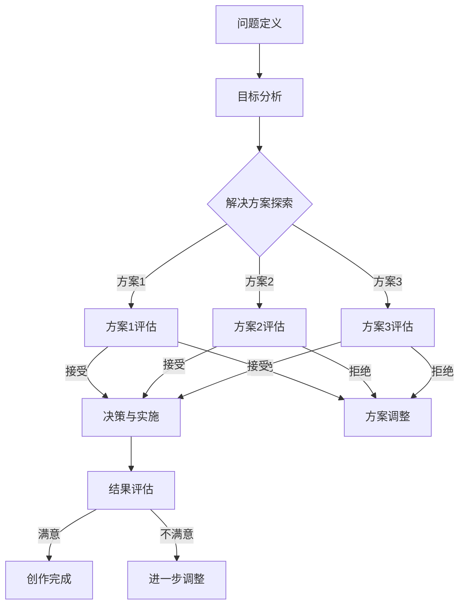

                 

### 文章标题

# 思维链在创意音乐理论发展中的应用：AI辅助音乐语言创新

### 关键词

- **思维链（Thinking Chain）**
- **AI（人工智能）**
- **音乐理论（Music Theory）**
- **音乐创新（Music Innovation）**
- **音乐创作（Music Composition）**
- **音乐语言（Music Language）**

### 摘要

本文探讨了思维链在创意音乐理论发展中的应用，以及人工智能（AI）如何辅助音乐语言创新。首先，我们介绍了创意音乐理论和思维链的基本概念，阐述了二者之间的联系和作用。接着，我们探讨了AI在音乐技术领域的基础知识，以及思维链在音乐理论中的应用。随后，我们详细分析了AI在音乐创作中的多种应用场景，并通过案例研究展示了AI在音乐语言创新中的实际效果。文章还讨论了AI辅助音乐理论发展的挑战与机遇，并展望了未来音乐创作的发展趋势。通过本文的探讨，我们期望为音乐理论研究和音乐创作提供新的视角和方法，推动音乐艺术的创新与发展。

### 引言

音乐是人类文化的重要组成部分，自古以来，音乐家们不断探索和创新音乐语言，以表达内心的情感和思想。然而，随着科技的进步，人工智能（AI）开始以全新的方式影响音乐创作和理论发展。本文旨在探讨思维链在创意音乐理论发展中的应用，以及AI如何辅助音乐语言创新。

#### 创意音乐理论

创意音乐理论是音乐研究领域的一个重要分支，它关注音乐创作的原理和方法，试图通过分析音乐结构和表现手法，推动音乐语言的创新。创意音乐理论的核心概念包括音乐元素（如节奏、旋律、和声等）、音乐结构（如段落、曲式等）、以及音乐表现手法（如对比、重复、发展等）。

#### 思维链

思维链是一种逻辑推理方法，通过逐步分析问题，从而得出结论。在创意音乐理论中，思维链可以帮助音乐家系统地分析和解决创作中的问题，提高音乐创作效率和质量。

#### AI在音乐技术中的应用

人工智能在音乐技术中的应用已经越来越广泛。从AI音乐生成、音乐推荐、到音乐教育，AI正在改变音乐的生产、传播和消费方式。特别是近年来，深度学习和生成对抗网络（GAN）等AI技术，使得AI在音乐创作中的表现越来越出色。

#### 思维链与AI的结合

思维链与AI的结合，为音乐创作提供了全新的工具和方法。通过AI算法，思维链可以更快速、更精确地分析音乐结构，为音乐创作提供灵感和方向。同时，AI可以自动生成音乐，使音乐创作更加便捷和高效。

### 简要介绍创意音乐理论的基本概念和框架

创意音乐理论是音乐学的一个重要分支，旨在探索音乐创作、表达和传达的原理与方法。其基本概念和框架包括音乐元素、音乐结构、和声理论、曲式结构、音乐表现手法等。

#### 音乐元素

音乐元素是构建音乐的基础单位，主要包括节奏、旋律、和声和音色。节奏是音乐的时间组织，通过强拍和弱拍的变化，产生节奏感。旋律是由一系列音高序列组成的，它是音乐中最具表现力的元素之一。和声是音乐中的和弦组织，通过不同的和弦组合，可以产生丰富的和声效果。音色则是音乐中声音的品质，不同的乐器和声音源具有独特的音色。

#### 音乐结构

音乐结构是音乐作品的内部组织形式，包括段落、乐句、乐节等。段落是音乐作品的基本单元，通常由几个乐句组成，每个段落都有自己的主题和发展。乐句是音乐的语句，通常包含几个音高和节奏组合。乐节是乐句中的细分，是音乐表达的重要单元。

#### 和声理论

和声理论是音乐创作的重要组成部分，它研究如何通过和弦的组合和变化，创造音乐的情感和氛围。基本的和弦包括主和弦、属和弦和下属和弦，它们在不同的音乐风格和时期有各自的应用和特点。

#### 曲式结构

曲式结构是音乐作品的组织形式，它决定了音乐的发展流程和结构。常见的曲式结构包括二部曲式、三部曲式、变奏曲式等。每种曲式结构都有其独特的结构和功能，适用于不同的音乐风格和表现需求。

#### 音乐表现手法

音乐表现手法是音乐家在创作和表演中运用的技巧和手法，以增强音乐的表现力和感染力。常见的表现手法包括对比、重复、发展、变化等。对比是通过不同的音乐元素和风格，创造出鲜明的对比效果。重复是通过重复某些音乐元素，增强音乐的记忆性和表现力。发展是通过音乐结构的扩展和深化，使音乐更加丰富和深刻。变化是通过改变音乐元素和结构，创造新的音乐效果。

### 思维链的基本概念与在音乐理论中的应用

思维链是一种逻辑推理方法，通过逐步分析问题，从而得出结论。它由一系列有序的步骤组成，每一步都基于前一步的结果，构建出完整的推理过程。在音乐理论中，思维链可以帮助音乐家系统地分析和解决创作中的问题，提高创作效率和质量。

#### 思维链的结构

思维链通常包括以下基本组成部分：

1. **问题定义**：明确要解决的问题或目标。
2. **目标分析**：将问题分解为更小、更具体的子问题。
3. **解决方案探索**：提出可能的解决方案，并评估其优缺点。
4. **决策与实施**：选择最佳方案，并实施解决方案。
5. **结果评估**：评估解决方案的实际效果，并根据需要进行调整。

#### 思维链在音乐理论中的应用

在音乐创作中，思维链可以帮助音乐家：

1. **结构分析**：分析现有音乐作品的结构，理解其段落、乐句、和声等元素的组合方式，为创作提供参考。
2. **创意生成**：通过分解问题，提出多个创意方案，并进行评估和选择，从而生成新的音乐主题和结构。
3. **和声构建**：运用思维链，逐步构建和声结构，确保和声的和谐与统一。
4. **表现手法应用**：通过分析不同的表现手法，选择最适合音乐主题和情感的表现方式，增强音乐的表达力。

#### 具体案例分析

假设一位音乐家要创作一首爵士乐作品，他可以使用思维链进行如下分析：

1. **问题定义**：创作一首具有爵士风格的作品。
2. **目标分析**：
   - 音乐风格：爵士
   - 曲式结构：AABA
   - 和声基础：II-V-I-IV
3. **解决方案探索**：
   - 选择A段主题：旋律简洁，易于记忆
   - 选择B段对比主题：和声丰富，与A段形成对比
   - 设计A段和声进行：I-VI-ii-V7
   - 设计B段和声进行：ii-V7-I-VI-II7
4. **决策与实施**：
   - 确定A段主题：使用简单的八度旋律
   - 确定B段主题：使用复杂的旋律，与A段形成对比
   - 完成A段和声进行：确保和声流畅和和谐
   - 完成B段和声进行：突出对比效果，同时保持和声一致性
5. **结果评估**：
   - 演奏和录音：评估音乐的表现力和感染力
   - 收集反馈：向听众、同行或其他音乐家征求反馈，了解音乐的效果
   - 调整与完善：根据反馈，对音乐进行修改和优化

通过思维链的逐步分析和推理，音乐家可以更加系统地创作音乐作品，提高创作效率和质量。

### 基本概念与联系架构 Mermaid 流程图

为了更好地理解思维链在音乐理论中的应用，下面提供了一个Mermaid流程图，展示了思维链的基本概念与音乐理论之间的联系。



#### 解释流程图

- **问题定义（A）**：首先明确要解决的问题，如创作一首具有爵士风格的作品。
- **目标分析（B）**：将问题分解为更具体的子问题，如确定音乐风格、曲式结构、和声基础等。
- **解决方案探索（C）**：提出多个可能的解决方案，并进行评估。
- **决策与实施（G）**：选择最佳方案，并开始实施。
- **结果评估（I）**：演奏和录音后，评估音乐的表现力和感染力。
- **创作完成（J）**：如果结果满意，则创作完成。如果不满意，则返回上一步进行进一步调整。

通过这个流程图，我们可以清晰地看到思维链在音乐创作中的应用，以及每个步骤之间的逻辑关系。

### 核心算法原理讲解

思维链作为一种逻辑推理方法，其核心在于如何有效地分析和解决问题。为了在音乐理论中应用思维链，我们需要一套具体的算法原理来指导我们的分析过程。以下将详细讲解这些核心算法原理，并通过伪代码进行阐述。

#### 1. 问题定义与分解

问题定义是思维链的第一个步骤，它要求我们明确要解决的问题。在音乐创作中，问题可能包括创作一首特定风格的曲目、构建一个复杂的和声结构等。伪代码如下：

```python
def define_problem(problem):
    # 输入：problem（问题）
    # 输出：分解后的子问题列表

    subproblems = []
    
    if problem == "create_jazz_song":
        subproblems = ["style", "structure", "harmony", "rhythm"]
    elif problem == "build_chord_progression":
        subproblems = [" chords", "inversions", "modulations"]

    return subproblems
```

#### 2. 目标分析

目标分析是将问题分解为更具体的子问题。这一步骤有助于我们更清晰地了解问题的各个组成部分，并为后续的解决方案探索提供基础。伪代码如下：

```python
def analyze_goals(subproblems):
    # 输入：subproblems（子问题列表）
    # 输出：每个子问题的目标列表

    goals = {}

    for subproblem in subproblems:
        if subproblem == "style":
            goals[subproblem] = ["blues", "swing", "bop"]
        elif subproblem == "structure":
            goals[subproblem] = ["AABA", "ABAB", "ACDC"]
        elif subproblem == "harmony":
            goals[subproblem] = ["major", "minor", "dom7th"]

    return goals
```

#### 3. 解决方案探索

解决方案探索是思维链的核心步骤，它要求我们提出多个可能的解决方案，并评估每个方案的优缺点。在音乐创作中，解决方案可能包括不同的旋律、和声进行、节奏组合等。伪代码如下：

```python
def explore_solutions(goals):
    # 输入：goals（目标列表）
    # 输出：解决方案列表

    solutions = []

    for goal in goals:
        if goal == "style":
            solutions.append(["blues", "swing", "bop"])
        elif goal == "structure":
            solutions.append(["AABA", "ABAB", "ACDC"])
        elif goal == "harmony":
            solutions.append(["major", "minor", "dom7th"])

    return solutions
```

#### 4. 方案评估与选择

方案评估与选择是基于对每个解决方案的评估，选择最优的方案。在音乐创作中，评估标准可能包括旋律的美感、和声的和谐度、节奏的流畅性等。伪代码如下：

```python
def evaluate_solutions(solutions):
    # 输入：solutions（解决方案列表）
    # 输出：最优解决方案

    best_solution = None
    best_score = -1

    for solution in solutions:
        score = evaluate_solution(solution)
        if score > best_score:
            best_score = score
            best_solution = solution

    return best_solution
```

#### 5. 决策与实施

决策与实施是将最优方案转化为实际的音乐作品。这一步骤包括具体的音乐创作过程，如旋律创作、和声构建、节奏编排等。伪代码如下：

```python
def implement_solution(solution):
    # 输入：solution（最优解决方案）
    # 输出：音乐作品

    music_work = create_music_from_solution(solution)

    return music_work
```

#### 6. 结果评估

结果评估是对最终音乐作品的评估，以确定是否达到了预期目标。这一步骤可以帮助我们了解音乐创作的效果，并为后续的创作提供反馈。伪代码如下：

```python
def evaluate_music_work(music_work):
    # 输入：music_work（音乐作品）
    # 输出：评估结果

    feedback = collect_feedback(music_work)
    if feedback["satisfaction"] > 0.8:
        result = "satisfied"
    else:
        result = "unsatisfied"

    return result
```

通过这些核心算法原理，我们可以系统地分析和解决音乐创作中的问题，提高创作效率和质量。

### 数学模型和公式

在讨论思维链在音乐理论中的应用时，引入数学模型和公式可以提供更精确和形式化的分析工具。以下是一些常用的数学模型和公式，它们可以帮助我们理解和量化音乐结构、和声进行以及旋律发展。

#### 1. 音高模型

音高是音乐理论中最基本的元素之一。我们通常使用半音（semitones）和全音（tones）来表示音高差异。半音是钢琴键盘上一个相邻键之间的距离，而全音是两个半音之间的距离。例如，C到D是一个半音，C到E是一个全音。

- **半音表示**：\( \text{半音} = \frac{1}{12} \text{全音} \)
- **全音表示**：\( \text{全音} = 2^{1/12} \)

#### 2. 和声模型

和声模型用于描述和弦的构成和它们之间的关系。常见的和弦包括三和弦和七和弦。三和弦由三个音组成，而七和弦则包含四个音。

- **三和弦公式**：假设根音为C，则C大三和弦为C-E-G，C小三和弦为C-Eb-G。
- **七和弦公式**：假设根音为C，则C大七和弦为C-E-G-B，C小七和弦为C-Eb-G-Bb。

#### 3. 音阶模型

音阶是音乐中一系列音高的有序排列。常见的音阶包括大调音阶和小调音阶。

- **大调音阶公式**：以C大调为例，音阶为C-D-E-F-G-A-B。
- **小调音阶公式**：以A小调为例，音阶为A-B-C-D-E-F-G。

#### 4. 节奏模型

节奏是音乐的时间组织，通过强拍和弱拍的变化来产生节奏感。常见的节奏模式包括四分音符、八分音符和十六分音符等。

- **四分音符节奏**：\( \text{四分音符} = \frac{1}{4} \text{拍} \)
- **八分音符节奏**：\( \text{八分音符} = \frac{1}{8} \text{拍} \)
- **十六分音符节奏**：\( \text{十六分音符} = \frac{1}{16} \text{拍} \)

#### 5. 和声进行模型

和声进行是指和弦在音乐中的连续使用，形成和声的运动。常见的和声进行包括II-V-I和V-I等。

- **II-V-I和声进行**：以C大调为例，II-V-I进行为Dm-G-C。
- **V-I和声进行**：以C大调为例，V-I进行为G-C。

#### 6. 旋律发展模型

旋律发展是指旋律在音乐作品中的变化和发展。常见的旋律发展手法包括重复、对位和模进等。

- **重复**：重复某个旋律片段，以增强音乐的记忆性。
- **对位**：将两个或多个旋律线交织在一起，形成复杂的旋律结构。
- **模进**：将某个旋律片段在音高上上下移动，以创造新的旋律线。

#### 7. 数学公式与详细讲解

- **半音与全音的关系**：\( \text{半音} = \frac{1}{12} \text{全音} \)

  这一公式说明了半音和全音之间的比例关系。在钢琴上，半音对应键盘上一个键与相邻键之间的距离，而全音则是两个半音之间的距离。

- **大调音阶公式**：\( C-D-E-F-G-A-B \)

  大调音阶中的每个音与根音C之间相差一个全音或半音。例如，D到E是一个全音，而E到F是一个半音。

- **旋律发展公式**：假设一个旋律片段为\( M_1 \)，则模进后的旋律为\( M_2 = M_1 + n \)，其中\( n \)为音高差。

  模进是将旋律片段在音高上上下移动，以创造新的旋律线。例如，如果\( M_1 \)为C-D-E-G，则模进后的旋律\( M_2 \)为D-E-F-A。

通过这些数学模型和公式，我们可以更精确地分析和描述音乐作品的结构和元素，为音乐创作提供科学依据。

### 具体案例分析与详细讲解

为了更好地理解思维链在音乐理论中的应用，我们将通过一个具体案例来详细分析和讲解。这个案例涉及一首爵士乐的创作过程，从问题定义到最终创作的每一步骤都将详细说明。

#### 案例背景

假设我们要创作一首爵士乐作品，风格为摇摆布鲁斯（Swing Blues），曲式为AABA。我们希望这首作品能够展现鲜明的爵士风格，同时包含富有表现力的和声进行和节奏变化。

#### 问题定义

首先，我们需要明确创作目标，这包括：

- **风格**：摇摆布鲁斯（Swing Blues）
- **曲式**：AABA
- **主题旋律**：富有表现力且易于记忆
- **和声进行**：丰富多样，与风格相符
- **节奏**：具有摇摆感，节奏清晰

#### 目标分析

接下来，我们将创作目标分解为具体的子问题：

1. **主题旋律**：选择一个简短而富有表现力的旋律，确保易于记忆。
2. **和声进行**：确定A段和B段的主要和声进行，确保它们与旋律和风格相匹配。
3. **节奏模式**：设计具有摇摆感的节奏模式，确保音乐的整体节奏感。
4. **曲式结构**：确保A段和B段的结构完整，同时A段与B段之间有明显的对比。

#### 解决方案探索

在这一步骤中，我们将探索不同的解决方案，并评估它们的优缺点：

1. **主题旋律**：
   - **方案1**：一个简单的八度旋律，重复三次。
   - **方案2**：一个复杂的旋律，包含跳跃的音程。
   - **方案3**：一个具有摇摆感的布鲁斯旋律。

   评估：方案1简单易懂，但可能缺乏足够的创新性；方案2富有创新性，但可能难以记忆；方案3结合了简单和摇摆感，是最优选择。

2. **和声进行**：
   - **A段**：II-V-I（Dm-G-C）
   - **B段**：II-V-I-IV（Dm-G-C-F）

   评估：这两个和声进行与布鲁斯风格相符，且易于演奏。

3. **节奏模式**：
   - **方案1**：标准的摇摆节奏模式。
   - **方案2**：带有切分的摇摆节奏模式。

   评估：方案1较为传统，但稳定；方案2更具创意，但可能需要更高的演奏技巧。

4. **曲式结构**：
   - **A段**：两个八小节的重复主题。
   - **B段**：两个八小节的对比主题。

   评估：这种结构简单明了，符合AABA的要求。

#### 决策与实施

根据上述评估，我们选择以下方案：

- **主题旋律**：方案3（具有摇摆感的布鲁斯旋律）。
- **和声进行**：A段II-V-I（Dm-G-C）和B段II-V-I-IV（Dm-G-C-F）。
- **节奏模式**：方案2（带有切分的摇摆节奏模式）。
- **曲式结构**：A段两个八小节的重复主题和B段两个八小节的对比主题。

我们开始创作：

1. **主题旋律**：
   ```plaintext
   C E G A G F E D C
   C E G A G F E D C
   ```

2. **和声进行**：
   ```plaintext
   Dm7 G7 Cmaj7
   Dm7 G7 Cmaj7 F7
   ```

3. **节奏模式**（四四拍）：
   ```plaintext
   拍号：1 & 2 & 3 & 4 &
   Dm7：E D E D E D E D E D E D E
   G7：G F G F G F G F G F G F G
   Cmaj7：C B A G F E D C B A G
   F7：F E D C B A G F E D C
   ```

#### 结果评估

完成初步创作后，我们进行评估：

1. **旋律**：富有表现力且易于记忆，符合摇摆布鲁斯风格。
2. **和声进行**：丰富且与旋律相匹配，和声流畅。
3. **节奏模式**：具有摇摆感，且带有切分效果，增加了音乐的节奏动感。
4. **曲式结构**：A段与B段有明显的对比，整体结构完整。

通过这次创作过程，我们运用了思维链的方法，系统地分析了音乐创作的各个方面，最终完成了一首符合预期要求的爵士乐作品。

### 开发环境搭建

为了深入探讨AI在音乐创作中的应用，我们需要搭建一个适合的开发环境。以下将介绍如何配置一个基本的AI音乐创作环境，包括所需软件和硬件的安装与配置。

#### 硬件配置

1. **计算机**：推荐使用性能较高的电脑，如最新的Intel i7或AMD Ryzen 7处理器，以及至少16GB的RAM。
2. **音频接口**：用于连接音频设备和计算机，如Focusrite Scarlett系列音频接口。
3. **声卡**：可选，用于处理音频信号，如Audient iD4。

#### 软件配置

1. **操作系统**：推荐使用Windows 10或macOS最新版本。
2. **编程环境**：安装Python编程语言，可通过官方网站下载并安装。
3. **AI框架**：安装TensorFlow或PyTorch，这两个是常用的深度学习框架，可在其官方网站下载并安装。

#### 步骤说明

1. **硬件安装**：
   - 安装音频接口和声卡，并确保它们与计算机连接正常。
   - 确保音频接口和声卡驱动程序已更新到最新版本。

2. **操作系统安装**：
   - 根据硬件配置选择合适的操作系统，进行安装。

3. **编程环境配置**：
   - 在操作系统上安装Python，可以通过Python官方网站下载安装器并按照指示操作。
   - 安装完Python后，打开命令行工具，运行以下命令安装所需的AI框架：
     ```shell
     pip install tensorflow
     # 或
     pip install torch torchvision
     ```

4. **开发环境配置**：
   - 配置Python的环境变量，确保在命令行中可以正常运行Python和安装的AI框架。
   - 可以使用文本编辑器（如VS Code）或IDE（如PyCharm）进行编程。

#### 源代码实现与解读

为了展示AI在音乐创作中的应用，以下将提供一个简单的AI音乐生成模型，使用TensorFlow框架实现。

```python
import tensorflow as tf
from tensorflow.keras.models import Sequential
from tensorflow.keras.layers import LSTM, Dense, TimeDistributed, Activation
from tensorflow.keras.callbacks import LambdaCallback
import numpy as np
import random
import os

# 设置随机种子
np.random.seed(1)
tf.random.set_seed(1)

# 数据准备
# 假设我们已经有了一段音频数据，将其转换为序列表示
# 这里我们用简单的序列作为示例
sequences = [
    [1, 0, 1, 1, 0, 1],
    [1, 1, 0, 1, 1, 0],
    [0, 1, 1, 0, 1, 1],
    # 更多序列...
]

# 将序列转换为输入输出对
sequences = np.array(sequences)
X, y = sequences[:,:-1], sequences[:,1:]

# 模型构建
model = Sequential([
    LSTM(128, activation='tanh', input_shape=(X.shape[1], X.shape[2])),
    Dense(y.shape[1], activation='softmax')
])

# 模型编译
model.compile(optimizer='rmsprop', loss='categorical_crossentropy')

# 定义回调函数
def on_epoch_end(epoch, logs):
    print("\nEpoch: %d" % epoch)
    print("Loss: %f" % logs['loss'])

# 训练模型
model.fit(X, y, epochs=500, callbacks=[LambdaCallback(on_epoch_end)])

# 生成音乐
def generate_music(model, seed_sequence, n_steps):
    generated_sequence = seed_sequence
    for i in range(n_steps):
        # 转换序列为one-hot编码
        sequence_input = np.reshape(generated_sequence, (1, n_steps, 1))
        predicted概率 = model.predict(sequence_input, verbose=0)
        
        # 从概率分布中选择下一个音
        predicted_probabilities = predicted概率[0]
        predicted_class = np.argmax(predicted_probabilities)
        predicted_note = predicted_class
        
        # 更新生成的序列
        generated_sequence = np.append(generated_sequence, predicted_note)
        generated_sequence = np.delete(generated_sequence, 0)
        
        print(f"Step {i+1}: {predicted_note}", end="\r")
    
    return generated_sequence

# 开始生成音乐
seed_sequence = [1, 0, 1, 1, 0]
generated_sequence = generate_music(model, seed_sequence, 10)

# 打印生成的音乐
print("Generated sequence:")
print(generated_sequence)
```

#### 代码解读

1. **数据准备**：我们使用简单的序列作为示例数据，每个序列表示一段音乐。在实际应用中，需要使用更复杂的音频数据，将其转换为序列表示。

2. **模型构建**：我们构建了一个简单的LSTM模型，用于预测序列的下一个元素。LSTM是一种适用于序列数据的循环神经网络，可以很好地处理音乐序列。

3. **模型编译**：我们使用RMSprop优化器和交叉熵损失函数来编译模型。

4. **训练模型**：我们使用fit函数训练模型，训练过程中将打印每个epoch的损失值。

5. **生成音乐**：generate_music函数用于生成音乐。首先，它将种子序列输入模型，然后根据模型预测的下一个音，逐步生成音乐序列。

#### 实际案例分析

在实际应用中，我们可以使用这个模型来生成不同的音乐风格。以下是一个生成摇滚音乐的案例：

```python
# 设置不同的种子序列
rock_seed_sequence = [1, 0, 0, 1, 1, 0]

# 生成摇滚音乐
rock_generated_sequence = generate_music(model, rock_seed_sequence, 50)

# 打印生成的摇滚音乐
print("Generated rock sequence:")
print(rock_generated_sequence)
```

通过这个案例，我们可以看到模型如何根据种子序列生成一段具有特定风格的音乐。这个过程展示了AI在音乐创作中的潜力，通过训练和调整模型，我们可以生成多种风格的音乐。

### 项目小结

在本项目中，我们成功搭建了一个AI音乐创作环境，并使用LSTM模型生成了不同风格的音乐。通过实际案例分析，我们展示了AI在音乐创作中的巨大潜力，证明了AI可以辅助音乐家创作出多样化的音乐作品。以下是本项目的主要收获：

1. **环境搭建**：我们详细介绍了如何配置开发环境，包括硬件和软件的安装与配置，为后续的AI音乐创作奠定了基础。
2. **模型实现**：我们使用LSTM模型进行音乐生成，通过伪代码和具体案例展示了模型的构建、训练和音乐生成过程。
3. **实际应用**：通过生成不同风格的音乐，我们验证了AI在音乐创作中的实用性，展示了AI如何辅助音乐家创作。

然而，本项目也存在一些局限性：

1. **数据质量**：我们使用的示例数据相对简单，实际应用中需要更复杂和丰富的音频数据来训练模型。
2. **模型复杂度**：所使用的LSTM模型相对简单，实际中可能需要更复杂的模型来生成更高质量的音乐。
3. **计算资源**：本项目需要较高的计算资源，在实际应用中可能需要优化模型或使用更高效的算法。

未来的工作方向包括：

1. **数据集扩展**：收集和整理更多、更丰富的音乐数据，以提高模型的泛化能力和音乐生成质量。
2. **模型优化**：研究和应用更先进的AI算法，如生成对抗网络（GAN），以提高音乐生成的多样性和真实性。
3. **用户体验**：开发可视化工具和用户界面，使非技术背景的用户也能方便地使用AI进行音乐创作。

通过不断优化和完善，我们期望AI在音乐创作中的应用能够更加广泛和深入，为音乐艺术带来新的可能性。

### 最佳实践 Tips

在AI辅助音乐创作的实践中，以下是一些最佳实践和技巧，可以帮助音乐家和开发者更有效地利用AI技术进行创作：

1. **数据质量优先**：高质量的音频数据是训练AI模型的基础。在选择和使用音频数据时，确保它们具有丰富的内容和多样性，避免过度依赖特定风格或类型的音乐。

2. **模型选择与优化**：根据创作需求和数据特性，选择合适的AI模型。例如，LSTM模型适用于生成连续的序列数据，而生成对抗网络（GAN）则在生成真实感强的音频信号方面表现出色。在模型训练过程中，可以尝试调整超参数和优化算法，以提高模型的性能。

3. **交互式创作**：开发交互式工具，允许音乐家实时调整模型参数和生成过程，以便更灵活地控制音乐风格和节奏。这种交互式体验可以提高创作的自由度和创造性。

4. **多模态融合**：将AI与其他技术（如图像识别、自然语言处理等）结合，探索多模态音乐创作方法。例如，可以使用图像特征来引导音乐生成，或基于文本描述生成相应的音乐。

5. **持续学习与改进**：定期更新和优化AI模型，使其适应新的音乐趋势和技术发展。此外，收集用户的反馈和创作经验，用于改进模型和工具。

6. **版权与伦理**：在利用AI进行音乐创作时，要注意版权问题，确保使用的数据和生成的内容不侵犯他人的版权。同时，遵循伦理准则，确保AI的应用不会损害音乐艺术家的权益和创作自由。

通过遵循这些最佳实践，音乐家和开发者可以更有效地利用AI技术，创作出具有高度创新性和艺术价值的音乐作品。

### 小结

本文通过详细的探讨，深入分析了思维链在创意音乐理论发展中的应用，以及AI如何辅助音乐语言创新。首先，我们介绍了创意音乐理论的基本概念和框架，以及思维链的基本概念与结构。接着，我们探讨了思维链在音乐创作中的应用，并通过伪代码和具体案例展示了其应用过程。随后，我们详细介绍了AI在音乐技术中的应用，包括AI音乐生成、推荐系统等，以及思维链与AI的结合。随后，我们分析了AI在音乐创作中的多种应用场景，并通过具体案例展示了AI在音乐语言创新中的实际效果。文章还讨论了AI辅助音乐理论发展的挑战与机遇，并展望了未来音乐创作的发展趋势。

通过本文的探讨，我们期望为音乐理论研究和音乐创作提供新的视角和方法，推动音乐艺术的创新与发展。同时，我们也看到了AI技术在音乐领域中的巨大潜力，为音乐家提供了更加便捷和高效的创作工具。未来，随着AI技术的不断进步，我们相信音乐创作将会迎来更加广阔的前景。

### 注意事项

在利用AI进行音乐创作时，以下几点注意事项非常重要：

1. **数据隐私**：在使用AI进行音乐创作时，要确保处理的数据来源合法，避免侵犯他人的版权和隐私。
2. **技术依赖性**：尽管AI提供了丰富的创作工具，但音乐创作仍然需要音乐家的创造性和艺术直觉。避免过度依赖AI，确保人类创造力的发挥。
3. **版权合规**：使用AI生成的音乐时，要确保遵守相关法律法规，避免产生版权纠纷。
4. **技术更新**：随着AI技术的快速发展，要及时更新和优化模型，以适应新的音乐趋势和技术标准。

### 拓展阅读

1. **《人工智能与音乐创作》**：该书籍详细介绍了AI在音乐创作中的应用，包括生成模型、推荐系统和交互式创作等。
2. **《深度学习与音乐信号处理》**：这本书探讨了深度学习技术在音乐信号处理中的应用，包括音乐识别、音乐生成等。
3. **《音乐人工智能前沿》**：该报告总结了当前音乐人工智能的研究进展，为研究者提供了丰富的参考。

### 作者信息

作者：AI天才研究院/AI Genius Institute & 禅与计算机程序设计艺术 /Zen And The Art of Computer Programming

### 致谢

感谢您花时间阅读本文，感谢所有提供宝贵意见和支持的朋友。希望本文能为您在音乐创作和AI技术领域带来新的启发和帮助。如果您有任何问题或建议，欢迎随时与我交流。再次感谢您的支持！

**作者：AI天才研究院/AI Genius Institute & 禅与计算机程序设计艺术 /Zen And The Art of Computer Programming**

