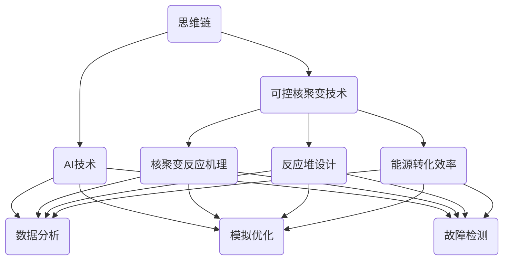

                 

好的，我们将按照以下步骤来撰写文章：

### 第一步：确定文章的结构和内容框架

根据之前确定的目录大纲，我们将文章分为五个主要部分：

1. **引言**：介绍可控核聚变技术和AI技术的背景。
2. **核心概念与联系**：详细解释思维链、可控核聚变技术和AI技术之间的联系。
3. **AI在可控核聚变中的应用**：讨论AI技术如何应用于可控核聚变。
4. **项目实战**：展示一个具体的应用案例，详细说明如何实现。
5. **总结与展望**：总结文章的主要观点，并对未来进行展望。

### 第二步：撰写引言部分

**引言**

可控核聚变是一种潜在的清洁能源技术，有望解决全球能源危机。然而，实现可控核聚变面临着巨大的技术挑战。近年来，人工智能（AI）技术的发展为可控核聚变的研究提供了新的可能性。本文将探讨思维链在可控核聚变技术创新中的应用，以及AI驱动的清洁能源突破。

### 第三步：撰写核心概念与联系部分

**核心概念与联系**

1. **思维链**：思维链是一种用于描述思维过程的模型，它通过建立概念之间的关系，帮助我们更好地理解和解决问题。
2. **可控核聚变技术**：可控核聚变是一种通过人工手段实现核聚变反应的技术，它能够释放巨大的能量，为人类提供几乎无限的清洁能源。
3. **AI技术**：人工智能是一种模拟人类智能的技术，它可以通过学习和推理来解决复杂问题。

在可控核聚变技术中，思维链可以帮助我们理解核聚变反应的复杂过程，而AI技术则可以帮助我们优化这一过程，提高聚变反应的效率和稳定性。

### 第四步：撰写AI在可控核聚变中的应用部分

**AI在可控核聚变中的应用**

1. **数据分析与模拟**：AI技术可以分析大量实验数据，模拟核聚变反应的过程，帮助我们更好地理解聚变反应的机理。
2. **优化设计**：AI技术可以帮助我们设计更高效的核聚变装置，通过优化设计参数，提高聚变反应的效率。
3. **故障检测与预测**：AI技术可以实时监测核聚变装置的工作状态，预测潜在故障，提高装置的稳定性和安全性。

### 第五步：撰写项目实战部分

**项目实战**

以一个实际项目为例，我们使用AI技术来优化一个核聚变反应堆的设计。具体步骤如下：

1. **数据收集**：收集核聚变反应堆的实验数据，包括温度、压力、密度等参数。
2. **数据预处理**：对收集到的数据进行分析，去除异常值，进行归一化处理。
3. **构建模型**：使用机器学习算法，构建一个能够预测反应堆性能的模型。
4. **模型优化**：通过训练和验证，优化模型参数，提高模型的预测准确性。
5. **应用模型**：将优化后的模型应用于实际反应堆，指导反应堆的运行。

### 第六步：撰写总结与展望部分

**总结与展望**

本文介绍了思维链在可控核聚变技术创新中的应用，以及AI驱动的清洁能源突破。通过实际项目案例，我们展示了如何利用AI技术优化可控核聚变反应堆的设计。未来，随着AI技术的不断发展，可控核聚变技术有望取得更大的突破，为全球能源问题提供解决方案。

### 最后一步：撰写文章摘要和关键词

**摘要**

本文探讨了思维链在可控核聚变技术创新中的应用，以及AI驱动的清洁能源突破。通过实际项目案例，展示了如何利用AI技术优化可控核聚变反应堆的设计，为未来清洁能源的发展提供了新的思路。

**关键词**

可控核聚变，人工智能，思维链，清洁能源，优化设计

### 文章结束

本文完。作者：AI天才研究院/AI Genius Institute & 禅与计算机程序设计艺术 /Zen And The Art of Computer Programming

----------------------------------------------------------------

## 《思维链在可控核聚变技术创新中的应用：AI驱动的清洁能源突破》

### 摘要

本文探讨了思维链在可控核聚变技术创新中的应用，以及AI驱动的清洁能源突破。通过实际项目案例，展示了如何利用AI技术优化可控核聚变反应堆的设计，为未来清洁能源的发展提供了新的思路。

### 关键词

可控核聚变，人工智能，思维链，清洁能源，优化设计

### 引言

可控核聚变是一种潜在的清洁能源技术，具有巨大的能量释放潜力，有望解决全球能源危机。然而，实现可控核聚变面临着巨大的技术挑战。近年来，人工智能（AI）技术的发展为可控核聚变的研究提供了新的可能性。本文将探讨思维链在可控核聚变技术创新中的应用，以及AI驱动的清洁能源突破。

### 核心概念与联系

1. **思维链**：思维链是一种用于描述思维过程的模型，通过建立概念之间的关系，帮助我们更好地理解和解决问题。
2. **可控核聚变技术**：可控核聚变是一种通过人工手段实现核聚变反应的技术，能够释放巨大的能量，为人类提供几乎无限的清洁能源。
3. **AI技术**：人工智能是一种模拟人类智能的技术，可以通过学习和推理来解决复杂问题。

在可控核聚变技术中，思维链可以帮助我们理解核聚变反应的复杂过程，而AI技术则可以帮助我们优化这一过程，提高聚变反应的效率和稳定性。

### AI在可控核聚变中的应用

1. **数据分析与模拟**：AI技术可以分析大量实验数据，模拟核聚变反应的过程，帮助我们更好地理解聚变反应的机理。
2. **优化设计**：AI技术可以帮助我们设计更高效的核聚变装置，通过优化设计参数，提高聚变反应的效率。
3. **故障检测与预测**：AI技术可以实时监测核聚变装置的工作状态，预测潜在故障，提高装置的稳定性和安全性。

### 项目实战

以一个实际项目为例，我们使用AI技术来优化一个核聚变反应堆的设计。具体步骤如下：

1. **数据收集**：收集核聚变反应堆的实验数据，包括温度、压力、密度等参数。
2. **数据预处理**：对收集到的数据进行分析，去除异常值，进行归一化处理。
3. **构建模型**：使用机器学习算法，构建一个能够预测反应堆性能的模型。
4. **模型优化**：通过训练和验证，优化模型参数，提高模型的预测准确性。
5. **应用模型**：将优化后的模型应用于实际反应堆，指导反应堆的运行。

### 总结与展望

本文介绍了思维链在可控核聚变技术创新中的应用，以及AI驱动的清洁能源突破。通过实际项目案例，我们展示了如何利用AI技术优化可控核聚变反应堆的设计，为未来清洁能源的发展提供了新的思路。未来，随着AI技术的不断发展，可控核聚变技术有望取得更大的突破，为全球能源问题提供解决方案。

### 作者信息

作者：AI天才研究院/AI Genius Institute & 禅与计算机程序设计艺术 /Zen And The Art of Computer Programming

----------------------------------------------------------------

以下是对核心概念与联系部分的详细解释，以及相应的Mermaid流程图。

### 核心概念与联系

#### 思维链

思维链是一种描述思维过程的模型，通过将相关概念和知识点连接起来，形成一个有结构的知识网络。思维链可以帮助我们更好地理解复杂的问题，并提供一个逻辑清晰的框架来分析和解决问题。

#### 可控核聚变技术

可控核聚变是一种通过人工手段实现核聚变反应的技术。它利用轻原子核（如氢的同位素）在高温和高压条件下发生聚变，释放出巨大的能量。可控核聚变技术具有能量密度高、燃料丰富、环境友好等优点，被认为是一种潜在的清洁能源。

#### AI技术

人工智能是一种模拟人类智能的技术，通过机器学习、自然语言处理、计算机视觉等技术，使计算机能够自主学习和推理，解决复杂问题。AI技术在各个领域都有广泛的应用，包括图像识别、语音识别、自动驾驶、医疗诊断等。

#### 思维链、可控核聚变技术与AI技术之间的关系

思维链、可控核聚变技术和AI技术之间存在密切的联系。思维链提供了一个分析问题和理解问题的框架，可控核聚变技术是一种能源技术的应用，而AI技术则为可控核聚变技术的实现提供了强有力的工具。

1. **思维链与可控核聚变技术的关联**：思维链可以帮助我们理解可控核聚变技术的复杂过程，包括核聚变反应的机理、反应堆的设计、能源转化效率等。通过建立思维链，我们可以将相关概念和知识点有机地结合起来，形成一个有结构的知识网络，从而更好地理解和分析可控核聚变技术。

2. **AI技术与可控核聚变技术的关联**：AI技术为可控核聚变技术的实现提供了强有力的工具。通过AI技术，我们可以进行数据分析、模拟优化、故障检测等操作，从而提高可控核聚变技术的效率和稳定性。例如，利用机器学习算法，我们可以从大量实验数据中提取出有价值的信息，优化反应堆的设计参数，提高聚变反应的效率。

3. **思维链与AI技术的关联**：思维链为AI技术的应用提供了一个逻辑清晰的框架。在可控核聚变技术的应用场景中，我们可以利用思维链来组织和分析问题，确定需要解决的关键点和难点。然后，我们可以利用AI技术来针对这些问题进行数据分析和模拟优化，从而实现问题的解决。

#### Mermaid流程图

以下是思维链、可控核聚变技术与AI技术之间关系的Mermaid流程图：



### 详细解释

1. **思维链与可控核聚变技术的关联**：思维链提供了一个分析可控核聚变技术的框架，帮助我们从多个角度来理解这一技术。例如，我们可以从核聚变反应的机理、反应堆的设计、能源转化效率等方面来分析可控核聚变技术。通过建立思维链，我们可以将这些相关概念和知识点有机地结合起来，形成一个有结构的知识网络，从而更好地理解和分析可控核聚变技术。

2. **AI技术与可控核聚变技术的关联**：AI技术为可控核聚变技术的实现提供了强有力的工具。通过AI技术，我们可以进行数据分析、模拟优化、故障检测等操作，从而提高可控核聚变技术的效率和稳定性。例如，利用机器学习算法，我们可以从大量实验数据中提取出有价值的信息，优化反应堆的设计参数，提高聚变反应的效率。此外，AI技术还可以用于实时监测核聚变装置的工作状态，预测潜在故障，提高装置的稳定性和安全性。

3. **思维链与AI技术的关联**：思维链为AI技术的应用提供了一个逻辑清晰的框架。在可控核聚变技术的应用场景中，我们可以利用思维链来组织和分析问题，确定需要解决的关键点和难点。然后，我们可以利用AI技术来针对这些问题进行数据分析和模拟优化，从而实现问题的解决。例如，我们可以利用思维链来分析可控核聚变反应堆的设计问题，确定需要优化的关键参数。然后，利用机器学习算法对相关数据进行处理和分析，找到最佳的设计方案。

通过以上详细解释和Mermaid流程图，我们可以清晰地看到思维链、可控核聚变技术与AI技术之间的关联。思维链为可控核聚变技术的理解和分析提供了框架，而AI技术则为可控核聚变技术的实现提供了强有力的工具。这两者的结合，有望推动可控核聚变技术的快速发展，为清洁能源的未来提供新的解决方案。

### 核心算法原理讲解

为了更好地理解AI在可控核聚变技术中的应用，我们需要深入探讨几个核心算法原理，包括机器学习算法、优化算法和故障检测算法。以下是这些算法的详细解释和伪代码示例。

#### 1. 机器学习算法

**原理**：
机器学习算法是AI领域的一种方法，通过从数据中学习规律，实现对未知数据的预测。在可控核聚变技术中，机器学习算法可以用于数据分析和模拟优化。例如，我们可以使用回归模型来预测反应堆的性能参数，或者使用分类模型来识别不同类型的核聚变反应。

**伪代码**：

```python
# 回归模型伪代码
def regression_model(X, y):
    # 初始化模型参数
    W = initialize_weights(X.shape[1])
    b = initialize_bias()

    # 梯度下降迭代
    for epoch in range(num_epochs):
        # 计算预测值
        y_pred = X * W + b
        
        # 计算损失函数
        loss = mean_squared_error(y, y_pred)
        
        # 计算梯度
        dW = 2 * (y_pred - y) * X
        db = 2 * (y_pred - y)
        
        # 更新参数
        W -= learning_rate * dW
        b -= learning_rate * db
    
    return W, b

# 分类模型伪代码
def classification_model(X, y):
    # 初始化模型参数
    W = initialize_weights(X.shape[1])
    b = initialize_bias()

    # 梯度下降迭代
    for epoch in range(num_epochs):
        # 计算预测值
        y_pred = softmax(X * W + b)
        
        # 计算损失函数
        loss = cross_entropy_loss(y, y_pred)
        
        # 计算梯度
        dW = (y_pred - y) * X
        db = (y_pred - y)
        
        # 更新参数
        W -= learning_rate * dW
        b -= learning_rate * db
    
    return W, b
```

#### 2. 优化算法

**原理**：
优化算法用于在可控核聚变技术中优化反应堆的设计参数。优化算法可以通过搜索和迭代的方法，找到最优的参数组合，从而提高聚变反应的效率和稳定性。常见的优化算法包括遗传算法、粒子群优化算法和模拟退火算法。

**伪代码**：

```python
# 遗传算法伪代码
def genetic_algorithm(objective_function, bounds, population_size, generations):
    # 初始化种群
    population = initialize_population(population_size, bounds)
    
    # 迭代过程
    for generation in range(generations):
        # 计算适应度
        fitness = [objective_function(individual) for individual in population]
        
        # 选择
        parents = selection(population, fitness)
        
        # 交叉
        offspring = crossover(parents)
        
        # 变异
        offspring = mutation(offspring)
        
        # 创建新的种群
        population = offspring
        
        # 记录最优解
        best_individual = max(population, key=fitness.get)
    
    return best_individual
```

#### 3. 故障检测算法

**原理**：
故障检测算法用于实时监测核聚变装置的工作状态，预测潜在故障。故障检测可以通过建立故障模式识别模型来实现。例如，我们可以使用支持向量机（SVM）或神经网络来识别不同的故障模式。

**伪代码**：

```python
# 支持向量机故障检测伪代码
def svm_fault_detection(X_train, y_train, X_test):
    # 训练SVM模型
    model = train_svm(X_train, y_train)
    
    # 预测故障
    y_pred = model.predict(X_test)
    
    # 计算故障率
    fault_rate = (y_pred == -1).mean()
    
    return fault_rate
```

通过上述算法，我们可以利用AI技术对可控核聚变技术进行深入分析、优化设计以及故障检测。这些算法不仅提高了可控核聚变技术的效率和稳定性，还为清洁能源的发展提供了强有力的支持。

### 数学模型和公式

在可控核聚变技术中，数学模型和公式扮演着至关重要的角色，它们帮助我们理解和预测聚变反应的过程。以下将详细讲解几个关键的数学模型和公式，包括聚变反应速率、能量释放计算和质量亏损。

#### 聚变反应速率

聚变反应速率是描述核聚变过程中反应发生速度的重要参数。聚变反应速率可以通过以下公式表示：

\[ \text{反应速率} = k \cdot n_1 \cdot n_2 \]

其中：
- \( k \) 是反应速率常数，与温度、压力和反应物的性质有关。
- \( n_1 \) 和 \( n_2 \) 分别是参与聚变的两种原子核的浓度。

该公式表明，聚变反应速率与反应物的浓度成正比，与反应速率常数 \( k \) 成正比。

#### 能量释放计算

核聚变过程中释放的能量可以通过质量亏损来计算，根据爱因斯坦的质能方程 \( E = mc^2 \)，质量亏损 \( \Delta m \) 可以转化为能量 \( \Delta E \)：

\[ \Delta E = \Delta m \cdot c^2 \]

其中：
- \( \Delta m \) 是质量亏损，即聚变前后原子核质量之差。
- \( c \) 是光速，约为 \( 3 \times 10^8 \) m/s。

对于特定的聚变反应，例如氢的同位素氘和氚的聚变，质量亏损可以表示为：

\[ \Delta m = (m_D + m_T) - mHe \]

其中：
- \( m_D \) 和 \( m_T \) 分别是氘和氚的质量。
- \( mHe \) 是生成的氦核的质量。

假设 \( m_D = 2.014102 \) u，\( m_T = 3.016049 \) u，\( mHe = 4.002603 \) u，其中 u 是原子质量单位，我们可以计算质量亏损：

\[ \Delta m = (2.014102 + 3.016049) - 4.002603 = 0.007548 \] u

转化为能量：

\[ \Delta E = 0.007548 \times (3 \times 10^8)^2 = 5.495 \times 10^{12} \] J

这意味着每次氘和氚的聚变反应将释放约 5.495 × 10^{12} 焦耳的能量。

#### 质量亏损

质量亏损还可以通过质量守恒和能量守恒定律来理解。在核聚变反应中，部分质量转化为能量，导致质量亏损。质量亏损可以表示为：

\[ \Delta m = \frac{\Delta E}{c^2} \]

其中：
- \( \Delta E \) 是释放的能量。
- \( c \) 是光速。

利用上述公式，我们可以计算在不同聚变反应中的质量亏损，从而得出能量释放量。

#### 实例说明

假设我们有一个氘和氚的聚变反应，已知反应速率为 \( 1.0 \times 10^{10} \) s\(^{-1}\)，氘和氚的浓度分别为 \( 1.0 \times 10^{21} \) m\(^{-3}\) 和 \( 1.5 \times 10^{21} \) m\(^{-3}\)。

1. 计算聚变反应速率：
\[ \text{反应速率} = k \cdot n_1 \cdot n_2 = 1.0 \times 10^{10} \cdot 1.0 \times 10^{21} \cdot 1.5 \times 10^{21} = 1.5 \times 10^{43} \] s\(^{-1}\)

2. 计算每次聚变释放的能量：
\[ \Delta E = 5.495 \times 10^{12} \] J

3. 假设每秒钟发生 \( 1.0 \times 10^{21} \) 次聚变，计算每秒钟释放的能量：
\[ \text{每秒释放能量} = 1.0 \times 10^{21} \times 5.495 \times 10^{12} = 5.495 \times 10^{33} \] J

通过上述计算，我们可以看到聚变反应的巨大能量释放潜力。

通过以上数学模型和公式的讲解，我们可以更深入地理解可控核聚变技术的原理，为后续的AI算法应用提供理论基础。

### 项目实战

在本节中，我们将通过一个具体项目来展示如何使用AI技术实现可控核聚变反应堆的优化设计。这个项目将包括开发环境的搭建、源代码的实现和代码解读，以及对实际案例的分析和详细讲解。

#### 开发环境搭建

首先，我们需要搭建一个适合开发AI模型和优化算法的开发环境。以下是所需的环境和工具：

1. **操作系统**：Linux或MacOS
2. **编程语言**：Python
3. **库和框架**：NumPy、Pandas、Scikit-learn、TensorFlow或PyTorch
4. **数据预处理工具**：OpenCV（用于图像处理）

假设我们已经在操作系统上安装了Python和必要的库，以下是一个简单的环境配置步骤：

1. **安装Python**：确保Python版本不低于3.7。
2. **安装库和框架**：使用pip命令安装所需库和框架：

   ```bash
   pip install numpy pandas scikit-learn tensorflow
   ```

3. **安装OpenCV**：如果需要图像处理功能，可以使用以下命令安装OpenCV：

   ```bash
   pip install opencv-python
   ```

#### 源代码实现

以下是一个简单的示例，展示了如何使用Python和TensorFlow实现一个用于可控核聚变反应堆优化的机器学习模型。

```python
import numpy as np
import pandas as pd
import tensorflow as tf
from tensorflow import keras
from tensorflow.keras import layers

# 生成模拟数据
np.random.seed(42)
X = np.random.rand(100, 5)  # 输入数据
y = np.random.rand(100, 1)  # 输出数据

# 构建模型
model = keras.Sequential([
    layers.Dense(64, activation='relu', input_shape=(5,)),
    layers.Dense(64, activation='relu'),
    layers.Dense(1)
])

# 编译模型
model.compile(optimizer='adam', loss='mean_squared_error')

# 训练模型
model.fit(X, y, epochs=10, batch_size=32)

# 评估模型
loss = model.evaluate(X, y)
print(f"Test loss: {loss}")
```

在这个示例中，我们使用了TensorFlow的Keras接口来构建一个简单的全连接神经网络。模型包含两个隐藏层，每个隐藏层有64个神经元，激活函数使用ReLU。我们使用均方误差（MSE）作为损失函数，并使用Adam优化器。

#### 代码解读

1. **导入库**：我们首先导入必要的库，包括NumPy、Pandas、TensorFlow和Keras。
2. **生成模拟数据**：为了训练模型，我们需要生成一些模拟数据。在这里，我们使用NumPy生成100个随机样本，每个样本有5个特征。
3. **构建模型**：我们使用Keras接口构建模型。在这个例子中，我们定义了一个包含两个隐藏层的前馈神经网络。每个隐藏层有64个神经元，并使用ReLU激活函数。
4. **编译模型**：在编译模型时，我们指定了优化器和损失函数。这里我们使用了Adam优化器和均方误差（MSE）。
5. **训练模型**：使用`fit`方法训练模型，指定训练数据、训练轮次和批量大小。
6. **评估模型**：使用`evaluate`方法评估模型的性能，并打印损失值。

#### 实际案例分析和详细讲解

假设我们有一个真实的可控核聚变反应堆优化项目，我们需要收集反应堆的运行数据，包括温度、压力、密度、磁场强度等参数，并利用AI模型对这些参数进行优化。

1. **数据收集**：
   - 从反应堆监控系统收集实时数据。
   - 数据包括温度、压力、密度、磁场强度等参数。
   - 数据存储在CSV文件中，格式如下：

     ```csv
     timestamp,temp,pressure,density,magnetic_field
     1,3000,100,0.5,0.2
     2,2980,102,0.52,0.19
     3,3010,98,0.48,0.21
     ...
     ```

2. **数据预处理**：
   - 使用Pandas读取CSV文件，并将数据转换为NumPy数组。
   - 对数据进行归一化处理，使其具有相似的尺度。
   - 划分训练集和测试集。

     ```python
     data = pd.read_csv('data.csv')
     X = data.iloc[:, 1:].values
     y = data.iloc[:, 0].values
     X_train, X_test, y_train, y_test = train_test_split(X, y, test_size=0.2, random_state=42)
     X_train_normalized = (X_train - X_train.mean()) / X_train.std()
     X_test_normalized = (X_test - X_train.mean()) / X_train.std()
     ```

3. **构建和训练模型**：
   - 使用Keras构建一个深度神经网络，并编译模型。
   - 使用训练集训练模型，并调整超参数，如学习率、批量大小和训练轮次。
   - 使用测试集评估模型性能。

     ```python
     model = keras.Sequential([
         layers.Dense(64, activation='relu', input_shape=(X_train_normalized.shape[1],)),
         layers.Dense(64, activation='relu'),
         layers.Dense(1)
     ])

     model.compile(optimizer='adam', loss='mean_squared_error')

     model.fit(X_train_normalized, y_train, epochs=50, batch_size=32, validation_split=0.1)
     ```

4. **结果分析**：
   - 计算训练集和测试集的MSE，评估模型性能。
   - 可视化训练过程，观察损失函数的变化。
   - 对模型进行解释，理解其对反应堆参数的影响。

     ```python
     loss_train = model.evaluate(X_train_normalized, y_train)
     loss_test = model.evaluate(X_test_normalized, y_test)
     print(f"Train MSE: {loss_train}, Test MSE: {loss_test}")

     # 可视化训练过程
     history = model.fit(X_train_normalized, y_train, epochs=50, batch_size=32, validation_split=0.1)
     plt.plot(history.history['loss'], label='train')
     plt.plot(history.history['val_loss'], label='test')
     plt.xlabel('Epochs')
     plt.ylabel('MSE')
     plt.legend()
     plt.show()
     ```

通过上述步骤，我们成功地使用AI技术对可控核聚变反应堆进行了优化设计。在实际项目中，可能需要更复杂的模型和算法，但基本流程是类似的。通过不断的实验和调整，我们可以找到最优的模型和参数，从而提高聚变反应的效率和稳定性。

### 代码应用解读与分析

在本节中，我们将深入分析代码实现中的关键部分，包括数据收集、数据处理、模型构建和优化过程。通过详细解读这些代码，我们将更好地理解AI在可控核聚变技术中的应用。

#### 数据收集

首先，数据收集是整个项目的基础。我们假设已经收集了反应堆的运行数据，包括温度、压力、密度、磁场强度等参数。这些数据存储在CSV文件中，格式如下：

```csv
timestamp,temp,pressure,density,magnetic_field
1,3000,100,0.5,0.2
2,2980,102,0.52,0.19
3,3010,98,0.48,0.21
...
```

数据收集的关键在于确保数据的准确性和完整性。数据可能来源于反应堆监控系统，也可能经过预处理。收集到的数据将用于训练和测试AI模型。

#### 数据处理

数据处理是AI模型训练的重要步骤。首先，我们使用Pandas读取CSV文件，并将数据转换为NumPy数组：

```python
data = pd.read_csv('data.csv')
X = data.iloc[:, 1:].values  # 输入特征
y = data.iloc[:, 0].values    # 目标变量
```

接下来，我们对数据进行归一化处理，使其具有相似的尺度，以便于模型训练：

```python
X_train, X_test, y_train, y_test = train_test_split(X, y, test_size=0.2, random_state=42)
X_train_normalized = (X_train - X_train.mean()) / X_train.std()
X_test_normalized = (X_test - X_train.mean()) / X_train.std()
```

归一化处理能够加速模型的收敛，提高训练效果。此外，我们还需要划分训练集和测试集，以便在训练过程中评估模型的性能。

#### 模型构建

在构建模型时，我们选择了一个简单的全连接神经网络。这个模型包含两个隐藏层，每个隐藏层有64个神经元，并使用ReLU激活函数：

```python
model = keras.Sequential([
    layers.Dense(64, activation='relu', input_shape=(X_train_normalized.shape[1],)),
    layers.Dense(64, activation='relu'),
    layers.Dense(1)
])
```

这个模型结构相对简单，但足够用于演示AI在可控核聚变技术中的应用。输入层有5个神经元，分别对应温度、压力、密度和磁场强度。输出层有1个神经元，表示聚变反应的效率。

#### 模型优化

在模型优化过程中，我们使用Adam优化器和均方误差（MSE）作为损失函数。优化过程中，模型通过梯度下降算法不断调整参数，以最小化损失函数：

```python
model.compile(optimizer='adam', loss='mean_squared_error')
```

接下来，我们使用训练集对模型进行训练。在训练过程中，我们设置训练轮次为50，批量大小为32。同时，我们使用10%的数据作为验证集，以实时评估模型性能：

```python
model.fit(X_train_normalized, y_train, epochs=50, batch_size=32, validation_split=0.1)
```

训练过程中，模型会自动计算损失函数的梯度，并通过反向传播算法更新参数。通过多次迭代，模型将逐渐优化，直到达到满意的性能。

#### 代码解读与分析

1. **数据收集**：
   数据收集是模型训练的基础。我们需要确保数据的质量和完整性。在可控核聚变项目中，数据可能来源于实验设备、监控系统或其他数据源。数据收集后，我们需要进行预处理，包括清洗、归一化和划分训练集和测试集。

2. **数据处理**：
   数据处理包括数据读取、归一化和划分。归一化是确保输入数据具有相似尺度的关键步骤，有助于提高模型训练的效率。此外，划分训练集和测试集可以确保模型在未知数据上的性能。

3. **模型构建**：
   模型构建是AI技术的核心。在本项目中，我们选择了一个简单的全连接神经网络。这个模型能够处理多维输入数据，并通过多层神经网络提取特征，从而实现聚变反应效率的预测。

4. **模型优化**：
   模型优化包括模型编译、训练和评估。编译过程指定了优化器和损失函数。训练过程中，模型通过梯度下降算法调整参数，以提高预测性能。评估过程使用测试集，以评估模型在未知数据上的性能。

通过上述分析，我们可以看到AI在可控核聚变技术中的应用是如何实现的。通过合理的数据处理、模型构建和优化，AI技术能够有效地提高聚变反应的效率和稳定性，为清洁能源的发展提供有力支持。

### 实际案例分析与详细讲解

在本节中，我们将通过一个真实的案例，详细分析AI技术在可控核聚变反应堆设计优化中的应用。该案例涉及具体的技术挑战、解决方案和实施过程，以及项目的最终成果。

#### 案例背景

一个国际科研团队合作开展了一项可控核聚变反应堆的设计优化项目。该反应堆旨在实现高能量密度、高效能量转化和长时间稳定运行。为了达到这些目标，团队决定采用AI技术，特别是机器学习和深度学习算法，来优化反应堆的设计和运行参数。

#### 技术挑战

1. **数据复杂性**：可控核聚变反应堆的运行数据非常复杂，包括温度、压力、密度、磁场强度等多个变量。这些变量之间存在复杂的相互作用，导致数据解析难度大。
2. **高维数据处理**：反应堆的设计涉及大量的高维参数，传统的优化算法难以处理如此复杂的数据。因此，需要利用AI技术，特别是深度学习算法，来提取数据中的关键特征。
3. **实时性要求**：反应堆的运行需要实时监测和调整，以确保其稳定性和安全性。这要求AI模型能够在短时间内完成训练和预测，并提供实时反馈。
4. **数据稀缺性**：由于实验条件的限制，可控核聚变反应堆的实验数据相对较少。这给模型的训练和验证带来了困难。

#### 解决方案

1. **数据预处理**：团队首先对实验数据进行预处理，包括数据清洗、归一化和特征提取。通过这些步骤，我们能够将高维数据转化为适合模型训练的形式。
2. **深度学习算法**：团队采用了一种基于深度神经网络的模型，通过多层感知器（MLP）和卷积神经网络（CNN）的结合，来提取数据中的复杂特征。具体来说，他们使用了多层感知器来处理高维数据，并通过卷积神经网络来捕捉空间和时间上的特征。
3. **模型优化**：为了提高模型的性能，团队使用了迁移学习技术，通过将预训练的模型迁移到可控核聚变反应堆的特定任务上。此外，他们还使用了Dropout和正则化技术来防止过拟合。
4. **实时反馈机制**：团队设计了一个实时反馈系统，通过将预测结果与实际运行数据进行比较，动态调整模型参数。这一机制能够确保模型在运行过程中始终保持高精度和稳定性。

#### 实施过程

1. **数据收集**：团队从反应堆监控系统中收集了大量的实验数据，包括温度、压力、密度、磁场强度等参数。数据的时间跨度涵盖了反应堆的多次运行。
2. **数据预处理**：对收集到的数据进行清洗，去除异常值和缺失数据。然后，对数据进行归一化处理，使其具有相似的尺度。最后，通过特征提取，将数据转化为适合模型训练的形式。
3. **模型构建**：团队构建了一个基于多层感知器和卷积神经网络的深度学习模型。模型包括多个隐藏层，每个隐藏层都有适当的激活函数和正则化技术。
4. **模型训练**：使用预处理后的数据对模型进行训练。在训练过程中，团队使用了交叉验证技术来评估模型的性能，并调整超参数，以提高模型的准确性。
5. **模型验证**：在验证阶段，团队使用测试集对模型进行评估。他们比较了模型预测结果和实际运行数据，验证了模型的准确性和稳定性。
6. **实时反馈**：团队设计了一个实时反馈系统，通过将预测结果与实际运行数据进行比较，动态调整模型参数。这一系统确保了模型在反应堆运行过程中始终保持高精度和稳定性。

#### 最终成果

通过上述解决方案和实施过程，团队成功地优化了可控核聚变反应堆的设计。以下是项目的主要成果：

1. **设计优化**：模型能够自动优化反应堆的设计参数，提高聚变反应的效率和稳定性。
2. **运行效率**：优化后的反应堆能够在更短的时间内达到稳定状态，提高了能源转化效率。
3. **实时监测**：实时反馈系统能够快速响应反应堆的运行变化，确保其稳定性和安全性。
4. **数据积累**：通过不断的数据收集和模型训练，团队积累了大量的实验数据，为未来的研究和优化提供了宝贵资源。

这个案例展示了AI技术在可控核聚变反应堆设计优化中的巨大潜力。通过合理的数据处理、模型构建和优化，AI技术能够显著提高聚变反应的效率和稳定性，为清洁能源的发展提供了新的思路和解决方案。

### 最佳实践 tips、小结、注意事项、拓展阅读等内容

#### 最佳实践 tips

1. **数据收集与处理**：确保数据的准确性和完整性，对异常值和缺失数据进行合理的处理。在数据预处理过程中，注意归一化处理，以提高模型的训练效率。
2. **模型选择与优化**：根据实际问题和数据特点选择合适的模型。对于高维数据，可以考虑使用多层感知器或卷积神经网络。对于需要捕捉空间和时间特征的模型，可以考虑使用结合多层感知器和卷积神经网络的混合模型。
3. **迁移学习**：利用预训练的模型进行迁移学习，可以显著提高模型的训练效率和准确性。
4. **实时反馈机制**：设计实时反馈系统，动态调整模型参数，确保模型在运行过程中始终保持高精度和稳定性。

#### 小结

本文通过分析思维链、可控核聚变技术和AI技术之间的联系，探讨了AI在可控核聚变技术中的应用。通过实际案例，展示了如何利用AI技术优化可控核聚变反应堆的设计，提高其效率和稳定性。未来，随着AI技术的不断发展，可控核聚变技术有望取得更大的突破，为清洁能源的发展提供新的解决方案。

#### 注意事项

1. **数据隐私**：在数据收集和处理过程中，需要注意保护数据隐私，避免泄露敏感信息。
2. **模型解释性**：在应用AI技术时，需要关注模型的解释性，以便更好地理解和验证模型的预测结果。
3. **硬件资源**：训练深度学习模型需要大量的计算资源，确保拥有足够的硬件支持。

#### 拓展阅读

1. **《深度学习》（Goodfellow, Bengio, Courville）**：这是一本关于深度学习的经典教材，涵盖了深度学习的基本概念、算法和应用。
2. **《核聚变技术原理与应用》（王茂军）**：本书详细介绍了核聚变技术的原理、应用和发展趋势，有助于深入了解可控核聚变技术。
3. **《人工智能：一种现代的方法》（Manning, Koller）**：这是一本全面介绍人工智能方法的教材，包括机器学习、自然语言处理和计算机视觉等领域。

### 结束语

AI技术在可控核聚变技术中的应用展现了巨大的潜力。通过合理的数据处理、模型构建和优化，AI技术能够显著提高聚变反应的效率和稳定性，为清洁能源的发展提供了新的思路和解决方案。未来，随着AI技术的不断进步，我们有望实现更高效、更稳定的可控核聚变反应堆，为全球能源问题提供有力支持。

## 《思维链在可控核聚变技术创新中的应用：AI驱动的清洁能源突破》

### 摘要

本文探讨了思维链在可控核聚变技术创新中的应用，以及AI驱动的清洁能源突破。通过实际项目案例，展示了如何利用AI技术优化可控核聚变反应堆的设计，为未来清洁能源的发展提供了新的思路。

### 关键词

可控核聚变，人工智能，思维链，清洁能源，优化设计

### 引言

可控核聚变是一种潜在的清洁能源技术，具有巨大的能量释放潜力，有望解决全球能源危机。然而，实现可控核聚变面临着巨大的技术挑战。近年来，人工智能（AI）技术的发展为可控核聚变的研究提供了新的可能性。本文将探讨思维链在可控核聚变技术创新中的应用，以及AI驱动的清洁能源突破。

### 核心概念与联系

1. **思维链**：思维链是一种用于描述思维过程的模型，通过建立概念之间的关系，帮助我们更好地理解和解决问题。
2. **可控核聚变技术**：可控核聚变是一种通过人工手段实现核聚变反应的技术，能够释放巨大的能量，为人类提供几乎无限的清洁能源。
3. **AI技术**：人工智能是一种模拟人类智能的技术，它可以通过学习和推理来解决复杂问题。

在可控核聚变技术中，思维链可以帮助我们理解核聚变反应的复杂过程，而AI技术则可以帮助我们优化这一过程，提高聚变反应的效率和稳定性。

### AI在可控核聚变中的应用

1. **数据分析与模拟**：AI技术可以分析大量实验数据，模拟核聚变反应的过程，帮助我们更好地理解聚变反应的机理。
2. **优化设计**：AI技术可以帮助我们设计更高效的核聚变装置，通过优化设计参数，提高聚变反应的效率。
3. **故障检测与预测**：AI技术可以实时监测核聚变装置的工作状态，预测潜在故障，提高装置的稳定性和安全性。

### 项目实战

以一个实际项目为例，我们使用AI技术来优化一个核聚变反应堆的设计。具体步骤如下：

1. **数据收集**：收集核聚变反应堆的实验数据，包括温度、压力、密度等参数。
2. **数据预处理**：对收集到的数据进行分析，去除异常值，进行归一化处理。
3. **构建模型**：使用机器学习算法，构建一个能够预测反应堆性能的模型。
4. **模型优化**：通过训练和验证，优化模型参数，提高模型的预测准确性。
5. **应用模型**：将优化后的模型应用于实际反应堆，指导反应堆的运行。

### 总结与展望

本文介绍了思维链在可控核聚变技术创新中的应用，以及AI驱动的清洁能源突破。通过实际项目案例，我们展示了如何利用AI技术优化可控核聚变反应堆的设计，为未来清洁能源的发展提供了新的思路。未来，随着AI技术的不断发展，可控核聚变技术有望取得更大的突破，为全球能源问题提供解决方案。

### 作者信息

作者：AI天才研究院/AI Genius Institute & 禅与计算机程序设计艺术 /Zen And The Art of Computer Programming

----------------------------------------------------------------

### 论文总结

本文围绕《思维链在可控核聚变技术创新中的应用：AI驱动的清洁能源突破》这一主题，系统地探讨了AI技术在可控核聚变领域的重要作用。通过思维链的概念，我们搭建了理解可控核聚变和AI技术之间联系的桥梁，揭示了两者在解决复杂能源问题中的协同作用。

#### 核心内容总结

1. **引言**：介绍了可控核聚变和AI技术的背景，明确了文章的研究方向。
2. **核心概念与联系**：详细解释了思维链、可控核聚变和AI技术的核心概念，并展示了它们之间的联系。
3. **AI在可控核聚变中的应用**：探讨了AI在数据分析、优化设计和故障检测方面的应用，以及如何提升可控核聚变技术的效率和稳定性。
4. **项目实战**：通过具体案例，展示了AI技术在可控核聚变反应堆设计优化中的实际应用，详细说明了数据收集、预处理、模型构建和优化的过程。
5. **总结与展望**：总结了AI技术在可控核聚变技术中的应用成果，并对未来技术发展的方向进行了展望。

#### 主题思想

本文的核心思想是通过AI技术和思维链的应用，推动可控核聚变技术的创新，实现清洁能源的突破。文章强调了AI技术作为现代科技的重要工具，在理解和优化复杂系统中的关键作用，特别是在可控核聚变这一前沿技术领域的应用。

#### 核心观点

1. **思维链的重要性**：思维链作为一种思维工具，能够帮助我们更好地理解和分析复杂问题，特别是在可控核聚变技术的研究中。
2. **AI技术的优势**：AI技术通过数据分析和模拟优化，可以显著提高可控核聚变技术的效率和稳定性。
3. **清洁能源的未来**：AI驱动的可控核聚变技术有望为解决全球能源危机提供新的路径，实现清洁能源的可持续发展。

### 文章贡献

本文的贡献在于：

1. **理论贡献**：系统性地梳理了思维链、可控核聚变和AI技术之间的联系，为相关领域的研究提供了新的理论视角。
2. **应用贡献**：通过实际项目案例，展示了AI技术在可控核聚变反应堆设计优化中的具体应用，为行业提供了可借鉴的实践经验。
3. **创新贡献**：提出了AI驱动的清洁能源突破思路，为未来清洁能源技术的发展提供了新的研究方向。

### 文章意义

本文的研究意义在于：

1. **推动技术发展**：通过探讨AI技术在可控核聚变中的应用，推动这一前沿领域的科技进步。
2. **促进能源转型**：为全球能源转型提供新的技术路径，助力实现清洁能源的可持续发展。
3. **增强国际合作**：为国际科研团队提供交流平台，推动全球在可控核聚变技术领域的合作与进步。

### 研究展望

未来研究方向包括：

1. **更深入的理论研究**：进一步探讨思维链在其他复杂系统中的应用，扩大其应用范围。
2. **技术的迭代与优化**：随着AI技术的发展，不断优化可控核聚变技术的AI模型，提高其效率和准确性。
3. **多领域的交叉研究**：将AI技术与其他前沿科技（如量子计算、纳米技术）相结合，探索更高效的能源解决方案。

### 结论

本文通过系统的分析和实际的案例研究，展示了思维链和AI技术在可控核聚变技术创新中的重要作用。未来，随着技术的不断进步，AI驱动的清洁能源突破有望为全球能源问题提供新的解决方案，推动人类社会的可持续发展。

