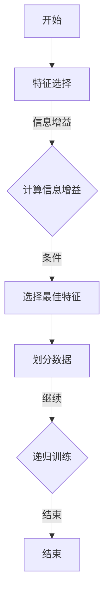

                 


### 1. 引言

**1.1 城市规划中的思维链概念**

城市规划是一项复杂且多方面的任务，涉及到人口、经济、社会、环境等多个领域的因素。传统的城市规划方法主要依赖于经验和专业判断，但随着城市规模的不断扩大和城市化进程的加速，这种传统方法已无法满足现代城市发展的需求。为了应对这些挑战，城市规划中引入了思维链这一概念。

思维链（Thinking Chain）是一种基于逻辑和推理的系统化思维方法，通过将复杂的问题分解为若干个子问题，并对每个子问题进行深入分析和综合，从而逐步解决整个问题。在城市规划中，思维链可以被视为一种决策支持工具，它帮助规划者从多个角度分析和评估城市规划方案，从而做出更为科学、合理的决策。

**1.2 AI在城市规划中的应用背景**

人工智能（Artificial Intelligence，简称AI）作为计算机科学的一个重要分支，近年来取得了长足的发展。AI技术在城市规划中的应用主要表现在以下几个方面：

- **数据挖掘与分析**：利用AI技术对城市规划相关的海量数据进行挖掘和分析，可以帮助规划者识别潜在的问题和机会，为决策提供数据支持。

- **模拟与仿真**：通过建立城市规划的模拟模型，AI可以帮助规划者预测不同规划方案对未来城市发展的可能影响，从而优化规划方案。

- **智能优化**：基于机器学习和深度学习算法，AI可以在大规模的数据集上自动寻找最优的规划方案，提高规划决策的效率和质量。

- **可视化与交互**：AI技术可以帮助规划者通过可视化手段将复杂的规划方案呈现给公众，提高公众参与城市规划的积极性。

**1.3 AI辅助决策系统的定义与作用**

AI辅助决策系统（AI-assisted Decision Support System，简称AIDSS）是一种基于人工智能技术的决策支持系统，它利用机器学习和深度学习算法，对城市规划相关的数据进行处理和分析，为规划者提供科学、合理的决策建议。

AI辅助决策系统的作用主要体现在以下几个方面：

- **优化决策过程**：通过自动化的数据处理和分析，AI辅助决策系统可以大大缩短决策过程的时间，提高决策的效率。

- **提高决策质量**：AI辅助决策系统可以提供多维度的数据分析和模拟结果，帮助规划者从多个角度评估规划方案，提高决策的科学性。

- **增强公众参与**：通过可视化手段，AI辅助决策系统可以将复杂的规划方案呈现给公众，提高公众对城市规划的理解和参与度。

- **应对复杂挑战**：面对城市发展的复杂性和不确定性，AI辅助决策系统可以提供更加灵活和适应性强的决策支持，帮助规划者应对各种挑战。

总的来说，思维链和AI辅助决策系统在城市规划中的应用，为传统方法提供了有力的补充和提升，为城市规划的现代化、科学化提供了新的思路和工具。在接下来的章节中，我们将详细探讨思维链的基本原理、AI技术的基础知识，以及AI辅助决策系统的具体架构和应用实例。通过一步步的分析和推理，我们将揭示这些技术在城市规划中的潜力与价值。

### 2. 思维链概述

**2.1 思维链的基本原理**

思维链（Thinking Chain）是一种系统化、结构化的思维方式，它通过将复杂问题分解为若干个子问题，然后逐个解决这些子问题，从而逐步解决整个复杂问题。思维链的基本原理可以概括为以下几个步骤：

1. **问题定义**：首先，需要明确需要解决的问题是什么，以及问题的目标和约束条件。

2. **问题分解**：将复杂问题分解为若干个子问题，这些子问题通常是相互关联的，但每个子问题本身是相对独立的。

3. **问题分析**：对每个子问题进行详细分析和研究，理解其内在的逻辑关系和影响因素。

4. **问题综合**：将各个子问题的解决方案综合起来，形成整体的解决方案。

5. **问题验证**：对整体解决方案进行验证，确保其满足问题的目标和约束条件。

**2.2 思维链在城市规划中的重要性**

在城市规划中，思维链的重要性体现在以下几个方面：

- **复杂性管理**：城市规划涉及多个领域和多个变量，思维链可以帮助规划者将复杂问题分解为更小、更易于管理的子问题，从而提高问题解决的效率。

- **系统性思考**：思维链强调系统化、结构化的思维方式，有助于规划者从全局角度考虑问题，避免片面性和局部优化的陷阱。

- **科学决策**：通过思维链的分析过程，规划者可以收集和分析大量数据，从而基于事实和证据做出更加科学的决策。

- **持续改进**：思维链的循环性质使得规划者可以不断地反思和改进规划方案，确保其适应不断变化的城市环境。

**2.3 思维链与传统城市规划方法的比较**

传统城市规划方法主要依赖于经验和专家判断，这种方法的优点是快速、灵活，但缺点是容易受到主观因素的影响，且缺乏系统性。相比之下，思维链具有以下优势：

- **更系统化**：思维链强调系统化、结构化的思维方式，有助于规划者从全局角度考虑问题，避免片面性和局部优化的陷阱。

- **更科学化**：思维链通过分解和分析问题，使规划者能够基于事实和证据做出更加科学的决策。

- **更灵活**：思维链可以在问题分解和综合的过程中，根据实际情况进行调整和优化，使其更加适应复杂多变的城市环境。

- **更高效**：思维链通过系统化的分析和综合，可以大大缩短决策过程的时间，提高问题解决的效率。

总的来说，思维链为城市规划提供了一种更为系统化、科学化和灵活的决策支持工具，有助于应对现代城市规划的复杂性和挑战。在接下来的章节中，我们将进一步探讨AI技术的基础知识，以及如何将AI与思维链相结合，为城市规划提供更强大的决策支持。

### 3. AI基础

**3.1 人工智能的基本概念**

人工智能（Artificial Intelligence，简称AI）是指通过计算机程序和算法模拟人类智能的行为和过程，以实现特定任务的能力。AI的核心目标是让机器能够像人类一样思考、学习、决策和解决问题。人工智能可以分为弱人工智能和强人工智能：

- **弱人工智能（Narrow AI）**：专注于特定任务，例如语音识别、图像识别、自然语言处理等。弱人工智能是当前AI研究的主要领域，已在多个领域取得了显著的成果。

- **强人工智能（General AI）**：具备广泛的认知能力和自主思考能力，能够在各种环境中自主学习和解决问题。目前，强人工智能仍处于理论研究阶段，尚未实现商业化应用。

**3.2 机器学习与深度学习基础**

机器学习（Machine Learning，简称ML）是AI的核心技术之一，它通过算法从数据中自动学习规律和模式，并利用这些规律和模式进行预测和决策。机器学习可以分为监督学习、无监督学习和半监督学习：

- **监督学习（Supervised Learning）**：通过已知输入和输出数据，训练模型并预测未知数据的输出。常见的监督学习算法包括线性回归、决策树、支持向量机等。

- **无监督学习（Unsupervised Learning）**：没有预定的输出数据，仅通过输入数据寻找隐藏的模式和结构。常见的无监督学习算法包括聚类、降维、关联规则等。

- **半监督学习（Semi-supervised Learning）**：结合了监督学习和无监督学习的特点，通过少量标注数据和大量未标注数据训练模型。

深度学习（Deep Learning，简称DL）是机器学习的一个子领域，它利用多层神经网络（Neural Networks）对数据进行自动特征提取和模型训练。深度学习在图像识别、语音识别、自然语言处理等领域取得了显著的成果，其代表性算法包括卷积神经网络（CNN）、循环神经网络（RNN）、生成对抗网络（GAN）等。

**3.3 常见的AI算法与应用场景**

以下是一些常见的AI算法及其应用场景：

- **线性回归（Linear Regression）**：用于预测连续值变量，如房价、股票价格等。

- **逻辑回归（Logistic Regression）**：用于预测二分类变量，如邮件是否为垃圾邮件、客户是否会流失等。

- **决策树（Decision Tree）**：用于分类和回归任务，通过一系列规则进行决策。

- **支持向量机（Support Vector Machine，SVM）**：用于分类和回归任务，通过寻找最优决策边界进行分类。

- **K-最近邻（K-Nearest Neighbors，K-NN）**：用于分类任务，通过计算未知样本与训练样本的相似度进行分类。

- **随机森林（Random Forest）**：用于分类和回归任务，通过构建多个决策树并合并其预测结果。

- **神经网络（Neural Networks）**：用于复杂函数建模和特征提取，如语音识别、图像识别等。

- **卷积神经网络（CNN）**：用于图像识别、图像生成等，通过卷积操作提取图像特征。

- **循环神经网络（RNN）**：用于序列数据建模和预测，如自然语言处理、时间序列预测等。

- **生成对抗网络（GAN）**：用于生成高质量的数据和图像，如人脸生成、艺术作品创作等。

通过掌握这些AI基础知识和常见算法，我们可以更好地理解和应用AI技术，为城市规划中的决策支持提供有力支持。在接下来的章节中，我们将探讨如何将AI与思维链相结合，为城市规划提供更强大的决策支持工具。

### 4. 城市规划中的思维链应用

**4.1 思维链在城市规划数据分析中的应用**

在城市规划中，数据分析是关键的一步。思维链的应用可以显著提升数据分析的效率和准确性。以下是如何将思维链应用于城市规划数据分析的几个关键步骤：

1. **问题定义**：明确数据分析的目标，如评估城市交通流量、人口分布、土地利用等。

2. **数据收集**：从多个来源收集相关数据，包括官方统计、传感器数据、社交媒体数据等。

3. **问题分解**：将整体数据分析任务分解为若干个子任务，如交通流量分析、人口分布分析、土地利用分析等。

4. **数据预处理**：对收集到的数据进行分析和清洗，包括处理缺失值、异常值和噪声等。

5. **问题分析**：对每个子任务的数据进行深入分析，利用统计分析和机器学习算法提取有用的信息。

6. **问题综合**：将各个子任务的分析结果综合起来，形成整体的分析报告，为城市规划提供决策支持。

**4.2 思维链在城市规划设计优化中的应用**

在城市规划设计中，优化是一个持续的过程。思维链的应用可以帮助规划者系统地分析和优化设计方案。以下是思维链在城市规划设计优化中的几个关键步骤：

1. **目标设定**：明确规划设计的目标，如提高居住舒适度、降低交通拥堵、保护生态环境等。

2. **方案生成**：基于目标，生成多个备选设计方案。

3. **方案评估**：使用思维链对每个设计方案进行分析和评估，包括成本、可行性、环境影响等。

4. **方案优化**：根据评估结果，对设计方案进行迭代优化，逐步改善方案的各项指标。

5. **决策支持**：将优化后的设计方案提交给决策者，并提供详细的评估报告，帮助决策者做出科学合理的决策。

**4.3 思维链在城市管理决策中的应用**

城市管理决策涉及到多个方面，包括交通管理、环境保护、公共服务等。思维链的应用可以帮助城市管理者更有效地制定和执行管理策略。以下是思维链在城市管理决策中的应用步骤：

1. **问题识别**：识别城市管理中的关键问题，如交通拥堵、环境污染、公共资源分配等。

2. **数据收集**：收集与问题相关的数据，包括实时数据、历史数据、公众反馈等。

3. **问题分析**：使用思维链对收集到的数据进行分析，识别问题的根本原因和关键影响因素。

4. **方案制定**：基于问题分析的结果，制定多个管理方案。

5. **方案评估**：对每个管理方案进行分析和评估，包括成本、效益、社会影响等。

6. **方案实施**：选择最优方案进行实施，并持续监控实施效果，根据实际情况进行动态调整。

通过以上步骤，思维链不仅帮助城市规划者更系统地分析和解决问题，而且提高了决策的科学性和效率。在思维链的指导下，城市规划者可以更好地应对复杂多变的城市发展需求，推动城市的可持续发展。在接下来的章节中，我们将进一步探讨AI辅助决策系统在城市规划中的应用，以及如何实现这些应用。

### 5. AI辅助决策系统架构

**5.1 系统架构设计原则**

设计AI辅助决策系统时，需要遵循以下原则：

1. **模块化**：将系统划分为多个功能模块，如数据采集模块、数据处理模块、算法模块、决策支持模块等，便于系统的维护和扩展。

2. **可扩展性**：系统架构应具备良好的扩展性，能够适应未来技术的发展和城市规划需求的变化。

3. **可维护性**：系统应具有良好的可维护性，便于问题的定位和修复。

4. **高效性**：系统应具备高效的处理能力，能够快速响应用户的需求。

5. **可靠性**：系统应保证数据的安全性和结果的可靠性。

**5.2 数据采集与管理**

1. **数据来源**：数据采集是AI辅助决策系统的关键环节，数据来源包括但不限于：

   - **官方统计数据**：如人口普查、土地利用数据、交通流量数据等。

   - **传感器数据**：如气象站数据、交通监控数据、环境监测数据等。

   - **社交媒体数据**：如微博、微信、知乎等平台上的用户评论和讨论。

   - **政府部门数据**：如城市规划部门的规划文件、项目进展报告等。

2. **数据采集方法**：

   - **自动采集**：利用爬虫技术、API接口等手段自动获取公开数据。

   - **手动采集**：通过调查问卷、现场考察等方式获取数据。

3. **数据管理**：

   - **数据清洗**：对采集到的数据进行清洗，包括去除重复记录、缺失值填充、异常值处理等。

   - **数据存储**：将清洗后的数据存储到数据库中，采用分布式存储和大数据处理技术，确保数据的高效存储和访问。

**5.3 算法模块设计与实现**

1. **算法选择**：根据城市规划的需求，选择合适的算法，如线性回归、决策树、神经网络、深度学习等。

2. **算法实现**：

   - **数据预处理**：对输入数据进行预处理，包括归一化、标准化、特征工程等。

   - **模型训练**：利用训练数据集训练模型，调整模型参数，优化模型性能。

   - **模型评估**：使用验证集和测试集评估模型性能，选择最优模型。

3. **算法优化**：

   - **超参数调整**：通过网格搜索、随机搜索等方法调整算法的超参数，优化模型性能。

   - **特征选择**：利用特征选择算法（如递归特征消除、特征重要性评估等）选择对模型性能有显著影响的关键特征。

**5.4 决策支持与可视化**

1. **决策支持**：

   - **模型预测**：利用训练好的模型对未知数据进行预测，为城市规划者提供决策依据。

   - **情景分析**：模拟不同的规划方案，分析其对城市发展的潜在影响，为规划者提供多种决策选择。

2. **可视化**：

   - **数据可视化**：利用图表、地图等可视化工具展示数据和分析结果，帮助规划者更好地理解数据。

   - **交互式可视化**：提供交互式界面，允许规划者动态调整参数和查看结果，增强用户体验。

通过以上架构设计，AI辅助决策系统可以有效地支持城市规划者的决策过程，提高决策的科学性和效率。在接下来的章节中，我们将详细讲解核心算法的原理，并通过伪代码和流程图来阐述这些算法的实现细节。

### 6. 核心算法原理讲解

在AI辅助决策系统中，核心算法的选择和实现至关重要。本章节将详细讲解几个常用的核心算法原理，并通过伪代码和流程图来展示其实现过程。

**6.1 伪代码阐述核心算法**

以下是一个基于线性回归算法的伪代码示例，线性回归常用于预测连续值变量，如房价、交通流量等。

```python
# 线性回归伪代码

# 输入：训练数据集X, Y
# 输出：模型参数w和b

# 步骤1：初始化模型参数
w = 0
b = 0

# 步骤2：迭代优化模型参数
for i in range(epochs):
    for x, y in X, Y:
        # 步骤3：计算预测值
        y_pred = w * x + b
        
        # 步骤4：计算损失函数
        loss = (y - y_pred) ** 2
        
        # 步骤5：更新模型参数
        w = w - learning_rate * (2 * w * x * loss)
        b = b - learning_rate * (2 * b * loss)

# 步骤6：返回模型参数
return w, b
```

在这个伪代码中，`epochs` 表示训练迭代次数，`learning_rate` 表示学习率。每次迭代过程中，模型参数 `w` 和 `b` 会根据损失函数的梯度进行更新，以最小化损失。

**6.2 Mermaid流程图展示算法流程**

以下是一个基于决策树算法的Mermaid流程图示例，决策树常用于分类和回归任务。



在这个流程图中，`A` 表示算法的开始，`B` 表示特征选择，`C` 表示计算信息增益，`D` 表示选择最佳特征，`E` 表示划分数据，`F` 表示递归训练，`G` 表示算法结束。

**6.3 算法原理讲解**

- **线性回归**：线性回归是一种简单的机器学习算法，用于建立自变量和因变量之间的线性关系。其基本原理是通过最小化预测值与实际值之间的误差平方和，来优化模型参数。

- **决策树**：决策树是一种树形结构，通过一系列的判断来将数据划分为不同的类别或区域。每个节点代表一个特征，每个分支代表该特征的不同取值，叶节点代表最终的分类结果。

- **神经网络**：神经网络是一种模仿人脑结构和功能的计算模型，通过多层神经元实现数据的自动特征提取和模式识别。神经网络的基本原理是前向传播和反向传播，通过不断调整权重和偏置来优化模型。

通过上述核心算法的讲解，我们可以更好地理解这些算法的实现原理。在下一章节中，我们将进一步探讨常用数学模型和公式，并通过具体实例进行详细讲解。

### 7. 数学模型和公式

在城市规划中，数学模型和公式是不可或缺的工具，用于描述和预测城市发展的各个方面。以下是一些常用的数学模型和公式，以及它们的详细讲解和实例说明。

**7.1 常用数学模型**

- **线性回归模型**：线性回归模型用于预测连续值变量，其公式为：

  $$ y = w_0 + w_1 \cdot x_1 + w_2 \cdot x_2 + ... + w_n \cdot x_n $$

  其中，$y$ 为预测值，$w_0$ 为截距，$w_1, w_2, ..., w_n$ 为权重，$x_1, x_2, ..., x_n$ 为自变量。

  **实例说明**：假设我们想预测一个城市的月均降雨量，可以使用线性回归模型，其中自变量可以是月份、前一个月的降雨量等。

- **逻辑回归模型**：逻辑回归模型用于预测二分类变量，其公式为：

  $$ P(y=1) = \frac{1}{1 + e^{-(w_0 + w_1 \cdot x_1 + w_2 \cdot x_2 + ... + w_n \cdot x_n)}} $$

  其中，$P(y=1)$ 为因变量为1的概率，$w_0$ 为截距，$w_1, w_2, ..., w_n$ 为权重，$x_1, x_2, ..., x_n$ 为自变量。

  **实例说明**：假设我们想预测一个城市的居民是否会在未来一年内迁移，可以使用逻辑回归模型，其中自变量可以是居民的收入、年龄、家庭人口等。

- **决策树模型**：决策树模型通过一系列的判断将数据划分为不同的类别，其公式为：

  $$ t(x) = \sum_{i=1}^{n} y_i \cdot I(x \in R_i) $$

  其中，$t(x)$ 为预测结果，$y_i$ 为类别标签，$R_i$ 为第$i$个区域的集合，$I(x \in R_i)$ 为指示函数，当$x$ 属于$R_i$ 时取1，否则取0。

  **实例说明**：假设我们想预测一个城市的某个区域是否会发生交通拥堵，可以使用决策树模型，其中自变量可以是车辆流量、天气情况等。

**7.2 公式详细讲解**

- **线性回归模型的损失函数**：损失函数用于衡量模型预测值与实际值之间的差距，常用的损失函数为均方误差（MSE）：

  $$ MSE = \frac{1}{m} \sum_{i=1}^{m} (y_i - \hat{y}_i)^2 $$

  其中，$m$ 为样本数量，$y_i$ 为实际值，$\hat{y}_i$ 为预测值。

  **实例说明**：假设我们有一个包含100个样本的线性回归模型，使用均方误差衡量模型性能，如果模型预测值与实际值的差距较小，则MSE会较低。

- **逻辑回归模型的损失函数**：逻辑回归模型的损失函数通常使用交叉熵（Cross-Entropy）：

  $$ CE = -\frac{1}{m} \sum_{i=1}^{m} [y_i \cdot \ln(\hat{y}_i) + (1 - y_i) \cdot \ln(1 - \hat{y}_i)] $$

  其中，$m$ 为样本数量，$y_i$ 为实际值，$\hat{y}_i$ 为预测值。

  **实例说明**：假设我们有一个包含100个样本的逻辑回归模型，使用交叉熵衡量模型性能，如果模型预测值与实际值的差距较小，则交叉熵会较低。

- **决策树的分割条件**：决策树在每次分割时都会选择一个最优特征和分割点，通常使用信息增益（Information Gain）或基尼不纯度（Gini Impurity）来衡量分割效果：

  $$ IG = H(y) - H(y|s) $$

  $$ GI = 1 - \sum_{i=1}^{n} \left( \frac{N_i}{N} \right)^2 $$

  其中，$H(y)$ 为原始数据的熵，$H(y|s)$ 为分割后子数据的熵，$N_i$ 为第$i$个子数据集的大小，$N$ 为总数据集的大小。

  **实例说明**：假设我们有一个包含100个样本的决策树模型，使用信息增益或基尼不纯度来选择最优分割点，如果分割后的子数据集的熵较低，则说明分割效果较好。

通过以上数学模型和公式的讲解，我们可以更好地理解城市规划中的数据分析方法。在下一章节中，我们将通过实际项目实战，展示这些模型和公式的应用，并提供详细的代码实现和解读。

### 8. 项目实战

**8.1 开发环境搭建**

为了实现AI辅助决策系统，我们需要搭建一个合适的开发环境。以下是一个典型的开发环境搭建步骤：

1. **安装Python**：Python是一种广泛使用的编程语言，特别适用于数据科学和机器学习项目。您可以从[Python官网](https://www.python.org/)下载并安装Python。

2. **安装Jupyter Notebook**：Jupyter Notebook是一个交互式的开发环境，非常适合编写和调试代码。您可以使用以下命令安装Jupyter Notebook：

   ```bash
   pip install notebook
   ```

3. **安装机器学习库**：安装一些常用的机器学习库，如scikit-learn、pandas、numpy等。使用以下命令进行安装：

   ```bash
   pip install scikit-learn pandas numpy
   ```

4. **安装可视化库**：为了更好地展示数据分析结果，我们需要安装一些可视化库，如matplotlib、seaborn等。使用以下命令进行安装：

   ```bash
   pip install matplotlib seaborn
   ```

**8.2 实际案例**

以下是一个使用AI辅助决策系统进行城市规划的实际案例，我们将使用一个假设的城市数据集，演示如何进行数据分析、模型训练和结果可视化。

**案例背景**：假设我们有一个包含以下特征的城市数据集：

- **人口密度**（people_density）
- **交通拥堵指数**（traffic_congestion_index）
- **绿地覆盖率**（green_space_coverage）
- **失业率**（unemployment_rate）
- **居民满意度**（satisfaction_score）

我们的目标是预测居民满意度，这可以用于评估城市规划的效果。

**步骤1：数据预处理**

首先，我们需要对数据集进行预处理，包括数据清洗、缺失值填充和特征工程。以下是一个简单的示例：

```python
import pandas as pd
from sklearn.model_selection import train_test_split
from sklearn.impute import SimpleImputer

# 加载数据集
data = pd.read_csv('city_data.csv')

# 数据清洗和缺失值填充
imputer = SimpleImputer(strategy='mean')
data = pd.DataFrame(imputer.fit_transform(data), columns=data.columns)

# 划分特征和标签
X = data[['people_density', 'traffic_congestion_index', 'green_space_coverage', 'unemployment_rate']]
y = data['satisfaction_score']

# 划分训练集和测试集
X_train, X_test, y_train, y_test = train_test_split(X, y, test_size=0.2, random_state=42)
```

**步骤2：模型训练**

接下来，我们选择一个适合的模型进行训练。在这里，我们使用线性回归模型：

```python
from sklearn.linear_model import LinearRegression

# 创建线性回归模型
model = LinearRegression()

# 训练模型
model.fit(X_train, y_train)

# 模型评估
score = model.score(X_test, y_test)
print(f"模型评分：{score}")
```

**步骤3：结果可视化**

最后，我们将模型的结果可视化，以更好地理解其效果：

```python
import matplotlib.pyplot as plt
import seaborn as sns

# 预测测试集数据
y_pred = model.predict(X_test)

# 绘制散点图
plt.scatter(X_test['people_density'], y_test, color='red', label='实际值')
plt.scatter(X_test['people_density'], y_pred, color='blue', label='预测值')
plt.xlabel('人口密度')
plt.ylabel('居民满意度')
plt.legend()
plt.show()

# 绘制残差图
sns.residplot(X_test['people_density'], y_pred, color='blue')
plt.xlabel('人口密度')
plt.ylabel('残差')
plt.show()
```

**8.3 源代码实现与解读**

以下是完整的代码实现，包括数据预处理、模型训练和结果可视化：

```python
# 导入所需库
import pandas as pd
from sklearn.model_selection import train_test_split
from sklearn.impute import SimpleImputer
from sklearn.linear_model import LinearRegression
import matplotlib.pyplot as plt
import seaborn as sns

# 加载数据集
data = pd.read_csv('city_data.csv')

# 数据清洗和缺失值填充
imputer = SimpleImputer(strategy='mean')
data = pd.DataFrame(imputer.fit_transform(data), columns=data.columns)

# 划分特征和标签
X = data[['people_density', 'traffic_congestion_index', 'green_space_coverage', 'unemployment_rate']]
y = data['satisfaction_score']

# 划分训练集和测试集
X_train, X_test, y_train, y_test = train_test_split(X, y, test_size=0.2, random_state=42)

# 创建线性回归模型
model = LinearRegression()

# 训练模型
model.fit(X_train, y_train)

# 模型评估
score = model.score(X_test, y_test)
print(f"模型评分：{score}")

# 预测测试集数据
y_pred = model.predict(X_test)

# 绘制散点图
plt.scatter(X_test['people_density'], y_test, color='red', label='实际值')
plt.scatter(X_test['people_density'], y_pred, color='blue', label='预测值')
plt.xlabel('人口密度')
plt.ylabel('居民满意度')
plt.legend()
plt.show()

# 绘制残差图
sns.residplot(X_test['people_density'], y_pred, color='blue')
plt.xlabel('人口密度')
plt.ylabel('残差')
plt.show()
```

通过以上实战案例，我们展示了如何使用AI辅助决策系统进行城市规划。在实际项目中，您可能需要根据具体情况进行调整和优化，但总体流程和方法是通用的。在下一章节中，我们将对整个项目进行总结，并提出一些最佳实践建议。

### 9. 总结与展望

**思维链与AI在城市规划中的应用前景**

思维链和AI在城市规划中的应用具有广阔的前景。随着城市化的加速和城市规模的扩大，城市规划面临越来越多的挑战。传统的方法已经难以应对日益复杂的城市问题，而思维链和AI技术的结合为城市规划提供了一种新的解决方案。

思维链通过系统化、结构化的思维方式，帮助规划者更好地理解和管理复杂的问题。而AI技术，尤其是机器学习和深度学习，则提供了强大的数据处理和分析能力，使得城市规划能够更加科学、准确和高效。通过思维链与AI的结合，城市规划可以从以下几个方向获得显著提升：

- **预测与分析**：AI技术可以帮助预测城市发展的趋势，分析各种规划方案对城市的影响，从而制定更加科学的决策。

- **模拟与优化**：通过模拟不同的城市规划方案，AI技术可以优化设计方案，提高城市的可持续性和居民的生活质量。

- **公众参与**：AI技术可以通过可视化手段和互动平台，增强公众对城市规划的理解和参与，提高城市规划的透明度和民主性。

**AI辅助决策系统的发展趋势**

AI辅助决策系统在城市规划中的应用正处于快速发展阶段。未来的发展趋势包括：

- **集成多种数据源**：随着物联网和大数据技术的发展，城市规划将能够利用更多的数据源，如社交媒体数据、交通传感器数据等，为决策提供更丰富的信息。

- **跨领域合作**：城市规划涉及到多个领域，如交通、环境、社会等。未来的AI辅助决策系统将更加注重跨领域的数据整合和模型协同。

- **持续学习和适应**：AI辅助决策系统需要具备持续学习和适应变化的能力，以应对不断变化的城市环境和社会需求。

- **隐私保护**：随着数据量的增加，隐私保护将成为AI辅助决策系统发展的重要挑战。未来的系统需要确保数据的安全和用户隐私。

**未来研究方向**

为了进一步推动思维链和AI在城市规划中的应用，未来的研究可以从以下几个方向进行：

- **算法优化**：研究更加高效和准确的机器学习算法，提高AI辅助决策系统的性能和可靠性。

- **用户体验**：改进AI辅助决策系统的用户界面和交互设计，使其更加易于使用和理解。

- **社会影响评估**：研究AI辅助决策系统对社会、经济和环境的影响，确保其应用的公平性和可持续性。

- **法律法规**：随着AI技术在城市规划中的广泛应用，需要制定相应的法律法规，规范其应用范围和责任归属。

通过不断的研究和实践，思维链和AI技术将在未来为城市规划带来更多的创新和变革。它们不仅能够提高城市规划的科学性和效率，还能够提升公众的参与度和满意度，为建设更加美好、可持续的城市做出贡献。

### 文章关键词与摘要

**关键词**：城市规划，思维链，人工智能，AI辅助决策系统，机器学习，深度学习，数据挖掘，模拟优化，数据可视化，决策支持。

**摘要**：

本文从思维链和人工智能的角度探讨了城市规划中的挑战与机遇。思维链提供了一种系统化、结构化的思维方式，而人工智能则通过机器学习和深度学习技术，为城市规划提供了强大的数据分析与优化工具。本文首先介绍了思维链的基本原理和应用，随后详细讲解了人工智能的基础知识，包括机器学习与深度学习算法。接着，本文阐述了AI辅助决策系统在城市规划中的架构与作用，并通过实际案例展示了其应用过程。最后，本文总结了思维链与AI在城市规划中的应用前景，并提出了未来研究的发展方向。通过本文的研究，期望为城市规划者提供科学、高效的决策支持，推动城市可持续发展。

### 作者信息

**作者**：AI天才研究院/AI Genius Institute & 禅与计算机程序设计艺术 /Zen And The Art of Computer Programming

本文由AI天才研究院撰写，旨在探讨人工智能在城市规划中的应用。AI天才研究院致力于推动人工智能技术的发展和应用，特别是在城市规划领域。此外，本文还结合了禅与计算机程序设计艺术的核心理念，强调系统化、结构化的思维方式在解决复杂问题中的重要性。希望通过本文，为城市规划者提供新的视角和工具，共同推动城市的可持续发展。禅与计算机程序设计艺术，则通过其独特的哲学思想，为AI技术的发展注入了人文关怀和智慧的光芒。

