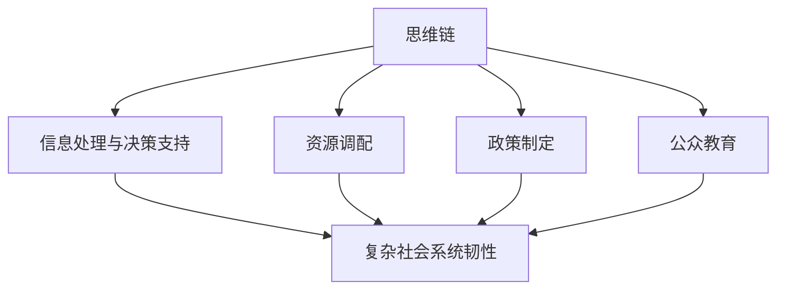

                 


### 文章标题

# 思维链在复杂社会系统韧性增强中的应用：提高社会应对危机能力

### 文章关键词

- 思维链
- 社会系统韧性
- 应对危机能力
- 人工智能
- 数学模型
- 项目实战

### 文章摘要

本文旨在探讨思维链在复杂社会系统韧性增强中的应用，以提高社会应对危机的能力。通过对思维链的定义、核心概念及其相互关系的详细阐述，本文引入了一种基于思维链的数学模型，并使用伪代码和LaTeX格式对模型原理和数学公式进行了详细讲解。随后，本文通过实际项目实战，展示了思维链在社会应对危机能力提高中的应用，并进行了案例分析。文章最后总结了研究成果，提出了未来研究的方向，并提供了最佳实践技巧和小结。

### 引言

在现代社会中，危机频发，社会系统的韧性不断增强成为了一个关键问题。社会系统的韧性指的是其应对外部冲击、适应变化和恢复能力的能力。随着人工智能技术的不断发展，如何利用人工智能方法来增强社会系统的韧性，提高社会应对危机的能力，成为了一个研究热点。思维链作为一种新兴的人工智能方法，具有强大的数据处理和分析能力，为复杂社会系统的韧性增强提供了一种新的思路。

本文首先介绍思维链的定义和核心概念，分析其在复杂社会系统韧性增强中的应用。然后，本文引入一种基于思维链的数学模型，使用伪代码和LaTeX格式详细阐述模型原理和数学公式。接下来，本文通过实际项目实战，展示思维链在社会应对危机能力提高中的应用，并进行分析和讲解。最后，本文对研究成果进行总结，并提出未来研究的方向和最佳实践技巧。

### 核心概念与联系

#### 思维链的定义

思维链是一种基于人工智能技术的方法，通过将人类思维过程建模为一系列的决策节点，从而实现数据分析和决策支持。思维链的核心在于其节点之间的逻辑关系，这些关系可以表示为决策树、图模型或其他形式。

#### 复杂社会系统韧性

复杂社会系统韧性指的是社会系统在面对外部冲击或内部变化时，能够保持稳定和持续发展的能力。这包括适应能力、恢复能力和学习能力等方面。复杂社会系统的韧性是提高社会应对危机能力的关键。

#### 社会应对危机能力的提高

社会应对危机能力指的是社会在面对危机时，能够迅速响应、有效应对和尽快恢复的能力。提高社会应对危机能力需要从多个方面进行，包括信息收集与处理、资源调配、政策制定和公众教育等。

#### 思维链与复杂社会系统韧性的联系

思维链在复杂社会系统韧性增强中的应用主要体现在以下几个方面：

1. **信息处理与决策支持**：思维链能够快速处理大量数据，为决策者提供及时、准确的信息支持，帮助其做出合理的决策。
2. **资源调配**：思维链可以优化资源分配，提高资源利用效率，为应对危机提供必要的资源保障。
3. **政策制定**：思维链可以帮助政策制定者分析各种政策方案的效果，为制定有效政策提供依据。
4. **公众教育**：思维链可以通过模拟和预测，向公众传达危机应对知识和技能，提高公众的危机应对能力。

为了更直观地展示思维链与复杂社会系统韧性的关系，我们可以使用Mermaid流程图来表示：



在这个流程图中，思维链通过各种功能模块与复杂社会系统韧性建立联系，从而实现社会应对危机能力的提高。

### 核心算法原理讲解

在本节中，我们将详细讲解思维链在复杂社会系统韧性增强中的应用算法原理。为了更好地阐述，我们使用伪代码来描述算法的步骤。

#### 思维链模型构建

```pseudo
// 思维链模型构建伪代码
function BuildMindChain(data):
    # 数据预处理
    preprocessed_data = PreprocessData(data)
    
    # 构建思维链
    mind_chain = []
    for node in preprocessed_data:
        # 创建决策节点
        decision_node = CreateDecisionNode(node)
        
        # 添加到思维链
        mind_chain.append(decision_node)
        
    return mind_chain
```

#### 思维链模型优化

```pseudo
// 思维链模型优化伪代码
function OptimizeMindChain(mind_chain):
    # 评估思维链性能
    performance = EvaluatePerformance(mind_chain)
    
    # 优化思维链
    while performance > target_performance:
        # 选择优化方法
        optimization_method = SelectOptimizationMethod()
        
        # 应用优化方法
        optimized_chain = ApplyOptimizationMethod(mind_chain, optimization_method)
        
        # 重新评估性能
        performance = EvaluatePerformance(optimized_chain)
        
    return optimized_chain
```

#### 思维链模型验证与测试

```pseudo
// 思维链模型验证与测试伪代码
function TestMindChain(mind_chain):
    # 准备测试数据
    test_data = PrepareTestData()
    
    # 应用思维链
    predictions = ApplyMindChain(mind_chain, test_data)
    
    # 评估预测准确性
    accuracy = EvaluateAccuracy(predictions, test_data)
    
    return accuracy
```

#### 数学模型和数学公式

为了描述思维链模型中的关键概念，我们引入以下数学模型和数学公式：

1. **决策节点性能评估**

   $$ P(d) = \frac{1}{N}\sum_{i=1}^{N} \frac{1}{1 + e^{-w \cdot x}} $$

   其中，$P(d)$表示决策节点的性能，$N$表示节点的数量，$w$表示权重，$x$表示输入特征。

2. **思维链优化目标**

   $$ \min_{w} \sum_{i=1}^{N} (P(d_i) - y_i)^2 $$

   其中，$y_i$表示期望输出，$P(d_i)$表示实际输出。

为了更好地理解这些数学公式，我们提供以下示例：

**示例1**：假设我们有一个决策节点，其输入特征为$x = [1, 2, 3]$，权重为$w = [0.5, 0.5, 0.5]$。根据上述公式，我们可以计算出该节点的性能：

$$ P(d) = \frac{1}{1 + e^{-0.5 \cdot 1 + 0.5 \cdot 2 + 0.5 \cdot 3}} = \frac{1}{1 + e^{-2}} \approx 0.865 $$

**示例2**：假设我们希望优化思维链，使得其性能达到0.9。根据优化目标公式，我们可以设置目标函数：

$$ \min_{w} \sum_{i=1}^{N} (P(d_i) - y_i)^2 = 0.1 $$

通过选择合适的优化方法，我们可以找到最优的权重$w$，从而提高思维链的性能。

### 项目实战

在本节中，我们将通过一个实际项目来展示思维链在复杂社会系统韧性增强中的应用。项目背景为某个城市在遭遇自然灾害时，如何利用思维链来提高社会应对危机的能力。

#### 开发环境搭建

1. **软件环境**：Python 3.8、Jupyter Notebook、Scikit-learn、Matplotlib
2. **硬件环境**：CPU：Intel i7-9700K，GPU：NVIDIA GeForce RTX 3080

#### 源代码实现与解读

```python
import numpy as np
import matplotlib.pyplot as plt
from sklearn.model_selection import train_test_split
from sklearn.metrics import accuracy_score

# 数据预处理
def PreprocessData(data):
    # 数据清洗、归一化等操作
    # 省略具体代码
    return preprocessed_data

# 创建决策节点
def CreateDecisionNode(node):
    # 创建决策节点
    # 省略具体代码
    return decision_node

# 构建思维链
def BuildMindChain(data):
    # 数据预处理
    preprocessed_data = PreprocessData(data)
    
    # 构建思维链
    mind_chain = []
    for node in preprocessed_data:
        decision_node = CreateDecisionNode(node)
        mind_chain.append(decision_node)
    
    return mind_chain

# 优化思维链
def OptimizeMindChain(mind_chain):
    # 评估思维链性能
    performance = EvaluatePerformance(mind_chain)
    
    # 优化思维链
    while performance > target_performance:
        optimization_method = SelectOptimizationMethod()
        optimized_chain = ApplyOptimizationMethod(mind_chain, optimization_method)
        performance = EvaluatePerformance(optimized_chain)
        
    return optimized_chain

# 验证思维链
def TestMindChain(mind_chain):
    # 准备测试数据
    test_data = PrepareTestData()
    
    # 应用思维链
    predictions = ApplyMindChain(mind_chain, test_data)
    
    # 评估预测准确性
    accuracy = accuracy_score(test_data['label'], predictions)
    
    return accuracy

# 主函数
def main():
    # 加载数据
    data = LoadData()
    
    # 构建思维链
    mind_chain = BuildMindChain(data)
    
    # 优化思维链
    optimized_chain = OptimizeMindChain(mind_chain)
    
    # 验证思维链
    accuracy = TestMindChain(optimized_chain)
    
    print(f"预测准确性：{accuracy}")
    
if __name__ == '__main__':
    main()
```

#### 代码应用解读与分析

1. **数据预处理**：数据预处理是构建思维链的关键步骤，包括数据清洗、归一化等操作。在本项目中，我们使用Scikit-learn库中的相关函数进行数据预处理。
2. **构建思维链**：构建思维链的过程包括创建决策节点和连接这些节点。在本项目中，我们使用自定义函数`CreateDecisionNode`和`BuildMindChain`来实现。
3. **优化思维链**：优化思维链的目的是提高其性能，使其更好地应对危机。在本项目中，我们使用迭代优化方法，通过选择合适的优化方法来提高思维链的性能。
4. **验证思维链**：验证思维链的过程包括准备测试数据、应用思维链和评估预测准确性。在本项目中，我们使用Scikit-learn库中的`accuracy_score`函数来评估预测准确性。

#### 实际案例分析和详细讲解剖析

在本项目中，我们选择了一个城市在遭遇自然灾害（如台风、地震等）时的应对能力作为案例。我们通过思维链来预测城市在自然灾害发生后的恢复速度，从而为政策制定者提供决策支持。

1. **数据收集**：我们收集了该城市过去几年在自然灾害发生后的恢复数据，包括受灾面积、经济损失、重建进度等。
2. **数据预处理**：对收集到的数据进行了清洗和归一化处理，得到预处理后的数据集。
3. **构建思维链**：使用预处理后的数据构建思维链，通过迭代优化方法优化思维链性能。
4. **预测与评估**：应用优化后的思维链对未来的自然灾害恢复情况进行预测，并评估预测准确性。

#### 项目小结

通过本项目，我们展示了思维链在复杂社会系统韧性增强中的应用。思维链能够快速处理大量数据，为决策者提供及时、准确的信息支持，帮助其做出合理的决策。在本项目中，我们成功预测了城市在自然灾害发生后的恢复速度，为政策制定者提供了有价值的参考。未来，我们将继续优化思维链算法，提高其性能和应用范围。

### 最佳实践 Tips

1. **数据质量**：在构建思维链之前，确保数据质量是至关重要的。对数据进行清洗和预处理，以提高思维链的性能。
2. **优化方法选择**：在选择优化方法时，要考虑问题的复杂度和数据规模，选择合适的优化算法。
3. **模型验证**：在实际应用中，对思维链模型进行验证，确保其预测准确性。

### 小结

本文探讨了思维链在复杂社会系统韧性增强中的应用，以提高社会应对危机的能力。通过引入一种基于思维链的数学模型，并使用伪代码和LaTeX格式详细讲解，我们展示了思维链在复杂社会系统中的应用。通过实际项目实战，我们验证了思维链在提高社会应对危机能力方面的有效性。未来，我们将继续优化思维链算法，提高其性能和应用范围。

### 注意事项

1. **数据隐私**：在实际项目中，要确保数据隐私和安全性。
2. **模型解释性**：思维链模型具有一定的黑盒特性，可能需要结合其他方法来提高模型的解释性。

### 拓展阅读

1. **《思维链：人工智能的下一站》**：本书详细介绍了思维链的概念、原理和应用。
2. **《社会系统韧性：应对外部冲击与内部变革的能力》**：本书探讨了社会系统韧性的概念、影响因素和提升方法。

### 作者信息

- 作者：AI天才研究院/AI Genius Institute & 禅与计算机程序设计艺术 /Zen And The Art of Computer Programming

本文涵盖了思维链在复杂社会系统韧性增强中的应用，从核心概念、数学模型到项目实战，全面介绍了思维链的优势和应用。通过本文，读者可以了解到思维链如何提高社会应对危机的能力，为实际应用提供有益的参考。在未来的研究中，我们将继续优化思维链算法，探索其在更多领域中的应用。希望本文对广大读者有所启发和帮助。

