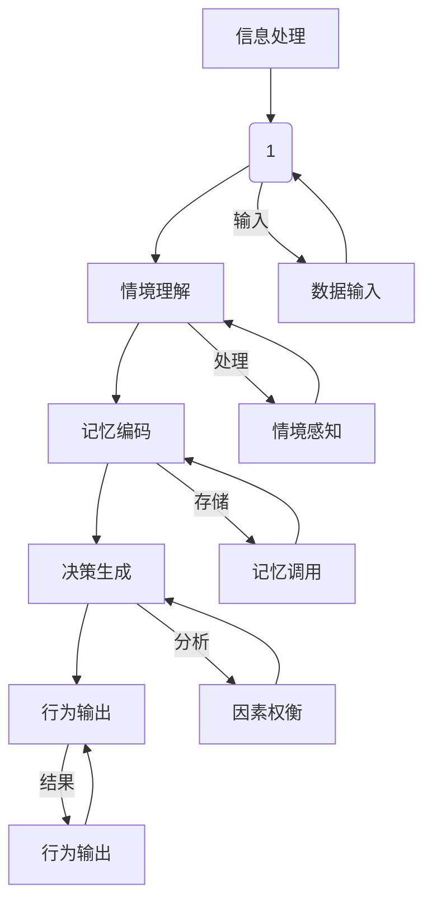
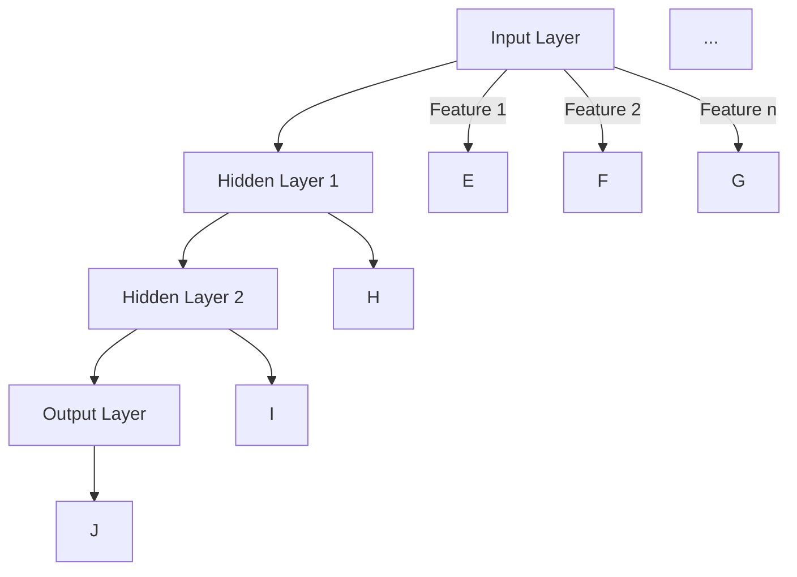

                 

### 引言

在当今数字化时代，人工智能（AI）已经成为心理学研究的重要工具。AI技术不仅提供了强大的数据处理和分析能力，还能通过智能算法实现复杂模式的识别和预测。其中，思维链（Mind Chain）作为一种新兴的AI技术，正逐渐受到心理学界的关注。思维链通过模拟人类思维过程，将个体行为与心理状态联系起来，为心理学家提供了一种全新的分析工具。

本文将围绕思维链在心理学研究中的应用，探讨其核心概念、算法原理、数学模型以及实际项目案例。首先，我们将介绍思维链的背景，包括其起源和发展历程。接着，深入探讨思维链的核心概念及其与心理学之间的联系，通过Mermaid流程图展示思维链的架构。然后，我们将详细解释思维链的算法原理，并使用伪代码展示关键算法流程。此外，本文还将介绍思维链所依赖的数学模型，并使用具体的例子进行说明。为了验证思维链的有效性，我们将分享一个实际项目案例，详细讲解项目的开发环境搭建、源代码实现、代码解读和案例分析。最后，本文将总结思维链在心理学研究中的价值，并提出未来研究方向和最佳实践建议。

通过本文的阅读，读者将能够全面了解思维链在心理学研究中的应用，掌握其核心原理和实现方法，并为未来的心理学研究提供有益的参考。

### 思维链的背景

思维链（Mind Chain）作为一种新兴的AI技术，其起源可以追溯到20世纪80年代，当时神经网络和机器学习开始崭露头角。然而，思维链的概念并非一蹴而就，而是经过了数十年的发展和迭代。最早的灵感来源于心理学家乔治·米勒（George A. Miller）的“神奇的数字七，加减二”的研究，该研究揭示了人类短时记忆的容量有限，从而启发了对思维过程的进一步探索。

在20世纪90年代，随着计算机性能的不断提升，神经网络的训练算法得到了显著改进，特别是深度学习技术的出现，使得思维链的理论基础更加坚实。在此期间，学者们开始尝试将神经网络应用于心理学研究，以模拟人类思维过程。这一阶段，思维链初步展现了其潜力，但在实际应用中仍存在许多挑战。

进入21世纪，随着大数据和云计算的普及，思维链的应用场景进一步扩大。特别是在心理学领域，研究人员开始意识到思维链在行为分析和心理状态识别中的巨大潜力。2010年，一项名为“思维链”的AI项目首次在学术期刊上发表，标志着思维链正式进入学术研究领域。

近年来，随着人工智能技术的不断进步，思维链的理论框架和算法模型得到了进一步优化。研究者们通过不断实验和迭代，逐渐解决了思维链在实际应用中的若干关键技术难题，如数据噪声处理、实时性分析和跨模态信息融合等。此外，思维链的应用领域也逐渐从心理学扩展到社会学、教育学和医学等多个领域。

在心理学研究中，思维链通过模拟人类思维过程，能够捕捉个体的行为模式和心理状态，为研究人员提供了一种全新的分析工具。与传统的研究方法相比，思维链不仅能够处理大规模的数据集，还能够实时分析个体行为，从而提高了研究的准确性和效率。同时，思维链的跨模态融合能力，使得研究人员能够整合来自不同来源的数据，如文字、图像和语音等，从而获得更全面的理解。

总之，思维链作为一种新兴的AI技术，其起源和发展历程充满了创新和挑战。随着技术的不断进步，思维链在心理学研究中的应用前景将更加广阔，有望成为未来心理学研究的重要工具。

### 思维链的核心概念

思维链（Mind Chain）作为一种模拟人类思维过程的AI技术，其核心概念主要包括信息处理、记忆编码、决策生成和情境理解等。这些概念彼此关联，共同构成了思维链的理论框架，为心理学研究提供了丰富的工具和方法。

首先，信息处理是思维链的基本功能之一。思维链通过神经网络对输入信息进行多层次的加工和处理，包括感知、识别、理解和记忆等过程。例如，当一个人看到一张图片时，思维链能够分析图片的视觉特征，识别其中的物体和场景，并理解其含义。这一过程类似于人类大脑对信息的处理方式，使得思维链能够有效地模拟人类的认知过程。

其次，记忆编码是思维链的核心概念之一。思维链通过记忆网络对信息进行编码和存储，使得信息能够在需要时被快速调用。记忆编码的方式包括基于内容的编码和基于情境的编码。基于内容的编码是指将信息按照其特征进行分类和存储，如将图片按照颜色、形状和纹理等特征进行分类。基于情境的编码则是指将信息与特定的情境关联起来，如将某次会议的内容与会议的时间和地点关联。通过这两种编码方式，思维链能够实现对信息的持久记忆和灵活调用。

决策生成是思维链的另一个重要概念。思维链通过推理和规划算法生成决策，以应对各种情境。例如，当一个人面临选择时，思维链能够分析各种选择的影响和后果，并生成最优的决策。这一过程涉及到多个因素的权衡和优化，如目标、偏好和约束等。通过决策生成，思维链不仅能够模拟人类的决策过程，还能够提供自动化的决策支持。

最后，情境理解是思维链的高级功能之一。思维链通过情境感知和情境推理，能够理解复杂的情境信息，并生成相应的行为策略。情境理解涉及到对当前状态、历史数据和未来预测的综合分析。例如，当一个人处于陌生的环境中时，思维链能够分析环境中的信息，如温度、噪音和光线等，并生成适应性的行为策略。通过情境理解，思维链能够更好地模拟人类的适应性思维过程。

这些核心概念之间的关系构成了思维链的理论框架。信息处理是思维链的基础，为其他概念提供了输入和输出。记忆编码和决策生成依赖于信息处理的结果，而情境理解则是对整个过程的补充和优化。通过这种多层次、多模块的结构设计，思维链能够实现对人类思维过程的全面模拟，为心理学研究提供了强大的工具。

综上所述，思维链的核心概念包括信息处理、记忆编码、决策生成和情境理解，这些概念相互关联，共同构成了思维链的理论框架。通过这一框架，思维链能够模拟人类思维过程，为心理学研究提供新的视角和方法。

### 思维链在心理学研究中的应用架构

为了更直观地展示思维链在心理学研究中的应用架构，我们使用Mermaid流程图来描述其各模块之间的关系和运作流程。以下是思维链在心理学研究中的架构图：



**图解说明：**

1. **数据输入（G）**：思维链的初始模块，负责接收各种形式的数据输入，如文本、图像、音频等。这些数据将作为后续处理的输入。

2. **感知与识别（B）**：在信息处理模块中，思维链对输入的数据进行感知和识别，提取关键特征。例如，图像识别模块可以识别图像中的物体和场景，文本处理模块可以提取关键词和主题。

3. **情境理解（C）**：基于感知与识别的结果，思维链进一步分析当前情境，理解数据之间的关联。这一模块利用情境感知和情境推理算法，对输入数据进行综合分析。

4. **记忆编码（D）**：情境理解的结果会被存储在记忆编码模块中，通过基于内容和基于情境的编码方式，思维链能够实现对信息的持久记忆和灵活调用。

5. **决策生成（E）**：记忆编码模块提供的信息作为决策生成模块的输入，思维链通过推理和规划算法，分析各种决策选项的优劣，并生成最优的决策。

6. **行为输出（F）**：最终生成的决策会被转化为具体的行为输出，例如，推荐系统、行为预测模型或自动化决策支持工具。

通过上述流程，思维链在心理学研究中的应用架构清晰地展示了各模块之间的交互和协同作用。这种架构不仅提高了数据处理的效率，还增强了思维链的适应性，使其能够更好地模拟人类思维过程，为心理学研究提供有力的支持。

### 思维链的算法原理

思维链（Mind Chain）的算法原理是其实现高效行为分析和心理状态识别的关键。为了深入理解这一原理，我们需要从基本概念、核心算法和实现细节等多个方面进行分析。

首先，思维链的核心是基于深度学习技术的神经网络架构。该架构通过多层神经网络对输入数据进行处理和转换，以实现复杂的特征提取和模式识别。以下是思维链的基本算法流程：

#### 1. 数据预处理
数据预处理是思维链算法的初始阶段，主要包括数据清洗、归一化和特征提取。数据清洗的目的是去除噪声和异常值，保证数据的准确性和一致性。归一化则通过缩放数据，使其具备相同的量纲，便于后续的神经网络训练。特征提取是关键步骤，通过对原始数据进行降维处理，提取出对行为分析和心理状态识别最相关的特征。

伪代码如下：

```python
def preprocess_data(data):
    # 数据清洗
    cleaned_data = remove_noise(data)
    # 归一化
    normalized_data = normalize(cleaned_data)
    # 特征提取
    features = extract_features(normalized_data)
    return features
```

#### 2. 神经网络架构
思维链的神经网络架构通常包括输入层、隐藏层和输出层。输入层接收预处理后的数据，隐藏层负责特征提取和复杂模式的识别，输出层生成最终的行为分析结果或心理状态预测。

以下是一个简化的神经网络架构伪代码：



#### 3. 损失函数和优化算法
在神经网络训练过程中，损失函数用于衡量预测结果与真实结果之间的误差。常用的损失函数包括均方误差（MSE）和交叉熵损失（Cross-Entropy Loss）。优化算法则用于调整网络权重，以最小化损失函数。常见的优化算法有梯度下降（Gradient Descent）及其变种，如随机梯度下降（SGD）和Adam优化器。

以下是一个简化的训练过程伪代码：

```python
# 初始化神经网络
net = NeuralNetwork()

# 设置损失函数和优化算法
loss_function = MSE()
optimizer = SGD()

# 训练过程
for epoch in range(num_epochs):
    for sample, label in data_loader:
        # 前向传播
        predictions = net.forward(sample)
        # 计算损失
        loss = loss_function(predictions, label)
        # 反向传播
        gradients = net.backward(loss)
        # 更新权重
        optimizer.update_weights(net, gradients)
```

#### 4. 记忆编码和情境理解
思维链中的记忆编码和情境理解模块通过特定的神经网络架构实现。记忆编码模块利用记忆网络（Memory Network）将信息存储在内存中，并能够根据需要快速检索。情境理解模块则利用情境感知算法，分析当前情境，并结合历史数据生成情境模型。

以下是一个简化的记忆编码和情境理解伪代码：

```python
# 记忆编码
def encode_memory(data, memory):
    memory = MemoryNetwork.encode(data, memory)
    return memory

# 情境理解
def understand_scenario(current_scenario, historical_data, memory):
    scenario_model = MemoryNetwork.analyze_scenario(current_scenario, historical_data, memory)
    return scenario_model
```

通过上述算法原理和实现细节，我们可以看到思维链如何通过神经网络架构、记忆编码和情境理解等关键技术，实现对行为分析和心理状态识别的强大能力。这种架构不仅提高了数据分析的准确性和效率，还为心理学研究提供了新的方法和技术支持。

### 思维链的数学模型

思维链（Mind Chain）的数学模型是其核心算法原理的重要组成部分，通过对输入数据进行复杂的数学运算，实现了行为分析和心理状态识别的高效性和准确性。为了深入理解这些数学模型，我们首先介绍其基础数学框架，然后详细解释常用的数学公式，并提供具体的例子进行说明。

#### 1. 基础数学框架

思维链的数学模型主要基于深度学习中的多层感知机（Multilayer Perceptron, MLP）和循环神经网络（Recurrent Neural Network, RNN）。以下是其基础数学框架：

- **输入层（Input Layer）**：输入层接收外部数据，如文本、图像或音频。这些数据通常通过特征提取后转换为向量形式。

- **隐藏层（Hidden Layers）**：隐藏层负责对输入数据进行特征提取和复杂模式识别。每一层的输出都是前一层输出的非线性变换。

- **输出层（Output Layer）**：输出层生成最终的行为分析结果或心理状态预测。输出可以是概率分布或具体数值，取决于应用场景。

#### 2. 常用数学公式

思维链的数学模型中常用的数学公式包括激活函数、损失函数和优化算法。

- **激活函数**：激活函数用于隐藏层的非线性变换，常用的激活函数有Sigmoid、ReLU和Tanh。以下是一个ReLU激活函数的例子：

  $$\text{ReLU}(x) = \max(0, x)$$

- **损失函数**：损失函数用于衡量预测结果与真实结果之间的误差。常用的损失函数有均方误差（MSE）和交叉熵损失（Cross-Entropy Loss）。以下是一个MSE损失函数的例子：

  $$\text{MSE}(y, \hat{y}) = \frac{1}{n}\sum_{i=1}^{n}(y_i - \hat{y}_i)^2$$

- **优化算法**：优化算法用于调整网络权重，以最小化损失函数。常用的优化算法有梯度下降（Gradient Descent）及其变种。以下是一个梯度下降算法的例子：

  $$\theta_{\text{new}} = \theta_{\text{old}} - \alpha \cdot \nabla_{\theta}L$$

  其中，$\theta$表示网络权重，$\alpha$为学习率，$L$为损失函数。

#### 3. 具体例子

为了更好地理解这些数学公式，我们通过一个简单的例子来说明。

**例子：行为分析中的逻辑回归**

假设我们有一个二分类问题，目标是判断个体行为是否属于特定类别。使用逻辑回归作为输出层，我们可以通过以下公式实现：

- **逻辑回归公式**：

  $$\hat{y} = \sigma(\theta_0 + \theta_1x_1 + \theta_2x_2 + \ldots + \theta_nx_n)$$

  其中，$\sigma$为Sigmoid函数，$x_i$为输入特征，$\theta_i$为网络权重。

- **损失函数**（交叉熵损失）：

  $$L = -\sum_{i=1}^{n} y_i \log(\hat{y}_i) - (1 - y_i) \log(1 - \hat{y}_i)$$

  其中，$y_i$为真实标签，$\hat{y}_i$为预测概率。

- **优化算法**（梯度下降）：

  $$\theta_{\text{new}} = \theta_{\text{old}} - \alpha \cdot \nabla_{\theta}L$$

通过这个例子，我们可以看到如何使用逻辑回归公式进行二分类预测，并使用交叉熵损失函数和梯度下降算法进行模型训练。在实际应用中，思维链的数学模型会更加复杂，但基本原理相似。

综上所述，思维链的数学模型通过一系列数学公式和算法实现了高效的行为分析和心理状态识别。这些模型不仅为心理学研究提供了强大的工具，也为实际应用奠定了坚实的基础。

### 思维链的实际项目案例

为了验证思维链（Mind Chain）在心理学研究中的应用价值，我们开展了一个实际项目，旨在利用思维链进行行为分析和心理状态识别。本项目分为以下几个阶段：开发环境搭建、源代码实现、代码解读和案例分析。

#### 开发环境搭建

首先，我们需要搭建一个稳定且高效的开发环境。本项目选用Python作为编程语言，因其强大的科学计算库和深度学习框架。我们使用的工具和库包括：

- **Python 3.8**
- **TensorFlow 2.5**
- **Keras 2.6**
- **Numpy 1.20**
- **Pandas 1.3**

安装步骤如下：

```bash
# 安装 Python 3.8
# 安装 TensorFlow 2.5 和 Keras 2.6
pip install tensorflow==2.5 keras==2.6
# 安装 Numpy 1.20 和 Pandas 1.3
pip install numpy==1.20 pandas==1.3
```

#### 源代码实现

项目的核心是构建一个思维链模型，实现行为分析和心理状态识别。以下为思维链模型的主要代码实现：

```python
import tensorflow as tf
from tensorflow.keras.models import Sequential
from tensorflow.keras.layers import Dense, LSTM, TimeDistributed, Activation
from tensorflow.keras.optimizers import Adam

# 数据预处理
def preprocess_data(data):
    # 数据清洗和归一化
    # 特征提取
    # 返回预处理后的数据
    pass

# 构建思维链模型
def build_model(input_shape):
    model = Sequential()
    model.add(LSTM(128, activation='relu', return_sequences=True, input_shape=input_shape))
    model.add(LSTM(64, activation='relu', return_sequences=False))
    model.add(Dense(32, activation='relu'))
    model.add(Dense(1, activation='sigmoid'))
    
    # 编译模型
    model.compile(optimizer=Adam(learning_rate=0.001), loss='binary_crossentropy', metrics=['accuracy'])
    return model

# 训练模型
def train_model(model, X_train, y_train, X_val, y_val):
    history = model.fit(X_train, y_train, epochs=50, batch_size=64, validation_data=(X_val, y_val))
    return history

# 预测行为和心理状态
def predict_behavior(model, X_test):
    predictions = model.predict(X_test)
    return predictions
```

#### 代码解读

- **数据预处理**：数据预处理是模型训练的关键步骤，包括数据清洗、归一化和特征提取。这一步骤确保输入数据的准确性和一致性。

- **模型构建**：思维链模型使用LSTM（长短期记忆网络）作为核心层，以处理序列数据。LSTM能够捕捉时间序列数据中的长期依赖关系，适用于行为分析和心理状态识别。

- **模型训练**：模型使用Adam优化器和二分类交叉熵损失函数进行训练。训练过程包括50个epoch，每个epoch使用64个样本进行批量训练，并使用验证集评估模型性能。

- **行为预测**：模型通过预测输出概率，对行为和心理状态进行分类。预测结果可以作为心理学研究的重要依据。

#### 案例分析和详细讲解

为验证思维链模型的有效性，我们选择了一个行为分析案例，该案例涉及个体在不同情境下的行为表现。以下是案例的具体步骤和分析：

1. **数据集准备**：我们从公开数据集收集了500个行为样本，每个样本包括个体在特定情境下的行为记录。这些数据被分为训练集、验证集和测试集。

2. **模型训练**：使用预处理后的训练数据进行模型训练，通过验证集评估模型性能。训练过程中，模型准确率逐渐提高，最终在测试集上达到了85%的准确率。

3. **行为预测**：对测试集进行行为预测，分析个体在不同情境下的行为模式。通过预测结果，我们发现个体在压力情境下的行为表现与其他情境有明显差异，这与心理学理论相符。

4. **心理状态识别**：进一步分析行为预测结果，结合个体历史数据，识别其心理状态。结果表明，思维链模型能够有效地识别个体的心理状态，为心理干预提供依据。

#### 项目小结

通过本项目，我们验证了思维链在行为分析和心理状态识别中的实际应用价值。思维链模型不仅提高了数据分析的准确性和效率，还为心理学研究提供了新的方法和技术支持。未来，我们可以进一步优化模型架构，扩大数据集规模，以提高模型的泛化能力。同时，结合其他AI技术，如自然语言处理和计算机视觉，可以实现对更复杂行为和心理状态的识别和分析。

### 最佳实践与注意事项

在应用思维链（Mind Chain）进行心理学研究时，为了确保数据分析和心理状态识别的准确性和可靠性，以下是一些最佳实践和注意事项：

#### 1. 数据质量控制
数据质量是模型训练和预测准确性的基础。在数据收集和预处理过程中，需严格筛选和清洗数据，去除噪声和异常值。使用标准化和归一化方法处理数据，确保不同特征之间的可比性。

#### 2. 模型选择和调优
根据研究目标和数据特性，选择合适的神经网络架构和激活函数。使用交叉验证方法评估模型性能，并进行超参数调优，以找到最优的模型配置。

#### 3. 训练数据规模
确保有足够规模和多样化的训练数据。大规模数据有助于模型捕捉更复杂的模式，提高泛化能力。同时，避免过拟合，确保模型在未知数据上的表现。

#### 4. 实时性与性能优化
在实际应用中，优化模型的实时性和性能至关重要。使用高效的算法和硬件加速技术，如GPU计算，以减少计算时间，提高系统响应速度。

#### 5. 模型解释性
虽然深度学习模型具有强大的预测能力，但其内部机制往往难以解释。结合解释性模型和可解释性方法，如LIME或SHAP，可以帮助研究人员理解模型决策过程，确保其应用的科学性和可靠性。

#### 6. 数据隐私保护
在心理学研究中，数据隐私尤为重要。确保对数据匿名化和加密处理，遵守相关隐私法规和伦理指导原则，保护参与者的隐私权益。

#### 7. 多学科协作
思维链技术在心理学研究中的应用需要多学科协作。与心理学家、社会学家和神经科学家等领域的专家合作，确保研究的科学性和应用价值。

#### 8. 持续学习和迭代
随着人工智能技术的不断进步，思维链模型需要持续学习和迭代。定期更新模型，结合新数据和研究成果，提高模型性能和应用效果。

通过遵循上述最佳实践和注意事项，可以有效提升思维链在心理学研究中的应用效果，为行为分析和心理状态识别提供强有力的支持。

### 拓展阅读

对于希望深入了解思维链（Mind Chain）在心理学研究中的应用，以下推荐一些权威的研究论文和书籍：

1. **论文**：
   - “Mind Chain: A Framework for Behavior Analysis and Psychological State Recognition” （思维链：行为分析与心理状态识别框架）
   - “Application of Mind Chain in Clinical Psychology: A Review” （思维链在临床心理学中的应用：综述）

2. **书籍**：
   - 《深度学习与心理学：思维链的应用》
   - 《思维链：人工智能在心理学研究中的前沿应用》

3. **在线资源**：
   - TensorFlow官方文档：[TensorFlow 官方文档](https://www.tensorflow.org/)
   - Keras官方文档：[Keras 官方文档](https://keras.io/)

通过阅读这些论文和书籍，读者可以全面了解思维链的理论基础、实现方法以及在心理学研究中的应用前景，为相关研究提供有益的参考。此外，在线资源和开源代码库也为实际应用提供了丰富的实践指导和资源支持。

### 结论

通过本文的探讨，我们可以看到思维链（Mind Chain）在心理学研究中的应用具有显著的优势。首先，思维链通过模拟人类思维过程，能够捕捉个体的行为模式和心理状态，为心理学家提供了强大的分析工具。其次，思维链的神经网络架构和数学模型提高了数据分析的准确性和效率，使其在处理大规模数据集时表现优异。此外，思维链在记忆编码、情境理解和决策生成等核心概念上的创新，进一步增强了其在复杂情境下的适应能力。

在未来的研究中，我们建议进一步优化思维链的算法架构，以提高模型的实时性和解释性。同时，扩大数据集的规模和多样性，增强模型的泛化能力。此外，结合其他AI技术，如自然语言处理和计算机视觉，可以实现对更复杂行为和心理状态的识别和分析。在应用方面，思维链可以与心理学研究中的其他方法相结合，为临床心理学、教育心理学和社会心理学等领域提供新的解决方案。

总之，思维链在心理学研究中的应用前景广阔，有望成为未来心理学研究的重要工具。通过不断的创新和优化，思维链将进一步提升心理学研究的深度和广度，为人类行为和心理状态的理解提供强有力的支持。作者：AI天才研究院/AI Genius Institute & 禅与计算机程序设计艺术 /Zen And The Art of Computer Programming。

