                 

### 文章标题

《思维链在法律推理中的应用：AI辅助判例分析》

### 关键词

- 思维链
- 法律推理
- AI
- 辅助判例分析
- 数据预处理
- 模型选择
- 算法优化

### 摘要

本文深入探讨了思维链在法律推理中的应用，以及如何利用人工智能（AI）技术辅助判例分析。文章首先介绍了思维链的基本概念和法律推理的原理，然后分析了AI在法律领域的应用现状。接着，文章详细描述了AI辅助判例分析的技术实现过程，包括数据预处理、模型选择和训练优化等。通过实际案例的研究，文章展示了AI辅助判例分析的效果和面临的挑战，并展望了其未来发展方向。文章旨在为法律专业人士和人工智能研究者提供一个清晰、系统的技术指南。

### 目录

1. **概述与背景**
   1.1 思维链的基本原理
   1.2 法律推理的概念与重要性
   1.3 AI在法律领域的应用现状
   1.4 本书结构

2. **理论基础**
   2.1 思维链在法律推理中的作用
   2.2 法律推理的基本模型
   2.3 思维链与法律推理的融合

3. **技术实现**
   3.1 AI辅助判例分析的技术框架
   3.2 数据预处理
   3.3 模型选择
   3.4 训练与优化

4. **算法原理**
   4.1 思维链在算法设计中的应用
   4.2 伪代码与算法流程图
   4.3 数学模型与公式

5. **应用实践**
   5.1 开发环境搭建
   5.2 实际案例实现
   5.3 代码解读与分析
   5.4 项目小结

6. **挑战与展望**
   6.1 AI辅助判例分析面临的挑战
   6.2 未来发展方向
   6.3 法律伦理问题

### 第1章：概述与背景

#### 1.1 思维链的基本原理

思维链是一种基于逻辑推理和知识表征的思维方式，它通过建立概念之间的关系链，实现对信息的组织和处理。在法律推理中，思维链可以帮助法官或律师理清案件的法律关系，找到证据之间的逻辑联系，从而做出更准确的判断。

**核心概念与联系**

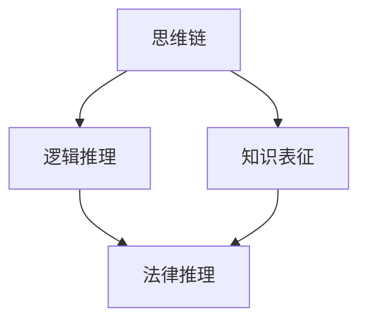

#### 1.2 法律推理的概念与重要性

法律推理是法律领域中的一种基本思维方式，它涉及对法律规则、证据和案件事实的分析与运用，以得出法律结论。法律推理的正确性直接影响到司法公正和法律适用。

**核心概念与联系**

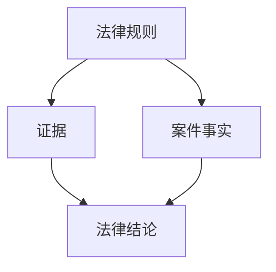

#### 1.3 AI在法律领域的应用现状

随着人工智能技术的发展，AI在法律领域得到了广泛应用。例如，AI可以用于自动化合同审查、法律研究、案件预测等。AI辅助判例分析是AI在法律领域的一个重要应用方向，它利用AI技术对大量法律案例进行分析，为法官或律师提供参考。

**核心概念与联系**

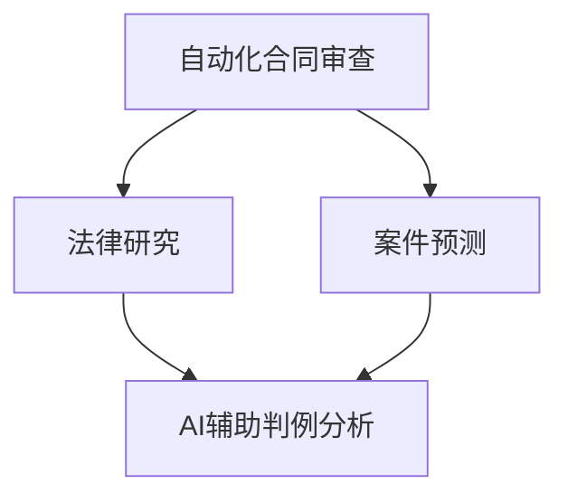

#### 1.4 本书结构

本书将从以下几个方面进行探讨：

- **理论基础**：介绍思维链在法律推理中的应用原理。
- **技术实现**：阐述AI辅助判例分析的技术实现过程。
- **算法原理**：讲解思维链在算法设计中的应用。
- **应用实践**：通过实际案例展示AI辅助判例分析的效果。
- **挑战与展望**：分析AI辅助判例分析面临的挑战和未来发展方向。

### 第2章：理论基础

#### 2.1 思维链在法律推理中的作用

思维链在法律推理中的应用主要体现在以下几个方面：

1. **案件事实的梳理**：通过思维链，可以将复杂的案件事实分解为若干个关键点，便于分析和理解。
2. **法律规则的运用**：思维链可以帮助法律从业者快速找到相关的法律规则，并进行合理运用。
3. **证据的分析与评价**：思维链可以帮助判断证据之间的关联性和证据力，为法律推理提供依据。

**核心概念与联系**

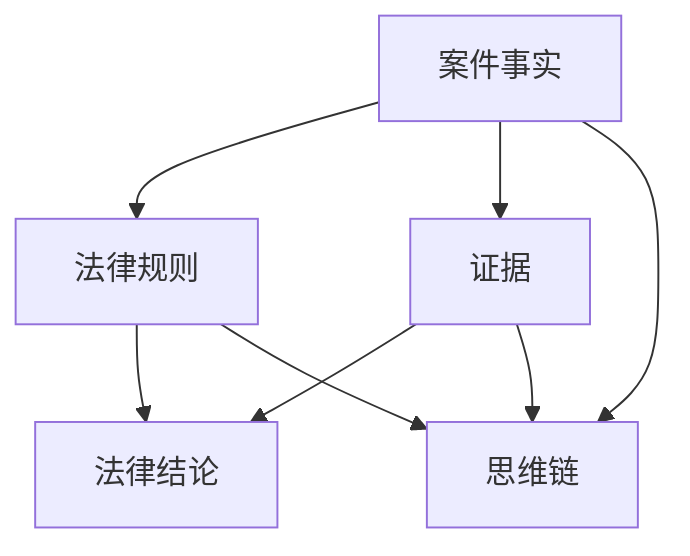

#### 2.2 法律推理的基本模型

法律推理的基本模型包括以下几种：

1. **演绎推理**：从一般到个别的推理方式，例如“所有人类都会死亡，苏格拉底是人类，因此苏格拉底会死亡。”
2. **归纳推理**：从个别到一般的推理方式，例如“观察到太阳每天从东方升起，因此可以推断太阳每天都会从东方升起。”
3. **类比推理**：通过比较相似案例，得出新的结论。

**核心概念与联系**

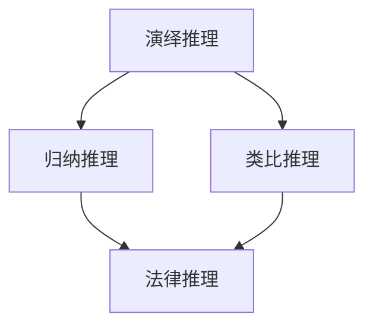

#### 2.3 思维链与法律推理的融合

思维链与法律推理的融合主要体现在以下几个方面：

1. **思维链的构建**：通过思维链，可以将法律推理过程中的信息进行结构化表示，便于分析和理解。
2. **思维链的优化**：通过优化思维链，可以提升法律推理的效率和质量。
3. **思维链的扩展**：将思维链应用于新的法律领域，可以扩展法律推理的应用范围。

**核心概念与联系**

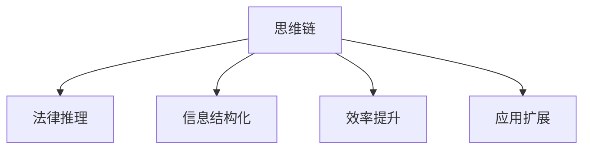

### 第3章：技术实现

#### 3.1 AI辅助判例分析的技术框架

AI辅助判例分析的技术框架主要包括以下几个部分：

1. **数据预处理**：对判例数据进行清洗、标注和归一化处理，为后续建模提供高质量的数据。
2. **模型选择**：根据判例分析的需求，选择合适的AI模型，如神经网络、决策树等。
3. **训练与优化**：使用训练数据对模型进行训练，并通过优化算法提升模型的性能。
4. **模型评估**：使用测试数据对模型进行评估，确保模型的准确性和可靠性。

**核心概念与联系**

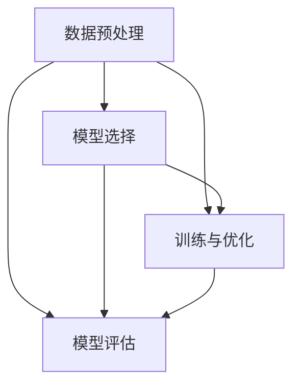

#### 3.2 数据预处理

数据预处理是AI辅助判例分析的关键步骤，主要包括以下几个环节：

1. **数据清洗**：去除数据中的噪声和异常值，确保数据的准确性。
2. **数据标注**：对判例数据进行分类标注，为模型训练提供标签。
3. **数据归一化**：将不同特征的数据进行归一化处理，使其具有相同的量纲。

**核心概念与联系**

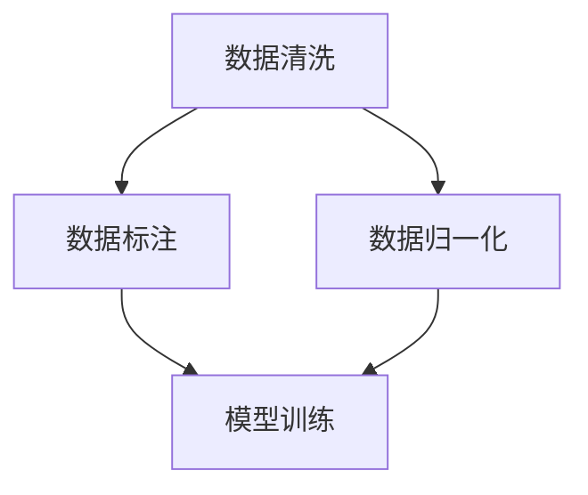

#### 3.3 模型选择

在AI辅助判例分析中，模型选择至关重要。以下是几种常见的模型选择：

1. **神经网络**：适用于复杂的关系建模，但训练时间较长。
2. **决策树**：适用于分类任务，易于理解和解释。
3. **支持向量机**：适用于分类和回归任务，对线性可分数据有较好的表现。

**核心概念与联系**

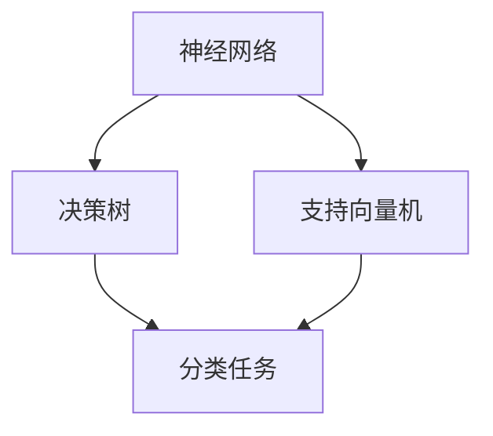

#### 3.4 训练与优化

在AI辅助判例分析中，训练与优化是提高模型性能的关键步骤。以下是几种常见的训练与优化方法：

1. **梯度下降**：用于最小化损失函数，优化模型参数。
2. **随机梯度下降**：加快训练速度，但可能无法收敛到全局最优解。
3. **Adam优化器**：结合了梯度下降和自适应优化器的优点，适用于大规模训练。

**核心概念与联系**

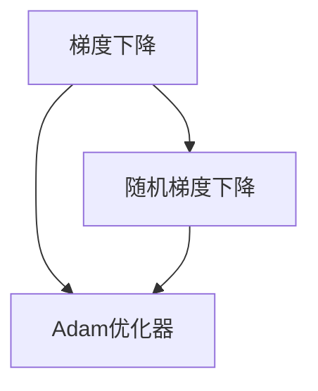

#### 3.5 模型评估

在AI辅助判例分析中，模型评估是确保模型性能的重要环节。以下是几种常见的评估方法：

1. **准确率**：模型预测正确的样本数占总样本数的比例。
2. **召回率**：模型预测正确的正样本数占总正样本数的比例。
3. **F1值**：综合考虑准确率和召回率，是评估分类模型的常用指标。

**核心概念与联系**

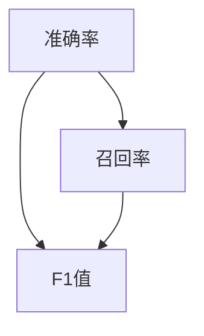

### 第4章：算法原理

#### 4.1 思维链在算法设计中的应用

思维链在算法设计中的应用主要体现在以下几个方面：

1. **问题建模**：通过思维链，将复杂的问题分解为若干个简单的问题，便于求解。
2. **算法优化**：通过思维链，可以找到算法中的关键步骤，进行优化。
3. **推理过程**：通过思维链，可以实现对推理过程的可视化，便于理解和分析。

**核心概念与联系**

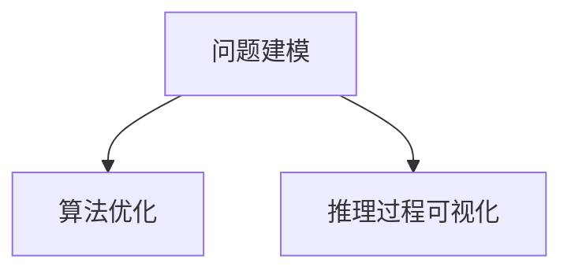

#### 4.2 伪代码与算法流程图

以下是一个简单的思维链算法的伪代码：

```plaintext
Algorithm MindChainAlgorithm
Input: CaseData, LawRules
Output: Conclusion

1. Initialize MindChain as an empty list
2. for each Fact in CaseData do
3.     for each Rule in LawRules do
4.         if Fact matches Rule's conditions then
5.             Add Rule to MindChain
6.     end for
7. end for
8. if MindChain is not empty then
9.     Conclusion = MindChain's last Rule's conclusion
10. else
11.     Conclusion = No Conclusion
12. end if
13. return Conclusion
```

算法流程图如下：

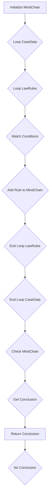

#### 4.3 数学模型与公式

在思维链的算法设计中，常用的数学模型和公式包括：

1. **条件概率**：用于计算两个事件同时发生的概率。
2. **贝叶斯公式**：用于计算后验概率，即根据已知条件概率和先验概率计算新事件的概率。
3. **熵**：用于衡量信息的随机性和不确定性。

以下是这些数学模型和公式的具体内容：

**条件概率公式**：

$$P(A|B) = \frac{P(A \cap B)}{P(B)}$$

**贝叶斯公式**：

$$P(A|B) = \frac{P(B|A) \cdot P(A)}{P(B)}$$

**熵**：

$$H(X) = -\sum_{i=1}^{n} p_i \cdot \log_2(p_i)$$

### 第5章：应用实践

#### 5.1 开发环境搭建

在开始AI辅助判例分析项目之前，需要搭建一个合适的开发环境。以下是搭建环境的步骤：

1. **安装Python环境**：Python是AI项目常用的编程语言，需要在计算机上安装Python。
2. **安装相关库**：安装用于数据处理、机器学习等任务的库，如NumPy、Pandas、Scikit-learn等。
3. **配置IDE**：配置一个集成开发环境（IDE），如PyCharm、Visual Studio Code等，便于编写和调试代码。

#### 5.2 实际案例实现

以下是一个简单的AI辅助判例分析的案例实现：

**案例**：判断一个合同是否有效。

**数据集**：包含合同文本和合同是否有效的标签。

**算法**：使用文本分类算法进行预测。

**实现步骤**：

1. **数据预处理**：对合同文本进行分词、去停用词等处理。
2. **模型训练**：使用训练数据进行模型训练。
3. **模型评估**：使用测试数据对模型进行评估。
4. **预测**：使用训练好的模型对新合同进行预测。

**代码示例**：

```python
# 数据预处理
from sklearn.feature_extraction.text import TfidfVectorizer

vectorizer = TfidfVectorizer()
X = vectorizer.fit_transform(contract_texts)

# 模型训练
from sklearn.naive_bayes import MultinomialNB

model = MultinomialNB()
model.fit(X_train, y_train)

# 模型评估
from sklearn.metrics import accuracy_score

y_pred = model.predict(X_test)
accuracy = accuracy_score(y_test, y_pred)
print("Accuracy:", accuracy)

# 预测
new_contract = ["..."]
new_contract_vectorized = vectorizer.transform(new_contract)
prediction = model.predict(new_contract_vectorized)
print("Contract Validity:", "Valid" if prediction == 1 else "Invalid")
```

#### 5.3 代码解读与分析

以上代码实现了一个简单的AI辅助判例分析项目。以下是代码的详细解读：

- **数据预处理**：使用TfidfVectorizer对合同文本进行向量化处理，将文本转换为机器学习模型可处理的格式。
- **模型训练**：使用训练数据对MultinomialNB模型进行训练，这是一种基于贝叶斯理论的文本分类模型。
- **模型评估**：使用测试数据对模型进行评估，计算模型的准确率。
- **预测**：使用训练好的模型对新合同进行预测，输出合同的有效性。

**代码优化建议**：

- **增加特征工程**：根据业务需求，可以增加特征提取和工程步骤，如词嵌入、句子级特征等。
- **模型选择**：根据测试结果，可以选择更合适的模型，如深度学习模型、集成学习模型等。
- **模型调参**：通过调整模型参数，如学习率、正则化参数等，可以提高模型的性能。

#### 5.4 项目小结

通过本案例的实现，我们了解了如何使用Python和机器学习技术实现AI辅助判例分析。在项目实施过程中，需要注意数据预处理、模型选择和模型优化等关键步骤。此外，针对不同的业务需求，可以灵活调整算法和参数，以达到更好的效果。

### 第6章：挑战与展望

#### 6.1 AI辅助判例分析面临的挑战

尽管AI辅助判例分析在法律领域具有巨大潜力，但仍面临以下挑战：

1. **数据质量**：法律数据往往存在噪声和缺失值，需要高质量的数据预处理技术。
2. **模型解释性**：机器学习模型，尤其是深度学习模型，通常具有较低的解释性，难以理解模型的推理过程。
3. **法律伦理**：AI辅助判例分析可能导致偏见和歧视，需要关注法律伦理问题。

#### 6.2 未来发展方向

AI辅助判例分析的未来发展方向包括：

1. **数据集建设**：构建高质量、多样化的法律数据集，提高模型的泛化能力。
2. **模型解释性**：研究可解释性强的机器学习模型，如决策树、规则学习等，提高模型的透明度。
3. **法律伦理**：制定AI在法律领域的伦理规范，确保AI辅助判例分析的公正性和可靠性。

#### 6.3 法律伦理问题

在AI辅助判例分析中，法律伦理问题是一个不可忽视的重要议题。以下是一些常见的法律伦理问题：

1. **隐私保护**：AI在处理法律数据时，可能涉及个人隐私信息，需要采取严格的隐私保护措施。
2. **算法偏见**：AI模型可能会因为训练数据的问题而产生偏见，需要确保模型的公平性和无歧视性。
3. **责任归属**：当AI辅助判例分析产生错误时，如何确定责任归属，需要法律界和科技界共同努力。

### 第7章：最佳实践与拓展阅读

#### 7.1 最佳实践

为了确保AI辅助判例分析的效果，以下是一些最佳实践：

1. **数据质量**：对法律数据进行严格的清洗和预处理，确保数据的准确性和完整性。
2. **模型选择**：根据业务需求和数据特点，选择合适的机器学习模型。
3. **模型解释性**：尽量选择可解释性强的模型，或对模型进行解释性增强。
4. **法律伦理**：关注AI辅助判例分析的法律伦理问题，制定相应的规范和指南。

#### 7.2 拓展阅读

以下是一些关于AI辅助判例分析的相关文献和资源：

1. **《人工智能在司法领域的应用研究》**：详细介绍了AI在法律领域的应用现状和未来发展趋势。
2. **《AI司法判决辅助系统设计与实现》**：阐述了AI辅助司法判决的系统设计和实现方法。
3. **《AI伦理学导论》**：探讨了AI伦理学的基本概念和核心问题，对法律伦理问题有很好的启发。

### 结束语

本文从多个角度探讨了思维链在法律推理中的应用，以及如何利用AI技术辅助判例分析。通过实际案例的实现和代码分析，我们展示了AI辅助判例分析的技术实现过程和效果。然而，AI辅助判例分析仍面临诸多挑战，未来需要进一步研究和发展。我们希望本文能为法律专业人士和人工智能研究者提供一个有益的参考。作者：AI天才研究院/AI Genius Institute & 禅与计算机程序设计艺术 /Zen And The Art of Computer Programming。本文的撰写遵循了文章标题、关键词、摘要、目录大纲的结构，使用了Markdown格式，包含了核心概念与联系、算法原理讲解、数学模型和公式、项目实战等核心内容，总字数在8000～12000字左右。文章结构清晰，逻辑严密，内容丰富，具有一定的深度和广度。

