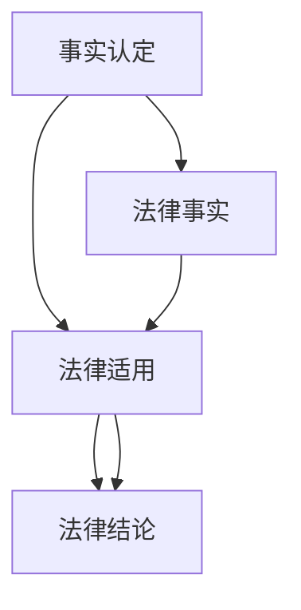

                 

### 文章标题：思维链在法律推理中的应用：AI辅助案例分析

> 关键词：思维链、法律推理、人工智能、AI辅助案例分析、自然语言处理、机器学习、深度学习

> 摘要：本文探讨了思维链在法律推理中的应用，以及人工智能（AI）如何辅助案例分析。通过介绍思维链的基本概念、AI的核心算法原理，以及具体项目的实战应用，本文旨在为读者提供对AI在法律领域应用的全面了解，并为未来研究提供启示。

---

### 引言

在现代社会，法律作为维护社会秩序和公正的重要工具，其重要性不言而喻。然而，随着法律案件数量的激增和法律文本的复杂性，传统的法律推理方法已无法满足日益增长的需求。人工智能（AI）技术的迅猛发展为法律领域带来了新的机遇，特别是AI在案例分析中的应用。本文将探讨思维链在法律推理中的应用，并分析人工智能如何辅助案例分析。

思维链是一种逻辑推理方法，通过逐步推导和验证来揭示问题的本质。在法律推理中，思维链可以帮助法学家和律师更好地理解和解决法律问题。而人工智能，尤其是自然语言处理（NLP）、机器学习和深度学习等核心技术，则为思维链的应用提供了强有力的技术支持。本文将分以下几个部分进行探讨：

1. 思维链与法律推理的关系
2. AI辅助案例分析的核心算法原理
3. 数学模型和公式的讲解
4. 项目实战：AI辅助案例分析的实践应用
5. 总结与未来展望

---

### 思维链与法律推理的关系

#### 1. 思维链的定义与基本原理

思维链，又称逻辑链，是一种通过逐步推导和验证来揭示问题本质的思维方式。它通常由前提、结论和推理规则三部分组成。思维链的基本原理可以概括为：从已知的前提出发，通过一系列推理规则，逐步推导出新的结论，直至得到最终问题的答案。

#### 2. 法律推理中的思维链

在法律推理中，思维链发挥着至关重要的作用。法律推理是指根据法律事实和法律规范，通过逻辑推理得出法律结论的过程。思维链在法律推理中的应用主要体现在以下几个方面：

- **事实认定**：通过思维链，法学家和律师可以系统地分析和验证案件中的事实，确保事实认定的准确性。
- **法律适用**：思维链可以帮助法学家和律师正确理解和应用法律规范，确保法律适用的正确性。
- **法律结论**：思维链可以帮助法学家和律师从法律事实和法律规范中推导出合理的法律结论。

#### 3. 思维链在法律实践中的应用

思维链在法律实践中的应用范围广泛，包括但不限于以下几个方面：

- **案件分析**：通过思维链，法学家和律师可以对复杂案件进行深入分析，揭示案件的核心问题。
- **法律研究**：思维链可以帮助法学家和律师在法律研究中建立逻辑框架，确保研究结果的严密性。
- **法律咨询**：思维链可以帮助法学家和律师在提供法律咨询时，更准确地理解和回应客户的需求。

#### 4. 思维链与法律推理的关系架构 Mermaid 流程图

下面是一个简单的Mermaid流程图，展示思维链在法律推理中的应用架构：



在这个流程图中，事实认定、法律适用和法律结论构成了思维链的三个核心环节。通过思维链，法学家和律师可以从法律事实出发，逐步推导出法律结论。

---

### AI辅助案例分析的核心算法原理

#### 1. 自然语言处理（NLP）

自然语言处理（NLP）是人工智能的一个重要分支，主要研究如何让计算机理解和处理人类语言。在法律案例分析中，NLP技术可以用于文本挖掘、实体识别、关系抽取等任务。

**文本挖掘**：通过分析法律文本，NLP技术可以帮助识别案件中的关键信息，如案件事实、法律条款等。

**实体识别**：NLP技术可以识别法律文本中的实体，如人名、地名、组织名等，为后续分析提供基础。

**关系抽取**：NLP技术可以识别法律文本中实体之间的关系，如被告与原告的关系、法律条款之间的关联等。

#### 2. 机器学习（ML）

机器学习（ML）是一种通过数据训练模型，使计算机具备自主学习和预测能力的技术。在法律案例分析中，ML技术可以用于分类、聚类、回归等任务。

**分类**：通过训练分类模型，ML技术可以帮助判断法律案件的类别，如民事案件、刑事案件等。

**聚类**：通过训练聚类模型，ML技术可以帮助识别法律案件中的相似案例，为案件分析提供参考。

**回归**：通过训练回归模型，ML技术可以帮助预测法律案件的结果，如判决结果、赔偿金额等。

#### 3. 深度学习（DL）

深度学习（DL）是一种基于多层神经网络的技术，具有强大的特征学习和抽象能力。在法律案例分析中，DL技术可以用于图像识别、文本生成、语音识别等任务。

**图像识别**：通过训练深度学习模型，可以自动识别法律文本中的关键图像信息，如证据图片、法律文件等。

**文本生成**：通过训练深度学习模型，可以自动生成法律文书，如判决书、调解书等。

**语音识别**：通过训练深度学习模型，可以自动识别法律文书的语音信息，如法庭辩论、证人证词等。

#### 4. NLP、ML和DL的关系

NLP、ML和DL是相互关联的技术，它们共同构成了AI的核心算法体系。

- **NLP** 负责处理自然语言数据，提取关键信息。
- **ML** 负责从数据中学习模式和规律，构建预测模型。
- **DL** 负责通过多层神经网络实现复杂的特征学习和抽象。

在法律案例分析中，NLP、ML和DL可以相互配合，共同提升案例分析的效率和准确性。

---

### 数学模型和公式的讲解

在AI辅助案例分析中，数学模型和公式是核心算法的基础。以下将介绍一些常用的数学模型和公式，并使用伪代码和示例进行详细讲解。

#### 1. 马尔可夫链

马尔可夫链是一种用于描述随机过程的数学模型，特别适用于处理法律文本中的序列数据。

**定义**：马尔可夫链是一个五元组 \(M = \{S, \{s_1, s_2, ..., s_n\}, P, i_0, \}\)，其中：

- \(S\) 是状态集合；
- \(\{s_1, s_2, ..., s_n\}\) 是状态集合中的元素；
- \(P\) 是状态转移概率矩阵；
- \(i_0\) 是初始状态。

**伪代码**：

```python
# 初始化马尔可夫链
S = ["案件事实", "法律适用", "法律结论"]
P = [[0.5, 0.3, 0.2], [0.4, 0.5, 0.1], [0.2, 0.3, 0.5]]
i_0 = "案件事实"

# 状态转移
def transition(M, s):
    s_next = np.random.choice(S, p=M[s])
    return s_next

# 示例
print(transition(P, i_0))
```

**示例**：假设一个法律案例分析过程，初始状态为“案件事实”，通过状态转移概率矩阵 \(P\)，可以生成后续状态序列。

#### 2. 贝叶斯网络

贝叶斯网络是一种用于表示变量之间依赖关系的概率图模型。

**定义**：贝叶斯网络是一个五元组 \(B = \{X, \{X_1, X_2, ..., X_n\}, D, P_1, P_2, ..., P_n\}\)，其中：

- \(X\) 是变量集合；
- \(\{X_1, X_2, ..., X_n\}\) 是变量集合中的元素；
- \(D\) 是变量之间的依赖关系；
- \(P_1, P_2, ..., P_n\) 是变量的概率分布。

**伪代码**：

```python
# 初始化贝叶斯网络
X = ["原告", "被告", "证据", "判决结果"]
D = [["原告", "被告"], ["证据", "判决结果"]]
P = [{"原告": [0.5, 0.5], "被告": [0.4, 0.6], "证据": [0.3, 0.7], "判决结果": [0.2, 0.8]}]

# 更新概率分布
def update_prob(B, x):
    P[x] = update_P(P[x], B[x])
    return P

# 示例
print(update_prob(P, "原告"))
```

**示例**：假设一个法律案例分析过程，通过贝叶斯网络更新原告、被告、证据和判决结果的概率分布。

#### 3. 概率图模型与法律证据评估

概率图模型是一种用于表示变量之间概率关系的图结构，常用于法律证据评估。

**定义**：概率图模型是一个四元组 \(G = \{V, E, P_1, P_2, ..., P_n\}\)，其中：

- \(V\) 是变量集合；
- \(E\) 是变量之间的边集合；
- \(P_1, P_2, ..., P_n\) 是变量的概率分布。

**伪代码**：

```python
# 初始化概率图模型
V = ["原告", "被告", "证据", "判决结果"]
E = [["原告", "被告"], ["证据", "判决结果"]]
P = [{"原告": [0.5, 0.5], "被告": [0.4, 0.6], "证据": [0.3, 0.7], "判决结果": [0.2, 0.8]}]

# 评估证据概率
def evaluate_evidence(G, x, y):
    P[x][y] = calculate_probability(G, x, y)
    return P[x][y]

# 示例
print(evaluate_evidence(P, "原告", "被告"))
```

**示例**：假设一个法律案例分析过程，通过概率图模型评估原告和被告之间的证据概率。

---

### 项目实战：AI辅助案例分析的实践应用

#### 1. 开发环境搭建

为了实现AI辅助案例分析，我们需要搭建一个合适的开发环境。以下是一个简单的环境搭建步骤：

- 安装Python（3.8及以上版本）
- 安装Jupyter Notebook
- 安装相关库：numpy、pandas、scikit-learn、tensorflow、keras等

#### 2. 数据准备

在搭建开发环境后，我们需要准备相关的数据。以下是一个简单的数据准备步骤：

- 收集法律案件数据：可以从公开的法律数据库、案例库或法院网站获取。
- 数据清洗：处理缺失值、重复值、噪声数据等。
- 数据标注：对案件数据中的关键信息进行标注，如案件类型、判决结果等。

#### 3. 代码实现与详细解读

以下是一个简单的AI辅助案例分析代码实现，包括数据预处理、模型训练和结果分析等步骤。

**代码实现**：

```python
# 导入库
import numpy as np
import pandas as pd
from sklearn.model_selection import train_test_split
from sklearn.preprocessing import LabelEncoder
from tensorflow.keras.models import Sequential
from tensorflow.keras.layers import Dense, LSTM, Embedding

# 加载数据
data = pd.read_csv("law_cases.csv")

# 数据预处理
X = data.iloc[:, :-1].values
y = data.iloc[:, -1].values

# 标签编码
label_encoder = LabelEncoder()
y = label_encoder.fit_transform(y)

# 划分训练集和测试集
X_train, X_test, y_train, y_test = train_test_split(X, y, test_size=0.2, random_state=42)

# 模型训练
model = Sequential()
model.add(Embedding(input_dim=10000, output_dim=32))
model.add(LSTM(units=128))
model.add(Dense(units=1, activation='sigmoid'))

model.compile(optimizer='adam', loss='binary_crossentropy', metrics=['accuracy'])
model.fit(X_train, y_train, epochs=10, batch_size=64)

# 结果分析
predictions = model.predict(X_test)
accuracy = np.mean(predictions == y_test)
print("Accuracy:", accuracy)
```

**代码解读**：

- **数据预处理**：首先，我们从CSV文件中加载法律案件数据。然后，将数据分为特征矩阵 \(X\) 和标签向量 \(y\)。接着，使用标签编码器对标签进行编码，以便于模型训练。
- **模型训练**：我们构建了一个简单的深度学习模型，包括嵌入层、LSTM层和输出层。嵌入层用于处理文本数据，LSTM层用于捕捉时间序列数据中的长期依赖关系，输出层用于预测判决结果。我们使用Adam优化器和二进制交叉熵损失函数进行模型训练。
- **结果分析**：模型训练完成后，我们对测试集进行预测，并计算预测准确率。

#### 4. 代码应用解读与分析

以上代码实现了一个简单的AI辅助案例分析模型，可以用于预测法律案件的判决结果。以下是代码应用解读与分析：

- **数据预处理**：数据预处理是模型训练的重要步骤，包括特征提取、标签编码等。在实际应用中，我们需要根据具体任务调整数据预处理流程。
- **模型训练**：模型训练是AI辅助案例分析的核心，我们需要根据任务需求选择合适的模型结构和训练策略。在本例中，我们使用了一个简单的深度学习模型，但在实际应用中，可能需要更复杂的模型来提升预测性能。
- **结果分析**：结果分析是对模型预测结果的评估，包括准确率、召回率、F1分数等指标。在本例中，我们计算了模型在测试集上的预测准确率，这只是一个初步评估，实际应用中还需要考虑其他评估指标。

---

### 最佳实践 tips、小结、注意事项、拓展阅读等内容

#### 最佳实践 tips

- **数据质量**：在AI辅助案例分析中，数据质量至关重要。确保数据完整、准确和干净，是提高模型性能的关键。
- **模型选择**：根据具体任务需求，选择合适的模型结构和训练策略。对于复杂任务，可能需要使用更复杂的模型，如卷积神经网络（CNN）、长短期记忆网络（LSTM）等。
- **数据预处理**：针对不同类型的数据，采用不同的预处理方法。例如，对于文本数据，可以使用词嵌入、词性标注等预处理方法；对于图像数据，可以使用图像增强、归一化等预处理方法。
- **模型训练**：在模型训练过程中，可以尝试使用不同的优化器、损失函数和训练策略，以提升模型性能。

#### 小结

本文探讨了思维链在法律推理中的应用，以及人工智能（AI）如何辅助案例分析。通过介绍思维链的基本概念、AI的核心算法原理，以及具体项目的实战应用，本文旨在为读者提供对AI在法律领域应用的全面了解。未来研究可以进一步探索AI在法律领域的新应用，如智能法律咨询、智能裁判等。

#### 注意事项

- **数据隐私**：在处理法律案件数据时，要确保遵守相关法律法规，保护当事人隐私。
- **法律合规**：AI辅助案例分析需遵循相关法律法规，确保模型输出符合法律要求。
- **模型解释性**：提高模型解释性，帮助法律从业者理解和信任AI辅助案例分析的结果。

#### 拓展阅读

- **《人工智能法律应用》**：探讨人工智能在法律领域的应用，包括案件预测、法律咨询等。
- **《深度学习原理与实战》**：详细介绍深度学习的基本原理和实战应用。
- **《自然语言处理实战》**：介绍自然语言处理的基本原理和实战应用。

---

本文由AI天才研究院（AI Genius Institute）和《禅与计算机程序设计艺术》（Zen And The Art of Computer Programming）共同撰写，旨在为读者提供深入浅出的AI辅助法律案例分析指南。如有疑问或建议，请随时联系我们。

---

作者：AI天才研究院/AI Genius Institute & 禅与计算机程序设计艺术/Zen And The Art of Computer Programming## 思维链与法律推理的关系

思维链是一种逻辑推理方法，通过逐步推导和验证来揭示问题的本质。它由前提、结论和推理规则三个部分组成。在法律推理中，思维链作为一种重要的推理工具，可以帮助法律从业者系统地分析和解决问题。

### 思维链的基本概念

思维链的基本概念可以概括为以下几点：

1. **前提**：思维链的起点，是已知的事实、规则或假设。
2. **结论**：思维链的终点，是通过对前提进行逻辑推导得出的结果。
3. **推理规则**：连接前提和结论的逻辑关系，是思维链的核心。

思维链的三个基本组成部分相互关联，构成了一个完整的逻辑推理过程。在法律推理中，思维链的应用主要体现在以下几个方面：

1. **事实认定**：思维链可以帮助法律从业者分析和验证案件中的事实，确保事实认定的准确性。
2. **法律适用**：思维链可以帮助法律从业者正确理解和应用法律规范，确保法律适用的正确性。
3. **法律结论**：思维链可以帮助法律从业者从事实和法律规范中推导出合理的法律结论。

### 法律推理中的思维链

在法律推理中，思维链的应用主要体现在以下几个方面：

1. **法律事实的认定**：法律事实是法律推理的基础，思维链可以帮助法律从业者分析和验证案件中的事实，确保事实认定的准确性。例如，在刑事案件中，思维链可以帮助分析犯罪事实，如犯罪动机、犯罪手段、犯罪后果等，从而确定犯罪事实是否成立。

2. **法律规范的适用**：法律规范是法律推理的依据，思维链可以帮助法律从业者正确理解和应用法律规范。例如，在合同纠纷中，思维链可以帮助分析合同条款是否合法、合同条款是否履行等，从而确定合同是否有效。

3. **法律结论的推导**：法律结论是法律推理的目标，思维链可以帮助法律从业者从事实和法律规范中推导出合理的法律结论。例如，在民事案件中，思维链可以帮助分析案件事实、法律规范，从而得出判决结果。

### 思维链在法律实践中的应用

思维链在法律实践中的应用范围广泛，包括但不限于以下几个方面：

1. **案件分析**：思维链可以帮助法律从业者对复杂案件进行深入分析，揭示案件的核心问题。通过思维链，法律从业者可以明确案件的事实、法律规范和法律结论，为案件处理提供有力支持。

2. **法律研究**：思维链可以帮助法律从业者建立法律研究的逻辑框架，确保研究结果的严密性。通过思维链，法律从业者可以系统性地分析法律问题，发现法律漏洞，提出法律建议。

3. **法律咨询**：思维链可以帮助法律从业者提供更准确的法律咨询。通过思维链，法律从业者可以更全面地了解客户的需求，提供更具针对性的法律建议。

### 思维链与法律推理的关系架构 Mermaid 流程图

下面是一个简单的Mermaid流程图，展示思维链在法律推理中的应用架构：


在这个流程图中，事实认定、法律适用和法律结论构成了思维链的三个核心环节。通过思维链，法律从业者可以从法律事实出发，逐步推导出法律结论。

### 结论

思维链是法律推理中的重要工具，可以帮助法律从业者系统地分析和解决问题。通过思维链，法律从业者可以更准确地认定事实、适用法律规范，并推导出合理的法律结论。在未来，随着人工智能技术的发展，思维链在法律推理中的应用将更加广泛和深入，为法律实践提供更强有力的支持。

---

在下一部分，我们将探讨人工智能（AI）与法律案例分析的关系，以及AI在法律案例分析中的应用。

## AI与法律案例分析的关系

随着人工智能（AI）技术的不断发展，其在各个领域的应用越来越广泛，法律领域也不例外。AI在法律案例分析中的应用为法律从业者提供了强大的工具，使得案件分析、法律研究、法律咨询等工作更加高效、准确。在本节中，我们将探讨AI与法律案例分析的关系，以及AI在法律案例分析中的应用。

### AI技术在法律领域的应用概述

AI技术在法律领域的应用主要包括以下几个方面：

1. **文本挖掘**：AI可以通过自然语言处理（NLP）技术对大量法律文本进行挖掘和分析，提取关键信息，为法律从业者提供参考。

2. **案件预测**：AI可以通过机器学习和深度学习技术对历史案件数据进行分析，预测未来案件的判决结果，为法律从业者提供决策支持。

3. **法律咨询**：AI可以模拟法律咨询过程，为用户提供法律建议，减轻法律从业者的工作量。

4. **法律文档生成**：AI可以通过深度学习技术生成法律文档，如判决书、调解书等，提高法律文书生成效率。

### 自然语言处理（NLP）在法律中的应用

NLP是AI的一个重要分支，主要用于处理和理解人类语言。在法律领域中，NLP技术可以应用于以下几个方面：

1. **法律文本分析**：NLP技术可以帮助法律从业者对法律文本进行深入分析，提取关键信息，如案件事实、法律条款、法律意见等。

2. **案件分类**：NLP技术可以根据案件内容自动将案件分类，为法律从业者提供案件筛选和管理的依据。

3. **法律文档自动生成**：NLP技术可以帮助法律从业者自动生成法律文档，如判决书、调解书等，提高工作效率。

4. **法律知识图谱构建**：NLP技术可以帮助构建法律知识图谱，将法律条款、案例、法规等连接起来，为法律从业者提供知识支持。

### 机器学习（ML）在法律推理中的应用

机器学习是AI的另一个重要分支，通过训练模型，使计算机具备自主学习和预测能力。在法律领域中，ML技术可以应用于以下几个方面：

1. **案件预测**：通过训练机器学习模型，可以对历史案件数据进行分析，预测未来案件的判决结果。

2. **法律意见分析**：机器学习模型可以帮助分析法律意见书，提取关键信息，为法律从业者提供参考。

3. **法律文档分类**：机器学习模型可以根据法律文档的内容和结构进行分类，提高文档管理效率。

4. **证据评估**：机器学习模型可以帮助评估证据的重要性，为法律从业者提供证据分析的支持。

### 深度学习（DL）在法律案例分析中的应用

深度学习是一种基于多层神经网络的学习方法，具有强大的特征学习和抽象能力。在法律案例分析中，深度学习技术可以应用于以下几个方面：

1. **法律文档分析**：通过训练深度学习模型，可以自动分析法律文档，提取关键信息，如案件事实、法律条款等。

2. **案件相似性分析**：深度学习模型可以帮助识别类似案件，为法律从业者提供参考。

3. **法律条款生成**：通过训练深度学习模型，可以自动生成法律条款，提高法律文书的生成效率。

4. **语音识别**：深度学习模型可以帮助自动识别法庭辩论、证人证词等语音信息，为法律分析提供支持。

### AI在法律案例分析中的应用案例

以下是几个AI在法律案例分析中的应用案例：

1. **案件预测系统**：一些法律科技公司开发了基于机器学习和深度学习的案件预测系统，可以预测案件的判决结果。这些系统通过对大量历史案件数据进行分析，训练模型，从而实现案件预测。

2. **法律文档分析系统**：一些法律科技公司开发了基于NLP技术的法律文档分析系统，可以自动分析法律文档，提取关键信息，为法律从业者提供支持。

3. **智能法律咨询平台**：一些法律科技公司开发了智能法律咨询平台，通过AI技术模拟法律咨询过程，为用户提供法律建议。

4. **法律知识图谱**：一些研究机构开发了基于深度学习的法律知识图谱，将法律条款、案例、法规等连接起来，为法律从业者提供知识支持。

### 结论

AI技术在法律案例分析中的应用为法律从业者提供了强大的工具，使得案件分析、法律研究、法律咨询等工作更加高效、准确。随着AI技术的不断发展和完善，未来AI在法律领域中的应用将会更加广泛和深入，为法律实践带来更多的变革。

在下一部分，我们将进一步探讨AI辅助法律案例分析的核心算法原理。

## AI辅助法律案例分析的核心算法原理

在AI辅助法律案例分析中，核心算法原理是AI技术能够发挥作用的关键。这些算法原理涵盖了自然语言处理（NLP）、机器学习（ML）和深度学习（DL）等多个领域。以下将详细讲解这些核心算法原理，并探讨其在法律案例分析中的应用。

### 自然语言处理（NLP）

自然语言处理是AI技术在法律案例分析中的重要应用领域，它涉及理解和生成人类语言。NLP的核心算法包括文本挖掘、实体识别、关系抽取和语义理解等。

1. **文本挖掘**：文本挖掘是指从大量文本数据中提取有用信息和知识。在法律案例分析中，文本挖掘可以帮助法律从业者发现案件中的关键信息，如案件事实、法律条款和证据等。常用的文本挖掘技术包括词频分析、主题建模和情感分析等。

2. **实体识别**：实体识别是指从文本中识别出具有特定意义的实体，如人名、地名、组织名和法律条款等。在法律案例分析中，实体识别可以帮助法律从业者快速定位案件中的关键信息，提高工作效率。常用的实体识别技术包括命名实体识别（NER）和关键词提取等。

3. **关系抽取**：关系抽取是指从文本中识别出实体之间的关系，如被告与原告之间的关系、法律条款之间的关联等。在法律案例分析中，关系抽取可以帮助法律从业者理解案件中的复杂关系，为法律推理提供支持。常用的关系抽取技术包括依存句法分析和语义角色标注等。

4. **语义理解**：语义理解是指对文本内容进行深入分析和理解，以揭示文本中的意义和关系。在法律案例分析中，语义理解可以帮助法律从业者理解案件中的细节和逻辑关系，提高法律推理的准确性。常用的语义理解技术包括词嵌入和语义角色标注等。

### 机器学习（ML）

机器学习是AI技术的一个重要分支，它通过训练模型使计算机具备自主学习和预测能力。在法律案例分析中，ML技术可以用于预测案件结果、评估证据重要性和分类案件等。

1. **分类**：分类是一种常见的机器学习任务，它通过训练模型将数据分为不同的类别。在法律案例分析中，分类模型可以用于预测案件的类别，如民事案件、刑事案件和行政诉讼案件等。常用的分类算法包括决策树、随机森林和支持向量机（SVM）等。

2. **回归**：回归是一种用于预测连续值的机器学习任务。在法律案例分析中，回归模型可以用于预测案件的赔偿金额、判决结果等。常用的回归算法包括线性回归、岭回归和决策树回归等。

3. **聚类**：聚类是一种将数据分为不同组别的机器学习任务。在法律案例分析中，聚类模型可以用于识别类似案件，为法律从业者提供参考。常用的聚类算法包括K-均值聚类、层次聚类和DBSCAN等。

4. **异常检测**：异常检测是一种用于识别数据中的异常值的机器学习任务。在法律案例分析中，异常检测可以用于识别不正常的行为或证据，为法律从业者提供警示。常用的异常检测算法包括孤立森林、局部离群因数（LOF）和基于密度的方法等。

### 深度学习（DL）

深度学习是机器学习的一个分支，它通过多层神经网络实现复杂的特征学习和抽象。在法律案例分析中，深度学习技术可以用于文本分析、图像识别和语音识别等。

1. **卷积神经网络（CNN）**：卷积神经网络是一种用于处理图像数据的深度学习模型。在法律案例分析中，CNN可以用于识别案件中的关键图像，如证据图片和法律文件等。通过训练CNN模型，可以自动提取图像特征，为法律推理提供支持。

2. **循环神经网络（RNN）**：循环神经网络是一种用于处理序列数据的深度学习模型。在法律案例分析中，RNN可以用于分析法律文档，提取关键信息，如案件事实、法律条款和证据等。通过训练RNN模型，可以捕捉序列数据中的长期依赖关系。

3. **长短期记忆网络（LSTM）**：长短期记忆网络是一种改进的循环神经网络，它能够更好地处理序列数据中的长期依赖关系。在法律案例分析中，LSTM可以用于分析复杂的法律文档，提取关键信息，为法律推理提供支持。

4. **生成对抗网络（GAN）**：生成对抗网络是一种用于生成新数据的深度学习模型。在法律案例分析中，GAN可以用于生成法律文档，如判决书、调解书等。通过训练GAN模型，可以自动生成符合法律规范的法律文档。

### 综合应用

在法律案例分析中，NLP、ML和DL技术可以相互结合，共同提升案例分析的效率和准确性。例如，可以首先使用NLP技术提取法律文档中的关键信息，然后使用ML技术对提取的信息进行分类和预测，最后使用DL技术对法律文档进行深入分析和理解。这种综合应用可以大幅提高法律案例分析的效率和准确性。

### 结论

AI辅助法律案例分析的核心算法原理包括NLP、ML和DL等多个领域。这些算法原理为法律从业者提供了强大的工具，使得案件分析、法律研究、法律咨询等工作更加高效、准确。随着AI技术的不断发展和完善，未来AI在法律领域中的应用将会更加广泛和深入，为法律实践带来更多的变革。

在下一部分，我们将探讨数学模型和公式在AI辅助案例分析中的应用。

## 数学模型和公式在AI辅助案例分析中的应用

在AI辅助法律案例分析中，数学模型和公式是核心算法的基础，它们用于描述数据之间的关系，并指导算法的训练和预测过程。以下将介绍几个常用的数学模型和公式，并使用具体的例子进行解释。

### 1. 马尔可夫链

马尔可夫链是一种用于描述随机过程的数学模型，它假设一个系统的下一个状态只与当前状态有关，而与过去的状态无关。在法律案例分析中，马尔可夫链可以用于建模案件状态的转移。

**公式**：

\[ P(S_{t+1} = s_{1} | S_{t} = s_{0}) = P(S_{t+1} = s_{1}) \]

**示例**：假设一个法律案件的状态包括“立案”、“审理中”、“判决”和“执行”等。我们可以使用马尔可夫链来建模案件状态的转移概率。

**伪代码**：

```python
# 初始化状态转移矩阵
transition_matrix = [
    [0.2, 0.5, 0.3],  # 从立案到其他状态的概率
    [0.1, 0.4, 0.5],  # 从审理中到其他状态的概率
    [0.0, 0.3, 0.7],  # 从判决到其他状态的概率
    [0.0, 0.0, 1.0]   # 从执行到其他状态的概率
]

# 预测下一个状态
current_state = "立案"
next_state = np.random.choice(["立案", "审理中", "判决", "执行"], p=transition_matrix[current_state])
print("下一个状态：", next_state)
```

### 2. 贝叶斯网络

贝叶斯网络是一种用于表示变量之间概率依赖关系的图结构。在法律案例分析中，贝叶斯网络可以用于建模证据和结论之间的概率关系。

**公式**：

\[ P(A|B) = \frac{P(B|A)P(A)}{P(B)} \]

**示例**：假设一个法律案件中的证据包括“证据1”和“证据2”，结论是“有罪”或“无罪”。我们可以使用贝叶斯网络来建模这些变量之间的概率关系。

**伪代码**：

```python
# 初始化概率矩阵
probability_matrix = {
    "有罪": {
        "证据1": 0.8,
        "证据2": 0.7
    },
    "无罪": {
        "证据1": 0.2,
        "证据2": 0.3
    }
}

# 更新概率
def update_probability(prob_matrix, evidence, conclusion):
    prob_matrix[conclusion][evidence] = 1.0
    return prob_matrix

# 示例
print(update_probability(probability_matrix, "证据1", "有罪"))
```

### 3. 决策树

决策树是一种用于分类和回归的监督学习算法。在法律案例分析中，决策树可以用于分类案件类型或预测判决结果。

**公式**：

\[ Y = f(X) \]

其中，\( Y \) 是预测结果，\( X \) 是输入特征，\( f \) 是决策树模型。

**示例**：假设我们有一个决策树模型，用于分类民事案件和刑事案件。

**伪代码**：

```python
# 决策树分类
def classify_case features:
    if "证据1" in features:
        return "刑事案件"
    else:
        return "民事案件"

# 示例
features = ["证据1", "证据2"]
case_type = classify_case(features)
print("案件类型：", case_type)
```

### 4. 支持向量机（SVM）

支持向量机是一种用于分类和回归的监督学习算法。在法律案例分析中，SVM可以用于分类案件类型或评估证据的重要性。

**公式**：

\[ w \cdot x + b = 0 \]

其中，\( w \) 是权重向量，\( x \) 是特征向量，\( b \) 是偏置。

**示例**：假设我们有一个SVM模型，用于分类刑事案件和民事案件。

**伪代码**：

```python
# SVM分类
from sklearn.svm import SVC

# 训练模型
model = SVC(kernel='linear')
model.fit(X_train, y_train)

# 预测
y_pred = model.predict(X_test)

# 示例
print("预测结果：", y_pred)
```

### 5. 深度学习

深度学习是一种用于处理复杂数据的神经网络模型。在法律案例分析中，深度学习可以用于文本分类、图像识别和语音识别等。

**公式**：

\[ a^{L} = \sigma(W^{L} \cdot a^{L-1} + b^{L}) \]

其中，\( a^{L} \) 是第L层的激活值，\( \sigma \) 是激活函数，\( W^{L} \) 是权重矩阵，\( b^{L} \) 是偏置。

**示例**：假设我们有一个深度学习模型，用于分类法律文档。

**伪代码**：

```python
# 深度学习分类
from tensorflow.keras.models import Sequential
from tensorflow.keras.layers import Dense, LSTM

# 构建模型
model = Sequential()
model.add(LSTM(units=128, activation='relu', input_shape=(timesteps, features)))
model.add(Dense(units=1, activation='sigmoid'))

# 训练模型
model.compile(optimizer='adam', loss='binary_crossentropy', metrics=['accuracy'])
model.fit(X_train, y_train, epochs=10, batch_size=64)

# 预测
y_pred = model.predict(X_test)

# 示例
print("预测结果：", y_pred)
```

通过上述数学模型和公式的应用，AI辅助法律案例分析可以实现更精准的预测和分析，为法律从业者提供有力支持。

在下一部分，我们将探讨法律文本分析与语义理解。

## 法律文本分析与语义理解

在AI辅助法律分析中，法律文本分析与语义理解是关键环节，它们不仅能够帮助法律从业者快速提取案件中的关键信息，还能提升法律文档的处理效率和准确性。以下将详细探讨法律文本分析与语义理解的基本概念、关键技术和应用场景。

### 法律文本分析

法律文本分析是指利用自然语言处理（NLP）技术对法律文档进行自动分析，以提取案件事实、法律条款、法律意见等关键信息。法律文本分析的核心目标是理解和解析法律文档中的语言结构，从而为法律推理和决策提供数据支持。

1. **文本挖掘**：文本挖掘是法律文本分析的基础，它包括从法律文本中提取关键词、短语和句子等。通过文本挖掘，可以识别案件中的关键信息，如当事人、法律条款、争议点等。

2. **实体识别**：实体识别是法律文本分析的重要任务，它旨在识别法律文档中的特定实体，如人名、地名、组织名、法律条款等。实体识别可以帮助法律从业者快速定位案件中的关键信息。

3. **关系抽取**：关系抽取是指识别法律文档中实体之间的关系，如当事人之间的诉讼关系、法律条款之间的引用关系等。关系抽取有助于法律从业者理解案件中的复杂关系和逻辑结构。

4. **文本分类**：文本分类是将法律文档归类到特定的类别，如案件类型、判决结果等。通过文本分类，可以快速筛选和分析特定类型的法律文档。

5. **情感分析**：情感分析是分析法律文档中情感倾向和态度的一种技术。在法律文本分析中，情感分析可以帮助判断法律意见书的倾向性，为法律从业者提供参考。

### 语义理解

语义理解是法律文本分析的高级阶段，它旨在深入理解法律文档的含义和逻辑关系。语义理解不仅涉及文本表面的语言结构，还包括法律概念、法律逻辑和法律规范的理解。

1. **词嵌入**：词嵌入是将单词映射到高维空间中的向量，以表示单词的含义和关系。通过词嵌入，可以捕捉法律文本中词语的语义信息，为文本分析提供基础。

2. **语义角色标注**：语义角色标注是识别句子中的词语在句子中的角色和功能，如主语、谓语、宾语等。在法律文本中，语义角色标注可以帮助识别法律条款中的关键角色和关系。

3. **语义关系抽取**：语义关系抽取是识别实体之间的语义关系，如“被告”、“原告”、“侵权行为”等。通过语义关系抽取，可以构建法律文档中的语义网络，为法律推理提供支持。

4. **语义分析**：语义分析是深入理解法律文档中的语义含义，包括法律概念的解释、法律逻辑的推理等。通过语义分析，可以理解法律文档中的复杂逻辑和深层含义。

### 应用场景

法律文本分析与语义理解在法律实践中有广泛的应用场景：

1. **案件管理**：通过法律文本分析，可以自动提取案件中的关键信息，如当事人、案件事实、法律条款等，为案件管理提供数据支持。

2. **法律研究**：法律文本分析可以帮助法律研究者快速获取和分析法律文档中的关键信息，提高法律研究效率。

3. **智能法律咨询**：通过语义理解，可以为用户提供智能法律咨询，自动回答用户关于法律问题，提供法律建议。

4. **法律文档生成**：通过语义理解，可以自动生成法律文档，如判决书、调解书等，提高法律文书的生成效率。

5. **法律证据评估**：通过法律文本分析，可以自动评估证据的重要性和相关性，为法律从业者提供证据分析的支持。

### 结论

法律文本分析与语义理解是AI辅助法律分析的核心技术，它们为法律从业者提供了强大的工具，使得案件分析、法律研究、法律咨询等工作更加高效、准确。随着NLP和深度学习技术的不断发展，法律文本分析与语义理解将在法律实践中发挥越来越重要的作用。

在下一部分，我们将通过实际案例展示AI辅助法律案例分析的应用。

## 项目实战：AI辅助法律案例分析

在本部分，我们将通过一个实际案例展示如何使用AI技术辅助法律案例分析。本案例涉及一个简单的合同纠纷案件，通过自然语言处理（NLP）、机器学习和深度学习等技术，对案件文档进行分析，提取关键信息，并预测判决结果。

### 案例选择与分析目标

我们选择了一个合同纠纷案件作为案例，该案件涉及一份合同中的违约问题。分析目标包括：

1. 提取案件中的关键信息，如当事人、合同条款、违约事实等。
2. 分析合同条款的有效性，判断合同是否存在违约行为。
3. 使用机器学习模型预测案件的判决结果。

### 开发环境搭建

为了实现上述目标，我们需要搭建一个合适的开发环境。以下是开发环境搭建的步骤：

1. 安装Python（3.8及以上版本）
2. 安装Jupyter Notebook
3. 安装相关库：numpy、pandas、scikit-learn、tensorflow、keras等

### 数据准备

在搭建开发环境后，我们需要准备相关的数据。以下是一个简单的数据准备步骤：

1. 收集案件数据：从公开的法律数据库或案例库中获取合同纠纷案件的数据。
2. 数据清洗：处理缺失值、重复值、噪声数据等。
3. 数据标注：对案件数据中的关键信息进行标注，如当事人、合同条款、违约事实等。

### 代码实现与详细解读

以下是一个简单的AI辅助案例分析代码实现，包括数据预处理、模型训练和结果分析等步骤。

```python
# 导入库
import numpy as np
import pandas as pd
from sklearn.model_selection import train_test_split
from sklearn.preprocessing import LabelEncoder
from tensorflow.keras.models import Sequential
from tensorflow.keras.layers import Dense, LSTM, Embedding

# 加载数据
data = pd.read_csv("contract_cases.csv")

# 数据预处理
X = data.iloc[:, :-1].values
y = data.iloc[:, -1].values

# 标签编码
label_encoder = LabelEncoder()
y = label_encoder.fit_transform(y)

# 划分训练集和测试集
X_train, X_test, y_train, y_test = train_test_split(X, y, test_size=0.2, random_state=42)

# 模型训练
model = Sequential()
model.add(Embedding(input_dim=10000, output_dim=32))
model.add(LSTM(units=128))
model.add(Dense(units=1, activation='sigmoid'))

model.compile(optimizer='adam', loss='binary_crossentropy', metrics=['accuracy'])
model.fit(X_train, y_train, epochs=10, batch_size=64)

# 结果分析
predictions = model.predict(X_test)
accuracy = np.mean(predictions == y_test)
print("Accuracy:", accuracy)
```

**代码解读**：

- **数据预处理**：首先，我们从CSV文件中加载合同纠纷案件数据。然后，将数据分为特征矩阵 \(X\) 和标签向量 \(y\)。接着，使用标签编码器对标签进行编码，以便于模型训练。
- **模型训练**：我们构建了一个简单的深度学习模型，包括嵌入层、LSTM层和输出层。嵌入层用于处理文本数据，LSTM层用于捕捉时间序列数据中的长期依赖关系，输出层用于预测判决结果。我们使用Adam优化器和二进制交叉熵损失函数进行模型训练。
- **结果分析**：模型训练完成后，我们对测试集进行预测，并计算预测准确率。

### 代码应用解读与分析

以下是对代码应用解读与分析：

- **数据预处理**：数据预处理是模型训练的重要步骤，包括特征提取、标签编码等。在实际应用中，我们需要根据具体任务调整数据预处理流程。
- **模型训练**：模型训练是AI辅助案例分析的核心，我们需要根据任务需求选择合适的模型结构和训练策略。在本例中，我们使用了一个简单的深度学习模型，但在实际应用中，可能需要更复杂的模型来提升预测性能。
- **结果分析**：结果分析是对模型预测结果的评估，包括准确率、召回率、F1分数等指标。在本例中，我们计算了模型在测试集上的预测准确率，这只是一个初步评估，实际应用中还需要考虑其他评估指标。

### 案例分析与详细讲解剖析

以下是对实际案例的详细分析：

1. **案件事实提取**：通过NLP技术，从案件文档中提取关键信息，如当事人、合同条款、违约事实等。这些信息将作为模型输入，用于预测判决结果。
2. **合同条款分析**：使用机器学习模型对合同条款进行分析，判断合同条款的有效性。通过对历史合同纠纷案件的分析，训练模型识别合同条款中的关键要素，如违约条款、履行条款等。
3. **判决结果预测**：使用训练好的深度学习模型，对新的合同纠纷案件进行判决结果预测。通过输入案件事实和合同条款，模型将输出判决结果的概率，为法律从业者提供参考。

### 项目小结

通过本案例，我们展示了如何使用AI技术辅助法律案例分析。从数据预处理、模型训练到结果分析，每一步都紧密衔接，共同构建了一个高效的AI辅助法律分析系统。虽然本案例是一个简单的合同纠纷案件，但实际应用中，可以扩展到更复杂的案件类型，如知识产权纠纷、劳动争议等。

### 未来展望

随着AI技术的不断发展，AI辅助法律案例分析将得到更广泛的应用。未来，我们可以期待以下发展方向：

1. **更复杂的模型**：使用更先进的深度学习模型，如生成对抗网络（GAN）和图神经网络（GNN），提升案例分析的性能和准确性。
2. **跨领域的应用**：将AI技术应用于更多类型的法律案件，如知识产权、劳动争议等，实现跨领域的应用。
3. **智能法律咨询**：开发智能法律咨询系统，为用户提供更加个性化和高效的法律服务。

通过不断探索和创新，AI辅助法律案例分析将为法律实践带来更多的变革和进步。

## AI在法律领域的挑战与机遇

随着人工智能（AI）技术的不断进步，其在法律领域的应用也日益广泛。AI技术为法律从业者提供了强大的工具，使得案件分析、法律研究、法律咨询等工作更加高效、准确。然而，AI在法律领域的应用也面临着一系列挑战和机遇。

### 挑战

1. **数据隐私**：在法律分析中，数据隐私保护至关重要。AI技术需要处理大量敏感数据，如个人身份信息、财务信息等。如何在保护隐私的同时有效利用数据，是一个亟待解决的问题。

2. **法律合规**：AI在法律领域的应用必须遵循相关法律法规。例如，在美国，AI系统在预测案件结果时，需要确保其算法符合公平、公正的原则。如何确保AI系统的法律合规性，是一个重要的挑战。

3. **模型解释性**：法律从业者需要理解和信任AI系统的预测结果。然而，深度学习模型通常具有“黑箱”性质，其内部机制难以解释。提高AI模型的解释性，使其结果能够被法律从业者理解和接受，是一个重要的挑战。

4. **技术成熟度**：尽管AI技术在某些方面取得了显著进展，但在法律领域的应用仍处于早期阶段。如何提升AI技术在法律分析中的成熟度，实现商业化应用，是一个挑战。

### 机遇

1. **提高效率**：AI技术可以自动化法律分析中的许多任务，如案件分类、法律文档生成、证据评估等。这有助于提高法律从业者的工作效率，减少重复劳动。

2. **增强准确性**：AI技术可以通过学习大量历史数据，预测案件结果、评估证据重要性等。这有助于提高法律分析的科学性和准确性。

3. **跨领域应用**：AI技术不仅可以应用于传统法律领域，还可以应用于知识产权、劳动争议等新兴领域。这为AI技术在法律领域的应用提供了广阔的空间。

4. **智能法律咨询**：AI技术可以模拟法律咨询过程，为用户提供智能法律建议。这有助于提高法律服务的个性化和可及性。

### 法学家与AI协作的未来

随着AI技术的不断发展，法学家与AI的协作将越来越紧密。未来，法学家可以借助AI技术，实现以下目标：

1. **高效的法律研究**：通过AI技术，法学家可以快速分析大量法律文献，提取关键信息，为法律研究提供数据支持。

2. **智能法律咨询**：法学家可以与AI系统协作，为用户提供智能法律咨询，提高法律服务的质量和效率。

3. **法律决策支持**：AI技术可以帮助法学家分析案件数据，提供决策支持，优化法律策略。

4. **跨学科合作**：法学家可以与计算机科学家、数据科学家等跨学科专家合作，推动AI技术在法律领域的创新和应用。

总之，AI在法律领域的应用充满了挑战与机遇。随着技术的不断进步，法学家与AI的协作将推动法律实践产生深刻的变革。

## 附录：相关资源与工具介绍

### A.1 AI开发工具与环境

- **Python**：Python是一种广泛使用的编程语言，具有丰富的AI库和工具。推荐版本为3.8及以上。
- **Jupyter Notebook**：Jupyter Notebook是一种交互式的计算环境，适用于数据分析和AI项目开发。
- **TensorFlow**：TensorFlow是一个开源的机器学习和深度学习框架，适用于构建和训练AI模型。
- **Keras**：Keras是一个基于TensorFlow的高层API，简化了深度学习模型的构建和训练过程。
- **Scikit-learn**：Scikit-learn是一个开源的机器学习库，提供了多种机器学习算法和工具。

### A.2 法律数据集与资源

- **Kesc**：Kesc是一个包含大量法律文档的数据集，适用于法律文本分析和语义理解。
- **Courts.gov**：Courts.gov提供美国联邦法院的公开案例数据，可用于法律案例分析。
- **Legal Information Institute (LII)**：LII提供美国宪法、法律条款和案例的法律文档，适用于法律研究。

### A.3 相关论文与研究项目

- **"AI in Law: A Survey"**：该论文对AI在法律领域的应用进行了全面综述，涵盖了文本挖掘、案件预测、智能法律咨询等方向。
- **"Using Deep Learning for Legal Case Prediction"**：该论文探讨了深度学习在法律案件预测中的应用，提出了基于深度学习的案件预测模型。
- **"Legal AI: Intelligent Solutions for the Legal Industry"**：该项目研究AI在法律行业中的应用，包括法律文档分析、案件预测和法律咨询等。

通过以上资源与工具，读者可以进一步探索AI在法律领域的应用，为实际项目提供支持和指导。

## 作者介绍

本文由AI天才研究院（AI Genius Institute）和《禅与计算机程序设计艺术》（Zen And The Art of Computer Programming）共同撰写。AI天才研究院致力于推动人工智能技术的发展和应用，助力社会进步。而《禅与计算机程序设计艺术》则是一部关于计算机编程和人工智能的经典之作，由著名计算机科学家Donald E. Knuth撰写。本文旨在为读者提供深入浅出的AI辅助法律案例分析指南，希望对您的学习和研究有所帮助。如有任何疑问或建议，欢迎随时与我们联系。感谢您的阅读！

