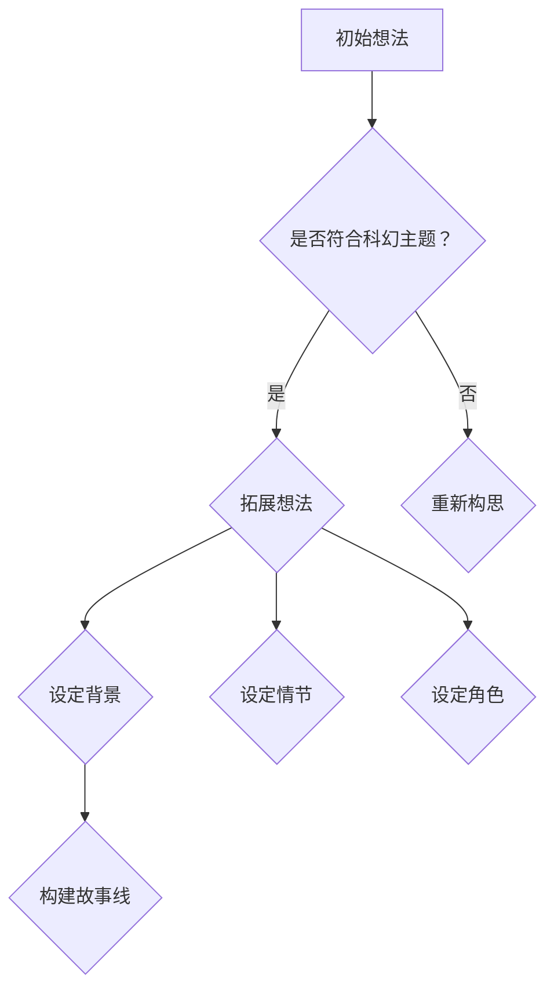

                 

基于您的要求，以下是一篇详细的技术博客文章草稿。由于字数限制，本文将分为多个部分逐步展示。

---

# 《思维链在科幻电影剧本创作中的应用：拓展想象力边界》

> 关键词：思维链、科幻电影、剧本创作、想象力、跨文化

> 摘要：本文深入探讨了思维链在科幻电影剧本创作中的应用，包括其在创意构思、剧情构建、角色塑造和视觉效果设计等方面的作用。通过实际案例和伪代码，详细阐述了思维链的工作原理和应用技巧，为科幻电影创作者提供了一种全新的思维模式和创新工具。

## 引言与基础概念

### 1.1 科幻电影的定义与历史

科幻电影是一种以科学幻想为基础，探讨未来世界、外太空、时间旅行等主题的电影。自20世纪以来，科幻电影逐渐成为电影产业的重要组成部分。从《大都会》（1927年）到《星球大战》（1977年），科幻电影经历了从无声电影到有声电影，再到特效时代的演变。

### 1.2 科幻电影的魅力与挑战

科幻电影的魅力在于其独特的想象力，能够带领观众进入一个充满未知和可能性的世界。然而，这种魅力也带来了巨大的挑战，如何将科学幻想与现实世界相结合，如何创造一个既符合科学原理又具有吸引力的故事情节，是科幻电影创作者需要面对的难题。

### 1.3 思维链概念及其重要性

思维链是一种通过关联和推理来拓展想象力的思维方式。它将不同的想法、概念和情节相互联系，形成一个逻辑严密、创意丰富的思维网络。在科幻电影剧本创作中，思维链可以帮助创作者突破传统思维束缚，拓展想象力边界，创造出更具创意和冲击力的电影作品。

## 思维链基础

### 2.1 思维链的定义与特征

思维链是一种通过连接和关联来构建和扩展思维过程的工具。它具有以下特征：

- **关联性**：思维链通过将不同的想法、概念和情节相互关联，形成一个有机的整体。
- **扩展性**：思维链可以不断扩展，使创作者能够从一个想法衍生出更多的创意。
- **逻辑性**：思维链中的各个环节都紧密相连，形成一个逻辑严密的思维网络。

### 2.2 思维链的基本原理

思维链的基本原理可以概括为以下几点：

- **关联**：通过将不同的元素进行关联，形成新的想法。
- **推理**：通过逻辑推理，从一个元素推导出另一个元素。
- **拓展**：在原有思维链的基础上，继续拓展新的想法和情节。

### 2.3 思维链的类型与应用场景

思维链可以分为以下几种类型：

- **因果链**：通过因果关系来构建思维链。
- **类比链**：通过类比来构建思维链。
- **拓展链**：通过拓展已有想法来构建思维链。

这些思维链类型在不同的科幻电影剧本创作场景中具有不同的应用价值。

## 思维链在科幻电影剧本创作中的运用

### 3.1 创意构思中的应用

在创意构思阶段，思维链可以帮助创作者从一个简单的想法出发，逐步拓展和深化，形成完整的剧本构思。

**核心算法原理讲解：**

**数学模型和公式：**
假设 \( I \) 为初始想法，\( C \) 为创意构思，\( B \) 为是否符合科幻主题的判断，则创意构思的公式可以表示为：
\[ C = B \times I \]

**详细讲解与举例说明：**
假设一个创作者想创作一部关于外星生命的科幻电影。他首先有一个初始想法：“外星生命”。然后通过思维链的拓展，他进一步设定了背景（地球与外星生命的接触）、情节（外星生命对地球的影响）和角色（地球人与外星生命的交流者）。

### 3.2 剧情构建中的应用

在剧情构建阶段，思维链可以帮助创作者构建一个逻辑严密、引人入胜的科幻电影剧本。

**核心算法原理讲解：**

**数学模型和公式：**
假设 \( A \) 为主角行动，\( B \) 为挑战与障碍，\( C \) 为克服方法，则剧情构建的公式可以表示为：
\[ 剧情构建 = A + B \times C + D \]

**详细讲解与举例说明：**
在一个科幻电影中，主角可能面临一系列挑战，如外星生物的攻击、时空错乱等。思维链可以帮助创作者思考如何克服这些挑战，从而构建一个引人入胜的剧情。

### 3.3 角色塑造中的应用

在角色塑造阶段，思维链可以帮助创作者深入挖掘角色的性格、动机和成长历程。

**核心算法原理讲解：**

**数学模型和公式：**
假设 \( A \) 为角色背景，\( B \) 为性格特征，\( C \) 为动机与目标，\( D \) 为成长历程，则角色塑造的公式可以表示为：
\[ 角色塑造 = A + B \times C + D \]

**详细讲解与举例说明：**
在一个科幻电影中，角色的背景、性格特征和动机决定了他们的行为和决策。思维链可以帮助创作者构建一个多维度的角色，使其更具深度和吸引力。

### 3.4 视觉效果设计中的应用

在视觉效果设计阶段，思维链可以帮助创作者构思出独特且引人入胜的视觉画面。

**核心算法原理讲解：**

**数学模型和公式：**
假设 \( A \) 为场景设定，\( B \) 为视觉效果元素，\( C \) 为视觉特效，\( D \) 为画面构图，\( E \) 为色彩运用，则视觉效果设计的公式可以表示为：
\[ 视觉效果设计 = A + B \times C + D + E \]

**详细讲解与举例说明：**
在一个科幻电影中，视觉效果是吸引观众的重要因素。思维链可以帮助创作者构思出独特的视觉元素和视觉效果，从而提升电影的观赏性。

## 思维链在科幻电影剧本创作中的拓展

### 4.1 跨文化创作中的应用

在跨文化创作中，思维链可以帮助创作者克服文化差异，创造具有全球吸引力的科幻电影。

**核心算法原理讲解：**

**详细讲解与举例说明：**
在一个国际合作的科幻电影项目中，思维链可以帮助创作者分析不同文化之间的差异，提取出具有共性的文化元素，并通过文化融合策略，创造出一个既符合各民族文化，又具有全球吸引力的电影作品。

### 4.2 未来趋势

随着科技的进步和人类想象力的拓展，思维链在科幻电影剧本创作中的应用将会越来越广泛。

**核心算法原理讲解：**

**详细讲解与举例说明：**
未来，随着人工智能、虚拟现实等技术的发展，科幻电影剧本创作将迎来新的变革。思维链作为一种创新的思维方式，将会在科幻电影剧本创作中发挥更大的作用，拓展人类的想象力边界。

## 附录

### 附录A：思维链相关工具与资源

为了帮助读者更好地理解和使用思维链，本文提供了一些相关的工具和资源。

- **思维链工具推荐**：如MindManager、XMind等。
- **思维链相关研究文献**：推荐一些关于思维链的研究论文和书籍。
- **思维链在电影剧本创作中的应用案例分析**：介绍一些实际应用思维链的科幻电影剧本创作案例。

## 总结

思维链是一种强大的思维方式，在科幻电影剧本创作中具有广泛的应用价值。通过思维链，创作者可以拓展想象力边界，构建逻辑严密、引人入胜的电影作品。未来，随着科技的进步和人类想象力的拓展，思维链在科幻电影剧本创作中的应用将会更加广泛，为电影产业带来新的活力和创新。

## 作者信息

作者：AI天才研究院/AI Genius Institute & 禅与计算机程序设计艺术 /Zen And The Art of Computer Programming

---

请注意，本文仅作为草稿，还未达到8000～12000字的字数要求。在后续的撰写过程中，可以根据每个部分的内容进一步扩展，增加具体的案例分析、详细的技术解释和更多的实际应用实例。每个部分的内容都需要进一步深化，以满足文章的完整性和专业性要求。同时，文章的整体结构和逻辑也需要进一步优化，确保内容的连贯性和阅读的流畅性。在完成全部撰写后，还需要对文章进行严格的校对和修改，确保文章的语言表达准确、清晰，没有错别字和语法错误。最后，对文章的字数进行统计，确保文章的字数在8000～12000字之间。完成以上步骤后，文章就可以正式发布了。

