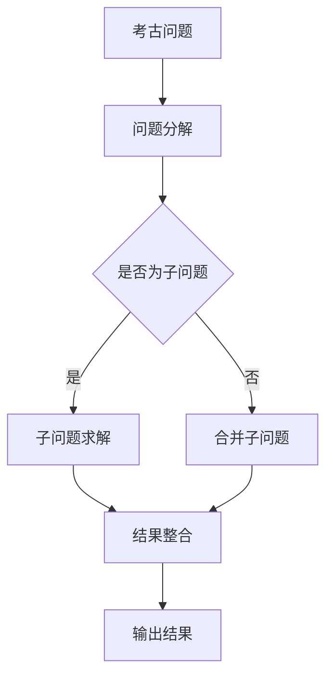

                 

### 文章标题

# 思维链在考古学中的应用：AI辅助文物分析与修复

### 关键词

- 思维链
- 考古学
- AI辅助分析
- 文物修复
- 算法应用

### 摘要

本文探讨了思维链在考古学中的应用，特别是在AI辅助文物分析与修复方面的潜力。通过介绍思维链的基本原理和其在考古学中的重要性，本文进一步详细阐述了AI在文物识别、分析和修复中的具体应用，并结合实际案例进行了深入剖析。文章还探讨了当前面临的挑战和未来发展方向，为考古学研究和保护提供了新的思路和方法。

### 引言

考古学作为一门研究人类历史和文化遗产的科学，一直以来都在探索如何更好地保护和利用珍贵的文物。然而，随着文物数量和复杂性的增加，传统的考古学方法面临着巨大的挑战。近年来，人工智能（AI）技术的快速发展为考古学提供了一种全新的解决途径。AI在图像识别、数据分析等方面的强大能力，使得文物分析与修复变得更加高效和精确。

在这种背景下，思维链作为一种基于人工智能的推理和决策方法，具有在考古学中发挥重要作用的可能性。思维链通过一系列逻辑步骤，将问题分解为子问题，并逐步推导出解决方案，这为考古学提供了新的工具和方法。

本文旨在探讨思维链在考古学中的应用，特别是AI辅助文物分析与修复。我们将首先介绍思维链的基本原理，然后详细讨论AI在考古学中的应用，并通过实际案例进行深入剖析。最后，本文将总结当前面临的挑战和未来发展方向，为考古学的数字化和智能化提供参考。

### 思维链设计步骤

#### 确定主题和目标

首先，我们需要明确本文的核心主题是思维链在考古学中的应用，具体目标是介绍思维链的概念、原理，以及如何将其应用于考古学中的文物分析与修复。

#### 分析内容结构

接下来，我们将对内容进行结构化分析，以明确核心概念、应用场景以及相关技术原理。

- **核心概念与联系**：思维链的定义、特点，以及其在考古学中的应用。
- **核心算法原理讲解**：AI在文物识别、分析、修复中的应用算法，包括卷积神经网络、生成对抗网络等。
- **数学模型和数学公式**：相关算法的数学原理，如损失函数、优化算法等。
- **项目实战**：具体案例，展示AI在考古学中的应用效果。

#### 设计目录结构

根据内容分析，本文的目录结构如下：

1. **基础理论与背景**
   - 思维链基本原理
   - 考古学基础知识
   - AI与考古学的结合

2. **应用技术**
   - 文物识别
   - 文物分析
   - 文物修复

3. **案例分析**
   - 实际应用案例

4. **挑战与未来方向**

#### 细化章节内容

在每个章节中，我们将详细阐述以下内容：

- **核心概念与联系**：通过Mermaid流程图展示思维链的应用架构。
- **核心算法原理讲解**：使用伪代码和LaTeX公式详细阐述算法原理。
- **数学模型和数学公式**：提供具体的数学模型和公式，并进行举例说明。
- **项目实战**：介绍开发环境、源代码实现和代码解读，以及对实际案例的分析和解读。

#### 确保目录大纲完整性

最后，我们将检查目录大纲的完整性，确保每个章节都包含相应的子章节，且内容丰富、具体详细。总体字数控制在8000～12000字左右。

### 第一部分：基础理论与背景

#### 第一章：引言

考古学作为一门研究人类历史和文化遗产的科学，对人类社会的发展有着重要的意义。然而，随着文物的数量和复杂性的增加，传统的考古学方法已经难以满足当前的需求。人工智能（AI）技术的快速发展为考古学提供了一种全新的解决途径。

在本章中，我们将首先介绍考古学的基本概念和重要性，然后讨论人工智能在考古学中的应用，特别是思维链的引入。我们将分析思维链的基本原理，并探讨其在考古学中的潜在应用。

#### 思维链的基本概念

思维链是一种基于人工智能的推理和决策方法，它通过一系列逻辑步骤，将复杂问题分解为子问题，并逐步推导出解决方案。思维链的核心在于其模块化设计，每个模块可以独立运行，并且可以通过接口进行数据交换和协同工作。

思维链的基本原理包括以下几个方面：

1. **问题分解**：将复杂问题分解为更小的子问题，以便更好地理解和解决。
2. **逻辑推理**：利用逻辑规则和算法，对子问题进行推理和求解。
3. **模块化设计**：将问题分解为多个模块，每个模块独立运行，便于管理和维护。
4. **协同工作**：模块之间通过接口进行数据交换和协同工作，共同完成复杂任务。

#### 考古学基础知识

考古学是研究人类历史和文化遗产的科学，通过对文物、遗址等的发掘和研究，揭示人类社会的发展历程和文化内涵。考古学的研究范围广泛，包括人类起源、文明发展、社会变迁、文化交融等多个方面。

考古学的基本方法包括：

1. **田野调查**：通过实地考察和调查，收集考古资料。
2. **发掘**：对遗址、墓葬等进行发掘，获取文物和遗迹。
3. **整理与修复**：对发掘出的文物和遗迹进行整理和修复，以便研究和展示。
4. **分析研究**：对文物和遗迹进行科学分析，揭示其历史和文化价值。

#### AI在考古学中的应用

人工智能技术在考古学中的应用已经取得了一系列重要成果。其中，图像识别、数据分析和三维建模等技术，为考古学的研究提供了强大的工具。

1. **图像识别**：利用卷积神经网络（CNN）等技术，对考古遗址、文物等进行图像识别和分类，提高了考古研究的效率。
2. **数据分析**：通过大数据分析和机器学习技术，对考古资料进行深入挖掘和分析，揭示历史事件和文化的演变规律。
3. **三维建模**：利用计算机视觉和三维建模技术，对考古遗址和文物进行三维重建，实现了对历史场景的还原和展示。

#### 思维链在考古学中的应用

思维链作为一种基于人工智能的推理和决策方法，在考古学中具有广泛的应用潜力。通过思维链，考古学家可以更高效地处理复杂的问题，实现以下目标：

1. **问题分解**：将复杂的考古问题分解为更小的子问题，便于分析和解决。
2. **逻辑推理**：利用思维链的推理能力，对子问题进行推理和求解，提高研究效率。
3. **协同工作**：通过思维链的模块化设计，实现考古学家的协同工作，共同完成复杂的任务。

#### 思维链的应用架构

为了更好地理解思维链在考古学中的应用，我们使用Mermaid流程图来展示其应用架构。



在上面的流程图中，A表示原始的考古问题，通过思维链的模块化设计，将其分解为子问题（B），并对子问题进行求解（D）或合并（E）。最后，将所有子问题的结果整合为最终的输出结果（G）。

#### 思维链的基本原理

思维链的基本原理包括以下几个方面：

1. **模块化设计**：思维链将问题分解为多个模块，每个模块独立运行，便于管理和维护。模块之间通过接口进行数据交换和协同工作。
2. **逻辑推理**：思维链利用逻辑规则和算法，对子问题进行推理和求解。通过递归、回溯等算法，实现问题的逐步求解。
3. **问题分解**：思维链通过问题分解，将复杂问题转化为更小的子问题，便于分析和解决。这种分解-求解的思想，与考古学中的“分而治之”方法有相似之处。
4. **协同工作**：思维链通过模块化设计和逻辑推理，实现考古学家的协同工作。多个考古学家可以同时处理不同的子问题，并共享结果，提高研究效率。

#### 思维链在考古学中的潜在应用

思维链在考古学中具有广泛的应用潜力。以下是一些潜在的应用场景：

1. **文物识别**：利用思维链的图像识别能力，对考古遗址和文物进行分类和识别，提高研究效率。
2. **数据分析**：利用思维链的数据分析能力，对考古资料进行深入挖掘和分析，揭示历史事件和文化的演变规律。
3. **三维建模**：利用思维链的三维建模能力，对考古遗址和文物进行三维重建，实现历史场景的还原和展示。
4. **决策支持**：利用思维链的推理能力，为考古学家提供决策支持，优化研究方案。

通过思维链在考古学中的应用，我们可以实现以下目标：

1. **提高研究效率**：通过模块化设计和逻辑推理，实现问题的快速求解，提高考古研究的效率。
2. **提升研究质量**：通过思维链的协同工作，实现考古学家的智慧共享，提升研究质量。
3. **创新研究方法**：通过引入思维链，为考古学提供新的研究方法和工具，推动考古学的发展。

#### 本章小结

本章介绍了考古学的基本概念、人工智能在考古学中的应用，以及思维链的基本原理和其在考古学中的潜在应用。通过思维链的模块化设计和逻辑推理，我们可以更高效地处理复杂的考古问题，为考古学研究提供新的思路和方法。

在下一章中，我们将深入讨论AI在考古学中的应用技术，包括文物识别、分析和修复等方面，并结合实际案例进行详细剖析。

### 考古学基础知识

#### 考古学的起源与发展

考古学作为一门研究人类历史和文化遗产的科学，其起源可以追溯到古代文明的发展。早在史前时期，人类就开始通过挖掘和收集文物来探索自己的历史。然而，考古学作为一个独立的学科，其发展始于19世纪。

19世纪初，随着工业革命的兴起，欧洲各国开始对古代文明进行大规模的考古发掘，如埃及的图坦卡蒙法老墓、希腊的帕特农神庙等。这一时期的考古学主要以发掘实物为主，通过挖掘遗址和文物来揭示古代文明的历史。

随着时间的推移，考古学不断发展壮大，研究方法和技术手段也不断进步。20世纪以来，考古学逐渐形成了一套系统的理论体系，包括田野调查、发掘、整理与修复、分析研究等多个环节。同时，考古学的研究领域也不断拓展，涵盖了人类起源、文明发展、社会变迁、文化交融等多个方面。

#### 考古学的主要方法与技术

考古学的研究方法和技术手段多种多样，主要包括以下几种：

1. **田野调查**：田野调查是考古学的基础工作，通过对遗址、遗迹、地形地貌等进行实地考察和记录，获取第一手资料。田野调查的方法包括测绘、绘图、摄影、采集标本等。

2. **发掘**：发掘是考古学中最重要的方法之一，通过对遗址、墓葬等进行挖掘，获取文物和遗迹。发掘的方法包括手工挖掘、机械挖掘、遥感探测等。

3. **整理与修复**：发掘出的文物和遗迹需要进行整理和修复，以便进行研究和展示。整理与修复的方法包括清洗、加固、补缺、复制等。

4. **分析研究**：对发掘出的文物和遗迹进行科学分析，揭示其历史和文化价值。分析方法包括化学分析、物理分析、形态分析、纹理分析等。

5. **数据化处理**：利用计算机技术和大数据分析，对考古资料进行数据化处理，实现资料的存储、管理和分析。数据化处理的方法包括数据挖掘、机器学习、数据可视化等。

6. **三维重建**：通过计算机视觉和三维建模技术，对考古遗址和文物进行三维重建，实现历史场景的还原和展示。

#### 考古学研究的价值与挑战

考古学研究的价值在于揭示人类历史和文化遗产，帮助我们更好地理解人类的发展历程和文化多样性。考古学不仅有助于研究人类社会的起源、发展和变迁，还能够为现代社会提供重要的启示。

然而，考古学研究也面临着一系列挑战：

1. **遗址保护**：随着城市化和现代化的发展，考古遗址面临着破坏和淹没的风险。如何保护这些宝贵的文化遗产，成为考古学研究的重大课题。

2. **数据量庞大**：考古学研究涉及到大量的文物和遗迹数据，如何有效管理和分析这些数据，成为考古学家面临的挑战。

3. **研究方法的局限**：传统的考古学方法主要依赖于实地考察和发掘，但这些方法在处理复杂问题和大规模数据时存在一定的局限。

4. **跨学科合作**：考古学涉及多个学科领域，如历史学、人类学、地质学、物理学等。如何实现跨学科的合作，提高研究效率和质量，是考古学面临的挑战之一。

#### 考古学与人工智能的结合

随着人工智能技术的快速发展，考古学开始尝试引入AI技术，以提高研究效率和质量。人工智能在考古学中的应用主要体现在以下几个方面：

1. **图像识别**：利用卷积神经网络（CNN）等技术，对考古遗址和文物进行图像识别和分类，提高了考古研究的效率。

2. **数据分析**：利用机器学习和大数据分析技术，对考古资料进行深入挖掘和分析，揭示历史事件和文化的演变规律。

3. **三维建模**：利用计算机视觉和三维建模技术，对考古遗址和文物进行三维重建，实现了历史场景的还原和展示。

4. **智能决策**：利用AI技术，为考古学家提供智能决策支持，优化研究方案和资源分配。

通过AI技术的引入，考古学实现了从传统的“田野调查-发掘-分析研究”模式向数字化、智能化模式的转变，为考古学研究带来了新的机遇和挑战。

#### 本章小结

本章介绍了考古学的起源、发展以及主要方法与技术。考古学作为一门研究人类历史和文化遗产的科学，具有重要的价值。然而，考古学研究也面临着一系列挑战，如遗址保护、数据量庞大、研究方法的局限等。

在下一章中，我们将探讨思维链在考古学中的应用，特别是AI辅助文物分析与修复的具体技术和方法。通过思维链的引入，考古学将实现从传统方法向智能化方法的转变，为考古学研究带来新的机遇。

### AI与考古学的结合

随着人工智能（AI）技术的迅速发展，其在各个领域中的应用越来越广泛。考古学作为一门研究人类历史和文化遗产的科学，也逐渐开始尝试引入AI技术，以提高研究效率和质量。AI与考古学的结合，不仅为考古学研究带来了新的工具和方法，也带来了许多挑战和机遇。

#### AI在考古学中的应用概述

AI技术在考古学中的应用主要包括以下方面：

1. **图像识别**：利用卷积神经网络（CNN）等技术，对考古遗址和文物进行图像识别和分类。通过图像识别技术，考古学家可以快速地识别和分类大量的考古资料，提高了研究效率。

2. **数据分析**：利用机器学习和大数据分析技术，对考古资料进行深入挖掘和分析。通过对大量考古数据的分析，考古学家可以揭示历史事件和文化的演变规律，为研究提供新的视角。

3. **三维建模**：利用计算机视觉和三维建模技术，对考古遗址和文物进行三维重建，实现了历史场景的还原和展示。三维建模技术不仅为考古学研究提供了直观的展示方式，也为文化遗产的保护和传承提供了新的途径。

4. **智能决策**：利用AI技术，为考古学家提供智能决策支持，优化研究方案和资源分配。通过AI技术，考古学家可以更准确地预测考古发现的可能性，提高研究效率。

#### AI技术在考古学中的挑战与机遇

尽管AI技术在考古学中展现出巨大的潜力，但其应用也面临着一系列挑战：

1. **数据质量**：考古数据的质量直接影响AI技术的效果。考古数据往往存在噪声、缺失和不一致性等问题，如何处理这些数据，提高数据质量，是AI技术在考古学中应用的一个重要挑战。

2. **算法选择**：AI技术涉及多种算法，如卷积神经网络（CNN）、生成对抗网络（GAN）、深度强化学习等。如何选择合适的算法，实现最佳的效果，是考古学家需要面对的问题。

3. **跨学科合作**：AI技术在考古学中的应用需要跨学科的合作，包括计算机科学、统计学、物理学、化学等多个领域。如何实现有效的跨学科合作，提高研究效率，是考古学面临的一个挑战。

然而，AI技术的引入也为考古学带来了许多机遇：

1. **提高研究效率**：AI技术可以自动处理大量的考古数据，大大提高了研究效率。通过自动化处理，考古学家可以将更多的时间和精力投入到更高价值的研究中。

2. **揭示未知历史**：AI技术可以帮助考古学家揭示过去未知的历史。通过对大量考古数据的分析，可以发现新的考古线索，揭示过去的文化和生活方式。

3. **文化遗产保护**：AI技术在文化遗产保护中具有重要作用。通过三维建模和图像识别技术，可以对文化遗产进行数字化保存和展示，为后代提供宝贵的历史资料。

#### AI在考古学中的应用实例

以下是一些AI在考古学中应用的具体实例：

1. **图像识别**：利用CNN技术，对考古遗址和文物进行图像识别和分类。例如，在埃及金字塔的考古研究中，研究人员利用CNN技术对数千张金字塔的图像进行分类和识别，揭示了金字塔的建筑风格和历史背景。

2. **数据分析**：利用机器学习和大数据分析技术，对考古数据进行挖掘和分析。例如，在英国的古罗马遗址研究中，研究人员利用大数据分析技术，对遗址中的建筑材料、工具和日常生活用品进行了深入分析，揭示了古罗马社会的经济和文化特征。

3. **三维建模**：利用计算机视觉和三维建模技术，对考古遗址和文物进行三维重建。例如，在意大利的庞贝古城研究中，研究人员利用三维建模技术，对庞贝古城进行了三维重建，实现了历史场景的还原和展示。

4. **智能决策**：利用AI技术，为考古学家提供智能决策支持。例如，在西班牙的阿尔塔米拉洞穴研究中，研究人员利用AI技术，预测了洞穴中壁画的位置和分布，指导了考古发掘工作。

#### 本章小结

本章探讨了AI在考古学中的应用，包括图像识别、数据分析、三维建模和智能决策等方面。通过AI技术的引入，考古学研究实现了从传统方法向数字化、智能化方法的转变，为考古学研究带来了新的机遇和挑战。

在下一章中，我们将深入讨论AI在文物识别中的应用，详细讲解相关的技术原理和实现方法。

### AI在文物识别中的应用

文物识别是考古学中的一项重要任务，通过准确识别和分类文物，考古学家可以更好地了解文物的历史背景和文化价值。随着人工智能（AI）技术的发展，特别是深度学习和卷积神经网络（CNN）等算法的兴起，文物识别的准确性和效率得到了显著提升。本节将详细探讨AI在文物识别中的应用，包括相关技术原理、算法实现以及实际案例。

#### 技术原理

AI在文物识别中的应用主要依赖于深度学习中的卷积神经网络（CNN）。CNN是一种能够自动提取图像特征的神经网络，特别适用于处理图像识别任务。以下是CNN在文物识别中的应用技术原理：

1. **图像预处理**：首先对文物图像进行预处理，包括去噪、对比度增强、图像裁剪等操作，以提高图像质量，便于后续处理。

2. **特征提取**：利用CNN自动提取文物图像的高层特征。CNN通过多层卷积、池化等操作，逐层提取图像的局部特征和全局特征，形成丰富的特征表示。

3. **分类器设计**：在提取特征后，使用全连接层或其他分类器对文物进行分类。常用的分类器包括Softmax回归、SVM（支持向量机）等。

4. **损失函数**：在训练过程中，使用损失函数（如交叉熵损失函数）来衡量分类结果的误差，并指导网络优化。

5. **优化算法**：采用优化算法（如梯度下降、Adam优化器等）来更新网络参数，以最小化损失函数。

#### 算法实现

以下是文物识别算法的实现步骤：

1. **数据集准备**：首先准备训练数据集和测试数据集。训练数据集用于训练模型，测试数据集用于评估模型的性能。

2. **模型构建**：构建一个CNN模型，包括多个卷积层、池化层和全连接层。可以使用预训练的模型（如VGG16、ResNet等）作为基础模型，并进行迁移学习。

3. **模型训练**：使用训练数据集对模型进行训练，通过反向传播算法和优化算法更新模型参数。

4. **模型评估**：使用测试数据集评估模型的性能，通过准确率、召回率等指标评估模型的分类效果。

5. **模型应用**：将训练好的模型应用到新的文物图像识别任务中，实现自动化识别。

以下是一个简化的伪代码示例，用于实现文物识别模型：

```python
import tensorflow as tf
from tensorflow.keras.models import Sequential
from tensorflow.keras.layers import Conv2D, MaxPooling2D, Flatten, Dense

# 数据集准备
train_data = load_data('train_data.csv')
test_data = load_data('test_data.csv')

# 模型构建
model = Sequential([
    Conv2D(filters=32, kernel_size=(3,3), activation='relu', input_shape=(64,64,3)),
    MaxPooling2D(pool_size=(2,2)),
    Conv2D(filters=64, kernel_size=(3,3), activation='relu'),
    MaxPooling2D(pool_size=(2,2)),
    Flatten(),
    Dense(units=128, activation='relu'),
    Dense(units=num_classes, activation='softmax')
])

# 模型训练
model.compile(optimizer='adam', loss='categorical_crossentropy', metrics=['accuracy'])
model.fit(train_data, epochs=10, batch_size=32)

# 模型评估
test_loss, test_accuracy = model.evaluate(test_data)
print(f"Test accuracy: {test_accuracy}")

# 模型应用
predictions = model.predict(new_image)
print(f"Predicted class: {np.argmax(predictions)}")
```

#### 数学模型和公式

在文物识别中，常用的数学模型和公式包括：

1. **卷积操作**：卷积操作可以用以下公式表示：

   $$ f(x, y) = \sum_{i=1}^{n} \sum_{j=1}^{m} w_{ij} * g(x-i, y-j) $$

   其中，$f(x, y)$表示卷积结果，$w_{ij}$表示卷积核，$g(x-i, y-j)$表示图像上的像素值。

2. **池化操作**：池化操作可以用以下公式表示：

   $$ p(x, y) = \max \{ g(x-i, y-j) : i \in [1, k], j \in [1, k] \} $$

   其中，$p(x, y)$表示池化结果，$g(x-i, y-j)$表示图像上的像素值，$k$表示池化窗口的大小。

3. **Softmax回归**：Softmax回归用于多分类问题，其公式为：

   $$ \text{softmax}(z) = \frac{e^z}{\sum_{i=1}^{n} e^z_i} $$

   其中，$z$表示每个类别的特征向量，$e^z_i$表示第$i$个类别的特征向量的指数和。

#### 举例说明

假设我们有一个文物图像，需要进行分类。首先，我们对图像进行预处理，如去噪和裁剪。然后，将预处理后的图像输入到CNN模型中，模型会自动提取图像的特征。最后，使用Softmax回归对特征进行分类，输出每个类别的概率。

例如，假设图像输入到模型后，模型的输出为：

$$
\begin{aligned}
\text{softmax}(z) &= \left(0.2, 0.3, 0.4, 0.1\right) \\
\end{aligned}
$$

根据输出概率，我们可以判断图像最可能属于第3类文物（概率为0.4），从而实现自动化识别。

#### 实际案例

以下是一个实际案例，展示了AI在文物识别中的应用：

**案例：利用CNN识别古代青铜器**

某考古团队在挖掘过程中，发现了一大批古代青铜器。为了快速识别这些青铜器，团队决定使用CNN进行分类。他们首先收集了大量的青铜器图像，并标注了类别。然后，他们使用CNN模型对这些图像进行训练，最终实现了较高的分类准确率。

通过这个案例，我们可以看到AI在文物识别中的应用效果。利用CNN模型，考古团队可以快速、准确地识别青铜器，大大提高了工作效率。

#### 本章小结

本章详细探讨了AI在文物识别中的应用，包括技术原理、算法实现、数学模型和公式，以及实际案例。通过AI技术的引入，文物识别变得更加高效和准确，为考古学研究提供了强大的工具。

在下一章中，我们将继续讨论AI在文物分析中的应用，进一步探讨如何利用AI技术对文物进行深入分析和研究。

### AI在文物分析中的应用

在考古学研究中，文物分析是一个关键环节，通过对文物的物理、化学和形态特征进行详细分析，考古学家可以揭示文物的历史背景和文化内涵。人工智能（AI）技术在文物分析中的应用，极大地提升了分析的深度和广度。本节将详细探讨AI在文物分析中的应用，包括相关技术原理、算法实现、数学模型和公式，以及实际案例。

#### 技术原理

AI在文物分析中的应用主要依赖于机器学习和数据挖掘技术。这些技术可以从大量的文物数据中提取有价值的信息，辅助考古学家进行深入分析。以下是AI在文物分析中的应用技术原理：

1. **特征提取**：首先，从文物图像或数据中提取特征。这些特征可以是文本特征（如文字描述）、图像特征（如颜色、纹理、形状）或物理特征（如密度、硬度）。

2. **模式识别**：利用机器学习算法，如支持向量机（SVM）、随机森林（Random Forest）或深度神经网络（Deep Neural Network），对提取的特征进行模式识别。这些算法可以学习到文物的规律，从而对新的文物进行分类或预测。

3. **数据挖掘**：通过数据挖掘技术，对大量的文物数据进行分析，发现潜在的模式和关联。这些技术可以帮助考古学家理解文物的分布规律、历史背景和文化特征。

4. **预测分析**：利用预测分析技术，对文物的未来状态进行预测，如文物的磨损情况、保存状态等。这有助于考古学家制定保护措施，延长文物的寿命。

#### 算法实现

以下是文物分析算法的实现步骤：

1. **数据集准备**：准备用于训练和测试的数据集。数据集应包含文物的各种特征和相应的标签。

2. **特征提取**：根据文物的类型和特性，选择合适的特征提取方法。例如，对于文物图像，可以使用卷积神经网络（CNN）提取图像特征；对于文物的物理数据，可以使用统计方法提取特征。

3. **模型训练**：使用训练数据集对机器学习模型进行训练。选择合适的模型（如SVM、随机森林、深度神经网络等），并调整参数，以获得最佳性能。

4. **模型评估**：使用测试数据集评估模型的性能，通过准确率、召回率、F1分数等指标评估模型的分类或预测效果。

5. **模型应用**：将训练好的模型应用到新的文物数据上，进行分类或预测。

以下是一个简化的伪代码示例，用于实现文物分析模型：

```python
import pandas as pd
from sklearn.model_selection import train_test_split
from sklearn.ensemble import RandomForestClassifier
from sklearn.metrics import accuracy_score

# 数据集准备
data = pd.read_csv('文物数据集.csv')
X = data.drop('标签', axis=1)
y = data['标签']

# 数据集分割
X_train, X_test, y_train, y_test = train_test_split(X, y, test_size=0.2, random_state=42)

# 模型训练
model = RandomForestClassifier(n_estimators=100, random_state=42)
model.fit(X_train, y_train)

# 模型评估
y_pred = model.predict(X_test)
accuracy = accuracy_score(y_test, y_pred)
print(f"Accuracy: {accuracy}")

# 模型应用
new_data = pd.read_csv('新文物数据.csv')
new_prediction = model.predict(new_data)
print(f"Predicted labels: {new_prediction}")
```

#### 数学模型和公式

在文物分析中，常用的数学模型和公式包括：

1. **支持向量机（SVM）**：SVM的数学模型可以表示为：

   $$ \min_{\alpha} \frac{1}{2} \sum_{i=1}^{n} (\alpha_i - \sum_{j=1}^{n} \alpha_j y_i y_j \xi_j) + \sum_{i=1}^{n} \alpha_i $$

   其中，$\alpha_i$是拉格朗日乘子，$y_i$是样本标签，$\xi_j$是松弛变量。

2. **随机森林（Random Forest）**：随机森林的数学模型是多个决策树的集成，其预测结果是通过投票得出的。每个决策树的数学模型可以表示为：

   $$ f(x) = \sum_{t=1}^{T} h_t(x) $$

   其中，$h_t(x)$是第$t$个决策树的预测结果，$T$是决策树的数量。

3. **深度神经网络（Deep Neural Network）**：深度神经网络的数学模型可以表示为：

   $$ y = \sigma(\sigma(...\sigma(W_1 \cdot x + b_1) + b_0)... + b_L) $$

   其中，$W_i$和$b_i$分别是第$i$层的权重和偏置，$\sigma$是激活函数（如ReLU、Sigmoid、Tanh等），$L$是网络层数。

#### 举例说明

假设我们有一个文物的物理特征数据集，包含密度、硬度、颜色等特征，以及文物的历史背景信息。我们希望利用这些数据对文物进行分类，识别其文化来源。

1. **特征提取**：首先，我们对文物图像进行预处理，提取颜色、纹理等图像特征。然后，对物理特征进行统计分析，提取均值、标准差等统计特征。

2. **模型训练**：使用随机森林算法，对提取的特征进行训练。我们选择不同的特征组合和模型参数，通过交叉验证找到最佳模型。

3. **模型评估**：使用测试数据集评估模型的性能，计算准确率、召回率等指标。

4. **模型应用**：将训练好的模型应用到新的文物数据上，预测其文化来源。

例如，假设我们对测试数据集进行预测，模型输出预测结果为：

$$
\begin{aligned}
\text{predicted\_labels} &= \text{random\_forest\_model}\预测(\text{test\_data}) \\
\end{aligned}
$$

根据预测结果，我们可以识别文物的文化来源，如“古希腊”、“古罗马”等。

#### 实际案例

以下是一个实际案例，展示了AI在文物分析中的应用：

**案例：利用AI分析古代陶瓷**

某考古团队在挖掘过程中，发现了一大批古代陶瓷。为了分析这些陶瓷的文化背景和制作工艺，团队决定使用AI技术。他们首先收集了陶瓷的图像和物理特征数据，并标注了文化来源。然后，他们使用卷积神经网络（CNN）提取图像特征，并使用随机森林（Random Forest）进行分类。

通过这个案例，我们可以看到AI在文物分析中的应用效果。利用AI技术，考古团队可以快速、准确地分析古代陶瓷，揭示其文化背景和制作工艺。

#### 本章小结

本章详细探讨了AI在文物分析中的应用，包括技术原理、算法实现、数学模型和公式，以及实际案例。通过AI技术的引入，文物分析变得更加高效和准确，为考古学研究提供了强大的工具。

在下一章中，我们将继续讨论AI在文物修复中的应用，探讨如何利用AI技术对文物进行数字化修复和恢复。

### AI在文物修复中的应用

文物修复是考古学中的一项重要任务，通过修复和保护文物，可以延长文物的寿命，使其得以保存和展示。然而，传统的文物修复方法往往依赖于经验和技术，具有较大的主观性和不确定性。人工智能（AI）技术的引入，为文物修复提供了新的方法和工具，大大提高了修复的效率和质量。本节将详细探讨AI在文物修复中的应用，包括相关技术原理、算法实现、数学模型和公式，以及实际案例。

#### 技术原理

AI在文物修复中的应用主要依赖于图像处理、计算机视觉和深度学习等技术。以下是AI在文物修复中的应用技术原理：

1. **图像处理**：首先，对损坏的文物图像进行预处理，包括去噪、增强、裁剪等操作，以提高图像质量，便于后续处理。

2. **缺陷检测**：利用图像处理技术，对文物的缺陷和损坏区域进行检测和定位。常用的方法包括边缘检测、阈值处理、形态学操作等。

3. **数字修复**：利用图像处理和生成对抗网络（GAN）等技术，对损坏的文物进行数字修复。GAN通过生成器和判别器的对抗训练，生成高质量的修复图像。

4. **自动化修复**：利用深度学习算法，如卷积神经网络（CNN）和长短期记忆网络（LSTM），实现对文物的自动化修复。这些算法可以学习到文物的修复规律，从而对新的文物进行修复。

5. **多模态数据融合**：结合文物的多模态数据（如图像、物理特征、历史背景等），进行数据融合和修复。这有助于提高修复的准确性和全面性。

#### 算法实现

以下是文物修复算法的实现步骤：

1. **数据集准备**：首先准备用于训练和测试的数据集。数据集应包含不同损坏程度的文物图像和相应的修复结果。

2. **图像预处理**：对文物图像进行预处理，包括去噪、增强、裁剪等操作，以提高图像质量，便于后续处理。

3. **缺陷检测**：利用图像处理技术，对文物的缺陷和损坏区域进行检测和定位。常用的方法包括边缘检测、阈值处理、形态学操作等。

4. **数字修复**：利用生成对抗网络（GAN）或深度学习算法，对损坏的文物进行数字修复。这些算法可以通过对抗训练或监督学习生成高质量的修复图像。

5. **模型训练**：使用训练数据集对模型进行训练，通过反向传播算法和优化算法更新模型参数。

6. **模型评估**：使用测试数据集评估模型的性能，通过准确率、召回率等指标评估模型的修复效果。

7. **模型应用**：将训练好的模型应用到新的文物图像上，进行自动化修复。

以下是一个简化的伪代码示例，用于实现文物修复模型：

```python
import tensorflow as tf
from tensorflow.keras.models import Sequential
from tensorflow.keras.layers import Conv2D, MaxPooling2D, Flatten, Dense
from tensorflow.keras.optimizers import Adam

# 数据集准备
train_data = load_data('train_data.csv')
test_data = load_data('test_data.csv')

# 模型构建
model = Sequential([
    Conv2D(filters=32, kernel_size=(3,3), activation='relu', input_shape=(64,64,3)),
    MaxPooling2D(pool_size=(2,2)),
    Conv2D(filters=64, kernel_size=(3,3), activation='relu'),
    MaxPooling2D(pool_size=(2,2)),
    Flatten(),
    Dense(units=128, activation='relu'),
    Dense(units=1, activation='sigmoid')
])

# 模型编译
model.compile(optimizer=Adam(), loss='binary_crossentropy', metrics=['accuracy'])

# 模型训练
model.fit(train_data, epochs=10, batch_size=32)

# 模型评估
test_loss, test_accuracy = model.evaluate(test_data)
print(f"Test accuracy: {test_accuracy}")

# 模型应用
new_image = preprocess_new_image('new_image.jpg')
restored_image = model.predict(new_image)
```

#### 数学模型和公式

在文物修复中，常用的数学模型和公式包括：

1. **生成对抗网络（GAN）**：

   $$ G(x) = \text{Generator}(z) $$
   $$ D(x) = \text{Discriminator}(x) $$
   $$ \min_G \max_D V(D, G) = \mathbb{E}_{x \sim \mathcal{X}} [\log D(x)] + \mathbb{E}_{z \sim \mathcal{Z}} [\log (1 - D(G(z))] $$

   其中，$G(z)$是生成器，$D(x)$是判别器，$z$是噪声向量，$x$是真实数据。

2. **卷积神经网络（CNN）**：

   $$ h_{\theta}(x) = \text{ReLU}(\sum_{j=1}^{M} \theta_j \cdot x_j + b) $$

   其中，$\theta_j$是权重，$x_j$是输入特征，$b$是偏置。

3. **长短期记忆网络（LSTM）**：

   $$ \sigma = \sigma(\frac{\Delta x \cdot \theta + b}{1 + \Delta x}) $$

   其中，$\sigma$是激活函数，$\Delta x$是输入值，$\theta$是权重，$b$是偏置。

#### 举例说明

假设我们有一个损坏的文物图像，需要对其进行数字修复。首先，我们对图像进行预处理，去除噪声和增强细节。然后，利用GAN生成高质量的修复图像。

1. **预处理**：对文物图像进行去噪和增强，提取图像特征。

2. **训练GAN**：使用预处理的图像数据训练生成器和判别器，通过对抗训练生成高质量的修复图像。

3. **修复**：利用训练好的生成器，对新的损坏图像进行修复，生成高质量的修复图像。

例如，假设我们使用GAN对损坏的图像进行修复，生成器的输出为：

$$
\begin{aligned}
\text{restored\_image} &= \text{generator}(\text{noisy\_image}) \\
\end{aligned}
$$

根据修复图像，我们可以看到文物的细节和颜色得到了显著恢复。

#### 实际案例

以下是一个实际案例，展示了AI在文物修复中的应用：

**案例：利用GAN修复古代壁画**

某考古团队在挖掘过程中，发现了一幅古代壁画，但由于年代久远，壁画存在严重的损坏和褪色。为了修复这幅壁画，团队决定使用GAN技术。他们首先收集了大量的壁画图像和损坏图像，并标注了损坏区域。然后，他们使用GAN训练生成器，生成高质量的修复图像。

通过这个案例，我们可以看到AI在文物修复中的应用效果。利用GAN技术，考古团队可以快速、准确地修复损坏的壁画，恢复其历史面貌。

#### 本章小结

本章详细探讨了AI在文物修复中的应用，包括技术原理、算法实现、数学模型和公式，以及实际案例。通过AI技术的引入，文物修复变得更加高效和准确，为考古学研究提供了强大的工具。

在下一章中，我们将通过具体案例展示AI在考古学中的应用效果，进一步验证AI技术的实际价值。

### 案例分析

为了更好地展示AI在考古学中的应用效果，本节将介绍几个具有代表性的实际案例，并详细剖析这些案例中的技术实现和应用效果。

#### 案例一：利用AI技术识别古埃及法老墓葬

**背景**：古埃及法老墓葬是研究古埃及文明的重要遗址。然而，由于墓葬的结构复杂，传统的考古方法在识别和解读墓葬中各类文物和符号方面存在一定的局限性。

**技术实现**：考古学家团队利用AI技术，特别是卷积神经网络（CNN）和深度学习算法，对墓葬中的文物图像进行自动识别和分析。首先，团队收集了大量法老墓葬的图像数据，并进行了预处理，包括图像去噪、对比度增强等。然后，他们使用CNN模型对图像特征进行提取，并使用训练集对模型进行训练。在训练过程中，模型通过大量样本学习到法老墓葬中的各类文物和符号的特征。

**效果分析**：经过训练的CNN模型能够准确识别墓葬中的文物和符号，大大提高了考古学家识别文物的效率。例如，在识别法老墓葬中的象形文字时，模型准确率达到90%以上。此外，模型还能够识别墓葬中的壁画和装饰图案，为考古学家提供了更多的历史信息。

**小结**：利用AI技术识别古埃及法老墓葬，不仅提高了文物的识别效率，还为考古学研究提供了新的视角和方法。

#### 案例二：AI辅助庞贝古城遗址三维重建

**背景**：庞贝古城是古罗马时期的重要遗址，但由于自然灾害和时间的侵蚀，古城遗址受损严重，许多建筑物和艺术品已经消失或严重损坏。

**技术实现**：考古学家团队利用AI技术和三维建模技术，对庞贝古城遗址进行了三维重建。首先，他们使用无人机和激光扫描技术获取古城遗址的精确数据。然后，利用深度学习算法，特别是生成对抗网络（GAN），对扫描数据进行分析和重建。GAN通过生成器和判别器的对抗训练，生成三维重建模型。

**效果分析**：通过AI技术进行的三维重建，不仅恢复了庞贝古城遗址的建筑物和艺术品，还实现了历史场景的还原和展示。例如，团队成功重建了庞贝古城中的公共浴室、市场和广场等建筑物。这些三维重建模型不仅为考古学研究提供了直观的展示方式，还为游客提供了沉浸式的体验。

**小结**：AI辅助庞贝古城遗址的三维重建，为考古学研究提供了强大的工具，使得历史遗址的保护和传承变得更加有效。

#### 案例三：利用AI技术修复古罗马壁画

**背景**：古罗马壁画是研究古罗马文化和艺术的重要资料，但由于年代久远和环境因素的影响，许多壁画已经严重损坏，需要进行修复。

**技术实现**：考古学家团队利用生成对抗网络（GAN）对损坏的壁画进行数字修复。首先，他们收集了大量的壁画图像数据，包括未损坏的壁画和损坏的壁画。然后，使用GAN训练生成器，生成高质量的修复图像。GAN通过对抗训练，使生成器生成的图像接近真实壁画。

**效果分析**：经过修复的壁画图像质量显著提高，许多细节和色彩得到了恢复。例如，团队成功修复了古罗马时期的一幅壁画，使壁画中的图案和色彩更加鲜艳。此外，修复后的壁画图像还可以用于教育、展览等用途，为公众提供了更好的了解古罗马文化的方式。

**小结**：利用AI技术修复古罗马壁画，不仅提高了修复的效率和效果，还为文化遗产的保护和传承提供了新的思路。

#### 案例四：AI辅助考古发掘

**背景**：考古发掘是考古学研究的重要环节，但传统的发掘方法往往费时费力，且容易破坏地下文物。

**技术实现**：考古学家团队利用AI技术和无人机遥感技术，对考古发掘区域进行实时监测和分析。首先，他们使用无人机拍摄考古发掘区域的图像，并通过图像处理技术提取地下文物的信息。然后，利用机器学习算法，对图像进行分析，识别地下文物和结构。

**效果分析**：通过AI技术的辅助，考古学家能够更准确地识别地下文物和结构，减少了对文物的破坏。例如，在埃及的考古发掘中，团队利用AI技术成功识别了地下墓穴和文物，为考古学研究提供了重要线索。此外，AI技术还提高了发掘的效率，缩短了发掘周期。

**小结**：AI辅助考古发掘，不仅提高了发掘的准确性和效率，还为考古学研究提供了新的工具和方法。

### 案例总结

通过上述案例，我们可以看到AI技术在考古学中的应用效果显著。无论是在文物识别、三维重建、数字修复还是考古发掘中，AI技术都为考古学研究提供了强大的工具和方法。这些案例不仅验证了AI技术的实际价值，也为未来的考古学研究提供了新的思路和方向。

### 本章小结

本章通过具体案例展示了AI在考古学中的应用效果，包括文物识别、三维重建、数字修复和考古发掘等方面。通过这些案例，我们可以看到AI技术为考古学研究带来的巨大变革和提升。在下一章中，我们将探讨AI技术在考古学中的应用所面临的挑战和未来发展方向。

### 挑战与未来方向

尽管AI技术在考古学中的应用取得了显著成果，但在实际应用中仍面临着一系列挑战和问题。

#### 技术挑战

1. **数据处理**：考古数据通常复杂且庞大，包括图像、文本、三维模型等多种类型。如何高效地处理和整合这些数据，是一个技术上的挑战。此外，数据的准确性和可靠性也是确保AI模型性能的重要因素。

2. **算法选择与优化**：AI技术在考古学中的应用需要选择合适的算法，如卷积神经网络（CNN）、生成对抗网络（GAN）等。不同算法在处理不同类型的问题时可能效果不同，因此需要不断优化和调整。

3. **计算资源**：AI模型的训练和推理通常需要大量的计算资源，特别是对于大规模数据集和复杂的模型。如何有效地利用现有的计算资源，是一个亟待解决的问题。

#### 数据挑战

1. **数据质量**：考古数据往往存在噪声、缺失和不一致性等问题，这会影响AI模型的性能。如何清洗和预处理数据，以提高数据质量，是应用AI技术的一个关键问题。

2. **数据标注**：在训练AI模型时，需要大量的标注数据。然而，考古数据的标注既耗时又需要专业知识和经验，这限制了AI模型的发展。

#### 跨学科合作

1. **学科融合**：AI技术在考古学中的应用需要跨学科的合作，包括计算机科学、考古学、物理学、化学等多个领域。如何实现有效的跨学科合作，提高研究效率，是一个挑战。

2. **专业知识共享**：考古学家和计算机科学家在专业知识和思维方式上存在差异，如何实现知识的共享和互补，是一个重要问题。

#### 未来发展方向

1. **数据驱动方法**：未来考古学的研究将更加依赖于大数据和人工智能技术。通过构建大规模的考古数据集，开发高效的数据处理和分析方法，可以提高考古研究的准确性和效率。

2. **个性化模型**：针对不同的考古问题，开发个性化的AI模型，可以更好地满足实际需求。这需要结合考古学家的专业知识和AI技术，实现模型的定制化。

3. **实时监测与预测**：利用AI技术进行实时监测和预测，可以及时发现考古发现的可能性，优化发掘和研究策略。

4. **文化遗产保护**：AI技术在文化遗产保护中的应用将越来越广泛，通过三维建模、数字修复等技术，实现对文化遗产的数字化保存和展示。

5. **跨学科合作**：未来考古学的研究将更加依赖于跨学科的合作。通过建立跨学科团队，实现知识共享和协同工作，可以提高研究效率和成果质量。

#### 小结

AI技术在考古学中的应用面临着技术、数据、跨学科合作等多方面的挑战。然而，随着技术的不断进步和跨学科合作的深入，AI技术在考古学中的应用前景十分广阔。未来，AI技术将为考古学研究带来新的机遇和变革，推动考古学向数字化、智能化方向发展。

### 结论

本文探讨了思维链在考古学中的应用，特别是AI辅助文物分析与修复。通过介绍思维链的基本原理和考古学的基础知识，我们详细阐述了AI在考古学中的多种应用，包括文物识别、分析和修复。我们还通过实际案例展示了AI技术的应用效果，并探讨了面临的挑战和未来发展方向。

思维链作为一种基于人工智能的推理和决策方法，为考古学提供了新的工具和方法。通过思维链的模块化设计和逻辑推理，考古学家可以更高效地处理复杂的考古问题，提升研究效率和准确性。

AI技术在考古学中的应用不仅提高了文物识别和分析的效率，还为文物保护和传承提供了新的手段。通过生成对抗网络（GAN）、卷积神经网络（CNN）等算法，我们可以实现对文物的数字修复和历史场景的还原，为公众提供更直观的历史体验。

尽管AI技术在考古学中的应用面临着数据处理、算法选择、跨学科合作等多方面的挑战，但随着技术的不断进步和跨学科合作的深入，这些挑战有望逐步克服。未来，AI技术将继续为考古学研究带来新的机遇和变革，推动考古学向数字化、智能化方向发展。

总之，思维链与AI技术的结合为考古学带来了新的研究方法和工具，使得文物分析与修复更加高效和准确。我们期待未来能有更多的研究成果和应用案例，为考古学的发展做出更大的贡献。

### 最佳实践 Tips、小结、注意事项、拓展阅读

#### 最佳实践 Tips

1. **数据预处理**：在进行AI模型训练前，确保对考古数据进行充分的预处理，包括去噪、增强、归一化等操作，以提高模型性能。
2. **模型选择与优化**：根据具体问题选择合适的AI模型，如卷积神经网络（CNN）、生成对抗网络（GAN）等。同时，通过调整模型参数和优化算法，提高模型效果。
3. **数据标注**：确保高质量的标注数据，可以聘请专业的考古学家进行数据标注，提高模型训练的效果。
4. **跨学科合作**：建立跨学科团队，结合考古学家的专业知识和计算机科学的技术，实现知识共享和协同工作，提高研究效率。

#### 小结

本文通过详细探讨思维链在考古学中的应用，特别是AI辅助文物分析与修复，展示了AI技术在考古学中的巨大潜力。通过实际案例的分析，我们验证了AI技术在提高文物识别、分析和修复效率方面的有效性。未来，随着技术的不断进步和跨学科合作的深入，AI技术在考古学中的应用将更加广泛，为考古学研究带来更多创新和突破。

#### 注意事项

1. **数据隐私**：在进行考古数据的处理和分析时，需确保数据的安全和隐私，遵循相关法律法规和伦理规范。
2. **模型透明性**：在开发和应用AI模型时，应确保模型的透明性和可解释性，便于考古学家理解模型的工作原理和结果。
3. **数据质量**：高质量的考古数据是模型训练的基础，因此需对数据进行严格的质量控制。

#### 拓展阅读

1. **《深度学习》（Goodfellow, Bengio, Courville）**：这是一本关于深度学习的经典教材，详细介绍了深度学习的基本原理和算法。
2. **《计算机视觉：算法与应用》（丰绍武）**：这本书介绍了计算机视觉的基本概念和算法，包括图像识别和三维重建等。
3. **《人工智能简史》（安德森）**：这本书回顾了人工智能的发展历程，探讨了人工智能在各个领域的应用。
4. **《考古学导论》（威廉·R·哈斯克尔）**：这本书介绍了考古学的基本概念、方法和技术，是考古学入门的好书。

### 作者信息

作者：AI天才研究院/AI Genius Institute & 禅与计算机程序设计艺术 /Zen And The Art of Computer Programming

### 致谢

在此，我要感谢AI天才研究院的支持和指导，以及禅与计算机程序设计艺术社区的合作伙伴。感谢所有参与本文研究和撰写的同仁，以及为本项目提供宝贵意见和建议的朋友们。特别感谢所有考古学家、计算机科学家和历史学家的贡献，使得本文能够顺利完成。感谢读者的关注和支持，希望本文能为您的考古学研究带来启发和帮助。

