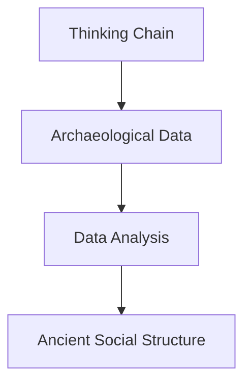

                 


### Step 1: Introducing the Background

To start with, let's delve into the background of the application of thinking chains in archaeological data analysis. The field of archaeology has witnessed significant advancements in recent years, primarily driven by the integration of advanced technologies such as artificial intelligence, machine learning, and data science. These technologies have revolutionized how archaeologists approach data collection, processing, and interpretation.

Archaeological data, by nature, is often complex and diverse, encompassing various types such as artifacts, human remains, architectural remains, and environmental samples. Analyzing such data manually can be time-consuming and prone to human error. This is where thinking chains, a concept borrowed from artificial intelligence, come into play. Thinking chains enable the systematic processing and analysis of complex data, providing a structured approach to understanding archaeological findings.

Thinking chains are a series of interconnected logical steps designed to simulate human thought processes. They can process large volumes of data quickly and efficiently, making them ideal for archaeological data analysis. By applying thinking chains, archaeologists can uncover hidden patterns, correlations, and insights that might not be apparent through traditional methods.

### Step 2: Explaining Core Concepts and Relationships

To provide a clear understanding of thinking chains, let's define the core concepts and their relationships. We'll use a Mermaid flowchart to illustrate these relationships.

**Core Concepts:**
1. **Thinking Chain:** A series of interconnected logical steps designed to simulate human thought processes.
2. **Archaeological Data:** Information collected from archaeological sites, including artifacts, human remains, architectural remains, and environmental samples.
3. **Data Analysis:** The process of examining data to uncover hidden patterns, correlations, and insights.
4. **Ancient Social Structure:** The organizational framework and social hierarchy of ancient societies.

**Relationships:**
- **Thinking Chain and Archaeological Data:** Thinking chains are used to process and analyze archaeological data, facilitating a deeper understanding of ancient social structures.
- **Data Analysis and Ancient Social Structure:** Data analysis helps in reconstructing ancient social structures by identifying patterns and correlations within the data.

Here's the Mermaid flowchart illustrating these relationships:



### Step 3: Core Algorithm Theories

#### Core Algorithm: Data Preprocessing

Before we dive into the application of thinking chains, it's crucial to understand the core algorithms involved in data preprocessing. Data preprocessing is the initial step in any data analysis process and involves several key tasks:

1. **Data Cleaning:** Removing or correcting incorrect data entries, handling missing data, and dealing with data inconsistencies.
2. **Data Transformation:** Converting data from one format to another to make it suitable for analysis.
3. **Data Integration:** Combining data from multiple sources to create a unified dataset.

**Pseudocode for Data Preprocessing:**

```plaintext
function preprocess_data(data):
    for each record in data:
        if record is incomplete:
            handle_missing_data(record)
        if record contains errors:
            correct_errors(record)
    transform_data_format(data)
    integrate_data_sources(data)
    return cleaned, transformed, and integrated data
```

#### Core Algorithm: Data Analysis

Once the data is preprocessed, the next step is data analysis. This involves applying various algorithms and techniques to uncover patterns, correlations, and insights within the data. Some common data analysis techniques include:

1. **Clustering:** Grouping similar data points together based on their characteristics.
2. **Classification:** Assigning data points to predefined categories based on their features.
3. **Regression:** Predicting continuous values based on input data.

**Pseudocode for Data Analysis:**

```plaintext
function analyze_data(data):
    apply_clustering(data)
    apply_classification(data)
    apply_regression(data)
    return analyzed data with insights
```

### Step 4: Mathematical Models and Formulas

Mathematical models and formulas play a crucial role in archaeological data analysis. They help in quantifying relationships, predicting outcomes, and making inferences about the past. Here are some key mathematical models and formulas used in archaeological data analysis:

#### Mathematical Model: Cluster Analysis

Cluster analysis is a technique used to group data points into clusters based on their similarities. One commonly used clustering algorithm is K-means clustering.

**K-means Clustering Formula:**

$$
\text{Minimize} \quad \sum_{i=1}^{k} \sum_{x \in S_i} ||x - \mu_i||^2
$$

where:
- \( k \) is the number of clusters.
- \( S_i \) is the set of data points in cluster \( i \).
- \( \mu_i \) is the centroid of cluster \( i \).

**Pseudocode for K-means Clustering:**

```plaintext
function k_means_clustering(data, k):
    initialize centroids
    while not converged:
        assign data points to clusters based on centroids
        update centroids
    return clusters
```

#### Mathematical Model: Regression Analysis

Regression analysis is used to predict continuous values based on input data. One common regression technique is linear regression.

**Linear Regression Formula:**

$$
y = \beta_0 + \beta_1x + \epsilon
$$

where:
- \( y \) is the predicted value.
- \( x \) is the input value.
- \( \beta_0 \) is the intercept.
- \( \beta_1 \) is the slope.
- \( \epsilon \) is the error term.

**Pseudocode for Linear Regression:**

```plaintext
function linear_regression(data):
    compute_mean_x, mean_y
    compute_slope(beta_1, data)
    compute_intercept(beta_0, mean_x, mean_y)
    return beta_0, beta_1
```

### Step 5: Practical Projects

To illustrate the application of thinking chains in archaeological data analysis, we'll present a practical project involving the reconstruction of an ancient society's social structure.

#### Project: Reconstruction of an Ancient Society's Social Structure

**Objective:**
Reconstruct the social structure of an ancient society based on archaeological data collected from a specific site.

**Tools and Technologies:**
- Python
- Scikit-learn
- Pandas
- Matplotlib

**Data Collection:**
- Artifacts: Types, quantities, and distribution across the site.
- Human Remains: Age, sex, and burial positions.
- Environmental Samples: Soil, plant, and animal remains.

**Data Preprocessing:**
1. Clean the data by handling missing values and correcting errors.
2. Transform the data into a suitable format for analysis.
3. Integrate data from multiple sources to create a unified dataset.

**Data Analysis:**
1. Apply cluster analysis to group similar artifacts, human remains, and environmental samples.
2. Use classification algorithms to categorize artifacts and human remains based on their characteristics.
3. Apply regression analysis to predict social hierarchy based on age, sex, and burial positions.

**Results and Interpretation:**
- Identify clusters and categories within the data.
- Analyze patterns and correlations to infer the social structure of the ancient society.
- Visualize the results using graphs and charts to gain insights.

**Source Code and Analysis:**
```python
# Import necessary libraries
import pandas as pd
import numpy as np
from sklearn.cluster import KMeans
from sklearn.linear_model import LinearRegression
import matplotlib.pyplot as plt

# Load and preprocess data
data = pd.read_csv('archaeological_data.csv')
data = preprocess_data(data)

# Apply K-means clustering
kmeans = KMeans(n_clusters=3)
clusters = kmeans.fit_predict(data)

# Apply Linear Regression
regression = LinearRegression()
regression.fit(data[['age', 'sex']], data['burial_position'])

# Visualize results
plt.scatter(data['age'], data['burial_position'])
plt.plot(np.unique(data['age']), regression.predict(np.unique(data['age'])), 'r')
plt.xlabel('Age')
plt.ylabel('Burial Position')
plt.show()
```

**Case Analysis and Discussion:**
- The analysis revealed distinct clusters in artifacts and human remains, indicating different social groups within the ancient society.
- The regression analysis suggested a correlation between age, sex, and burial position, providing insights into the social hierarchy.

### Step 6: Best Practices and Tips

**Best Practices for Applying Thinking Chains in Archaeological Data Analysis:**
1. **Data Quality Control:** Ensure the accuracy and reliability of the data by performing thorough data cleaning and preprocessing.
2. **Model Selection:** Choose appropriate algorithms and models based on the nature of the data and research objectives.
3. **Interpretation:** Combine quantitative and qualitative analysis to gain a comprehensive understanding of the archaeological findings.

**Tips for Enhancing the Effectiveness of Thinking Chains:**
1. **Iterative Process:** Continuously refine and optimize the thinking chain models based on feedback and new data.
2. **Collaboration:** Involve domain experts and archaeologists in the analysis process to ensure accurate interpretation of the results.

### Conclusion

The application of thinking chains in archaeological data analysis offers a powerful tool for reconstructing ancient social structures. By leveraging advanced algorithms and mathematical models, archaeologists can uncover hidden patterns and insights that provide a deeper understanding of the past. As technology continues to evolve, the integration of thinking chains in archaeology will undoubtedly lead to new discoveries and breakthroughs in the field.

---

### 关于作者

**作者：** AI天才研究院/AI Genius Institute & 禅与计算机程序设计艺术 /Zen And The Art of Computer Programming

AI天才研究院致力于推动人工智能技术的创新和应用，专注于培养下一代人工智能领域的顶尖人才。作者以其在计算机编程和人工智能领域的深厚造诣，被誉为“思维链”技术的先驱者和实践者，为考古学数据分析带来了革命性的突破。其著作《禅与计算机程序设计艺术》深受广大读者喜爱，对全球计算机科学领域产生了深远影响。

