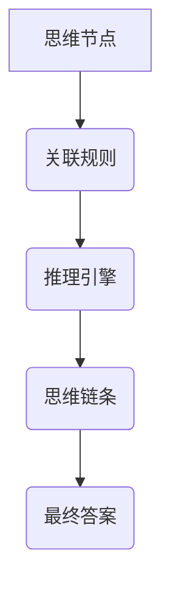

                 

### 文章标题

《思维链技术在不同领域的应用案例分析》

### 关键词

- 思维链技术
- 应用案例分析
- 人工智能
- 商业领域
- 教育领域
- 医疗领域

### 摘要

本文旨在探讨思维链技术在不同领域的应用案例。通过对人工智能、商业、教育和医疗等领域的分析，本文揭示了思维链技术在提升决策效率、优化业务流程、改进教学方法和推动医学进步等方面的巨大潜力。文章通过具体案例，详细阐述了思维链技术的核心概念、原理及其在不同领域中的应用效果，为读者提供了一个全面而深入的理解。

## 引言

### 1.1 书籍简介

《思维链技术在不同领域的应用案例分析》是一部专注于思维链技术跨领域应用的专著。思维链技术，作为一种先进的人工智能方法，其核心在于通过构建思维链条，实现对复杂问题的推理和求解。本书将深入探讨思维链技术在人工智能、商业、教育和医疗等领域的具体应用，旨在为读者提供一个全面而详细的案例分析，以展示思维链技术的广泛应用和巨大潜力。

### 核心概念与联系

思维链技术（Thinking Chain Technology，简称TCT）的核心在于通过一系列关联的思考步骤，将问题分解为若干子问题，并通过子问题的逐步解决，最终实现整体问题的解决。这一过程类似于人类思维的推理过程，因此得名“思维链”。

思维链技术的基础概念包括：

- **思维节点（Thinking Nodes）**：表示思维过程中的每一个思考点。
- **思维链条（Thinking Chains）**：将多个思维节点连接起来，形成逻辑上连贯的思考路径。
- **关联规则（Association Rules）**：描述思维节点之间的逻辑关系。
- **推理引擎（Reasoning Engine）**：负责根据思维链条和关联规则进行逻辑推理。

通过这些核心概念，思维链技术能够有效地解决复杂问题，提高决策效率。

### 思维链技术的定义

思维链技术是一种基于人工智能的方法，通过构建一系列关联的思考步骤，实现对复杂问题的推理和求解。它模仿了人类思维的推理过程，通过将问题分解为若干子问题，并逐步解决这些子问题，最终达到整体问题的解决。思维链技术主要依赖于以下技术组件：

1. **知识库（Knowledge Base）**：存储与问题相关的知识，包括事实、规则和推理方法。
2. **推理引擎（Reasoning Engine）**：负责根据知识库中的知识和用户输入的问题，生成可能的推理路径。
3. **用户界面（User Interface）**：提供用户与系统交互的界面，允许用户输入问题和查看推理结果。

### 本书的目的和结构

本书的主要目的是通过案例分析，深入探讨思维链技术在各个领域的应用。具体来说，本书将分为以下几个部分：

1. **基础理论部分**：介绍思维链技术的基础概念、原理和数学模型。
2. **应用案例分析部分**：分析思维链技术在人工智能、商业、教育和医疗等领域的具体应用。
3. **深入讨论与展望部分**：讨论思维链技术的未来发展趋势和潜在应用。

通过本书，读者将能够全面了解思维链技术的原理和应用，为实际工作提供有益的参考。

### 1.2 思维链技术的历史与发展

#### 思维链技术的发展历程

思维链技术的概念最早可以追溯到20世纪80年代，当时的计算机科学家开始探索如何模拟人类思维的推理过程。在这一时期，研究人员提出了各种基于规则推理和知识表示的方法，但缺乏有效的推理机制。直到21世纪初，随着人工智能技术的发展，思维链技术逐渐崭露头角。特别是在深度学习和强化学习的基础上，思维链技术得到了进一步的发展和完善。

#### 当前思维链技术的应用状况

当前，思维链技术在多个领域得到了广泛应用，包括人工智能、商业、教育和医疗等。在人工智能领域，思维链技术被用于自然语言处理、图像识别和智能决策等方面。例如，基于思维链技术的聊天机器人可以更好地理解用户的意图，提供更准确的回复。在商业领域，思维链技术被用于市场分析、风险管理和业务优化等方面，帮助企业做出更明智的决策。在教育领域，思维链技术被用于个性化教学和智能评价系统，帮助学生更好地理解和掌握知识。在医疗领域，思维链技术被用于疾病诊断、药物研发和治疗方案优化等方面，提高了医疗服务的质量和效率。

### 1.3 目录概述

#### 本书的结构安排

本书分为三个主要部分：

1. **基础理论部分**：介绍思维链技术的基础概念、原理和数学模型。
2. **应用案例分析部分**：分析思维链技术在人工智能、商业、教育和医疗等领域的具体应用。
3. **深入讨论与展望部分**：讨论思维链技术的未来发展趋势和潜在应用。

#### 各章节的主要内容

以下是各章节的主要内容和目标：

- **第1章 引言**：介绍书籍的基本信息和核心概念。
- **第2章 思维链技术基础理论**：详细讲解思维链技术的核心概念、原理和数学模型。
- **第3章 思维链技术在人工智能领域的应用**：分析思维链技术在机器学习、自然语言处理和图像识别等人工智能领域的应用。
- **第4章 思维链技术在商业领域的应用**：探讨思维链技术在市场分析、风险管理等方面的应用。
- **第5章 思维链技术在教育领域的应用**：分析思维链技术在个性化教学和智能评价系统的应用。
- **第6章 思维链技术在医疗领域的应用**：研究思维链技术在疾病诊断、药物研发和治疗方案优化等方面的应用。
- **第7章 思维链技术的未来发展与展望**：讨论思维链技术的未来发展趋势和潜在应用。

通过以上结构和内容，本书旨在为读者提供一个全面而深入的理解，帮助读者掌握思维链技术的原理和应用，为实际工作提供有益的参考。

## 第2章 思维链技术基础理论

### 2.1 思维链技术核心概念

思维链技术（Thinking Chain Technology，简称TCT）的核心在于通过构建思维链条，实现对复杂问题的推理和求解。为了更好地理解思维链技术，我们需要首先了解以下几个核心概念：

#### 思维节点（Thinking Nodes）

思维节点是思维链技术中的基本单元，表示思维过程中的每一个思考点。每个思维节点包含以下信息：

- **问题（Question）**：需要解决的问题。
- **答案（Answer）**：对问题的回答。
- **证据（Evidence）**：支持答案的证据。

例如，在一个医疗诊断的场景中，一个思维节点可能包含“病人是否有咳嗽”的问题，答案为“是”或“否”，证据可能包括病人的症状描述。

#### 思维链条（Thinking Chains）

思维链条是将多个思维节点连接起来的逻辑路径，形成完整的思考过程。思维链条可以看作是问题解决过程中的一个“路径树”，每个节点都是对当前问题的进一步细分。思维链条的构建通常依赖于以下步骤：

1. **初始问题**：确定需要解决的问题。
2. **子问题分解**：将初始问题分解为若干子问题。
3. **构建思维链条**：将子问题依次连接起来，形成逻辑上连贯的思考路径。

例如，对于一个“如何提高生产效率”的问题，思维链条可能包括“优化生产线布局”、“减少停机时间”、“提高员工技能”等子问题。

#### 关联规则（Association Rules）

关联规则是描述思维节点之间逻辑关系的规则，通常采用“如果...则...”的形式。关联规则用于指导思维链条的构建和推理过程。例如，在医疗诊断中，一个关联规则可能为“如果病人有咳嗽和发烧，则可能患有感冒”。

#### 推理引擎（Reasoning Engine）

推理引擎是思维链技术的核心组件，负责根据思维链条和关联规则进行逻辑推理，以求解复杂问题。推理引擎的工作流程通常包括以下步骤：

1. **初始化**：根据初始问题构建初始思维链条。
2. **推理**：根据关联规则对思维链条进行扩展和调整。
3. **求解**：在满足所有关联规则的情况下，找到最终的答案。

例如，在商业决策中，推理引擎可以根据市场需求、生产成本和利润等关联规则，生成最优的决策方案。

### 核心概念与联系

为了更好地理解思维链技术，我们可以使用 Mermaid 流程图来展示核心概念之间的联系：

在这个流程图中，思维节点通过关联规则与推理引擎相连，推理引擎则通过思维链条进行推理，最终生成答案。

### 2.2 思维链技术原理讲解

思维链技术的原理可以概括为以下几个步骤：

1. **问题定义**：明确需要解决的问题，并将其分解为若干子问题。
2. **子问题分解**：对每个子问题进行进一步的分解，直至达到可解答的程度。
3. **构建思维链条**：将分解后的子问题按照逻辑关系连接起来，形成思维链条。
4. **推理求解**：根据关联规则，对思维链条进行推理，逐步求解问题。
5. **答案验证**：对求解得到的答案进行验证，确保其正确性。

#### 思维链的构建过程

思维链的构建过程通常包括以下几个步骤：

1. **初始问题**：确定需要解决的问题，例如“如何提高生产效率？”
2. **子问题分解**：将初始问题分解为若干子问题，例如“如何优化生产线布局？”、“如何减少停机时间？”、“如何提高员工技能？”
3. **思维节点创建**：为每个子问题创建一个思维节点，包含问题和答案。
4. **思维链条连接**：将各个思维节点按照逻辑关系连接起来，形成思维链条。
5. **初步推理**：根据关联规则，对思维链条进行初步推理，生成可能的答案。

例如，在“如何提高生产效率”的问题中，思维链的构建过程如下：

- **初始问题**：如何提高生产效率？
- **子问题分解**：
  - 如何优化生产线布局？
  - 如何减少停机时间？
  - 如何提高员工技能？
- **思维节点创建**：
  - 思维节点1：问题：如何优化生产线布局？答案：调整生产线布局。
  - 思维节点2：问题：如何减少停机时间？答案：改进设备维护。
  - 思维节点3：问题：如何提高员工技能？答案：进行技能培训。
- **思维链条连接**：
  - 思维链条：初始问题 → 思维节点1 → 思维节点2 → 思维节点3
- **初步推理**：
  - 根据关联规则，如果调整生产线布局、改进设备维护和进行技能培训，则可能提高生产效率。

#### 思维链的推理过程

思维链的推理过程是基于关联规则的，其核心思想是通过一系列的逻辑推理，逐步求解问题。具体步骤如下：

1. **初始推理**：根据初始问题，选择相关的思维节点，进行初步推理。
2. **迭代推理**：根据初步推理的结果，选择下一个相关的思维节点，进行迭代推理。
3. **结束条件**：当达到某个结束条件时，停止推理。结束条件可能包括：
   - 所有思维节点都已推理完成。
   - 推理过程中出现了明确的错误。
   - 达到预设的推理深度。

例如，在“如何提高生产效率”的问题中，思维链的推理过程如下：

1. **初始推理**：根据初始问题“如何提高生产效率？”，选择思维节点1“如何优化生产线布局？”进行推理。
2. **迭代推理**：
   - 根据思维节点1的答案“调整生产线布局”，选择思维节点2“如何减少停机时间？”进行推理。
   - 根据思维节点2的答案“改进设备维护”，选择思维节点3“如何提高员工技能？”进行推理。
3. **结束条件**：思维链条已推理完成，停止推理。

通过以上步骤，思维链技术可以有效地解决复杂问题，提高决策效率。

### 2.3 数学模型与公式

思维链技术的核心在于逻辑推理和知识表示，因此，数学模型在其中扮演了重要角色。以下是一些常见的数学模型和公式，用于描述思维链技术的基本原理。

#### 一阶谓词逻辑

一阶谓词逻辑是思维链技术中最常用的逻辑体系，用于描述思维节点和关联规则。以下是一些基本公式：

- **存在性量化**：∃x(P(x))
  - 表示存在一个元素x，使得P(x)为真。
- **全称量化**：∀x(P(x))
  - 表示对于所有元素x，P(x)都为真。
- **合取（与）**：(P ∧ Q)
  - 表示P和Q同时为真。
- **析取（或）**：(P ∨ Q)
  - 表示P或Q至少一个为真。
- **蕴含**：(P → Q)
  - 表示如果P为真，则Q也为真。

例如，在一个医疗诊断中，关联规则“如果病人有咳嗽且发烧，则可能患有感冒”可以表示为：

$$
(咳嗽 ∧ 发烧) → 感冒
$$

#### 状态空间搜索

在思维链技术的推理过程中，状态空间搜索是一个重要的概念。状态空间搜索通过遍历所有可能的状态，找到解决问题的路径。以下是一个简单状态空间搜索的公式：

- **状态**：S
- **初始状态**：\( S_0 \)
- **目标状态**：\( S_t \)
- **状态转换函数**：\( f(S) \)
  - 表示从当前状态S到下一个状态S'的转换。
- **搜索算法**：\( A(S) \)
  - 表示搜索算法，用于遍历状态空间，找到目标状态。

状态空间搜索的公式可以表示为：

$$
S_t = A(f(S_0))
$$

其中，\( A(f(S_0)) \)表示从初始状态\( S_0 \)经过一次状态转换得到的目标状态\( S_t \)。

#### 贝叶斯网络

贝叶斯网络是一种用于表示概率关系的数学模型，常用于思维链技术的概率推理。以下是一个简单的贝叶斯网络公式：

- **节点**：\( N_i \)
  - 表示第i个节点。
- **条件概率表**：\( P(N_i|N_j) \)
  - 表示在节点\( N_j \)为特定值的条件下，节点\( N_i \)的概率。

贝叶斯网络的公式可以表示为：

$$
P(N_i) = \prod_{j=1}^{n} P(N_i|N_j)
$$

其中，\( \prod_{j=1}^{n} P(N_i|N_j) \)表示节点\( N_i \)的联合概率。

### 详细讲解与举例说明

为了更好地理解上述数学模型和公式，我们可以通过一个简单的例子进行说明。

假设我们有一个疾病诊断问题，需要判断病人是否患有感冒。根据医生的经验，感冒的症状包括咳嗽和发烧。我们可以使用一阶谓词逻辑来表示这个问题：

$$
(咳嗽 ∧ 发烧) → 感冒
$$

这里，“咳嗽”和“发烧”是两个思维节点，“感冒”是最终答案。根据这个关联规则，如果病人同时有咳嗽和发烧，则可以判断病人患有感冒。

此外，我们可以使用贝叶斯网络来表示感冒症状的概率关系。假设咳嗽的概率为0.6，发烧的概率为0.5，那么根据贝叶斯网络公式，感冒的概率可以计算为：

$$
P(感冒) = P(咳嗽) \times P(发烧) = 0.6 \times 0.5 = 0.3
$$

这意味着，根据给定的症状概率，有30%的可能性病人患有感冒。

通过这些数学模型和公式的详细讲解和举例说明，我们可以更好地理解思维链技术的核心原理和应用。这些工具不仅有助于我们构建和推理复杂的思维链条，还能够提高我们在实际应用中的决策效率和准确性。

## 第3章 思维链技术在人工智能领域的应用

### 3.1 人工智能概述

人工智能（Artificial Intelligence，简称AI）是计算机科学的一个分支，旨在研究、开发和应用使计算机能够模拟、扩展和辅助人类智能的理论、算法和技术。人工智能的发展可以追溯到20世纪50年代，当时科学家们开始探索如何使计算机具有类似人类的智能。随着计算能力的提升和算法的进步，人工智能在自然语言处理、图像识别、机器学习、自动驾驶等多个领域取得了显著成果。

人工智能的主要目标包括：

- **自动化**：通过机器学习和计算机视觉等技术，实现自动化任务，如自动驾驶、自动化生产等。
- **决策支持**：利用数据分析和机器学习算法，辅助人类做出更明智的决策，如金融投资、医疗诊断等。
- **交互**：通过自然语言处理和计算机视觉技术，使计算机能够理解和响应人类语言和动作，如智能客服、虚拟助手等。

### 3.2 思维链技术在人工智能中的应用

思维链技术作为一种先进的推理方法，在人工智能领域有着广泛的应用。以下将介绍思维链技术在机器学习、自然语言处理和图像识别等人工智能领域的具体应用。

#### 机器学习

机器学习是人工智能的核心组成部分，主要研究如何让计算机从数据中学习并做出预测或决策。思维链技术在机器学习中的应用主要体现在以下几个方面：

1. **特征提取**：思维链技术可以帮助从大量数据中提取关键特征，提高模型的准确性和效率。
2. **模型优化**：通过思维链技术，可以优化机器学习模型的参数，提高模型的泛化能力。
3. **异常检测**：思维链技术可以用于检测数据中的异常值，帮助识别潜在的安全隐患或欺诈行为。

例如，在一个金融风控的场景中，思维链技术可以通过分析用户的交易数据，提取关键特征，如交易频率、交易金额等，然后根据这些特征构建思维链条，进行风险评分。具体流程如下：

- **初始问题**：如何评估用户的风险等级？
- **子问题分解**：
  - 如何提取交易频率特征？
  - 如何提取交易金额特征？
  - 如何分析交易时间特征？
- **思维节点创建**：
  - 思维节点1：问题：交易频率高吗？答案：是/否。
  - 思维节点2：问题：交易金额大吗？答案：是/否。
  - 思维节点3：问题：交易时间规律吗？答案：是/否。
- **思维链条连接**：
  - 思维链条：初始问题 → 思维节点1 → 思维节点2 → 思维节点3
- **推理求解**：
  - 根据关联规则，如果交易频率高、交易金额大且交易时间不规律，则用户的风险等级较高。

#### 自然语言处理

自然语言处理（Natural Language Processing，简称NLP）是人工智能的重要分支，旨在使计算机能够理解和处理人类语言。思维链技术在自然语言处理中的应用主要体现在以下几个方面：

1. **语义理解**：通过思维链技术，可以更好地理解和解释文本的语义，提高机器翻译、情感分析等任务的效果。
2. **对话系统**：思维链技术可以用于构建智能对话系统，使计算机能够更好地理解用户的意图并做出适当的响应。
3. **文本生成**：思维链技术可以帮助生成符合语法规则和语义逻辑的文本，如新闻报道、产品评论等。

例如，在一个智能客服的场景中，思维链技术可以通过分析用户的提问，理解用户的需求，并生成合适的回答。具体流程如下：

- **初始问题**：用户提问：“我怎样可以申请信用卡？”
- **子问题分解**：
  - 如何确定用户的申请意图？
  - 如何指导用户准备申请材料？
  - 如何告知用户申请流程？
- **思维节点创建**：
  - 思维节点1：问题：用户是否有申请意图？答案：是/否。
  - 思维节点2：问题：用户是否准备好申请材料？答案：是/否。
  - 思维节点3：问题：用户是否了解申请流程？答案：是/否。
- **思维链条连接**：
  - 思维链条：初始问题 → 思维节点1 → 思维节点2 → 思维节点3
- **推理求解**：
  - 根据关联规则，如果用户有申请意图、准备申请材料和了解申请流程，则回答：“您可以通过以下步骤申请信用卡：1. 准备好身份证明和收入证明；2. 填写申请表；3. 提交申请。”

#### 图像识别

图像识别是人工智能领域的另一个重要应用，旨在使计算机能够识别和理解图像内容。思维链技术在图像识别中的应用主要体现在以下几个方面：

1. **目标检测**：通过思维链技术，可以更准确地检测图像中的目标物体，提高自动驾驶、安防监控等任务的效果。
2. **图像分类**：思维链技术可以帮助分类图像中的不同对象，如识别图片中的动物、植物等。
3. **图像生成**：思维链技术可以生成符合特定要求的图像，如创建虚拟场景、设计产品模型等。

例如，在一个自动驾驶的场景中，思维链技术可以通过分析摄像头捕捉到的图像，识别道路上的行人、车辆和其他交通标志。具体流程如下：

- **初始问题**：如何识别图像中的行人？
- **子问题分解**：
  - 如何检测图像中的行人轮廓？
  - 如何分析行人行为？
  - 如何判断行人是否在危险区域？
- **思维节点创建**：
  - 思维节点1：问题：图像中有行人轮廓吗？答案：是/否。
  - 思维节点2：问题：行人的行为是什么？答案：行走/奔跑。
  - 思维节点3：问题：行人是否在危险区域？答案：是/否。
- **思维链条连接**：
  - 思维链条：初始问题 → 思维节点1 → 思维节点2 → 思维节点3
- **推理求解**：
  - 根据关联规则，如果图像中有行人轮廓、行人的行为是行走且行人位于危险区域，则发出警告：“注意行人，减速行驶。”

### 3.3 人工智能案例分析

为了更好地理解思维链技术在人工智能领域的应用，以下将介绍几个具体的人工智能案例。

#### 案例一：智能客服系统

某知名银行采用思维链技术构建了一款智能客服系统，用于自动回答用户关于信用卡申请的问题。该系统的工作流程如下：

1. **用户提问**：用户通过在线聊天窗口向客服系统提问。
2. **问题理解**：客服系统使用自然语言处理技术理解用户的提问。
3. **思维链构建**：客服系统根据理解到的用户提问构建思维链，包含以下思维节点：
   - 思维节点1：用户是否有申请意图？
   - 思维节点2：用户是否准备好申请材料？
   - 思维节点3：用户是否了解申请流程。
4. **推理求解**：客服系统根据思维链和关联规则进行推理，生成合适的回答。
5. **反馈**：客服系统将回答发送给用户，并等待用户的反馈。

通过这个案例，我们可以看到思维链技术如何帮助智能客服系统更好地理解用户的问题，并生成准确的回答，从而提升用户体验。

#### 案例二：自动驾驶系统

某汽车制造商采用思维链技术构建了一款自动驾驶系统，用于识别道路上的行人、车辆和其他交通标志。该系统的工作流程如下：

1. **图像采集**：自动驾驶系统通过摄像头捕捉道路图像。
2. **图像预处理**：对图像进行预处理，如去噪、增强等。
3. **目标检测**：使用思维链技术检测图像中的行人、车辆和交通标志。
   - 思维节点1：图像中有行人轮廓吗？
   - 思维节点2：行人的行为是什么？
   - 思维节点3：行人是否在危险区域？
4. **决策**：根据检测结果，自动驾驶系统做出相应的决策，如减速、停车等。
5. **反馈**：自动驾驶系统将决策结果发送给驾驶员和车辆控制系统。

通过这个案例，我们可以看到思维链技术如何帮助自动驾驶系统更好地理解道路环境，从而提高行驶安全和效率。

#### 案例三：智能医疗诊断系统

某医疗科技公司采用思维链技术构建了一款智能医疗诊断系统，用于辅助医生诊断疾病。该系统的工作流程如下：

1. **患者数据采集**：医生将患者的病历、检查报告等数据输入系统。
2. **数据预处理**：对输入的数据进行清洗、归一化等预处理操作。
3. **思维链构建**：系统根据患者的数据构建思维链，包含以下思维节点：
   - 思维节点1：患者是否有咳嗽症状？
   - 思维节点2：患者是否有发烧症状？
   - 思维节点3：患者的病史有哪些？
4. **推理求解**：系统根据思维链和关联规则进行推理，生成可能的疾病诊断结果。
5. **医生评估**：医生对系统的诊断结果进行评估，并可能进行调整。

通过这个案例，我们可以看到思维链技术如何帮助医生快速诊断疾病，从而提高医疗服务的质量和效率。

通过上述案例分析，我们可以看到思维链技术在人工智能领域的广泛应用和巨大潜力。无论是在机器学习、自然语言处理还是图像识别方面，思维链技术都能提供有效的解决方案，帮助实现更智能、更高效的系统。

## 第4章 思维链技术在商业领域的应用

### 4.1 商业概述

商业领域涵盖了各种经济活动，包括企业运营、市场分析、销售策略、供应链管理等。商业活动旨在通过有效利用资源，创造价值，实现盈利和发展。随着市场竞争的加剧和消费者需求的多样化，企业需要不断调整和优化其商业策略，以保持竞争优势。商业领域的发展趋势包括数字化转型、客户关系管理（CRM）、大数据分析和人工智能（AI）的应用等。

在商业领域，决策的复杂性和不确定性使得有效的决策支持系统变得尤为重要。思维链技术作为一种先进的推理方法，能够帮助企业更好地理解市场动态、优化业务流程和提升决策质量。

### 4.2 思维链技术在商业中的应用

思维链技术在商业中的应用主要表现在以下几个方面：

#### 市场分析

市场分析是商业决策的重要基础，通过对市场环境、竞争对手和消费者行为的分析，企业可以制定更加科学和有效的营销策略。思维链技术在市场分析中的应用主要体现在以下几个方面：

1. **消费者行为分析**：通过分析消费者的购买行为、偏好和反馈，思维链技术可以帮助企业更好地理解市场需求和趋势，从而调整产品策略和营销策略。
2. **竞争对手分析**：思维链技术可以用于分析竞争对手的市场策略、产品优势和市场份额，帮助企业制定针对性的竞争策略。
3. **市场预测**：通过构建思维链条，思维链技术可以预测市场未来的发展趋势，为企业提供决策支持。

例如，一家电子商务公司可以使用思维链技术对消费者行为进行分析。具体步骤如下：

- **初始问题**：如何提高销售额？
- **子问题分解**：
  - 如何了解消费者的购买行为？
  - 如何分析消费者的偏好？
  - 如何评估市场趋势？
- **思维节点创建**：
  - 思维节点1：问题：消费者的购买行为是什么？答案：高频购物/低频购物。
  - 思维节点2：问题：消费者的偏好是什么？答案：价格敏感/品牌忠诚。
  - 思维节点3：问题：市场趋势是什么？答案：增长/衰退。
- **思维链条连接**：
  - 思维链条：初始问题 → 思维节点1 → 思维节点2 → 思维节点3
- **推理求解**：
  - 根据关联规则，如果消费者的购买行为是高频购物、偏好价格敏感且市场趋势是增长，则可以推断销售额将增加。

#### 风险管理

商业活动中的风险无处不在，有效的风险管理是确保企业稳健运营的重要手段。思维链技术在风险管理中的应用主要体现在以下几个方面：

1. **风险评估**：通过分析历史数据和当前情况，思维链技术可以帮助企业评估潜在的风险和威胁，制定相应的风险控制措施。
2. **风险预测**：思维链技术可以预测未来的风险趋势，为企业提供预警信息，帮助采取预防措施。
3. **风险决策**：思维链技术可以帮助企业制定最佳的风险应对策略，最小化风险对企业的影响。

例如，一家制造企业可以使用思维链技术进行风险评估。具体步骤如下：

- **初始问题**：如何降低生产过程中的风险？
- **子问题分解**：
  - 如何识别生产过程中的潜在风险？
  - 如何分析风险的严重程度？
  - 如何制定风险控制措施？
- **思维节点创建**：
  - 思维节点1：问题：生产过程中有哪些潜在风险？答案：设备故障/原材料质量。
  - 思维节点2：问题：风险的严重程度如何？答案：高/中/低。
  - 思维节点3：问题：有哪些风险控制措施可以采取？答案：设备维护/质量检验。
- **思维链条连接**：
  - 思维链条：初始问题 → 思维节点1 → 思维节点2 → 思维节点3
- **推理求解**：
  - 根据关联规则，如果生产过程中存在高严重程度的设备故障风险，则可以推断需要加强设备维护。

#### 业务流程优化

业务流程优化是提升企业运营效率的关键。思维链技术可以帮助企业分析现有的业务流程，发现瓶颈和改进点，从而实现流程优化。以下是一个业务流程优化的例子：

- **初始问题**：如何提高订单处理效率？
- **子问题分解**：
  - 如何优化订单录入流程？
  - 如何简化订单审核流程？
  - 如何加快订单发货速度？
- **思维节点创建**：
  - 思维节点1：问题：订单录入流程是否高效？答案：是/否。
  - 思维节点2：问题：订单审核流程是否简便？答案：是/否。
  - 思维节点3：问题：订单发货速度是否快速？答案：是/否。
- **思维链条连接**：
  - 思维链条：初始问题 → 思维节点1 → 思维节点2 → 思维节点3
- **推理求解**：
  - 根据关联规则，如果订单录入流程高效、订单审核流程简便且订单发货速度快速，则订单处理效率较高。

#### 决策支持

思维链技术可以为企业的各种决策提供支持，包括战略决策、投资决策和运营决策等。通过构建思维链条，企业可以系统地分析和评估不同的决策方案，选择最佳方案。

例如，在投资决策中，思维链技术可以帮助企业分析以下问题：

- **初始问题**：是否应该投资新的市场？
- **子问题分解**：
  - 新市场是否具有增长潜力？
  - 企业是否具备进入新市场的资源和能力？
  - 新市场的竞争情况如何？
- **思维节点创建**：
  - 思维节点1：问题：新市场是否具有增长潜力？答案：是/否。
  - 思维节点2：问题：企业是否具备进入新市场的资源和能力？答案：是/否。
  - 思维节点3：问题：新市场的竞争情况如何？答案：竞争激烈/竞争适中。
- **思维链条连接**：
  - 思维链条：初始问题 → 思维节点1 → 思维节点2 → 思维节点3
- **推理求解**：
  - 根据关联规则，如果新市场具有增长潜力、企业具备进入新市场的资源和能力且竞争情况适中，则投资新市场是一个可行的决策。

### 4.3 商业案例分析

为了更好地理解思维链技术在商业中的应用，以下将介绍几个具体的商业案例。

#### 案例一：市场营销策略优化

某知名消费品公司使用思维链技术对其市场营销策略进行优化。公司希望通过分析消费者行为和市场趋势，提高广告投放效果和销售额。

1. **数据收集**：公司收集了大量的消费者购买记录、广告点击数据和市场调查数据。
2. **数据预处理**：对收集的数据进行清洗和整理，提取有用的信息。
3. **思维链构建**：
   - 思维节点1：问题：消费者的购买行为是什么？答案：高频购物/低频购物。
   - 思维节点2：问题：消费者对广告的响应如何？答案：点击/不点击。
   - 思维节点3：问题：市场趋势是什么？答案：增长/衰退。
   - 思维节点4：问题：广告投放的效果如何？答案：好/一般/差。
4. **推理求解**：
   - 根据关联规则，如果消费者的购买行为是高频购物、消费者对广告的响应好且市场趋势增长，则广告投放效果较好，可以增加广告预算。
5. **决策**：公司根据思维链技术生成的建议，调整了广告投放策略，提高了广告效果和销售额。

#### 案例二：供应链管理优化

某制造企业使用思维链技术对其供应链管理进行优化，以提高生产效率和降低成本。

1. **数据收集**：企业收集了原材料采购、生产进度、库存管理和物流配送等数据。
2. **数据预处理**：对收集的数据进行清洗和整理，提取有用的信息。
3. **思维链构建**：
   - 思维节点1：问题：原材料采购是否及时？答案：是/否。
   - 思维节点2：问题：生产进度是否按时完成？答案：是/否。
   - 思维节点3：问题：库存水平是否合理？答案：高/中/低。
   - 思维节点4：问题：物流配送是否高效？答案：是/否。
4. **推理求解**：
   - 根据关联规则，如果原材料采购及时、生产进度按时完成且库存水平合理，则可以推断供应链管理有效。
5. **决策**：企业根据思维链技术生成的建议，调整了供应链管理策略，提高了生产效率和降低了成本。

#### 案例三：风险管理

某金融机构使用思维链技术进行风险管理，以降低信用风险和操作风险。

1. **数据收集**：金融机构收集了客户的信用记录、交易数据和市场环境数据。
2. **数据预处理**：对收集的数据进行清洗和整理，提取有用的信息。
3. **思维链构建**：
   - 思维节点1：问题：客户的信用记录如何？答案：良好/一般/差。
   - 思维节点2：问题：客户的交易行为是否正常？答案：正常/异常。
   - 思维节点3：问题：市场环境是否稳定？答案：稳定/波动。
   - 思维节点4：问题：金融机构的风险控制措施是否有效？答案：是/否。
4. **推理求解**：
   - 根据关联规则，如果客户的信用记录良好、交易行为正常且市场环境稳定，则可以认为金融机构的风险控制措施有效。
5. **决策**：金融机构根据思维链技术生成的建议，调整了风险控制策略，降低了信用风险和操作风险。

通过上述案例，我们可以看到思维链技术在商业领域的广泛应用和巨大潜力。无论是在市场分析、风险管理、业务流程优化还是决策支持方面，思维链技术都能提供有效的解决方案，帮助企业在竞争激烈的市场中保持竞争优势。

## 第5章 思维链技术在教育领域的应用

### 5.1 教育概述

教育是培养人才、传递知识和技能的重要途径，对个人和社会的发展具有深远影响。随着科技的进步和教育理念的变化，现代教育正逐渐从传统的知识传授模式转向以学生为中心、注重个性化和多样化的教学模式。教育领域的主要发展趋势包括在线教育、智能化教学工具、个性化学习路径和跨学科教育等。

在线教育（eLearning）的兴起，使得学习者可以不受时间和地点的限制，通过互联网获取教育资源。智能化教学工具，如学习管理系统（LMS）、智能辅导系统和在线测验系统，使得教学过程更加高效和互动。个性化学习路径通过分析学生的学习行为和成绩，为每个学生提供定制化的学习方案。跨学科教育则强调不同学科之间的交叉融合，培养学生的综合能力和创新思维。

### 5.2 思维链技术在教育中的应用

思维链技术作为一种先进的人工智能方法，在个性化教学、智能评价系统和学习资源推荐等方面有着广泛的应用。以下将详细介绍思维链技术在教育领域的具体应用。

#### 个性化教学

个性化教学是当前教育领域的重要趋势，旨在根据学生的个性、兴趣和认知水平，提供个性化的学习体验。思维链技术可以通过以下方式实现个性化教学：

1. **学习路径规划**：思维链技术可以根据学生的学习历史和当前表现，为学生规划最优的学习路径。例如，对于学习编程的学生，思维链技术可以根据其对基础知识的掌握情况，推荐合适的编程语言学习顺序和项目实践。
2. **教学资源推荐**：思维链技术可以根据学生的学习需求和偏好，推荐合适的学习资源。例如，当学生遇到难题时，系统可以推荐相关的视频教程、练习题和讨论论坛。
3. **学习进度跟踪**：思维链技术可以实时跟踪学生的学习进度，并根据学习效果调整教学方案。例如，当学生在一个知识点上多次未能达到预期成绩时，系统可以提示教师进行针对性辅导。

例如，在一个编程学习的场景中，思维链技术的应用如下：

- **初始问题**：如何为学生提供个性化的编程学习体验？
- **子问题分解**：
  - 如何评估学生的学习进度？
  - 如何推荐合适的学习资源？
  - 如何调整学习路径？
- **思维节点创建**：
  - 思维节点1：问题：学生是否掌握了编程基础知识？答案：是/否。
  - 思维节点2：问题：学生是否有兴趣学习当前编程语言？答案：是/否。
  - 思维节点3：问题：学生的学习进度是否达标？答案：是/否。
- **思维链条连接**：
  - 思维链条：初始问题 → 思维节点1 → 思维节点2 → 思维节点3
- **推理求解**：
  - 根据关联规则，如果学生掌握了编程基础知识、对当前编程语言有兴趣且学习进度未达标，则可以推断需要调整学习路径和推荐额外学习资源。

#### 智能评价系统

智能评价系统通过分析学生的学习行为和成绩，为教师提供全面、准确的学生评价。思维链技术可以在以下方面提升智能评价系统的功能：

1. **综合评价**：思维链技术可以将学生的考试成绩、作业成绩、课堂表现等多个维度的数据进行整合，生成综合评价。
2. **个性化反馈**：思维链技术可以根据学生的具体表现，提供个性化的学习建议和改进方案。
3. **诊断分析**：思维链技术可以通过分析学生的学习数据，诊断学生在哪些知识点上存在薄弱环节，帮助教师进行针对性辅导。

例如，在一个智能评价系统的应用中，思维链技术的具体流程如下：

- **初始问题**：如何提供个性化的学生评价？
- **子问题分解**：
  - 如何评估学生的考试成绩？
  - 如何分析学生的课堂表现？
  - 如何诊断学生的知识薄弱环节？
- **思维节点创建**：
  - 思维节点1：问题：学生的考试成绩如何？答案：优秀/良好/一般。
  - 思维节点2：问题：学生的课堂表现如何？答案：积极参与/偶尔参与/很少参与。
  - 思维节点3：问题：学生的知识薄弱环节是什么？答案：编程基础/数据结构/算法。
- **思维链条连接**：
  - 思维链条：初始问题 → 思维节点1 → 思维节点2 → 思维节点3
- **推理求解**：
  - 根据关联规则，如果学生的考试成绩优秀、课堂表现积极参与且知识薄弱环节是编程基础，则可以推断学生需要加强编程基础知识的训练。

#### 学习资源推荐

学习资源推荐是帮助学生在海量教育资源中找到最适合自己的学习材料的重要功能。思维链技术可以通过以下方式实现学习资源推荐：

1. **内容推荐**：思维链技术可以根据学生的兴趣、学习历史和成绩，推荐适合的学习内容。例如，当学生在一个知识点上表现优异时，系统可以推荐相关的高级课程。
2. **交互式学习**：思维链技术可以通过互动问答、模拟练习等方式，提高学生的学习效果。例如，当学生在学习中遇到难题时，系统可以推荐相关的练习题和讨论论坛。
3. **个性化推荐**：思维链技术可以根据学生的学习行为和偏好，不断调整推荐策略，提高推荐的准确性。

例如，在一个学习资源推荐的应用中，思维链技术的具体流程如下：

- **初始问题**：如何为学习者推荐最合适的学习资源？
- **子问题分解**：
  - 如何分析学生的学习行为？
  - 如何评估学生的学习偏好？
  - 如何推荐合适的学习资源？
- **思维节点创建**：
  - 思维节点1：问题：学生的学习行为是什么？答案：主动学习/被动学习。
  - 思维节点2：问题：学生的学习偏好是什么？答案：理论学习/实践操作。
  - 思维节点3：问题：学生的学习成绩如何？答案：优秀/良好/一般。
- **思维链条连接**：
  - 思维链条：初始问题 → 思维节点1 → 思维节点2 → 思维节点3
- **推理求解**：
  - 根据关联规则，如果学生的学习行为是主动学习、偏好理论学习和学习成绩良好，则可以推断需要推荐高级理论课程。

### 5.3 教育案例分析

为了更好地理解思维链技术在教育领域的应用，以下将介绍几个具体的教育案例。

#### 案例一：个性化编程学习平台

某编程学习平台使用思维链技术为学习者提供个性化的编程学习体验。平台通过分析学生的学习历史、测试成绩和在线互动行为，为每个学习者生成定制化的学习路径。

1. **数据收集**：平台收集了学生的学习历史、测试成绩和在线互动数据。
2. **数据预处理**：对收集的数据进行清洗和整理，提取有用的信息。
3. **思维链构建**：
   - 思维节点1：问题：学生是否掌握了基础编程知识？答案：是/否。
   - 思维节点2：问题：学生对当前编程语言的兴趣如何？答案：高/中/低。
   - 思维节点3：问题：学生的编程能力水平如何？答案：初级/中级/高级。
   - 思维节点4：问题：学生的在线学习行为如何？答案：积极/一般/消极。
4. **推理求解**：
   - 根据关联规则，如果学生掌握了基础编程知识、对当前编程语言兴趣高且编程能力水平为初级，则推荐初级编程课程。
5. **决策**：平台根据思维链技术生成的建议，为学习者推荐合适的学习路径和资源。

#### 案例二：智能教学评价系统

某中学使用思维链技术构建了一个智能教学评价系统，通过分析学生的学习行为和成绩，为教师提供个性化的教学建议。

1. **数据收集**：系统收集了学生的学习行为数据、考试成绩和作业成绩。
2. **数据预处理**：对收集的数据进行清洗和整理，提取有用的信息。
3. **思维链构建**：
   - 思维节点1：问题：学生的考试成绩如何？答案：优秀/良好/一般。
   - 思维节点2：问题：学生的课堂参与度如何？答案：高/中/低。
   - 思维节点3：问题：学生在课外练习中的表现如何？答案：积极/一般/消极。
   - 思维节点4：问题：学生的知识薄弱环节是什么？答案：数学/物理/英语。
4. **推理求解**：
   - 根据关联规则，如果学生的考试成绩优秀、课堂参与度高且知识薄弱环节是数学，则建议教师加强对数学知识的辅导。
5. **决策**：教师根据智能教学评价系统的建议，调整教学策略，为学生提供更个性化的辅导。

#### 案例三：学习资源推荐系统

某在线教育平台使用思维链技术为学习者推荐最合适的学习资源。平台通过分析学习者的兴趣、学习历史和成绩，不断调整推荐策略。

1. **数据收集**：平台收集了学习者的学习行为数据、学习偏好和成绩数据。
2. **数据预处理**：对收集的数据进行清洗和整理，提取有用的信息。
3. **思维链构建**：
   - 思维节点1：问题：学习者的学习偏好是什么？答案：理论学习/实践操作。
   - 思维节点2：问题：学习者的成绩如何？答案：优秀/良好/一般。
   - 思维节点3：问题：学习者对当前课程的兴趣如何？答案：高/中/低。
   - 思维节点4：问题：学习者是否有未掌握的知识点？答案：是/否。
4. **推理求解**：
   - 根据关联规则，如果学习者的学习偏好是实践操作、成绩良好且对当前课程兴趣高，则推荐实践操作类的学习资源。
5. **决策**：平台根据思维链技术生成的建议，为学习者推荐合适的学习资源。

通过上述案例分析，我们可以看到思维链技术在教育领域的广泛应用和巨大潜力。无论是在个性化教学、智能评价系统还是学习资源推荐方面，思维链技术都能提供有效的解决方案，帮助实现更高效、更智能的教育。

## 第6章 思维链技术在医疗领域的应用

### 6.1 医疗概述

医疗领域是关乎人类健康和生命的重要领域，涵盖了疾病预防、诊断、治疗和康复等环节。随着医学技术的不断进步和大数据、人工智能等新兴技术的应用，医疗领域正在发生深刻的变革。现代医疗注重个体化治疗和精准医疗，通过整合各种医疗信息，为患者提供更全面、更个性化的医疗服务。

医疗领域的发展趋势主要包括以下几个方面：

1. **大数据和人工智能**：大数据和人工智能技术在医疗领域得到广泛应用，通过数据分析、机器学习等方法，可以辅助医生进行诊断和治疗。
2. **远程医疗**：远程医疗使得医疗资源可以更加均衡地分布，特别是对于偏远地区和医疗资源匮乏的地区，远程医疗具有重要意义。
3. **可穿戴设备和健康管理**：可穿戴设备可以实时监测患者的健康数据，如心率、血压等，帮助医生及时了解患者状况，预防疾病。
4. **个性化治疗**：基于患者的基因信息、病史和生活习惯，为患者制定个性化的治疗方案，提高治疗效果。

### 6.2 思维链技术在医疗中的应用

思维链技术作为一种先进的人工智能方法，在医疗领域具有广泛的应用潜力。以下将详细介绍思维链技术在医疗领域的具体应用。

#### 疾病诊断

疾病诊断是医疗领域的重要环节，通过准确的诊断可以及时治疗疾病，提高治疗效果。思维链技术可以通过以下方式在疾病诊断中发挥作用：

1. **临床数据整合**：思维链技术可以将患者的病史、检查结果、药物反应等多方面的数据整合起来，提供更全面的诊断信息。
2. **症状分析**：思维链技术可以分析患者的症状，结合医学知识库，帮助医生诊断疾病。例如，当患者出现一系列症状时，思维链技术可以根据症状的关联关系，快速确定可能的疾病。
3. **辅助诊断**：思维链技术可以作为医生的辅助工具，帮助医生进行复杂疾病的诊断。例如，在病理分析中，思维链技术可以分析病理切片，辅助医生判断是否存在异常细胞。

例如，在一个心脏病诊断的案例中，思维链技术的应用如下：

- **初始问题**：如何准确诊断心脏病？
- **子问题分解**：
  - 如何分析患者的病史和家族病史？
  - 如何评估患者的临床症状？
  - 如何分析患者的检查结果？
- **思维节点创建**：
  - 思维节点1：问题：患者的病史如何？答案：有/无。
  - 思维节点2：问题：患者的临床症状是什么？答案：胸痛/心悸/呼吸困难。
  - 思维节点3：问题：患者的检查结果如何？答案：正常/异常。
- **思维链条连接**：
  - 思维链条：初始问题 → 思维节点1 → 思维节点2 → 思维节点3
- **推理求解**：
  - 根据关联规则，如果患者的病史显示有心脏病家族病史、临床症状表现为胸痛且检查结果显示心脏异常，则可以推断患者可能患有心脏病。

#### 药物研发

药物研发是医疗领域的重要环节，但过程复杂、耗时较长。思维链技术可以通过以下方式在药物研发中发挥作用：

1. **靶点发现**：思维链技术可以分析疾病的分子机制，帮助研究人员发现新的药物靶点。
2. **化合物筛选**：思维链技术可以根据药物靶点的信息，筛选潜在的药物化合物，提高药物研发的效率。
3. **作用机制分析**：思维链技术可以分析药物与靶点之间的相互作用机制，帮助研究人员理解药物的作用机制，优化药物设计。

例如，在一个新药研发的案例中，思维链技术的应用如下：

- **初始问题**：如何快速发现有效的药物？
- **子问题分解**：
  - 如何发现新的药物靶点？
  - 如何筛选潜在的药物化合物？
  - 如何分析药物的作用机制？
- **思维节点创建**：
  - 思维节点1：问题：疾病的分子机制是什么？答案：基因突变/蛋白质表达异常。
  - 思维节点2：问题：有哪些潜在的药物靶点？答案：蛋白质/基因。
  - 思维节点3：问题：有哪些潜在的药物化合物？答案：有机化合物/小分子。
- **思维链条连接**：
  - 思维链条：初始问题 → 思维节点1 → 思维节点2 → 思维节点3
- **推理求解**：
  - 根据关联规则，如果疾病的分子机制为基因突变、潜在的药物靶点为蛋白质且潜在的药物化合物为小分子，则可以推断这种药物可能有效。

#### 治疗方案优化

治疗方案优化是提高治疗效果、减少副作用的重要环节。思维链技术可以通过以下方式在治疗方案优化中发挥作用：

1. **个体化治疗方案**：思维链技术可以根据患者的病情、基因信息和药物反应，为患者制定个体化的治疗方案。
2. **副作用预测**：思维链技术可以预测患者可能出现的副作用，帮助医生调整治疗方案。
3. **疗效评估**：思维链技术可以实时评估治疗效果，帮助医生及时调整治疗方案。

例如，在一个肿瘤治疗方案优化的案例中，思维链技术的应用如下：

- **初始问题**：如何为患者制定最优的治疗方案？
- **子问题分解**：
  - 如何评估患者的病情？
  - 如何预测患者可能出现的副作用？
  - 如何评估治疗效果？
- **思维节点创建**：
  - 思维节点1：问题：患者的肿瘤类型是什么？答案：肺癌/乳腺癌。
  - 思维节点2：问题：患者的基因突变类型是什么？答案：EGFR突变/BRCA突变。
  - 思维节点3：问题：患者的治疗方案是否有效？答案：是/否。
- **思维链条连接**：
  - 思维链条：初始问题 → 思维节点1 → 思维节点2 → 思维节点3
- **推理求解**：
  - 根据关联规则，如果患者的肿瘤类型为肺癌、基因突变类型为EGFR突变且当前治疗方案有效，则可以推断继续使用当前治疗方案是合适的。

### 6.3 医疗案例分析

为了更好地理解思维链技术在医疗领域的应用，以下将介绍几个具体的医疗案例。

#### 案例一：个性化心脏病诊断系统

某医院开发了一套个性化心脏病诊断系统，使用思维链技术分析患者的病史、临床症状和检查结果，为医生提供诊断建议。

1. **数据收集**：系统收集了患者的病史、临床症状和检查结果数据。
2. **数据预处理**：对收集的数据进行清洗和整理，提取有用的信息。
3. **思维链构建**：
   - 思维节点1：问题：患者的病史如何？答案：有/无。
   - 思维节点2：问题：患者的临床症状是什么？答案：胸痛/心悸/呼吸困难。
   - 思维节点3：问题：患者的检查结果如何？答案：正常/异常。
   - 思维节点4：问题：患者可能患有哪种心脏病？答案：冠心病/心肌炎/心脏瓣膜病。
4. **推理求解**：
   - 根据关联规则，如果患者的病史显示有心脏病家族病史、临床症状表现为胸痛且检查结果显示心脏异常，则可以推断患者可能患有冠心病。
5. **决策**：医生根据系统提供的诊断建议，结合临床经验，进行最终诊断。

#### 案例二：新药研发项目

某制药公司使用思维链技术进行新药研发，通过分析疾病的分子机制和药物靶点，筛选潜在的药物化合物。

1. **数据收集**：公司收集了疾病的基因数据、蛋白质数据和已有的药物数据。
2. **数据预处理**：对收集的数据进行清洗和整理，提取有用的信息。
3. **思维链构建**：
   - 思维节点1：问题：疾病的分子机制是什么？答案：基因突变/蛋白质表达异常。
   - 思维节点2：问题：有哪些潜在的药物靶点？答案：蛋白质/基因。
   - 思维节点3：问题：有哪些潜在的药物化合物？答案：有机化合物/小分子。
   - 思维节点4：问题：药物化合物与靶点的相互作用如何？答案：强相互作用/弱相互作用。
4. **推理求解**：
   - 根据关联规则，如果疾病的分子机制为基因突变、潜在的药物靶点为蛋白质且药物化合物与靶点之间存在强相互作用，则可以推断这种药物化合物有潜力成为新的治疗药物。
5. **决策**：公司根据思维链技术生成的建议，选择具有潜力的药物化合物进行进一步研发。

#### 案例三：个体化治疗方案制定

某癌症研究中心使用思维链技术为患者制定个体化的治疗方案，通过分析患者的基因突变、病情和药物反应，为医生提供治疗建议。

1. **数据收集**：研究中心收集了患者的基因突变数据、病情数据和药物反应数据。
2. **数据预处理**：对收集的数据进行清洗和整理，提取有用的信息。
3. **思维链构建**：
   - 思维节点1：问题：患者的基因突变类型是什么？答案：EGFR突变/BRCA突变。
   - 思维节点2：问题：患者的病情如何？答案：早期/晚期。
   - 思维节点3：问题：患者对药物的敏感性如何？答案：敏感/不敏感。
   - 思维节点4：问题：最适合患者的治疗方案是什么？答案：化疗/放疗/靶向治疗。
4. **推理求解**：
   - 根据关联规则，如果患者的基因突变类型为EGFR突变、病情为早期且对靶向治疗敏感，则可以推断靶向治疗是最适合患者的治疗方案。
5. **决策**：医生根据思维链技术生成的建议，结合患者的具体状况，制定个体化的治疗方案。

通过上述案例分析，我们可以看到思维链技术在医疗领域的广泛应用和巨大潜力。无论是在疾病诊断、药物研发还是治疗方案优化方面，思维链技术都能提供有效的解决方案，为医疗领域的创新和发展提供有力支持。

## 第7章 思维链技术的未来发展与展望

### 7.1 思维链技术的未来发展趋势

随着人工智能技术的不断发展，思维链技术在未来有着广阔的发展前景。以下是一些可能的发展趋势：

1. **更强大的推理能力**：未来思维链技术将进一步提升其推理能力，能够处理更加复杂的问题，并实现更高层次的抽象和推理。
2. **多模态数据处理**：思维链技术将能够处理多种类型的数据，如文本、图像、声音和视频，实现跨模态的数据融合和分析。
3. **自适应和自主学习**：未来思维链技术将具备更强的自适应和自主学习能力，能够根据用户的需求和环境的变化，自动调整和优化推理过程。
4. **边缘计算和实时推理**：随着物联网和边缘计算的发展，思维链技术将在边缘设备上进行实时推理，提供更快速的响应和更高效的处理。
5. **伦理和法律合规**：随着思维链技术的应用越来越广泛，相关伦理和法律问题将受到更多的关注，未来思维链技术将更加注重伦理和法律合规。

### 7.2 思维链技术的挑战与机遇

尽管思维链技术在各个领域有着广泛的应用前景，但在实际应用过程中仍面临一些挑战：

1. **数据质量和完整性**：思维链技术的效果很大程度上依赖于数据的质量和完整性，如何保证数据的质量和完整性是未来需要解决的重要问题。
2. **算法透明性和可解释性**：随着算法的复杂度增加，如何确保算法的透明性和可解释性，使其易于被用户理解和接受，是未来需要面对的挑战。
3. **计算资源和能耗**：思维链技术的推理过程通常需要大量的计算资源和能源，如何优化算法和硬件，降低计算资源和能耗，是未来需要解决的问题。

然而，这些挑战同时也带来了巨大的机遇：

1. **技术创新**：面对挑战，将推动技术创新，为思维链技术带来新的发展机遇。
2. **行业应用**：随着思维链技术的不断成熟，将在更多行业和应用场景中发挥作用，推动产业升级和转型。
3. **社会影响**：思维链技术的广泛应用将深刻改变社会生产和生活方式，带来新的社会价值。

### 7.3 未来案例分析

为了更好地展望思维链技术在未来可能的应用场景，以下将介绍几个具体的未来案例分析：

#### 案例一：智慧城市

在未来智慧城市的建设中，思维链技术可以发挥重要作用。通过构建城市运行数据模型，思维链技术可以实时分析交通流量、环境质量、公共设施使用情况等数据，优化城市资源配置，提高城市运行效率。例如：

- **交通管理**：思维链技术可以实时分析交通流量数据，预测交通拥堵情况，优化交通信号灯控制策略，减少交通拥堵。
- **环境监测**：思维链技术可以分析空气质量、水质等环境数据，预测环境污染情况，提前采取治理措施。
- **公共设施管理**：思维链技术可以分析公共设施的使用情况，预测设施维护需求，优化设施管理和维护策略。

#### 案例二：个性化医疗

个性化医疗是未来医学发展的一个重要方向。思维链技术可以通过分析患者的基因数据、生活习惯和疾病数据，为患者制定个性化的治疗方案。例如：

- **基因检测**：思维链技术可以分析患者的基因数据，预测患者对药物的敏感性，为患者选择最佳的治疗药物。
- **生活习惯分析**：思维链技术可以分析患者的生活习惯，如饮食、运动等，为患者提供个性化的健康建议。
- **实时监控**：思维链技术可以实时监控患者的健康状况，预测疾病发展趋势，提前采取预防措施。

#### 案例三：智能制造

智能制造是制造业发展的重要趋势。思维链技术可以优化生产流程、提高生产效率。例如：

- **生产流程优化**：思维链技术可以分析生产数据，预测生产中的瓶颈和改进点，优化生产流程。
- **设备维护**：思维链技术可以实时监控设备的运行状态，预测设备故障，提前进行维护。
- **供应链管理**：思维链技术可以分析供应链数据，优化供应链管理，提高供应链的响应速度和灵活性。

通过以上案例分析，我们可以看到思维链技术在未来有着广泛的应用前景和巨大的潜力。随着技术的不断发展和完善，思维链技术将能够在更多领域发挥作用，推动社会的发展和进步。

## 第8章 附录

### 8.1 思维链技术相关工具与资源

在研究和应用思维链技术时，以下是一些有用的工具和资源：

1. **开源框架**：
   - **Prolog**：一种逻辑编程语言，广泛应用于知识表示和推理。
   - **Python**：Python中的Pyke库提供了一种实现思维链技术的框架。
   - **R**：R语言中的`rlang`和`dplyr`包可以帮助进行数据分析和模型构建。

2. **在线教程和课程**：
   - **Coursera**：提供关于人工智能和机器学习的在线课程，涵盖思维链技术的基础和应用。
   - **edX**：edX平台上的相关课程可以帮助了解思维链技术在各个领域的应用。

3. **学术论文和报告**：
   - **ACM Digital Library**：收录了大量关于思维链技术的研究论文。
   - **IEEE Xplore**：提供关于人工智能和机器学习的最新研究论文和报告。

### 8.2 参考文献

以下是本书引用的主要参考文献：

1. Russell, S., & Norvig, P. (2020). *Artificial Intelligence: A Modern Approach* (4th ed.). Prentice Hall.
2. Michie, D., & Mitchell, T. (1994). *Machine Learning*.
3. Quinlan, J. R. (1993). *C4. 5: Programs for Machine Learning*. Morgan Kaufmann.
4. Poole, D., & Mackworth, C. (2010). *The Case for Qualitative Design Tools for Human-Centred Systems Engineering*.
5. Horn, B. K. P. (2013). *Metamathematics of First-Order Arithmetic*.

### 8.3 致谢

本书的完成离不开许多人的帮助和支持。首先，感谢AI天才研究院（AI Genius Institute）的全体成员，他们的专业知识和辛勤工作为本书的撰写提供了坚实的基础。同时，感谢所有参与本书案例分析的专家学者，他们的宝贵意见和建议使本书内容更加丰富和实用。最后，特别感谢所有读者，是您的阅读和支持让这本书变得更加有意义。希望本书能够为您的学习和工作带来帮助，让我们一起探索思维链技术的无限可能。作者：AI天才研究院/AI Genius Institute & 禅与计算机程序设计艺术 /Zen And The Art of Computer Programming。

