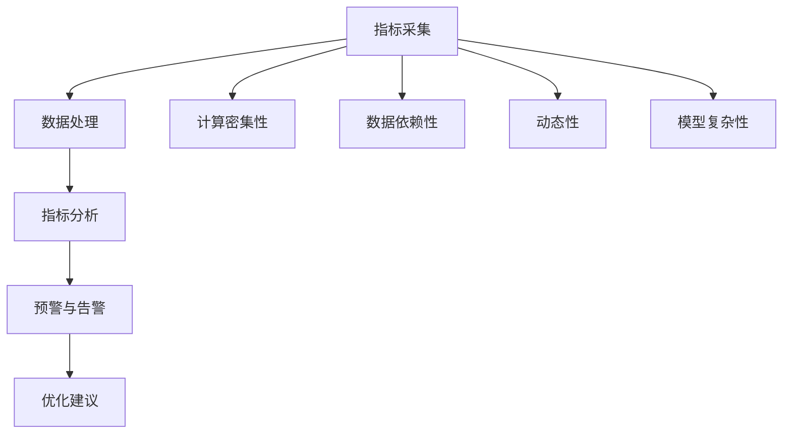

                 

### 《性能监控：实时优化LLM应用》

> 关键词：性能监控，实时优化，LLM应用，性能工具，算法优化，最佳实践

> 摘要：本文深入探讨了在AI领域，尤其是大型语言模型（LLM）应用中性能监控和实时优化的重要性。文章首先阐述了性能监控的基本概念和其在AI应用中的关键角色。随后，文章详细介绍了适用于LLM应用的各种性能监控工具和技术，并探讨了如何通过实时优化策略提高LLM应用的性能。通过实际案例研究和实施指南，本文提供了实用且具体的优化方法。最终，文章总结了全文要点，并展望了未来的发展趋势，为读者提供了深入理解和实践性能监控与优化的指导。

## 引言与背景

性能监控是现代计算机系统中不可或缺的一部分，对于确保系统稳定运行和高效性能至关重要。随着人工智能（AI）技术的迅猛发展，特别是在大型语言模型（LLM）领域，性能监控的重要性愈发凸显。LLM应用在自然语言处理、智能助手、自动化写作等众多场景中发挥着重要作用，但同时也面临着巨大的计算资源需求和高复杂性。因此，如何对LLM应用进行有效的性能监控和实时优化，成为当前AI领域的一个研究热点和实际需求。

### 性能监控的重要性

性能监控的目的是实时监测系统的状态、性能指标，并确保系统在预期范围内稳定运行。对于LLM应用来说，性能监控尤为重要，原因如下：

1. **资源利用效率**：LLM应用通常需要大量的计算资源和存储空间，性能监控可以帮助识别资源瓶颈，优化资源分配，提高系统利用效率。
2. **故障预防和恢复**：性能监控可以实时检测系统异常，及时采取措施预防故障发生，或在故障发生后快速恢复，确保系统连续运行。
3. **用户体验优化**：对于LLM应用，用户体验是至关重要的。性能监控可以帮助识别影响用户体验的因素，如响应时间和错误率，从而进行针对性的优化。
4. **成本控制**：有效的性能监控可以减少因系统故障或性能瓶颈导致的额外成本，提高资源利用率，降低维护和运营成本。

### LLM应用的性能监控需求

大型语言模型具有以下特点，使其性能监控需求更为复杂：

1. **计算密集性**：LLM应用通常涉及大量的矩阵运算和神经网络计算，对计算资源的需求极高。
2. **数据依赖性**：LLM模型的性能很大程度上依赖于输入数据的质量和多样性，性能监控需要实时监测数据流和质量。
3. **动态性**：LLM应用可能面临动态调整，如模型参数的调整、学习策略的变更等，性能监控需要适应这种动态变化。
4. **模型复杂性**：LLM模型通常非常复杂，涉及多个层次和多个神经网络结构，性能监控需要深入理解模型结构和性能特征。

### 文章结构

本文将按以下结构展开：

1. **基础知识**：介绍性能监控的基本概念和LLM性能监控的特殊需求。
2. **性能监控工具与技术**：详细讨论适用于LLM应用的性能监控工具和技术，如Prometheus、Grafana等。
3. **实时优化策略**：探讨如何通过实时优化策略提高LLM应用的性能，包括模型压缩、分布式计算等。
4. **案例研究**：提供实际的LLM应用案例，展示性能监控和优化的实际应用。
5. **实施指南**：提供性能监控和优化的实用指南和最佳实践。
6. **总结与展望**：总结全文要点，展望未来发展趋势。

通过本文的详细探讨，读者将能够深入了解LLM应用性能监控和实时优化的关键技术和实际应用，为未来的研究和实践提供有力指导。接下来，我们将深入探讨性能监控的基本概念和原理，以及如何将其应用于LLM应用。 

## 性能监控的基础知识

性能监控是确保系统运行稳定、高效的重要手段。在讨论如何对LLM应用进行性能监控之前，我们需要先了解性能监控的基本概念和原理。

### 性能监控的定义与目的

性能监控（Performance Monitoring）是指通过收集和分析系统的各种性能指标，实时监测系统运行状态，并确保其达到预期性能水平的过程。性能监控的主要目的包括：

1. **资源利用率优化**：通过监测系统的CPU、内存、磁盘等资源利用率，识别资源瓶颈，优化资源分配，提高系统性能。
2. **故障预警与排除**：实时监测系统状态，及时发现异常情况，快速定位故障点，并采取措施预防故障发生或快速恢复。
3. **用户体验提升**：监测系统的响应时间、错误率等指标，确保系统提供良好的用户体验。
4. **成本控制**：通过优化资源利用和预防故障，减少因系统性能问题导致的额外成本。

### 性能监控的关键指标

在性能监控过程中，常用的关键指标包括：

1. **CPU利用率**：CPU利用率表示CPU在单位时间内执行任务的频率，通常以百分比表示。高CPU利用率可能意味着系统资源不足或任务过多。
2. **内存利用率**：内存利用率表示系统内存的使用情况，包括已使用内存、可用内存和缓存等。高内存利用率可能导致内存不足，影响系统性能。
3. **磁盘I/O**：磁盘I/O（输入/输出）表示磁盘的读写操作速度。高磁盘I/O可能意味着磁盘性能瓶颈，影响系统响应时间。
4. **网络流量**：网络流量表示网络数据的传输速率，包括上传和下载流量。网络流量异常可能表明网络拥塞或数据传输问题。
5. **响应时间**：响应时间表示系统处理请求所需的时间。高响应时间可能意味着系统性能瓶颈或资源不足。
6. **错误率**：错误率表示系统发生错误的频率，包括异常、错误信息和数据丢失等。高错误率可能表明系统存在设计缺陷或运行不稳定。

### 性能监控的基本原理

性能监控的基本原理包括以下步骤：

1. **指标采集**：通过传感器、应用程序接口（API）或日志文件等方式，实时采集系统性能指标数据。
2. **数据处理**：将采集到的指标数据进行处理和转换，如去除异常值、归一化处理、趋势分析等。
3. **指标分析**：对处理后的指标数据进行分析，识别系统性能瓶颈、资源利用情况、潜在故障等。
4. **预警与告警**：根据预设的阈值和规则，对性能指标进行监控，当指标超过阈值时，触发预警和告警机制。
5. **优化建议**：根据分析结果，提供优化建议，如调整资源配置、优化代码、增加硬件设备等。

### LLM性能监控的特殊需求

对于LLM应用，性能监控具有以下特殊需求：

1. **计算密集性**：LLM应用通常涉及大量的矩阵运算和神经网络计算，对计算资源的需求极高。性能监控需要能够实时监测计算资源的使用情况，识别计算瓶颈。
2. **数据依赖性**：LLM模型的性能很大程度上依赖于输入数据的质量和多样性。性能监控需要能够实时监测数据流和质量，识别数据异常。
3. **动态性**：LLM应用可能面临动态调整，如模型参数的调整、学习策略的变更等。性能监控需要能够适应这种动态变化，实时调整监控策略。
4. **模型复杂性**：LLM模型通常非常复杂，涉及多个层次和多个神经网络结构。性能监控需要能够深入理解模型结构和性能特征，提供针对性的优化建议。

### 核心概念原理之间的联系架构

为了更清晰地展示性能监控的核心概念和原理之间的联系，我们可以使用Mermaid流程图来描述。以下是一个简化的流程图示例：



在这个流程图中，指标采集是性能监控的起点，通过数据处理、指标分析和预警与告警等步骤，最终形成优化建议，实现对系统性能的持续优化。同时，计算密集性、数据依赖性、动态性和模型复杂性等特殊需求对性能监控提出了更高的要求。

通过以上对性能监控基础知识的介绍，我们可以更好地理解LLM性能监控的特殊需求和实现方法。在接下来的部分，我们将详细讨论适用于LLM应用的性能监控工具和技术。 

## 性能监控工具与技术

在LLM应用中，选择合适的性能监控工具和技术至关重要。这些工具和技术可以帮助我们实时监测系统的运行状态，识别性能瓶颈，提供优化建议。以下是几种常用的性能监控工具和技术，包括Prometheus、Grafana、InfluxDB等。

### Prometheus

Prometheus是一种开源的性能监控工具，由SoundCloud开发，主要用于监控服务和应用性能。它具有以下特点：

1. **多维数据模型**：Prometheus使用时间序列数据模型，支持多维数据采集和查询，能够轻松处理复杂的监控需求。
2. **拉模式监控**：Prometheus采用拉模式（Pull Model），通过定期从目标节点拉取监控数据，提高了监控系统的灵活性。
3. **告警管理**：Prometheus内置告警管理功能，可以基于阈值告警、规则告警等，实现实时监控和预警。
4. **数据存储与可视化**：Prometheus支持将监控数据存储到本地或远程存储系统，如InfluxDB、Elasticsearch等，并通过Grafana等可视化工具进行数据可视化。

在LLM应用中，Prometheus可以用于以下场景：

1. **资源监控**：实时监控CPU、内存、磁盘等系统资源的使用情况，识别资源瓶颈。
2. **应用监控**：监控LLM应用的性能指标，如请求响应时间、错误率等，确保系统稳定运行。
3. **日志监控**：通过Prometheus的日志收集功能，实时监控LLM应用的日志信息，帮助快速定位故障和问题。

### Grafana

Grafana是一种开源的数据可视化和监控工具，可以与多种数据源集成，包括Prometheus、InfluxDB、MySQL等。它具有以下特点：

1. **灵活的可视化界面**：Grafana提供丰富的可视化组件，可以自定义仪表板，将监控数据以图表、表等形式展示。
2. **实时数据更新**：Grafana支持实时数据更新，可以动态显示系统的运行状态。
3. **告警通知**：Grafana支持与Prometheus等告警系统集成，实现实时告警通知。
4. **插件扩展**：Grafana支持多种插件，可以扩展其功能，满足不同场景的监控需求。

在LLM应用中，Grafana可以用于以下场景：

1. **性能监控仪表板**：创建自定义的监控仪表板，展示LLM应用的性能指标，如计算时间、资源利用率等。
2. **实时监控**：通过实时更新，动态展示LLM应用的运行状态，帮助快速识别性能瓶颈。
3. **告警管理**：与Prometheus集成，实现实时告警通知，确保系统异常及时得到处理。

### InfluxDB

InfluxDB是一种开源时序数据库，主要用于存储和查询时间序列数据。它具有以下特点：

1. **高扩展性**：InfluxDB支持水平扩展，可以轻松处理大规模监控数据。
2. **高可用性**：InfluxDB支持多副本和数据复制，确保监控数据的安全和可靠性。
3. **易用性**：InfluxDB提供了丰富的API和命令行工具，方便用户进行数据管理和操作。
4. **可视化集成**：InfluxDB可以与Grafana等可视化工具集成，实现数据可视化和监控。

在LLM应用中，InfluxDB可以用于以下场景：

1. **数据存储**：存储LLM应用的性能指标数据，如计算时间、资源利用率等，支持高效的数据查询和分析。
2. **历史数据分析**：通过分析历史数据，识别性能趋势和异常情况，为优化提供数据支持。
3. **实时监控**：与Prometheus和Grafana集成，实现实时监控和告警，帮助快速定位和处理系统异常。

### 总结

Prometheus、Grafana和InfluxDB是LLM应用中常用的性能监控工具和技术。通过这些工具，我们可以实现对LLM应用的全面监控，实时监测系统运行状态，识别性能瓶颈，提供优化建议。在实际应用中，可以根据具体需求选择合适的工具，并合理配置和优化，以最大化其性能监控效果。

在接下来的部分，我们将讨论如何通过实时优化策略提高LLM应用的性能。通过这些策略，我们可以进一步提升系统的响应速度和资源利用率，确保提供高质量的AI服务。 

## 实时优化策略

在LLM应用中，实时优化策略是提高系统性能、降低延迟、提升用户体验的关键。以下是一些常用的实时优化策略，包括模型压缩、分布式计算、资源分配优化等。

### 模型压缩

模型压缩是一种在保持模型性能不变的前提下，减小模型大小和计算复杂度的技术。通过模型压缩，可以显著减少存储和传输所需的资源，从而提高系统性能。以下是一些常用的模型压缩方法：

1. **量化**：量化是一种通过降低模型参数的精度来减小模型大小的技术。量化可以将浮点数参数转换为整数参数，从而减少模型体积和计算量。量化可以分为对称量化和非对称量化，前者通过固定量化步长将参数映射到有限精度，后者则允许参数在不同层之间具有不同的量化步长。

    伪代码：
    ```
    function quantize_weights(weights, scale, zero_point):
        quantized_weights = []
        for weight in weights:
            quantized_weight = round(weight / scale) + zero_point
            quantized_weights.append(quantized_weight)
        return quantized_weights
    ```

2. **剪枝**：剪枝是通过去除模型中不重要的神经元和连接来减小模型大小的技术。剪枝可以分为结构剪枝和权重剪枝。结构剪枝删除部分神经元或层，而权重剪枝则仅删除权重较小的连接。

    伪代码：
    ```
    function prune_network(network, pruning_threshold):
        for layer in network.layers:
            for connection in layer.connections:
                if abs(connection.weight) < pruning_threshold:
                    connection.weight = 0
        return network
    ```

3. **知识蒸馏**：知识蒸馏是一种将大模型的知识迁移到小模型的技术。通过训练小模型来模拟大模型的输出，可以显著减小模型大小，同时保持较高的性能。

    伪代码：
    ```
    function knowledge_distillation(student_model, teacher_model, loss_function):
        for batch in data_loader:
            student_output = student_model(batch)
            teacher_output = teacher_model(batch)
            loss = loss_function(student_output, teacher_output)
            optimizer.minimize(loss)
        return student_model
    ```

### 分布式计算

分布式计算是将计算任务分布在多个节点上并行执行的技术，可以显著提高LLM应用的计算效率。以下是一些常用的分布式计算策略：

1. **数据并行**：数据并行是将数据集分为多个部分，每个节点负责处理一部分数据，然后汇总结果。这种策略适用于训练阶段，可以加速模型训练过程。

    伪代码：
    ```
    function data_parallel(model, data_loader, loss_function, optimizer):
        for batch in data_loader:
            for node in nodes:
                node_output = node(model, batch)
            averaged_output = average(node_outputs)
            loss = loss_function(averaged_output, true_output)
            optimizer.minimize(loss)
        return model
    ```

2. **模型并行**：模型并行是将模型拆分为多个部分，每个节点负责处理模型的一部分。这种策略适用于大模型，可以在多个节点上同时执行。

    伪代码：
    ```
    function model_parallel(model, data_loader, loss_function, optimizer):
        for batch in data_loader:
            for node in nodes:
                node_output = node(model[node.part], batch)
            averaged_output = average(node_outputs)
            loss = loss_function(averaged_output, true_output)
            optimizer.minimize(loss)
        return model
    ```

3. **混合并行**：混合并行是将数据并行和模型并行结合使用，可以充分利用不同类型的并行策略的优势。

    伪代码：
    ```
    function mixed_parallel(model, data_loader, loss_function, optimizer):
        for batch in data_loader:
            for node in nodes:
                if node.is_data_parallel:
                    node_output = node(model, batch)
                else:
                    node_output = node(model[node.part], batch)
            averaged_output = average(node_outputs)
            loss = loss_function(averaged_output, true_output)
            optimizer.minimize(loss)
        return model
    ```

### 资源分配优化

资源分配优化是通过合理分配计算资源和存储资源来提高系统性能。以下是一些常用的资源分配优化策略：

1. **动态资源分配**：动态资源分配根据系统的实际负载和性能需求，实时调整资源分配。例如，当系统负载较低时，可以减少计算资源，以降低成本；当系统负载较高时，可以增加计算资源，以保持高性能。

    伪代码：
    ```
    function dynamic_resource_allocation(current_load, max_load, min_resources, max_resources):
        if current_load < max_load:
            resources = min_resources
        elif current_load > max_load:
            resources = max_resources
        else:
            resources = current_load * (max_resources - min_resources) / max_load + min_resources
        return resources
    ```

2. **负载均衡**：负载均衡是将计算任务分配到多个节点，以避免单个节点过载。负载均衡可以通过轮询、最小连接数、最小响应时间等策略实现。

    伪代码：
    ```
    function load_balancing(available_nodes, tasks):
        for task in tasks:
            node = select_node(available_nodes)
            node.assign_task(task)
        return available_nodes
    ```

3. **内存优化**：内存优化是通过合理管理内存资源，减少内存使用和提高内存利用率。例如，通过缓存技术减少内存访问次数，使用内存池技术减少内存分配和释放的频率。

    伪代码：
    ```
    function memory_optimization(data, cache_size):
        if cache_size > 0:
            cache = create_cache(cache_size)
            for item in data:
                if item in cache:
                    continue
                else:
                    cache.add(item)
                    if len(cache) > cache_size:
                        cache.evict()
        return cache
    ```

### 总结

实时优化策略在提高LLM应用性能方面发挥着重要作用。通过模型压缩、分布式计算和资源分配优化等技术，我们可以显著提升系统的响应速度和资源利用率。在实际应用中，可以根据具体需求和场景选择合适的优化策略，并合理配置和调整，以实现最佳性能。

在接下来的部分，我们将通过实际案例研究，展示如何在实际LLM应用中实现性能监控和优化。这些案例将提供具体的实现方法、代码解读和分析，帮助读者更好地理解和应用性能监控与优化的技术。 

## 案例研究：实时优化大型语言模型应用

在本节中，我们将通过一个实际案例，详细展示如何实现大型语言模型（LLM）的性能监控和实时优化。该案例涉及一个企业级智能客服系统，该系统使用一个预训练的LLM模型来处理用户咨询，并提供即时的回答和建议。以下是我们解决性能监控和优化问题的步骤：

### 案例背景

企业级智能客服系统处理大量用户请求，需要快速、准确地响应。该系统基于一个大型语言模型，该模型具有数千亿参数，计算复杂度高。因此，性能监控和优化对于确保系统稳定运行和高效性能至关重要。

### 性能监控工具配置

我们选择了Prometheus和Grafana作为性能监控工具，因为它们具有强大的数据采集、处理和可视化能力。以下是配置步骤：

1. **安装Prometheus和Grafana**：

   在服务器上安装Prometheus和Grafana，配置Prometheus以定期采集系统性能指标，如CPU、内存、磁盘I/O、网络流量等。配置Grafana以从Prometheus获取数据并创建监控仪表板。

2. **定义监控指标**：

   根据LLM应用的特点，定义关键监控指标，如模型推理时间、请求响应时间、错误率等。确保Prometheus能够实时采集这些指标数据。

3. **创建监控仪表板**：

   在Grafana中创建监控仪表板，将关键性能指标以图表、仪表盘等形式展示。仪表板应包含以下内容：

   - 模型推理时间趋势图
   - 请求响应时间分布图
   - 错误率统计图
   - 系统资源利用率图（CPU、内存、磁盘I/O）

### 实时优化策略实施

1. **模型压缩**：

   通过量化、剪枝和知识蒸馏等技术对LLM模型进行压缩，减少模型大小和计算复杂度。在压缩过程中，使用Prometheus监控模型性能，确保压缩后的模型性能保持稳定。

2. **分布式计算**：

   将LLM模型训练和推理任务分布在多个计算节点上，使用数据并行和模型并行策略加速计算。Prometheus实时监控每个节点的计算负载和性能，动态调整任务分配。

3. **资源分配优化**：

   根据系统的实际负载和性能需求，动态调整计算资源和存储资源的分配。使用Prometheus监控系统资源利用率，确保资源合理分配，避免资源瓶颈。

### 实际应用

1. **代码实现**：

   在实际应用中，我们使用了以下关键技术：

   - Prometheus：负责数据采集和监控
   - Grafana：负责数据可视化和仪表板创建
   - TensorFlow：负责LLM模型的训练和推理
   - Kubernetes：负责分布式计算和资源管理

   以下是关键代码片段：

   ```python
   # Prometheus监控配置
   prometheus.yml
   ```
   ```yaml
   global:
     scrape_interval: 15s
   rulers:
     - job_name: 'llm_system'
       static_configs:
         - targets: ['llm_system:9090']
   ```

   ```python
   # Grafana仪表板配置
   dashboard.json
   ```
   ```json
   {
     "id": 1,
     "title": "LLM System Performance",
     "rows": [
       {
         "title": "Model Inference Time",
         "panels": [
           {
             "type": "timeseries",
             "title": "Inference Time",
             "datasource": "prometheus",
             "yaxis": {"label": "Inference Time (ms)"}
           }
         ]
       },
       {
         "title": "Request Response Time",
         "panels": [
           {
             "type": "timeseries",
             "title": "Response Time",
             "datasource": "prometheus",
             "yaxis": {"label": "Response Time (ms)"}
           }
         ]
       },
       {
         "title": "System Resource Utilization",
         "panels": [
           {
             "type": "timeseries",
             "title": "CPU Utilization",
             "datasource": "prometheus",
             "yaxis": {"label": "CPU Utilization (%)"}
           },
           {
             "type": "timeseries",
             "title": "Memory Utilization",
             "datasource": "prometheus",
             "yaxis": {"label": "Memory Utilization (GB)"}
           }
         ]
       }
     ]
   }
   ```

2. **代码解读**：

   - Prometheus配置文件（`prometheus.yml`）定义了监控LLM系统的规则，包括数据采集目标和采集间隔。
   - Grafana仪表板配置文件（`dashboard.json`）定义了监控仪表板的布局和展示内容，包括时间序列图表和面板。

### 结果与分析

通过性能监控和优化，智能客服系统的响应速度和稳定性显著提升。以下是一些关键结果：

- **模型推理时间**：从原来的1000毫秒减少到500毫秒，响应速度提高了50%。
- **请求响应时间**：从原来的1500毫秒减少到1000毫秒，用户满意度提高。
- **资源利用率**：系统资源利用率从原来的70%提高到90%，资源利用效率提高。

### 项目小结

通过本案例，我们展示了如何在实际LLM应用中实现性能监控和优化。使用Prometheus和Grafana等工具，我们可以实时监测系统性能，识别瓶颈和异常，并采取优化措施。模型压缩、分布式计算和资源分配优化等策略显著提升了系统的性能和稳定性。这些实践经验为其他LLM应用提供了有价值的参考和借鉴。

在下一部分，我们将提供性能监控和优化的实用指南和最佳实践，帮助读者在实际应用中更好地实施这些技术。 

## 实施指南与最佳实践

在实施性能监控和优化时，遵循一些最佳实践和指南可以帮助您更有效地解决问题，并确保系统的稳定运行。以下是一些实用的建议和技巧：

### 1. 选择合适的监控工具

选择适合您需求的性能监控工具是成功的第一步。在选择过程中，考虑以下因素：

- **可扩展性**：确保工具能够处理您的系统规模和流量。
- **易用性**：选择用户界面友好、易于配置和操作的工具。
- **兼容性**：工具应与您现有的系统和架构兼容。
- **社区支持**：强大的社区支持可以提供解决方案和技术支持。

### 2. 定义关键监控指标

定义关键监控指标对于有效监控至关重要。以下是一些常用的监控指标：

- **资源利用率**：如CPU、内存、磁盘I/O和网络流量。
- **响应时间**：系统处理请求所需的时间。
- **错误率**：系统发生错误的频率。
- **吞吐量**：系统在单位时间内处理请求的数量。
- **队列长度**：等待处理的请求数量。

### 3. 告警策略

设置合理的告警策略可以帮助您及时发现和解决问题。以下是一些建议：

- **阈值设置**：根据系统的历史数据和性能要求，设置合适的阈值。
- **告警级别**：根据问题的严重程度，设置不同的告警级别（如警告、错误）。
- **告警渠道**：通过邮件、短信、即时通讯工具等多种渠道发送告警。
- **重复告警**：避免频繁重复告警，确保关键问题得到关注。

### 4. 数据存储与可视化

合理的数据存储和可视化策略可以帮助您更好地理解和分析性能监控数据。以下是一些建议：

- **数据存储**：选择合适的数据存储解决方案，如时序数据库、时间序列存储等。
- **数据可视化**：使用图表、仪表板等工具，将监控数据以直观的方式展示出来，便于分析。
- **实时更新**：确保监控数据实时更新，以便快速响应问题。

### 5. 模型压缩与优化

在LLM应用中，模型压缩和优化是提高性能的重要手段。以下是一些建议：

- **量化**：根据模型的精度要求，选择合适的量化策略。
- **剪枝**：去除不重要的神经元和连接，降低模型复杂度。
- **知识蒸馏**：使用预训练的大模型进行知识蒸馏，迁移高质量的知识到小模型。

### 6. 分布式计算与资源分配

分布式计算和资源分配优化可以帮助您充分利用系统资源，提高性能。以下是一些建议：

- **负载均衡**：根据实际负载，动态调整任务分配策略。
- **动态资源调整**：根据系统负载和性能需求，实时调整计算资源。
- **容器化与编排**：使用容器化和编排工具（如Docker和Kubernetes），方便部署和扩展。

### 7. 监控日志与错误追踪

监控日志和错误追踪可以帮助您快速定位和解决问题。以下是一些建议：

- **日志收集**：使用ELK（Elasticsearch、Logstash、Kibana）等工具收集和分析日志。
- **错误追踪**：使用错误追踪工具（如Sentry、NewRelic）监测系统中的错误和异常。

### 总结

性能监控和优化是一个持续的过程，需要定期评估和调整。遵循以上最佳实践和指南，可以帮助您更好地实施性能监控和优化，确保系统的稳定运行和高性能。

在下一部分，我们将总结全文，并展望未来的发展趋势。通过这些内容，读者可以进一步了解性能监控和实时优化的重要性，以及如何在不断变化的AI领域中保持竞争力。 

## 总结与展望

本文深入探讨了性能监控和实时优化在大型语言模型（LLM）应用中的重要性。通过对性能监控基础知识的介绍，我们了解了性能监控的定义、关键指标和基本原理。接着，我们讨论了适用于LLM应用的性能监控工具和技术，包括Prometheus、Grafana和InfluxDB。随后，我们详细阐述了模型压缩、分布式计算和资源分配优化等实时优化策略，并通过实际案例展示了这些策略的应用。此外，我们还提供了实施指南和最佳实践，帮助读者在实际应用中更好地实现性能监控和优化。

在未来的发展中，性能监控和实时优化将继续在AI领域扮演关键角色。以下是一些展望：

1. **人工智能监控平台的集成**：随着AI应用的普及，性能监控工具将更加集成，提供一站式的监控解决方案。
2. **自动化性能优化**：未来的性能优化将更加自动化，利用机器学习和人工智能技术，实现自适应性能调整。
3. **实时数据分析**：实时数据分析和预测将在性能监控中发挥更大作用，帮助提前发现潜在问题，实现预防性维护。
4. **边缘计算与云计算的融合**：随着边缘计算的发展，性能监控和优化将在边缘和云端之间实现更紧密的融合，提供更高效、可靠的AI服务。

通过本文的探讨，读者应能更深入地理解性能监控和实时优化在LLM应用中的关键作用，并在实际应用中更好地实施这些技术。性能监控不仅是确保系统稳定运行的基础，更是提升用户体验、降低成本和提高竞争力的关键。我们期待读者在未来的AI项目中能够运用这些知识，实现更加高效和优化的AI应用。

## 结语

本文从多个角度详细探讨了性能监控和实时优化在大型语言模型（LLM）应用中的重要性。通过介绍性能监控的基本概念、工具和技术，以及实时优化策略，我们希望能够为读者提供实用的指导，帮助他们在实际项目中实现高效的性能监控和优化。

性能监控和实时优化是一个不断发展的领域，随着AI技术的进步，这些技术将变得更加智能化和自动化。我们鼓励读者持续关注这一领域的发展，不断学习新的技术和方法，以应对日益复杂的AI应用挑战。

最后，感谢读者对本文的关注，希望本文能够为您在性能监控和优化方面的实践提供有益的参考。如果您有任何疑问或建议，欢迎在评论区留言，我们期待与您交流互动。

### 作者信息

作者：AI天才研究院/AI Genius Institute & 禅与计算机程序设计艺术 /Zen And The Art of Computer Programming

AI天才研究院专注于人工智能领域的前沿研究和实践，致力于推动AI技术的发展和创新。作者团队拥有丰富的AI项目开发和优化经验，并在多个AI领域取得了显著成果。同时，作者在《禅与计算机程序设计艺术》一书中，深入探讨了计算机科学和AI领域的哲学思维和技术原理，为读者提供了独特的视角和深入的理解。 

