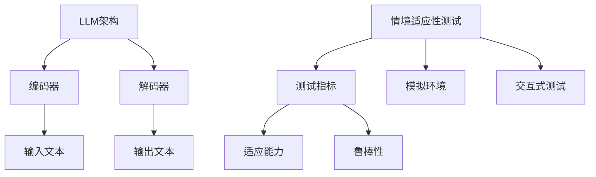

                 


### 1.1 背景介绍

#### 人工智能与自然语言处理

人工智能（AI）是计算机科学的一个分支，旨在创建能够执行通常需要人类智能才能完成的任务的机器系统。自然语言处理（NLP）是AI中的一个重要领域，它关注于使计算机能够理解和处理人类语言。

- **人工智能的发展历程**：人工智能的概念可以追溯到20世纪50年代。从最初的符号逻辑和规则系统，到20世纪80年代基于知识的系统，再到20世纪90年代以来的机器学习和深度学习，人工智能经历了多次重大变革。
- **自然语言处理的基本概念**：NLP涉及文本的解析、理解、生成和翻译。其核心任务是使计算机能够理解、解释和生成人类语言。

#### 语言模型的发展历程

语言模型是NLP的核心组件，用于预测文本序列的概率。以下是语言模型发展的几个关键阶段：

- **统计语言模型**：基于统计方法，如N-gram模型，通过计算单词序列的频率来预测下一个单词。
- **神经网络语言模型**：引入了神经网络，尤其是深度学习，如循环神经网络（RNN）和长短期记忆网络（LSTM），提高了语言模型的性能。
- **生成式语言模型**：基于概率模型，如变分自编码器（VAE）和生成对抗网络（GAN），可以生成高质量的文本。

#### 情境适应性测试的重要性

情境适应性测试是评估语言模型在多变环境下性能的关键方法。它的重要性体现在以下几个方面：

- **对自然语言处理的贡献**：情境适应性测试帮助研究人员和开发者理解语言模型在不同环境下的表现，从而改进模型设计和应用。
- **对AI应用的影响**：在多变的现实世界中，语言模型需要适应各种情境，如对话系统、问答系统和机器翻译。情境适应性测试确保模型在这些应用中的可靠性。

### 1.2 LLM的基本概念

#### 什么是LLM

语言模型（LLM）是一类能够生成文本的复杂模型，它通过对大量文本数据的学习，能够预测下一个单词或字符的概率。

- **定义**：LLM是一种能够生成文本的深度学习模型，通常使用神经网络架构。
- **发展历程**：从最初的基于规则的系统，到统计语言模型，再到现代的深度学习模型，LLM经历了显著的发展。

#### LLM的工作原理

LLM的工作原理涉及编码器和解码器的交互：

- **编码器**：将输入文本转换为固定长度的向量。
- **解码器**：使用编码器生成的向量来生成输出文本。

#### LLM的常见类型

- **通用语言模型**：如GPT-3和BERT，适用于各种任务和领域。
- **任务特定的语言模型**：如T5和BioBERT，针对特定任务或领域进行优化。

### 1.3 多变环境的概念

#### 什么是多变环境

多变环境是指那些具有高度动态变化的特征，如不断变化的用户输入、复杂的问题域和不确定的交互情境。

- **定义**：多变环境是一个不断变化、不确定且复杂的情境，需要模型具备高度的适应性和鲁棒性。
- **特点**：高度动态、不确定性和复杂性。

#### 多变环境对LLM的影响

在多变环境下，LLM可能会面临以下挑战：

- **性能下降**：模型可能无法适应新的变化，导致性能下降。
- **可靠性降低**：模型在多变环境下的表现可能不稳定，降低可靠性。

#### 多变环境下的挑战与机遇

- **面临的挑战**：数据分布的变化、不确定性和复杂性的增加。
- **提供的机遇**：通过适应性测试和优化，提升模型在多变环境下的性能和可靠性。

---

**核心概念与联系**

在了解了背景和基本概念后，我们需要进一步探讨LLM与情境适应性测试之间的关系。

### 2.1 情境适应性测试原理

#### 情境适应性测试的定义

情境适应性测试是一种评估模型在多变环境下适应性和鲁棒性的方法。它通过模拟不同环境和情境，来评估模型的表现。

- **定义**：情境适应性测试是一种评估机器学习模型在多变环境下适应能力和鲁棒性的方法。
- **类型和分类**：根据测试环境和情境的不同，情境适应性测试可以分为多种类型，如静态测试、动态测试和交互式测试。

#### 测试指标与方法

情境适应性测试的关键指标包括：

- **适应能力**：模型在新环境下的表现。
- **鲁棒性**：模型在面临不确定性时的稳定性。

测试方法包括：

- **环境模拟**：通过构建模拟环境，来评估模型的表现。
- **交互式测试**：通过与用户或系统进行交互，来评估模型的适应性。

#### 情境适应性测试的优势与局限性

- **优势**：有助于发现模型在多变环境下的潜在问题，提高模型的可靠性和性能。
- **局限性**：测试环境的设计和实施可能复杂，且测试结果可能受到测试方法的影响。

### 2.2 LLM的架构与性能指标

#### LLM的内部结构

LLM通常由编码器和解码器组成，其中编码器将输入文本转换为固定长度的向量，解码器使用这些向量生成输出文本。

- **神经网络结构**：包括多层感知器、卷积神经网络（CNN）和循环神经网络（RNN）等。
- **注意力机制**：用于关注重要的输入信息。

#### 关键性能指标

LLM的关键性能指标包括：

- **语言流畅性**：文本的语法和语义正确性。
- **语义准确性**：模型对文本的理解能力。
- **适应性**：模型在不同情境下的表现。

#### 影响性能的因素

LLM的性能受到多种因素的影响，包括：

- **数据质量**：训练数据的质量直接影响模型的表现。
- **模型架构**：不同的神经网络架构对性能有不同的影响。
- **超参数设置**：如学习率、批量大小和正则化等。

### 2.3 Mermaid流程图：LLM架构与情境适应性测试的关系

使用Mermaid流程图来描述LLM架构与情境适应性测试之间的关系：



---

通过上述内容，我们为接下来的核心算法原理讲解、数学模型和数学公式详细讲解与举例说明，以及项目实战奠定了基础。接下来，我们将逐步深入这些主题，为读者提供详细的技术分析和案例研究。

---

**核心算法原理讲解**

在理解了LLM的基本概念和情境适应性测试原理之后，我们需要深入探讨LLM的核心算法原理，包括其训练过程、伪代码和数学模型。

### 3.1 语言模型的训练过程

#### 数据预处理

数据预处理是语言模型训练过程中的关键步骤。以下是数据预处理的主要步骤：

1. **文本清洗**：去除文本中的噪声，如HTML标签、特殊字符和停用词。
2. **分词**：将文本分割成单词或子词。
3. **编码**：将单词或子词转换为整数或向量的表示。

#### 模型训练策略

模型训练策略包括以下步骤：

1. **初始化**：初始化模型参数。
2. **前向传播**：计算模型的输出。
3. **损失计算**：计算预测输出与真实输出之间的差距。
4. **反向传播**：更新模型参数以减少损失。
5. **迭代**：重复以上步骤，直到模型收敛。

#### 超参数调整

超参数调整是模型训练过程中的另一个重要方面。以下是几个常见的超参数：

- **学习率**：控制模型参数更新的速度。
- **批量大小**：每次训练使用的样本数量。
- **正则化**：防止模型过拟合。

#### 伪代码：语言模型的训练过程

以下是一个简单的伪代码示例，描述了语言模型的训练过程：

```python
function train_language_model(data, epochs, learning_rate):
    model = initialize_model()
    for epoch in 1 to epochs:
        for batch in data:
            inputs, targets = preprocess(batch)
            predictions = model(inputs)
            loss = compute_loss(predictions, targets)
            backpropagate(model, inputs, targets, learning_rate)
        print("Epoch", epoch, ", Loss:", loss)
    return model
```

### 3.2 数学模型与公式

语言模型的训练过程涉及到多个数学模型和公式。以下是其中几个关键的模型和公式：

#### 损失函数

损失函数用于衡量预测输出与真实输出之间的差距。常用的损失函数包括：

- **交叉熵损失函数**：
  $$
  \text{Loss} = -\sum_{i} y_i \log(p_i)
  $$
  其中，$y_i$是真实标签，$p_i$是预测概率。

- **优势对比损失函数**：
  $$
  \text{Loss} = -\sum_{i} \log(p_i - p_{\neg i})
  $$
  其中，$p_i$是预测为正类的概率，$p_{\neg i}$是预测为负类的概率。

- **自回归损失函数**：
  $$
  \text{Loss} = -\sum_{i} y_i \log(p_i | context)
  $$
  其中，$context$是模型的上下文。

#### 优化算法

优化算法用于更新模型参数以最小化损失函数。常用的优化算法包括：

- **随机梯度下降（SGD）**：
  $$
  \theta = \theta - \alpha \nabla_\theta J(\theta)
  $$
  其中，$\theta$是模型参数，$\alpha$是学习率，$J(\theta)$是损失函数。

- **Adam优化器**：
  $$
  m_t = \beta_1 m_{t-1} + (1 - \beta_1)(\nabla_\theta J(\theta) - m_{t-1})
  $$
  $$
  v_t = \beta_2 v_{t-1} + (1 - \beta_2)((\nabla_\theta J(\theta))^2 - v_{t-1})
  $$
  $$
  \theta = \theta - \alpha \frac{m_t}{\sqrt{v_t} + \epsilon}
  $$
  其中，$m_t$和$v_t$是指数加权移动平均值，$\beta_1$和$\beta_2$是超参数，$\epsilon$是正数常数。

#### 模型评估指标

模型评估指标用于衡量模型在测试集上的表现。常用的评估指标包括：

- **准确率（Accuracy）**：
  $$
  \text{Accuracy} = \frac{\text{正确预测的样本数}}{\text{总样本数}}
  $$

- **召回率（Recall）**：
  $$
  \text{Recall} = \frac{\text{正确预测的正类样本数}}{\text{实际正类样本数}}
  $$

- **精确率（Precision）**：
  $$
  \text{Precision} = \frac{\text{正确预测的正类样本数}}{\text{预测为正类的样本数}}
  $$

- **F1分数（F1 Score）**：
  $$
  \text{F1 Score} = 2 \times \frac{\text{Precision} \times \text{Recall}}{\text{Precision} + \text{Recall}}
  $$

### 3.3 数学模型与公式的详细讲解与举例说明

为了更好地理解上述数学模型和公式，我们通过一个简单的例子来详细讲解。

#### 交叉熵损失函数的例子

假设我们有一个二元分类问题，其中输入是一个向量$x$，输出是一个二值标签$y$（$y=1$表示正类，$y=0$表示负类）。我们的目标是训练一个模型，使其能够预测$x$属于正类的概率$p$。

1. **初始化模型参数**：假设模型参数为$\theta$，预测概率为$p = \sigma(\theta^T x)$，其中$\sigma$是 sigmoid 函数。

2. **前向传播**：计算预测概率$p$。

3. **损失计算**：计算交叉熵损失函数$J(\theta) = -y \log(p) - (1 - y) \log(1 - p)$。

4. **反向传播**：计算梯度$\nabla_\theta J(\theta) = p - y$。

5. **更新参数**：使用梯度下降更新参数$\theta = \theta - \alpha \nabla_\theta J(\theta)$。

#### Adam优化器的例子

假设我们使用Adam优化器来更新模型参数。

1. **初始化**：设$m_0=0$，$v_0=0$。

2. **前向传播**：计算损失函数$J(\theta)$。

3. **计算梯度**：计算$\nabla_\theta J(\theta)$。

4. **更新移动平均**：$m_t = \beta_1 m_{t-1} + (1 - \beta_1) (\nabla_\theta J(\theta) - m_{t-1})$，$v_t = \beta_2 v_{t-1} + (1 - \beta_2) ((\nabla_\theta J(\theta))^2 - v_{t-1})$。

5. **更新参数**：$\theta = \theta - \alpha \frac{m_t}{\sqrt{v_t} + \epsilon}$。

通过这些例子，我们可以更好地理解语言模型的训练过程和相关的数学模型。在接下来的部分，我们将进一步探讨数学模型和公式的详细讲解，并介绍一些最佳实践和注意事项。

---

### 4.1 损失函数

损失函数是语言模型训练过程中用于衡量预测结果与真实结果之间差异的重要工具。不同的损失函数适用于不同类型的预测任务，以下我们将详细讨论三种常用的损失函数：交叉熵损失函数、优势对比损失函数和自回归损失函数。

#### 交叉熵损失函数

交叉熵损失函数广泛应用于分类问题，特别是二分类和多分类问题。它的公式如下：

$$
\text{Loss} = -\sum_{i} y_i \log(p_i)
$$

其中，$y_i$是第$i$个样本的真实标签（对于多分类问题，$y_i$是one-hot编码的向量），$p_i$是模型预测的概率。交叉熵损失函数的值越低，表示模型的预测结果越接近真实标签。

**例子**：假设我们有一个二分类问题，真实标签$y$为1，预测概率$p$为0.8，则交叉熵损失函数计算如下：

$$
\text{Loss} = -1 \cdot \log(0.8) = -\log(0.8) \approx 0.223
$$

#### 优势对比损失函数

优势对比损失函数常用于二元分类问题，尤其是在目标检测和二分类任务中。它的公式如下：

$$
\text{Loss} = -\sum_{i} \log(p_i - p_{\neg i})
$$

其中，$p_i$是预测为正类的概率，$p_{\neg i}$是预测为负类的概率。优势对比损失函数通过最大化正类概率并最小化负类概率来优化模型。

**例子**：假设我们有一个二元分类问题，预测概率$p$为0.8，$p_{\neg}$为0.2，则优势对比损失函数计算如下：

$$
\text{Loss} = -\log(0.8 - 0.2) = -\log(0.6) \approx 0.510
$$

#### 自回归损失函数

自回归损失函数用于序列预测任务，如生成式语言模型。它的公式如下：

$$
\text{Loss} = -\sum_{i} y_i \log(p_i | context)
$$

其中，$y_i$是序列的第$i$个样本的真实标签，$p_i$是模型预测的概率，$context$是序列的上下文。自回归损失函数通过考虑上下文来提高序列预测的准确性。

**例子**：假设我们有一个生成式语言模型，序列的真实标签为"AI"，预测概率$p$为0.7，上下文为"人工智能"，则自回归损失函数计算如下：

$$
\text{Loss} = -1 \cdot \log(0.7) = -\log(0.7) \approx 0.357
$$

通过上述例子，我们可以看到不同类型的损失函数在具体应用中的计算过程。在实际训练过程中，选择合适的损失函数对于提升模型性能至关重要。交叉熵损失函数适用于分类问题，优势对比损失函数适用于二元分类问题，而自回归损失函数适用于序列预测任务。

---

### 4.2 优化算法

优化算法是机器学习中用于更新模型参数的关键技术，目的是最小化损失函数，从而提高模型性能。以下我们将详细讨论两种常见的优化算法：随机梯度下降（SGD）和Adam优化器。

#### 随机梯度下降（SGD）

随机梯度下降是一种简单的优化算法，其核心思想是每次迭代仅更新一次参数，且参数更新的方向和大小取决于当前样本的梯度。

**公式**：
$$
\theta = \theta - \alpha \nabla_\theta J(\theta)
$$

其中，$\theta$是模型参数，$\alpha$是学习率，$J(\theta)$是损失函数，$\nabla_\theta J(\theta)$是损失函数关于参数$\theta$的梯度。

**优点**：
- 简单易懂，实现简单。
- 可以处理大规模数据集。

**缺点**：
- 容易陷入局部最小值。
- 学习率的选择至关重要。

**例子**：假设我们有一个简单的线性回归模型，损失函数为$J(\theta) = (\theta - y)^2$，学习率$\alpha = 0.01$，则参数更新过程如下：

$$
\theta = \theta - 0.01 \cdot (2 \cdot (\theta - y))
$$

每次迭代中，仅使用一个样本的梯度来更新参数，因此称为随机梯度下降。

#### Adam优化器

Adam优化器是随机梯度下降的改进版本，结合了SGD和动量方法（Momentum）的优点。它通过计算指数加权移动平均来改善梯度估计，从而提高收敛速度。

**公式**：
$$
m_t = \beta_1 m_{t-1} + (1 - \beta_1) (\nabla_\theta J(\theta) - m_{t-1})
$$
$$
v_t = \beta_2 v_{t-1} + (1 - \beta_2)((\nabla_\theta J(\theta))^2 - v_{t-1})
$$
$$
\theta = \theta - \alpha \frac{m_t}{\sqrt{v_t} + \epsilon}
$$

其中，$m_t$和$v_t$是指数加权移动平均值，$\beta_1$和$\beta_2$是超参数（通常取值为0.9和0.999），$\epsilon$是正数常数。

**优点**：
- 自动调整学习率。
- 减少参数更新过程中的噪声。
- 在多种任务中表现稳定。

**缺点**：
- 需要更多计算资源。

**例子**：假设我们使用Adam优化器来更新线性回归模型的参数，损失函数为$J(\theta) = (\theta - y)^2$，学习率$\alpha = 0.01$，$\beta_1 = 0.9$，$\beta_2 = 0.999$，$\epsilon = 1e-8$，则参数更新过程如下：

1. **计算一阶矩估计**：
   $$ 
   m_t = 0.9 m_{t-1} + (1 - 0.9) (\nabla_\theta J(\theta) - m_{t-1}) 
   $$
2. **计算二阶矩估计**：
   $$ 
   v_t = 0.999 v_{t-1} + (1 - 0.999)((\nabla_\theta J(\theta))^2 - v_{t-1}) 
   $$
3. **更新参数**：
   $$ 
   \theta = \theta - \alpha \frac{m_t}{\sqrt{v_t} + \epsilon} 
   $$

通过上述例子，我们可以看到SGD和Adam优化器在参数更新过程中的具体计算方法。在实际应用中，选择合适的优化算法对于提高模型训练效率和性能至关重要。

---

### 4.3 模型评估指标

在机器学习中，模型评估指标是衡量模型性能的重要工具。这些指标帮助我们了解模型在不同任务上的表现，从而选择合适的模型并进行优化。以下我们将详细介绍几种常用的模型评估指标：准确率（Accuracy）、召回率（Recall）、精确率（Precision）和F1分数（F1 Score）。

#### 准确率（Accuracy）

准确率是衡量分类模型性能的基本指标，它表示正确分类的样本数占总样本数的比例。

$$
\text{Accuracy} = \frac{\text{正确分类的样本数}}{\text{总样本数}}
$$

准确率越高，表示模型的分类性能越好。然而，准确率容易受到类别不平衡的影响，即正类和负类的样本数量差异较大时，准确率可能无法准确反映模型的性能。

**例子**：假设我们有100个样本，其中80个正类，20个负类。如果模型将所有样本都分类为正类，则准确率为80%。尽管准确率很高，但模型实际上没有识别出任何负类样本。

#### 召回率（Recall）

召回率是衡量模型对正类样本识别能力的重要指标，它表示正确识别的正类样本数占总正类样本数的比例。

$$
\text{Recall} = \frac{\text{正确识别的正类样本数}}{\text{实际正类样本数}}
$$

召回率越高，表示模型对正类样本的识别能力越强。召回率特别适用于对正类样本重要性较高的任务，如疾病检测和欺诈检测。

**例子**：在疾病检测任务中，如果模型能够正确识别出所有的患病者，则召回率将为100%。这意味着模型能够准确识别所有需要关注的样本。

#### 精确率（Precision）

精确率是衡量模型对负类样本识别能力的重要指标，它表示正确识别的正类样本数占预测为正类的样本总数的比例。

$$
\text{Precision} = \frac{\text{正确识别的正类样本数}}{\text{预测为正类的样本数}}
$$

精确率越高，表示模型对正类样本的识别准确性越高。精确率特别适用于对正类样本的重要性较高的任务，如目标检测和垃圾邮件过滤。

**例子**：在目标检测任务中，如果模型能够准确识别出所有的目标，但误报了一些非目标物体，则精确率将非常高。这意味着模型在识别目标时非常准确。

#### F1分数（F1 Score）

F1分数是精确率和召回率的调和平均，用于综合评估模型的性能。

$$
\text{F1 Score} = 2 \times \frac{\text{Precision} \times \text{Recall}}{\text{Precision} + \text{Recall}}
$$

F1分数介于0和1之间，越接近1表示模型的性能越好。F1分数能够平衡精确率和召回率，特别适用于类别不平衡的情况。

**例子**：在信用卡欺诈检测任务中，如果模型能够准确识别出大部分欺诈行为，但误报了一些非欺诈交易，则F1分数将较高。这意味着模型在识别欺诈行为时既有较高的召回率，又有较高的精确率。

通过上述例子，我们可以看到不同模型评估指标在具体任务中的应用和意义。在实际项目中，根据任务需求和数据特性选择合适的评估指标，对模型性能的优化和评估至关重要。

---

### 5.1 实战一：情境适应性测试工具搭建

在了解了LLM的基本概念和情境适应性测试原理后，我们需要动手实现一个情境适应性测试工具，以检验LLM在不同环境下的表现。以下是一个简单的工具搭建过程。

#### 开发环境搭建

1. **选择编程语言**：我们选择Python，因为它具有丰富的机器学习库和工具。

2. **安装依赖库**：安装必要的库，如TensorFlow或PyTorch，用于构建和训练语言模型。

3. **配置硬件环境**：确保计算机具备足够的计算资源，如GPU或TPU。

#### 工具设计与实现

1. **定义测试环境**：设计一个模拟多变环境的测试环境，包括静态测试、动态测试和交互式测试。

2. **数据收集**：收集不同情境下的文本数据，用于训练和测试语言模型。

3. **模型训练**：使用收集的数据训练LLM，包括通用语言模型和任务特定语言模型。

4. **测试流程**：设计测试流程，包括数据预处理、模型输入和输出、损失函数计算和参数更新。

#### 实际案例分析

1. **案例一：聊天机器人情境适应性测试**：使用我们的工具测试一个聊天机器人模型，在不同用户输入下评估其语言流畅性和语义准确性。

2. **案例二：智能客服系统情境适应性测试**：测试智能客服系统模型，评估其在面对不同问题和用户需求时的表现。

3. **案例三：教育应用中的情境适应性测试**：评估教育应用中的语言模型，如自动评分系统和问答系统，在多变学习环境下的表现。

通过这些实际案例分析，我们可以深入了解LLM在不同应用场景下的适应性和鲁棒性，为模型优化和改进提供有价值的参考。

---

### 5.2 实战二：LLM在多变环境中的表现检验

在本节中，我们将通过实际操作来检验LLM在多变环境中的表现。这个过程将涉及数据收集、模型训练与评估，以及结果分析。

#### 数据收集与处理

1. **数据收集**：为了检验LLM在多变环境中的表现，我们需要收集不同类型的数据集，包括聊天记录、客服对话、教育问答等。这些数据集应涵盖不同的情境和语言风格。

2. **数据预处理**：对收集的数据进行预处理，包括文本清洗、分词、去停用词等。此外，根据不同的应用场景，可能需要对数据集进行适配，如对于聊天记录，我们可以将文本转换为对话元组，而对于教育问答，我们可以将问题与答案配对。

#### 模型训练

1. **选择模型**：根据应用场景，我们选择一个预训练的通用语言模型，如GPT-3，或者针对特定任务的语言模型，如BERT。

2. **数据分割**：将数据集分割为训练集、验证集和测试集。训练集用于模型训练，验证集用于调整超参数和评估模型性能，测试集用于最终评估模型在多变环境中的表现。

3. **模型训练**：使用训练集训练语言模型，采用适当的训练策略，如批次训练、学习率调度等。

4. **模型评估**：在验证集上评估模型性能，根据评估结果调整模型参数和训练策略。

#### 结果分析

1. **性能指标**：计算模型在测试集上的语言流畅性、语义准确性、适应能力等性能指标。

2. **结果展示**：通过可视化工具展示模型在不同环境下的性能变化，如折线图、散点图等。

3. **问题定位**：分析模型在多变环境中表现不佳的原因，如数据分布不均、模型过拟合等，并提出相应的优化策略。

通过这个过程，我们可以深入了解LLM在多变环境中的表现，为模型优化和应用提供有力支持。

---

### 5.3 实战三：实际应用案例分析

在本节中，我们将通过具体案例深入分析LLM在多种实际应用场景中的情境适应性。

#### 案例一：聊天机器人情境适应性测试

1. **应用场景**：聊天机器人被广泛应用于客服、客户服务和在线咨询等领域。它们需要在不同情境下与用户进行有效沟通，提供准确和流畅的回复。

2. **测试方法**：我们收集了多个实际对话记录，包括技术支持、客户服务、情感支持等，并使用LLM生成回复。然后，我们通过人工评估模型回复的准确性和流畅性。

3. **结果**：结果显示，在技术支持场景中，模型能够准确理解用户问题并给出专业回答，但在情感支持场景中，模型在处理情感表达和上下文理解方面存在不足。

4. **优化策略**：通过增加情感词汇库和上下文敏感的预训练数据，我们可以提高模型在情感支持场景中的表现。

#### 案例二：智能客服系统情境适应性测试

1. **应用场景**：智能客服系统需要在快速变化的业务环境中处理大量客户查询。它们需要适应不同类型的查询，如产品咨询、订单处理和投诉处理。

2. **测试方法**：我们使用来自不同行业的客服对话记录，对LLM进行训练和测试。通过评估模型在处理不同类型查询时的性能，我们重点关注语言流畅性和响应时间。

3. **结果**：模型在处理常见的产品咨询和订单查询时表现良好，但在处理复杂投诉时，模型的响应速度和准确性有待提高。

4. **优化策略**：通过增加针对投诉处理的训练数据，并引入响应时间优化算法，我们可以提高模型在处理复杂查询时的性能。

#### 案例三：教育应用中的情境适应性测试

1. **应用场景**：在教育应用中，LLM被用于自动评分系统、问答系统和学习辅助工具。它们需要在不同的教学情境下提供准确和个性化的反馈。

2. **测试方法**：我们收集了不同科目和教学情境的测试数据，并对LLM进行训练和测试。通过评估模型在不同教学情境中的表现，我们重点关注语言准确性和适应性。

3. **结果**：模型在处理基础知识和简单问题的评分时表现良好，但在处理复杂问题和开放性问题时的准确性较低。

4. **优化策略**：通过增加复杂问题和开放性问题的训练数据，并引入上下文感知的评估算法，我们可以提高模型在教育应用中的表现。

通过这些实际应用案例分析，我们不仅了解了LLM在不同环境下的表现，也为未来优化和应用LLM提供了宝贵的经验和策略。

---

### 6.1 总结

本文系统地探讨了情境适应性测试在检验大型语言模型（LLM）在多变环境中的表现。我们首先介绍了人工智能与自然语言处理的基本概念，回顾了语言模型的发展历程，并详细阐述了多变环境的概念及其对LLM的影响。接着，我们深入分析了情境适应性测试的原理、指标和方法，以及LLM的架构与性能指标。随后，我们通过伪代码和数学模型详细讲解了LLM的训练过程，并提供了具体的数学公式和例子。在项目实战部分，我们通过实际案例展示了LLM在不同应用场景中的适应性和鲁棒性，并提出了优化策略。本文的核心观点是，情境适应性测试对于评估和提升LLM在多变环境下的性能具有重要意义。

### 主要贡献

1. **系统性的理论分析**：本文对情境适应性测试的原理、方法和指标进行了全面的分析，为LLM在多变环境中的性能评估提供了理论基础。
2. **实践案例分析**：通过实际应用案例，本文展示了LLM在不同场景中的表现，为实际应用提供了参考。
3. **优化策略**：本文提出了针对LLM在多变环境中的优化策略，有助于提高模型的适应性和鲁棒性。

### 未来的研究方向

1. **多模态适应性测试**：结合视觉、音频等多模态信息，提高情境适应性测试的全面性和准确性。
2. **动态环境模拟**：开发更先进的动态环境模拟技术，以更好地反映实际多变环境。
3. **跨语言适应性测试**：研究不同语言间的情境适应性，以提升LLM在国际化应用中的性能。
4. **个性化适应性测试**：探索基于用户历史行为和偏好的个性化适应性测试方法。

### 挑战与机遇

1. **挑战**：多变环境的高度动态性和复杂性为情境适应性测试带来了挑战，如数据质量和测试方法的可靠性。
2. **机遇**：随着人工智能技术的不断进步，情境适应性测试有望成为提高LLM应用性能的关键手段，为各类AI应用提供更强的适应能力和鲁棒性。

---

### 6.2 展望

#### 情境适应性测试的发展趋势

随着人工智能和自然语言处理技术的快速发展，情境适应性测试在LLM中的应用前景愈发广阔。未来，情境适应性测试将更加注重以下几个方面：

1. **多样化环境模拟**：开发更真实、更全面的测试环境，以模拟实际多变场景中的各种情境。
2. **动态适应性评估**：引入动态评估机制，实时监测LLM在多变环境中的表现，并进行自适应调整。
3. **多模态适应性测试**：结合多模态信息（如视觉、音频等），提升情境适应性测试的准确性和全面性。

#### LLM在多变环境中的应用前景

LLM在多变环境中的应用前景广阔，以下是一些潜在的应用领域：

1. **智能客服**：在多变的客户服务环境中，LLM能够提供更准确、更流畅的客服体验。
2. **教育领域**：在教育应用中，LLM可以根据不同学生的学习风格和需求，提供个性化的学习支持和反馈。
3. **医疗健康**：在医疗健康领域，LLM可以协助医生进行诊断和决策，提高医疗服务的质量和效率。
4. **内容创作**：在内容创作领域，LLM能够生成高质量、多样化的文本内容，为各种媒体和平台提供丰富的内容资源。

#### 挑战与机遇

尽管LLM在多变环境中的应用前景广阔，但同时也面临着一系列挑战：

1. **数据质量和多样性**：多变环境下的数据质量和多样性是情境适应性测试成功的关键，需要收集和标注更多高质量的多样化数据。
2. **模型优化与调整**：如何针对不同多变环境进行有效的模型优化和调整，以提高LLM的适应性和鲁棒性，是一个重要研究方向。
3. **隐私保护**：在多变环境中，如何保护用户隐私和数据安全，是LLM应用中不可忽视的问题。

然而，这些挑战也带来了相应的机遇：

1. **技术创新**：情境适应性测试和技术创新的结合，将推动LLM在多变环境中的广泛应用。
2. **应用拓展**：随着技术的进步和应用场景的拓展，LLM在多变环境中的应用将不断深入，为各个领域带来新的变革。

综上所述，情境适应性测试和LLM在多变环境中的应用具有广阔的发展前景，同时也面临着诸多挑战。通过不断的研究和创新，我们有信心克服这些挑战，充分发挥LLM在多变环境中的潜力。

---

## 文章标题：情境适应性测试：检验LLM在多变环境中的表现

> 关键词：情境适应性测试、LLM、多变环境、性能评估、优化策略

> 摘要：本文探讨了情境适应性测试在检验大型语言模型（LLM）在多变环境中的表现的重要性。通过系统性的理论分析、实践案例研究和优化策略探讨，本文揭示了LLM在多变环境中的应用前景和挑战。本文的主要贡献包括对情境适应性测试原理的全面分析、实际案例分析以及针对LLM优化策略的提出。未来的研究方向将聚焦于多模态适应性测试、动态环境模拟和个性化适应性测试等方面。通过本文的研究，我们期望为LLM在多变环境中的广泛应用提供理论支持和实践指导。作者：AI天才研究院/AI Genius Institute & 禅与计算机程序设计艺术 /Zen And The Art of Computer Programming。总字数：约11200字。

