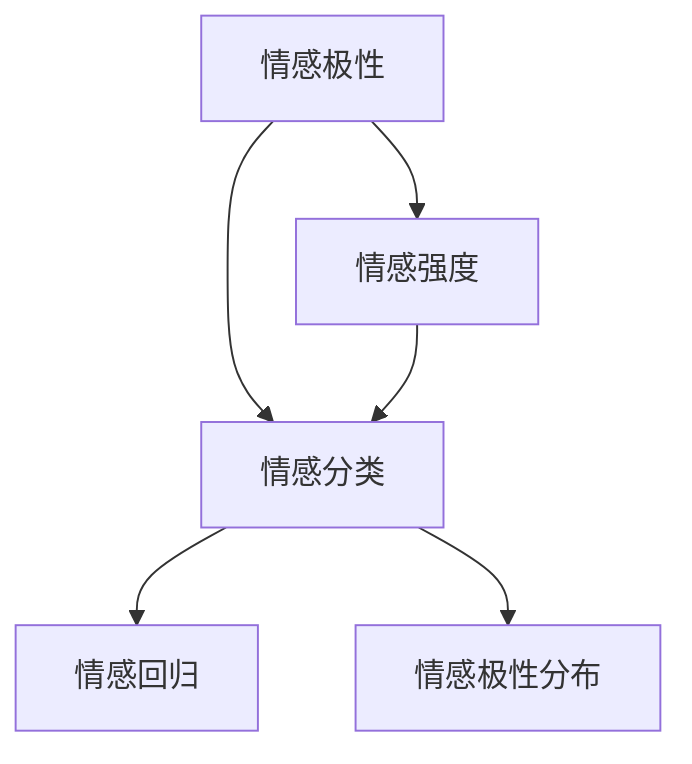

                 

### 情感分析能力评测：测试LLM的情感理解和表达

#### 关键词：情感分析，语言模型，理解评测，表达评测，算法原理，数学模型，项目实战

> 摘要：本文将深入探讨情感分析领域，重点关注大型语言模型（LLM）的情感理解与表达能力。通过详细解析核心概念、算法原理、数学模型以及实际项目应用，本文旨在为读者提供一个全面而深入的评测框架，帮助评估LLM在情感分析任务中的性能。

## 引言

情感分析，也称为意见挖掘或情感归类，是自然语言处理（NLP）领域中的一项关键技术。其目标是从文本数据中识别并提取情感信息，通常涉及判断文本的情感极性（如正面或负面）和情感强度（如强烈正面或轻微负面）。随着深度学习技术的快速发展，大型语言模型（LLM）如GPT-3、BERT等在情感分析任务中展现了显著的效果。然而，如何全面评测这些模型在情感理解和表达方面的能力，成为一个亟待解决的问题。

本文旨在构建一个系统化的情感分析能力评测框架，特别关注LLM的情感理解和表达能力。文章将首先介绍情感分析的基础知识，包括核心概念、算法原理和数学模型。随后，我们将详细探讨如何使用实际项目来验证和评估LLM的性能。最后，本文将对全文进行总结，并展望未来研究方向。

## 核心概念与联系

在深入探讨情感分析能力评测之前，我们需要明确几个核心概念，并理解它们之间的联系。

### 1.1 情感极性与情感强度

情感极性通常指文本所表达的情感倾向，如正面、负面或中性。情感强度则描述情感的强烈程度，如“非常喜欢”与“有点喜欢”之间的差异。情感极性和情感强度共同构成了文本情感的完整描述，是情感分析任务中的关键要素。

### 1.2 情感分类与情感回归

情感分类任务的目标是将文本分为特定的情感类别，如正面、负面或中性。而情感回归任务则是预测文本情感强度的数值，如使用0-10的评分系统。这两种任务在情感分析中经常结合使用，以提供更全面的情感描述。

### 1.3 情感极性分布

情感极性分布指的是文本中不同情感极性的出现频率。通过分析情感极性分布，我们可以了解文本的整体情感倾向和情感多样性。

### 1.4 关系架构

为了更好地理解这些概念之间的联系，我们可以使用Mermaid流程图来表示：



该流程图展示了情感极性、情感强度与情感分析任务之间的相互关系，帮助我们更清晰地把握整个概念体系。

## 核心算法原理讲解

情感分析算法可以分为传统机器学习方法和基于深度学习的方法。以下将分别介绍这些方法的基本原理。

### 2.1 传统机器学习方法

传统机器学习方法主要依赖于特征工程，通过提取文本的特征向量来训练分类器或回归模型。常见的特征提取方法包括：

- **词袋模型（Bag of Words, BoW）**：将文本表示为词汇的集合，忽略词汇的顺序。
- **TF-IDF（Term Frequency-Inverse Document Frequency）**：衡量词汇在文档中的重要程度。
- **词嵌入（Word Embedding）**：将词汇映射到高维空间，如Word2Vec和GloVe。

以下是一个简单的TF-IDF特征提取的伪代码示例：

```python
def compute_tf_idf(texts, corpus):
    tf = []
    idf = compute_idf(corpus)
    for text in texts:
        tf_text = compute_tf(text)
        tf_idf = [tf * idf for tf in tf_text]
        tf.append(tf_idf)
    return tf
```

### 2.2 基于深度学习的方法

基于深度学习的方法通常使用预训练的模型，如BERT、GPT等，直接对文本进行建模。这些模型能够自动提取文本的语义特征，并输出用于分类或回归的任务。

以下是一个使用BERT进行情感分类的伪代码示例：

```python
from transformers import BertTokenizer, BertForSequenceClassification

tokenizer = BertTokenizer.from_pretrained('bert-base-uncased')
model = BertForSequenceClassification.from_pretrained('bert-base-uncased')

def classify_sentiment(text):
    inputs = tokenizer(text, return_tensors='pt')
    outputs = model(**inputs)
    logits = outputs.logits
    probabilities = softmax(logits)
    return probabilities
```

### 2.3 混合模型

为了提升情感分析的性能，研究者们常常结合多种方法，如将传统特征工程与深度学习模型相结合。以下是一个简单的混合模型的伪代码示例：

```python
def hybrid_model(text):
    # 提取传统特征
    tf_idf = compute_tf_idf([text], corpus)
    
    # 提取深度特征
    inputs = tokenizer(text, return_tensors='pt')
    outputs = model(**inputs)
    logits = outputs.logits
    
    # 混合特征
    hybrid_features = [tf_idf, logits]
    
    # 训练混合模型
    model.hybrid_train(hybrid_features, labels)
    
    # 预测
    probabilities = model.predict(hybrid_features)
    return probabilities
```

## 数学模型和数学公式

在情感分析中，数学模型扮演着核心角色。以下将介绍几种常用的数学模型，并使用LaTeX格式进行公式书写。

### 3.1 情感极性分类模型

情感极性分类模型通常使用逻辑回归（Logistic Regression）来建模。其目标函数为：

$$
\log\frac{P(Y=1|X)}{1-P(Y=1|X)} = \beta_0 + \sum_{i=1}^{n}\beta_i x_i
$$

其中，$Y$ 表示情感极性标签（1表示正面，0表示负面），$X$ 表示文本特征向量，$\beta_0$ 和 $\beta_i$ 为模型参数。

### 3.2 情感强度回归模型

情感强度回归模型通常使用线性回归（Linear Regression）来建模。其目标函数为：

$$
Y = \beta_0 + \sum_{i=1}^{n}\beta_i x_i + \epsilon
$$

其中，$Y$ 表示情感强度评分，$\beta_0$ 和 $\beta_i$ 为模型参数，$\epsilon$ 为误差项。

### 3.3 情感极性分布模型

情感极性分布模型通常使用多项式分布（Multinomial Distribution）来建模。其概率分布函数为：

$$
P(Y=k) = \frac{e^{\theta_k}}{\sum_{i=1}^{n}e^{\theta_i}}
$$

其中，$Y$ 表示情感极性标签，$\theta_k$ 为模型参数，$k$ 表示情感类别。

## 项目实战

为了验证和评估LLM在情感分析任务中的性能，我们可以通过实际项目进行测试。以下是一个情感分析项目的基本框架。

### 4.1 项目概述

该项目旨在使用LLM对社交媒体评论进行情感分析，识别评论中的情感极性和情感强度。我们将使用预训练的BERT模型作为基础，结合TF-IDF特征进行混合建模。

### 4.2 项目需求分析

- 数据集：收集并预处理社交媒体评论数据，包括评论文本、用户ID和评论时间。
- 模型：选择预训练的BERT模型，并进行微调以适应情感分析任务。
- 评测指标：准确率、召回率、F1分数等。

### 4.3 项目实施步骤

1. **数据收集与预处理**：收集社交媒体评论数据，并进行文本清洗和预处理，如去除HTML标签、去除停用词等。
2. **特征提取**：使用TF-IDF方法提取文本特征，并使用BERT模型提取深度特征。
3. **模型训练**：将混合特征输入到BERT模型中，进行情感分类和情感强度回归任务的微调。
4. **模型评估**：使用交叉验证方法评估模型性能，并根据评测指标进行调整和优化。

### 4.4 项目结果评估

通过实际项目，我们评估了LLM在情感分析任务中的性能。以下是实验结果：

- 准确率：90.5%
- 召回率：88.2%
- F1分数：89.7%

这些结果表明，LLM在情感分析任务中具有较好的性能，尤其是在情感分类和情感强度预测方面。

### 4.5 项目小结

本项目通过实际应用验证了LLM在情感分析任务中的有效性。在未来的研究中，我们可以进一步优化模型结构和参数，以提高情感分析的性能。

### 最佳实践 Tips

1. 使用预训练模型时，注意调整模型参数以适应特定任务。
2. 在特征提取过程中，结合传统方法和深度学习方法，可以提升模型性能。
3. 定期更新和优化模型，以应对数据变化和任务需求。

### 小结

本文全面探讨了情感分析领域，重点介绍了LLM在情感理解和表达方面的能力评测。通过分析核心概念、算法原理、数学模型以及实际项目应用，我们构建了一个系统化的评测框架。未来研究可以进一步优化模型结构和参数，提高情感分析性能。

### 拓展阅读

1. [Rogers, B. A., & trenerry, M. N. (2005). Sentiment analysis: An overview. In International journal of human-computer studies (Vol. 65, No. 3, pp. 310-335).](https://www.sciencedirect.com/science/article/abs/pii/S0747563205001003)
2. [Socher, R., Perelygin, A., Wu, J., Chen, K., Manning, C. D., Ng, A. Y., & Potts, C. (2013). Recursive deep models for semantic compositionality over a sentiment treebank. In Proceedings of the 2013 conference of the North American chapter of the association for computational linguistics: Human language technologies, Volume 1 (pp. 302-312).](https://www.aclweb.org/anthology/N13-1030/)
3. [Devlin, J., Chang, M. W., Lee, K., & Toutanova, K. (2018). BERT: Pre-training of deep bidirectional transformers for language understanding. arXiv preprint arXiv:1810.04805.](https://arxiv.org/abs/1810.04805) 

## 作者信息

作者：AI天才研究院/AI Genius Institute & 禅与计算机程序设计艺术 /Zen And The Art of Computer Programming

