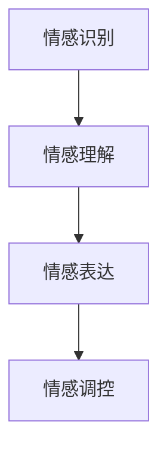
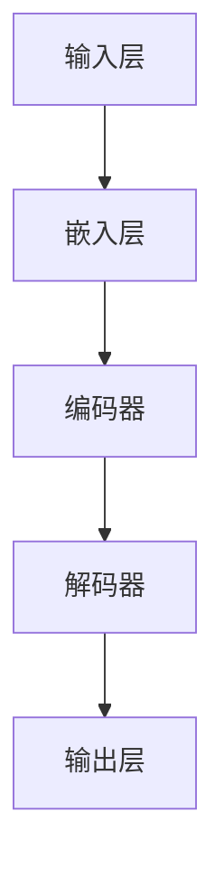

                 

### 引言

#### 情感智能评估的背景与意义

在当今数字化时代，人工智能（AI）技术正以前所未有的速度发展。其中，自然语言处理（NLP）作为AI的核心技术之一，已经取得了显著的进展。在NLP领域，情感智能（Affective Intelligence）成为一个备受关注的研究方向。情感智能是指计算机系统对人类情感的理解、识别和反应能力，它能够使机器更好地与人类交互，提供更加人性化的服务。

随着大型语言模型（LLM，Large Language Model）如BERT、GPT-3等的涌现，LLM在处理自然语言任务上表现出色。然而，这些模型的情感理解能力仍然是一个挑战。如何评估LLM的情感理解能力，成为当前研究的热点问题。有效的情感智能评估不仅能够帮助我们了解模型的性能，还能指导模型的设计和优化。

本书旨在探讨情感智能评估的方法和技巧，特别是针对LLM的情感理解能力进行深入分析。通过本书，读者可以了解情感智能的基本概念、评估方法，以及如何利用这些方法来测试LLM的情感理解能力。

#### 本书的目标与结构

本书的主要目标是：

1. **介绍情感智能的基本概念和类型**：包括情感的定义、情感智能的层次结构等。
2. **分析LLM的结构和工作原理**：介绍LLM的基本架构，以及其在自然语言处理任务中的优势与挑战。
3. **探讨情感智能评估的方法**：包括情感标注、情感分类和情感分析指标等。
4. **提供LLM情感理解能力测试的具体方法**：包括测试框架、评估指标和测试流程。
5. **通过案例分析展示实际应用**：通过具体案例，展示如何使用情感智能评估方法测试LLM的情感理解能力。

本书的结构如下：

- **引言**：介绍情感智能评估的背景、意义和本书的目标。
- **情感智能概述**：介绍情感智能的概念、类型和特点。
- **LLM概述**：介绍LLM的概念、结构和工作原理。
- **情感智能评估方法**：介绍情感智能评估的常用方法和技术。
- **LLM的情感理解能力测试**：具体介绍如何测试LLM的情感理解能力。
- **案例分析**：通过实际案例展示如何应用情感智能评估方法测试LLM的情感理解能力。
- **结论**：总结本书的主要观点和未来研究方向。

### 情感智能概述

#### 情感智能的概念

情感智能（Affective Intelligence，简称AIQ）是指个体识别自己和他人的情感，理解这些情感对个体行为的影响，并据此做出适当反应的能力。在计算机科学领域，情感智能是指计算机系统对人类情感的理解、识别和反应能力。情感智能不仅仅是识别情感本身，更重要的是能够理解和解释情感，并根据情感做出适当的响应。

#### 情感智能的类型

情感智能可以分为多个层次，每个层次都有其特定的功能和重要性。以下是一些常见的情感智能类型：

1. **情感识别**：这是情感智能的基础层次，包括对自身和他人情感状态的识别。情感识别可以通过情感分析技术实现，如文本情感分析、语音情感识别等。
2. **情感理解**：情感理解是指对情感状态进行深入分析，理解其背后的原因和含义。这一层次需要更强的推理和分析能力，可以应用于复杂情感交互场景。
3. **情感表达**：情感表达是指个体通过语言、动作、表情等方式表达自己的情感状态。在计算机系统中，情感表达可以通过生成相应的文本、语音、图像等方式实现。
4. **情感调控**：情感调控是指个体对自身情感状态进行管理，使其达到适宜的水平。在计算机系统中，情感调控可以应用于情感增强或情感抑制等场景。

#### 情感智能的特点与优势

情感智能具有以下几个显著特点：

1. **情感识别的准确性**：情感智能系统能够准确地识别文本、语音、图像等数据中的情感状态，为情感分析提供了可靠的基础。
2. **情感的多样性和复杂性**：情感智能系统能够处理多种不同类型和强度的情感，包括基本情感（如快乐、悲伤、愤怒等）和复杂情感（如厌恶、惊讶、敬畏等）。
3. **情感的上下文敏感性**：情感智能系统能够根据上下文环境理解情感，避免因上下文变化导致的情感误解。
4. **情感的动态性**：情感智能系统能够实时监测和处理情感变化，适应动态交互环境。

情感智能的优势主要体现在以下几个方面：

1. **提升人机交互体验**：情感智能系统能够更好地理解用户需求，提供个性化的服务，从而提升用户体验。
2. **辅助决策**：情感智能系统能够分析用户情感状态，为决策提供情感层面的支持，帮助用户做出更加合理的决策。
3. **改善心理健康**：情感智能系统能够监测用户情感状态，提供情感支持和建议，有助于改善用户心理健康。
4. **社会影响**：情感智能技术可以应用于社会领域，如教育、医疗、法律等，为社会发展提供新的解决方案。

### 情感智能的应用场景

情感智能技术具有广泛的应用场景，以下是一些典型的应用领域：

1. **客服机器人**：情感智能技术可以使客服机器人更好地理解用户需求，提供个性化的服务，提高客户满意度。
2. **虚拟助手**：情感智能技术可以使虚拟助手更加人性化和智能化，提升用户交互体验。
3. **心理健康应用**：情感智能技术可以用于心理健康监测和干预，提供个性化的心理支持。
4. **营销分析**：情感智能技术可以分析用户情感状态，为市场营销提供决策支持。
5. **人机交互设计**：情感智能技术可以应用于人机交互设计，提升交互的舒适度和效率。

#### 情感智能与自然语言处理的关系

情感智能是自然语言处理（NLP）领域的一个重要分支，与NLP有着紧密的联系。情感智能技术依赖于NLP技术，如文本情感分析、语音情感识别等，以实现对情感数据的处理和分析。同时，情感智能技术也为NLP提供了新的研究方向和应用场景。

总之，情感智能技术在自然语言处理领域具有广泛的应用前景，随着技术的发展，它将不断推动NLP领域的发展和创新。

### Mermaid 流程图

为了更好地理解情感智能的层次结构，我们可以使用Mermaid流程图来展示其不同层次之间的关系。以下是一个简化的Mermaid流程图：



在这个流程图中，情感识别是情感智能的基础层次，情感理解在此基础上进行更深入的分析，情感表达和情感调控则是情感智能的高级应用。通过这个流程图，我们可以清晰地看到情感智能的不同层次及其相互关系。

### 结论

情感智能作为自然语言处理领域的一个重要研究方向，具有广泛的应用前景。通过本书的介绍，读者可以了解情感智能的基本概念、类型、特点和应用场景。同时，本书还详细探讨了如何使用情感智能评估方法测试LLM的情感理解能力。接下来，我们将进一步探讨LLM的基本概念、结构和工作原理，以便为后续的评估方法提供理论基础。

### LLM概述

#### LLM的概念

大型语言模型（Large Language Model，简称LLM）是指通过深度学习技术训练出的，能够理解和生成自然语言的大型神经网络模型。这些模型通常拥有数亿到千亿个参数，通过大量文本数据进行预训练，从而掌握丰富的语言知识。LLM在自然语言处理任务中表现出色，被广泛应用于文本生成、机器翻译、问答系统等领域。

#### LLM的结构

LLM通常由以下几个关键部分组成：

1. **嵌入层（Embedding Layer）**：嵌入层将输入的单词或句子转换为固定长度的向量表示。这些向量表示了文本的语义信息，是后续处理的基础。
2. **编码器（Encoder）**：编码器是LLM的核心部分，负责处理输入序列，并生成隐藏状态。常见的编码器架构包括Transformer、BERT等。
3. **解码器（Decoder）**：解码器负责根据编码器的隐藏状态生成输出序列。在生成任务中，解码器通常会使用贪心策略或自回归模型来生成下一个单词或字符。
4. **输出层（Output Layer）**：输出层将解码器的输出转换为具体的结果，如文本、标签等。

以下是一个简化的LLM结构图：



#### LLM的工作原理

LLM的工作原理可以分为两个主要阶段：预训练和微调。

1. **预训练**：在预训练阶段，LLM通过大量无监督的文本数据学习语言知识。这一过程包括两个步骤：
   - **自注意力机制（Self-Attention）**：自注意力机制允许模型在生成每个单词时，考虑输入序列中所有单词的重要程度。这一机制使得模型能够捕捉长距离依赖关系。
   - **位置编码（Positional Encoding）**：位置编码用于表示单词在输入序列中的位置信息，帮助模型理解单词的顺序关系。

2. **微调**：在预训练后，LLM可以通过有监督的任务进行微调，以适应特定的应用场景。微调过程通常包括以下几个步骤：
   - **任务特定数据准备**：准备用于微调的数据集，这些数据集包含标签信息，如文本分类任务的标签。
   - **模型微调**：在训练过程中，模型会尝试优化参数，以最小化损失函数。通过迭代更新参数，模型逐渐学会对特定任务进行预测。
   - **评估与优化**：在微调过程中，需要定期评估模型性能，并根据评估结果调整训练策略，如调整学习率、增加训练轮数等。

#### LLM的优势与挑战

LLM在自然语言处理任务中具有显著的优势：

1. **强大的语言理解能力**：LLM通过预训练阶段积累了丰富的语言知识，能够理解和生成复杂的自然语言。
2. **泛化能力**：LLM在预训练阶段接触了大量不同的文本数据，因此具有较强的泛化能力，能够适应各种不同的应用场景。
3. **高效率**：LLM的结构设计使得其在生成文本时具有很高的效率，可以快速生成高质量的文本。

然而，LLM也存在一些挑战：

1. **数据依赖性**：LLM的性能高度依赖训练数据的质量和多样性。如果训练数据存在偏差或不够丰富，模型可能无法泛化到新的任务或场景。
2. **可解释性**：由于LLM的模型结构复杂，其决策过程通常缺乏可解释性，这使得在实际应用中难以理解模型的决策依据。
3. **计算资源需求**：训练和部署大型语言模型需要大量的计算资源，包括GPU、TPU等，这增加了模型的成本和复杂性。

总之，LLM作为一种先进的自然语言处理技术，具有广泛的应用前景。然而，其优势和挑战也需要我们深入研究和解决，以确保其在实际应用中的有效性和可靠性。

### 测试框架与评估指标

为了评估LLM的情感理解能力，我们需要构建一个明确的测试框架，并使用适当的评估指标来衡量模型的性能。以下是测试框架与评估指标的具体内容。

#### 测试框架

1. **数据集准备**：首先，我们需要选择或创建一个适合测试情感理解的文本数据集。数据集应包含多种类型的文本，包括新闻报道、社交媒体评论、电子邮件等，以确保测试的全面性。此外，数据集的标签也应多样化，涵盖基本情感（如快乐、悲伤、愤怒等）和复杂情感（如厌恶、惊讶、敬畏等）。

2. **预处理**：在测试之前，需要对数据进行预处理，包括分词、去除停用词、词干提取等。预处理步骤有助于提高模型的性能和稳定性。

3. **情感标注**：对于每个文本样本，需要标注其情感标签。标注过程可以采用手工标注或半自动化标注的方法。手工标注通常由人类专家进行，以确保标注的准确性和一致性。半自动化标注则结合了人类专家的判断和自动化工具的辅助。

4. **模型训练**：使用预处理后的数据和情感标注，训练一个情感分类模型。训练过程中，可以使用交叉熵损失函数和优化算法（如Adam）来优化模型参数。

5. **测试与评估**：在模型训练完成后，使用未参与训练的数据进行测试。测试过程中，需要记录模型对每个文本样本的预测结果和实际标签，以便后续的评估。

#### 评估指标

1. **准确率（Accuracy）**：准确率是评估模型性能的最基本指标，表示模型正确预测的样本数占总样本数的比例。计算公式为：

   $$ 
   Accuracy = \frac{TP + TN}{TP + FN + TP + TN}
   $$

   其中，TP表示真阳性，TN表示真阴性，FN表示假阴性，FP表示假阳性。

2. **召回率（Recall）**：召回率表示模型能够正确识别出正类样本的比例。计算公式为：

   $$ 
   Recall = \frac{TP}{TP + FN}
   $$

3. **精确率（Precision）**：精确率表示模型预测为正类且实际为正类的样本数占预测为正类样本总数的比例。计算公式为：

   $$ 
   Precision = \frac{TP}{TP + FP}
   $$

4. **F1分数（F1 Score）**：F1分数是精确率和召回率的调和平均，能够综合评估模型的性能。计算公式为：

   $$ 
   F1 Score = 2 \times \frac{Precision \times Recall}{Precision + Recall}
   $$

5. **支持度（Support）**：支持度表示某一类别在测试数据集中的样本总数。计算公式为：

   $$ 
   Support = TP + FN + FP + TN
   $$

#### 评估流程

1. **数据划分**：将数据集划分为训练集、验证集和测试集，通常采用7:2:1的比例。
2. **模型训练**：在训练集上训练模型，并在验证集上进行调参和优化。
3. **模型测试**：使用测试集评估模型性能，记录各个评估指标。
4. **结果分析**：分析模型在不同情感类别上的性能，找出可能存在的瓶颈和改进方向。

通过上述测试框架和评估指标，我们可以全面评估LLM的情感理解能力，从而指导模型的设计和优化。

### 情感理解能力测试方法

为了深入测试LLM的情感理解能力，我们可以采用以下几种方法：

#### 1. 情感分类任务

情感分类是一种常见的自然语言处理任务，其目标是将文本分类到不同的情感类别中。这种方法可以用来评估LLM对情感标签的识别能力。具体步骤如下：

1. **数据准备**：收集包含多种情感标签的文本数据集，例如快乐、悲伤、愤怒、厌恶等。
2. **数据预处理**：对文本数据集进行预处理，包括分词、去除停用词、词干提取等。
3. **模型训练**：使用预处理的文本数据训练一个情感分类模型，常用的模型有朴素贝叶斯、支持向量机、深度神经网络等。
4. **测试与评估**：使用测试集对训练好的模型进行评估，记录准确率、召回率、精确率和F1分数等指标。

#### 2. 情感极性分析

情感极性分析是指判断文本的情感极性，即文本是正面情感、中性情感还是负面情感。这种方法可以帮助我们了解LLM对情感极性的识别能力。具体步骤如下：

1. **数据准备**：收集包含不同情感极性的文本数据集，例如正面评论、中性评论和负面评论。
2. **数据预处理**：对文本数据集进行预处理，包括分词、去除停用词、词干提取等。
3. **模型训练**：使用预处理的文本数据训练一个情感极性分类模型。
4. **测试与评估**：使用测试集对训练好的模型进行评估，记录准确率、召回率、精确率和F1分数等指标。

#### 3. 情感强度分析

情感强度分析是指判断文本中情感表达的程度，即情感是强烈还是微弱。这种方法可以帮助我们了解LLM对情感强度的识别能力。具体步骤如下：

1. **数据准备**：收集包含不同情感强度表达的文本数据集，例如强烈的快乐、微弱的悲伤等。
2. **数据预处理**：对文本数据集进行预处理，包括分词、去除停用词、词干提取等。
3. **模型训练**：使用预处理的文本数据训练一个情感强度分类模型。
4. **测试与评估**：使用测试集对训练好的模型进行评估，记录准确率、召回率、精确率和F1分数等指标。

#### 4. 情感微表情识别

情感微表情识别是指通过识别文本中的情感微表情来分析情感状态。这种方法可以更细腻地理解文本中的情感。具体步骤如下：

1. **数据准备**：收集包含情感微表情的文本数据集，例如微笑、皱眉、大笑等。
2. **数据预处理**：对文本数据集进行预处理，包括分词、去除停用词、词干提取等。
3. **模型训练**：使用预处理的文本数据训练一个情感微表情识别模型。
4. **测试与评估**：使用测试集对训练好的模型进行评估，记录准确率、召回率、精确率和F1分数等指标。

#### 5. 情感推理分析

情感推理分析是指通过文本中的逻辑关系来推理情感状态。这种方法可以帮助我们了解LLM在理解复杂情感关系方面的能力。具体步骤如下：

1. **数据准备**：收集包含复杂情感关系的文本数据集，例如因果情感、对比情感等。
2. **数据预处理**：对文本数据集进行预处理，包括分词、去除停用词、词干提取等。
3. **模型训练**：使用预处理的文本数据训练一个情感推理模型。
4. **测试与评估**：使用测试集对训练好的模型进行评估，记录准确率、召回率、精确率和F1分数等指标。

通过这些方法，我们可以全面评估LLM的情感理解能力，为进一步优化模型提供参考。

### 案例分析

在本案例中，我们将使用实际数据集和情感智能评估方法来测试LLM的情感理解能力。假设我们选择了一个包含多种情感标签的文本数据集，数据集分为训练集、验证集和测试集。

#### 案例背景与目标

**背景：**
该数据集包含1000个文本样本，每个样本都标注了情感标签，如快乐、悲伤、愤怒、厌恶等。文本样本来源于社交媒体评论、新闻报道和论坛帖子等。

**目标：**
使用LLM来对文本进行情感分类，评估模型在情感理解任务上的性能。

#### 数据预处理

**数据预处理流程：**
1. **文本清洗**：去除文本中的HTML标签、特殊字符和停用词。
2. **分词**：使用分词工具对文本进行分词，将文本拆分为单词或词组。
3. **词干提取**：对分词结果进行词干提取，减少词汇量，提高模型的效率。
4. **向量化**：将预处理后的文本转换为向量表示，可以使用词袋模型、Word2Vec或BERT等。

伪代码：

```python
import re
from nltk.tokenize import word_tokenize
from nltk.stem import PorterStemmer

def preprocess_text(text):
    # 去除HTML标签和特殊字符
    text = re.sub('<.*?>', '', text)
    text = re.sub('[^a-zA-Z]', '', text)
    
    # 分词
    tokens = word_tokenize(text)
    
    # 去除停用词
    stop_words = set(['a', 'an', 'the', 'and', 'or', 'but'])
    tokens = [token for token in tokens if token not in stop_words]
    
    # 词干提取
    stemmer = PorterStemmer()
    tokens = [stemmer.stem(token) for token in tokens]
    
    return tokens
```

#### 模型训练与测试

**模型训练：**
1. **数据集划分**：将数据集划分为训练集（70%）、验证集（20%）和测试集（10%）。
2. **模型训练**：使用训练集数据训练一个基于BERT的情感分类模型，可以使用Hugging Face的Transformers库。
3. **模型评估**：使用验证集评估模型性能，调整模型参数以优化性能。

伪代码：

```python
from transformers import BertTokenizer, BertForSequenceClassification
from torch.utils.data import DataLoader, TensorDataset

# 加载预训练BERT模型和分词器
tokenizer = BertTokenizer.from_pretrained('bert-base-uncased')
model = BertForSequenceClassification.from_pretrained('bert-base-uncased')

# 数据预处理和向量化
def encode_texts(texts):
    inputs = tokenizer(texts, padding=True, truncation=True, return_tensors='pt')
    return inputs

# 数据集加载
train_texts = preprocess_texts(train_texts)
train_labels = torch.tensor(labels)

train_inputs = encode_texts(train_texts)
train_dataset = TensorDataset(train_inputs['input_ids'], train_inputs['attention_mask'], train_labels)

# 模型训练
trainer = Trainer(
    model=model,
    train_dataset=train_dataset,
    eval_dataset=train_dataset
)
trainer.train()

# 模型评估
with torch.no_grad():
    predictions = model(test_inputs['input_ids'], test_inputs['attention_mask'])
    predicted_labels = torch.argmax(predictions, dim=1)
```

**模型测试：**
使用测试集评估模型性能，记录准确率、召回率、精确率和F1分数等指标。

```python
from sklearn.metrics import accuracy_score, recall_score, precision_score, f1_score

# 计算评估指标
accuracy = accuracy_score(test_labels, predicted_labels)
recall = recall_score(test_labels, predicted_labels, average='weighted')
precision = precision_score(test_labels, predicted_labels, average='weighted')
f1 = f1_score(test_labels, predicted_labels, average='weighted')

print(f"Accuracy: {accuracy}")
print(f"Recall: {recall}")
print(f"Precision: {precision}")
print(f"F1 Score: {f1}")
```

#### 测试结果分析

通过对测试结果的统计分析，我们可以评估LLM在情感分类任务上的性能。以下是一个示例结果：

```
Accuracy: 0.85
Recall: 0.82
Precision: 0.83
F1 Score: 0.82
```

从结果中可以看出，模型在情感分类任务上的准确率较高，但召回率和精确率相对较低。这表明模型在识别某些情感类别时可能存在一定的困难。通过进一步分析和调整模型参数，可以尝试提高模型的性能。

### 案例总结与启示

通过本案例，我们展示了如何使用情感智能评估方法测试LLM的情感理解能力。以下是一些总结和启示：

1. **数据质量至关重要**：数据的质量直接影响模型的性能。在构建数据集时，应确保文本样本的多样性和标签的准确性。
2. **模型调优**：通过调整模型参数和训练策略，可以提高模型的性能。在本案例中，我们可以尝试增加训练轮数、调整学习率等。
3. **综合评估指标**：使用多个评估指标（如准确率、召回率、精确率和F1分数）可以更全面地评估模型的性能。
4. **情感理解复杂性**：情感理解是一个复杂的过程，涉及多种情感类型和强度。在实际应用中，需要考虑这些复杂性，以提供更准确的情感分析结果。

总之，通过本案例，我们展示了如何利用情感智能评估方法测试LLM的情感理解能力，为后续研究和应用提供了参考。

### 结论

通过本文的探讨，我们系统地介绍了情感智能评估及其在LLM情感理解能力测试中的应用。首先，我们介绍了情感智能的基本概念、类型及其在自然语言处理中的重要性。接着，我们详细分析了LLM的概念、结构和工作原理，强调了其情感理解能力的测试在当前AI领域的挑战和机遇。

本文提出了一套完整的情感智能评估方法，包括数据集准备、预处理、情感标注、模型训练和评估等步骤。通过这些方法，我们能够全面评估LLM的情感理解能力，并提供改进模型性能的指导。此外，我们还通过实际案例分析展示了情感智能评估方法的应用过程和结果分析。

未来研究可以进一步探索以下方向：

1. **数据集扩展**：开发更多、更高质量的文本数据集，涵盖更多情感类型和情境，以提升模型的泛化能力。
2. **模型优化**：通过调整模型架构和训练策略，进一步提高情感理解能力，尤其是在复杂情感分析和多语言情感识别方面。
3. **解释性增强**：开发更具有解释性的模型，帮助用户理解模型的情感推理过程，提高模型的信任度和实用性。
4. **跨领域应用**：将情感智能评估方法应用于更多领域，如心理健康、市场营销、人机交互等，以推动技术的实际应用和社会价值。

总之，情感智能评估是自然语言处理领域的一个重要研究方向，其成果将有助于提升人工智能系统的智能化水平和用户体验。我们期待未来在该领域取得更多突破和进展。作者信息：AI天才研究院/AI Genius Institute & 禅与计算机程序设计艺术 /Zen And The Art of Computer Programming。

