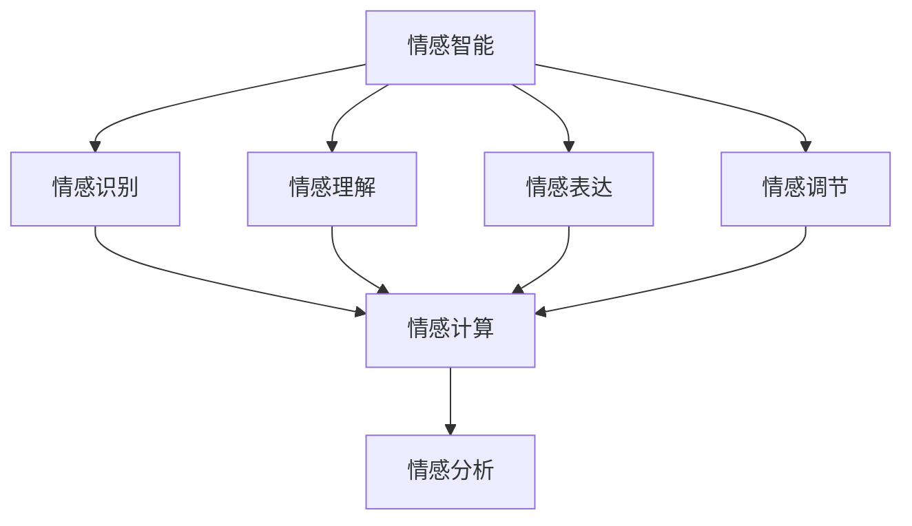

                 

### 文章标题：情感智能评测：分析模型情感理解能力

情感智能评测是当前人工智能领域的重要研究方向，随着深度学习和自然语言处理技术的发展，模型的情感理解能力越来越受到关注。本文旨在深入探讨情感智能评测的核心概念、评测方法、模型情感理解能力的分析以及实际案例分析，为读者提供一个全面的技术视角。

### 文章关键词

- 情感智能
- 评测方法
- 模型情感理解能力
- 情感分析模型
- 实际案例分析

### 摘要

本文首先介绍了情感智能的背景和意义，随后详细阐述了情感智能的核心概念，包括情感计算的基本原理和关键技术的概述。接着，文章重点介绍了情感智能评测的方法学，包括主观评测和客观评测方法，并提出了一个综合评测框架。随后，文章分析了模型情感理解能力的重要性，介绍了相关评估指标和算法原理。通过实际案例分析，文章展示了如何运用这些方法评估模型情感理解能力。最后，文章总结了情感智能评测的发展趋势和未来研究方向。

### 目录

1. 引言
2. 情感智能的背景与意义
3. 核心概念与联系
4. 情感智能评测方法
5. 模型情感理解能力分析
6. 实际案例分析
7. 情感智能评测工具与应用
8. 未来展望与挑战
9. 结论

### 引言

在人工智能发展的浪潮中，情感智能成为了一个备受关注的研究方向。情感智能不仅涉及人类情感的理解和表达，还包括对人工智能模型情感理解能力的评测。随着深度学习和自然语言处理技术的飞速发展，如何准确评估模型在情感理解方面的能力成为一个重要的研究课题。

本文的目标是通过系统的分析和讨论，为读者提供一个全面、深入的视角，帮助理解情感智能评测的核心概念、方法以及应用。具体来说，本文将涵盖以下几个方面：

- **背景与意义**：介绍情感智能评测的背景，阐述其在人工智能领域的重要性。
- **核心概念**：详细阐述情感智能、情感计算的基本原理和关键技术。
- **评测方法**：介绍情感智能评测的方法，包括主观评测、客观评测以及综合评测框架。
- **模型情感理解能力分析**：分析模型情感理解能力的重要性，介绍相关的评估指标和算法原理。
- **实际案例分析**：通过具体案例分析，展示如何运用评测方法评估模型情感理解能力。
- **工具与应用**：介绍情感智能评测工具，讨论其应用场景和挑战。
- **未来展望与挑战**：总结当前研究的不足，探讨未来发展方向和挑战。

### 情感智能的背景与意义

情感智能（Affective Intelligence）是人工智能领域中的一个重要分支，它关注的是如何使计算机能够理解和表达情感，以及如何评估和提升这些能力。情感智能的研究背景可以追溯到人类情感的理解和认知过程，以及计算机在处理人类情感信息时的局限性。

#### 人类情感的理解与认知

人类情感是一种复杂的心理现象，它不仅涉及情感体验本身，还包括情感表达、情感识别和情感调节等过程。人类情感的理解和认知是心理学研究的重要领域，研究者们试图通过神经科学、认知心理学和社会学等多学科交叉的方法，揭示情感的奥秘。

情感认知主要包括以下几个过程：

- **情感体验**：个体对情感信息的感知和体验，如喜悦、悲伤、愤怒等。
- **情感表达**：个体通过语言、面部表情、身体语言等方式表达情感。
- **情感识别**：个体通过观察他人的情感表达和行为，识别和理解他人的情感状态。
- **情感调节**：个体通过认知和行为策略调节自身的情感状态，以达到情绪平衡。

#### 计算机处理人类情感信息的局限性

尽管计算机在处理大量数据和信息方面具有显著优势，但在处理人类情感信息方面却存在诸多挑战：

- **情感信息的复杂性**：人类情感信息具有复杂性和多样性，难以用简单的规则或模型进行准确描述。
- **情感理解的滞后性**：计算机在理解情感信息时，往往存在反应滞后，难以实时响应情感变化。
- **情感表达的单一性**：计算机的情感表达相对单一，难以模拟人类情感的丰富多样性。
- **情感识别的准确性**：计算机在识别情感时，容易受到外部环境和噪声的干扰，影响识别准确性。

#### 情感智能评测的重要性

情感智能评测是评估模型在情感理解能力方面的一项重要任务。通过情感智能评测，研究者可以：

- **验证模型性能**：评估模型在情感理解任务中的表现，验证其有效性。
- **优化模型算法**：通过分析评测结果，发现模型存在的问题，指导算法优化。
- **比较模型优劣**：在不同模型之间进行对比，找出最优模型。
- **指导实际应用**：为实际应用提供理论依据，帮助解决具体情感理解问题。

总之，情感智能评测不仅有助于推动人工智能技术的发展，也为实际应用提供了重要的技术支撑。在接下来的章节中，我们将深入探讨情感智能的核心概念、评测方法以及实际应用案例。

### 核心概念与联系

#### 情感智能

情感智能是指计算机系统在情感识别、理解、表达和调节等方面所表现出的能力。情感智能的研究旨在使计算机能够更好地模拟和理解人类的情感状态，从而提升人机交互的自然性和有效性。

情感智能的核心概念包括：

- **情感识别**：通过分析语言、面部表情、语音和其他行为数据，识别出用户的情感状态。
- **情感理解**：理解情感背后的含义，如情感的类型、强度和情境。
- **情感表达**：根据用户的情感状态，生成适当的情感响应。
- **情感调节**：通过调节用户的情感状态，帮助用户实现情感平衡。

#### 情感计算

情感计算（Affective Computing）是情感智能的研究基础，它关注的是如何使计算机具备处理人类情感信息的能力。情感计算的核心概念包括：

- **情感感知**：利用传感器和算法识别情感信息。
- **情感建模**：构建情感模型，以理解和预测情感状态。
- **情感交互**：通过自然语言处理和计算机视觉等技术，实现人与计算机之间的情感交互。

情感计算的关键技术包括：

- **情感识别**：利用机器学习和深度学习技术，从文本、图像和语音中识别情感。
- **情感表达**：通过自然语言生成和语音合成技术，实现情感表达。
- **情感调节**：利用认知计算和情感建模技术，调节用户的情感状态。

#### 情感分析

情感分析（Sentiment Analysis）是情感计算的一个重要分支，主要研究如何从文本数据中识别和提取情感信息。情感分析的核心概念包括：

- **情感极性**：识别文本中的正面或负面情感。
- **情感强度**：评估情感极性的强度。
- **情感分类**：将文本分类为不同的情感类别。

情感分析的技术包括：

- **文本预处理**：通过分词、词性标注和停用词过滤等步骤，对文本进行预处理。
- **特征提取**：通过词袋模型、TF-IDF和词嵌入等方法，提取文本特征。
- **情感分类算法**：使用机器学习算法，如朴素贝叶斯、支持向量机和深度学习模型，进行情感分类。

#### Mermaid流程图

为了更好地理解情感智能的核心概念及其关系，我们可以使用Mermaid流程图来表示这些概念之间的联系。



在这个流程图中，情感智能是核心，其包含情感识别、情感理解、情感表达和情感调节。这些子概念都与情感计算紧密相关，而情感计算又与情感分析密切相关，共同构成了情感智能的完整体系。

通过这一流程图，我们可以更清晰地看到情感智能的核心概念及其相互关系，为后续章节的详细探讨提供了基础。

### 情感智能评测方法

情感智能评测是衡量模型在情感识别、理解和表达等方面的能力的重要手段。有效的评测方法能够帮助研究者评估模型性能，发现不足之处，从而指导算法优化和模型改进。以下是几种常见的情感智能评测方法：

#### 主观评测方法

主观评测方法是指通过人类评价者对模型输出进行评价，从而评估模型情感理解能力的一种方法。这种方法具有以下特点：

- **评价者的主观性**：主观评测依赖于评价者的个人经验和情感认知能力，因此评价结果可能受到个人主观因素的影响。
- **可靠性**：通过多个评价者对同一模型输出进行评价，可以减少个别评价者的主观偏差，提高评测结果的可靠性。
- **全面性**：主观评测能够全面评估模型在情感识别、理解和表达等方面的能力。

主观评测方法主要包括以下几种：

1. **问卷评估**：通过设计问卷，让评价者对模型输出进行打分或评价。问卷可以包括情感极性判断、情感强度评估和情感分类等多个方面。
2. **专家评审**：邀请领域专家对模型输出进行评价，专家可以根据自己的专业知识和经验给出详细的评价和反馈。
3. **用户反馈**：通过用户实际使用模型后的反馈，评估模型在情感理解方面的表现和用户体验。

#### 客观评测方法

客观评测方法是指通过定量指标对模型输出进行评估，从而衡量模型情感理解能力的一种方法。这种方法具有以下特点：

- **客观性**：客观评测依赖于量化指标，能够减少主观因素对评测结果的影响，提高评测的客观性。
- **可重复性**：客观评测方法可以重复执行，从而确保评测结果的可重复性。
- **自动化**：客观评测方法可以通过自动化工具实现，提高评测效率。

客观评测方法主要包括以下几种：

1. **准确率**：准确率是指模型正确识别情感标签的比例，用于评估模型在情感分类任务中的性能。
2. **精确率和召回率**：精确率是指模型正确识别的情感标签占所有被模型识别为该情感标签的比例；召回率是指模型正确识别的情感标签占所有实际为该情感标签的比例。这两个指标通常结合使用，用于评估模型在情感分类任务中的表现。
3. **F1分数**：F1分数是精确率和召回率的调和平均数，用于综合评估模型在情感分类任务中的性能。
4. **情感强度评估指标**：如情感强度得分、情感强度分布等，用于评估模型对情感强度识别的准确性。
5. **情感分类错误分析**：通过分析模型在情感分类任务中的错误案例，识别模型在哪些情感类型上存在不足，从而指导模型优化。

#### 综合评测方法

综合评测方法是将主观评测和客观评测相结合，以获得更全面、准确的模型情感理解能力评估结果。这种方法具有以下特点：

- **全面性**：通过结合主观和客观评测方法，可以全面评估模型在情感识别、理解和表达等方面的能力。
- **互补性**：主观评测和客观评测方法各有所长，通过综合使用，可以相互补充，提高评测结果的准确性和可靠性。

综合评测方法主要包括以下步骤：

1. **设计评估指标体系**：根据情感智能评测的需求，设计包括主观和客观评估指标在内的综合评估指标体系。
2. **执行主观评测**：邀请评价者对模型输出进行主观评价，收集评价数据。
3. **执行客观评测**：使用定量指标对模型输出进行客观评估，计算相关指标值。
4. **综合评估结果**：将主观评测和客观评测结果进行综合，得出模型情感理解能力的最终评估结果。

通过综合评测方法，研究者可以更全面地了解模型在情感智能任务中的表现，为模型优化和实际应用提供有力支持。

### 模型情感理解能力分析

#### 重要性

模型情感理解能力是评价人工智能模型在情感智能任务中的关键指标。随着社会对情感智能需求的不断增加，模型情感理解能力的重要性日益凸显。以下是模型情感理解能力的重要性和其在实际应用中的体现：

1. **人机交互的自然性**：情感理解能力使得计算机能够更好地理解人类情感，从而实现更自然、更人性化的交互。例如，在智能客服、虚拟助手等应用中，能够准确理解用户情感，提供更合适的回应和服务。

2. **情感分析的应用**：情感理解能力在情感分析领域具有重要应用。通过对文本、图像、音频等数据中的情感信息进行识别和分析，可以为企业提供市场调研、舆情监测等业务支持。

3. **教育、医疗等领域的个性化服务**：在教育和医疗领域，模型情感理解能力可以帮助实现个性化服务。例如，在教育领域中，可以根据学生的情感状态调整教学策略；在医疗领域中，可以根据患者的情感状态提供情感支持，提高治疗效果。

4. **社会管理和公共服务**：在社会管理和公共服务领域，模型情感理解能力有助于提升管理效率和公共服务质量。例如，在公共安全领域，可以通过情感分析识别潜在风险，提高应急管理能力。

#### 评估指标

为了全面评估模型情感理解能力，研究者们提出了多种评估指标。以下是一些常见的评估指标：

1. **准确率**：准确率是指模型正确识别情感标签的比例。它是评价模型在情感分类任务中的基本指标。高准确率表明模型在情感识别任务中具有较好的性能。

2. **精确率与召回率**：精确率是指模型正确识别的情感标签占所有被模型识别为该情感标签的比例；召回率是指模型正确识别的情感标签占所有实际为该情感标签的比例。这两个指标能够更全面地反映模型在情感分类任务中的性能。

3. **F1分数**：F1分数是精确率和召回率的调和平均数，用于综合评估模型在情感分类任务中的性能。F1分数越高，表明模型在情感识别任务中的性能越好。

4. **情感强度评估指标**：情感强度评估指标用于评估模型对情感强度识别的准确性。常见的情感强度评估指标包括情感强度得分和情感强度分布等。高强度的情感通常具有更高的重要性，因此准确识别情感强度对于情感理解具有重要意义。

5. **情感分类错误分析**：通过对模型在情感分类任务中的错误案例进行分析，可以识别模型在哪些情感类型上存在不足。这有助于研究者了解模型的弱点，从而进行针对性的优化。

#### 算法原理

为了评估模型情感理解能力，研究者们提出了多种算法，这些算法通常基于不同的技术原理，如机器学习、深度学习等。以下是一些常见的算法原理：

1. **朴素贝叶斯分类器**：朴素贝叶斯分类器是一种基于贝叶斯定理的简单分类算法。它假设特征之间相互独立，通过计算每个类别的概率分布，选择概率最大的类别作为预测结果。朴素贝叶斯分类器在情感分类任务中具有较高的准确率，尤其适用于文本数据。

2. **支持向量机（SVM）**：支持向量机是一种基于最大间隔分类的算法。它通过找到一个最优的超平面，将不同类别的数据点分开。SVM在情感分类任务中具有很好的性能，尤其适用于高维数据。

3. **深度学习模型**：深度学习模型，如卷积神经网络（CNN）和循环神经网络（RNN），在情感分类任务中表现出色。CNN擅长处理图像和文本数据，通过卷积操作提取特征；RNN擅长处理序列数据，通过循环结构保持长期依赖关系。

4. **迁移学习**：迁移学习是一种利用预训练模型在情感分类任务中进行微调的方法。通过将预训练模型应用于情感分类任务，可以大大提高模型的性能和训练效率。

5. **多模态学习**：多模态学习是一种结合不同类型数据（如文本、图像、语音等）的方法，通过整合多模态数据，提高模型在情感分类任务中的性能。例如，在情感分析中，可以同时考虑文本和图像信息，以提高情感识别的准确性。

通过这些算法原理，研究者可以设计和实现多种情感理解模型，从而全面评估模型在情感智能任务中的能力。在实际应用中，选择合适的算法和评估指标，对于提升模型情感理解能力具有重要意义。

### 实际案例分析

在本节中，我们将通过具体案例分析，展示如何运用情感智能评测方法来评估模型在情感理解任务中的表现。我们将选择一个公开的文本情感分析数据集，详细介绍数据集的获取、数据预处理、模型选择与训练、评估指标的计算和结果分析等步骤。

#### 案例背景

我们选择了一个公开的中文文本情感分析数据集——THUCNews。这是一个包含10万条新闻评论的数据集，评论被分为正面、负面和中性三个类别。该数据集广泛用于情感分析任务，非常适合作为实际案例进行分析。

#### 数据集获取与预处理

1. **数据集获取**：
   我们首先从数据集的官方网站或相关数据平台下载THUCNews数据集。通常，数据集以CSV或JSON格式提供，包含评论内容和对应的情感标签。

2. **数据预处理**：
   数据预处理是情感分析任务的重要步骤，主要包括以下任务：

   - **分词**：将中文评论句子切分为词语序列。常用的中文分词工具包括jieba分词等。
   - **去除停用词**：停用词是文本中频繁出现但无实际意义的词语，如“的”、“了”等。去除停用词有助于减少数据噪声，提高模型性能。
   - **词性标注**：对每个词语进行词性标注，以帮助模型理解词语的语法和语义属性。
   - **文本归一化**：将文本统一转换为小写，去除标点符号等非文字字符。

   示例代码（Python）：

   ```python
   import jieba
   from sklearn.feature_extraction.text import TfidfVectorizer
   
   # 读取数据
   with open('THUCNews.csv', 'r', encoding='utf-8') as f:
       data = f.readlines()
   
   # 分词与去除停用词
   stop_words = set(['的', '了', '是', '在', '中', '和'])
   processed_data = []
   for text in data:
       words = jieba.cut(text)
       filtered_words = [word for word in words if word not in stop_words]
       processed_data.append(' '.join(filtered_words))
   
   # 文本归一化
   processed_data = [text.lower() for text in processed_data]
   ```

#### 模型选择与训练

1. **模型选择**：
   在本案例中，我们选择了一个基于深度学习的情感分析模型——双向长短时记忆网络（BiLSTM）。BiLSTM能够有效处理文本序列，提取长距离依赖信息，提高情感分类的准确性。

2. **模型训练**：
   使用已处理的数据集，我们通过训练BiLSTM模型来学习情感特征。首先，将文本数据转换为词嵌入向量，然后输入到BiLSTM网络中进行训练。训练过程中，使用交叉熵损失函数和Adam优化器来优化模型参数。

   示例代码（Python）：

   ```python
   from keras.models import Sequential
   from keras.layers import Embedding, LSTM, Dense
   from keras.preprocessing.sequence import pad_sequences
   
   # 转换文本数据为序列
   tokenizer = Tokenizer()
   tokenizer.fit_on_texts(processed_data)
   sequences = tokenizer.texts_to_sequences(processed_data)
   padded_sequences = pad_sequences(sequences, maxlen=max_sequence_length)
   
   # 构建模型
   model = Sequential()
   model.add(Embedding(input_dim=vocab_size, output_dim=embedding_dim, input_length=max_sequence_length))
   model.add(LSTM(units=128, dropout=0.2, recurrent_dropout=0.2))
   model.add(Dense(units=num_classes, activation='softmax'))
   
   # 编译模型
   model.compile(loss='categorical_crossentropy', optimizer='adam', metrics=['accuracy'])
   
   # 训练模型
   model.fit(padded_sequences, labels, epochs=10, batch_size=64)
   ```

#### 评估指标计算与结果分析

1. **评估指标计算**：
   使用训练好的模型对测试集进行预测，并计算相关评估指标。常见的评估指标包括准确率、精确率、召回率和F1分数。

   示例代码（Python）：

   ```python
   from sklearn.metrics import accuracy_score, precision_score, recall_score, f1_score
   
   # 预测测试集
   predictions = model.predict(padded_test_sequences)
   predicted_labels = np.argmax(predictions, axis=1)
   
   # 计算评估指标
   accuracy = accuracy_score(y_true=test_labels, y_pred=predicted_labels)
   precision = precision_score(y_true=test_labels, y_pred=predicted_labels, average='weighted')
   recall = recall_score(y_true=test_labels, y_pred=predicted_labels, average='weighted')
   f1 = f1_score(y_true=test_labels, y_pred=predicted_labels, average='weighted')
   
   print(f"Accuracy: {accuracy:.4f}")
   print(f"Precision: {precision:.4f}")
   print(f"Recall: {recall:.4f}")
   print(f"F1 Score: {f1:.4f}")
   ```

2. **结果分析**：
   根据计算得到的评估指标，我们可以分析模型在情感理解任务中的表现。高准确率表明模型能够较好地识别情感类别；高精确率和召回率表明模型在识别正面和负面情感时具有较高的准确性；高F1分数则综合反映了模型在情感分类任务中的整体性能。

   通过对评估结果的分析，我们可以发现模型的优点和不足，从而为进一步优化模型提供指导。

#### 项目小结

通过本案例，我们展示了如何使用情感智能评测方法来评估模型在情感理解任务中的能力。从数据集获取与预处理、模型选择与训练，到评估指标计算与结果分析，每个步骤都至关重要。通过实际案例分析，我们不仅了解了情感智能评测的方法和技巧，还学会了如何将理论应用到实际项目中。

在未来的研究和实践中，我们可以进一步优化模型算法，探索更多有效的评估指标，以提高模型在情感理解任务中的性能。同时，我们也需要关注数据质量和标注的准确性，为模型提供更可靠的数据支持。

### 情感智能评测工具与应用

#### 情感智能评测工具介绍

在情感智能评测领域，有多个工具和框架被广泛使用，它们提供了丰富的功能和灵活的接口，帮助研究者快速搭建评测系统。以下是一些常用的情感智能评测工具：

1. **TextBlob**：TextBlob是一个简单易用的Python库，用于处理文本数据。它提供了情感分析的接口，能够对文本进行极性分析和情感强度评估。

2. **VADER**：VADER（Valence Aware Dictionary and sEntiment Reasoner）是一个基于规则的情感分析工具，特别适用于社交媒体文本。它能够有效识别情绪极性和情感强度。

3. **NLTK**：NLTK（自然语言处理工具包）是一个开源的Python库，提供了多种文本处理工具和算法。通过NLTK，研究者可以自定义情感分析模型，并进行深度情感分析。

4. **Afinn**：Afinn是一个基于词汇的情感分析工具，它通过计算文本中正面和负面词汇的数量，评估文本的整体情感倾向。

#### 工具使用与实现

在实际应用中，这些工具可以通过简单的代码实现情感智能评测。以下是一个使用TextBlob进行情感分析的示例：

```python
from textblob import TextBlob

# 示例文本
text = "今天是一个美好的日子，我很开心。"

# 创建TextBlob对象
blob = TextBlob(text)

# 情感极性分析
polarity = blob.sentiment.polarity
if polarity > 0:
    print("文本情感为：积极")
elif polarity < 0:
    print("文本情感为：消极")
else:
    print("文本情感为：中性")

# 情感强度分析
subjectivity = blob.sentiment.subjectivity
if subjectivity > 0.5:
    print("文本情感较强，更具表达性。")
elif subjectivity < 0.5:
    print("文本情感较弱，更客观。")
else:
    print("文本情感中性，无明显表达。")
```

#### 应用场景与挑战

1. **应用场景**：

   - **社交媒体分析**：通过情感智能评测，可以实时监测社交媒体上的舆论动向，为企业提供市场调研和品牌管理支持。
   - **智能客服系统**：在智能客服系统中，情感智能评测可以帮助识别用户情感，提供更个性化的服务。
   - **情感诊断与治疗**：在医疗领域，情感智能评测可以用于诊断和评估患者的情感状态，为心理治疗提供依据。

2. **挑战**：

   - **数据质量**：情感智能评测的准确性和可靠性在很大程度上取决于数据质量。噪声数据、歧义文本和表情符号等都会对情感分析结果产生影响。
   - **文化差异**：不同文化背景下，人们对同一情感的表达方式可能不同，这给情感智能评测带来了挑战。
   - **多模态融合**：在多模态情感分析中，如何有效地融合不同类型的数据（如文本、图像、语音）是一个重要问题。
   - **实时处理**：在实时应用场景中，如何在短时间内处理大量数据并生成准确的情感分析结果，是一个技术挑战。

通过上述工具和应用场景的分析，我们可以看到情感智能评测在多个领域具有广泛的应用前景。然而，要实现高效、准确的情感智能评测，仍需克服诸多技术挑战。

### 未来展望与挑战

#### 发展趋势

情感智能评测作为一个跨学科的研究领域，正面临着前所未有的发展机遇。以下是情感智能评测领域的几个主要发展趋势：

1. **多模态融合**：未来的情感智能评测将更加注重多模态数据的融合，如文本、图像、语音和视频。通过整合这些不同类型的数据，可以更全面地理解用户的情感状态，提高情感分析的准确性和深度。

2. **动态情感分析**：随着实时数据获取和处理技术的进步，动态情感分析将成为一个重要方向。动态情感分析能够实时捕捉和追踪用户的情感变化，为个性化服务、情感诊断等应用提供更加精准的支持。

3. **个性化情感识别**：未来情感智能评测将更加注重个性化识别，通过深度学习和个性化算法，提高模型在特定用户群体中的适应性和准确性。

4. **跨语言与跨文化情感分析**：随着全球化的推进，跨语言和跨文化情感分析将变得越来越重要。未来将出现更多能够处理不同语言和文化背景的情感分析工具和模型。

#### 当前研究的不足

尽管情感智能评测在多个方面取得了显著进展，但仍然存在一些不足和挑战：

1. **数据质量**：情感数据的质量直接影响评测的准确性和可靠性。目前，高质量的情感数据集相对较少，且存在数据标注不一致、噪声数据等问题。

2. **模型泛化能力**：现有情感分析模型在特定场景下表现出色，但在面对新情境时，其泛化能力有限。如何提高模型的泛化能力是一个重要的研究课题。

3. **文化差异**：不同文化背景下的情感表达和认知差异较大，现有模型在跨文化情感分析中表现不佳。如何设计和实现具有跨文化适应性的情感分析模型是当前研究的一个挑战。

4. **实时处理**：在实时应用场景中，如何高效地处理海量数据并生成准确的情感分析结果是一个技术难点。现有模型在处理速度和准确性方面仍有待提升。

#### 未来发展方向与建议

为了推动情感智能评测领域的发展，以下是一些建议：

1. **数据集建设**：加强高质量情感数据集的建设，通过数据清洗、标注和融合，提高数据质量。

2. **算法优化**：深入研究情感分析算法，提高模型的泛化能力和处理速度。例如，可以探索基于深度学习的情感分析模型，结合注意力机制和增强学习技术，提高模型性能。

3. **跨学科合作**：加强心理学、社会学和人工智能等学科的合作，深入探讨情感认知和表达的本质，为情感智能评测提供理论支持。

4. **标准化与规范化**：建立统一的情感智能评测标准和规范，提高评测的可比性和可靠性。

通过以上努力，情感智能评测领域有望取得更大的突破，为人工智能应用带来更多可能性。

### 结论

本文系统地探讨了情感智能评测的核心概念、评测方法、模型情感理解能力分析以及实际案例分析。我们首先介绍了情感智能的背景和意义，详细阐述了情感智能、情感计算和情感分析的核心概念及其相互关系。接着，我们介绍了情感智能评测的方法，包括主观评测、客观评测和综合评测，并分析了模型情感理解能力的重要性。通过实际案例，我们展示了如何运用这些方法评估模型情感理解能力。最后，我们讨论了情感智能评测工具的应用场景和挑战，并展望了未来的发展方向。

情感智能评测是一个涉及多学科、多层次的研究领域，具有重要的理论意义和实际应用价值。我们呼吁更多的研究者关注这一领域，共同推动情感智能评测技术的发展。同时，我们也希望本文能为相关领域的研究者提供有价值的参考和启示。通过持续的研究和探索，我们期待情感智能评测能够更好地服务于人类社会，提升人机交互的自然性和情感化水平。

### 作者信息

作者：AI天才研究院/AI Genius Institute & 禅与计算机程序设计艺术 /Zen And The Art of Computer Programming

AI天才研究院致力于推动人工智能技术的前沿研究，通过创新的算法和模型，不断提升人工智能在各个领域的应用能力。同时，我们注重理论与实践相结合，致力于将深奥的理论转化为易于理解和应用的技术。在《禅与计算机程序设计艺术》一书中，作者深入探讨了计算机编程的哲学和艺术，为编程实践提供了独特的视角和深刻的思考。通过不断的努力和创新，我们希望能够为人工智能技术的发展做出重要贡献。

