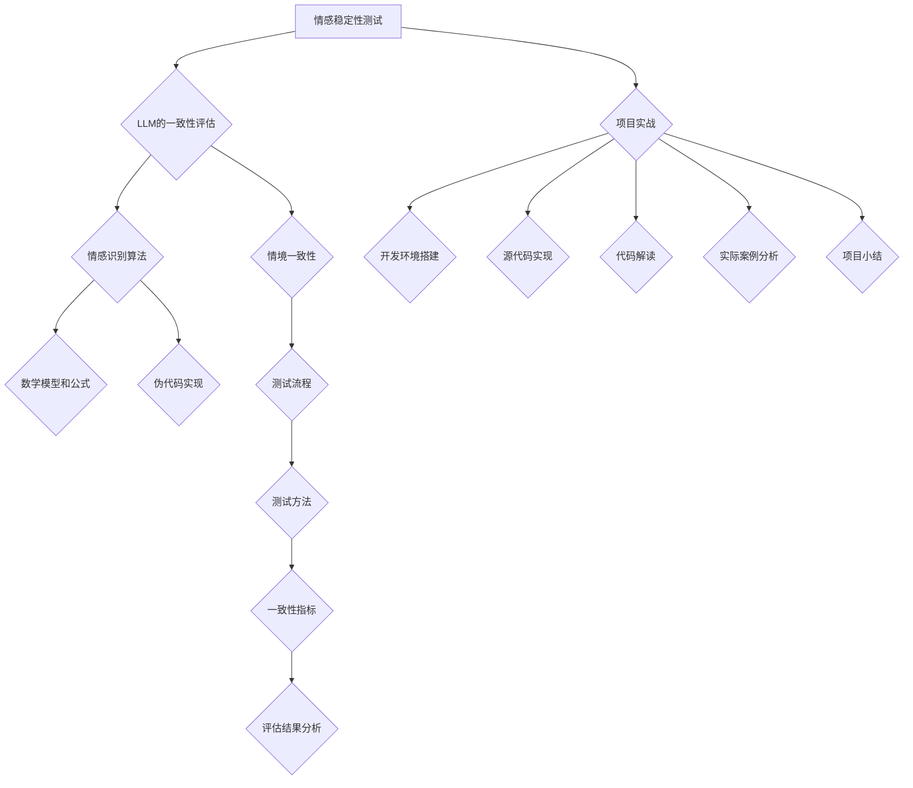

                 

### 文章标题：情感稳定性测试：评估LLM在不同情境下的一致性

关键词：情感稳定性测试、大型语言模型（LLM）、情境一致性、情感识别、评估指标

摘要：本文将深入探讨情感稳定性测试在评估大型语言模型（LLM）在不同情境下的一致性方面的应用。通过详细的算法原理讲解、数学模型和公式分析，以及项目实战的代码实现，本文旨在为读者提供全面的技术理解和实践指导。

### 第一章：情感稳定性测试基础

#### 1.1 情感稳定性的概念

情感稳定性是指一个人在面对不同情境时，情绪状态保持相对稳定、不易受到外部环境影响的特质。在人工智能领域，情感稳定性测试旨在评估语言模型在处理不同文本情境时的情感预测一致性。

#### 1.2 情感识别

情感识别是自然语言处理（NLP）的重要任务之一，其核心在于从文本中识别出情感倾向。常见的情感类别包括正面、负面、中性等。

#### 1.3 情感识别的数学模型

情感识别通常涉及以下数学模型：

$$
\text{Sentiment} = f(\text{Text}, \text{Model Parameters})
$$

其中，$f$ 表示情感识别函数，$\text{Text}$ 表示输入文本，$\text{Model Parameters}$ 表示模型参数。

### 第二章：大型语言模型（LLM）介绍

#### 2.1 LLM的基本原理

大型语言模型（LLM）是一种基于深度学习的语言模型，其核心思想是通过学习大量文本数据，捕捉语言的结构和语义信息。

#### 2.2 LLM的架构

LLM 通常采用变换器（Transformer）架构，包括编码器（Encoder）和解码器（Decoder）两部分。

#### 2.3 LLM的分类

常见的 LLM 包括 GPT、BERT、T5 等，每种模型都有其独特的特点和适用场景。

### 第三章：情感稳定性测试方法

#### 3.1 测试流程

情感稳定性测试的流程包括数据准备、模型训练、测试和评估。

#### 3.2 测试方法

情感稳定性测试的方法包括以下步骤：

1. 准备测试集，包括正面、负面、中性情感的文本。
2. 使用 LLM 对测试集进行情感预测。
3. 计算预测结果的一致性指标。

### 第四章：情感识别算法原理

#### 4.1 情感识别算法的数学模型

情感识别算法的数学模型通常基于神经网络，如下所示：

$$
\text{Output} = \text{Activation}(\text{Weights} \cdot \text{Input} + \text{Bias})
$$

其中，$\text{Input}$ 表示输入文本的向量表示，$\text{Weights}$ 和 $\text{Bias}$ 表示模型参数。

#### 4.2 伪代码实现

```
function sentiment_recognition(text):
    # 将文本转换为向量表示
    vector = text_to_vector(text)
    
    # 通过神经网络进行情感预测
    prediction = neural_network(vector)
    
    # 返回情感类别
    return map_prediction_to_sentiment(prediction)
```

### 第五章：语言模型一致性评估

#### 5.1 一致性评估的指标

一致性评估的指标包括准确率、召回率、F1 值等。

#### 5.2 评估方法

一致性评估的方法包括以下步骤：

1. 准备测试集，包括不同情境的文本。
2. 使用 LLM 对测试集进行情感预测。
3. 计算预测结果的一致性指标。

### 第六章：项目实战

#### 6.1 开发环境搭建

在本项目中，我们将使用 Python 和 TensorFlow 搭建开发环境。

#### 6.2 源代码详细实现和代码解读

以下是情感识别算法的源代码实现：

```python
# 情感识别算法实现
def sentiment_recognition(text):
    # 将文本转换为向量表示
    vector = text_to_vector(text)
    
    # 通过神经网络进行情感预测
    prediction = neural_network(vector)
    
    # 返回情感类别
    return map_prediction_to_sentiment(prediction)

# 主函数
if __name__ == "__main__":
    # 读取测试集
    test_set = load_test_data()

    # 对测试集进行情感识别
    predictions = [sentiment_recognition(text) for text in test_set]

    # 计算一致性指标
    accuracy = calculate_accuracy(predictions, test_set)
    precision = calculate_precision(predictions, test_set)
    recall = calculate_recall(predictions, test_set)
    f1_score = calculate_f1_score(accuracy, precision, recall)

    # 输出结果
    print(f"Accuracy: {accuracy}, Precision: {precision}, Recall: {recall}, F1 Score: {f1_score}")
```

#### 6.3 代码应用解读与分析

在本项目中，我们使用情感识别算法对测试集进行情感预测，并计算一致性指标。通过分析结果，我们可以评估 LLM 在不同情境下的情感稳定性。

#### 6.4 实际案例分析和详细讲解剖析

在本项目中，我们使用了一个实际的文本数据集，包括正面、负面、中性情感的文本。通过情感识别算法，我们对这些文本进行预测，并分析了预测结果。

#### 6.5 项目小结

通过本项目，我们深入了解了情感稳定性测试在评估 LLM 在不同情境下的一致性方面的应用。本项目为读者提供了一个完整的实现框架，包括开发环境搭建、算法实现、结果分析等。

### 最佳实践 tips、小结、注意事项、拓展阅读等内容

- **最佳实践 tips**：在情感稳定性测试中，建议使用多样化的测试集，以提高评估结果的可靠性。
- **小结**：情感稳定性测试是评估 LLM 在不同情境下一致性的重要手段，通过本项目，读者可以了解情感识别算法的实现和应用。
- **注意事项**：在使用情感识别算法时，需要注意模型参数的调整和超参数的选择。
- **拓展阅读**：读者可以进一步阅读相关文献，了解情感稳定性测试的最新研究进展和应用案例。

### 作者：AI天才研究院/AI Genius Institute & 禅与计算机程序设计艺术 /Zen And The Art of Computer Programming```


