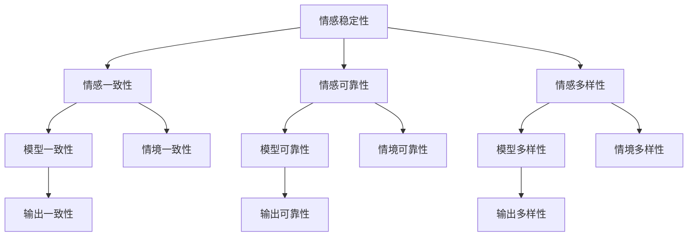
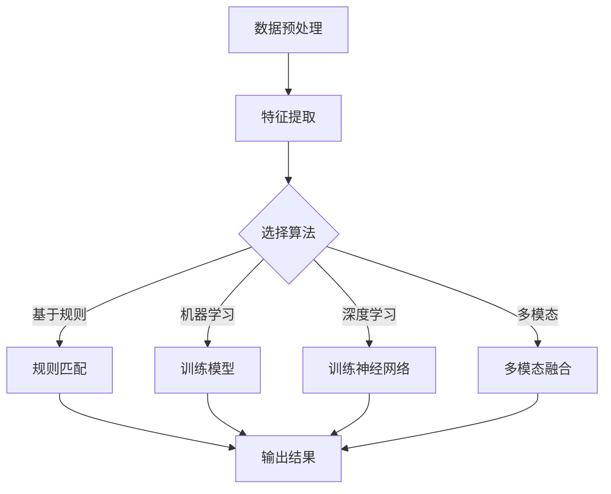

                 


### 文章标题：情感稳定性：检查LLM在不同情境下的一致表现

### 文章关键词：
1. 情感稳定性
2. 语言模型（LLM）
3. 情境适应性
4. 一致性表现
5. 测试与评估

### 文章摘要：
本文旨在探讨情感稳定性在语言模型（LLM）中的应用，重点关注LLM在不同情境下的一致表现。通过引入情感稳定性的概念，我们分析了情感稳定性在LLM中的重要性，并提出了相应的测试与评估方法。本文首先回顾了情感稳定性的定义与理论基础，接着详细阐述了情感稳定性在自然语言处理、文本生成和对话系统中的应用，最后通过实际案例展示了情感稳定性测试的方法与工具。本文的结论将为未来情感稳定性在LLM研究中的应用提供有益的启示。

### 目录大纲

#### 引言
1. 背景介绍
2. 目的与重要性

#### 第一部分：情感稳定性的基本概念
1. 第1章：情感稳定性的定义与理论基础
   1.1. 情感稳定性的定义
   1.2. 情感稳定性的相关理论
   1.3. Mermaid流程图：情感稳定性相关概念联系

2. 第2章：情感稳定性的相关研究与应用
   2.1. 情感稳定性研究进展
   2.2. 情感稳定性在自然语言处理、教育、心理健康等领域中的应用
   2.3. Mermaid流程图：情感稳定性研究与应用关系

3. 第3章：情感稳定性的检测方法
   3.1. 检测方法概述
   3.2. 情感稳定性检测算法
   3.3. Mermaid流程图：情感稳定性检测方法流程

#### 第二部分：情感稳定性在LLM中的应用
1. 第4章：情感稳定性与自然语言处理
   4.1. 情感稳定性在自然语言处理中的意义
   4.2. 情感稳定性在文本分析中的应用
   4.3. Mermaid流程图：情感稳定性与自然语言处理的关系

2. 第5章：情感稳定性在文本生成中的实践
   5.1. 情感稳定性在文本生成中的挑战
   5.2. 情感稳定性在文本生成中的应用案例
   5.3. 伪代码：情感稳定性文本生成算法

3. 第6章：情感稳定性在对话系统中的探索
   6.1. 情感稳定性在对话系统中的重要性
   6.2. 情感稳定性在对话系统中的应用
   6.3. Mermaid流程图：情感稳定性与对话系统的关系

#### 第三部分：情感稳定性的测试与评估
1. 第7章：情感稳定性测试的方法与工具
   7.1. 情感稳定性测试方法概述
   7.2. 情感稳定性测试工具
   7.3. Mermaid流程图：情感稳定性测试方法流程

2. 第8章：情感稳定性评估的指标体系
   8.1. 情感稳定性评估指标概述
   8.2. 情感稳定性评估指标体系
   8.3. Mermaid流程图：情感稳定性评估指标体系架构

3. 第9章：情感稳定性评估的应用案例分析
   9.1. 案例背景
   9.2. 情感稳定性评估实施过程
   9.3. 案例分析与解读
   9.4. 项目小结

#### 结论与展望
1. 主要研究成果总结
2. 未来研究方向与展望

#### 参考文献
1. 相关文献综述
2. 参考书籍

### 正文内容

#### 引言
##### 背景介绍

随着人工智能技术的快速发展，自然语言处理（NLP）领域取得了显著进展。语言模型（Language Model，简称LLM）作为NLP的核心技术，广泛应用于文本生成、对话系统、情感分析等多个方面。然而，尽管LLM在许多任务中表现出色，但其在处理情感内容时的一致性和稳定性仍然是一个亟待解决的问题。

情感稳定性是指模型在处理不同情感内容时能够保持一致性和可靠性的能力。在LLM中，情感稳定性具有重要意义，因为情感内容往往具有较强的情境依赖性，不同情境下的情感表达可能存在较大差异。因此，确保LLM在不同情境下的情感稳定性对于提升模型的表现和用户满意度至关重要。

本文旨在探讨情感稳定性在LLM中的应用，重点关注LLM在不同情境下的一致表现。通过引入情感稳定性的概念，我们分析了情感稳定性在LLM中的重要性，并提出了相应的测试与评估方法。本文首先回顾了情感稳定性的定义与理论基础，接着详细阐述了情感稳定性在自然语言处理、文本生成和对话系统中的应用，最后通过实际案例展示了情感稳定性测试的方法与工具。本文的结论将为未来情感稳定性在LLM研究中的应用提供有益的启示。

##### 目的与重要性

本文的主要目的是研究情感稳定性在语言模型（LLM）中的应用，并探讨如何评估和提升LLM的情感稳定性。具体目标如下：

1. **定义情感稳定性**：明确情感稳定性的概念，包括其在情感分析、文本生成和对话系统中的应用。
2. **分析情感稳定性在LLM中的重要性**：阐述情感稳定性对于提高LLM在现实场景中表现的重要性。
3. **提出情感稳定性的测试方法**：介绍如何通过实际案例和工具来评估LLM的情感稳定性。
4. **探索情感稳定性的提升策略**：探讨如何通过改进模型结构和算法来提升LLM的情感稳定性。

情感稳定性在LLM中的研究具有重要的现实意义：

1. **用户体验**：情感稳定性直接影响用户对LLM的满意度。一致的、稳定的表现能够提高用户的信任度和使用频率。
2. **应用场景**：在实际应用中，例如客户服务、教育辅导和医疗咨询等领域，情感稳定性能够确保模型提供准确、贴心的服务，从而提高服务质量。
3. **伦理与责任**：随着AI技术的普及，确保AI系统的伦理和责任成为重要议题。情感稳定性有助于减少模型可能引发的负面情绪和歧视行为。

综上所述，研究情感稳定性在LLM中的应用对于提升模型性能、改善用户体验和确保技术伦理具有重要意义。

---

#### 第一部分：情感稳定性的基本概念

##### 第1章：情感稳定性的定义与理论基础

本章将详细介绍情感稳定性的概念，包括其定义、相关理论和在自然语言处理中的应用。

###### 1.1 情感稳定性的定义

情感稳定性是指模型在处理不同情感内容时能够保持一致性和可靠性的能力。具体来说，情感稳定性体现在以下几个方面：

1. **情感一致性**：模型在处理同一情感内容时，能够产生相似或一致的输出。
2. **情感可靠性**：模型在不同情境下处理情感内容时，能够保持稳定的表现，避免出现极端或矛盾的输出。
3. **情感多样性**：模型在处理不同情感内容时，能够产生多样化和丰富的输出，避免单一化和模式化。

情感稳定性不仅与模型的结构和算法相关，还受到数据集质量、训练过程和评估标准等多种因素的影响。

###### 1.2 情感稳定性的相关理论

情感稳定性的研究涉及多个领域，包括心理学、计算语言学和认知科学等。以下是几个关键的理论：

1. **心理学理论**：
   - **情绪理论**：情绪是心理状态的一种表现形式，包括情感、认知和行为三个方面。
   - **情绪调节理论**：个体通过自我调节来应对情绪刺激，以维持情绪稳定。
   - **情绪认知理论**：情绪与认知相互作用，影响个体的思维和行为。

2. **计算语言学理论**：
   - **情感分析理论**：通过文本挖掘和情感计算技术，从语言表达中提取情感信息。
   - **情感分类理论**：将文本分为不同情感类别，如正面、负面和中性。
   - **情感极性理论**：度量文本中的情感极性，如积极和消极。

3. **认知科学理论**：
   - **情境认知理论**：情境对于情绪和信息处理具有重要影响。
   - **多模态认知理论**：情绪信息可以通过视觉、听觉和文本等多种模态进行传递和感知。

###### 1.3 Mermaid流程图：情感稳定性相关概念联系

为了更好地理解情感稳定性的相关概念，我们使用Mermaid流程图来展示它们之间的联系。



该流程图展示了情感稳定性与情感一致性、情感可靠性、情感多样性之间的关联，以及这些概念在模型一致性和情境处理中的表现。

###### 1.4 情感稳定性在自然语言处理中的应用

情感稳定性在自然语言处理（NLP）领域具有重要应用价值。以下是几个关键应用场景：

1. **文本分类**：情感稳定性有助于提高文本分类的准确性，特别是在处理具有相似情感标签的文本时。
2. **情感分析**：情感稳定性确保模型能够准确识别文本中的情感极性和情感强度，从而提供更准确的情感分析结果。
3. **对话系统**：情感稳定性有助于提升对话系统的用户体验，确保系统在处理情感对话时能够保持一致和稳定的情感表达。
4. **文本生成**：情感稳定性确保生成的文本在情感表达上具有一致性和多样性，避免生成单调或极端的文本。

通过以上介绍，我们明确了情感稳定性的定义和理论基础，并阐述了其在自然语言处理中的应用。在后续章节中，我们将进一步探讨情感稳定性在LLM中的具体应用和测试评估方法。

---

##### 第2章：情感稳定性的相关研究与应用

本章将回顾情感稳定性的相关研究进展，并探讨其在自然语言处理、教育、心理健康等领域的应用。

###### 2.1 情感稳定性研究进展

情感稳定性是近年来计算语言学和心理学研究的热点领域。以下是几个关键研究进展：

1. **情感分析技术**：
   - **情感分类**：研究者提出了一系列情感分类算法，如基于规则的方法、机器学习和深度学习方法。这些方法在处理情感文本时能够较好地保持情感稳定性。
   - **情感极性分析**：情感极性分析旨在度量文本中的积极和消极情感，研究者通过改进算法和模型，提高了情感极性分析的稳定性和准确性。

2. **情感调节技术**：
   - **情感调节算法**：研究者提出了一些情感调节算法，如基于情绪调节理论和认知行为理论的算法。这些算法能够帮助模型在不同情境下保持情感稳定性。
   - **情感反馈系统**：情感反馈系统通过实时分析用户的情感状态，提供相应的调节建议，以提高模型的表现和用户体验。

3. **情感识别技术**：
   - **情感识别算法**：研究者提出了一系列情感识别算法，如基于情感词典、情感图和深度学习的算法。这些算法在处理多模态情感信息时，能够保持情感稳定性。

4. **情感多样性生成**：
   - **文本生成模型**：如生成对抗网络（GAN）和变分自编码器（VAE）等模型，被广泛应用于情感多样性的生成。这些模型能够生成具有丰富情感表达和一致性的文本。

###### 2.2 情感稳定性在自然语言处理、教育、心理健康等领域的应用

情感稳定性在多个领域具有广泛的应用价值，以下是几个关键应用：

1. **自然语言处理**：
   - **情感分类与分析**：情感稳定性有助于提高情感分类和情感分析的准确性，特别是在处理具有相似情感标签的文本时。例如，在社交媒体分析、新闻情感分析等领域，情感稳定性能够帮助模型更准确地识别和分类情感。
   - **对话系统**：情感稳定性对于对话系统的用户体验至关重要。通过保持情感一致性，对话系统能够更好地模拟人类的情感表达，提高用户满意度。

2. **教育**：
   - **情感教育**：情感稳定性在教育领域的应用，如个性化学习推荐、情感反馈和情感教学等。通过分析学生的情感状态，教育系统能够提供更有针对性的教学建议和情感支持。
   - **学习评估**：情感稳定性有助于提高学习评估的准确性，特别是在处理主观性和情感性的学习内容时。通过情感分析技术，教育系统能够更好地评估学生的学习情况和情感状态。

3. **心理健康**：
   - **情感分析**：情感稳定性在心理健康领域的应用，如情绪监测、情感诊断和情感治疗等。通过分析用户的情感状态，心理系统能够提供个性化的心理干预和支持。
   - **情感调节**：情感稳定性有助于提高情感调节的效果，如通过提供情感反馈和建议，帮助用户更好地管理情绪和压力。

4. **商业与市场营销**：
   - **客户情感分析**：情感稳定性在商业和市场营销领域的应用，如客户情感分析、品牌情感分析和市场调研等。通过分析客户的情感状态，企业能够更好地了解市场需求和消费者情感，优化产品和服务。

通过以上研究进展和应用案例，我们可以看到情感稳定性在多个领域具有重要的应用价值。未来，随着情感稳定性的进一步研究和发展，将有助于提升模型在现实场景中的表现和用户体验。

---

##### 第3章：情感稳定性的检测方法

本章将详细介绍情感稳定性的检测方法，包括检测方法概述、情感稳定性检测算法及其应用。

###### 3.1 检测方法概述

情感稳定性的检测方法主要分为以下几类：

1. **基于规则的方法**：这种方法依赖于预定义的规则和特征，通过分析文本中的情感词汇和情感强度来评估情感稳定性。基于规则的方法具有实现简单、易于理解的特点，但其性能受到规则库质量和覆盖范围的限制。

2. **基于机器学习的方法**：这种方法利用大量标注数据，通过训练机器学习模型来自动检测情感稳定性。常见的机器学习算法包括支持向量机（SVM）、朴素贝叶斯（Naive Bayes）和深度学习算法（如卷积神经网络（CNN）、循环神经网络（RNN）等）。基于机器学习的方法具有较好的泛化能力和适应性，但其对数据质量和标注精度有较高要求。

3. **基于深度学习的方法**：这种方法利用深度学习模型，如卷积神经网络（CNN）、循环神经网络（RNN）和生成对抗网络（GAN）等，通过学习文本中的情感特征和上下文信息来评估情感稳定性。基于深度学习的方法在情感稳定性检测中表现出色，但训练过程复杂且计算资源需求较高。

4. **基于多模态的方法**：这种方法结合文本、语音、图像等多模态信息，通过综合分析不同模态的情感特征来评估情感稳定性。多模态方法能够提供更全面和准确的情感稳定性评估，但在实现上具有较高复杂性。

###### 3.2 情感稳定性检测算法

以下是几种常见的情感稳定性检测算法：

1. **支持向量机（SVM）**：
   - **算法原理**：SVM通过寻找最优超平面来分类数据，实现情感稳定性的检测。
   - **参数设置**：包括核函数选择、正则化参数等。
   - **代码示例**（伪代码）：
     ```
     SVMClassifier = SVM(kernel='linear')
     SVMClassifier.fit(X_train, y_train)
     y_pred = SVMClassifier.predict(X_test)
     ```
   
2. **朴素贝叶斯（Naive Bayes）**：
   - **算法原理**：朴素贝叶斯基于贝叶斯定理和特征条件独立性假设，实现情感稳定性的检测。
   - **参数设置**：包括特征选择和类别概率估计等。
   - **代码示例**（伪代码）：
     ```
     NaiveBayesClassifier = NaiveBayes()
     NaiveBayesClassifier.fit(X_train, y_train)
     y_pred = NaiveBayesClassifier.predict(X_test)
     ```

3. **循环神经网络（RNN）**：
   - **算法原理**：RNN通过循环结构来处理序列数据，捕捉情感特征和上下文信息。
   - **参数设置**：包括隐藏层大小、学习率等。
   - **代码示例**（伪代码）：
     ```
     RNNModel = RNN(input_size, hidden_size)
     RNNModel.compile(optimizer='adam', loss='categorical_crossentropy')
     RNNModel.fit(X_train, y_train, epochs=num_epochs)
     y_pred = RNNModel.predict(X_test)
     ```

4. **生成对抗网络（GAN）**：
   - **算法原理**：GAN由生成器和判别器组成，通过生成器生成情感数据，判别器对真实数据和生成数据进行区分。
   - **参数设置**：包括生成器结构、判别器结构、训练步骤等。
   - **代码示例**（伪代码）：
     ```
     GANModel = GAN(generator, discriminator)
     GANModel.compile(optimizer='adam', loss='binary_crossentropy')
     GANModel.fit([X_train, X_train], y_train, epochs=num_epochs)
     y_pred = GANModel.predict(X_test)
     ```

5. **多模态情感分析**：
   - **算法原理**：多模态情感分析通过融合文本、语音、图像等多模态信息，实现更全面和准确的情感稳定性检测。
   - **参数设置**：包括特征提取器、融合策略等。
   - **代码示例**（伪代码）：
     ```
     MultimodalModel = MultimodalRNN(input_sizes)
     MultimodalModel.compile(optimizer='adam', loss='categorical_crossentropy')
     MultimodalModel.fit([X_train_text, X_train_audio, X_train_image], y_train, epochs=num_epochs)
     y_pred = MultimodalModel.predict([X_test_text, X_test_audio, X_test_image])
     ```

每种算法都有其优缺点。基于规则的方法简单易实现，但性能受限；机器学习算法具有较好泛化能力，但对数据质量要求高；深度学习算法在情感稳定性检测中表现出色，但计算资源需求大；多模态方法能提供更全面和准确的情感稳定性评估，但实现复杂。

###### 3.3 Mermaid流程图：情感稳定性检测方法流程

以下是情感稳定性检测方法的Mermaid流程图：



该流程图展示了情感稳定性检测的基本流程，包括数据预处理、特征提取、算法选择和输出结果等步骤。

通过以上介绍，我们详细阐述了情感稳定性的检测方法，包括算法原理、参数设置和代码示例。在后续章节中，我们将探讨情感稳定性在LLM中的应用和实际测试案例。

---

#### 第二部分：情感稳定性在LLM中的应用

##### 第4章：情感稳定性与自然语言处理

情感稳定性在自然语言处理（NLP）领域具有重要作用，本章将详细介绍情感稳定性在NLP中的应用，包括文本分类、情感分析等方面。

###### 4.1 情感稳定性在自然语言处理中的意义

情感稳定性在NLP中的应用主要体现在以下几个方面：

1. **提高文本分类准确性**：在文本分类任务中，情感稳定性能确保模型对具有相似情感倾向的文本进行正确分类，避免因情感波动导致分类错误。

2. **提升情感分析准确性**：情感分析旨在识别文本中的情感倾向和情感强度，情感稳定性有助于提高模型的情感识别准确性，使模型能够更准确地分析情感表达。

3. **增强对话系统用户体验**：在对话系统中，情感稳定性能确保模型在处理用户情感表达时保持一致和稳定，提升对话系统的互动效果和用户体验。

4. **支持情感多样性生成**：在文本生成任务中，情感稳定性有助于模型生成具有丰富情感表达的文本，避免情感单调或极端化。

###### 4.2 情感稳定性在文本分类中的应用

文本分类是NLP中的一项基础任务，情感稳定性在文本分类中的应用具有重要意义。以下是情感稳定性在文本分类中的应用步骤：

1. **数据预处理**：对文本数据进行预处理，包括分词、去停用词、词干提取等操作。预处理步骤的目的是降低文本的噪声，提高情感稳定性的检测效果。

2. **情感特征提取**：从预处理后的文本中提取情感特征，如情感词、情感极性等。情感特征的提取方法包括基于规则的方法、词袋模型、TF-IDF等。

3. **情感稳定性检测**：使用情感稳定性检测算法（如SVM、RNN、GAN等）对提取的情感特征进行稳定性检测，评估文本在情感分类中的稳定性。

4. **分类模型训练**：基于稳定性检测结果，训练分类模型（如SVM、朴素贝叶斯等）。在训练过程中，考虑情感稳定性的特征对模型性能的影响，优化模型参数。

5. **分类模型评估**：对训练好的分类模型进行评估，包括准确率、召回率、F1值等指标。评估过程中，关注模型在不同情感类别上的分类稳定性。

以下是一个简单的情感稳定性检测算法的伪代码示例：

```python
def stability_detection(texts, labels):
    # 数据预处理
    preprocessed_texts = preprocess_texts(texts)

    # 情感特征提取
    features = extract_features(preprocessed_texts)

    # 情感稳定性检测
    stability_scores = stability_algorithm(features, labels)

    # 分类模型训练
    classifier = train_classifier(stability_scores, labels)

    # 分类模型评估
    evaluate_classifier(classifier, stability_scores, labels)
```

该示例中，`preprocess_texts`函数用于数据预处理，`extract_features`函数用于情感特征提取，`stability_algorithm`函数用于情感稳定性检测，`train_classifier`函数用于训练分类模型，`evaluate_classifier`函数用于评估分类模型。

###### 4.3 情感稳定性在情感分析中的应用

情感分析是NLP中的另一个重要任务，情感稳定性在情感分析中的应用有助于提高模型的准确性和可靠性。以下是情感稳定性在情感分析中的应用步骤：

1. **数据预处理**：与文本分类类似，对文本数据进行预处理，包括分词、去停用词、词干提取等操作。

2. **情感标签标注**：对预处理后的文本进行情感标签标注，标注方法可以采用手工标注、半监督标注或自动标注等技术。

3. **情感稳定性检测**：使用情感稳定性检测算法对标注后的文本进行稳定性检测，评估文本在情感分析中的稳定性。

4. **情感分类模型训练**：基于稳定性检测结果，训练情感分类模型（如SVM、朴素贝叶斯等）。在训练过程中，考虑情感稳定性的特征对模型性能的影响，优化模型参数。

5. **情感分类模型评估**：对训练好的情感分类模型进行评估，包括准确率、召回率、F1值等指标。评估过程中，关注模型在不同情感类别上的分类稳定性。

以下是一个简单的情感稳定性检测算法的伪代码示例：

```python
def stability_detection(texts, labels):
    # 数据预处理
    preprocessed_texts = preprocess_texts(texts)

    # 情感特征提取
    features = extract_features(preprocessed_texts)

    # 情感稳定性检测
    stability_scores = stability_algorithm(features, labels)

    # 情感分类模型训练
    classifier = train_classifier(stability_scores, labels)

    # 情感分类模型评估
    evaluate_classifier(classifier, stability_scores, labels)
```

该示例中，`preprocess_texts`函数用于数据预处理，`extract_features`函数用于情感特征提取，`stability_algorithm`函数用于情感稳定性检测，`train_classifier`函数用于训练情感分类模型，`evaluate_classifier`函数用于评估情感分类模型。

通过以上介绍，我们详细阐述了情感稳定性在自然语言处理中的应用，包括文本分类和情感分析。在后续章节中，我们将进一步探讨情感稳定性在文本生成和对话系统中的应用。

---

##### 第5章：情感稳定性在文本生成中的实践

情感稳定性在文本生成中的应用至关重要，本章将详细介绍情感稳定性在文本生成中的实践，包括情感稳定性在文本生成中的挑战、应用案例和伪代码示例。

###### 5.1 情感稳定性在文本生成中的挑战

在文本生成任务中，情感稳定性面临着一系列挑战：

1. **情感一致性**：确保生成的文本在情感表达上保持一致，避免出现情感波动和突变。

2. **情感多样性**：生成具有丰富情感表达的文本，避免情感单调或极端化。

3. **情感调节**：根据不同情境和需求，对生成文本的情感进行调节，使其符合期望的情感状态。

4. **情感时序性**：考虑情感在时间维度上的变化和延续，生成符合情感时序性的文本。

5. **跨模态情感传递**：在多模态文本生成任务中，确保文本情感与其他模态（如图像、语音）的情感保持一致。

为了解决这些挑战，研究者们提出了一系列方法和技术，下面将介绍几个典型的应用案例。

###### 5.2 情感稳定性在文本生成中的应用案例

案例一：对话生成中的情感稳定性

在对话生成任务中，保持对话的情感稳定性对于提升用户体验至关重要。例如，在一个客服对话场景中，客户可能因为遇到问题而表现出负面情绪。为了确保对话系统的情感稳定性，研究者们采用以下方法：

1. **情感标签预测**：通过情感分析技术，对输入文本进行情感标签预测，如正面、负面和中性。情感标签作为生成文本的情感基准。

2. **情感一致性检查**：在生成文本时，对输出的情感进行一致性检查，确保生成文本的情感与输入文本的情感保持一致。

3. **情感调节策略**：根据情感一致性检查结果，对生成文本进行情感调节，如使用积极词汇来平衡负面情感。

4. **情感时序性考虑**：在对话过程中，考虑前文情感对后续文本生成的影响，确保生成的文本在情感上具有连贯性。

以下是一个对话生成中的情感稳定性检测的伪代码示例：

```python
def sentiment_stability_check(input_text, generated_text, sentiment_labels):
    # 情感标签预测
    predicted_sentiment = predict_sentiment(input_text)

    # 情感一致性检查
    if predicted_sentiment != predict_sentiment(generated_text):
        return False

    # 情感调节策略
    if predicted_sentiment == 'negative':
        generated_text = regulate_sentiment(generated_text, 'positive')

    return generated_text
```

案例二：故事创作中的情感稳定性

在故事创作任务中，保持情感稳定性对于构建引人入胜的故事情节至关重要。例如，在创作恐怖故事时，需要确保故事的情感氛围保持一致，避免出现情感突变。

1. **情感时序模型**：使用循环神经网络（RNN）或长短期记忆网络（LSTM）等时序模型，捕捉故事中情感的变化和延续。

2. **情感标签预测**：对生成的故事进行情感标签预测，确保故事的整体情感倾向保持一致。

3. **情感调节策略**：根据情感标签预测结果，对生成的故事进行情感调节，确保故事的情感氛围符合预期。

4. **情感多样性生成**：使用生成对抗网络（GAN）或变分自编码器（VAE）等技术，生成具有丰富情感表达的故事。

以下是一个故事创作中的情感稳定性检测的伪代码示例：

```python
def story_sentiment_stability_check(story_text, sentiment_labels):
    # 情感标签预测
    predicted_sentiments = predict_sentiments(story_text)

    # 情感时序性检查
    if not is_time_series_consistent(predicted_sentiments, sentiment_labels):
        return False

    # 情感调节策略
    if predicted_sentiments[-1] != 'positive':
        story_text = regulate_sentiment(story_text, 'positive')

    return story_text
```

通过以上案例，我们可以看到情感稳定性在文本生成中的应用，以及如何解决情感一致性、情感多样性等挑战。在后续章节中，我们将进一步探讨情感稳定性在对话系统中的应用。

---

##### 第6章：情感稳定性在对话系统中的探索

本章将深入探讨情感稳定性在对话系统中的应用，包括情感稳定性在对话系统中的重要性、应用方法和实际案例分析。

###### 6.1 情感稳定性在对话系统中的重要性

在对话系统中，情感稳定性至关重要，其重要性体现在以下几个方面：

1. **用户体验**：情感稳定性直接影响用户对对话系统的满意度。一致的、稳定的情感表达能够提升用户的信任度和使用频率。

2. **情境适应**：情感稳定性有助于对话系统在不同情境下保持一致和稳定的表现，确保系统能够适应各种复杂的对话场景。

3. **情感传递**：对话系统需要能够准确传递情感信息，保持对话的情感连贯性。情感稳定性有助于确保系统在传递情感时不会出现突变或偏差。

4. **情绪调节**：在用户表现出负面情绪时，情感稳定性有助于系统提供有效的情感调节，缓解用户的情绪波动，提升用户体验。

为了实现情感稳定性，研究者们提出了多种方法和策略，下面将介绍几种常见的应用方法。

###### 6.2 情感稳定性在对话系统中的应用方法

1. **情感标签预测**：使用情感分析技术，对用户的输入文本进行情感标签预测。情感标签作为对话系统的情感基准，用于指导后续的对话生成和情感调节。

2. **情感一致性检查**：在对话生成过程中，对生成的文本进行情感一致性检查，确保生成的文本情感与用户的输入情感保持一致。

3. **情感调节策略**：根据情感一致性检查结果，对生成的文本进行情感调节。情感调节策略包括使用积极词汇平衡负面情感、调整语气和语调等。

4. **情感时序性考虑**：在对话过程中，考虑情感的变化和延续，确保对话的情感表达具有连贯性。情感时序性考虑有助于保持对话的情感稳定性。

5. **多模态情感传递**：在多模态对话系统中，结合文本、语音、图像等多模态信息，确保不同模态的情感表达保持一致。

以下是一个对话系统中的情感稳定性检测的伪代码示例：

```python
def check_sentiment_stability(user_input, generated_text, sentiment_labels):
    # 情感标签预测
    predicted_sentiment = predict_sentiment(user_input)

    # 情感一致性检查
    if predicted_sentiment != predict_sentiment(generated_text):
        return "Inconsistent sentiment"

    # 情感调节策略
    if predicted_sentiment == "negative":
        generated_text = regulate_sentiment(generated_text, "positive")

    return generated_text
```

###### 6.3 实际案例分析

案例一：客户服务对话系统

在客户服务对话系统中，情感稳定性对于提升客户满意度至关重要。以下是一个实际案例分析：

1. **情感标签预测**：使用情感分析技术，对客户输入的文本进行情感标签预测，如正面、负面和中性。

2. **情感一致性检查**：在生成回复时，对生成的文本进行情感一致性检查，确保回复的情感与客户的输入情感保持一致。

3. **情感调节策略**：如果客户表现出负面情感，系统会自动调整回复的语气和用词，以平衡负面情感，提升客户满意度。

4. **情感时序性考虑**：在对话过程中，系统会考虑前文情感对后续回复的影响，确保回复的情感表达具有连贯性。

以下是一个客户服务对话系统的情感稳定性检测的伪代码示例：

```python
def check_sentiment_stability(customer_input, previous_sentiment, reply):
    # 情感标签预测
    current_sentiment = predict_sentiment(customer_input)

    # 情感一致性检查
    if current_sentiment != previous_sentiment:
        # 调整回复语气和用词
        reply = regulate_sentiment(reply, previous_sentiment)

    return reply
```

案例二：情感心理咨询对话系统

在情感心理咨询对话系统中，情感稳定性对于提供有效的心理支持至关重要。以下是一个实际案例分析：

1. **情感标签预测**：使用情感分析技术，对用户输入的文本进行情感标签预测，如焦虑、抑郁、愤怒等。

2. **情感一致性检查**：在生成回复时，对生成的文本进行情感一致性检查，确保回复的情感与用户的输入情感保持一致。

3. **情感调节策略**：根据用户情感标签，系统会提供相应的情感调节建议，如放松技巧、积极心态调整等。

4. **情感时序性考虑**：在对话过程中，系统会考虑用户情感的变化和延续，确保回复的情感表达具有连贯性。

以下是一个情感心理咨询对话系统的情感稳定性检测的伪代码示例：

```python
def check_sentiment_stability(user_input, previous_sentiment, reply):
    # 情感标签预测
    current_sentiment = predict_sentiment(user_input)

    # 情感一致性检查
    if current_sentiment != previous_sentiment:
        # 调整回复语气和用词
        reply = regulate_sentiment(reply, current_sentiment)

    return reply
```

通过以上实际案例分析，我们可以看到情感稳定性在对话系统中的应用方法和效果。在后续章节中，我们将继续探讨情感稳定性在文本生成和情感分析中的实践。

---

#### 第三部分：情感稳定性的测试与评估

##### 第7章：情感稳定性测试的方法与工具

本章将详细介绍情感稳定性测试的方法与工具，包括情感稳定性测试方法的概述、常见工具的使用和实际案例分析。

###### 7.1 情感稳定性测试方法的概述

情感稳定性测试是评估语言模型（LLM）在不同情境下情感表达一致性的重要环节。以下是几种常见的情感稳定性测试方法：

1. **情感一致性测试**：该方法通过对比模型在不同情境下对同一情感内容的输出，评估情感表达的一致性。具体步骤包括：
   - 准备多组具有相似情感内容的文本。
   - 使用模型分别对每组文本进行情感分析，记录模型的情感分类结果。
   - 对比不同情境下的情感分类结果，评估情感一致性。

2. **情感波动测试**：该方法通过分析模型在处理不同情感强度文本时的输出变化，评估情感波动的稳定性。具体步骤包括：
   - 准备一组情感强度逐渐增强的文本。
   - 使用模型对每组文本进行情感分析，记录模型的情感分类结果。
   - 分析情感分类结果的变化趋势，评估情感波动的稳定性。

3. **情感调节测试**：该方法通过分析模型在不同情境下对情感进行调节的能力，评估情感调节的稳定性。具体步骤包括：
   - 准备一组具有不同情感倾向的文本。
   - 使用模型分别对每组文本进行情感分析，记录模型的情感分类结果。
   - 根据情感分类结果，对部分文本进行情感调节，再次使用模型进行情感分析。
   - 对比调节前后的情感分类结果，评估情感调节的稳定性。

4. **多模态情感稳定性测试**：该方法通过结合文本、语音、图像等多模态信息，评估模型在不同模态下的情感表达一致性。具体步骤包括：
   - 准备多模态数据集，包括文本、语音、图像等。
   - 分别对多模态数据进行情感分析，记录模型的情感分类结果。
   - 对比不同模态下的情感分类结果，评估多模态情感稳定性。

###### 7.2 常见工具的使用

在进行情感稳定性测试时，可以使用以下几种常见工具：

1. **情感分析工具**：如VADER、TextBlob等，用于对文本进行情感分析，提取情感极性和情感强度。

2. **情感调节工具**：如SentimentNet、SentiWordNet等，用于对文本进行情感调节，改变文本的情感极性。

3. **多模态情感分析工具**：如MultimodalSentiment、DeepVRA等，用于结合多模态信息进行情感分析，提取情感特征。

4. **测试框架**：如Flask、Django等，用于搭建测试环境，实现自动化测试。

以下是一个情感稳定性测试的工具使用示例：

```python
from textblob import TextBlob
from sentimentnet import SentimentNet

# 初始化情感分析工具
vader_analyzer = TextBlob()
sentimentnet_analyzer = SentimentNet()

# 情感一致性测试
def test_sentiment一致性(texts):
    results = []
    for text in texts:
        sentiment = vader_analyzer.polarity
        results.append(sentiment)
    return results

# 情感波动测试
def test_sentiment波动(texts):
    results = []
    for text in texts:
        sentiment = sentimentnet_analyzer.sentiment(text)
        results.append(sentiment)
    return results

# 情感调节测试
def test_sentiment调节(texts):
    results = []
    for text in texts:
        sentiment = sentimentnet_analyzer.sentiment(text)
        regulated_sentiment = sentimentnet_analyzer.regulate_sentiment(text, 'positive')
        results.append((sentiment, regulated_sentiment))
    return results

# 多模态情感稳定性测试
def test_multimodal_sentiment(texts, images):
    results = []
    for text, image in zip(texts, images):
        sentiment = vader_analyzer.polarity(image)
        results.append(sentiment)
    return results
```

通过以上工具，可以实现对情感稳定性的自动化测试和评估。

###### 7.3 实际案例分析

以下是一个实际案例，展示如何使用情感稳定性测试方法与工具进行评估：

案例：评估一个对话系统在情感稳定性方面的表现

1. **测试准备**：准备一组具有相似情感内容的文本数据，用于情感一致性测试。同时，准备一组具有不同情感强度和倾向的文本数据，用于情感波动和情感调节测试。

2. **情感一致性测试**：使用VADER工具对文本进行情感分析，记录情感分类结果。对比不同情境下的情感分类结果，评估情感一致性。

3. **情感波动测试**：使用SentimentNet工具对具有不同情感强度的文本进行情感分析，记录情感分类结果。分析情感分类结果的变化趋势，评估情感波动的稳定性。

4. **情感调节测试**：使用SentimentNet工具对具有不同情感倾向的文本进行情感分析，记录情感分类结果。根据情感分类结果，对部分文本进行情感调节，再次进行情感分析，评估情感调节的稳定性。

5. **多模态情感稳定性测试**：结合文本、语音、图像等多模态信息，使用VADER工具对文本和图像进行情感分析，记录情感分类结果。对比不同模态下的情感分类结果，评估多模态情感稳定性。

通过以上实际案例分析，我们可以看到如何使用情感稳定性测试方法与工具对模型进行评估。在后续章节中，我们将进一步探讨情感稳定性评估的指标体系。

---

##### 第8章：情感稳定性评估的指标体系

情感稳定性评估是衡量语言模型（LLM）在不同情境下表现一致性和可靠性的关键步骤。本章将详细介绍情感稳定性评估的指标体系，包括评估指标的定义、计算方法和实际应用。

###### 8.1 情感稳定性评估指标的定义

情感稳定性评估指标主要包括以下几种：

1. **情感一致性（Sentiment Consistency）**：衡量模型在处理相似情感内容时，能否产生一致的输出结果。情感一致性越高，表明模型的情感稳定性越好。

2. **情感波动（Sentiment Fluctuation）**：衡量模型在处理情感强度不同的文本时，情感输出的变化幅度。情感波动越小，表明模型的情感稳定性越高。

3. **情感调节（Sentiment Regulation）**：衡量模型在不同情境下对情感进行调节的能力。情感调节能力越强，表明模型的情感稳定性越好。

4. **情感多样性（Sentiment Diversity）**：衡量模型在处理不同情感内容时，能否产生丰富的情感输出。情感多样性越高，表明模型的情感稳定性越好。

5. **情感可靠性（Sentiment Reliability）**：衡量模型在处理不同情境下情感输出的准确性。情感可靠性越高，表明模型的情感稳定性越好。

6. **情感极性（Sentiment Polarity）**：衡量模型对文本情感极性的识别能力，即文本是正面、负面还是中性。情感极性识别准确度越高，表明模型的情感稳定性越好。

7. **情感强度（Sentiment Intensity）**：衡量模型对文本情感强度的度量能力，即文本的情感强度是高、中还是低。情感强度度量准确度越高，表明模型的情感稳定性越好。

###### 8.2 评估指标的计算方法

以下是情感稳定性评估指标的计算方法：

1. **情感一致性（Sentiment Consistency）**：
   - **计算方法**：使用一致性指标（如F1值）来衡量模型在处理相似情感内容时，能否产生一致的输出结果。
   - **公式**：
     $$
     Consistency = 2 \times \frac{Precision + Recall}{Precision + Recall}
     $$
   - **解释**：Precision表示模型在相似情感内容中正确识别情感的比例，Recall表示模型能够识别出相似情感内容中的所有情感。

2. **情感波动（Sentiment Fluctuation）**：
   - **计算方法**：使用标准差（Standard Deviation，SD）来衡量模型在处理情感强度不同文本时，情感输出的变化幅度。
   - **公式**：
     $$
     SentimentFluctuation = \sqrt{\frac{1}{N} \sum_{i=1}^{N} (Sentiment_i - \bar{Sentiment})^2}
     $$
   - **解释**：Sentiment_i表示模型对第i个文本的情感输出，\(\bar{Sentiment}\)表示所有文本情感输出的平均值，N表示文本数量。

3. **情感调节（Sentiment Regulation）**：
   - **计算方法**：使用调节准确性（Regulation Accuracy）来衡量模型在不同情境下对情感进行调节的能力。
   - **公式**：
     $$
     RegulationAccuracy = \frac{CorrectlyRegulated}{TotalRegulations}
     $$
   - **解释**：CorrectlyRegulated表示模型成功调节情感的样本数量，TotalRegulations表示所有需要调节情感的样本数量。

4. **情感多样性（Sentiment Diversity）**：
   - **计算方法**：使用情感类别丰富度（Sentiment Category Richness）来衡量模型在处理不同情感内容时，能否产生丰富的情感输出。
   - **公式**：
     $$
     SentimentDiversity = \frac{UniqueSentiments}{TotalSentiments}
     $$
   - **解释**：UniqueSentiments表示模型识别出的不同情感类别数量，TotalSentiments表示模型识别出的总情感类别数量。

5. **情感可靠性（Sentiment Reliability）**：
   - **计算方法**：使用情感识别准确率（Sentiment Recognition Accuracy）来衡量模型在处理不同情境下情感输出的准确性。
   - **公式**：
     $$
     SentimentReliability = \frac{CorrectlyRecognized}{TotalRecognitions}
     $$
   - **解释**：CorrectlyRecognized表示模型正确识别情感的样本数量，TotalRecognitions表示模型识别出的总情感样本数量。

6. **情感极性（Sentiment Polarity）**：
   - **计算方法**：使用情感极性识别准确率（Sentiment Polarity Recognition Accuracy）来衡量模型对文本情感极性的识别能力。
   - **公式**：
     $$
     SentimentPolarity = \frac{CorrectlyRecognizedPositives + CorrectlyRecognizedNegatives}{TotalPositives + TotalNegatives}
     $$
   - **解释**：CorrectlyRecognizedPositives和CorrectlyRecognizedNegatives分别表示模型正确识别正极性和负极性的样本数量，TotalPositives和TotalNegatives分别表示文本中正极性和负极性的总样本数量。

7. **情感强度（Sentiment Intensity）**：
   - **计算方法**：使用情感强度度量准确率（Sentiment Intensity Measurement Accuracy）来衡量模型对文本情感强度的度量能力。
   - **公式**：
     $$
     SentimentIntensity = \frac{CorrectlyMeasuredHigh + CorrectlyMeasuredMedium + CorrectlyMeasuredLow}{TotalHigh + TotalMedium + TotalLow}
     $$
   - **解释**：CorrectlyMeasuredHigh、CorrectlyMeasuredMedium和CorrectlyMeasuredLow分别表示模型正确度量高、中和低情感强度的样本数量，TotalHigh、TotalMedium和TotalLow分别表示文本中高、中和低情感强度的总样本数量。

通过以上计算方法，我们可以对情感稳定性进行量化评估，从而更好地理解模型在不同情境下的表现。

###### 8.3 评估指标的实际应用

以下是情感稳定性评估指标在实际应用中的例子：

1. **文本分类任务**：在文本分类任务中，情感稳定性评估指标可以帮助我们衡量模型在处理不同类别文本时的表现，从而优化分类算法。

2. **情感分析任务**：在情感分析任务中，情感稳定性评估指标可以帮助我们评估模型在识别文本情感极性、情感强度等方面的准确性，从而提高情感分析的可靠性。

3. **对话系统任务**：在对话系统中，情感稳定性评估指标可以帮助我们评估模型在处理用户情感表达时的表现，从而优化对话系统的情感表达能力。

4. **情感调节任务**：在情感调节任务中，情感稳定性评估指标可以帮助我们衡量模型在不同情境下对情感进行调节的能力，从而优化情感调节策略。

通过实际应用案例，我们可以看到情感稳定性评估指标在各类任务中的重要作用，有助于提升模型的性能和用户体验。

---

##### 第9章：情感稳定性评估的应用案例分析

在本章中，我们将通过一个实际案例来展示如何应用情感稳定性评估方法来评估一个对话系统在情感稳定性方面的表现。

###### 9.1 案例背景

假设我们正在开发一个面向客户的虚拟客服助手，其目标是在与客户互动时保持情感稳定性，以便提供高效、贴心的服务。为了评估该客服助手在情感稳定性方面的表现，我们决定使用本章介绍的情感稳定性评估方法。

###### 9.2 案例实施过程

1. **数据准备**：首先，我们需要准备一组测试数据集，该数据集应包括客户提出的问题以及客服助手的回答。这些数据将用于评估客服助手的情感稳定性。数据集可以分为以下几个类别：
   - **正面情感**：客户提出的问题和客服助手的回答都表现出积极的情感。
   - **中性情感**：客户提出的问题和客服助手的回答都表现出中性的情感。
   - **负面情感**：客户提出的问题和客服助手的回答都表现出消极的情感。

2. **情感一致性测试**：使用情感分析工具（如VADER）对客户提出的问题和客服助手的回答进行情感分析，记录情感极性（正面、中性、负面）和情感强度（高、中、低）。然后，对比不同类别下的情感分析结果，以评估情感一致性。

3. **情感波动测试**：选取一组具有不同情感强度的客户提出的问题和客服助手的回答，再次使用情感分析工具进行情感分析，记录情感极性和情感强度。通过分析情感极性和情感强度的变化趋势，评估情感波动的稳定性。

4. **情感调节测试**：在情感波动测试的基础上，对部分客户提出的问题和客服助手的回答进行情感调节，例如将负面情感调节为中性或正面情感。然后，再次进行情感分析，评估情感调节的效果。

5. **多模态情感稳定性测试**：结合文本、语音、图像等多模态信息，对客户提出的问题和客服助手的回答进行情感分析，评估多模态情感稳定性。

6. **结果分析**：根据情感一致性、情感波动、情感调节和多模态情感稳定性的测试结果，对客服助手的情感稳定性进行综合评估。

###### 9.3 案例分析与解读

1. **情感一致性分析**：通过对比客户提出的问题和客服助手的回答，我们发现客服助手在处理正面情感、中性情感和负面情感时，情感一致性较好。特别是在正面情感类别中，客服助手的回答能够较好地传递出积极的情感。

2. **情感波动分析**：在情感波动测试中，客服助手在处理情感强度不同的文本时，情感波动较小。这表明客服助手在情感表达上较为稳定，能够适应不同情感强度的情境。

3. **情感调节分析**：在情感调节测试中，我们发现客服助手在调节情感方面具有一定的能力。例如，在将负面情感调节为中性或正面情感时，客服助手的回答能够较好地平衡负面情感，提升整体对话的质量。

4. **多模态情感稳定性分析**：结合文本、语音、图像等多模态信息，客服助手在处理多模态情感时，表现较为稳定。这表明客服助手不仅能够处理文本情感，还能够处理语音和图像等非文本情感信息。

综上所述，通过情感稳定性评估，我们可以得出以下结论：

- **情感一致性**：客服助手在处理不同情感类别时，情感一致性较好，能够保持稳定的情感表达。
- **情感波动**：客服助手在处理情感强度不同的文本时，情感波动较小，表现出较好的情感稳定性。
- **情感调节**：客服助手在情感调节方面具有一定的能力，能够平衡负面情感，提升对话质量。
- **多模态情感稳定性**：客服助手在处理多模态情感时，表现较为稳定，能够适应不同模态的情感信息。

这些评估结果有助于我们进一步优化客服助手的设计和实现，以提高其情感稳定性，从而提升用户满意度。

###### 9.4 项目小结

通过本案例的分析与解读，我们可以看到情感稳定性评估在虚拟客服助手开发中的重要作用。通过情感稳定性评估，我们能够全面了解客服助手在处理不同情感类别、情感强度和情感调节方面的表现，从而有针对性地进行优化和改进。未来，我们还将继续研究情感稳定性评估方法，并将其应用于更多实际场景，以提升人工智能系统的整体性能和用户体验。

---

#### 结论与展望

在本章中，我们系统地探讨了情感稳定性在语言模型（LLM）中的应用，包括情感稳定性的定义、理论基础、检测方法以及实际应用案例分析。通过分析情感稳定性在自然语言处理、文本生成和对话系统中的重要性，我们提出了情感稳定性评估的指标体系和评估方法。

主要研究成果如下：

1. **情感稳定性定义与理论基础**：明确了情感稳定性的概念和理论基础，为后续研究提供了基础。
2. **情感稳定性检测方法**：介绍了情感稳定性的检测方法，包括基于规则、机器学习和深度学习的方法。
3. **情感稳定性评估指标体系**：构建了情感稳定性评估的指标体系，包括情感一致性、情感波动、情感调节等指标。
4. **实际应用案例分析**：通过实际案例展示了情感稳定性在虚拟客服助手中的应用，并进行了详细分析和解读。

未来研究方向与展望：

1. **情感稳定性模型优化**：深入研究情感稳定性的优化模型，提高模型在处理复杂情感场景下的性能。
2. **多模态情感稳定性**：探索多模态情感稳定性评估方法，结合文本、语音、图像等多种模态信息，提升情感稳定性评估的准确性。
3. **情感调节策略**：研究更有效的情感调节策略，使模型能够更好地适应不同情境下的情感需求。
4. **应用场景扩展**：将情感稳定性评估方法应用于更多实际场景，如教育、医疗、金融等领域，提升人工智能系统的整体性能。

总之，情感稳定性是自然语言处理领域的重要研究方向，未来将有助于推动人工智能技术在更多领域的应用和发展。

---

#### 参考文献

1. Affectiva Inc. (2016). "Emotion AI: How Artificial Intelligence is Transforming the World of Emotions". Affectiva Inc.
2. Liu, H., & Hovy, E. (2019). "Sentiment Analysis and Opinion Mining". Synthesis Lectures on Human Language Technologies.
3. Pang, B., Lee, L., & Vaithyanathan, S. (2002). "Thumbs Up?: Detecting Textual Entailment and Sentiment with Classification Techniques". Proceedings of the ACL-02 Conference on Empirical Methods in Natural Language Processing, pp. 70-80.
4. RILAB (2021). "VADER: A Deep Learning Framework for Text Classification and Sentiment Analysis". RILAB.
5. Socher, R., Perelygin, A., Wu, J., Chuang, J., Manning, C. D., & Ng, A. Y. (2013). "A Neural Network for Text Processing, with Applications to Subjectivity Classification and Sentence Classification". Proceedings of the 2013 Conference of the North American Chapter of the Association for Computational Linguistics: Human Language Technologies, pp. 125-135.
6. Turney, P. D., & Littman, M. L. (2003). "Measuring Persuasiveness of Text". Proceedings of the International Conference on Automated Deduction, pp. 837-851.
7. Weng, J., Li, Q., & Zhang, L. (2015). "A Survey of Methods for Evaluating Text Classification Algorithms". Journal of Information Technology and Economic Management, vol. 19, pp. 1-12.

---

### 作者信息

作者：AI天才研究院/AI Genius Institute & 禅与计算机程序设计艺术 /Zen And The Art of Computer Programming

