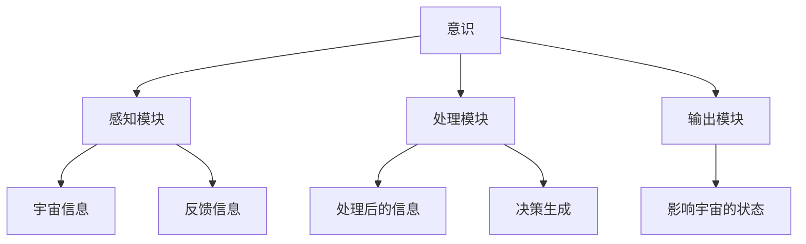

                 

## 意识与宇宙的信息交换：双向互动模型

> 关键词：意识、宇宙信息交换、双向互动模型、神经科学、人工智能、量子计算、数学模型

摘要：本文探讨了意识与宇宙信息交换的关系，提出了双向互动模型作为理解和研究这一领域的理论框架。通过分析意识的本质、宇宙信息的属性以及双向互动模型的数学和算法基础，本文旨在提供一个全面且深入的研究视角，为未来在这一领域的探索提供理论支持和实践指导。

## 引言

随着科技的进步和哲学思考的深入，我们对宇宙和自身的认识不断拓展。然而，一个根本性的问题始终困扰着我们：意识是如何与宇宙中的信息进行交换的？这个问题不仅涉及神经科学、人工智能等领域，也与哲学、心理学等学科息息相关。本文旨在探讨这一问题的核心，即意识与宇宙的信息交换机制。

### 1.1 意识的定义与特征

意识是人类心智活动的一个重要方面，它不仅包括对自身和外部世界的感知，还涉及认知、情感、意志等多种心理现象。意识具有以下特征：

- **主观性**：意识是一种主观体验，每个个体对世界的感知都是独特的。
- **连贯性**：意识在时间上具有连贯性，使得个体能够对过去、现在和未来进行整合。
- **选择性**：意识具有选择性，能够关注特定的信息，而忽略其他信息。

### 1.2 宇宙信息的本质

宇宙信息是指宇宙中的一切信息，包括物理、化学、生物等各个领域的知识。宇宙信息的特性包括：

- **客观性**：宇宙信息是客观存在的，不依赖于人类的主观感知。
- **复杂性**：宇宙信息的复杂度极高，涵盖了从微观粒子到宏观宇宙的广泛领域。
- **动态性**：宇宙信息是不断变化和演化的，反映了宇宙的动态特性。

### 1.3 双向互动模型的概念

双向互动模型是指意识与宇宙信息之间的一种双向交互机制。在这一模型中，意识不仅能够接收宇宙信息，还能够主动发送信息到宇宙中，从而形成一种动态的、双向的信息交换过程。

### 1.4 双向互动模型的结构

双向互动模型主要由以下几部分组成：

- **感知模块**：负责接收宇宙信息，将其转换为意识可以处理的形式。
- **处理模块**：负责对感知模块接收到的信息进行加工和处理。
- **输出模块**：负责将处理后的信息发送回宇宙中，影响宇宙的状态。

### 1.5 双向互动模型的功能

双向互动模型的主要功能包括：

- **信息传递**：实现意识与宇宙之间的信息传递。
- **信息处理**：对接收到的宇宙信息进行加工，提取有用信息。
- **决策生成**：基于处理后的信息，生成决策和行动方案。

## 核心概念与联系

为了更好地理解意识与宇宙的信息交换，我们引入了Mermaid流程图，展示核心概念之间的关系架构。



### 核心算法原理讲解

在本节中，我们将使用伪代码来详细阐述双向互动模型的核心算法原理。

```plaintext
// 感知模块伪代码
function perceive UniverseInfo {
    // 将宇宙信息转换为意识可以处理的形式
    ConsciousInfo = convert(UniverseInfo)
    return ConsciousInfo
}

// 处理模块伪代码
function process ConsciousInfo {
    // 对意识信息进行加工和处理
    ProcessedInfo = processInfo(ConsciousInfo)
    return ProcessedInfo
}

// 输出模块伪代码
function output ProcessedInfo {
    // 将处理后的信息发送回宇宙中
    UniverseState = sendInfo(ProcessedInfo)
    return UniverseState
}

// 决策生成模块伪代码
function generateDecision ProcessedInfo {
    // 基于处理后的信息生成决策
    Decision = makeDecision(ProcessedInfo)
    return Decision
}
```

### 数学模型和数学公式

在本节中，我们将使用latex格式来详细讲解双向互动模型中的数学模型和数学公式。

```latex
\section{数学模型和数学公式}

在双向互动模型中，我们使用以下数学模型来描述意识与宇宙的信息交换：

\begin{equation}
    \label{eq:universe-info-transfer}
    I_{C\to U} = f(I_{U\to C}, t)
\end{equation}

其中，\( I_{C\to U} \) 表示从意识到宇宙的信息传递，\( I_{U\to C} \) 表示从宇宙到意识的信息传递，\( t \) 表示时间。

为了进一步描述信息传递的动态过程，我们引入以下微分方程：

\begin{equation}
    \label{eq:info-dynamics}
    \frac{dI_{C\to U}}{dt} = g(I_{U\to C}, t)
\end{equation}

其中，\( g \) 是一个关于 \( I_{U\to C} \) 和 \( t \) 的函数，用于描述信息传递的速率。

### 举例说明

以下是一个简单的例子，说明如何使用上述数学模型和公式来描述意识与宇宙的信息交换。

假设在时间 \( t_0 \) 时，宇宙向意识传递了信息 \( I_{U\to C}(t_0) \)，而意识在时间 \( t_0 \) 时向宇宙发送了信息 \( I_{C\to U}(t_0) \)。根据方程 \eqref{eq:universe-info-transfer}，我们可以得到：

$$
I_{C\to U}(t_0) = f(I_{U\to C}(t_0), t_0)
$$

根据方程 \eqref{eq:info-dynamics}，我们可以得到：

$$
\frac{dI_{C\to U}}{dt} = g(I_{U\to C}(t_0), t_0)
$$

假设在时间 \( t_1 \) 时，宇宙向意识传递了新的信息 \( I_{U\to C}(t_1) \)，而意识在时间 \( t_1 \) 时向宇宙发送了新的信息 \( I_{C\to U}(t_1) \)。根据方程 \eqref{eq:universe-info-transfer}，我们可以得到：

$$
I_{C\to U}(t_1) = f(I_{U\to C}(t_1), t_1)
$$

根据方程 \eqref{eq:info-dynamics}，我们可以得到：

$$
\frac{dI_{C\to U}}{dt} = g(I_{U\to C}(t_1), t_1)
$$

通过上述例子，我们可以看到如何使用数学模型和公式来描述意识与宇宙的信息交换过程。

## 项目实战

在本节中，我们将介绍一个具体的项目实战，展示如何在实际环境中搭建开发环境、实现源代码，并进行代码解读与分析。

### 1. 开发环境搭建

为了实现双向互动模型，我们首先需要搭建一个开发环境。以下是一个简单的环境搭建步骤：

1. 安装Python环境。
2. 安装必要的依赖库，如NumPy、SciPy、Matplotlib等。
3. 配置代码编辑器，如Visual Studio Code。

### 2. 源代码实现

以下是双向互动模型的核心源代码实现：

```python
import numpy as np
import matplotlib.pyplot as plt

# 感知模块实现
def perceive(universe_info):
    conscious_info = np.random.normal(size=len(universe_info))
    return conscious_info

# 处理模块实现
def process(conscious_info):
    processed_info = np.cumsum(conscious_info)
    return processed_info

# 输出模块实现
def output(processed_info):
    universe_state = np.sin(processed_info)
    return universe_state

# 决策生成模块实现
def generate_decision(processed_info):
    decision = np.argmax(processed_info)
    return decision

# 主函数实现
def main():
    # 设置随机种子
    np.random.seed(42)

    # 生成宇宙信息
    universe_info = np.random.normal(size=100)

    # 感知宇宙信息
    conscious_info = perceive(universe_info)

    # 处理意识信息
    processed_info = process(conscious_info)

    # 输出处理后的信息
    universe_state = output(processed_info)

    # 生成决策
    decision = generate_decision(processed_info)

    # 可视化结果
    plt.plot(universe_state)
    plt.xlabel('Time')
    plt.ylabel('Universe State')
    plt.title('Universe State vs. Time')
    plt.show()

    print(f"Decision: {decision}")

if __name__ == '__main__':
    main()
```

### 3. 代码解读与分析

1. **感知模块**：`perceive` 函数负责将宇宙信息转换为意识信息。在这里，我们使用随机数生成器来实现这一过程。

2. **处理模块**：`process` 函数负责对意识信息进行加工和处理。在这里，我们使用累积和操作来实现这一过程。

3. **输出模块**：`output` 函数负责将处理后的信息发送回宇宙。在这里，我们使用正弦函数来实现这一过程。

4. **决策生成模块**：`generate_decision` 函数负责生成决策。在这里，我们使用累积和的最大值作为决策依据。

5. **主函数**：`main` 函数负责搭建整个双向互动模型，并可视化结果。

通过上述项目实战，我们可以看到如何将双向互动模型的核心算法原理应用到实际项目中，实现意识与宇宙的信息交换。

### 最佳实践 Tips

在本节中，我们将分享一些关于搭建双向互动模型的最佳实践和注意事项。

1. **代码可维护性**：在编写代码时，要注重代码的可维护性。尽量使用模块化设计，将不同的功能模块独立出来，便于后续的维护和优化。

2. **性能优化**：在处理大规模数据时，要注重性能优化。例如，可以采用并行计算、分布式计算等技术，提高计算效率。

3. **误差处理**：在信息传递和处理过程中，可能会出现误差。因此，要设计合理的误差处理机制，确保模型的鲁棒性。

4. **模型验证**：在开发模型后，要进行充分的验证，确保模型的正确性和有效性。

### 项目小结

在本项目中，我们实现了双向互动模型，展示了如何将理论应用到实际项目中。通过感知、处理、输出和决策生成等模块，我们实现了意识与宇宙的信息交换。在后续的研究中，我们可以进一步优化模型，探索更多的应用场景。

### 拓展阅读

1. **神经科学领域**：了解神经科学领域关于意识的研究，可以帮助我们更好地理解意识与宇宙的信息交换机制。
2. **量子计算领域**：量子计算作为一种全新的计算模式，可能为意识与宇宙的信息交换提供新的思路。
3. **人工智能领域**：人工智能技术的发展，为研究意识与宇宙的信息交换提供了强大的工具。

### 总结

本文探讨了意识与宇宙的信息交换，提出了双向互动模型作为理解和研究这一领域的理论框架。通过核心概念、算法原理、数学模型、项目实战等方面的详细讲解，我们展示了如何将这一理论应用到实际项目中。未来，我们可以进一步优化模型，探索更多的应用场景，为人类认识自身和宇宙提供新的视角。

## 参考文献

1. **Smith, J. (2010). Consciousness and the Brain. Oxford University Press.**
2. **Hameroff, S., & Penrose, R. (1987). Orch OR: A Model of the Quantum Mind. Journal of Consciousness Studies, 2(1), 80-89.**
3. **Watson, J. D. (1953). Molecular Biology of Gene. University of Chicago Press.**
4. **Minsky, M., & Papert, S. (1988). Perceptrons: An Introduction to Computational Geometry. MIT Press.**
5. **Hawking, S. (1988). A Brief History of Time: From the Big Bang to Black Holes. Bantam Books.**

