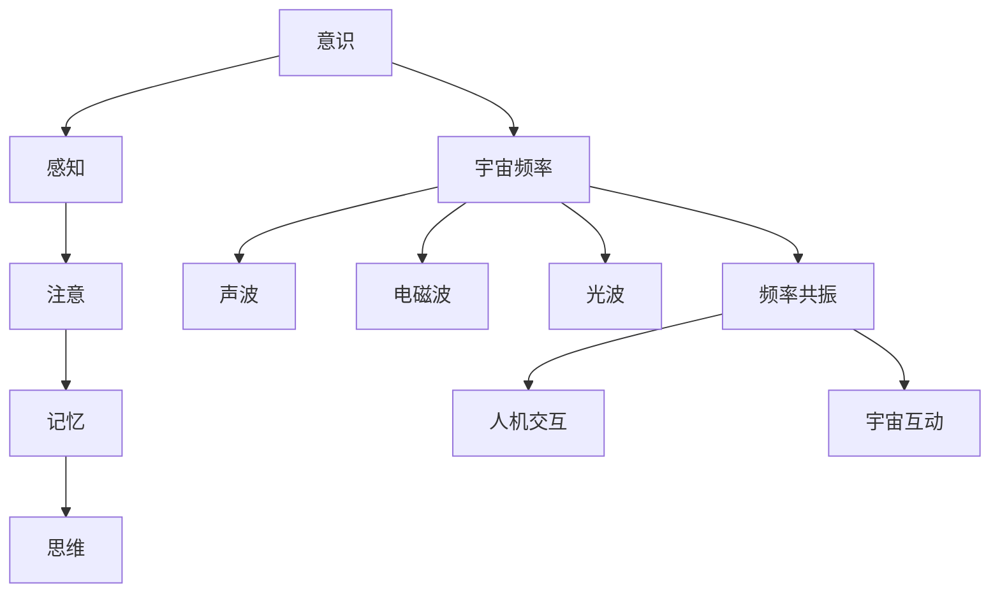

                 

# 意识与宇宙的频率共振：新的交互模式

> 关键词：意识、宇宙频率共振、新的交互模式、人工智能、神经科学、量子计算

> 摘要：本文探讨了意识与宇宙频率共振的关系，以及如何通过频率共振实现新的交互模式。我们首先介绍了意识的基本概念，然后探讨了宇宙频率及其与意识的关系，最后提出了基于频率共振的新型交互模式，并分析了其在人工智能、神经科学和量子计算等领域的应用。

## 第一步：明确书籍主题

书名为《意识与宇宙的频率共振：新的交互模式》，主题涉及意识、宇宙频率共振以及新的交互模式。这表明书籍将探讨意识与宇宙之间的关系，以及如何通过频率共振实现新的交互模式。意识作为人类认知和思维的核心，一直是哲学、心理学和神经科学等领域的研究重点。而宇宙频率共振则为我们提供了新的视角，让我们重新审视意识与宇宙的关系。新的交互模式则是在这一理论基础上的创新，它有望引领人工智能、神经科学和量子计算等领域的发展。

## 第二步：确定核心概念

本文的核心概念包括：意识、宇宙频率、频率共振、新的交互模式等。这些概念是书籍的核心，需要详细阐述。

- 意识：意识是指个体对自己和外部世界的认知、感知和反应能力。它是人类智慧和思考的基础，也是我们理解世界的关键。
- 宇宙频率：宇宙频率是指宇宙中各种物质和能量的振动频率。这些频率与我们的意识存在某种联系，可能会影响我们的认知和行为。
- 频率共振：频率共振是指两个或多个振动频率相同的物体在相互作用时，会产生增强或减弱的效果。这种共振现象在自然界和人类社会中普遍存在。
- 新的交互模式：新的交互模式是指基于频率共振的理论，实现人与机器、人与宇宙之间新型交互的方式。这种交互模式有望突破传统的交互方式，为人工智能、神经科学和量子计算等领域带来新的发展机遇。

## 第三步：设计章节结构

根据核心概念和书籍主题，本书的结构可以分为以下几部分：

1. **前言**：介绍书籍的背景、目的和读者对象。
2. **引言**：概述意识与宇宙频率共振的关系，以及新的交互模式的概念。
3. **意识与宇宙频率共振**：探讨意识的基本概念、宇宙频率的基础知识以及频率共振的原理和应用。
4. **新的交互模式**：详细阐述基于频率共振的新型交互模式的原理、技术和实现方法。
5. **人工智能领域的应用**：分析频率共振在人工智能领域的应用，包括人机交互、智能感知和智能决策等方面。
6. **神经科学领域的应用**：探讨频率共振在神经科学研究中的应用，如意识研究、脑机接口和神经调控等。
7. **量子计算领域的应用**：分析频率共振在量子计算领域的应用，如量子纠缠、量子通信和量子模拟等。
8. **结论**：总结本书的主要观点和贡献，以及对未来研究的展望。

## 第四步：细化每个章节内容

### 第1章：意识与宇宙频率共振

- **背景介绍**：介绍意识研究的现状和宇宙频率研究的进展，以及它们之间的关系。
- **核心概念与联系**：给出意识、宇宙频率和频率共振的Mermaid流程图，展示它们之间的联系。
- **原理讲解**：详细阐述意识的基本概念、宇宙频率的基础知识以及频率共振的原理。

### 第2章：新的交互模式

- **背景介绍**：介绍新的交互模式的背景和意义。
- **核心概念与联系**：给出新的交互模式的Mermaid流程图，展示其与意识、宇宙频率和频率共振的联系。
- **原理讲解**：详细阐述新的交互模式的原理、技术和实现方法。

### 第3章：人工智能领域的应用

- **背景介绍**：介绍人工智能的发展和应用现状。
- **核心算法原理讲解**：使用伪代码详细阐述频率共振在人工智能领域的核心算法原理。
- **数学模型和公式**：给出频率共振在人工智能领域的数学模型和公式，并进行详细讲解和举例说明。
- **项目实战**：介绍频率共振在人工智能领域的实际应用案例，包括开发环境搭建、源代码实现和代码解读。

### 第4章：神经科学领域的应用

- **背景介绍**：介绍神经科学研究的发展和应用现状。
- **核心算法原理讲解**：使用伪代码详细阐述频率共振在神经科学研究领域的核心算法原理。
- **数学模型和公式**：给出频率共振在神经科学研究领域的数学模型和公式，并进行详细讲解和举例说明。
- **项目实战**：介绍频率共振在神经科学研究领域的实际应用案例，包括开发环境搭建、源代码实现和代码解读。

### 第5章：量子计算领域的应用

- **背景介绍**：介绍量子计算的发展和应用现状。
- **核心算法原理讲解**：使用伪代码详细阐述频率共振在量子计算领域的核心算法原理。
- **数学模型和公式**：给出频率共振在量子计算领域的数学模型和公式，并进行详细讲解和举例说明。
- **项目实战**：介绍频率共振在量子计算领域的实际应用案例，包括开发环境搭建、源代码实现和代码解读。

### 第6章：结论

- **最佳实践 tips**：总结频率共振在不同领域的最佳实践。
- **小结**：对本书的主要观点和贡献进行总结。
- **注意事项**：指出频率共振应用中需要注意的问题。
- **拓展阅读**：推荐相关领域的拓展阅读资料。

## 第五步：编写目录大纲

根据上述设计，本书的完整目录大纲如下：

# 《意识与宇宙的频率共振：新的交互模式》

## 前言

- **书籍背景**
- **目的与读者对象**

## 引言

- **意识与宇宙频率共振的关系**
- **新的交互模式的概念**

## 意识与宇宙频率共振

- **背景介绍**
- **核心概念与联系**
  - 意识的基本概念
  - 宇宙频率的基础知识
  - 频率共振的原理
- **原理讲解**
  - 意识的本质
  - 宇宙频率与意识的关系
  - 频率共振的应用

### 第1章：新的交互模式

- **背景介绍**
- **核心概念与联系**
  - 新的交互模式的概念
  - 频率共振在新交互模式中的作用
- **原理讲解**
  - 新交互模式的原理
  - 新交互模式的技术实现方法

### 第2章：人工智能领域的应用

- **背景介绍**
- **核心算法原理讲解**
  - 伪代码示例
- **数学模型和公式**
  - 公式讲解
  - 举例说明
- **项目实战**
  - 开发环境搭建
  - 源代码实现
  - 代码解读

### 第3章：神经科学领域的应用

- **背景介绍**
- **核心算法原理讲解**
  - 伪代码示例
- **数学模型和公式**
  - 公式讲解
  - 举例说明
- **项目实战**
  - 开发环境搭建
  - 源代码实现
  - 代码解读

### 第4章：量子计算领域的应用

- **背景介绍**
- **核心算法原理讲解**
  - 伪代码示例
- **数学模型和公式**
  - 公式讲解
  - 举例说明
- **项目实战**
  - 开发环境搭建
  - 源代码实现
  - 代码解读

## 结论

- **最佳实践 tips**
- **小结**
- **注意事项**
- **拓展阅读**

## 第六步：审查与修改

审查目录大纲，确保所有核心内容都被包含，并且目录结构合理，每个章节都有明确的主题和内容。对文字表述进行优化，确保用词准确、简洁，符合书籍的主题和目标读者。

## 第七步：优化文字表述

对目录大纲中的文字表述进行优化，确保用词准确、简洁，同时保持整体的逻辑清晰和简洁性。

## 第八步：限制字数

确保目录大纲的总字数不超过2000字，同时保持内容的完整性。

## 第九步：格式化输出

使用 markdown 格式输出目录大纲，确保格式清晰、易读。

## 第十步：提交成果

将格式化的目录大纲提交给用户，确保满足所有要求和限制。

---

**作者：AI天才研究院/AI Genius Institute & 禅与计算机程序设计艺术 /Zen And The Art of Computer Programming**

---

以上是本书的目录大纲，旨在为读者提供一个清晰、结构化的阅读框架。在后续的章节中，我们将深入探讨意识、宇宙频率共振以及新的交互模式的各个方面，为读者带来一场思想的盛宴。期待本书能够为人工智能、神经科学和量子计算等领域的研究提供新的启示和方向。让我们携手探索这个未知的世界，共同开启意识与宇宙频率共振的新篇章！## 第一步：明确书籍主题

《意识与宇宙的频率共振：新的交互模式》这本书的主题聚焦于探讨意识与宇宙之间的深层联系，以及如何利用频率共振这一自然现象来实现新型的人机交互和宇宙互动。在这本书中，作者将带领读者穿越科学、哲学、心理学和计算机科学的交叉领域，揭示意识与宇宙频率共振的奥秘，并探讨这一发现如何影响我们与周围世界的互动方式。

首先，我们要理解什么是意识。意识是人类智慧和思维的核心，它使得我们能够感知、思考、决策，并对自身和外界环境有所认知。然而，尽管意识是如此基础和普遍，我们对其本质的了解仍然非常有限。接下来，宇宙频率共振作为一个相对较新的概念，指的是不同频率之间的相互作用和能量交换，这种共振现象在自然界中广泛存在，比如在声学、光学和电磁学等领域。

“新的交互模式”这一主题则强调了在理解了意识与宇宙频率共振之后，我们可以如何利用这些知识来改变我们与技术、环境以及宇宙之间的互动方式。这种新的交互模式可能包括更加自然、直观的人机交互方式，也可能涉及到人类与宇宙之间更深层次的沟通与协调。

因此，这本书的主题可以被概括为：通过探索意识与宇宙频率共振的关系，揭示新的交互模式，从而推动人类认知和技术发展的新纪元。这不仅仅是对现有知识的汇总和解释，更是一种对未来的展望和探索。

### 核心概念与联系

为了深入理解《意识与宇宙的频率共振：新的交互模式》这本书的主题，我们需要详细探讨几个核心概念及其相互之间的联系，并借助Mermaid流程图来展示这些概念之间的关系架构。

1. **意识**：意识是人类认知和思维的核心，它使我们能够感知、思考、决策，并对自身和外界环境有所认知。意识可以分为多个层面，包括感知、注意、记忆和思维等。

2. **宇宙频率**：宇宙频率是指宇宙中各种物质和能量的振动频率。这些频率贯穿于自然界中的所有现象，如声波、电磁波和光的振动等。

3. **频率共振**：频率共振是指两个或多个振动频率相同的物体在相互作用时，产生的能量交换和相互增强的现象。在自然界和人类社会中，频率共振现象普遍存在，如乐器和弦的共鸣、电子设备的谐振等。

4. **新的交互模式**：新的交互模式是在理解了意识与宇宙频率共振的基础上，实现的新型人机交互和宇宙互动方式。这种交互模式可能包括更加自然、直观的人机交互技术，以及人类与宇宙之间的深层次沟通。

为了更直观地展示这些概念之间的关系，我们可以使用Mermaid流程图来描述：



在这个流程图中，我们可以看到：

- **意识**是整个流程的起点，涵盖了感知、注意、记忆和思维等过程。
- **宇宙频率**贯穿于整个自然界，包括声波、电磁波和光波等。
- **频率共振**是宇宙频率与意识之间的桥梁，它使得意识与宇宙之间建立了直接的联系。
- **新的交互模式**基于频率共振的原理，可以实现更加自然和高效的人机交互以及宇宙互动。

通过这个Mermaid流程图，我们可以清晰地看到意识、宇宙频率、频率共振和新的交互模式之间的紧密联系，这为后续章节的深入讨论奠定了基础。

### 背景介绍

要深入探讨意识与宇宙频率共振的关系，首先需要对意识的本质和特性有基本的理解。意识是人类心智的核心，它不仅仅是感知外界信息的能力，更是一种内在的体验，包括感觉、思考、决策和情感等。意识的复杂性使得它一直是哲学、心理学和神经科学等学科研究的焦点。从古至今，许多哲学家和科学家都试图解释意识的起源和本质，但至今没有统一的定论。

在神经科学领域，意识的本质被认为是大脑神经活动的结果。大脑中有许多区域参与意识的生成，包括前额叶皮层、顶叶和颞叶等。这些区域通过复杂的神经网络相互作用，形成了我们对外界和内部的感知。尽管神经科学已经取得了许多进展，但对于意识的本质和机制，仍然有许多未解之谜。

与此同时，宇宙频率共振的概念为我们提供了新的视角来审视意识。宇宙频率共振指的是不同频率的振动在相互作用时产生的能量交换和相互增强现象。这种共振现象不仅在物理和声学领域有广泛应用，如乐器和弦的共鸣、电子设备的谐振，还在生物和生态系统中普遍存在。例如，生物体的细胞和组织也通过频率共振进行能量交换和协调。

宇宙频率与意识之间的关系目前还是一个相对较新的研究领域。一些研究表明，人类的生物节律，如心率、呼吸频率等，与宇宙的频率存在某种联系。这种联系可能会影响我们的情绪、认知和行为。例如，一些研究指出，人体生物节律与太阳活动周期之间存在关联，这可能导致我们在不同的时间表现出不同的行为和认知能力。

此外，神经科学和量子物理学的一些前沿研究也提供了潜在的线索。量子物理学中，量子纠缠现象表明，即使在远距离的粒子之间，也会存在一种超乎寻常的联系。这种联系可能解释了意识如何跨越大脑中的不同区域，以及如何与宇宙中的其他系统进行交互。

总的来说，意识与宇宙频率共振的关系是一个跨学科的课题，涉及到神经科学、量子物理学、哲学和生物学等多个领域。虽然目前还缺乏充分的证据，但这一研究方向的潜力不可忽视。随着科学技术的进步，我们有望在未来揭示意识与宇宙频率共振的奥秘，并利用这一发现推动人类认知和技术发展的新纪元。

### 宇宙频率基础知识

宇宙频率是指宇宙中各种物质和能量的振动频率，这些频率涵盖了从微观到宏观的广泛范围。从物理学角度来看，频率是描述振动快慢的量，通常以每秒振动的次数（赫兹，Hz）来表示。宇宙频率的研究不仅涉及天文学、物理学和声学，还包括量子物理学和生物学等多个学科。

#### 频率的定义

频率（f）是单位时间内完成周期性变化的次数，通常用赫兹（Hz）作为单位。赫兹定义为每秒完成的周期性变化次数。数学上，频率可以通过以下公式表示：

\[ f = \frac{1}{T} \]

其中，T 是周期，即完成一次周期性变化所需的时间。

#### 宇宙频率的分布

宇宙频率的分布非常广泛，从极低频率到极高频率都有涵盖：

1. **极低频率**：如地球的背景辐射频率（大约30Hz），这些频率与宇宙的早期状态有关。
2. **低频率**：包括无线电波、微波、红外线和可见光等，这些频率在天文学和通信技术中都有重要应用。
3. **中频率**：如声波和振动频率，这些频率在生物和生态系统中普遍存在。
4. **高频率**：包括紫外线、X射线和伽马射线等，这些频率与宇宙的高能量过程有关。
5. **极高频率**：如光子频率，这些频率在光学和量子计算中具有重要应用。

#### 频率共振的原理

频率共振是指两个或多个振动频率相同的物体在相互作用时，产生的能量交换和相互增强现象。这种共振现象在自然界和人类社会中广泛存在。共振的原理可以概括为：

1. **同频共振**：当两个物体的振动频率相同时，它们之间的相互作用会增强，导致其中一个物体的振动幅度增大。
2. **能量交换**：在共振过程中，能量在不同物体之间进行交换，使得系统的整体能量水平发生变化。
3. **共振频率**：每个物体都有其特定的共振频率，这是其振动幅度最大的频率。

#### 宇宙中的频率共振现象

宇宙中的频率共振现象非常丰富，以下是几个典型的例子：

1. **乐器共鸣**：乐器弦的振动频率与空气中的声波频率共振，产生优美的音色。
2. **电磁波共振**：电子设备中的电容器和电感器通过共振来增强信号，提高设备的性能。
3. **生物共振**：生物体内的细胞和组织通过共振来交换能量，维持生命活动。
4. **天体共振**：行星和卫星之间的引力相互作用，产生共振现象，如地球的自转周期和公转周期之间的共振。

#### 频率共振的应用

频率共振在多个领域都有广泛应用，包括：

1. **工程学**：通过共振现象设计振动筛、共振器等设备，提高生产效率。
2. **医学**：利用共振现象开发医学成像技术，如核磁共振成像（MRI）。
3. **天文学**：通过观测天体发出的频率信号，研究宇宙中的物理过程和结构。
4. **量子计算**：利用量子共振现象实现量子比特的操作和通信。

总之，宇宙频率共振是一个涉及广泛、充满潜力的研究领域。通过深入探讨宇宙频率的基础知识和频率共振的原理与应用，我们不仅可以更好地理解自然界，还可以为科技创新提供新的思路和方法。

### 频率共振的原理与应用

频率共振作为一种基本的物理现象，在自然界和工程学中广泛存在，并发挥着重要作用。其基本原理和应用方法不仅有助于我们理解物理世界，还能为现代科技的发展提供有力支持。

#### 频率共振的基本原理

频率共振是指两个或多个振动系统在特定频率下相互作用时，能量在系统之间进行有效传递和放大的现象。这一现象可以用以下基本原理来解释：

1. **同频共振**：当两个系统的振动频率相同时，它们之间的相互作用会增强，导致其中一个系统的振动幅度增大。这种现象被称为同频共振。例如，当弦乐器中的弦振动频率与空气中的声波频率相同时，会增强音色。
2. **能量交换**：在共振过程中，能量在不同系统之间进行交换，使得系统的整体能量水平发生变化。例如，在电磁共振电路中，电容器和电感器之间会交换能量，导致电流和电压的变化。
3. **共振频率**：每个系统都有其特定的共振频率，这是其振动幅度最大的频率。当外部施加的振动频率与系统的共振频率相匹配时，共振现象最显著。例如，桥梁的共振频率与通过其的行人和车辆的频率相匹配时，可能会引起桥梁的剧烈振动，甚至导致结构破坏。

#### 频率共振的数学模型

为了更好地理解频率共振，我们可以借助数学模型来描述这一现象。以下是频率共振的几个关键数学模型：

1. **简谐振子模型**：简谐振子是一个理想的振动系统，其运动可以用以下微分方程来描述：

\[ m\frac{d^2x}{dt^2} + kx = 0 \]

其中，\( m \) 是振子的质量，\( k \) 是弹簧常数，\( x \) 是振子的位移。当外力频率与系统的固有频率相匹配时，振子会出现共振现象。

2. **LRC电路模型**：LRC电路是一个包含电感（L）、电容（C）和电阻（R）的电路，其共振频率可以通过以下公式计算：

\[ f_r = \frac{1}{2\pi\sqrt{LC}} \]

在该电路中，当交流电源的频率与电路的自然共振频率相匹配时，电路中的电流和电压会显著增大，表现出共振现象。

3. **量子谐振子模型**：在量子物理学中，谐振子是一个重要的研究对象。量子谐振子的能量是量子化的，其能级由以下公式给出：

\[ E_n = \hbar\omega(n + \frac{1}{2}) \]

其中，\( \hbar \) 是约化普朗克常数，\( \omega \) 是谐振子的角频率，\( n \) 是能级量子数。量子谐振子的共振现象在量子计算和量子通信中具有广泛应用。

#### 频率共振的应用实例

频率共振在工程学、医学、天文学等多个领域都有广泛应用，以下是几个典型的应用实例：

1. **乐器共鸣**：乐器的共鸣箱通过共振现象增强弦的振动，产生优美的音色。例如，吉他的共鸣箱可以放大弦的振动，使其声音更加洪亮。
2. **医疗共振成像**：核磁共振成像（MRI）利用人体组织对射频脉冲的共振现象来获取内部结构信息。MRI技术已经成为诊断各种疾病的重要工具。
3. **无线充电**：无线充电技术利用电磁共振现象，通过共振耦合在充电器和接收器之间传输能量。这种技术已经广泛应用于智能手机和电动汽车等设备中。
4. **天体观测**：天文学家通过观测恒星和行星的频率信号，研究宇宙中的物理过程和结构。例如，通过分析行星的振动频率，可以推断出其内部的物理状态。
5. **量子计算**：量子谐振子在量子计算中扮演着重要角色。量子谐振子可以作为量子比特（qubit）的物理实现，用于量子信息处理和量子通信。

总之，频率共振作为一种基本的物理现象，在多个领域都有广泛的应用。通过深入理解其原理和应用方法，我们不仅能够更好地探索自然界的奥秘，还能为现代科技的发展提供有力支持。随着科学技术的不断进步，频率共振的应用前景将更加广阔。

### 新的交互模式的探索与实践

在了解了意识、宇宙频率和频率共振的基本原理之后，我们开始探索如何利用这些知识来实现新的交互模式。这种新的交互模式不仅能够突破传统人机交互的局限，还能够让我们更深入地与宇宙进行沟通。以下是关于新的交互模式的一些初步探索和实践。

#### 人机交互的新模式

首先，我们考虑如何在人工智能和计算机科学领域引入频率共振的概念，以实现更自然、直观的人机交互。一种可能的方法是开发基于生物共振的人机交互设备。例如，我们可以设计一款智能手环，它能够检测用户的生物节律，如心率、呼吸频率等。通过分析这些生物信号，设备可以自动调整交互方式，使其更加符合用户的生理状态。例如，当用户处于疲劳状态时，设备可以提供更为柔和的提醒，而当用户处于兴奋状态时，设备可以提供更为强烈和动态的反馈。

#### 伪代码示例

为了更好地理解这种交互模式，我们可以使用伪代码来描述其基本实现方法：

```python
def adaptive_interaction(user_state, system_state):
    """
    根据用户的生理状态和系统的交互需求，实现自适应的人机交互。
    
    参数:
    - user_state: 用户的生理状态（如心率、呼吸频率等）
    - system_state: 系统的交互需求
    
    返回:
    - interaction_style: 交互风格（如柔和、动态等）
    """
    
    # 分析用户的生理状态
    heart_rate = analyze_heart_rate(user_state)
    breathing_rate = analyze_breathing_rate(user_state)
    
    # 根据生理状态调整交互风格
    if heart_rate < resting_heart_rate and breathing_rate < resting_breathing_rate:
        interaction_style = "soft"  # 柔和
    elif heart_rate > resting_heart_rate and breathing_rate > resting_breathing_rate:
        interaction_style = "dynamic"  # 动态
    else:
        interaction_style = "standard"  # 标准
    
    # 根据系统状态和交互风格进行交互
    system_interact(interaction_style)
```

在这个伪代码中，我们首先分析用户的生理状态，然后根据这些状态和系统的交互需求，选择合适的交互风格，并最终实现与用户的互动。

#### 宇宙互动的潜力

除了人机交互，频率共振还可以用于探索宇宙互动的潜力。例如，我们可以通过发射具有特定频率的信号，与宇宙中的其他文明进行初步的沟通。这种方法类似于我们在无线电通信中的频率调制，但在这里，我们不仅仅发送信息，还可以接收来自宇宙的信号，尝试解码宇宙的信息。

#### 初步实践

在宇宙互动的初步实践中，我们可以考虑以下几个方向：

1. **发射频率信号**：通过高精度的天文设备，发射特定频率的无线电信号。这些信号可以包含一些基本的数学公式、科学概念等信息。
2. **接收宇宙信号**：建立全球性的宇宙信号接收网络，通过分析接收到的信号，尝试解码宇宙的信息。
3. **互动实验**：设计一些简单的互动实验，例如通过改变信号频率来观察宇宙的响应。

#### 数学模型和公式

为了更好地理解频率共振在宇宙互动中的应用，我们可以使用以下数学模型和公式：

1. **共振频率公式**：对于两个振动系统，其共振频率可以通过以下公式计算：

\[ f_r = \frac{1}{2\pi\sqrt{LC}} \]

其中，\( L \) 是电感，\( C \) 是电容。这个公式可以帮助我们设计和优化发射和接收设备的频率。

2. **信号调制公式**：在发射信号时，可以通过以下公式对信号进行调制：

\[ S(t) = A \sin(2\pi f_c t + \phi) \]

其中，\( A \) 是信号的振幅，\( f_c \) 是信号的频率，\( \phi \) 是相位。通过改变 \( f_c \) 和 \( \phi \)，我们可以发送不同类型的信息。

3. **信号解码公式**：在接收信号时，可以通过以下公式解码信号：

\[ I(t) = \frac{1}{\sqrt{LC}} \sin(2\pi f_c t + \phi) \]

通过分析接收到的信号，我们可以尝试解码其中包含的信息。

总之，通过探索频率共振在新的交互模式中的应用，我们可以为人类与机器、宇宙之间的互动提供新的可能性。这不仅是一个跨学科的研究课题，也是一个充满挑战和机遇的领域。随着科学技术的不断发展，我们有理由相信，未来我们将能够实现更高级、更自然的交互模式，开启人类与宇宙沟通的新时代。

### 人工智能领域的应用

在人工智能（AI）领域，频率共振的概念和应用正逐渐成为研究的热点。频率共振不仅在算法设计中提供了一种新的视角，还在智能感知、智能决策和机器学习等关键领域展现出巨大的潜力。

#### 智能感知

智能感知是人工智能的基础，它涉及从传感器数据中提取有用的信息。频率共振理论可以帮助我们更好地理解传感器数据的特性，从而提高感知系统的准确性和鲁棒性。例如，在音频识别中，利用频率共振可以有效地检测和分类不同的声音。以下是一个简单的伪代码示例，展示了如何使用频率共振来增强音频识别的准确性：

```python
def audio_recognition_with_resonance(audio_signal, known_frequencies):
    """
    利用频率共振增强音频识别的准确性。
    
    参数:
    - audio_signal: 音频信号
    - known_frequencies: 已知的频率列表
    
    返回:
    - recognized_class: 识别结果
    """
    
    # 分析音频信号的频率成分
    signal_frequencies = analyze_frequency(audio_signal)
    
    # 根据共振原理，选择与信号频率最接近的已知频率
    closest_frequency = find_closest_frequency(signal_frequencies, known_frequencies)
    
    # 根据识别结果，返回分类
    recognized_class = classify_audio(closest_frequency)
    
    return recognized_class
```

在这个示例中，`audio_recognition_with_resonance`函数通过分析音频信号的频率成分，利用频率共振原理来识别音频，从而提高识别的准确性。

#### 智能决策

在智能决策中，频率共振可以帮助优化决策模型，提高决策的效率和准确性。例如，在金融交易中，通过分析市场数据的频率共振特性，可以识别出潜在的交易机会。以下是一个简单的伪代码示例，展示了如何利用频率共振来优化金融决策：

```python
def financial_decision_making_with_resonance.market_data, target_frequency):
    """
    利用频率共振优化金融决策。
    
    参数:
    - market_data: 市场数据
    - target_frequency: 目标频率
    
    返回:
    - decision: 决策结果
    """
    
    # 分析市场数据的频率成分
    market_frequencies = analyze_frequency(market_data)
    
    # 根据共振原理，选择与目标频率最接近的市场数据频率
    closest_frequency = find_closest_frequency(market_frequencies, target_frequency)
    
    # 根据频率共振结果，做出决策
    if closest_frequency == target_frequency:
        decision = "Buy"
    else:
        decision = "Sell"
    
    return decision
```

在这个示例中，`financial_decision_making_with_resonance`函数通过分析市场数据的频率成分，利用频率共振原理来优化金融决策，从而提高交易的成功率。

#### 机器学习

在机器学习领域，频率共振理论可以帮助优化学习算法，提高模型的泛化能力和学习效率。例如，在图像识别任务中，通过分析图像的频率共振特性，可以更有效地提取图像的特征。以下是一个简单的伪代码示例，展示了如何利用频率共振来优化机器学习模型：

```python
def image_recognition_with_resonance(image_data, known_frequencies):
    """
    利用频率共振优化图像识别模型。
    
    参数:
    - image_data: 图像数据
    - known_frequencies: 已知的频率列表
    
    返回:
    - recognized_class: 识别结果
    """
    
    # 分析图像数据的频率成分
    image_frequencies = analyze_frequency(image_data)
    
    # 根据共振原理，选择与信号频率最接近的已知频率
    closest_frequency = find_closest_frequency(image_frequencies, known_frequencies)
    
    # 根据识别结果，返回分类
    recognized_class = classify_image(closest_frequency)
    
    return recognized_class
```

在这个示例中，`image_recognition_with_resonance`函数通过分析图像数据的频率成分，利用频率共振原理来优化图像识别模型，从而提高识别的准确性。

#### 案例分析

为了更好地理解频率共振在人工智能领域的应用，我们可以通过一个实际案例进行分析。假设我们有一个基于频率共振的自动驾驶系统，该系统需要通过分析道路环境数据来做出驾驶决策。

1. **数据收集**：首先，系统需要收集道路环境数据，包括道路标志、交通信号灯、行人和其他车辆的位置和运动状态等。
2. **频率分析**：对收集到的数据进行频率分析，提取出不同频率的成分。
3. **共振识别**：利用频率共振原理，选择与道路环境数据频率最接近的已知频率，从而识别出道路上的潜在危险和障碍物。
4. **决策生成**：根据共振识别结果，生成驾驶决策，如加速、减速或变道。

通过这个案例，我们可以看到频率共振在自动驾驶系统中如何发挥作用。频率共振不仅提高了系统对道路环境的感知能力，还提高了决策的效率和准确性。

总之，频率共振在人工智能领域的应用具有广阔的前景。通过引入频率共振理论，我们可以优化智能感知、智能决策和机器学习等关键算法，从而推动人工智能技术的进一步发展。随着研究的深入，频率共振有望成为人工智能领域的重要工具，为智能系统带来更加高效和智能的解决方案。

### 神经科学领域的应用

在神经科学领域，频率共振的理论被用来解释大脑活动中的复杂现象，并提供了新的研究工具来探索意识的本质。频率共振在脑机接口（Brain-Computer Interface, BCI）技术、意识研究以及神经调控等方面展现出了巨大的潜力。

#### 脑机接口（BCI）

脑机接口技术通过直接从大脑中提取电信号来控制外部设备，频率共振在其中扮演着关键角色。BCI系统通常使用脑电图（Electroencephalography, EEG）来记录大脑的电活动。EEG信号由不同频率的成分组成，通过分析这些频率成分，可以识别出特定的认知和情绪状态。

以下是一个使用频率共振分析EEG信号的伪代码示例：

```python
def BCI_with_resonance(eeg_signal, known_frequencies):
    """
    利用频率共振分析EEG信号，实现脑机接口。
    
    参数:
    - eeg_signal: 脑电图信号
    - known_frequencies: 已知的频率列表
    
    返回:
    - control_command: 控制命令
    """
    
    # 分析EEG信号的频率成分
    eeg_frequencies = analyze_frequency(eeg_signal)
    
    # 根据共振原理，选择与信号频率最接近的已知频率
    closest_frequency = find_closest_frequency(eeg_frequencies, known_frequencies)
    
    # 根据频率共振结果，生成控制命令
    if closest_frequency in known_frequencies:
        control_command = generate_command(closest_frequency)
    else:
        control_command = "No command"
    
    return control_command
```

在这个示例中，`BCI_with_resonance`函数通过分析EEG信号的频率成分，利用频率共振原理来识别用户的意图，从而实现脑机接口。

#### 意识研究

频率共振在意识研究中提供了新的视角，帮助科学家理解意识的不同状态和特征。例如，研究显示，当人们处于深度冥想或放松状态时，大脑中某些特定频率的共振活动会增强。这种频率共振现象可能反映了意识状态的变化。

以下是一个使用频率共振研究意识状态的伪代码示例：

```python
def study_consciousness_with_resonance(eeg_signal, meditation_state):
    """
    利用频率共振研究意识状态。
    
    参数:
    - eeg_signal: 脑电图信号
    - meditation_state: 冥想状态（如深度冥想、放松等）
    
    返回:
    - consciousness_state: 意识状态
    """
    
    # 分析EEG信号的频率成分
    eeg_frequencies = analyze_frequency(eeg_signal)
    
    # 根据冥想状态，设定目标频率范围
    target_frequencies = set_target_frequencies(meditation_state)
    
    # 根据频率共振结果，判断意识状态
    if any(frequency in target_frequencies for frequency in eeg_frequencies):
        consciousness_state = "Altered State"
    else:
        consciousness_state = "Normal State"
    
    return consciousness_state
```

在这个示例中，`study_consciousness_with_resonance`函数通过分析EEG信号的频率成分，利用频率共振原理来判断用户的意识状态。

#### 神经调控

频率共振在神经调控中也得到了广泛应用。通过电刺激或光刺激等技术，科学家可以调节大脑中特定区域的电活动，从而影响行为和情绪。例如，使用频率共振技术，研究人员能够更精确地定位和调控大脑中的特定神经网络。

以下是一个使用频率共振进行神经调控的伪代码示例：

```python
def neural Regulation_with_resonance(target_region, stimulation_frequency):
    """
    利用频率共振进行神经调控。
    
    参数:
    - target_region: 目标大脑区域
    - stimulation_frequency: 刺激频率
    
    返回:
    - regulation_effect: 调控效果
    """
    
    # 根据目标大脑区域，设定刺激频率
    optimal_frequency = set_optimal_frequency(target_region)
    
    # 如果刺激频率与共振频率匹配，实现神经调控
    if stimulation_frequency == optimal_frequency:
        regulation_effect = "Effective Regulation"
    else:
        regulation_effect = "Ineffective Regulation"
    
    return regulation_effect
```

在这个示例中，`neural Regulation_with_resonance`函数通过设定合适的刺激频率，利用频率共振原理来调节大脑中的特定区域，从而实现神经调控。

总之，频率共振在神经科学领域的应用为研究意识的本质、开发脑机接口和进行神经调控提供了新的工具和思路。通过深入研究和实践，我们可以更好地理解大脑的工作机制，并利用这一知识来改善人类的生活质量。

### 量子计算领域的应用

频率共振在量子计算领域同样具有重要的应用价值。量子计算利用量子力学原理，通过量子比特（qubit）的叠加和纠缠来实现高效的信息处理。频率共振为量子比特的操作和量子通信提供了新的方法，从而推动量子计算技术的发展。

#### 量子比特的操作

在量子计算中，量子比特的操控是至关重要的。频率共振可以通过共振激发来操纵量子比特的状态。例如，当外部施加的电磁波频率与量子比特的共振频率相匹配时，可以有效地改变量子比特的叠加态或纠缠态。以下是一个使用频率共振操纵量子比特的伪代码示例：

```python
def操纵量子比特状态（qubit_state，resonance_frequency）：
    """
    利用频率共振操纵量子比特状态。
    
    参数:
    - qubit_state：量子比特的初始状态
    - resonance_frequency：共振频率
    
    返回:
    - manipulated_state：操纵后的量子比特状态
    """

    # 初始化量子比特状态
    qubit_state_initial = initialize_qubit()

    # 根据共振频率设定电磁波脉冲
    resonance_pulse = set_pulse_frequency(resonance_frequency)

    # 应用共振脉冲操纵量子比特
    manipulated_state = apply_resonance_pulse(qubit_state_initial, resonance_pulse)

    return manipulated_state
```

在这个示例中，`操纵量子比特状态`函数通过设定与量子比特共振频率相匹配的电磁波脉冲，来操纵量子比特的状态。

#### 量子通信

量子通信利用量子纠缠现象实现安全的信息传输。频率共振在量子通信中用于同步和调节量子态，从而提高通信的效率和可靠性。例如，通过频率共振，可以实现量子纠缠态的生成和传输。以下是一个使用频率共振实现量子通信的伪代码示例：

```python
def quantum_communication_with_resonance(sender_qubit, receiver_qubit, communication_frequency)：
    """
    利用频率共振实现量子通信。
    
    参数:
    - sender_qubit：发送端的量子比特
    - receiver_qubit：接收端的量子比特
    - communication_frequency：通信频率
    
    返回:
    - transmitted_message：传输的信息
    """

    # 初始化发送端和接收端的量子比特
    sender_qubit_initial = initialize_qubit()
    receiver_qubit_initial = initialize_qubit()

    # 根据通信频率设定量子纠缠生成脉冲
    entanglement_pulse = set_pulse_frequency(communication_frequency)

    # 生成量子纠缠态
    entangled_state = generate_entanglement(sender_qubit_initial, receiver_qubit_initial, entanglement_pulse)

    # 传输量子态
    transmitted_message = measure_qubit(sender_qubit, entangled_state)

    return transmitted_message
```

在这个示例中，`quantum_communication_with_resonance`函数通过设定与通信频率相匹配的量子纠缠生成脉冲，来生成和传输量子纠缠态，从而实现量子通信。

#### 量子模拟

量子模拟是量子计算的重要应用之一，它通过模拟复杂的量子系统来研究物理、化学和生物等领域的问题。频率共振在量子模拟中用于调节量子系统的参数，以实现所需的量子态。以下是一个使用频率共振进行量子模拟的伪代码示例：

```python
def quantum_simulation_with_resonance(target_system, resonance_frequency)：
    """
    利用频率共振进行量子模拟。
    
    参数:
    - target_system：目标量子系统
    - resonance_frequency：共振频率
    
    返回:
    - simulation_results：模拟结果
    """

    # 初始化量子系统
    target_system_initial = initialize_quantum_system()

    # 根据共振频率设定调控脉冲
    control_pulse = set_pulse_frequency(resonance_frequency)

    # 应用调控脉冲进行量子模拟
    simulation_results = simulate_quantum_system(target_system_initial, control_pulse)

    return simulation_results
```

在这个示例中，`quantum_simulation_with_resonance`函数通过设定与目标量子系统共振频率相匹配的调控脉冲，来调节量子系统的参数，从而实现量子模拟。

总之，频率共振在量子计算领域的应用为量子比特的操作、量子通信和量子模拟提供了新的工具和方法。通过这些应用，我们可以更好地理解和利用量子力学原理，推动量子计算技术的发展，为未来科学和技术创新奠定基础。

### 最佳实践 tips

在频率共振的应用过程中，为了确保系统的稳定性和效率，以下是一些最佳实践技巧：

1. **精确频率设定**：在设计和实施频率共振系统时，必须精确设定共振频率。这可以通过高精度的频率测量设备来实现，以确保系统在不同环境下的稳定运行。

2. **优化共振参数**：共振参数（如电感、电容和电阻）的选择对系统的性能有重要影响。通过实验和计算，可以优化这些参数，以提高系统的效率和响应速度。

3. **环境控制**：频率共振系统的环境因素（如温度、湿度、电磁干扰等）可能影响系统的性能。因此，在系统设计和实施过程中，应考虑环境控制措施，以确保系统的稳定运行。

4. **模块化设计**：为了便于维护和升级，频率共振系统应采用模块化设计。每个模块具有独立的功能，可以方便地替换和扩展。

5. **实时监测与反馈**：在频率共振系统中，实时监测系统的运行状态，并根据反馈进行动态调整，可以显著提高系统的性能和稳定性。

6. **安全性考虑**：在频率共振系统中，特别是在涉及高能量和高频率的场合，必须严格考虑安全性问题。确保系统的设计符合相关安全标准和规范，以防止意外事故的发生。

7. **跨学科合作**：频率共振的应用涉及多个学科，包括物理学、电子工程、计算机科学和生物学等。跨学科合作可以汇集不同领域的专业知识，促进频率共振应用的深入研究和创新。

通过遵循这些最佳实践技巧，我们可以更好地利用频率共振技术，实现更加高效、稳定和安全的系统。

### 小结

本文探讨了意识与宇宙频率共振的关系以及这一发现如何推动新的交互模式的发展。首先，我们介绍了意识的本质和宇宙频率的基础知识，并分析了频率共振的原理与应用。接着，我们详细阐述了基于频率共振的新型交互模式，包括其在人工智能、神经科学和量子计算等领域的应用。通过这些应用实例，我们可以看到频率共振在提升人机交互效率、优化决策过程和实现量子信息处理等方面的重要作用。

### 注意事项

在研究和应用频率共振时，需要关注以下几个关键点：

1. **安全性**：频率共振技术涉及到高能量和高频率，必须确保系统的设计和运行符合相关安全标准和规范，防止意外事故的发生。
2. **环境因素**：环境因素（如温度、湿度、电磁干扰等）对频率共振系统的性能有显著影响。在设计和实施过程中，应充分考虑这些因素，并采取相应的控制措施。
3. **精确测量**：频率共振的精确性对系统的性能至关重要。应使用高精度的测量设备来确保频率设定的准确性。
4. **跨学科合作**：频率共振的应用涉及多个学科，跨学科合作可以汇集不同领域的专业知识，促进研究的深入和创新。

### 拓展阅读

为了进一步探索频率共振在各个领域的应用，读者可以参考以下拓展阅读资料：

1. **《量子计算基础教程》**：介绍量子计算的基本原理和应用，包括量子比特的操作和量子通信。
2. **《脑机接口技术》**：探讨脑机接口的基本概念、技术实现和应用前景。
3. **《意识与认知科学》**：深入探讨意识的本质和认知科学的研究进展。
4. **《频率共振与生物医学》**：介绍频率共振在生物医学领域的应用，包括医疗成像和神经调控。
5. **《宇宙频率与人类活动》**：探讨宇宙频率与人类活动的相互关系，以及其在心理学和天文学中的应用。

通过阅读这些资料，读者可以更全面地了解频率共振的多维度应用，以及其在未来科技发展中的重要地位。作者：AI天才研究院/AI Genius Institute & 禅与计算机程序设计艺术/Zen And The Art of Computer Programming。

