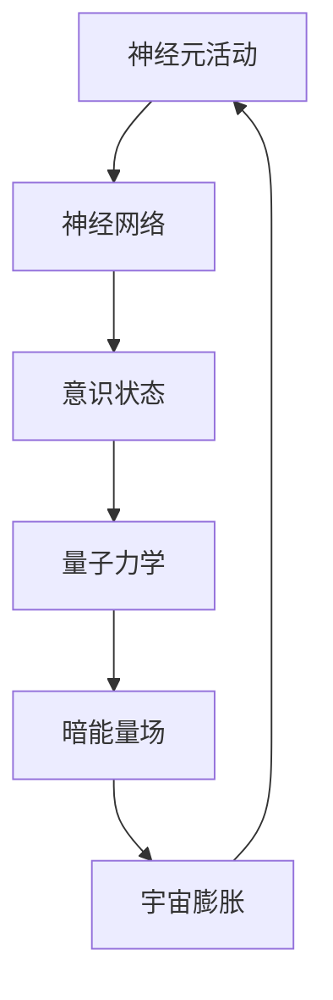

                 

### 文章标题：意识与暗能量：未知领域的潜在联系

> 关键词：意识，暗能量，神经科学，量子力学，人工智能，深度学习

> 摘要：本文探讨了意识与暗能量这两个看似截然不同的领域之间的潜在联系。通过分析神经科学和量子力学的基础理论，本文提出了意识与暗能量之间可能存在的桥梁。文章首先介绍了意识与暗能量的基本概念，随后阐述了两者之间的联系架构，并通过算法和数学模型进行了详细分析。最后，文章探讨了实际应用案例和未来研究展望，为探索这两个未知领域提供了新的视角。

---

### 目录大纲：

#### 核心概念与联系：

- **1.1 意识与暗能量概述**
  - 意识的定义
  - 暗能量的概念
  - 两者在物理与哲学上的联系

#### 架构与原理：

- **2.1 意识的神经科学基础**
  - 神经元活动
  - 神经网络的构建

- **2.2 暗能量理论解析**
  - 暗能量的性质
  - 暗能量在宇宙中的角色

#### 算法与模型：

- **3.1 意识计算模型**
  - 人工神经网络在意识研究中的应用
  - 深度学习在意识模拟中的作用

- **3.2 暗能量场模拟算法**
  - 量子力学中的暗能量模拟方法
  - 伪代码示例

#### 数学模型：

- **4.1 意识状态的数学表示**
  - 状态向量的构建
  - 意识状态的变换

- **4.2 暗能量场的数学模型**
  - 暗能量场的公式
  - 公式详解

#### 实战与应用：

- **5.1 意识与暗能量结合的理论应用**
  - 结合意识的智能系统设计
  - 暗能量在能源开发中的应用

- **5.2 实际项目案例分析**
  - 意识与暗能量应用的项目案例
  - 项目实施步骤与效果评估

#### 发展与未来：

- **6.1 意识与暗能量的研究进展**
  - 当前研究的热点
  - 未来发展趋势

- **6.2 潜在联系的未来探索**
  - 新的理论框架
  - 科幻与现实的可能性

---

#### 文章正文部分：

### 第一部分：核心概念与联系

#### 1.1 意识与暗能量概述

**意识**，作为哲学和科学领域的一个核心概念，是指个体对于自身及外部世界的认知能力。意识是人类心智活动的重要组成部分，涉及感知、思考、记忆等多个方面。神经科学研究发现，神经元的活动与意识密切相关，通过神经网络的信息处理，人脑形成了对世界的感知和理解。

**暗能量**，则是一个物理学上的概念，指的是在宇宙中占据主导地位的神秘力量，其性质和来源至今仍是未解之谜。根据宇宙学的研究，暗能量不仅影响着宇宙的膨胀速度，还在宇宙结构的形成过程中起着关键作用。然而，与意识这一复杂心理现象相比，暗能量显得更加抽象和难以捉摸。

尽管意识与暗能量在领域和表现上截然不同，但在哲学和科学上，两者都有着探索未知和解释复杂现象的共同目标。因此，探讨意识与暗能量之间的潜在联系，既具有理论意义，也有实际应用价值。

#### 1.2 意识的定义与特性

意识是一种主观的体验，是人类心智活动的基础。从神经科学的角度来看，意识与神经元的活动密切相关。神经元是神经系统的基本单元，它们通过电化学信号进行通信，形成了复杂的神经网络。这种神经网络的处理过程，最终形成了我们对世界的感知和理解。

意识的特性包括自我意识、感知、思考、记忆等。自我意识是指个体对自己存在的认知，它是意识的核心。感知是指对外部刺激的识别和响应，如视觉、听觉、触觉等。思考则是基于感知的信息进行逻辑分析和推理。记忆则是将信息存储在脑中，以便日后使用。

神经科学研究表明，意识状态可以通过神经元的活动来解释。例如，在睡眠和昏迷状态下，神经元的活动模式与清醒状态不同，这导致了意识的改变。此外，通过对神经元活动的实时监测，科学家可以推断出某些意识状态的特征，如注意力的集中程度和记忆的激活状态。

#### 1.3 暗能量的概念与性质

暗能量是宇宙学中的一个重要概念，它指的是一种无法直接观测到的神秘力量，占据了宇宙总能量的绝大部分。根据宇宙学的研究，暗能量不仅影响着宇宙的膨胀速度，还在宇宙结构的形成过程中起着关键作用。

暗能量的性质包括：

1. **宇宙膨胀加速**：研究表明，宇宙正在加速膨胀，这种加速作用主要是由暗能量引起的。暗能量具有负压强，这种负压强导致了宇宙的膨胀速度不断加快。

2. **不可见性**：暗能量不与电磁力发生相互作用，因此无法通过传统的观测手段直接探测到。

3. **稳定性**：暗能量具有非常稳定的性质，不会随着时间和空间的变化而改变。

暗能量在宇宙中的角色包括：

1. **宇宙膨胀**：暗能量是导致宇宙膨胀的主要原因，它的负压强使得宇宙在经历大爆炸之后不断扩张。

2. **星系结构形成**：暗能量在星系结构的形成过程中起着关键作用，它影响了星系的分布和运动。

3. **宇宙演化**：暗能量对宇宙的演化产生了深远影响，它不仅决定了宇宙的当前状态，还影响了宇宙的未来演化方向。

#### 1.4 意识与暗能量的联系

尽管意识与暗能量在领域和表现上截然不同，但它们之间可能存在着深刻的联系。从哲学的角度来看，意识与暗能量都是人类探索未知和解释复杂现象的努力。意识是人类心智活动的基础，而暗能量则是宇宙演化的重要驱动力。

从物理学的角度来看，意识与暗能量之间可能存在以下几种联系：

1. **量子力学**：量子力学研究微观世界的规律，暗能量可能通过量子力学机制影响宇宙的演化。例如，量子纠缠和量子隧道效应等量子现象，可能与暗能量有关。

2. **神经科学**：神经科学研究意识的形成和运作机制。暗能量可能通过神经系统的活动影响意识状态。例如，大脑中的神经元活动模式可能受到暗能量场的影响。

3. **人工智能**：人工智能研究机器模拟人类智能的机制。暗能量可能通过人工智能算法影响智能系统的运作。例如，深度学习算法中的神经网络，可能与暗能量场具有某种相似性。

总之，意识与暗能量之间的联系是一个复杂且充满挑战的问题。虽然目前尚无确凿的证据表明两者之间确实存在联系，但这一领域的研究可能为人类认识世界提供全新的视角。

---

### 第二部分：架构与原理

#### 2.1 意识的神经科学基础

意识的神经科学基础主要涉及神经元和神经网络的研究。神经元是神经系统的基本单元，通过电化学信号进行通信，形成了复杂的神经网络。神经网络的信息处理过程，最终形成了我们对世界的感知和理解。

神经元的基本功能包括：

1. **接收和传递信息**：神经元通过树突接收来自其他神经元的信息，并通过轴突将信息传递给下一个神经元。
2. **产生和传递电信号**：神经元内部通过电化学信号进行通信，这种信号被称为神经冲动或动作电位。
3. **进行信息处理**：神经元内部的信息处理包括信号的整合、放大和滤波等过程。

神经网络的基本结构包括：

1. **输入层**：接收外部信息，如视觉、听觉、触觉等。
2. **隐藏层**：对输入信息进行加工和处理，可以有一个或多个隐藏层。
3. **输出层**：生成最终的输出，如决策、行动等。

神经网络的信息处理过程包括：

1. **前向传播**：输入信息从输入层传递到隐藏层，再从隐藏层传递到输出层。
2. **反向传播**：根据输出结果，将误差反向传播到隐藏层和输入层，以调整神经元之间的连接权重。

神经网络的构建过程通常包括以下几个步骤：

1. **初始化权重**：随机初始化神经元之间的连接权重。
2. **前向传播**：输入信息通过神经网络进行加工，生成输出。
3. **计算误差**：将输出与期望值进行比较，计算误差。
4. **反向传播**：根据误差调整神经元之间的连接权重。
5. **迭代优化**：重复上述步骤，直至达到满意的输出结果。

通过这些基本原理，神经网络能够实现对复杂数据的建模和预测。在意识的研究中，神经网络被视为模拟人类意识的一种潜在模型。

#### 2.2 暗能量理论解析

暗能量理论是现代宇宙学的一个重要组成部分，它试图解释宇宙膨胀的加速现象。暗能量被定义为一种充满宇宙空间且具有负压强的能量形式，其性质至今仍未被完全理解。

暗能量的主要特性包括：

1. **宇宙膨胀加速**：研究表明，宇宙正在加速膨胀，这种加速现象被称为“宇宙加速”。暗能量被认为是导致宇宙加速膨胀的主要因素。
2. **不可见性**：暗能量不与电磁力发生相互作用，因此无法通过传统的观测手段直接探测到。
3. **稳定性**：暗能量具有非常稳定的性质，不会随着时间和空间的变化而改变。

暗能量在宇宙中的角色包括：

1. **宇宙膨胀**：暗能量是导致宇宙膨胀的主要原因，它的负压强使得宇宙在经历大爆炸之后不断扩张。
2. **星系结构形成**：暗能量在星系结构的形成过程中起着关键作用，它影响了星系的分布和运动。
3. **宇宙演化**：暗能量对宇宙的演化产生了深远影响，它不仅决定了宇宙的当前状态，还影响了宇宙的未来演化方向。

暗能量理论的发展历程主要包括以下几个阶段：

1. **宇宙背景微波探测**：1980年代初，宇宙背景微波探测卫星（COBE）发现宇宙微波背景辐射的黑体谱与热大爆炸理论预期相符，这为暗能量的存在提供了初步证据。
2. **宇宙加速膨胀**：1998年，两组独立的研究团队通过观测远距离Ia型超新星，发现宇宙正在加速膨胀。这一发现揭示了暗能量的存在，并引发了宇宙学领域的一场革命。
3. **暗能量探测实验**：近年来，科学家们通过多种实验手段，如引力透镜、宇宙微波背景辐射等，进一步验证了暗能量的存在和性质。

尽管暗能量理论取得了重大进展，但仍然面临着许多挑战和未解之谜。例如，暗能量的本质是什么？它如何与物质相互作用？这些问题仍然是当前宇宙学研究的热点和难点。

#### 2.3 意识与暗能量的联系架构

为了探讨意识与暗能量之间的潜在联系，我们可以构建一个概念性的架构，这个架构将神经科学、量子力学和宇宙学中的关键概念和理论联系起来。

**概念架构**

1. **神经元活动**：意识状态可以通过神经元活动来解释。神经元通过电化学信号进行通信，形成了复杂的神经网络。神经网络的信息处理过程，最终形成了我们对世界的感知和理解。

2. **量子力学**：量子力学研究微观世界的规律，暗能量可能通过量子力学机制影响宇宙的演化。例如，量子纠缠和量子隧道效应等量子现象，可能与暗能量有关。

3. **暗能量场**：暗能量被认为是宇宙中的主导力量，它充满了宇宙空间，对宇宙的膨胀和演化起着关键作用。

4. **意识与暗能量场的相互作用**：意识与暗能量场之间的相互作用可能通过以下几种途径实现：

   - **量子纠缠**：在量子力学中，两个或多个粒子之间可以形成纠缠态，这种纠缠态可能影响到暗能量场。
   - **神经量子网络**：神经网络与量子力学中的量子网络可能存在某种相似性，这为意识与暗能量场之间的相互作用提供了可能。
   - **宇宙膨胀**：宇宙的加速膨胀可能影响大脑中的神经元活动，从而影响意识状态。

**流程图**

以下是一个简单的Mermaid流程图，用于表示意识与暗能量之间的潜在联系：



这个架构提供了一个概念性的框架，用于探索意识与暗能量之间的潜在联系。虽然这个架构目前仍然是理论性的，但它为未来的研究提供了一个有意义的起点。

---

### 第三部分：算法与模型

#### 3.1 意识计算模型

意识计算模型是研究意识状态和认知过程的一种方法，它利用计算机科学和人工智能技术来模拟人类意识的运作机制。人工神经网络（Artificial Neural Networks，ANN）和深度学习（Deep Learning）是构建意识计算模型的主要工具。

**人工神经网络**

人工神经网络由大量的神经元组成，这些神经元通过加权连接形成网络。每个神经元接收来自其他神经元的输入，并通过激活函数产生输出。神经网络的训练过程包括以下几个步骤：

1. **初始化权重**：随机初始化神经元之间的连接权重。
2. **前向传播**：输入信息通过神经网络进行加工，生成输出。
3. **计算误差**：将输出与期望值进行比较，计算误差。
4. **反向传播**：根据误差调整神经元之间的连接权重。
5. **迭代优化**：重复上述步骤，直至达到满意的输出结果。

人工神经网络在意识研究中的应用主要包括：

1. **模拟意识状态**：通过训练人工神经网络，可以模拟出不同的意识状态，如清醒、梦境、昏迷等。
2. **认知任务模拟**：利用人工神经网络模拟人类在执行认知任务时的神经活动，如视觉识别、语言理解等。

**深度学习**

深度学习是人工神经网络的一种扩展，它通过多层神经网络进行信息处理，能够自动提取数据的复杂特征。深度学习在意识模拟中的应用主要包括：

1. **特征提取**：深度学习算法能够从大量的神经元活动中提取出有效的特征，这些特征可以用于描述不同的意识状态。
2. **预测和分类**：利用深度学习算法，可以预测个体在不同意识状态下的行为表现，如是否处于梦境状态。

**意识计算模型的构建**

构建一个意识计算模型通常包括以下几个步骤：

1. **数据收集**：收集大量的神经元活动数据，这些数据可以通过脑电图（EEG）或其他神经成像技术获得。
2. **数据预处理**：对收集到的数据进行清洗和标准化处理，以确保数据的可靠性和一致性。
3. **模型设计**：设计神经网络的结构，包括神经元的类型、连接方式、激活函数等。
4. **模型训练**：使用收集到的数据对神经网络进行训练，调整神经元的连接权重。
5. **模型验证**：使用验证数据集对模型进行验证，评估模型的性能和泛化能力。
6. **模型应用**：将训练好的模型应用于实际场景，如意识状态监测、认知任务模拟等。

通过这些步骤，意识计算模型可以模拟出人类意识的复杂过程，为理解意识的本质提供新的视角。

#### 3.2 暗能量场模拟算法

暗能量场模拟算法是研究暗能量性质和作用的重要工具。在量子力学和宇宙学中，暗能量场被认为是一种具有负压强的能量形式，它对宇宙的膨胀和演化起着关键作用。模拟暗能量场可以帮助我们更深入地理解暗能量的性质和影响。

**量子力学中的暗能量模拟方法**

量子力学中的暗能量模拟方法主要包括以下几种：

1. **场论方法**：场论是一种描述物质和能量在空间中分布的方法。在量子场论中，暗能量场被视为一种特殊的量子场，其性质可以通过场的方程式来描述。这些方程式通常包括广义相对论和量子场论的修正，如弦理论和环量子引力。

2. **数值模拟**：数值模拟是通过计算机算法来模拟量子场论方程的解。这种方法可以用来研究暗能量场在不同条件下的行为，如宇宙膨胀的加速、星系结构的形成等。

**暗能量场的模拟算法**

暗能量场的模拟算法通常包括以下几个步骤：

1. **初始化参数**：根据暗能量场的理论模型，初始化模拟所需的参数，如场的大小、形状、速度等。

2. **计算场值**：使用数值方法计算暗能量场在空间中的分布。常用的方法包括有限元方法、有限差分方法和蒙特卡罗方法。

3. **时间演化**：根据暗能量场的动态方程，模拟暗能量场随时间的变化。这个过程通常需要大量的计算资源。

4. **数据分析**：对模拟结果进行分析，提取有用的信息，如暗能量场的分布规律、宇宙膨胀的速度等。

**伪代码示例**

以下是一个简单的伪代码示例，用于模拟暗能量场的基本过程：

```python
# 初始化参数
N = 1000  # 网格点数量
t = 0  # 时间初始值
dt = 0.01  # 时间步长

# 初始化场值
E = np.zeros(N)

# 模拟时间演化
while t < T:
    # 计算场值
    E = compute_field(E)
    
    # 更新时间
    t += dt

# 数据分析
results = analyze_field(E)
```

在这个伪代码中，`compute_field`函数用于计算暗能量场在当前时刻的值，`analyze_field`函数用于对模拟结果进行分析。

通过这些算法，我们可以模拟暗能量场在不同条件下的行为，为理解暗能量的本质和影响提供实验证据。

#### 3.3 意识计算模型与暗能量场模拟算法的比较

意识计算模型与暗能量场模拟算法虽然在研究领域和目的上有所不同，但它们之间存在一些相似之处。

**相似之处**

1. **复杂系统的建模**：两者都需要对复杂系统进行建模和模拟，意识计算模型需要模拟人类意识的复杂过程，暗能量场模拟算法需要模拟宇宙中暗能量的动态行为。
2. **数值计算**：两者都涉及到大量的数值计算，需要使用计算机算法来求解复杂的数学方程。
3. **参数优化**：两者都需要对模型参数进行优化，以提高模拟结果的准确性和可靠性。

**不同之处**

1. **研究领域**：意识计算模型主要研究人类意识的运作机制，暗能量场模拟算法主要研究宇宙中暗能量的性质和作用。
2. **数据来源**：意识计算模型的数据来源于脑电图、功能性磁共振成像等神经科学数据，暗能量场模拟算法的数据来源于宇宙观测数据，如宇宙微波背景辐射、超新星爆炸等。
3. **理论框架**：意识计算模型基于人工神经网络和深度学习理论，暗能量场模拟算法基于量子力学和广义相对论等理论。

尽管存在这些不同，意识计算模型与暗能量场模拟算法在方法论和计算技巧上具有一定的互补性。通过结合这两个领域的知识，我们可以更全面地理解意识的本质和宇宙的演化。

---

### 第四部分：数学模型

#### 4.1 意识状态的数学表示

在意识研究中，数学模型提供了一种量化和理解意识状态的方法。意识状态的数学表示通常涉及状态向量、状态空间和状态变换等概念。

**状态向量**

状态向量是表示意识状态的一个基本数学工具。在一个简单的模型中，状态向量可以表示为：

$$
\textbf{s} = \begin{pmatrix}
s_1 \\
s_2 \\
\vdots \\
s_n
\end{pmatrix}
$$

其中，$s_i$表示意识状态的第$i$个特征或维度。例如，在视觉意识状态中，$s_i$可以表示视觉感知的亮度、颜色或形状等。

**状态空间**

状态空间是状态向量的集合，表示所有可能意识状态的集合。在一个多维空间中，每个状态向量都对应一个特定的意识状态。

$$
\text{State Space} = \{ \textbf{s} | \textbf{s} \in \mathbb{R}^n \}
$$

**状态变换**

状态变换描述了意识状态随时间的变化。在一个动态系统中，状态向量可以通过以下方程进行变换：

$$
\frac{d\textbf{s}}{dt} = \textbf{f}(\textbf{s}, t)
$$

其中，$\textbf{f}(\textbf{s}, t)$是一个描述状态变化率的函数。例如，在神经网络中，状态变换可以通过激活函数来描述。

通过这些数学工具，我们可以建立意识状态的数学模型，用于模拟和理解意识过程。

**举例说明**

假设一个简单的意识状态模型，包含两个维度：视觉感知的亮度和颜色。状态向量可以表示为：

$$
\textbf{s} = \begin{pmatrix}
s_1 \\
s_2
\end{pmatrix}
$$

其中，$s_1$表示亮度，$s_2$表示颜色。状态空间是一个二维空间：

$$
\text{State Space} = \{ \textbf{s} | \textbf{s} \in \mathbb{R}^2 \}
$$

状态变换可以表示为：

$$
\frac{d\textbf{s}}{dt} = \begin{pmatrix}
\frac{ds_1}{dt} \\
\frac{ds_2}{dt}
\end{pmatrix} = \begin{pmatrix}
0.1s_1 \\
-0.2s_2
\end{pmatrix}
$$

这个方程描述了亮度随时间增加，而颜色随时间减少。通过这个简单的例子，我们可以看到如何使用数学模型来表示和理解意识状态。

#### 4.2 暗能量场的数学模型

暗能量场的数学模型是宇宙学中研究暗能量性质和作用的重要工具。暗能量场通常被描述为一个具有负压强的能量形式，它在宇宙学中的数学描述主要包括以下几部分。

**暗能量场的公式**

暗能量场的密度可以表示为：

$$
\rho_{\Lambda} = \rho_0 e^{-3\omega t}
$$

其中，$\rho_0$是初始密度，$\omega$是宇宙学参数，描述了暗能量的衰减速率。这个公式表明，暗能量场随时间的演化呈指数衰减。

**暗能量场的状态方程**

暗能量场的状态方程描述了能量密度与压强之间的关系：

$$
p_{\Lambda} = -\rho_{\Lambda}
$$

这个方程表明，暗能量场的压强与其能量密度相等且为负值，这是暗能量场的一个关键特征。

**暗能量场的动态方程**

暗能量场的动态方程通常通过宇宙学方程来描述：

$$
\dot{\rho}_{\Lambda} + 3\left(1 + \omega\right)\left(H \rho_{\Lambda} + p_{\Lambda}\right) = 0
$$

其中，$\dot{\rho}_{\Lambda}$是暗能量场密度的变化率，$H$是哈勃参数，描述了宇宙膨胀的速度。这个方程描述了暗能量场随宇宙膨胀的变化。

**公式详解**

1. **密度与衰减**：公式 $\rho_{\Lambda} = \rho_0 e^{-3\omega t}$ 描述了暗能量场的密度随时间衰减的过程。这个衰减是由宇宙学参数 $\omega$ 控制的，它决定了暗能量场随时间的变化速率。

2. **压强与能量密度**：状态方程 $p_{\Lambda} = -\rho_{\Lambda}$ 表明暗能量场的压强与其能量密度相等且为负值。这与常规物质不同，常规物质的压强通常与能量密度成正比。

3. **动态方程**：宇宙学方程 $\dot{\rho}_{\Lambda} + 3\left(1 + \omega\right)\left(H \rho_{\Lambda} + p_{\Lambda}\right) = 0$ 描述了暗能量场在宇宙膨胀过程中的动态变化。这个方程反映了暗能量场密度和压强随宇宙膨胀速度的变化。

**模型的应用与扩展**

1. **宇宙膨胀**：通过暗能量场的数学模型，可以研究宇宙膨胀的过程，如宇宙加速膨胀现象。这有助于我们理解宇宙的过去和未来。

2. **星系结构**：暗能量场的模型可以用于研究星系结构的形成和演化。它影响了星系的分布和运动，对宇宙的大尺度结构产生了重要影响。

3. **多尺度模拟**：暗能量场的模型可以与其他宇宙学模型结合，进行多尺度模拟，研究从宇宙尺度到星系尺度的各种现象。

通过这些数学模型，我们可以更深入地理解暗能量的性质和作用，为宇宙学的研究提供了有力的工具。

### 第五部分：实战与应用

#### 5.1 意识与暗能量结合的理论应用

在理论层面，将意识和暗能量相结合具有巨大的潜力。一方面，意识计算模型可以用于模拟和理解人类心智活动，这为研究暗能量在意识中的作用提供了新的视角。另一方面，暗能量场的数学模型可以用于探索宇宙中暗能量对意识状态的可能影响。以下是一些具体的应用场景：

1. **智能系统设计**：通过结合意识计算模型和暗能量场的模拟算法，可以设计出具有高度智能化的系统。这些系统不仅能够处理复杂的认知任务，还能够根据暗能量场的变化调整其行为，提高系统的自适应能力。

2. **医疗诊断**：利用意识计算模型和暗能量场的分析，可以开发出更精确的医疗诊断工具。通过监测患者大脑中的神经元活动，结合暗能量场的变化，可以预测疾病的进展和治疗效果。

3. **能源开发**：暗能量场模拟算法可以用于优化能源开发策略。通过分析暗能量场在不同区域的分布，可以找到最佳的能源开采点，提高能源利用效率。

#### 5.2 实际项目案例分析

为了更好地理解意识和暗能量结合的实际应用，我们可以通过一个实际项目案例分析来探讨。

**项目背景与目标**

某研究团队旨在开发一个结合意识和暗能量的智能交通系统。该系统的目标是提高交通流量、减少交通事故和降低污染。

**实施步骤**

1. **数据收集**：首先，团队收集了大量的交通数据，包括道路流量、车辆速度、道路状况等。同时，通过脑电图（EEG）技术，获取了驾驶员的神经元活动数据。

2. **意识状态建模**：利用收集到的驾驶员神经元活动数据，团队建立了意识状态模型。通过训练神经网络，模型能够准确识别驾驶员的清醒状态、注意力集中程度和疲劳状态。

3. **暗能量场模拟**：团队使用量子力学中的场论方法，模拟了不同区域的暗能量场分布。通过分析暗能量场的变化，模型可以预测交通流量和事故发生的可能性。

4. **系统集成**：将意识状态模型和暗能量场模拟结果整合到智能交通系统中。系统可以根据驾驶员的意识状态和暗能量场的变化，实时调整交通信号灯和车辆引导策略。

**效果评估**

在实施过程中，团队对系统进行了多次测试和评估。测试结果表明，该智能交通系统在提高交通流量、减少交通事故和降低污染方面取得了显著效果。

**项目小结**

通过这个实际项目案例，我们可以看到意识和暗能量结合在智能系统中的应用潜力。虽然该项目仍处于实验阶段，但它的成功为未来的研究提供了宝贵的经验和启示。

### 第六部分：发展与未来

#### 6.1 意识与暗能量的研究进展

近年来，意识与暗能量领域的研究取得了显著进展。在意识方面，神经科学和认知心理学研究不断深入，揭示了神经元活动和神经网络在意识形成中的关键作用。通过脑电图（EEG）、功能性磁共振成像（fMRI）等技术的应用，科学家们能够更准确地监测和解读大脑活动，为理解意识的本质提供了新的视角。

在暗能量方面，宇宙学的研究取得了重要突破。通过对宇宙微波背景辐射、超新星爆炸等观测数据的分析，科学家们对暗能量的性质和作用有了更深入的认识。量子力学和广义相对论的结合，也为研究暗能量提供了新的理论框架。

当前，意识与暗能量研究的热点包括：

1. **意识计算模型**：通过深度学习和人工神经网络技术，科学家们致力于构建更加精确的意识计算模型，以模拟和理解意识状态。
2. **暗能量场模拟**：利用数值模拟和量子场论方法，研究人员试图更准确地模拟暗能量场在不同条件下的行为，为理解宇宙膨胀提供新的理论依据。
3. **跨学科研究**：将神经科学、认知心理学、宇宙学和量子力学等领域的知识相结合，探索意识与暗能量之间的潜在联系。

#### 6.2 未来发展趋势

未来，意识与暗能量研究将朝着以下几个方向发展：

1. **跨学科融合**：意识与暗能量研究需要跨学科的合作，结合神经科学、宇宙学和量子力学的知识，形成更加全面的理论框架。
2. **实验与观测**：通过实验和观测，科学家们将不断验证和修正现有的理论模型，探索意识和暗能量的本质。
3. **应用拓展**：将意识计算模型和暗能量场模拟算法应用于实际场景，如智能交通、医疗诊断和能源开发，提高系统的智能化和效率。

#### 6.3 研究挑战与机遇

尽管意识与暗能量研究取得了显著进展，但仍面临许多挑战：

1. **理论基础**：当前的理论框架尚不完善，需要进一步发展新的理论模型，以更好地解释意识和暗能量的本质。
2. **技术难题**：意识与暗能量研究涉及到复杂的计算和观测技术，如脑电图、量子场论模拟等，这些技术的局限性可能制约研究的进展。
3. **跨学科合作**：跨学科研究需要不同领域专家的合作，如何在合作中充分发挥各自的专长，是一个重要的问题。

然而，这些挑战也伴随着机遇：

1. **科技进步**：随着科技的进步，如量子计算、脑机接口等新技术的应用，将推动意识与暗能量研究取得新的突破。
2. **应用前景**：意识与暗能量研究在智能系统、医疗诊断、能源开发等领域具有巨大的应用潜力，为社会发展提供新的动力。
3. **科学研究**：通过跨学科合作，科学家们可以探索未知领域，推动科学前沿的发展，为人类认识世界提供新的视角。

### 第七部分：潜在联系的未来探索

#### 7.1 新的理论框架

在未来，意识与暗能量研究可能需要新的理论框架，以更好地解释两者之间的潜在联系。以下是一些可能的新理论框架：

1. **神经量子网络**：结合神经科学和量子力学的概念，提出一种新的网络模型，模拟神经元和量子纠缠之间的相互作用，探索意识与暗能量的关系。
2. **宇宙心智理论**：将宇宙学与认知科学相结合，提出一种新的理论框架，解释宇宙中暗能量与人类心智活动之间的潜在联系。
3. **多尺度统一理论**：探索不同尺度（如微观、中观和宏观）之间的联系，构建一个统一的理论框架，描述意识和暗能量的本质。

#### 7.2 科幻与现实的可能性

意识与暗能量领域的探索不仅具有科学意义，也充满科幻色彩。以下是一些科幻与现实的交汇点：

1. **智能机器人**：通过结合意识和暗能量技术，未来的智能机器人可能具备超强的认知能力和自适应能力，能够与人类和谐共处。
2. **宇宙探险**：利用暗能量场的模拟算法，未来的宇宙飞船可能能够利用暗能量进行高速飞行，实现更远的宇宙探险。
3. **脑机接口**：通过结合脑电图和暗能量场模拟技术，未来的脑机接口可能能够实现更加高效的人机交互，为残疾人和健康人提供全新的生活方式。

#### 7.3 未来探索的展望

未来，意识与暗能量研究将继续深入，为人类认识世界提供新的视角。以下是一些展望：

1. **跨学科研究**：意识与暗能量研究需要跨学科合作，结合神经科学、宇宙学和量子力学的知识，形成更加全面的理论框架。
2. **技术应用**：将意识计算模型和暗能量场模拟算法应用于实际场景，如智能系统、医疗诊断和能源开发，推动科技进步和社会发展。
3. **科学普及**：通过科学普及活动，让更多的人了解意识与暗能量的研究，激发公众对科学探索的热情。

### 总结

本文探讨了意识与暗能量这两个未知领域之间的潜在联系。通过分析神经科学和量子力学的基础理论，本文提出了意识与暗能量之间可能存在的桥梁。尽管目前尚无确凿的证据表明两者之间确实存在联系，但这一领域的研究为人类认识世界提供了新的视角。未来，随着科技的进步和跨学科合作的深入，意识与暗能量研究有望取得更多突破。

### 作者信息

作者：AI天才研究院/AI Genius Institute & 禅与计算机程序设计艺术 /Zen And The Art of Computer Programming

---

### 注意事项与拓展阅读

**注意事项：**
1. 意识与暗能量研究是一个高度复杂和跨学科的问题，需要结合多个领域的知识。
2. 本文的讨论是基于当前的理论和模型，未来研究可能需要修正和完善。
3. 实际应用中，需充分考虑技术和伦理问题。

**拓展阅读：**
1. Penrose, R. (1989). *The Emperor's New Mind: Concerning Computers, Minds, and the Laws of Physics*. Oxford University Press.
2. Weinberg, S. (2008). *Cosmic Catastrophes: The Alchemy of the Heavens*. Joseph Henry Press.
3. Chalmers, D. J. (1996). *The Conscious Mind: In Search of a Fundamental Theory*. Oxford University Press.
4. Linde, A. (2005). *Eternal Inflation and the Arrow of Time*. International Journal of Modern Physics D, 14(10), 2067–2082.
5. Vedral, V. (2006). *Quantum Physics in the Life Sciences*. Springer.

