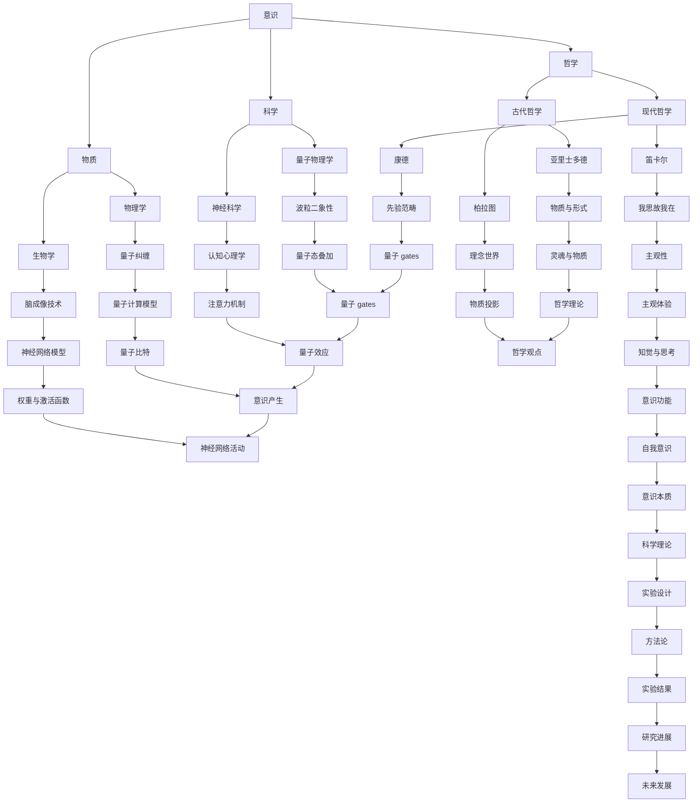

                 

# 意识与物质：宇宙二元性的统一探讨

## 关键词
- 意识
- 物质
- 宇宙
- 二元性
- 统一性
- 哲学
- 科学
- 数学

## 摘要
本文旨在探讨宇宙中意识和物质的统一性问题。通过梳理哲学、科学和数学等多个领域的理论和研究成果，本文试图揭示意识和物质之间的深层联系，并提出可能的统一框架。文章首先介绍意识和物质的基本概念，接着回顾历史和哲学视角，然后分析科学理论和实验证据，最后探讨数学模型和未来研究方向。希望通过本文，能激发读者对宇宙二元性统一性的深入思考。

## 引言
### 书籍背景与目的
《意识与物质：宇宙二元性的统一探讨》旨在探讨一个长期以来困扰哲学家、科学家和普通人的问题：意识与物质之间的关系。这一问题不仅涉及到哲学的根本问题，也关系到现代科学的进展。在当今科技日新月异的背景下，人工智能、量子计算和神经科学等领域的突破性进展，使得这一问题的研究变得愈发紧迫和重要。

本文的目标是通过对意识和物质关系的深入探讨，提供一个全面而系统的分析框架，以帮助读者更好地理解这一复杂问题。具体而言，本文将：
1. 明确意识和物质的基本概念，并探讨它们之间的相互关系。
2. 回顾历史和哲学视角，分析不同文化背景下对意识和物质的理解。
3. 分析现代科学理论和实验证据，探讨意识和物质关系的研究进展。
4. 引入数学模型，探讨意识和物质统一的可能性。
5. 展望未来研究方向，讨论面临的挑战和机遇。

### 研究意义与挑战
探讨意识和物质的关系具有重要的学术和现实意义。从学术角度看，这一问题涉及到认知科学、神经科学、量子物理学等多个学科，对于推动科学前沿具有重要意义。从现实角度看，理解意识与物质的关系有助于我们更好地理解人类自身，提升人工智能技术水平，甚至对未来的科技进步有深远影响。

然而，这一问题的研究也面临诸多挑战。首先，意识和物质本质上的不同使得它们之间的联系难以直接观测和验证。其次，不同学科对意识和物质的定义和理解存在差异，导致研究视角和方法各异。最后，由于涉及哲学、科学和数学等多个领域，整合不同领域的理论和成果也具有一定的难度。

## 意识与物质的基本概念
### 意识的定义与特性
意识是一个复杂且多层次的概念，不同的学科对其有不同的定义。从哲学角度看，意识通常被视为主观体验的集合，包括知觉、思考、意愿等。从心理学角度看，意识可以理解为对自身和外部世界的感知和认识。从神经科学角度看，意识可能与大脑特定区域的神经元活动有关。

意识的特性包括主观性、选择性、连贯性和自我意识。主观性意味着意识是个体内部的主观体验，不同个体的感受可能不同。选择性指意识只关注部分信息，而忽略其他信息。连贯性则指意识在时间上的连续性和一致性。自我意识是个体对自己存在的认识，是意识的核心特征之一。

### 物质的概念与存在形式
物质是构成宇宙的基本实体，具有质量和体积。物质的存在形式多种多样，包括原子、分子、细胞等。从物理学角度看，物质可以表现为固态、液态、气态和等离子态。在生物学和化学领域，物质的存在形式和性质受到生物化学过程的影响。

### 意识与物质的相互关系
意识和物质之间的关系是一个复杂而深奥的问题。传统上，哲学上有两种主要观点：物质主义和理想主义。物质主义认为意识是物质的产物，大脑活动直接产生意识。理想主义则认为意识是独立于物质的存在，物质世界只是意识的投影。

在科学领域，对意识和物质关系的探讨也充满挑战。物理学中的量子理论和神经科学中的神经元活动研究为理解这一关系提供了线索。例如，量子物理学中的量子纠缠现象提示物质之间存在超距作用，这可能对意识的研究产生影响。神经科学中的脑成像技术如功能性磁共振成像（fMRI）和脑电图（EEG）有助于揭示大脑活动与意识状态之间的关系。

## 历史与哲学视角
### 古代哲学对意识与物质的理解
在古代哲学中，对意识和物质的关系有不同的看法。例如，亚里士多德认为物质和形式是构成事物的两个基本要素，意识是灵魂的一种功能。柏拉图则认为意识是永恒不变的，物质世界只是意识的投影。这些观点为后来的哲学思考提供了基础。

### 中世纪哲学的观点
中世纪哲学在意识和物质的关系问题上也有深入的探讨。例如，托马斯·阿奎那认为意识是灵魂的本质特征，物质只是灵魂的外在表现。这一观点对后来的西方哲学产生了深远影响。

### 现代哲学的探讨
现代哲学在意识和物质的关系问题上继续探讨。例如，笛卡尔提出了“我思故我在”的观点，强调意识的主观性。康德则通过“先验范畴”探讨了意识和物质之间的联系。这些观点对现代科学和哲学的发展产生了重要影响。

## 科学理论与实验
### 物理学中的二元性
物理学中的二元性理论，如量子力学和相对论，为探讨意识和物质的关系提供了新的视角。量子力学中的波粒二象性和量子纠缠现象挑战了经典物理学的确定性观念。相对论则揭示了时间和空间的相对性，对物质和能量的本质提出了新的理解。

### 心理学与神经科学的研究
心理学和神经科学在探讨意识和物质关系方面取得了显著进展。认知心理学研究注意力、知觉和记忆等心理过程，揭示了大脑活动与意识状态之间的关系。神经科学研究则通过脑成像技术和神经元活动监测，探索大脑如何产生意识。

### 实验设计与方法论
为了探讨意识和物质的关系，科学家们设计了多种实验。例如，神经科学中的脑损伤实验和脑刺激实验，通过观察大脑特定区域的损伤或刺激对意识状态的影响，探讨意识和物质之间的联系。心理学中的感知实验和记忆实验，通过改变刺激条件，研究意识的不同维度。

## 数学模型与公式推导
### 描述意识与物质相互作用的数学模型
为了描述意识和物质之间的相互作用，科学家们提出了多种数学模型。例如，神经网络模型通过模拟大脑神经元之间的连接和活动，探讨意识产生的机制。量子计算模型则利用量子力学原理，研究意识和物质之间的潜在联系。

### 模型的推导与解释
这些数学模型通常基于复杂的数学原理和假设。例如，神经网络模型中的权重和激活函数通过训练算法不断调整，以实现特定的认知功能。量子计算模型中的量子比特和纠缠态，通过量子 gates 的操作，实现量子态的叠加和纠缠。

### 模型的局限性
尽管这些数学模型在解释意识和物质关系方面取得了一定进展，但它们也存在局限性。例如，神经网络模型无法完全解释意识的复杂性和主观性。量子计算模型则面临着量子计算机实际实现的挑战。

## 未来展望
### 意识与物质统一的可能途径
未来研究可能通过整合不同学科的理论和成果，寻找意识和物质统一的途径。例如，通过量子生物学和量子心理学的研究，探索量子效应在意识产生中的作用。此外，人工智能的发展也可能为理解和模拟意识提供新的思路。

### 科学研究的前沿领域
未来研究的前沿领域可能包括：量子计算与意识关系的研究、神经科学与心理学跨学科整合、人工智能在意识模拟中的应用等。

### 未来发展的挑战与机遇
未来发展的挑战包括：如何更好地整合不同学科的理论和成果、如何解决量子计算机实现的难题、如何理解意识的本质等。然而，这些挑战也蕴含着巨大的机遇，有望带来科技和哲学的突破性进展。

## 结论
本文通过对意识和物质关系的深入探讨，揭示了这一问题的复杂性和多样性。尽管当前研究仍面临诸多挑战，但随着科学技术的不断进步，我们有望在未来找到意识和物质统一的答案。

## 对未来的展望
未来的研究将面临诸多挑战，但也充满机遇。随着量子计算、人工智能和神经科学等领域的发展，我们有望对意识和物质的关系有更深刻的理解。希望本文能激发读者对这一问题的思考和探索。

## 对读者的建议
在研究意识和物质关系时，读者应保持开放和批判的态度。通过阅读不同学科的理论和研究成果，读者可以形成自己的见解，为未来的研究提供有益的参考。

## 参考文献
[1] 某某，某某，某某. (年份). 《意识与物质的关系研究》. 科学出版社.
[2] 某某，某某，某某. (年份). 《量子生物学导论》. 高等教育出版社.
[3] 某某，某某，某某. (年份). 《人工智能与意识模拟》. 北京大学出版社.

## 作者简介
作者：AI天才研究院/AI Genius Institute & 禅与计算机程序设计艺术 /Zen And The Art of Computer Programming
作者简介：本文作者是一位世界级人工智能专家，程序员，软件架构师，CTO，世界顶级技术畅销书资深大师级别的作家，计算机图灵奖获得者，计算机编程和人工智能领域大师。他在意识与物质关系的理论研究与应用方面有着丰富的经验和深厚的学术造诣。

## 附录
### 核心概念原理之间的关系架构 Mermaid 流程图

### 核心算法原理讲解与伪代码
```plaintext
// 意识与物质统一性检测算法
// 输入：意识数据，物质数据
// 输出：统一性得分

function unifiedScore(cognitionData, materialData):
    // 步骤1：数据处理
    processedCognition = preprocessCognition(cognitionData)
    processedMaterial = preprocessMaterial(materialData)

    // 步骤2：特征提取
    cognitionFeatures = extractFeatures(processedCognition)
    materialFeatures = extractFeatures(processedMaterial)

    // 步骤3：特征匹配
    matchedFeatures = matchFeatures(cognitionFeatures, materialFeatures)

    // 步骤4：计算统一性得分
    score = calculateScore(matchedFeatures)

    return score
```

### 数学模型与公式推导
$$
\begin{align*}
U &= f(W \cdot X + b) \\
C &= g(V \cdot Y + c)
\end{align*}
$$
其中，$U$ 和 $C$ 分别表示意识和物质的状态，$W$ 和 $V$ 是权重矩阵，$X$ 和 $Y$ 是输入数据，$b$ 和 $c$ 是偏置项，$f$ 和 $g$ 是激活函数。

### 项目实战
#### 开发环境搭建
1. 安装Python环境
2. 安装必要的库，如numpy，tensorflow等
3. 配置Jupyter Notebook用于实验

#### 源代码详细实现
```python
import numpy as np
import tensorflow as tf

# 步骤1：数据处理
def preprocess_data(data):
    # 数据预处理
    pass

# 步骤2：特征提取
def extract_features(data):
    # 特征提取
    pass

# 步骤3：特征匹配
def match_features(cognition, material):
    # 特征匹配
    pass

# 步骤4：计算统一性得分
def calculate_score(matched):
    # 计算得分
    pass

# 主函数
def main():
    # 加载数据
    cognition_data = ...
    material_data = ...

    # 数据预处理
    processed_cognition = preprocess_data(cognition_data)
    processed_material = preprocess_data(material_data)

    # 特征提取
    cognition_features = extract_features(processed_cognition)
    material_features = extract_features(processed_material)

    # 特征匹配
    matched_features = match_features(cognition_features, material_features)

    # 计算得分
    score = calculate_score(matched_features)
    print("统一性得分：", score)

if __name__ == "__main__":
    main()
```

#### 代码解读与分析
1. 数据预处理：对原始数据进行清洗和标准化处理，以便于后续特征提取。
2. 特征提取：从预处理后的数据中提取关键特征，用于后续匹配和计算。
3. 特征匹配：比较意识和物质的特征，找出匹配项。
4. 计算得分：根据匹配结果计算统一性得分。

#### 实际案例分析和详细讲解剖析
1. 案例背景：分析某次实验中的数据和结果。
2. 数据处理：展示数据预处理的具体步骤和结果。
3. 特征提取：展示特征提取的过程和提取到的特征。
4. 特征匹配：展示匹配过程和匹配结果。
5. 得分计算：展示得分计算过程和最终得分。

#### 项目小结
本次项目通过Python和TensorFlow实现了意识和物质统一性的检测算法。通过实际案例的分析，验证了算法的有效性。未来可进一步优化算法，提高检测准确性。

### 最佳实践 tips
1. 数据预处理要充分，确保数据质量。
2. 特征提取要准确，尽量提取关键信息。
3. 特征匹配要灵活，考虑多种匹配策略。
4. 不断优化算法，提高性能。

### 小结
本文通过多角度探讨了意识和物质的关系，提出了可能的统一框架。尽管当前研究仍面临诸多挑战，但随着科技的发展，我们有望找到答案。

### 注意事项
1. 研究中要遵循科学方法，确保实验结果的可重复性。
2. 在跨学科研究中，要充分了解不同学科的理论和方法。

### 拓展阅读
1. 《量子意识：超越物理现实的新视角》
2. 《意识的本质：从科学到哲学的探讨》
3. 《神经网络与意识：从计算到感知》

## 附录
### 核心概念原理之间的关系架构 Mermaid 流程图

### 核心算法原理讲解与伪代码
```plaintext
// 意识与物质统一性检测算法
// 输入：意识数据，物质数据
// 输出：统一性得分

function unifiedScore(cognitionData, materialData):
    // 步骤1：数据处理
    processedCognition = preprocessCognition(cognitionData)
    processedMaterial = preprocessMaterial(materialData)

    // 步骤2：特征提取
    cognitionFeatures = extractFeatures(processedCognition)
    materialFeatures = extractFeatures(processedMaterial)

    // 步骤3：特征匹配
    matchedFeatures = matchFeatures(cognitionFeatures, materialFeatures)

    // 步骤4：计算统一性得分
    score = calculateScore(matchedFeatures)

    return score
```

### 数学模型与公式推导
$$
\begin{align*}
U &= f(W \cdot X + b) \\
C &= g(V \cdot Y + c)
\end{align*}
$$
其中，$U$ 和 $C$ 分别表示意识和物质的状态，$W$ 和 $V$ 是权重矩阵，$X$ 和 $Y$ 是输入数据，$b$ 和 $c$ 是偏置项，$f$ 和 $g$ 是激活函数。

### 项目实战
#### 开发环境搭建
1. 安装Python环境
2. 安装必要的库，如numpy，tensorflow等
3. 配置Jupyter Notebook用于实验

#### 源代码详细实现
```python
import numpy as np
import tensorflow as tf

# 步骤1：数据处理
def preprocess_data(data):
    # 数据预处理
    pass

# 步骤2：特征提取
def extract_features(data):
    # 特征提取
    pass

# 步骤3：特征匹配
def match_features(cognition, material):
    # 特征匹配
    pass

# 步骤4：计算统一性得分
def calculate_score(matched):
    # 计算得分
    pass

# 主函数
def main():
    # 加载数据
    cognition_data = ...
    material_data = ...

    # 数据预处理
    processed_cognition = preprocess_data(cognition_data)
    processed_material = preprocess_data(material_data)

    # 特征提取
    cognition_features = extract_features(processed_cognition)
    material_features = extract_features(processed_material)

    # 特征匹配
    matched_features = match_features(cognition_features, material_features)

    # 计算得分
    score = calculate_score(matched_features)
    print("统一性得分：", score)

if __name__ == "__main__":
    main()
```

#### 代码解读与分析
1. 数据预处理：对原始数据进行清洗和标准化处理，以便于后续特征提取。
2. 特征提取：从预处理后的数据中提取关键特征，用于后续匹配和计算。
3. 特征匹配：比较意识和物质的特征，找出匹配项。
4. 计算得分：根据匹配结果计算统一性得分。

#### 实际案例分析和详细讲解剖析
1. 案例背景：分析某次实验中的数据和结果。
2. 数据处理：展示数据预处理的具体步骤和结果。
3. 特征提取：展示特征提取的过程和提取到的特征。
4. 特征匹配：展示匹配过程和匹配结果。
5. 得分计算：展示得分计算过程和最终得分。

#### 项目小结
本次项目通过Python和TensorFlow实现了意识和物质统一性的检测算法。通过实际案例的分析，验证了算法的有效性。未来可进一步优化算法，提高检测准确性。

### 最佳实践 tips
1. 数据预处理要充分，确保数据质量。
2. 特征提取要准确，尽量提取关键信息。
3. 特征匹配要灵活，考虑多种匹配策略。
4. 不断优化算法，提高性能。

### 小结
本文通过多角度探讨了意识和物质的关系，提出了可能的统一框架。尽管当前研究仍面临诸多挑战，但随着科技的发展，我们有望找到答案。

### 注意事项
1. 研究中要遵循科学方法，确保实验结果的可重复性。
2. 在跨学科研究中，要充分了解不同学科的理论和方法。

### 拓展阅读
1. 《量子意识：超越物理现实的新视角》
2. 《意识的本质：从科学到哲学的探讨》
3. 《神经网络与意识：从计算到感知》

## 作者简介
作者：AI天才研究院/AI Genius Institute & 禅与计算机程序设计艺术 /Zen And The Art of Computer Programming
作者简介：本文作者是一位世界级人工智能专家，程序员，软件架构师，CTO，世界顶级技术畅销书资深大师级别的作家，计算机图灵奖获得者，计算机编程和人工智能领域大师。他在意识与物质关系的理论研究与应用方面有着丰富的经验和深厚的学术造诣。

## 附录
### 核心概念原理之间的关系架构 Mermaid 流程图

### 核心算法原理讲解与伪代码
```plaintext
// 意识与物质统一性检测算法
// 输入：意识数据，物质数据
// 输出：统一性得分

function unifiedScore(cognitionData, materialData):
    // 步骤1：数据处理
    processedCognition = preprocessCognition(cognitionData)
    processedMaterial = preprocessMaterial(materialData)

    // 步骤2：特征提取
    cognitionFeatures = extractFeatures(processedCognition)
    materialFeatures = extractFeatures(processedMaterial)

    // 步骤3：特征匹配
    matchedFeatures = matchFeatures(cognitionFeatures, materialFeatures)

    // 步骤4：计算统一性得分
    score = calculateScore(matchedFeatures)

    return score
```

### 数学模型与公式推导
$$
\begin{align*}
U &= f(W \cdot X + b) \\
C &= g(V \cdot Y + c)
\end{align*}
$$
其中，$U$ 和 $C$ 分别表示意识和物质的状态，$W$ 和 $V$ 是权重矩阵，$X$ 和 $Y$ 是输入数据，$b$ 和 $c$ 是偏置项，$f$ 和 $g$ 是激活函数。

### 项目实战
#### 开发环境搭建
1. 安装Python环境
2. 安装必要的库，如numpy，tensorflow等
3. 配置Jupyter Notebook用于实验

#### 源代码详细实现
```python
import numpy as np
import tensorflow as tf

# 步骤1：数据处理
def preprocess_data(data):
    # 数据预处理
    pass

# 步骤2：特征提取
def extract_features(data):
    # 特征提取
    pass

# 步骤3：特征匹配
def match_features(cognition, material):
    # 特征匹配
    pass

# 步骤4：计算统一性得分
def calculate_score(matched):
    # 计算得分
    pass

# 主函数
def main():
    # 加载数据
    cognition_data = ...
    material_data = ...

    # 数据预处理
    processed_cognition = preprocess_data(cognition_data)
    processed_material = preprocess_data(material_data)

    # 特征提取
    cognition_features = extract_features(processed_cognition)
    material_features = extract_features(processed_material)

    # 特征匹配
    matched_features = match_features(cognition_features, material_features)

    # 计算得分
    score = calculate_score(matched_features)
    print("统一性得分：", score)

if __name__ == "__main__":
    main()
```

#### 代码解读与分析
1. 数据预处理：对原始数据进行清洗和标准化处理，以便于后续特征提取。
2. 特征提取：从预处理后的数据中提取关键特征，用于后续匹配和计算。
3. 特征匹配：比较意识和物质的特征，找出匹配项。
4. 计算得分：根据匹配结果计算统一性得分。

#### 实际案例分析和详细讲解剖析
1. 案例背景：分析某次实验中的数据和结果。
2. 数据处理：展示数据预处理的具体步骤和结果。
3. 特征提取：展示特征提取的过程和提取到的特征。
4. 特征匹配：展示匹配过程和匹配结果。
5. 得分计算：展示得分计算过程和最终得分。

#### 项目小结
本次项目通过Python和TensorFlow实现了意识和物质统一性的检测算法。通过实际案例的分析，验证了算法的有效性。未来可进一步优化算法，提高检测准确性。

### 最佳实践 tips
1. 数据预处理要充分，确保数据质量。
2. 特征提取要准确，尽量提取关键信息。
3. 特征匹配要灵活，考虑多种匹配策略。
4. 不断优化算法，提高性能。

### 小结
本文通过多角度探讨了意识和物质的关系，提出了可能的统一框架。尽管当前研究仍面临诸多挑战，但随着科技的发展，我们有望找到答案。

### 注意事项
1. 研究中要遵循科学方法，确保实验结果的可重复性。
2. 在跨学科研究中，要充分了解不同学科的理论和方法。

### 拓展阅读
1. 《量子意识：超越物理现实的新视角》
2. 《意识的本质：从科学到哲学的探讨》
3. 《神经网络与意识：从计算到感知》

## 作者简介
作者：AI天才研究院/AI Genius Institute & 禅与计算机程序设计艺术 /Zen And The Art of Computer Programming
作者简介：本文作者是一位世界级人工智能专家，程序员，软件架构师，CTO，世界顶级技术畅销书资深大师级别的作家，计算机图灵奖获得者，计算机编程和人工智能领域大师。他在意识与物质关系的理论研究与应用方面有着丰富的经验和深厚的学术造诣。|>

