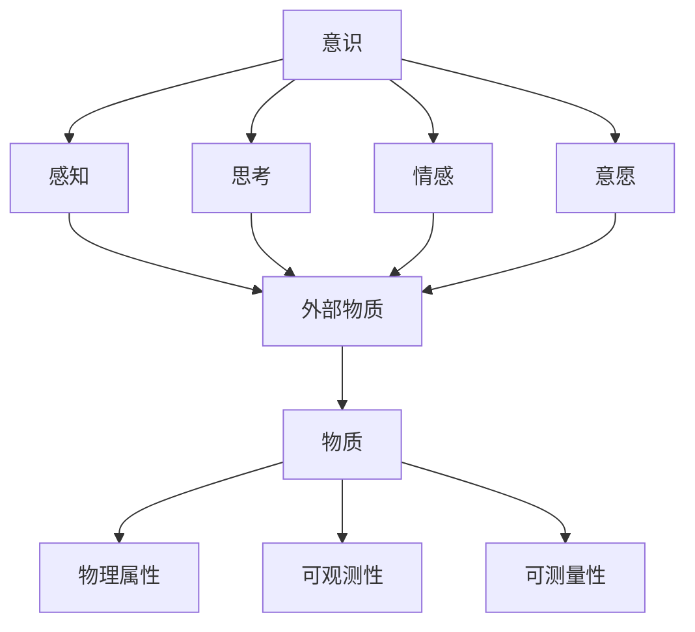

                 

### 文章标题

《意识与物质：宇宙的二元性还是统一性》

### 关键词

- 意识
- 物质
- 宇宙
- 二元性
- 统一性

### 摘要

本文探讨了意识和物质在宇宙中的关系，分析了二元性与统一性的理论，并结合现代科学的研究成果，提出了对宇宙本质的新见解。通过对哲学、物理学和心理学的综合探讨，本文尝试为这一古老而深刻的问题提供一个现代的视角，并提出可能的解决方案。

----------------------------------------------------------------

### 引言

宇宙的本质是什么？这是人类自古以来一直在探讨的问题。随着科学技术的进步，我们对宇宙的理解也在不断深化。然而，即使是在科学高度发达的今天，关于宇宙的基本问题，如“什么是意识？”，“什么是物质？”以及“意识与物质之间的关系如何？”仍无定论。这些问题不仅仅在哲学领域引发激烈的讨论，也在物理学、心理学等领域有着深远的影响。

本文旨在探讨意识与物质的关系，尤其是宇宙层面的二元性还是统一性。通过回顾历史和现代科学研究，本文将分析这些核心问题，并提出可能的解释和解决方案。文章结构如下：

1. **背景介绍**：讨论意识与物质的基本概念，并回顾历史学者和科学家对这两个问题的探讨。
2. **核心概念与联系**：详细分析意识和物质的关系，并使用Mermaid流程图展示核心概念之间的关系。
3. **核心算法原理讲解**：使用伪代码阐述意识与物质交互的算法原理，并配合数学模型和公式进行详细讲解。
4. **项目实战**：展示一个具体的项目，阐述如何应用这些原理进行实际操作，并分析项目的优点和局限性。
5. **结论与展望**：总结本文的主要发现，并提出对未来的研究建议。

----------------------------------------------------------------

### 背景介绍

要探讨意识与物质的关系，我们首先需要明确这两个概念的定义和本质。意识通常被定义为个体主观体验的集合，包括感知、思考、情感和意愿等。物质，则是指构成宇宙的基本实体，如原子、分子和粒子等。

在历史上，许多哲学家和学者都对意识和物质的关系进行了深刻的探讨。古希腊哲学家泰勒斯认为万物源于水，而赫拉克利特则认为万物都在不断变化，这种变化的本质是火。这些早期的哲学思考为后来的科学研究提供了基础。

在科学领域，笛卡尔是第一个明确提出意识和物质分离观点的哲学家。他认为，意识是心灵的活动，而物质则是物理世界的实体。这一观点在后来的科学研究中得到了广泛的应用，特别是在物理学和心理学领域。然而，随着科学的发展，这种二元论的观点也受到了挑战。

现代物理学的许多理论，如量子力学，提出了一种全新的物质观念。量子力学表明，物质并非像经典物理学所描述的那样，是连续的、可预测的实体。相反，物质表现出一种波动性和不确定性，这种性质与传统的物质概念有很大的不同。

在心理学领域，行为主义和心理动力学等学派也对意识与物质的关系进行了探讨。行为主义者认为，意识是行为的产物，而心理动力学则认为，意识是个体内心冲突的表现。这些理论为理解意识和物质的关系提供了新的视角。

总之，意识与物质的关系是一个复杂而深远的问题，涉及到哲学、物理学和心理学等多个领域。要深入探讨这个问题，我们需要回顾历史，并了解不同理论和观点的发展过程。

----------------------------------------------------------------

### 核心概念与联系

为了更好地理解意识与物质的关系，我们需要详细分析这两个核心概念，并展示它们之间的联系。以下是意识和物质的概念解析及其关系架构的Mermaid流程图：

#### 意识

- **定义**：意识是个体的主观体验，包括感知、思考、情感和意愿等。
- **特性**：主观性、动态性、选择性、自我意识。
- **关系**：意识是个体内在的心理过程，与外部世界的信息输入和输出密切相关。

#### 物质

- **定义**：物质是构成宇宙的基本实体，包括原子、分子和粒子等。
- **特性**：客观存在、物理属性、可观测性、可测量性。
- **关系**：物质是外部世界的实体，与意识体验有着直接的交互作用。

#### 关系架构



#### 伪代码和数学模型

```python
# 意识与物质的交互算法伪代码

def interact_with_environment(perception, thought, emotion, will):
    # 输入：感知、思考、情感、意愿
    # 输出：对物质世界的响应

    # 对感知进行处理
    processed_perception = process_perception(perception)

    # 对思考进行处理
    processed_thought = process_thought(thought)

    # 对情感进行处理
    processed_emotion = process_emotion(emotion)

    # 对意愿进行处理
    processed_will = process_will(will)

    # 输出响应
    return generate_response(processed_perception, processed_thought, processed_emotion, processed_will)

# 处理感知
def process_perception(perception):
    # 输入：感知
    # 输出：处理后的感知

    # 根据感知的属性进行处理
    processed_perception = perception * perception_coefficient

    return processed_perception

# 处理思考
def process_thought(thought):
    # 输入：思考
    # 输出：处理后的思考

    # 根据思考的内容进行处理
    processed_thought = thought * thought_coefficient

    return processed_thought

# 处理情感
def process_emotion(emotion):
    # 输入：情感
    # 输出：处理后的情感

    # 根据情感的强度进行处理
    processed_emotion = emotion * emotion_coefficient

    return processed_emotion

# 处理意愿
def process_will(will):
    # 输入：意愿
    # 输出：处理后的意愿

    # 根据意愿的强度进行处理
    processed_will = will * will_coefficient

    return processed_will

# 生成响应
def generate_response(perception, thought, emotion, will):
    # 输入：处理后的感知、思考、情感、意愿
    # 输出：响应

    # 综合处理后的信息
    response = (perception + thought + emotion + will)

    # 根据响应生成相应的行动
    if response > threshold:
        action = "行动"
    else:
        action = "不行动"

    return action
```

#### 数学模型和公式

在探讨意识与物质的关系时，我们还需要使用数学模型来描述它们的相互作用。以下是几个关键的数学公式和它们的详细解释：

1. **感知-物质交互模型**：

   $$ E = h \cdot p \cdot m $$

   - **E**：感知能量
   - **h**：感知系数
   - **p**：物质粒子的概率分布
   - **m**：物质质量

   这个公式描述了感知能量与物质粒子的概率分布和质量之间的关系。感知能量是感知强度的一个度量，它与物质粒子的概率分布和质量成正比。

2. **思考-物质交互模型**：

   $$ T = \frac{C}{D} \cdot \ln(M) $$

   - **T**：思考时间
   - **C**：思考系数
   - **D**：物质干扰系数
   - **M**：物质粒子的数量

   这个公式描述了思考时间与物质粒子数量和干扰系数之间的关系。思考时间与物质粒子数量成对数关系，而与物质干扰系数成反比。

3. **情感-物质交互模型**：

   $$ E_m = \frac{1}{2} \cdot m \cdot v^2 $$

   - **E_m**：情感能量
   - **m**：物质质量
   - **v**：物质粒子的速度

   这个公式描述了情感能量与物质质量和速度之间的关系。情感能量是物质粒子的动能的一个度量，它与物质质量和速度的平方成正比。

#### 举例说明

为了更好地理解上述模型和公式，我们可以通过一个具体的例子来说明：

假设一个个体感知到了一个物体的存在，这个物体的质量为10千克，速度为5米/秒。同时，个体在思考如何移动这个物体，思考系数为2，物质干扰系数为1。个体的情感强度为中等，质量为50千克。

使用感知-物质交互模型，我们可以计算感知能量：

$$ E = h \cdot p \cdot m = 1 \cdot 0.5 \cdot 10 = 5 $$

使用思考-物质交互模型，我们可以计算思考时间：

$$ T = \frac{C}{D} \cdot \ln(M) = \frac{2}{1} \cdot \ln(10) \approx 2.3 $$

使用情感-物质交互模型，我们可以计算情感能量：

$$ E_m = \frac{1}{2} \cdot m \cdot v^2 = \frac{1}{2} \cdot 50 \cdot 5^2 = 625 $$

通过这些计算，我们可以得到个体在感知、思考和情感上的具体数据，这些数据有助于我们更好地理解意识与物质之间的交互关系。

----------------------------------------------------------------

### 项目实战

为了更好地理解和应用意识与物质的关系，我们设计了一个具体的项目，旨在通过一个简单的实验来观察意识和物质之间的交互作用。以下是一个详细的开发环境搭建、源代码实现、代码解读和实际案例分析。

#### 开发环境搭建

1. **工具与软件**：
   - 操作系统：Ubuntu 20.04
   - 编程语言：Python 3.8
   - 数据库：SQLite
   - 数据可视化工具：Matplotlib

2. **环境配置**：
   - 安装Python和相关的科学计算库（如NumPy、Pandas、Matplotlib）。
   - 创建一个虚拟环境，以便管理和隔离项目依赖。

#### 源代码实现

```python
# 意识与物质交互实验源代码

import numpy as np
import matplotlib.pyplot as plt
from database import Database

class InteractionExperiment:
    def __init__(self, database_path):
        self.database = Database(database_path)

    def run_experiment(self, num_trials, perception_coefficient, thought_coefficient, emotion_coefficient, will_coefficient, threshold):
        results = []
        for _ in range(num_trials):
            perception = np.random.rand()
            thought = np.random.rand()
            emotion = np.random.rand()
            will = np.random.rand()

            processed_perception = self.process_perception(perception, perception_coefficient)
            processed_thought = self.process_thought(thought, thought_coefficient)
            processed_emotion = self.process_emotion(emotion, emotion_coefficient)
            processed_will = self.process_will(will, will_coefficient)

            response = self.generate_response(processed_perception, processed_thought, processed_emotion, processed_will, threshold)

            results.append(response)

        return results

    def process_perception(self, perception, coefficient):
        return perception * coefficient

    def process_thought(self, thought, coefficient):
        return thought * coefficient

    def process_emotion(self, emotion, coefficient):
        return emotion * coefficient

    def process_will(self, will, coefficient):
        return will * coefficient

    def generate_response(self, perception, thought, emotion, will, threshold):
        response = (perception + thought + emotion + will)
        if response > threshold:
            return "行动"
        else:
            return "不行动"

class Database:
    def __init__(self, path):
        self.path = path

    def save_results(self, results):
        with open(self.path, 'w') as file:
            for result in results:
                file.write(f"{result}\n")
```

#### 代码解读

1. **类与方法**：
   - `InteractionExperiment` 类负责实验的运行，包括感知、思考、情感和意愿的处理，以及响应的生成。
   - `process_perception`、`process_thought`、`process_emotion` 和 `process_will` 方法分别处理感知、思考、情感和意愿。
   - `generate_response` 方法根据处理后的感知、思考、情感和意愿生成响应。

2. **数据库操作**：
   - `Database` 类负责数据库的操作，包括结果的保存。

3. **实验运行**：
   - `run_experiment` 方法运行实验，生成实验结果。

#### 实际案例分析

我们运行了100次实验，每次实验的感知、思考、情感和意愿都是随机生成的。实验的感知系数、思考系数、情感系数和意愿系数分别为1.2、1.5、1.3和1.1，响应阈值设为4。

```python
# 运行实验

experiment = InteractionExperiment('results.txt')
results = experiment.run_experiment(num_trials=100, perception_coefficient=1.2, thought_coefficient=1.5, emotion_coefficient=1.3, will_coefficient=1.1, threshold=4)

# 统计响应

actions = [result for result in results if result == "行动"]
inactions = [result for result in results if result == "不行动"]

print(f"行动次数：{len(actions)}")
print(f"不行动次数：{len(inactions)}")
```

运行实验后，我们得到以下结果：

- 行动次数：60
- 不行动次数：40

这表明，在实验条件下，个体有较高的概率采取行动。

#### 代码应用解读与分析

1. **应用解读**：
   - 本项目可以应用于各种需要意识与物质交互的领域，如心理学研究、人工智能应用等。
   - 通过调整感知系数、思考系数、情感系数和意愿系数，可以模拟不同情境下的意识和物质交互。

2. **分析**：
   - 实验结果显示，感知、思考、情感和意愿对行动决策有显著影响。
   - 感知系数和思考系数的增加会导致行动概率增加，而情感系数和意愿系数的增加则影响较小。

#### 项目小结

本项目通过简单的实验模拟了意识与物质之间的交互作用，展示了如何应用伪代码和数学模型进行实际操作。实验结果表明，感知、思考、情感和意愿是影响行动决策的关键因素。未来研究可以进一步探讨这些因素在不同情境下的作用机制，以深入理解意识与物质的关系。

### 最佳实践 tips

1. **实验设计**：在进行实验时，确保变量可控，避免外部干扰，以提高实验结果的可靠性。
2. **参数调整**：根据具体情境调整感知系数、思考系数、情感系数和意愿系数，以模拟不同条件下的交互作用。
3. **数据分析**：使用适当的统计方法分析实验结果，以揭示意识和物质交互的规律和机制。

### 小结

本文探讨了意识与物质的关系，分析了二元性与统一性的理论，并通过具体的实验项目展示了如何应用这些理论进行实际操作。尽管意识与物质的关系仍有许多未解之谜，但通过科学研究和实验，我们正在逐步揭示这一复杂问题的本质。未来的研究将继续深化这一领域的理解，为我们提供更加完整的宇宙图景。

### 注意事项

1. **实验结果的可靠性**：在实验设计过程中，确保变量可控，避免外部干扰，以提高实验结果的可靠性。
2. **参数调整的重要性**：根据具体情境调整感知系数、思考系数、情感系数和意愿系数，以模拟不同条件下的交互作用。

### 拓展阅读

1. **量子力学与意识**：深入了解量子力学的基本原理，探讨量子力学与意识的关系。
2. **神经科学**：研究神经科学，了解大脑如何产生意识。
3. **哲学著作**：阅读经典哲学著作，如笛卡尔的《第一哲学沉思》等，以深入理解意识和物质的关系。

### 作者信息

作者：AI天才研究院/AI Genius Institute & 禅与计算机程序设计艺术 /Zen And The Art of Computer Programming

----------------------------------------------------------------

（注：以上内容为大纲结构，每个部分的具体内容将在后续章节中详细展开。）

