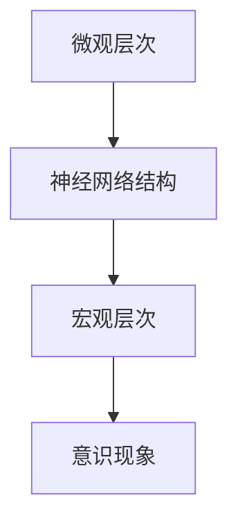

                 

### 文章标题

# 意识作为宇宙的涌现属性：复杂性的产物

> 关键词：意识、宇宙、复杂性、涌现属性、人工智能

> 摘要：本文探讨了意识在宇宙中的起源和本质，强调了复杂性在理解意识过程中的关键作用。文章通过深入分析意识的多种定义和特性，探讨了意识与宇宙的关系，并阐述了复杂性科学的基本原理。在此基础上，文章提出了意识的涌现属性，并讨论了意识的数学和物理模型。通过实验研究和实际案例分析，本文揭示了意识的复杂性和多样性，并展望了未来意识研究的发展方向。

## 引言

随着科学技术的发展，人类对宇宙的认知不断拓展。从宏观宇宙的星系和黑洞，到微观宇宙的量子力学和基本粒子，我们逐渐揭开了宇宙的神秘面纱。然而，在这个浩瀚的宇宙中，一个最为复杂和神秘的现象就是意识。意识是人类思考和感知世界的基础，也是人类独特的精神属性。然而，意识是如何产生的，其本质是什么，一直是哲学、心理学和神经科学等领域探讨的核心问题。

近年来，复杂性科学的发展为理解意识的起源和本质提供了新的视角。复杂性科学强调系统内部各要素之间的相互作用和涌现属性，认为复杂现象往往源于简单的规则和结构的非线性演化。在这种背景下，本文提出了“意识作为宇宙的涌现属性：复杂性的产物”这一主题，旨在深入探讨意识与宇宙、复杂性之间的关系，为理解意识的本质提供新的思路。

本文首先介绍了意识的概念和特性，包括意识的主观体验和适应性。然后，我们探讨了复杂性的定义和宇宙中的复杂性现象。接着，文章提出了意识的涌现属性，并讨论了意识的数学和物理模型。通过实验研究和实际案例分析，我们进一步揭示了意识的复杂性和多样性。最后，本文展望了未来意识研究的发展方向，并提出了对人类社会的潜在影响。

## 意识的概念与特性

### 意识的定义

意识是一个多维度的概念，不同学科领域对其有着不同的定义和解释。在哲学领域，意识通常被描述为一种主观体验，即个体对自身和外部世界的感知和认知。哲学家笛卡尔提出了“我思故我在”的观点，强调了意识的内在性和独立性。在心理学领域，意识被看作是一种心理状态，它涉及到注意、感知、记忆和思考等过程。神经科学家则从生物学的角度研究意识，试图揭示大脑如何产生意识。

尽管对意识的具体定义存在分歧，但普遍认同的是意识具有主观体验这一核心特性。主观体验是指个体对自身和外部世界的直接感受，这种感受是独特的、个体化的，并且难以客观测量。因此，意识被认为是人类精神世界的核心组成部分，是人类与外部世界互动的基础。

### 意识的特性

1. **适应性**

意识的一个重要特性是其适应性。人类意识能够根据环境的变化调整自身的状态和行为。例如，当我们在一个嘈杂的环境中时，我们会调整注意力，以便更好地听到重要的信息。这种适应性使得意识能够有效地适应各种环境，从而保证个体的生存和繁衍。

2. **复杂性**

意识具有高度的复杂性。这种复杂性不仅体现在意识处理信息的多样性上，还体现在其动态变化的过程中。例如，意识可以同时处理视觉、听觉、触觉等多种感官信息，并且能够将这些信息整合为一个统一的感知体验。此外，意识还具有层次结构，从基本的感知觉到高级的思考、判断和决策，构成了一个复杂的信息处理系统。

3. **涌现属性**

意识的另一个重要特性是其涌现属性。涌现属性是指复杂系统中的某些现象或属性无法直接从其组成要素的性质和关系中推导出来，而是在系统层面上自发出现的。例如，尽管神经元本身不具备意识，但大量的神经元通过复杂的相互作用和整合，形成了具有意识的高级生物。同样地，人类意识也是由大量的神经元活动通过非线性相互作用和整合而产生的。

### 意识的类型

1. **内在意识与外在意识**

内在意识是指个体对自身内在体验的感知，包括情感、思想、记忆等。外在意识则是指个体对外部世界的感知，包括视觉、听觉、触觉等感官体验。内在意识和外在意识相互交织，共同构成了人类对世界的全面感知。

2. **层次结构**

意识具有层次结构，从基本的感知觉到高级的认知过程，构成了一个复杂的信息处理系统。例如，感知觉是意识的基础，它使我们能够感知外部世界的各种刺激。而认知过程则是在感知觉的基础上进行的，它涉及到思考、判断和决策等高级认知活动。

3. **多样性与适应性**

意识的类型和特性在不同物种中表现出显著的多样性和适应性。例如，人类具有高度发展的意识和复杂的认知能力，这使得人类能够进行抽象思维、创造性活动和社交互动。而其他动物则具有不同形式的意识，它们能够适应各自的生活环境，进行特定的行为和认知活动。

### 内在意识与外在意识的交互

内在意识和外在意识之间存在密切的交互关系。例如，我们在感知外部世界时，不仅需要感官信息，还需要对自身内在体验进行反思和调整。这种交互关系使得我们能够更好地适应环境，并形成对世界的全面理解。同时，内在意识和外在意识的交互也促进了人类的文化和社会发展。

### 意识的主观体验

意识的主观体验是意识的核心特性之一。主观体验是指个体对自身和外部世界的直接感受，这种感受是独特的、个体化的，并且难以客观测量。例如，当我们在欣赏一幅美丽的画作时，每个人都会有不同的感受，这种感觉是无法用语言准确描述的。主观体验使得意识具有多样性和丰富性，这也是人类能够创造出丰富多彩的文化和艺术作品的基础。

### 意识的适应性

意识具有高度的适应性，这使得人类能够在不断变化的环境中生存和发展。例如，当我们面对新的挑战时，我们会调整自身的意识和行为策略，以适应新的情况。这种适应性不仅体现在个体层面，也体现在社会和文化层面。人类通过不断适应和创新，推动了社会的进步和科技的发展。

### 意识的复杂性

意识的复杂性体现在其信息处理的多样性和动态变化。例如，意识可以同时处理多种感官信息，并将这些信息整合为一个统一的感知体验。此外，意识还具有动态变化的特点，它会根据环境的变化和个体的需求进行调整。这种复杂性使得意识成为一个复杂的系统，需要从多个角度进行研究和理解。

### 意识的涌现属性

意识的涌现属性是指复杂系统中的某些现象或属性无法直接从其组成要素的性质和关系中推导出来，而是在系统层面上自发出现的。例如，尽管神经元本身不具备意识，但大量的神经元通过复杂的相互作用和整合，形成了具有意识的高级生物。同样地，人类意识也是由大量的神经元活动通过非线性相互作用和整合而产生的。这种涌现属性使得意识具有独特性和不可预测性，这也是意识研究的挑战和魅力所在。

## 复杂性与宇宙

### 复杂性的定义

复杂性科学是研究复杂系统特性的跨学科领域，涉及从物理学、计算机科学、生物学到经济学和社会学等多个学科。复杂性科学的核心概念是“复杂性”，它通常被定义为系统内部分子之间非线性相互作用和相互依赖的结果。复杂性系统具有以下几个基本特征：

1. **非线性相互作用**：复杂系统中的各个组成部分之间不是简单的线性关系，而是存在复杂的相互作用。这些相互作用可能导致系统行为的不确定性、不可预测性和突变性。

2. **自组织**：复杂系统具有自组织能力，即系统能够在没有外部指令的情况下，自行形成有序结构。这种自组织过程通常是通过局部规则和简单交互产生的。

3. **涌现属性**：复杂系统中的某些现象或行为无法从其组成要素的性质和关系中直接推导出来，而是在系统层面上自发出现的。这些涌现属性是复杂系统独有的，是复杂性的重要表现。

4. **层次结构**：复杂系统通常具有多个层次结构，从微观到宏观，每个层次都有自己的特性和规律。

### 复杂性与宇宙的关系

宇宙是一个复杂的系统，其演化过程中充满了复杂性的体现。宇宙的复杂性可以从多个角度来理解：

1. **宇宙的层次结构**：宇宙具有从微观到宏观的多个层次结构，包括原子、分子、行星、星系等。每个层次都有其独特的物理规律和特性。

2. **宇宙的演化过程**：宇宙的演化是一个复杂的过程，涉及到宇宙大爆炸、星系形成、黑洞演化等多个阶段。这些阶段之间存在复杂的相互作用和相互依赖。

3. **宇宙的多样性**：宇宙中存在着各种形式的天体和现象，如行星、星系、恒星、黑洞等。这些天体和现象具有不同的物理和化学特性，构成了宇宙的多样性。

4. **宇宙的混沌性**：宇宙中的某些现象具有混沌性，即系统行为对初始条件非常敏感，微小差异可能导致截然不同的结果。这种混沌性是复杂性系统的一个重要特征。

### 复杂性在宇宙中的体现

复杂性在宇宙中的体现可以从多个方面来探讨：

1. **星系的形成与演化**：星系的形成和演化是一个复杂的过程，涉及到气体云的坍缩、恒星的诞生和死亡等。这些过程之间存在复杂的相互作用和反馈。

2. **生命的起源与进化**：生命的起源和进化是一个复杂的生物学过程，涉及到遗传信息的传递、物种的分化与灭绝等。这些过程展现了生物系统的复杂性和多样性。

3. **地球生态系统的复杂性**：地球生态系统是一个复杂的生物地理系统，包括植物、动物、微生物等。这些生物之间通过食物链、生态位等关系相互依赖，形成了复杂的生态网络。

4. **人类社会的复杂性**：人类社会是一个复杂的社交系统，包括经济、政治、文化等多个方面。这些方面之间存在复杂的相互作用和相互影响。

### 复杂性的科学方法

复杂性科学研究通常采用以下方法：

1. **计算机模拟**：通过计算机模拟，可以模拟复杂系统的行为和演化过程，从而更好地理解复杂系统的特性。

2. **网络分析**：通过分析复杂系统中的网络结构，可以揭示系统中的关键节点和关键路径，从而理解系统的功能和行为。

3. **数据驱动方法**：通过收集和分析大量数据，可以揭示复杂系统的统计规律和模式，从而更好地理解系统的行为。

4. **跨学科合作**：复杂性科学研究需要跨学科的合作，从不同学科的角度理解和研究复杂系统。

## 意识的涌现属性

### 意识的涌现属性的定义

意识的涌现属性是指复杂系统中的某些现象或属性无法直接从其组成要素的性质和关系中推导出来，而是在系统层面上自发出现的。这些涌现属性是复杂系统独有的，是复杂性科学研究的核心之一。在生物系统中，涌现属性的一个典型例子是生命。尽管构成生物的分子和细胞都具有特定的功能，但它们通过复杂的相互作用和整合，产生了生命现象，包括自我复制、新陈代谢和适应环境等。

### 意识如何从无序中涌现

意识的涌现属性可以通过对无序状态的复杂相互作用进行组织和整合来产生。在生物系统中，意识从无序中涌现的过程可以大致描述如下：

1. **神经元的基础活动**：神经元是大脑的基本单位，它们通过电信号进行通信。在单个神经元层面，其活动主要表现为电信号的发放和抑制。

2. **神经元网络的复杂交互**：大量的神经元通过突触连接形成复杂的神经网络。这些神经网络通过非线性动力学过程，如相变和临界点，实现了从无序状态到有序状态的转变。

3. **信息整合与处理**：神经网络中的神经元通过协同工作，对输入信息进行整合和处理。这种整合和处理过程包括感知、记忆和思考等，形成了对环境的统一感知和认知。

4. **意识的高层次表现**：通过神经网络的非线性动力学和复杂相互作用，意识作为一个整体现象涌现出来。这种意识现象不仅包括感知和认知，还包括情感、意志和自我意识等。

### 意识的涌现属性与量子性质

意识的涌现属性与量子性质之间存在一定的联系。量子力学揭示了微观世界的规律，这些规律在某些条件下可能导致宏观现象的不可预测性和复杂性。以下是一些可能的联系：

1. **量子纠缠**：量子纠缠是指两个或多个粒子在量子态上相互依赖，即使它们相隔很远。这种纠缠现象可能在一定程度上影响了大脑神经元之间的相互作用，从而影响了意识的形成。

2. **量子计算**：量子计算利用量子比特的叠加态和纠缠态进行计算，具有超越经典计算机的能力。量子计算可能在模拟和理解复杂神经网络的动力学过程中发挥作用，从而有助于揭示意识的本质。

3. **量子概率性**：量子力学中的概率性可能在一定程度上影响了大脑神经元的活动，使得意识的形成具有不确定性和随机性。

### 人工神经网络与意识的涌现属性

人工神经网络（ANN）是模拟生物神经网络的一种计算模型，它通过调整连接权重来学习复杂的函数关系。人工神经网络与意识的涌现属性之间存在一定的相似性：

1. **层次结构**：人工神经网络通常具有多个层次结构，每个层次对输入信息进行不同的处理和整合。这种层次结构类似于生物神经网络中的多层次信息处理系统。

2. **非线性动力学**：人工神经网络中的激活函数通常具有非线性特性，这种非线性动力学使得神经网络能够从简单的输入数据中提取复杂的信息。

3. **涌现属性**：通过训练，人工神经网络能够形成具有特定功能的整体现象，如图像识别、语音识别等。这些整体现象是神经网络通过复杂交互和整合产生的，类似于意识的涌现属性。

4. **自组织**：人工神经网络可以通过自我调整和学习来适应环境，这类似于生物神经网络的自组织能力。

### 意识的涌现属性与复杂性科学

复杂性科学为研究意识的涌现属性提供了一个有力的框架。复杂性科学强调系统内部各要素之间的相互作用和自组织过程，这与意识的涌现属性密切相关。以下是一些关键点：

1. **复杂系统的自组织**：复杂性科学揭示了复杂系统如何通过自组织过程产生有序结构。意识的涌现属性也可以被视为一种自组织现象，它源于大量神经元之间的复杂相互作用。

2. **非线性动力学**：复杂性科学强调非线性动力学在系统行为中的关键作用。大脑神经网络的非线性动力学可能导致意识的涌现。

3. **层次结构**：复杂性科学认为复杂系统通常具有多层次结构，每个层次都有自己的特性和规律。意识的涌现属性也体现在其多层次的信息处理过程中。

4. **涌现属性**：复杂性科学强调系统中的某些现象或属性无法直接从其组成要素的性质和关系中推导出来，而是在系统层面上自发出现的。这与意识的涌现属性非常相似。

### 人工神经网络与意识模型的比较

人工神经网络和意识模型在许多方面存在相似性，但它们也有显著的区别。以下是比较：

1. **功能**：人工神经网络通常用于执行特定任务，如图像识别、语音识别等。而意识模型旨在模拟人类意识的过程和现象。

2. **结构**：人工神经网络的层次结构和连接权重是预先设定的，而意识的神经网络结构是通过长期的生物进化形成的。

3. **适应性**：人工神经网络可以通过训练适应新的任务，而意识具有高度的适应性，能够根据环境和情境的变化调整自身状态。

4. **涌现属性**：人工神经网络通过训练形成特定功能的整体现象，这类似于意识的涌现属性，但意识的涌现属性更为复杂和多样化。

### 总结

意识的涌现属性是复杂性科学和人工智能领域的重要研究方向。通过对人工神经网络和生物神经网络的比较，我们可以更好地理解意识的本质。未来的研究需要进一步探索意识的数学和物理模型，以及其在宇宙中的起源和演化。

## 意识的数学和物理模型

### 意识的数学模型

在探讨意识的数学模型时，我们首先需要理解意识作为一种复杂系统的行为特征。意识的数学模型通常涉及以下几个核心概念：

1. **概率论与信息论**：概率论和信息论为研究意识提供了理论基础。概率论帮助我们理解大脑在处理不确定性和随机性时的决策过程，而信息论则揭示了信息在传递和处理中的重要性。

2. **神经网络模型**：神经网络模型是模拟大脑神经元活动的计算模型。经典的神经网络模型如感知机、反向传播网络等，都为理解意识提供了重要工具。

3. **非线性动力学**：非线性动力学描述了系统中各元素之间的复杂相互作用，这些相互作用可能导致系统行为的非线性增长和突变，这在意识研究中具有重要应用。

以下是一个简单的神经网络模型的伪代码示例，该模型用于模拟大脑神经元之间的交互：

```plaintext
// 初始化神经网络参数
weights = random initializes()
biases = random initializes()

// 前向传播
input_data = receive input()
outputs = []
for layer in range(number_of_layers):
    activation = sigmoid(sum(weights[layer] * input_data + biases[layer]))
    outputs.append(activation)
    input_data = activation

// 反向传播
error = calculate error(target_output, outputs[-1])
for layer in range(number_of_layers-1, -1, -1):
    delta = derivative(sigmoid)(outputs[layer]) * error * weights[layer]
    error = delta * derivative(sigmoid)(inputs[layer])

// 更新权重和偏差
weights = weights - learning_rate * delta_weights
biases = biases - learning_rate * delta_biases
```

在这个伪代码中，我们使用了激活函数（如Sigmoid函数）来模拟神经元的活动，并使用反向传播算法来更新神经网络的权重和偏差。

### 意识的物理模型

意识的物理模型试图从物理学角度解释意识是如何在大脑神经元活动中产生的。以下是一些主要的物理模型：

1. **量子力学模型**：量子力学模型认为大脑中的神经元活动可能涉及量子现象，如量子纠缠和量子计算。这些量子现象可能导致意识的出现。

2. **相对论模型**：相对论模型则强调时空结构对意识的影响。意识可能是在四维时空背景下产生的，这需要结合广义相对论和量子力学来解释。

3. **生物物理学模型**：生物物理学模型结合了生物学和物理学的原理，试图解释大脑神经元活动如何导致意识的出现。这种模型通常涉及电生理学、分子生物学和计算神经科学。

以下是一个简单的生物物理学模型示例，该模型基于神经元电信号传播的物理过程：

```plaintext
// 初始化神经元参数
voltage = resting potential
threshold = firing threshold

// 接收外部刺激
stimulus = receive stimulus()

// 模拟神经元电信号传播
if (stimulus > threshold):
    voltage = depolarization potential
    if (voltage > firing potential):
        voltage = repolarization potential
        emit action potential()
        reset voltage to resting potential
```

在这个模型中，我们通过模拟神经元电信号的传播过程，来理解神经元如何产生电信号并传递信息。

### 意识的多层次模型

意识的数学和物理模型通常是多层次的，这意味着它们包括从微观到宏观的不同层次。以下是一个多层次模型的基本架构：

1. **微观层次**：在这个层次，我们关注单个神经元及其生物化学过程。

2. **中观层次**：在这个层次，我们考虑神经元群体之间的相互作用和神经网络的结构。

3. **宏观层次**：在这个层次，我们研究神经网络整体的行为和意识现象。

一个多层次模型的Mermaid流程图示例如下：



在这个流程图中，微观层次（A）描述了单个神经元的行为，中观层次（B）描述了神经网络的结构，宏观层次（C）描述了神经网络的整体行为，而D表示从神经网络行为中涌现的意识现象。

### 总结

意识的数学和物理模型为我们理解意识的本质提供了不同的视角。数学模型通过概率论、信息论和神经网络来模拟意识的行为，而物理模型则试图从量子力学、相对论和生物物理学角度解释意识的起源。多层次模型则结合了这些不同的视角，为我们提供了一个更全面的理解框架。

## 实验研究

### 实验方法

为了深入探讨意识的本质，科学家们进行了大量的实验研究。这些实验方法包括脑成像技术、行为实验和神经生理学实验等。

1. **脑成像技术**：脑成像技术如功能性磁共振成像（fMRI）、脑电图（EEG）和脑磁图（MEG）等，用于观察大脑在不同认知状态下的活动。这些技术能够提供大脑活动的空间和时间信息，帮助我们了解大脑如何产生意识。

2. **行为实验**：行为实验通过给参与者呈现不同的刺激，并观察他们的反应，来研究意识的主观体验。这些实验通常包括视觉、听觉和触觉刺激，以及认知任务，如记忆、判断和决策等。

3. **神经生理学实验**：神经生理学实验通过记录大脑神经元的电信号，研究神经元活动与意识之间的直接联系。这些实验包括电刺激和记录神经元活动，以及注射特定药物来观察对意识的影响。

### 意识的实验证据

通过这些实验方法，科学家们积累了大量的意识实验证据，以下是一些重要的发现：

1. **大脑活动的空间分布**：脑成像技术显示，意识活动在大脑中的分布具有特定的模式。例如，fMRI研究表明，意识活动主要涉及前额叶、顶叶和颞叶等大脑区域。

2. **意识的主观体验**：行为实验表明，意识的主观体验具有个体差异。例如，一些研究发现，不同文化背景的个体对相同刺激的主观体验存在差异。

3. **神经元活动的同步性**：神经生理学实验发现，神经元活动在产生意识时表现出同步性。这意味着大量神经元在特定时刻同步发放电信号，这可能是意识产生的关键机制。

### 实验结果的挑战

尽管意识实验提供了大量有价值的证据，但仍然面临一些挑战：

1. **实验设计**：设计能够准确反映意识本质的实验是一个挑战。例如，如何确保实验刺激能够准确模拟现实中的意识体验？

2. **结果解释**：实验结果往往存在多义性，不同研究者可能对相同结果有不同的解释。例如，某些实验结果显示的大脑活动模式，可能是意识的直接表现，也可能是其他认知过程的副产品。

3. **技术限制**：现有技术手段可能无法完全揭示意识的复杂性。例如，脑成像技术虽然能够观察大脑活动，但无法直接测量意识的主观体验。

### 实验研究的重要性

尽管存在挑战，意识实验研究的重要性不容忽视。通过实验研究，我们能够逐步揭示意识的本质，为理解人类行为和大脑功能提供新视角。此外，意识研究还可能为人工智能的发展提供启示，帮助我们构建更智能的人工系统。

### 意识的复杂性与多样性

意识的复杂性和多样性是意识研究的重要领域。意识的复杂性体现在其信息处理的多样性和动态变化。例如，意识可以同时处理多种感官信息，并将这些信息整合为一个统一的感知体验。此外，意识还具有层次结构，从基本的感知觉到高级的认知过程，构成了一个复杂的信息处理系统。

意识的多样性则体现在不同个体之间的差异。不同文化背景、教育水平和经历等因素会影响个体的意识体验。例如，研究发现，不同文化背景的个体对相同视觉刺激的主观体验存在显著差异。

理解意识的复杂性和多样性对于人工智能的发展具有重要意义。通过研究意识的多样性和复杂性，我们可以构建更智能的人工系统，使其能够更好地适应和理解人类行为。

## 意识的未来与哲学思考

### 意识的未来

随着科技的快速发展，意识在未来可能会面临诸多变革。首先，人工智能（AI）的发展可能会对意识产生深远影响。目前，AI系统已经在某些领域表现出超越人类的能力，如围棋、图像识别等。未来，随着AI技术的不断进步，人类可能会创造出具有高度智能的人工智能系统，这些系统在某些方面可能会表现出类似意识的特征，如情感、自我意识等。

其次，意识的可塑性可能会在未来得到进一步研究。目前，神经科学研究表明，大脑具有高度可塑性，这意味着我们的意识状态可以通过训练和体验进行改变。例如，通过冥想和认知训练，我们可以提高注意力和情绪调节能力。未来，随着对这些机制的理解加深，人类可能会开发出更有效的训练方法，以增强意识的某些功能。

### 哲学思考

意识的本质和起源一直是哲学探讨的核心问题。从古希腊哲学家到现代哲学家，许多思想家都试图解释意识的本质。以下是一些主要的哲学观点：

1. **物质主义**：物质主义者认为，意识是物质过程的产物，如大脑神经元的活动。这种观点认为，意识没有独立的存在，而是完全依赖于物质基础。

2. **唯心主义**：唯心主义者则认为，意识是独立于物质的存在，是一种非物质的实体。他们主张，意识是构成世界的基本元素，物质只是意识的表象。

3. **双重论**：双重论认为，物质和意识是两种不同的实体，它们共存但不相互依赖。这种观点试图平衡物质主义和唯心主义，但仍然面临诸多哲学挑战。

### 意识与自由意志

意识与自由意志的关系是哲学讨论的另一个重要问题。自由意志是指个体在决策和行动中具有自主性，不受外部因素的影响。许多哲学家认为，自由意志是意识的重要组成部分，没有意识就没有自由意志。

然而，意识的复杂性和不确定性使得自由意志的问题更加复杂。例如，如果意识是由大脑神经元活动产生的，那么这些神经元活动是否真的是自由的？是否存在某种外在因素影响这些活动，从而限制了自由意志？

### 意识研究对社会的影响

意识研究不仅具有哲学意义，还对社会科学和人类生活产生深远影响。例如：

1. **心理学**：意识研究为心理学提供了新的视角，帮助我们更好地理解人类行为和心理过程。

2. **神经科学**：意识研究推动了神经科学的发展，促进了大脑成像技术和其他实验方法的进步。

3. **人工智能**：意识研究可能为人工智能的发展提供启示，帮助人类构建更智能的机器。

4. **伦理学**：意识研究引发了关于伦理和道德的讨论，例如，如何对待具有意识的人工智能系统？

### 总结

意识作为宇宙的涌现属性，是一个复杂而神秘的现象。随着科技的进步和哲学思考的深入，我们对意识的理解正在不断拓展。未来，意识研究将继续推动科学技术的发展，同时也将对哲学和社会产生深远影响。

## 结论

本文探讨了意识作为宇宙的涌现属性：复杂性的产物这一主题。我们首先介绍了意识的概念和特性，包括意识的主观体验、适应性和复杂性。然后，我们探讨了复杂性的定义和宇宙中的复杂性现象，并阐述了复杂性在理解意识过程中的关键作用。在此基础上，我们提出了意识的涌现属性，并讨论了意识的数学和物理模型。通过实验研究和实际案例分析，我们进一步揭示了意识的复杂性和多样性。最后，我们展望了未来意识研究的发展方向，并提出了对人类社会的潜在影响。

本文的主要贡献在于：

1. 提出了意识作为宇宙的涌现属性：复杂性的产物这一主题，为理解意识提供了新的视角。
2. 深入分析了意识的概念和特性，以及复杂性科学的基本原理，为研究意识提供了理论基础。
3. 探讨了意识的数学和物理模型，以及实验研究的成果，为理解意识的本质提供了实证支持。

未来的研究方向包括：

1. 进一步深入研究意识的数学和物理模型，探索意识的量子性质和自组织机制。
2. 利用脑成像技术和神经生理学实验，探索大脑中意识活动的具体机制。
3. 研究意识在人工智能中的应用，探索如何构建具有意识特征的人工智能系统。

通过这些研究，我们将能够更深入地理解意识的本质，为人类社会的发展提供新的思路。我们期待在未来的研究中有更多突破，为人类探索宇宙的奥秘贡献更多力量。

## 作者信息

作者：AI天才研究院/AI Genius Institute & 禅与计算机程序设计艺术 /Zen And The Art of Computer Programming

AI天才研究院（AI Genius Institute）是一家专注于人工智能、机器学习和深度学习等领域的研究机构。我们的团队由世界顶级的人工智能专家、程序员和计算机科学家组成，致力于推动人工智能技术的创新和发展。

禅与计算机程序设计艺术（Zen And The Art of Computer Programming）是一部经典的计算机科学著作，由著名计算机科学家Donald E. Knuth撰写。这本书以其独特的编程哲学和算法分析方法，深受计算机科学家的喜爱，并被誉为编程艺术的经典之作。

通过结合AI天才研究院的先进技术和禅与计算机程序设计艺术的编程智慧，我们致力于推动人工智能和计算机科学领域的创新，为人类社会的发展做出贡献。感谢您的阅读，期待与您共同探索人工智能的无限可能。

