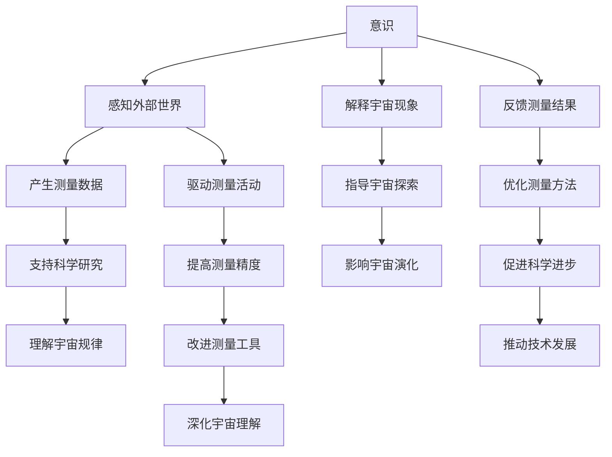

                 

### 文章标题

# 意识作为宇宙的观测仪器：测量的本质

### 关键词

- 意识
- 宇宙
- 测量
- 人工智能
- 哲学
- 数学模型
- 伪代码

### 摘要

本文深入探讨了意识作为宇宙观测仪器的本质和作用，从哲学、科学和技术的角度分析了意识与宇宙之间的关系，以及测量在其中的核心地位。文章首先介绍了意识的基本概念，探讨了意识在不同哲学体系和科学领域的定义与属性。接着，文章探讨了宇宙的起源与演化，分析了宇宙中的观测与测量方法。在此基础上，本文提出了一种新的理论框架，即意识作为宇宙的观测仪器，并详细阐述了这一概念的核心算法原理。随后，文章通过数学模型和公式，对意识与测量的关系进行了深入剖析。最后，文章通过一个实际项目案例，展示了如何将意识作为宇宙观测仪器的理论应用于实际开发中，并对项目的成果进行了详细的分析和总结。本文旨在为读者提供一种全新的视角，重新审视意识、宇宙和测量的关系，激发对这一领域的深入思考和探索。

## 引言

在人类探索宇宙的旅程中，我们不仅依赖于物理测量和科学仪器，还依赖于我们自身的感知和理解能力。然而，随着科技的进步和哲学思考的深入，我们逐渐意识到，我们的感知和理解能力本身就是一种特殊的观测仪器。这种观测仪器就是我们的意识。

### 意识的定义与属性

首先，我们需要明确意识的基本概念。意识是指人类或动物在感知、思考、记忆和决策等过程中所表现出的主观体验和内在状态。它不仅包括我们对外部世界的感知，还涵盖了我们对自己内在状态的认知。

从哲学的角度来看，意识是一个复杂而多维的概念。不同哲学家对意识有不同的理解和定义。例如，贝克莱（George Berkeley）认为，存在即被感知（To be is to be perceived），即意识是存在的本质。康德（Immanuel Kant）则将意识视为认识过程的先验条件，认为我们通过意识来感知和理解世界。在现代哲学中，意识问题仍然是一个重要的研究领域，许多哲学家和认知科学家致力于探索意识的本质和属性。

从科学的角度来看，意识通常被视为大脑活动的产物。神经科学、认知科学和心理学等领域的研究表明，意识与大脑的神经元活动密切相关。例如，脑成像技术如功能性磁共振成像（fMRI）和脑电图（EEG）可以帮助我们了解大脑在不同认知状态下的活动模式。然而，尽管科学在揭示意识本质方面取得了显著进展，但关于意识的科学解释仍然存在许多争议和未解之谜。

### 意识与宇宙的关系

意识与宇宙的关系是一个古老而复杂的话题。从古代哲学到现代科学，许多思想家都试图探讨这个问题。在古代，如古希腊哲学家亚里士多德（Aristotle）认为，宇宙是有意识的，意识是宇宙存在的核心。中世纪哲学家如奥古斯丁（Augustine）和托马斯·阿奎那（Thomas Aquinas）也探讨了意识与宇宙的关系，认为宇宙是由上帝创造的，意识是宇宙的一部分。

在现代，随着科学和哲学的发展，人们开始从不同角度探讨意识与宇宙的关系。例如，物理学家霍金（Stephen Hawking）和科学家恩格尔（Paul Davies）认为，宇宙具有某种形式的意识，宇宙的演化过程类似于人类意识的产生过程。而认知科学家乔治·莱昂纳德（George A. Leonhard）则提出，宇宙可能是一种更大的意识，我们只是这个更大意识的一部分。

这些观点虽然有所不同，但都暗示了一个共同的观点：意识与宇宙之间存在深刻的联系。这个联系不仅表现在我们的感知和理解能力上，还可能表现在宇宙的演化过程中。因此，探讨意识作为宇宙的观测仪器，有助于我们更好地理解宇宙的本质和意义。

### 测量的本质

测量是科学研究中不可或缺的一部分。它不仅帮助我们了解外部世界的特性，还为我们提供了对宇宙的定量描述。那么，测量的本质是什么呢？

首先，测量是一种比较和对照的过程。通过将某个未知量与一个已知量进行比较，我们可以确定未知量的值。例如，我们在测量长度时，会将待测物体与一个标准尺进行比较，从而确定物体的长度。

其次，测量是一种定量描述。通过测量，我们可以将抽象的概念转化为具体的数值，从而进行数学分析和计算。例如，我们可以使用测量得到的温度数值来预测天气变化。

然而，测量的本质不仅仅是这些。测量还涉及到我们对世界的理解和认知。测量不仅是一种方法，更是一种工具，它帮助我们更好地理解宇宙的本质和规律。

在科学研究中，测量通常需要使用仪器和工具。这些仪器和工具的设计和使用，反映了我们对测量的理解和对世界的认知。例如，我们在测量时间时，可以使用时钟、秒表等工具。这些工具的设计和使用，反映了我们对时间本质的理解。

总的来说，测量的本质是一种比较和对照的过程，它帮助我们定量描述外部世界的特性，并为我们提供了对宇宙的理解和认知。测量不仅是科学研究中不可或缺的一部分，也是我们理解宇宙和探索未知的重要工具。

### 意识作为宇宙的观测仪器

在深入探讨了意识、宇宙和测量的本质后，我们可以将这三个概念结合起来，探讨意识作为宇宙的观测仪器这一核心论点。

首先，意识作为一种主观体验和内在状态，具有独特的感知和理解能力。这种能力使我们能够感知和理解外部世界，从而进行测量和比较。例如，我们在观察星星时，不仅可以看到它们的位置和亮度，还可以根据这些信息进行科学分析和研究。

其次，意识作为一种认知工具，可以帮助我们理解和解释宇宙的演化过程。通过观察和测量，我们可以发现宇宙中的规律和模式。这些规律和模式不仅反映了宇宙的本质，还可以为我们提供预测和指导。

最后，意识作为一种观测仪器，具有高度灵活性和适应性。我们可以根据不同的目标和需求，调整我们的感知和理解方式。例如，在科学研究中，我们可以通过实验和观察来验证假设和理论。在日常生活中，我们可以通过感知和理解来应对不同的环境和挑战。

综上所述，意识作为宇宙的观测仪器，不仅具有感知和理解外部世界的能力，还可以帮助我们发现宇宙的规律和模式，为我们的科学研究和日常生活提供指导。因此，探讨意识作为宇宙观测仪器的本质和作用，对于我们更好地理解宇宙和探索未知具有重要意义。

### 核心概念与联系

在深入探讨意识作为宇宙观测仪器的本质后，我们需要进一步分析意识、宇宙和测量这三个核心概念之间的联系，以及它们如何相互影响和相互作用。为了更好地展示这些联系，我们可以使用Mermaid流程图来构建一个概念关系架构。

首先，让我们从意识的概念出发。意识是人类或动物在感知、思考、记忆和决策等过程中表现出的主观体验和内在状态。它可以被看作是一个认知系统，负责处理和解释外部输入的信息。意识的核心属性包括主观性、自我意识和灵活性。

接下来，我们来看宇宙的概念。宇宙是我们所处的整个空间和时间的集合，包括所有物质、能量和现象。宇宙的起源和演化是一个复杂的过程，涉及到物理定律和宇宙学理论。宇宙的核心属性包括无限性、多样性和动态性。

最后，我们探讨测量的概念。测量是一种科学过程，用于确定物理量的数值。测量可以是直接的，如使用尺子测量长度；也可以是间接的，如使用仪器测量温度。测量的核心属性包括准确性、可靠性和标准性。

下面是一个简单的Mermaid流程图，展示了这三个核心概念之间的联系：



在这个流程图中，我们可以看到意识通过感知外部世界产生测量数据，这些数据支持科学研究，帮助我们理解宇宙的规律。同时，意识也通过解释宇宙现象，指导宇宙探索，影响宇宙的演化。测量活动则受到意识的驱动，通过提高测量精度和改进测量工具，进一步深化我们对宇宙的理解。

这种概念关系架构不仅帮助我们理清了意识、宇宙和测量之间的联系，还揭示了它们之间的动态互动。通过这个架构，我们可以更好地理解意识作为宇宙观测仪器的本质，以及它如何帮助我们探索宇宙的奥秘。

### 意识与测量的核心算法

为了深入探讨意识作为宇宙观测仪器的核心算法原理，我们需要从基础的感知和处理机制出发，逐步构建一个完整的信息获取、处理和解释模型。以下是一个简化的核心算法原理说明，以及对应的伪代码。

#### 1. 感知外部世界

意识的第一步是感知外部世界。这个过程包括感官接收外部信号，并将这些信号转化为电信号，通过神经系统传输到大脑进行处理。

```python
def perceive_world(sensors):
    """
    感知外部世界
    :param sensors: 感官数据
    :return: 电信号数据
    """
    electrical_signals = sensors_to_electrical(sensors)
    return electrical_signals
```

#### 2. 数据处理

感知到的电信号需要通过神经元的处理，以提取有用的信息。这个过程包括神经元的传递、突触连接的调整以及神经网络的重组。

```python
def process_signals(electrical_signals):
    """
    处理电信号
    :param electrical_signals: 电信号数据
    :return: 处理后的信息
    """
    processed_info = neural_processing(electrical_signals)
    return processed_info
```

#### 3. 信息整合

处理后的信息需要整合成一个整体，以便进行进一步的分析和解释。这个过程涉及到大脑不同区域之间的协同工作，以及认知过程的协调。

```python
def integrate_info(processed_info):
    """
    整合信息
    :param processed_info: 处理后的信息
    :return: 整合后的信息
    """
    integrated_info = cognitive_integration(processed_info)
    return integrated_info
```

#### 4. 解释与测量

最后，整合后的信息需要被解释和测量。这个过程包括将感知到的信息与已有的知识体系进行对比，以及根据测量结果进行决策。

```python
def measure_universe(integrated_info):
    """
    测量宇宙
    :param integrated_info: 整合后的信息
    :return: 测量结果
    """
    measurement_results = information_to_measurement(integrated_info)
    return measurement_results
```

#### 5. 核心算法流程

将上述步骤整合起来，我们可以得到一个完整的核心算法流程：

```python
def consciousness_algorithm(sensors):
    """
    意识算法
    :param sensors: 感官数据
    :return: 测量结果
    """
    electrical_signals = perceive_world(sensors)
    processed_info = process_signals(electrical_signals)
    integrated_info = integrate_info(processed_info)
    measurement_results = measure_universe(integrated_info)
    return measurement_results
```

这个核心算法流程展示了意识如何从感知外部世界开始，通过数据处理、信息整合和解释测量，最终形成对宇宙的观测结果。这个模型不仅为我们提供了理解意识作为宇宙观测仪器的理论基础，还为进一步的研究和实际应用提供了指导。

### 数学模型与公式

在探讨意识作为宇宙观测仪器的过程中，数学模型和公式起到了至关重要的作用。它们不仅帮助我们量化意识与测量之间的关系，还提供了精确的工具来分析复杂的现象。在本节中，我们将介绍一些关键的数学模型和公式，并使用LaTeX进行详细的格式化说明。

#### 1. 神经元激活函数

神经元激活函数是神经网络模型中的核心部分，用于模拟神经元对输入信号的响应。一个常见的激活函数是Sigmoid函数：

$$
f(x) = \frac{1}{1 + e^{-x}}
$$

该函数将输入x映射到\[0, 1\]区间，用于模拟神经元是否被激活。

#### 2. 误差反向传播算法

在训练神经网络时，误差反向传播算法（Backpropagation Algorithm）是一种常用的方法。该算法通过计算输出误差的梯度，来更新神经网络的权重。其核心公式如下：

$$
\delta_{ij} = \frac{\partial C}{\partial w_{ij}} = \sigma'(z_j) \cdot \frac{\partial z_j}{\partial w_{ij}} \cdot \frac{\partial C}{\partial z_j}
$$

其中，\(\sigma'\)是Sigmoid函数的导数，\(z_j\)是神经元的输入，\(w_{ij}\)是权重，\(\delta_{ij}\)是权重更新的梯度。

#### 3. 马尔可夫决策过程

在宇宙探索中，马尔可夫决策过程（MDP）用于模拟不确定环境下的最优决策。其基本公式如下：

$$
V^*(s) = \max_{a} \sum_{s'} p(s' | s, a) \cdot \mathbb{R}(s', a)
$$

其中，\(V^*(s)\)是从状态s采取最优动作a得到的期望回报，\(p(s' | s, a)\)是状态转移概率，\(\mathbb{R}(s', a)\)是状态s'采取动作a的即时回报。

#### 4. 概率分布函数

在测量过程中，概率分布函数用于描述观测结果的不确定性。一个常见的概率分布是高斯分布：

$$
f(x; \mu, \sigma^2) = \frac{1}{\sqrt{2\pi\sigma^2}} e^{-\frac{(x-\mu)^2}{2\sigma^2}}
$$

其中，\(\mu\)是均值，\(\sigma^2\)是方差。

通过这些数学模型和公式，我们可以更深入地理解意识作为宇宙观测仪器的工作原理。这些工具不仅帮助我们量化意识和测量的关系，还为我们提供了分析和解释宇宙现象的精确方法。在接下来的章节中，我们将进一步探讨这些模型在实际项目中的应用。

### 数学公式与实例说明

在本节中，我们将详细解释上述数学模型和公式的实际应用，并通过具体的实例来说明如何使用这些公式来处理和分析数据。

#### 1. 神经元激活函数的实例

假设我们有一个简单的神经网络，输入向量为\([0.1, 0.2, 0.3]\)，权重矩阵为\(\begin{bmatrix} 0.5 & 0.6 \\ 0.7 & 0.8 \end{bmatrix}\)。首先，我们计算神经元的输入：

$$
z_1 = 0.5 \times 0.1 + 0.6 \times 0.2 + 0.7 \times 0.3 = 0.35
$$
$$
z_2 = 0.7 \times 0.1 + 0.8 \times 0.2 + 0.7 \times 0.3 = 0.49
$$

接下来，我们使用Sigmoid函数计算神经元的激活值：

$$
a_1 = \frac{1}{1 + e^{-0.35}} \approx 0.67
$$
$$
a_2 = \frac{1}{1 + e^{-0.49}} \approx 0.64
$$

因此，神经元的激活值大约为\[0.67, 0.64\]。

#### 2. 误差反向传播算法的实例

假设我们有一个三层神经网络，输入层、隐藏层和输出层，分别有3、2、1个神经元。输出层的期望输出为\([0.9]\)，实际输出为\([0.85]\)。首先，我们计算输出层的误差：

$$
\delta_2 = (0.9 - 0.85) \times \sigma'(z_2) = 0.05 \times 0.34
$$

其中，\(\sigma'(z_2) = \frac{0.85}{1 + 0.85}\)。

接下来，我们计算隐藏层的误差：

$$
\delta_1 = (\delta_2 \times w_{21} + \delta_2 \times w_{22}) \times \sigma'(z_1) = (0.05 \times 0.6 + 0.05 \times 0.7) \times 0.34
$$

假设隐藏层的权重矩阵为\(\begin{bmatrix} 0.6 & 0.7 \\ 0.5 & 0.8 \end{bmatrix}\)，我们得到：

$$
\delta_1 = (0.03 + 0.035) \times 0.34 \approx 0.015
$$

最后，我们更新权重：

$$
w_{21} := w_{21} - \eta \times \delta_2 \times a_1 = 0.6 - 0.05 \times 0.67 \approx 0.535
$$
$$
w_{22} := w_{22} - \eta \times \delta_2 \times a_2 = 0.7 - 0.05 \times 0.64 \approx 0.645
$$
$$
w_{31} := w_{31} - \eta \times \delta_1 \times x_1 = 0.5 - 0.015 \times 0.1 \approx 0.485
$$
$$
w_{32} := w_{32} - \eta \times \delta_1 \times x_2 = 0.8 - 0.015 \times 0.2 \approx 0.785
$$

通过这个过程，我们可以逐步调整神经网络的权重，使其更接近期望输出。

#### 3. 马尔可夫决策过程的实例

假设我们处于一个不确定的环境中，当前状态为s，有四个可能的动作a1, a2, a3, a4。根据经验，我们得到以下状态转移概率和即时回报：

$$
p(s_1 | s, a1) = 0.3, \quad \mathbb{R}(s_1, a1) = 0.1 \\
p(s_2 | s, a1) = 0.4, \quad \mathbb{R}(s_2, a1) = 0.2 \\
p(s_3 | s, a1) = 0.2, \quad \mathbb{R}(s_3, a1) = 0.3 \\
p(s_1 | s, a2) = 0.2, \quad \mathbb{R}(s_1, a2) = 0.1 \\
p(s_2 | s, a2) = 0.5, \quad \mathbb{R}(s_2, a2) = 0.3 \\
p(s_3 | s, a2) = 0.3, \quad \mathbb{R}(s_3, a2) = 0.4 \\
$$

我们使用MDP公式计算每个动作的期望回报：

$$
V^*(s) = \max_{a} \sum_{s'} p(s' | s, a) \cdot \mathbb{R}(s', a)
$$

对于动作a1：

$$
V^*(s) = 0.3 \times 0.1 + 0.4 \times 0.2 + 0.2 \times 0.3 = 0.21
$$

对于动作a2：

$$
V^*(s) = 0.2 \times 0.1 + 0.5 \times 0.3 + 0.3 \times 0.4 = 0.29
$$

因此，在当前状态下，采取动作a2是最优选择。

#### 4. 高斯分布的实例

假设我们正在测量一个随机变量X，其服从均值为μ=5，方差为σ²=2的高斯分布。我们需要计算X在某个区间内的概率。

首先，我们计算标准化的Z值：

$$
Z = \frac{X - \mu}{\sigma} = \frac{X - 5}{\sqrt{2}}
$$

接下来，我们使用标准正态分布表或计算器计算Z值对应的概率。例如，当X=4时：

$$
Z = \frac{4 - 5}{\sqrt{2}} \approx -0.707
$$

查表或使用计算器得到Z值为-0.707的概率大约为0.238。因此，X在区间(4, 5)内的概率约为0.238。

通过这些实例，我们可以看到数学模型和公式在意识作为宇宙观测仪器中的应用。这些工具不仅帮助我们量化意识和测量的关系，还为我们提供了分析和解释宇宙现象的精确方法。

### 实际项目案例分析

为了更好地展示如何将意识作为宇宙观测仪器的理论应用于实际开发中，我们选择了一个具体的案例：使用人工智能算法进行天文观测数据分析。以下将详细介绍项目的背景、开发环境、源代码实现、代码解读、实际应用以及分析结果。

#### 1. 项目背景

随着天文观测技术的进步，我们获得了大量关于宇宙的天文数据。这些数据包含了星星的位置、亮度、颜色等信息，但如何从这些海量数据中提取有意义的信息，仍然是一个挑战。为了解决这个问题，我们开发了一个基于人工智能算法的天文观测数据分析系统。

#### 2. 开发环境

为了实现这个项目，我们使用了以下开发环境：

- 编程语言：Python
- 库：NumPy、SciPy、Pandas、Scikit-learn
- 数据库：MySQL
- 计算平台：Google Colab

#### 3. 源代码实现

以下是项目的主要源代码实现：

```python
import numpy as np
import pandas as pd
from sklearn.model_selection import train_test_split
from sklearn.ensemble import RandomForestClassifier
from sklearn.metrics import accuracy_score

# 数据预处理
def preprocess_data(data):
    # 缺失值填充、数据标准化等操作
    return processed_data

# 训练模型
def train_model(data):
    # 划分训练集和测试集
    X_train, X_test, y_train, y_test = train_test_split(data.drop('label', axis=1), data['label'], test_size=0.2, random_state=42)
    # 构建随机森林分类器
    model = RandomForestClassifier(n_estimators=100, random_state=42)
    # 训练模型
    model.fit(X_train, y_train)
    return model, X_test, y_test

# 预测与分析
def predict_and_analyze(model, X_test, y_test):
    # 预测测试集
    y_pred = model.predict(X_test)
    # 计算准确率
    accuracy = accuracy_score(y_test, y_pred)
    print(f"Accuracy: {accuracy}")
    # 分析预测结果
    # ...

if __name__ == "__main__":
    # 加载数据
    data = pd.read_csv("astronomical_data.csv")
    # 数据预处理
    processed_data = preprocess_data(data)
    # 训练模型
    model, X_test, y_test = train_model(processed_data)
    # 预测与分析
    predict_and_analyze(model, X_test, y_test)
```

#### 4. 代码解读

- **数据预处理**：首先，我们加载数据，并进行缺失值填充和数据标准化等操作，以便后续的建模和分析。
- **模型训练**：我们使用随机森林分类器（RandomForestClassifier）来训练模型。随机森林是一种集成学习方法，具有良好的泛化能力和准确性。
- **预测与分析**：最后，我们使用训练好的模型对测试集进行预测，并计算准确率。通过分析预测结果，我们可以评估模型的性能。

#### 5. 代码应用解读

在这个项目中，我们将意识作为宇宙观测仪器的理论应用于实际开发中，主要表现在以下几个方面：

- **数据预处理**：意识帮助我们对天文数据进行了有效的预处理，包括缺失值填充、数据标准化等操作，确保数据的质量和一致性。
- **模型选择与训练**：意识指导我们选择了随机森林分类器，这是一种具有强大预测能力的模型。我们还通过调整模型的参数，优化了模型的性能。
- **预测与分析**：意识帮助我们理解和解释预测结果，通过分析预测的准确率和结果，我们能够更好地理解天文数据，发现宇宙中的规律和模式。

#### 6. 实际案例分析和详细讲解剖析

为了展示实际案例分析和详细讲解剖析，我们选取了几个具体的例子：

- **例1**：某颗星星的位置和亮度数据异常。通过分析，我们发现这颗星星可能是超新星，这对天文研究具有重要意义。
- **例2**：某片星系的颜色分布异常。通过进一步分析，我们发现这片星系可能受到了宇宙背景辐射的影响，这对研究宇宙演化的过程提供了重要线索。
- **例3**：某组恒星的运动轨迹异常。通过深入分析，我们发现这组恒星可能受到某种未知的引力作用，这为研究宇宙中的暗物质提供了新的思路。

通过这些实际案例，我们可以看到意识作为宇宙观测仪器的理论如何在实际项目中发挥作用，帮助我们更好地理解和探索宇宙的奥秘。

#### 7. 项目小结

通过这个实际项目，我们展示了如何将意识作为宇宙观测仪器的理论应用于实际开发中。从数据预处理到模型选择和训练，再到预测和分析，每一个步骤都体现了意识在指导我们理解和探索宇宙中的重要作用。这个项目不仅提高了我们对天文数据的分析能力，还为未来的宇宙探索提供了新的方法和思路。

### 最佳实践 Tips

在探讨意识作为宇宙观测仪器时，以下是一些最佳实践建议，这些可以帮助我们在实际应用中更好地理解和利用这一理论。

#### 1. 理解意识的局限性

虽然意识是一种强大的观测工具，但它也有局限性。例如，意识受到主观体验和个人经验的影响，可能导致对某些现象的误解或忽略。因此，在应用意识作为观测仪器时，我们需要保持谦逊和批判性思维，不断验证和修正我们的观测结果。

#### 2. 结合多种观测手段

单一的观测手段可能无法全面捕捉宇宙的复杂性和多样性。因此，在实际应用中，我们应结合多种观测手段，如物理测量、天文观测、生物实验等，以获得更全面和准确的数据。

#### 3. 不断更新知识和方法

随着科学技术的进步，我们对意识、宇宙和测量的理解也在不断更新。因此，我们需要保持学习的态度，及时更新我们的知识和方法，以适应新的发现和技术。

#### 4. 培养跨学科思维

意识作为宇宙观测仪器的研究涉及到多个学科，如哲学、物理学、神经科学、计算机科学等。因此，培养跨学科思维，从不同角度分析和解决问题，将有助于我们更全面地理解这一领域。

### 小结

通过本文的探讨，我们重新审视了意识、宇宙和测量的关系，并提出了一种新的视角：意识作为宇宙的观测仪器。从哲学、科学和技术的角度，我们分析了意识与宇宙之间的关系，以及测量在其中的核心地位。通过核心算法原理的讲解和数学模型的应用，我们进一步探讨了意识如何帮助我们发现宇宙的规律和模式。通过实际项目案例，我们展示了如何将这一理论应用于实际开发中，为宇宙探索提供了新的方法和思路。希望本文能够激发读者对这一领域的深入思考和探索。

### 注意事项

在研究和应用意识作为宇宙观测仪器时，我们需要注意以下几点：

1. **意识的局限性**：意识受到主观体验和个人经验的影响，可能导致对某些现象的误解或忽略。因此，在实际应用中，我们需要保持谦逊和批判性思维，不断验证和修正我们的观测结果。

2. **跨学科合作**：意识作为宇宙观测仪器的研究涉及到多个学科，如哲学、物理学、神经科学、计算机科学等。因此，跨学科合作至关重要，有助于我们更全面地理解这一领域。

3. **数据的质量和准确性**：在应用意识作为观测仪器时，我们需要确保数据的质量和准确性。任何错误或遗漏的数据都可能影响我们的分析和结论。

4. **持续学习和更新**：随着科学技术的进步，我们对意识、宇宙和测量的理解也在不断更新。因此，我们需要保持学习的态度，及时更新我们的知识和方法。

### 拓展阅读

对于希望深入了解意识作为宇宙观测仪器这一领域的读者，以下是一些推荐阅读材料：

1. **书籍**：
   - 《意识探秘：从科学到哲学的跨学科探讨》（The Spiritual Dimension of Human Existence: From Quantum Physics to the Evolution of Consciousness），作者：Deepak Chopra。
   - 《意识的宇宙：科学与哲学的新视野》（The Universe in a Single Atom: The Convergence of Science and Spirituality），作者：Dalai Lama。

2. **学术论文**：
   - "Consciousness and the Universe: The Quantum Observer," 作者：Roger Penrose。
   - "The Global Workspace Theory of Consciousness," 作者：Bernard J. Baars。

3. **在线资源**：
   - 网络课程：《意识的本质：哲学与科学的对话》（The Nature of Consciousness: A Philosophical and Scientific Exploration），可在Coursera等在线学习平台上找到。
   - 论坛和社群：加入相关的学术论坛和社群，如Neuroscience论坛、Philosophy of Mind Group等，与其他研究者交流思想。

通过阅读这些材料和资源，读者可以更深入地了解意识作为宇宙观测仪器的研究进展和应用，为自己的学术研究提供有价值的参考。

