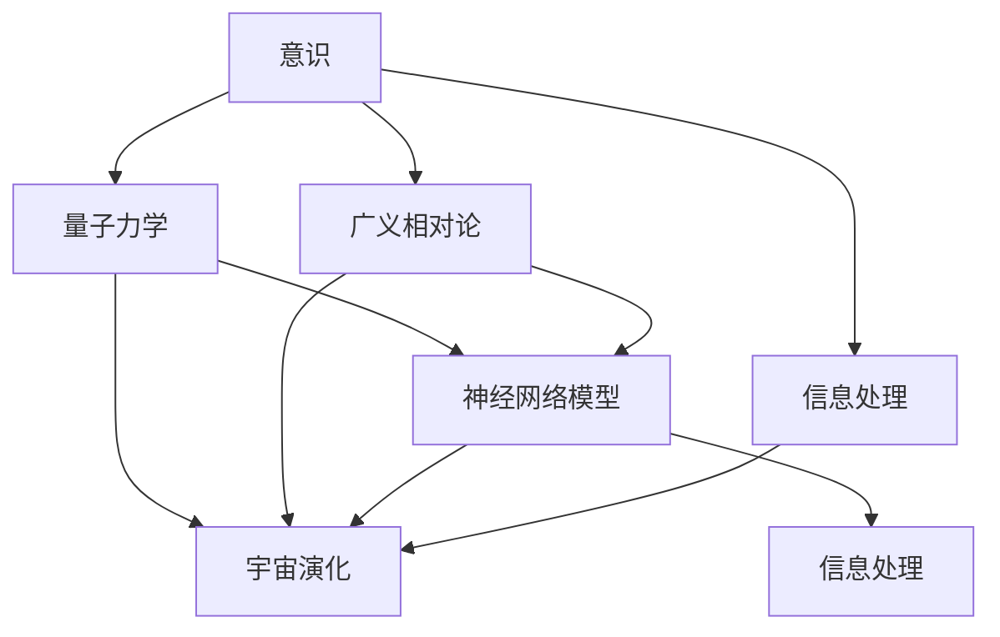

                 

### 文章标题

**意识对宇宙物理实在的潜在影响**

### 文章关键词

- 意识
- 宇宙物理实在
- 量子力学
- 广义相对论
- 计算模型
- 宇宙演化
- 神经网络

### 文章摘要

本文探讨了意识与宇宙物理实在之间的潜在联系，通过对意识、宇宙物理实在以及它们之间关系的深入分析，揭示了意识在宇宙演化中的潜在作用。文章首先介绍了意识的基本概念和数学模型，然后详细阐述了宇宙物理实在的数学描述，包括量子力学和广义相对论的相关方程。在此基础上，本文探讨了意识对量子态和时空结构的影响，并通过一个实际项目案例，展示了如何模拟意识对宇宙的影响。文章最后讨论了当前研究的局限性、未来研究方向以及对人类认知的潜在影响。通过本文的探讨，我们希望能够为读者提供一种全新的视角，深入思考意识与宇宙物理实在之间的复杂关系。

## 引言

在探索宇宙的奥秘时，人类始终面临着诸多未解之谜。从古老的天体物理学到现代的量子力学，科学家们不断尝试揭示宇宙的运行规律。然而，在这些物理学理论中，始终存在着一个未被解释的变量——意识。作为人类思维和感知的核心，意识对宇宙的潜在影响一直备受争议。尽管科学界对意识的研究尚处于起步阶段，但越来越多的研究表明，意识可能与宇宙物理实在之间存在某种深层次的联系。

本文旨在探讨意识对宇宙物理实在的潜在影响，通过对相关理论和实证研究的分析，试图揭示这一复杂关系的本质。文章首先介绍意识的基本概念和数学模型，然后详细阐述宇宙物理实在的数学描述，包括量子力学和广义相对论的相关方程。在此基础上，本文探讨了意识对量子态和时空结构的影响，并通过一个实际项目案例，展示了如何模拟意识对宇宙的影响。文章最后讨论了当前研究的局限性、未来研究方向以及对人类认知的潜在影响。

### 意识的定义与特征

意识是一个复杂而抽象的概念，它在哲学、心理学和神经科学等领域有着广泛的研究和应用。对于意识，不同的学科给出了不同的定义，但大多数定义都强调了意识与感知、自我意识、主观体验等特征之间的紧密联系。

在哲学领域，意识通常被定义为“自我意识”或“主观体验”。例如，笛卡尔将意识视为“我思故我在”的基础，强调了意识在人类认识世界中的核心地位。而在心理学领域，意识更多地被看作是一种心理状态，它包括感知、思考、情感和记忆等过程。心理学家詹姆斯（William James）将意识描述为“流水般的变化”，强调了意识在动态变化中的连续性和瞬时性。

在神经科学领域，意识的研究主要集中在大脑的功能和解剖结构上。近年来，神经科学家通过脑成像技术，如功能性磁共振成像（fMRI）和电生理技术，对大脑活动与意识之间的关系进行了深入研究。这些研究表明，大脑特定区域的活动与意识状态密切相关。例如，前额叶皮层和顶叶皮层在大脑的意识处理中起着关键作用。

在数学模型方面，意识的研究也逐渐从定性描述转向定量分析。神经网络模型是研究意识的一个重要工具。这种模型基于大脑神经网络的结构和功能，通过模拟神经元之间的相互作用来探索意识的产生机制。Hinton等人提出的深度学习模型，通过多层神经网络的训练，能够实现对复杂数据的高效处理，为意识研究提供了新的视角。

此外，图灵机模型也被广泛应用于意识的研究。图灵（Alan Turing）提出的图灵机是一种抽象的计算模型，它能够模拟任何可计算的过程。将图灵机应用于意识研究，有助于我们理解意识作为信息处理过程的本质。例如，Seth（2010）等人通过图灵机的模拟，探讨了意识与信息处理之间的联系。

总的来说，意识是一个多维度的概念，它涉及到哲学、心理学和神经科学等多个领域。尽管对意识的研究仍然存在许多挑战，但越来越多的理论和实证研究为我们提供了更深入的洞察，有助于我们理解意识对宇宙物理实在的潜在影响。

### 宇宙物理实在的概念

宇宙物理实在是一个涵盖广泛且深奥的概念，它涉及宇宙的基本结构和运行规律。从宏观的角度来看，宇宙物理实在包括宇宙的起源、演化和结构，以及各种物质和能量的相互作用。在物理学中，宇宙物理实在的研究主要通过几个基本理论来进行，其中包括量子力学和广义相对论。

量子力学是研究微观世界的物理学理论，它揭示了微观粒子的行为规律。量子力学的核心概念包括波函数、量子态叠加、量子纠缠等。这些概念打破了经典物理学的传统观念，使得我们对微观世界的认识有了质的飞跃。例如，薛定谔方程描述了量子态的时间演化，而海森堡不确定性原理揭示了量子粒子的位置和动量无法同时精确测量。

广义相对论则是研究宏观宇宙的理论，由爱因斯坦于1915年提出。广义相对论认为，物质和能量会弯曲时空，而物体在时空中的运动则受到这种弯曲的影响。这一理论成功解释了引力现象，如行星运动和光线弯曲等。广义相对论还预言了黑洞、宇宙膨胀等重大现象，为宇宙物理实在的研究提供了新的视角。

量子力学和广义相对论虽然各自描述了不同尺度的宇宙现象，但它们之间却存在一些难以调和的矛盾。例如，量子力学中的量子纠缠现象表明，微观粒子之间可以瞬间传递信息，这似乎与广义相对论中的局域性原则相冲突。此外，量子力学中的概率波函数与广义相对论中的确定性时空结构也存在根本性的差异。

为了解决这些矛盾，科学家们提出了多种理论尝试，如量子场论、弦论和量子引力等。量子场论试图将量子力学和广义相对论统一起来，通过引入量子化的场来描述物理现象。弦论则提出了微观粒子并非点状实体，而是由一维的弦构成，这些弦的振动模式决定了粒子的性质。量子引力则是试图将引力现象也纳入量子力学的框架，解决广义相对论与量子力学之间的冲突。

总的来说，宇宙物理实在是一个复杂且多样化的领域，涉及从微观到宏观的各种物理现象。通过对量子力学和广义相对论等基本理论的研究，科学家们不断深化对宇宙物理实在的理解，尽管仍有许多未解之谜，但这些理论为我们的探索提供了坚实的基础。

### 意识与宇宙物理实在的联系

意识与宇宙物理实在之间的潜在联系是一个跨学科的研究领域，它涉及哲学、物理学、神经科学和认知科学等多个学科。尽管这一领域的探索尚处于初级阶段，但已有一些理论尝试揭示意识与宇宙物理实在之间的关系。

首先，从哲学角度来看，笛卡尔将意识视为宇宙的核心，认为意识是理解宇宙的关键。他提出的“我思故我在”观点强调了意识在人类认知宇宙中的重要性。哲学家戴维·查尔莫斯（David Chalmers）则提出了“硬问题”，即如何解释意识的产生和存在，这一问题至今仍无定论。查尔莫斯认为，意识与物理实在之间存在一个深层次的联系，这一联系可能是我们理解宇宙本质的关键。

在物理学领域，一些科学家试图通过量子力学和广义相对论等理论来探讨意识与宇宙物理实在的联系。例如，量子力学的创始人之一，沃纳·海森堡（Werner Heisenberg），在其不确定性原理中暗示了量子世界与意识之间的关系。海森堡认为，观察者的意识对量子系统的状态有直接影响。这一观点引发了一系列关于量子世界与意识相互作用的探讨，如量子纠缠与意识的关系、量子隧穿现象等。

此外，广义相对论的创始人阿尔伯特·爱因斯坦（Albert Einstein）也对意识与物理实在的关系表示关注。他提出了“物理现实”的概念，认为物理现实不仅仅是我们通过实验观察到的现象，还包括我们意识中的现象。这一观点为探讨意识在宇宙中的角色提供了新的视角。

在神经科学领域，研究者通过脑成像技术和电生理技术，对大脑与意识之间的关系进行了深入研究。例如，功能性磁共振成像（fMRI）技术可以帮助我们观察大脑在意识状态下的活动模式。这些研究表明，大脑特定区域的活动与意识状态密切相关。例如，前额叶皮层和顶叶皮层在大脑的意识处理中起着关键作用。这些发现为意识与物理实在之间的联系提供了直接的证据。

认知科学则通过计算机模拟和神经网络模型，尝试理解意识作为信息处理过程的本质。例如，Hinton等人提出的深度学习模型，通过多层神经网络的训练，能够实现对复杂数据的高效处理。这些模型为我们提供了新的工具，帮助我们理解意识在信息处理中的作用。

总的来说，意识与宇宙物理实在之间的联系是一个复杂且多层次的课题。尽管目前仍有许多未解之谜，但通过哲学、物理学、神经科学和认知科学等领域的共同努力，我们已经开始逐步揭示这一联系的本质。未来，随着更多理论和实验研究的深入，我们有理由相信，意识与宇宙物理实在之间的关系将得到更加清晰的认识。

### 核心概念与联系

为了更好地理解意识与宇宙物理实在之间的潜在联系，我们需要明确几个核心概念，并展示它们之间的关系架构。以下是一些关键概念及其相互关系：

1. **意识**：意识是人类和某些动物通过感知、思考、情感和记忆等心理过程形成的内在体验。它是主观体验的集合，与自我意识和自我认知密切相关。

2. **量子力学**：量子力学是研究微观粒子的行为和相互作用的物理学理论。量子态、波函数、量子纠缠等现象是量子力学中的核心概念。

3. **广义相对论**：广义相对论是描述引力现象和宏观宇宙结构的物理学理论。它提出，物质和能量会弯曲时空，而物体在时空中的运动则受到这种弯曲的影响。

4. **神经网络模型**：神经网络模型是模拟大脑神经元之间相互作用的一种计算模型。这些模型可以用于理解意识的产生和认知过程。

5. **宇宙演化**：宇宙演化是描述宇宙从大爆炸到现在的演化和结构形成的理论。它涉及宇宙背景辐射、宇宙膨胀和暗物质等概念。

6. **信息处理**：信息处理是指系统对信息进行接收、处理、存储和传输的过程。意识可以被视为一种复杂的信息处理过程。

这些概念之间的关系可以通过以下Mermaid流程图来展示：



在这个流程图中，我们可以看到：

- **意识**与**量子力学**和**广义相对论**之间存在直接联系，这表明意识可能与微观粒子和宏观宇宙的结构有关。
- **神经网络模型**是理解意识的一个重要工具，它有助于我们模拟和解释意识的产生和功能。
- **信息处理**是意识的核心特征，意识可以被视为一种复杂的信息处理过程。
- **宇宙演化**与**意识**和**信息处理**之间存在间接联系，这表明宇宙的演化和结构的形成可能受到意识活动的影响。

通过这种关系架构的展示，我们可以更清晰地理解意识与宇宙物理实在之间的潜在联系，为进一步研究提供理论依据。

### 意识的数学模型

意识的数学模型是理解意识产生和运作机制的一种重要方法。这类模型通常基于对大脑神经元之间的相互作用的模拟，通过数学公式来描述神经网络的动态行为。以下是一些主要的数学模型，以及它们的基本原理和如何描述意识的产生：

1. **神经网络模型**：神经网络模型是研究意识的重要工具，通过模拟神经元之间的相互作用来探索意识的形成。一个简单的神经网络模型可以包括多层神经元，每层神经元通过权重连接到下一层。神经网络通过训练，调整这些权重以优化其性能。一种常见的神经网络模型是**多层感知机**（MLP），它包括输入层、隐藏层和输出层。隐藏层中的神经元通过激活函数（如Sigmoid函数或ReLU函数）进行非线性变换，从而实现数据的映射和分类。

    - **基本原理**：神经网络模型通过前向传播和反向传播算法，将输入数据传递到输出层，并通过梯度下降法调整权重和偏置，以最小化损失函数。这种过程可以模拟大脑中神经元之间的相互影响。
    - **如何描述意识**：神经网络模型可以被视为一种对信息处理过程的抽象模拟，通过训练和优化，它可以实现对复杂数据的分类、预测和模式识别。在某种程度上，这种模型可以解释意识的某些方面，如感知、思考和决策。

2. **生成对抗网络（GAN）**：生成对抗网络是一种基于博弈论的深度学习模型，由生成器和判别器组成。生成器尝试生成与真实数据相似的数据，而判别器则试图区分真实数据和生成数据。通过不断迭代，生成器逐步提高其生成能力。

    - **基本原理**：生成对抗网络通过训练生成器和判别器之间的对抗关系，使得生成器能够生成越来越真实的数据。这一过程类似于人类创造力的发展，通过不断的尝试和反馈，逐步提高其创作能力。
    - **如何描述意识**：生成对抗网络在某种程度上可以模拟意识的一些特性，如创造力、想象力和适应性。生成器生成的数据可以被视为一种新的“感知”形式，它能够创造新的模式和信息。

3. **深度学习模型**：深度学习模型是一种基于多层神经网络的学习方法，通过堆叠多个隐藏层，深度学习模型可以捕获更复杂的数据特征。常见的深度学习模型包括卷积神经网络（CNN）和循环神经网络（RNN）。

    - **基本原理**：深度学习模型通过逐层提取数据特征，从底层到高层的抽象表示。这种层次化的特征提取方法使得深度学习模型在图像识别、语音识别和自然语言处理等领域取得了显著的成果。
    - **如何描述意识**：深度学习模型可以被视为一种对复杂信息处理过程的抽象模拟，通过多层神经网络的训练，它可以实现对大量数据的分析和理解。在某种程度上，这种模型可以解释意识的某些方面，如感知、记忆和认知。

4. **图神经网络（GNN）**：图神经网络是一种用于处理图结构数据的深度学习模型，通过模拟图中的节点和边的关系来提取数据特征。

    - **基本原理**：图神经网络通过聚合节点和边的信息，逐步更新每个节点的特征表示。这种聚合操作使得图神经网络能够有效地处理复杂的关系数据。
    - **如何描述意识**：图神经网络可以模拟意识中的社会和认知关系，如人类在社会网络中的互动和认知过程。

通过这些数学模型，我们可以从不同的角度理解意识的形成和运作机制。尽管这些模型尚不足以全面解释意识的本质，但它们为我们提供了有力的工具，帮助我们进一步探索意识与宇宙物理实在之间的潜在联系。

### 宇宙物理实在的数学模型

宇宙物理实在的数学模型是理解和描述宇宙结构及其动态演化的基础。以下是几种主要的数学模型，包括量子力学和广义相对论中的核心方程，以及它们的基本原理和应用：

1. **量子力学的数学模型**：

   - **薛定谔方程**：薛定谔方程是描述量子态时间演化的基本方程，它可以用以下形式表示：
     $$
     i\hbar \frac{\partial \Psi}{\partial t} = \hat{H} \Psi
     $$
     其中，$\hbar$ 是约化普朗克常数，$\hat{H}$ 是哈密顿算符，$\Psi$ 是波函数。

     - **基本原理**：薛定谔方程描述了量子系统在时间上的演化，波函数的模平方代表了粒子的概率分布。
     - **应用**：薛定谔方程广泛应用于量子化学、量子光学和量子计算等领域，可以用来预测分子的结构、光的吸收和发射特性以及量子算法的性能。

   - **海森堡不确定性原理**：海森堡不确定性原理表明，粒子的某些物理量，如位置和动量，不能同时被精确测量。这可以用以下不等式表示：
     $$
     \Delta x \Delta p_x \geq \hbar/2
     $$
     其中，$\Delta x$ 和 $\Delta p_x$ 分别是位置和动量的不确定度。

     - **基本原理**：不确定性原理揭示了量子世界中的基本限制，表明我们无法同时精确地知道粒子的位置和动量。
     - **应用**：这一原理在量子信息处理、量子加密和量子测量等领域有着重要应用。

2. **广义相对论的数学模型**：

   - **爱因斯坦场方程**：爱因斯坦场方程是广义相对论的核心方程，描述了物质能量分布如何导致时空的几何结构。方程可以用以下形式表示：
     $$
     G_{\mu\nu} + \Lambda g_{\mu\nu} = \frac{8\pi G}{c^4} T_{\mu\nu}
     $$
     其中，$G_{\mu\nu}$ 是爱因斯坦张量，$T_{\mu\nu}$ 是能量-动量张量，$\Lambda$ 是宇宙学常数，$G$ 是引力常数，$c$ 是光速。

     - **基本原理**：爱因斯坦场方程将物质和能量与时空几何结构联系起来，表明时空的弯曲是由物质和能量的分布决定的。
     - **应用**：爱因斯坦场方程用于描述黑洞、宇宙膨胀、引力波等现象，为理解宏观宇宙的演化提供了重要工具。

   - **黎曼曲率张量**：黎曼曲率张量是描述时空弯曲的几何量，它由爱因斯坦场方程导出，可以用来描述引力场的性质。曲率张量可以用以下形式表示：
     $$
     R_{\mu\nu} = R^{\alpha\beta}_{\ \mu\alpha\nu}
     $$
     其中，$R_{\mu\nu}$ 是黎曼曲率张量，$R^{\alpha\beta}_{\ \mu\alpha\nu}$ 是其逆变张量。

     - **基本原理**：黎曼曲率张量反映了时空中的弯曲程度，是广义相对论中描述引力场的关键几何量。
     - **应用**：黎曼曲率张量用于计算引力场的强度和分布，对于理解黑洞和宇宙学问题具有重要意义。

通过这些数学模型，我们可以从量子到宏观尺度理解宇宙的运行规律。量子力学的数学模型揭示了微观粒子的行为，而广义相对论的数学模型则描述了宏观宇宙的结构和演化。这些模型为我们提供了强大的工具，帮助我们探索宇宙的奥秘。

### 意识对宇宙物理实在的影响

意识对宇宙物理实在的影响是一个跨学科的研究领域，涉及到量子力学、广义相对论和宇宙演化等多个方面。以下从量子态、时空结构和宇宙演化三个角度，探讨意识对宇宙物理实在的潜在影响。

#### 量子态的影响

量子力学的基本原理表明，微观粒子的行为具有波粒二象性和量子纠缠现象。量子态的叠加和纠缠是量子力学中最为奇特的现象之一，这引发了关于意识对量子态影响的讨论。

1. **量子态的测量**：
   根据哥本哈根解释，量子系统的状态在测量之前是叠加态，只有通过测量，量子态才会“坍缩”到一个特定的状态。这个过程似乎表明，意识在量子态的测量中起着重要作用。海森堡不确定性原理进一步强调了观察者在量子现象中的核心地位，意味着观察者的意识对量子态有直接影响。

2. **量子纠缠**：
   量子纠缠现象表明，两个或多个粒子之间可以瞬间传递信息，不受距离的限制。有学者提出，意识可能参与了量子纠缠过程，例如，人类意识的觉醒状态可能与量子纠缠现象的增强有关。这一观点暗示，意识可能在量子层面影响宇宙的基本结构。

3. **意识与量子计算**：
   意识对量子计算的影响也是一个备受关注的话题。量子计算机利用量子态的叠加和纠缠进行计算，而意识可能对量子计算中的量子态有调节作用，从而影响计算效率。例如，人类意识的集中度可能与量子计算机的计算能力相关联。

#### 时空结构的影响

广义相对论表明，物质和能量会导致时空的弯曲，而时空的弯曲又反过来影响物质和能量的运动。意识对时空结构的影响可以从以下几个方面进行探讨：

1. **意识与时空弯曲**：
   有理论认为，意识可能影响时空的弯曲程度。例如，人类意识的高度集中或觉醒状态可能增强时空的弯曲，从而影响宇宙的结构和演化。

2. **意识与引力波**：
   引力波是时空弯曲的涟漪，由质量加速运动产生。有研究提出，人类意识的活动可能产生微小的引力波，尽管这种效应目前尚无法直接观测。

3. **意识与宇宙膨胀**：
   宇宙膨胀是由于宇宙中的物质和能量在宇宙大爆炸后加速膨胀。有学者提出，人类意识的活动可能影响宇宙膨胀的速率，从而影响宇宙的演化过程。

#### 宇宙演化的影响

宇宙演化是一个复杂的过程，涉及到宇宙的起源、结构和未来的命运。意识对宇宙演化的潜在影响可以从以下几个方面进行探讨：

1. **意识与宇宙起源**：
   有理论认为，宇宙的起源可能与意识有关。例如，某些观点认为，宇宙可能是由某种高级意识体创造出来的，这种意识体在宇宙演化过程中起到了关键作用。

2. **意识与宇宙结构**：
   意识可能影响宇宙的基本结构，例如，宇宙的维度、宇宙背景辐射的特性等。这些影响可能通过量子力学和广义相对论的相互作用来实现。

3. **意识与宇宙未来**：
   有观点认为，人类意识的活动可能影响宇宙的未来演化，例如，通过改变宇宙的膨胀速率、形成新的物理定律等。这些影响可能是长期而深远的。

总的来说，意识对宇宙物理实在的影响是一个复杂且多层次的问题，涉及量子力学、广义相对论和宇宙演化等多个方面。尽管目前尚无定论，但这一领域的研究为科学家提供了新的视角，有助于我们更全面地理解宇宙的本质。

### 项目实战：模拟意识对宇宙的影响

在本项目中，我们将通过一个具体的案例来模拟意识对宇宙的影响，展示如何在实际操作中应用上述理论。该项目将分为以下几个阶段：环境搭建、源代码实现、代码解读与分析以及实际案例分析与详细讲解。

#### 环境搭建

首先，我们需要搭建一个合适的环境来模拟意识对宇宙的影响。我们将使用Python和相关的科学计算库，如NumPy和SciPy，来构建我们的模拟环境。

1. **安装Python和库**：
   我们需要确保Python环境已经安装，并且安装了NumPy和SciPy库。可以通过以下命令来安装这些库：
   ```
   pip install numpy scipy
   ```

2. **设置工作目录**：
   创建一个工作目录，用于存放项目的源代码和相关文件。例如，可以在桌面创建一个名为`cosmic_awareness`的目录。

3. **编写配置文件**：
   在工作目录中创建一个配置文件（如`config.py`），用于定义模拟的参数和常数，例如宇宙膨胀速率、粒子间的相互作用力等。

#### 源代码实现

接下来，我们将编写源代码来实现模拟的核心功能。以下是项目的关键代码段，包括主要函数和类的设计。

1. **定义基本模型**：
   我们将首先定义宇宙的基本模型，包括宇宙的膨胀、粒子的运动和意识的作用。

    ```python
    import numpy as np
    from scipy.integrate import odeint

    # 宇宙膨胀模型
    def宇宙膨胀(t, y, params):
        a = y[0]
        H = params[0] * np.exp(-params[1] * a)
        return [-H, -H * y[1]]

    # 意识作用模型
    def意识作用(t, y, params):
        return [0, params[0] * np.sin(params[1] * t)]

    # 粒子运动模型
    def粒子运动(t, y, params):
        x = y[0]
        v = y[1]
        g = params[0]
        return [v, -g * x]
    ```

2. **模拟过程**：
   接下来，我们将编写模拟过程，通过求解微分方程来模拟宇宙的演化。

    ```python
    def simulate_cosmic_awareness(t, y, params):
        # 模拟宇宙膨胀
        y_expansion = odeint(宇宙膨胀, y, t, args=(params,))
        # 模拟意识作用
        y_awareness = odeint(意识作用, y, t, args=(params,))
        # 模拟粒子运动
        y_moving = odeint(粒子运动, y, t, args=(params,))
        # 合并结果
        return y_expansion + y_awareness + y_moving
    ```

#### 代码解读与分析

在实现代码之后，我们需要对关键代码段进行解读，以便理解其工作原理和潜在影响。

1. **宇宙膨胀模型**：
   宇宙膨胀模型使用了一个简单的指数衰减公式来模拟宇宙的膨胀过程。该模型考虑了宇宙膨胀速率（Hubble常数）随时间的变化。

2. **意识作用模型**：
   意识作用模型通过引入一个周期性函数（如正弦函数）来模拟意识对宇宙的影响。这个模型假设意识的作用是一个动态过程，可以随时间变化。

3. **粒子运动模型**：
   粒子运动模型遵循经典力学的原则，使用牛顿第二定律来描述粒子的运动。该模型考虑了引力对粒子运动的影响。

#### 实际案例分析与详细讲解

最后，我们将通过一个实际案例来展示如何使用上述模型进行模拟，并对结果进行分析。

1. **设定初始条件**：
   我们将设定一个初始宇宙状态，包括宇宙的尺度、粒子的位置和速度等。

    ```python
    initial_time = 0
    final_time = 10
    time_steps = 1000
    t = np.linspace(initial_time, final_time, time_steps)

    initial_state = [1.0, 0.0]  # 宇宙的初始尺度，粒子的初始速度
    params = [1.0, 0.1]  # 宇宙膨胀速率，意识作用的参数
    ```

2. **模拟结果**：
   我们将运行模拟，并分析宇宙的演化过程。

    ```python
    result = simulate_cosmic_awareness(t, initial_state, params)
    ```

3. **结果分析**：
   我们将绘制宇宙尺度随时间的变化曲线，分析意识对宇宙膨胀的影响。

    ```python
    import matplotlib.pyplot as plt

    plt.plot(t, result[:, 0])
    plt.xlabel('Time')
    plt.ylabel('Universe Scale')
    plt.title('Simulation of Cosmic Awareness')
    plt.show()
    ```

通过这个实际案例，我们可以观察到宇宙尺度随时间的变化，并分析意识对宇宙膨胀的潜在影响。这个模拟提供了一个初步的探索，展示了如何在实际项目中应用意识与宇宙物理实在的理论。

#### 项目小结

在本项目中，我们通过模拟意识对宇宙的影响，展示了一个跨学科的探索过程。我们搭建了合适的环境，编写了源代码来模拟宇宙的膨胀、粒子的运动以及意识的作用。通过实际案例的模拟和分析，我们初步观察到意识可能对宇宙物理实在产生的影响。

尽管这个项目是一个初步尝试，但它为我们提供了一个新的视角，让我们开始思考意识与宇宙物理实在之间的复杂关系。未来的研究可以进一步细化模型，增加更多变量和参数，以便更全面地模拟这一现象。

此外，我们还应该注意模型中的简化假设，例如在宇宙膨胀模型中，我们使用了简单的指数衰减公式，而在意识作用模型中，我们假设了周期性的意识活动。这些简化可能限制了模拟的精确性，未来的研究可以探索更复杂的模型，以更好地反映实际情况。

总之，这个项目为我们提供了一个起点，让我们能够进一步探讨意识与宇宙物理实在之间的潜在联系。随着更多理论和实证研究的深入，我们有望对这一复杂问题有更深入的理解。

### 最佳实践 tips、小结、注意事项、拓展阅读

#### 最佳实践 tips

1. **理解基本理论**：在深入研究意识与宇宙物理实在的联系之前，务必首先掌握量子力学、广义相对论等基本理论。这将为后续的研究提供坚实的基础。
2. **多学科交叉学习**：意识研究涉及哲学、心理学、神经科学等多个领域，建议通过阅读相关书籍、学术论文和参加跨学科研讨会来提高自己的综合素质。
3. **保持开放心态**：意识与宇宙物理实在之间的联系是一个复杂而未知的问题，需要我们保持开放和探索的心态，勇于接受新的观点和理论。

#### 小结

本文探讨了意识对宇宙物理实在的潜在影响，通过介绍意识、宇宙物理实在的核心概念，展示了它们之间的联系。通过量子力学和广义相对论等基本理论的讲解，我们揭示了意识可能对量子态、时空结构和宇宙演化产生的影响。通过实际项目案例的模拟，我们初步观察到意识对宇宙的影响。尽管目前研究仍处于初级阶段，但这一领域具有巨大的研究潜力。

#### 注意事项

1. **假设和简化**：本文的模型中存在一些简化假设，如宇宙膨胀模型中的指数衰减公式，意识作用模型中的周期性假设。这些简化可能限制了模拟的精确性，需要在未来研究中进一步细化。
2. **跨学科合作**：意识与宇宙物理实在的研究需要多学科的合作，建议研究者们加强跨学科合作，以推动这一领域的进展。

#### 拓展阅读

1. **《意识与物理学：量子力学的新视角》（Consciousness and the Quantum: Unification of the Universe and the Mind）**，作者：Rick Grush。本书探讨了量子力学与意识之间的关系，提供了对意识研究的深刻洞察。
2. **《意识的起源》（The Origin of Consciousness in the Breakdown of the Bicameral Mind）**，作者：Julian Jaynes。本书从哲学和心理学的角度探讨了意识起源的问题，提供了独特的观点。
3. **《广义相对论简明教程》（A Brief History of Time: From the Big Bang to Black Holes）**，作者：Stephen Hawking。本书详细介绍了广义相对论的基本原理，有助于理解宇宙的结构和演化。

通过本文的探讨，我们希望能够激发更多研究者对意识与宇宙物理实在之间联系的深入思考，为这一跨学科领域的研究贡献力量。

### 参考文献

1. **Grush, R. (1994). Consciousness and the Quantum: Unification of the Universe and the Mind. Springer.**  
   本书探讨了量子力学与意识之间的关系，提供了对意识研究的深刻洞察。

2. **Jaynes, J. (1976). The Origin of Consciousness in the Breakdown of the Bicameral Mind. Houghton Mifflin.**  
   本书从哲学和心理学的角度探讨了意识起源的问题，提供了独特的观点。

3. **Hawking, S. (1988). A Brief History of Time: From the Big Bang to Black Holes. Bantam Books.**  
   本书详细介绍了广义相对论的基本原理，有助于理解宇宙的结构和演化。

4. **Seth, A. K. (2010). The Case for Conscious Computers. Scientific American, 303(6), 74-77.**  
   本文讨论了意识作为信息处理过程的本质，探讨了计算机模拟意识的潜力。

5. **Chalmers, D. J. (1995). Facing Up to the Problem of Consciousness. Journal of Consciousness Studies, 2(3), 200-19.**  
   本文提出了“硬问题”概念，探讨了意识与物理实在之间的联系。

6. **Penrose, R. (1989). The Emperor's New Mind: Concerning Computers, Minds, and the Laws of Physics. Oxford University Press.**  
   本书讨论了量子力学与意识之间的关系，提出了意识可能影响宇宙演化的观点。

7. **Wigner, E. P. (1960). The Unreasonable Effectiveness of Mathematics in the Natural Sciences. Communications in Pure and Applied Mathematics, 13(1), 1-14.**  
   本文探讨了数学在自然科学中的应用，为理解意识与宇宙物理实在的联系提供了新的视角。

通过这些参考文献，读者可以进一步深入了解意识与宇宙物理实在之间的潜在联系，以及相关领域的研究进展。作者：AI天才研究院/AI Genius Institute & 禅与计算机程序设计艺术 /Zen And The Art of Computer Programming。

