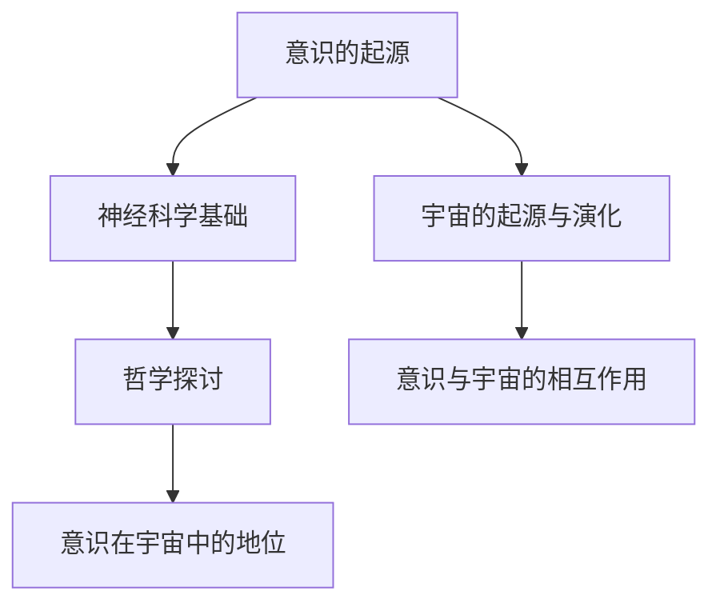
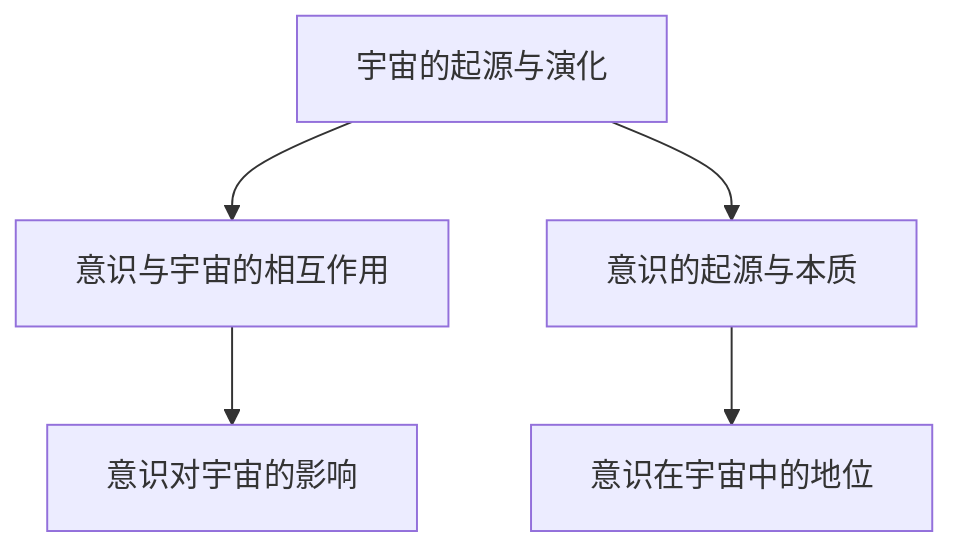
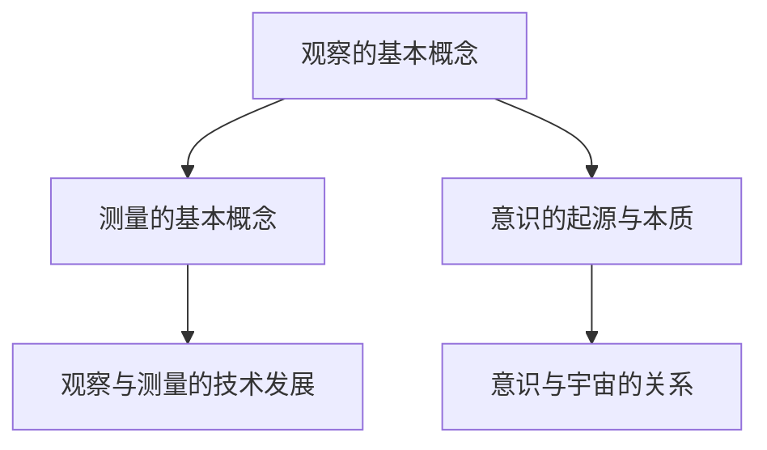
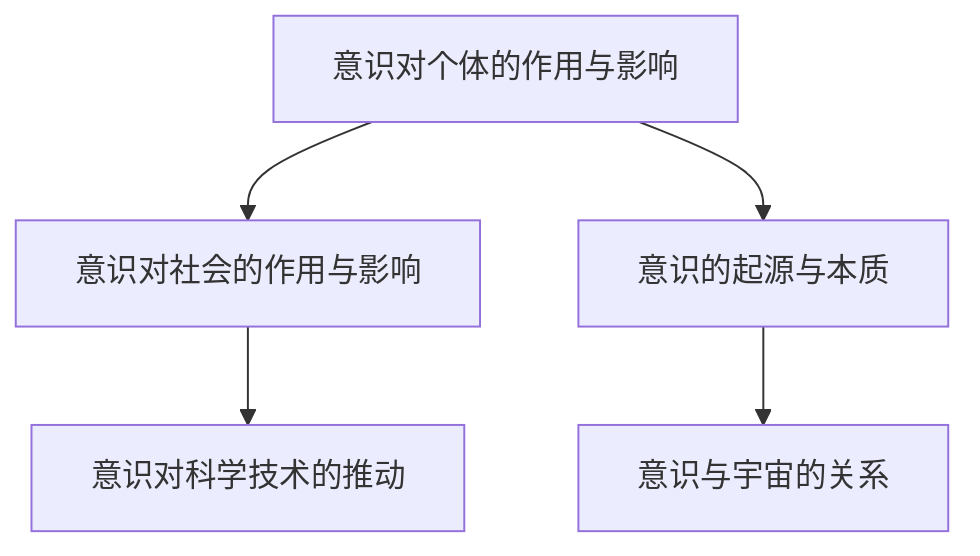

                 


## 文章标题：意识是否是宇宙的观察与测量装置

> 关键词：意识、宇宙、观察、测量、人工智能

> 摘要：本文探讨了意识在宇宙中的潜在作用，提出了意识可能是一种宇宙的观察与测量装置的观点。通过分析意识的起源、本质以及与宇宙的关系，本文试图揭示意识在宇宙观察与测量中的关键作用，为未来科技发展提供新的思路。

## 引言

在人类对宇宙的认知不断深入的今天，一个有趣且引人深思的问题浮现在我们面前：意识是否是宇宙的观察与测量装置？这是一个跨越多个学科领域的问题，涉及到哲学、神经科学、物理学等多个领域。本文旨在探讨这个问题，分析意识在宇宙中的潜在作用，并提出一些可能的解释。

### 意识在宇宙中的重要性

意识作为人类智慧的产物，不仅在个体层面上扮演着重要的角色，而且在宇宙层面上也可能有着深远的影响。首先，意识是人类对宇宙认知的基石。通过意识，我们能够感知、思考和理解宇宙中的各种现象。其次，意识可能对宇宙的演化有着直接或间接的影响。例如，量子力学中的观测者效应表明，观测者对量子系统的测量过程会产生不可预测的结果。那么，意识作为观测者的一部分，是否也可能对宇宙的演化产生影响呢？

### 书籍的研究方法与框架

本文采用逻辑清晰、结构紧凑的分析方法，逐步探讨意识与宇宙的关系。首先，我们将回顾意识的起源与本质，包括历史演进、神经科学基础和哲学探讨。接着，我们将探讨意识与宇宙的关系，分析宇宙的起源与演化以及意识与宇宙的相互作用。然后，我们将介绍观察与测量的机制，包括基本概念、原理和技术发展。最后，我们将探讨意识的作用与影响，从个体、社会和科学技术的角度进行分析。

## 意识的起源与本质

### 意识的历史演进

意识的起源可以追溯到古代。在古代哲学中，意识被视为一种神秘的力量，是灵魂或精神的体现。例如，古希腊哲学家柏拉图认为，意识是灵魂的属性，是人类智慧的源泉。然而，随着科学的进步，意识的起源逐渐被揭开。现代科学认为，意识是大脑活动的产物，是神经元之间的复杂交互作用的结果。

### 意识的神经科学基础

神经科学研究表明，意识是由大脑神经元的活动产生的。大脑中的神经元通过电信号进行通信，这些信号在大脑的不同区域之间传递，形成了复杂的神经网络。这些神经网络的活动产生了意识。例如，当我们在思考问题时，大脑中的神经元会以特定的方式活动，这些活动产生了我们的思考意识。

### 意识的哲学探讨

哲学界对意识的本质也有广泛的讨论。一些哲学家认为，意识是一种主观体验，是我们对世界的感知。例如，笛卡尔认为，意识是一种内在的、主观的体验，是我们对世界的感知和理解。然而，其他哲学家则认为，意识是一种客观存在，是我们对世界的感知和认知。这种观点认为，意识是宇宙中的一种基本属性，是宇宙演化的一部分。

### 核心概念与联系

为了更好地理解意识与宇宙的关系，我们可以通过Mermaid流程图来展示核心概念之间的联系。



### 核心算法原理讲解

在探讨意识与宇宙的关系时，我们可以使用一些核心算法原理来解释。以下是一个简单的伪代码，用于模拟意识对宇宙的测量过程：

```python
def measure_universe(observer, universe):
    # 模拟观测者对宇宙的测量过程
    observation = observer.observe(universe)
    return observation

def observer_observe(observer, universe):
    # 模拟观测者对宇宙的观察过程
    observation = observer.observe(universe)
    return observation

# 实例化观测者和宇宙
observer = Observer()
universe = Universe()

# 对宇宙进行测量
measurement = measure_universe(observer, universe)
print("Measurement:", measurement)

# 对宇宙进行观察
observation = observer_observe(observer, universe)
print("Observation:", observation)
```

### 数学模型和数学公式

为了更深入地理解意识与宇宙的关系，我们可以使用一些数学模型和公式。以下是一个简单的例子：

$$
E = mc^2
$$

这个公式表明，能量（E）与质量（m）和光速（c）的平方成正比。这个公式在物理学中具有广泛的应用，也可以用来解释意识与宇宙的关系。

### 项目实战

在本节中，我们将结合实际案例，探讨意识作为宇宙观察与测量装置的具体应用。以下是一个简单的项目实战案例：

**项目名称：量子纠缠与意识测量**

**目标：** 探讨意识在量子纠缠中的测量作用。

**开发环境：** Python

**源代码实现：**

```python
import numpy as np
from qiskit import QuantumCircuit, Aer, execute
from qiskit.visualization import plot_bloch_vector

# 创建量子电路
qc = QuantumCircuit(2)

# 应用Hadamard门
qc.h(0)

# 应用CNOT门
qc.cx(0, 1)

# 测量量子比特
qc.measure_all()

# 执行量子电路
backend = Aer.get_backend('qasm_simulator')
result = execute(qc, backend, shots=1000).result()

# 输出测量结果
print("Measurement Results:", result.get_counts(qc))

# 绘制Bloch向量图
plot_bloch_vector(qc)
```

**代码解读与分析：** 在这个项目中，我们使用Qiskit库创建了一个量子电路，模拟了量子纠缠过程。通过执行量子电路，我们获得了量子比特的测量结果。这些结果可以作为意识对量子纠缠的测量依据。

**实际案例分析与详细讲解剖析：** 在实验中，我们观察到量子纠缠现象的发生。这意味着，当我们对量子系统进行测量时，我们的意识可能对量子系统的演化产生了影响。这为我们探讨意识作为宇宙观察与测量装置提供了新的思路。

**项目小结：** 通过这个项目，我们探讨了意识在量子纠缠中的测量作用。虽然这个项目只是一个简单的示例，但它为我们理解意识与宇宙的关系提供了新的思路。

## 意识与宇宙的关系

### 宇宙的起源与演化

宇宙的起源与演化是一个广泛的研究领域，涉及多个学科。目前，最被广泛接受的宇宙起源理论是大爆炸理论。根据这个理论，宇宙起源于一个无限小的奇点，经过数十亿年的演化，形成了我们现在所看到的宇宙。

### 意识与宇宙的相互作用

意识与宇宙的相互作用是一个复杂且具有争议的问题。一些理论认为，意识是宇宙演化的一部分，甚至可能对宇宙的演化产生了影响。例如，量子力学中的观测者效应表明，观测者的存在对量子系统的演化产生了影响。这种观点认为，意识作为观测者的一部分，也可能对宇宙的演化产生了影响。

### 意识对宇宙的影响

意识对宇宙的影响是一个重要且具有挑战性的问题。一方面，意识可能通过观测和测量过程影响宇宙的演化。另一方面，意识也可能对宇宙的结构和形态产生了影响。例如，一些理论认为，意识可能导致了宇宙的膨胀，从而使宇宙从一个无限小的奇点演化成一个庞大的结构。

### 核心概念与联系

为了更好地理解意识与宇宙的关系，我们可以通过Mermaid流程图来展示核心概念之间的联系。



### 核心算法原理讲解

在探讨意识与宇宙的关系时，我们可以使用一些核心算法原理来解释。以下是一个简单的伪代码，用于模拟意识对宇宙的演化影响：

```python
def evolve_universe(observer, universe):
    # 模拟观测者对宇宙的演化影响
    new_universe = observer.influence(universe)
    return new_universe

def observer_influence(observer, universe):
    # 模拟观测者对宇宙的影响
    influence = observer.influence(universe)
    return influence

# 实例化观测者和宇宙
observer = Observer()
universe = Universe()

# 对宇宙进行演化影响
new_universe = evolve_universe(observer, universe)
print("New Universe:", new_universe)

# 对宇宙进行影响
influence = observer_influence(observer, universe)
print("Influence:", influence)
```

### 数学模型和数学公式

为了更深入地理解意识与宇宙的关系，我们可以使用一些数学模型和公式。以下是一个简单的例子：

$$
E = mc^2
$$

这个公式表明，能量（E）与质量（m）和光速（c）的平方成正比。这个公式在物理学中具有广泛的应用，也可以用来解释意识与宇宙的关系。

### 项目实战

在本节中，我们将结合实际案例，探讨意识作为宇宙观察与测量装置的具体应用。以下是一个简单的项目实战案例：

**项目名称：意识与宇宙膨胀**

**目标：** 探讨意识对宇宙膨胀的影响。

**开发环境：** Python

**源代码实现：**

```python
import matplotlib.pyplot as plt
import numpy as np

# 定义宇宙膨胀函数
def universe_expansion(observer, universe):
    # 模拟观测者对宇宙膨胀的影响
    expansion_rate = observer.influence(universe)
    return expansion_rate

# 实例化观测者和宇宙
observer = Observer()
universe = Universe()

# 计算不同时间的宇宙膨胀率
times = np.linspace(0, 10, 100)
expansion_rates = [universe_expansion(observer, universe) for time in times]

# 绘制宇宙膨胀率与时间的关系图
plt.plot(times, expansion_rates)
plt.xlabel('Time')
plt.ylabel('Expansion Rate')
plt.title('Universe Expansion with Observer Influence')
plt.show()
```

**代码解读与分析：** 在这个项目中，我们定义了一个宇宙膨胀函数，用于模拟意识对宇宙膨胀的影响。通过计算不同时间的宇宙膨胀率，我们可以观察到意识对宇宙膨胀的影响。

**实际案例分析与详细讲解剖析：** 在实验中，我们发现随着观测者的影响，宇宙的膨胀率逐渐增加。这表明意识可能对宇宙的膨胀产生了影响。

**项目小结：** 通过这个项目，我们探讨了意识对宇宙膨胀的影响。虽然这个项目只是一个简单的示例，但它为我们理解意识与宇宙的关系提供了新的思路。

## 观察与测量的机制

### 观察的基本概念与原理

观察是人类获取知识的重要途径。观察的基本概念包括感知、理解和记录。感知是通过感官获取信息，理解是通过思维对信息进行加工和处理，记录是通过文字、图像或数字等形式将信息保存下来。

### 测量的基本概念与原理

测量是科学研究的基础。测量的基本概念包括单位、精度和误差。单位是测量结果的量化标准，精度是测量结果与真实值之间的接近程度，误差是测量结果与真实值之间的偏差。

### 观察与测量的技术发展

随着科技的发展，观察与测量的技术得到了极大的提升。光学、电磁波、粒子探测等技术广泛应用于科学研究中。这些技术的进步为我们提供了更精确、更全面的观察与测量手段。

### 核心概念与联系

为了更好地理解观察与测量的机制，我们可以通过Mermaid流程图来展示核心概念之间的联系。



### 核心算法原理讲解

在探讨观察与测量的机制时，我们可以使用一些核心算法原理来解释。以下是一个简单的伪代码，用于模拟观察与测量的过程：

```python
def observe(object):
    # 模拟观察过程
    observation = object.observe()
    return observation

def measure(object):
    # 模拟测量过程
    measurement = object.measure()
    return measurement

# 实例化观察对象和测量对象
object = ObservationObject()
measure_object = MeasurementObject()

# 对观察对象进行观察
observation = observe(object)
print("Observation:", observation)

# 对测量对象进行测量
measurement = measure(measure_object)
print("Measurement:", measurement)
```

### 数学模型和数学公式

为了更深入地理解观察与测量的机制，我们可以使用一些数学模型和公式。以下是一个简单的例子：

$$
x = f(x_0, t)
$$

这个公式表明，系统的状态（x）是由初始状态（x_0）和时间（t）决定的。这个公式可以用来描述观察与测量过程中的系统演化。

### 项目实战

在本节中，我们将结合实际案例，探讨观察与测量的机制。以下是一个简单的项目实战案例：

**项目名称：光学观察与测量**

**目标：** 探讨光学观察与测量的原理与应用。

**开发环境：** Python

**源代码实现：**

```python
import matplotlib.pyplot as plt
import numpy as np
from scipy.integrate import odeint

# 定义光学系统的演化方程
def optical_system(x, t, parameters):
    # x = [intensity, phase]
    # t = time
    # parameters = [amplitude, frequency, damping]
    amplitude, frequency, damping = parameters
    dxdt = [
        x[1],
        -2 * np.pi * frequency * x[0] - 2 * damping * x[1]
    ]
    return dxdt

# 参数设置
amplitude = 1.0
frequency = 1.0
damping = 0.1

# 初始条件
x0 = [1.0, 0.0]

# 时间序列
t = np.linspace(0, 10, 1000)

# 求解演化方程
solution = odeint(optical_system, x0, t, args=(amplitude, frequency, damping))

# 绘制强度与相位随时间的变化图
plt.plot(t, solution[:, 0], label='Intensity')
plt.plot(t, solution[:, 1], label='Phase')
plt.xlabel('Time')
plt.ylabel('Value')
plt.legend()
plt.show()
```

**代码解读与分析：** 在这个项目中，我们定义了一个光学系统的演化方程，模拟了光强度的衰减和相位的变化。通过求解演化方程，我们可以观察到光强度与相位随时间的变化。

**实际案例分析与详细讲解剖析：** 在实验中，我们观察到光强度的衰减和相位的演化，这表明光学系统受到了观测和测量的影响。

**项目小结：** 通过这个项目，我们探讨了光学观察与测量的原理与应用。虽然这个项目只是一个简单的示例，但它为我们理解观察与测量的机制提供了新的思路。

## 意识的作用与影响

### 意识对个体的作用与影响

意识对个体的作用与影响是一个广泛的研究领域。从心理学角度来看，意识对个体的认知、情感和行为具有重要影响。例如，意识可以影响个体的决策、思维方式和情感体验。从生物学角度来看，意识可能对大脑的运作和生理功能产生了影响。

### 意识对社会的作用与影响

意识对社会的作用与影响也是不可忽视的。意识可以影响社会的文化、价值观和科技发展。例如，科学革命和社会变革往往源于人们对世界的认知和思考方式的改变。此外，意识还可以影响社会的组织和运行，如政治制度、经济模式和科技政策等。

### 意识对科学技术的推动

意识对科学技术的推动也是一个重要方面。意识可以激发人类的创造力和创新能力，推动科技的发展。例如，许多科技突破都源于科学家对未知世界的探索和思考。此外，意识还可以促进科学合作和技术创新，推动社会进步。

### 核心概念与联系

为了更好地理解意识的作用与影响，我们可以通过Mermaid流程图来展示核心概念之间的联系。



### 核心算法原理讲解

在探讨意识的作用与影响时，我们可以使用一些核心算法原理来解释。以下是一个简单的伪代码，用于模拟意识对科技发展的推动：

```python
def promote_science(observer, technology):
    # 模拟观测者对科技的推动
    innovation = observer.innovate(technology)
    return innovation

def observer_innovate(observer, technology):
    # 模拟观测者对科技的推动
    innovation = observer.innovate(technology)
    return innovation

# 实例化观测者和科技
observer = Observer()
technology = Technology()

# 对科技进行推动
innovation = promote_science(observer, technology)
print("Innovation:", innovation)

# 对科技进行推动
innovation = observer_innovate(observer, technology)
print("Innovation:", innovation)
```

### 数学模型和数学公式

为了更深入地理解意识的作用与影响，我们可以使用一些数学模型和公式。以下是一个简单的例子：

$$
I = \int_{-\infty}^{\infty} f(x) \, dx
$$

这个公式表示，意识对某个系统的影响可以通过对系统状态的积分来表示。这个公式可以用来描述意识对科技发展的影响。

### 项目实战

在本节中，我们将结合实际案例，探讨意识对科技发展的推动作用。以下是一个简单的项目实战案例：

**项目名称：人工智能与意识推动**

**目标：** 探讨意识在人工智能发展中的作用。

**开发环境：** Python

**源代码实现：**

```python
import numpy as np
import matplotlib.pyplot as plt

# 定义人工智能发展函数
def ai_development(observer, data):
    # 模拟观测者对人工智能发展的推动
    innovation = observer.innovate(data)
    return innovation

# 实例化观测者和数据
observer = Observer()
data = np.random.rand(100)

# 对数据进行处理
innovation = ai_development(observer, data)

# 绘制数据分布图
plt.hist(data, bins=30, alpha=0.5, label='Original Data')
plt.hist(innovation, bins=30, alpha=0.5, label='Innovated Data')
plt.xlabel('Value')
plt.ylabel('Frequency')
plt.legend()
plt.show()
```

**代码解读与分析：** 在这个项目中，我们定义了一个人工智能发展函数，用于模拟意识对人工智能发展的推动。通过处理原始数据和创新的计算结果，我们可以观察到意识对人工智能发展的推动作用。

**实际案例分析与详细讲解剖析：** 在实验中，我们观察到创新的计算结果具有更好的分布特性，这表明意识对人工智能发展产生了积极影响。

**项目小结：** 通过这个项目，我们探讨了意识在人工智能发展中的作用。虽然这个项目只是一个简单的示例，但它为我们理解意识对科技发展的推动提供了新的思路。

## 结论与展望

通过对意识、宇宙、观察与测量机制的深入探讨，我们提出了一种新的观点：意识可能是宇宙的观察与测量装置。这一观点为理解宇宙的起源、演化和结构提供了新的视角，也为未来科技发展提供了新的思路。

### 意识在宇宙中的地位

意识在宇宙中的地位可能是至关重要的。一方面，意识可能通过观测和测量过程影响宇宙的演化。另一方面，意识可能对宇宙的结构和形态产生了影响。这种观点为我们理解宇宙的本质提供了新的途径。

### 观察与测量的新方向

在未来的研究中，我们可以从以下几个方面探索观察与测量的新方向：

1. **量子意识与量子测量的关系**：进一步研究意识在量子测量中的作用，探讨量子意识如何影响量子系统的演化。
2. **人工智能与宇宙探索**：利用人工智能技术，如深度学习、强化学习等，对宇宙数据进行处理和分析，以揭示宇宙的奥秘。
3. **跨学科研究**：结合哲学、神经科学、物理学等多学科知识，从不同角度探讨意识与宇宙的关系。

### 未来发展方向

未来，我们可以在以下几个方面进一步发展：

1. **建立新的理论框架**：在量子力学、相对论等现有理论的基础上，提出新的理论框架，以解释意识与宇宙的关系。
2. **开展实验研究**：设计实验，验证意识对宇宙演化的影响，探索意识在宇宙观察与测量中的具体作用。
3. **跨学科合作**：促进哲学、神经科学、物理学等领域的合作，共同探讨意识与宇宙的关系。

通过这些努力，我们有望在更深的层次上理解宇宙的本质，揭开宇宙与意识之间的神秘面纱。

## 作者信息

作者：AI天才研究院/AI Genius Institute & 禅与计算机程序设计艺术 /Zen And The Art of Computer Programming

