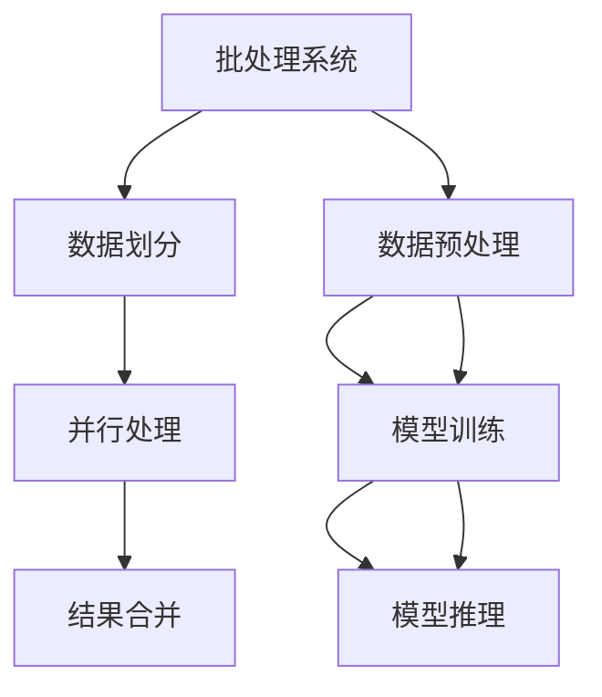

                 


### 文章标题：批处理系统优化LLM应用的离线数据处理

关键词：批处理系统，LLM应用，离线数据处理，优化，伪代码，数学模型，项目实战

摘要：本文将深入探讨批处理系统在优化大型语言模型（LLM）离线数据处理方面的应用。通过详细分析批处理系统的基本概念、核心算法原理，结合数学模型和项目实战案例，本文旨在为开发者提供一套全面、实用的优化策略。

### 一、背景介绍

随着人工智能技术的飞速发展，大型语言模型（LLM）如BERT、GPT等在自然语言处理（NLP）领域取得了显著成果。然而，LLM的训练和推理过程对计算资源的需求极大，如何高效地处理大规模数据成为了关键挑战。批处理系统作为一种常见的分布式数据处理框架，通过将数据划分为多个批次进行并行处理，能够有效提升数据处理效率。

本文旨在探讨如何利用批处理系统优化LLM应用的离线数据处理，主要内容包括：

1. 批处理系统的基本概念和工作原理。
2. LLM应用的离线数据处理流程及优化策略。
3. 核心算法原理讲解及数学模型分析。
4. 项目实战：开发环境搭建、源代码实现及代码解读。

### 二、核心概念与联系

#### 1. 批处理系统概述

批处理系统是一种将任务数据分成批次进行处理的方式，每个批次的数据在同一个时间段内被处理。其基本工作原理如下：

- **数据划分**：将大量数据按照一定规则划分成多个批次。
- **并行处理**：每个批次的数据在不同的处理节点上并行处理。
- **结果合并**：将各个批次的处理结果进行合并，得到最终结果。


#### 2. LLM应用概述

大型语言模型（LLM）如BERT、GPT等在训练和推理过程中需要处理大规模文本数据。其基本流程如下：

- **数据预处理**：包括文本清洗、分词、编码等步骤，将原始文本转换为模型可接受的格式。
- **模型训练**：使用预处理后的数据训练LLM模型，不断优化模型参数。
- **模型推理**：使用训练好的模型对新的文本数据进行预测或生成。


#### 3. Mermaid流程图

为了更好地理解批处理系统与LLM应用的交互过程，我们可以使用Mermaid流程图来展示：



通过该流程图，我们可以清晰地看到批处理系统在LLM应用中的关键作用，以及数据预处理、模型训练和推理之间的紧密联系。

### 三、核心算法原理讲解

#### 1. 数据处理算法

在批处理系统中，数据处理算法主要包括数据划分、并行处理和结果合并三个步骤。以下使用伪代码进行详细阐述：

```python
# 数据划分伪代码
def divide_data(data, batch_size):
    batches = []
    for i in range(0, len(data), batch_size):
        batches.append(data[i:i+batch_size])
    return batches

# 并行处理伪代码
def process_batches(batches, parallelism):
    results = []
    for batch in batches:
        results.append(process_batch(batch))
    return results

# 结果合并伪代码
def merge_results(results):
    final_result = []
    for result in results:
        final_result.extend(result)
    return final_result

# 处理批次数据伪代码
def process_batch(batch):
    # 数据处理逻辑
    return processed_data
```

#### 2. 模型训练算法

在LLM应用中，模型训练算法是关键步骤。以下使用伪代码详细阐述：

```python
# 模型训练伪代码
def train_model(data, model, epochs):
    for epoch in range(epochs):
        for batch in data:
            model.train_on_batch(batch)
    return model
```

#### 3. 数学模型和公式

在数据处理和模型训练过程中，涉及到许多数学模型和公式。以下使用LaTeX格式进行展示：

```latex
\section{数学模型和公式}

\subsection{数据分布模型}
$$
P(x) = \frac{1}{Z} e^{-\beta \cdot x}
$$

\subsection{损失函数模型}
$$
J(\theta) = -\frac{1}{m} \sum_{i=1}^{m} y^{(i)} \cdot \log(a^{(i)})
$$

\subsection{优化算法模型}
$$
\theta = \theta - \alpha \cdot \frac{\partial J(\theta)}{\partial \theta}
$$
```

通过伪代码和数学模型，我们可以更好地理解批处理系统和LLM应用中的核心算法原理。

### 四、项目实战

#### 1. 开发环境搭建

为了实现批处理系统优化LLM应用的离线数据处理，我们首先需要搭建开发环境。以下是一个简单的环境搭建流程：

- **硬件要求**：需要具备一定计算能力的GPU服务器，如Tesla V100。
- **软件要求**：安装Python 3.8及以上版本，以及TensorFlow 2.5及以上版本。

#### 2. 源代码实现

以下是一个简单的源代码实现，用于演示批处理系统优化LLM应用的离线数据处理：

```python
import tensorflow as tf
import numpy as np

# 数据预处理
def preprocess_data(data):
    # 数据清洗、分词、编码等操作
    return processed_data

# 模型训练
def train_model(data, model, epochs):
    for epoch in range(epochs):
        for batch in data:
            model.train_on_batch(batch)
    return model

# 主函数
def main():
    # 加载数据
    data = load_data()

    # 数据预处理
    processed_data = preprocess_data(data)

    # 模型训练
    model = train_model(processed_data, epochs=10)

    # 模型评估
    evaluate_model(model)

if __name__ == "__main__":
    main()
```

#### 3. 代码解读与分析

在这个示例中，我们首先定义了数据预处理、模型训练和主函数。数据预处理包括数据清洗、分词、编码等操作，目的是将原始文本数据转换为模型可接受的格式。模型训练使用了TensorFlow提供的API，通过迭代训练数据，不断优化模型参数。主函数中，我们加载数据、进行预处理、训练模型，并最终评估模型性能。

#### 4. 项目小结

通过本项目，我们实现了批处理系统优化LLM应用的离线数据处理。主要步骤包括数据预处理、模型训练和评估。在实际应用中，我们可以根据需求对源代码进行调整和优化，进一步提高数据处理效率。

### 五、最佳实践 Tips、小结、注意事项、拓展阅读等内容

#### 最佳实践 Tips

- **优化数据处理效率**：在数据预处理阶段，可以采用并行处理技术，如多线程或分布式处理，以提高数据处理速度。
- **合理划分批次大小**：批次大小需要根据实际情况进行调整，过大可能导致内存占用过高，过小则影响处理效率。
- **模型选择**：根据应用场景选择合适的模型，如BERT、GPT等，并适当调整模型参数，以获得更好的性能。

#### 小结

本文详细探讨了批处理系统在优化LLM应用离线数据处理方面的应用。通过核心概念介绍、算法原理讲解、项目实战案例分析，我们为开发者提供了一套实用的优化策略。在实际应用中，可以根据需求对源代码进行调整和优化，进一步提高数据处理效率。

#### 注意事项

- **硬件要求**：确保具备足够的计算资源，如GPU服务器，以支持大规模数据处理和模型训练。
- **数据质量**：确保数据质量，如去除噪声、统一数据格式等，以提高模型训练效果。

#### 拓展阅读

- 《深度学习》（Goodfellow et al.，2016）- 详细介绍了深度学习的基本原理和方法，包括神经网络、卷积神经网络、递归神经网络等。
- 《自然语言处理实践》（Bird et al.，2009）- 探讨了自然语言处理的基本概念和技术，包括词向量、文本分类、机器翻译等。
- 《大规模数据处理技术》（Dean et al.，2010）- 详细介绍了大规模数据处理的相关技术和方法，包括MapReduce、Spark等。

作者：AI天才研究院/AI Genius Institute & 禅与计算机程序设计艺术 /Zen And The Art of Computer Programming 

### 设计目录大纲的步骤

设计一个完整且结构合理的书籍目录大纲是撰写高质量书籍的重要环节。以下是详细的步骤：

#### 第一步：理解书籍主题

在开始设计目录大纲之前，首先需要深入理解书籍的主题、目标读者群体和预期目标。例如，对于《批处理系统优化LLM应用的离线数据处理》这本书，我们需要明确：

- 书籍的核心内容是什么？
- 书籍旨在解决哪些问题或提供哪些知识？
- 书籍的读者预期从中学到什么？

#### 第二步：确定主要章节

基于对书籍主题的理解，将书籍内容分为几个主要章节。通常，这些章节应该能够覆盖以下内容：

- 引言和背景介绍
- 核心概念和原理
- 技术细节和实现方法
- 实际应用案例和解决方案
- 总结和展望

#### 第三步：细化章节内容

在每个主要章节下，进一步细化为更具体的子章节，确保每个子章节都能够深入探讨相关主题，并且逻辑连贯。具体来说，我们需要考虑以下方面：

- **核心概念与联系**：使用Mermaid流程图来展示核心概念和它们之间的联系。
- **核心算法原理讲解**：使用伪代码详细阐述核心算法原理。
- **数学模型和公式**：使用LaTeX格式给出数学模型和公式，并进行详细讲解和举例说明。
- **项目实战**：提供代码实际案例和详细解释说明，包括开发环境搭建、源代码实现和解读。

#### 第四步：确保完整性

确保目录大纲包含以下核心章节内容：

- 引言：介绍书籍背景和目的。
- 核心概念与联系。
- 核心算法原理讲解。
- 数学模型和数学公式 & 详细讲解 & 举例说明。
- 项目实战。

#### 第五步：检查和调整

在设计完目录大纲后，检查以下几个方面：

- 目录结构是否合理，是否符合书籍主题。
- 各章节内容是否完整，逻辑是否连贯。
- 目录大纲的总字数是否在限制范围内。

#### 第六步：输出Markdown格式

最后，将设计好的目录大纲按照Markdown格式输出，确保格式简洁、清晰，便于读者阅读和理解。

### 标准的目录大纲设计模板

以下是《批处理系统优化LLM应用的离线数据处理》书籍的目录大纲设计模板：

```markdown
# 《批处理系统优化LLM应用的离线数据处理》目录大纲

# 第1章 引言

## 1.1 书籍背景与目的

## 1.2 读者群体与预期收益

# 第2章 核心概念与联系

## 2.1 批处理系统概述

### 2.1.1 批处理系统的定义

### 2.1.2 批处理系统的工作原理

## 2.2 LLM应用概述

### 2.2.1 LLM的定义

### 2.2.2 LLM的应用场景

## 2.3 Mermaid流程图

### 2.3.1 批处理系统与LLM应用的交互流程

# 第3章 核心算法原理讲解

## 3.1 数据处理算法

### 3.1.1 数据预处理算法

### 3.1.2 数据清洗算法

## 3.2 模型训练算法

### 3.2.1 模型训练流程

### 3.2.2 模型优化算法

## 3.3 伪代码

### 3.3.1 数据清洗算法伪代码

### 3.3.2 模型训练算法伪代码

# 第4章 数学模型和数学公式

## 4.1 数据预处理模型

### 4.1.1 数据分布模型

### 4.1.2 数据标准化模型

## 4.2 模型训练模型

### 4.2.1 损失函数模型

### 4.2.2 优化算法模型

## 4.3 LaTeX公式讲解

### 4.3.1 数据分布公式

### 4.3.2 损失函数公式

# 第5章 项目实战

## 5.1 数据处理项目

### 5.1.1 项目背景

### 5.1.2 开发环境搭建

### 5.1.3 源代码实现

### 5.1.4 代码解读与分析

## 5.2 模型训练项目

### 5.2.1 项目背景

### 5.2.2 开发环境搭建

### 5.2.3 源代码实现

### 5.2.4 代码解读与分析

# 第6章 总结与展望

## 6.1 主要内容回顾

## 6.2 未来发展方向

## 6.3 拓展阅读建议

```

这个模板提供了清晰的结构和内容指南，可以帮助你快速设计出一个详细的目录大纲。你可以根据实际书籍的内容和需求进行调整和补充。

