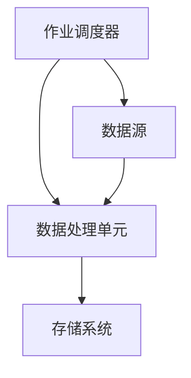
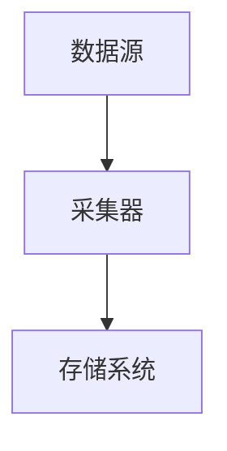
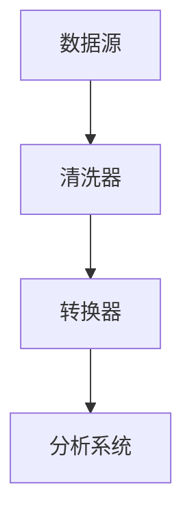
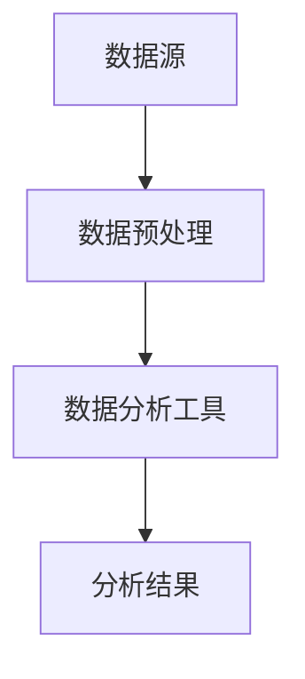
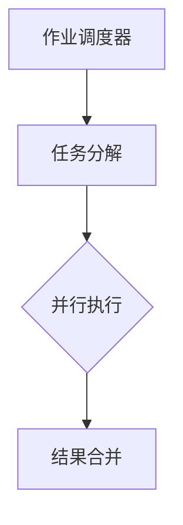
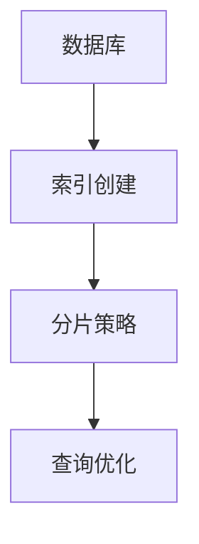

                 

## 文章标题：批处理系统：优化LLM应用的离线数据处理

### 关键词：批处理系统、LLM、离线数据处理、性能优化、应用实战

### 摘要：

本文深入探讨了批处理系统在优化大型语言模型（LLM）应用中的离线数据处理技术。首先，文章介绍了批处理系统的基础概念和架构，解析了其与实时处理系统的差异。随后，详细阐述了LLM的基本原理及其在数据处理中的应用。在此基础上，文章探讨了离线数据处理的各个环节，包括数据采集与存储、数据清洗与转换、以及数据分析技术。为了提高处理效率，文章还提出了多种优化策略，包括系统性能优化和数据库优化。最后，通过实际案例展示了批处理系统在LLM应用中的实战效果，并总结了对未来研究和实践方向的展望。

---

### 第一部分：引言

#### 1.1 批处理系统的核心概念与联系

批处理系统（Batch Processing System）是一种数据处理方式，它将多个任务（作业）合并成一批进行处理。这种方式特别适用于处理大量数据，如大规模数据分析、报告生成和后台任务处理等。批处理系统与实时处理系统（Real-time Processing System）不同，后者强调数据的即时处理和响应。

#### 1.2 批处理系统的架构

批处理系统通常由以下几个核心组件组成：

- **作业调度器（Job Scheduler）**：负责管理和调度作业，确保作业按照一定的顺序和策略执行。
- **数据处理单元（Data Processing Unit）**：执行具体的作业，如数据清洗、转换和分析等。
- **存储系统（Storage System）**：用于存储原始数据和生成的中间数据，以及最终结果。

以下是一个简化的批处理系统架构Mermaid流程图：



#### 1.3 批处理系统与实时处理系统的对比

| 对比项         | 批处理系统                       | 实时处理系统                       |
| -------------- | -------------------------------- | --------------------------------- |
| 数据处理方式   | 批量处理，异步执行               | 实时处理，即时响应                 |
| 数据处理时间   | 长时间，可能涉及分钟或小时级别    | 短时间，通常在毫秒或秒级别          |
| 系统复杂性     | 相对简单，适用于大规模数据处理    | 复杂，需要高效的数据流处理能力      |
| 适用场景       | 后台数据处理，报告生成等         | 实时交易系统，在线广告投放等       |

### 第二部分：LLM应用

#### 2.1 语言模型概述

语言模型（Language Model，简称LM）是一种统计模型，用于预测自然语言序列中的下一个单词或字符。在深度学习领域，语言模型通常基于神经网络构建，如GPT（Generative Pre-trained Transformer）和BERT（Bidirectional Encoder Representations from Transformers）等。

#### 2.2 LLM在数据处理中的应用

语言模型在数据处理中的应用非常广泛，主要包括以下几个方面：

- **数据预处理**：使用语言模型对原始文本数据进行预处理，如分词、去噪和标准化等。
- **数据分析**：利用语言模型进行文本分类、情感分析、命名实体识别等高级分析任务。
- **生成式任务**：使用语言模型生成文本摘要、文章、对话等。

#### 2.3 LLM的应用实例

假设我们有一个包含数百万条用户评论的数据集，我们可以使用LLM进行以下任务：

- **数据预处理**：使用GPT进行文本分词和去噪，提取有用的评论内容。
- **数据分析**：使用BERT进行情感分析，判断每条评论的情感倾向。
- **生成式任务**：使用GPT生成高质量的文本摘要或回复。

### 第三部分：离线数据处理

#### 3.1 数据采集与存储

离线数据处理的第一步是数据采集。这通常涉及从各种数据源（如数据库、文件系统、Web API等）收集数据。采集到的数据需要存储在一个可靠、高效的存储系统中。常用的存储系统包括Hadoop的HDFS（Hadoop Distributed File System）和云存储服务（如Amazon S3、Google Cloud Storage）。

以下是一个简单的数据采集与存储流程图：



#### 3.2 数据清洗与转换

数据清洗是数据处理的关键步骤，它涉及去除无效数据、填补缺失值、标准化数据等操作。清洗后的数据需要转换成适合分析和处理的形式，如将文本数据转换为词向量。

以下是一个数据清洗与转换流程图：



#### 3.3 数据分析

数据分析是离线数据处理的核心环节，它涉及使用各种算法和工具对数据进行探索、建模和分析。常见的数据分析技术包括聚类、分类、回归和关联规则挖掘等。

以下是一个简单的数据分析流程图：



### 第四部分：优化策略

#### 4.1 系统性能优化

为了提高批处理系统的性能，我们可以采取以下策略：

- **并行处理**：将数据处理任务分解成多个子任务，并行执行。
- **缓存策略**：缓存重复计算的结果，减少计算时间。
- **负载均衡**：合理分配任务，避免某些节点负载过高。

以下是一个简单的并行处理流程图：



#### 4.2 数据库优化

数据库优化是提高数据处理效率的重要手段，以下是一些常见的优化策略：

- **索引优化**：为常用查询创建索引，加快查询速度。
- **分片策略**：将数据分布到多个节点上，提高查询和写入的效率。

以下是一个简单的数据库优化流程图：



### 第五部分：实战案例

#### 5.1 数据预处理实战

在本节中，我们将使用Python和Hadoop的HDFS进行一个简单的数据预处理实战。

**开发环境搭建**：

- Python 3.8+
- Hadoop 3.2+

**源代码实现**：

```python
# import necessary libraries
import findspark
findspark.init()

from pyspark.sql import SparkSession
from pyspark.sql.functions import col

# create a SparkSession
spark = SparkSession.builder \
    .appName("DataPreprocessing") \
    .getOrCreate()

# read data from HDFS
data = spark.read.csv("hdfs://path/to/data.csv", header=True)

# data cleaning and transformation
cleaned_data = data.na.fill(value="Unknown") \
    .withColumn("cleaned_text", col("text").rlike("^[a-zA-Z0-9]+$"))

# save cleaned data to HDFS
cleaned_data.write.mode("overwrite").csv("hdfs://path/to/cleaned_data")

# stop the SparkSession
spark.stop()
```

**代码解读与分析**：

- **数据读取**：使用Spark的`read.csv`方法从HDFS读取CSV文件。
- **数据清洗**：使用`na.fill`方法填充缺失值，使用`rlike`方法过滤非字母数字字符。
- **数据转换**：将清洗后的文本数据保存为新的CSV文件。

#### 5.2 数据分析实战

在本节中，我们将使用Spark和MLlib进行一个简单的数据分析实战。

**开发环境搭建**：

- Python 3.8+
- Spark 3.2+
- MLlib 3.2+

**源代码实现**：

```python
# import necessary libraries
from pyspark.sql import SparkSession
from pyspark.ml.feature import Word2Vec

# create a SparkSession
spark = SparkSession.builder \
    .appName("DataAnalysis") \
    .getOrCreate()

# read cleaned data from HDFS
data = spark.read.csv("hdfs://path/to/cleaned_data.csv", header=True)

# train a Word2Vec model
word2vec = Word2Vec(vectorSize=100, minCount=1)
model = word2vec.fit(data)

# save the model
model.save("hdfs://path/to/word2vec_model")

# stop the SparkSession
spark.stop()
```

**代码解读与分析**：

- **数据读取**：使用Spark的`read.csv`方法从HDFS读取CSV文件。
- **Word2Vec模型训练**：使用MLlib的`Word2Vec`类训练词向量模型。
- **模型保存**：将训练好的模型保存到HDFS。

#### 5.3 实际案例分析和详细讲解剖析

在本节中，我们将分析一个实际的案例：使用批处理系统对大量用户评论进行情感分析和文本分类。

**案例背景**：

- 数据集：包含数百万条用户评论，每条评论包含用户ID、评论内容和评论时间。
- 目标：分析用户评论的情感倾向，并对评论进行分类。

**实现步骤**：

1. **数据采集**：从数据库中读取用户评论数据。
2. **数据清洗**：去除无效数据、填补缺失值、分词等。
3. **情感分析**：使用预训练的BERT模型进行情感分析。
4. **文本分类**：使用训练好的文本分类模型对评论进行分类。
5. **结果保存**：将分析结果保存到数据库或文件系统中。

**案例剖析**：

- **数据采集**：使用Spark SQL从数据库中读取数据。
- **数据清洗**：使用自定义UDF（User-Defined Function）进行数据清洗。
- **情感分析**：使用Hugging Face的Transformers库加载预训练的BERT模型。
- **文本分类**：使用训练好的文本分类模型，如朴素贝叶斯、支持向量机等。
- **结果保存**：使用Spark SQL将结果保存到数据库，或使用Pandas将结果保存到CSV文件。

### 第六部分：总结与展望

#### 6.1 研究进展

离线数据处理技术在近年来取得了显著进展，尤其是在大数据和人工智能领域。批处理系统作为一种高效的数据处理方式，已经被广泛应用于各种场景，如金融、医疗、电商等。

LLM作为自然语言处理的重要工具，也在离线数据处理中发挥了重要作用。通过预训练和微调，LLM可以处理大规模文本数据，提取有用信息，为数据分析和应用提供支持。

#### 6.2 未来方向

离线数据处理技术的未来发展方向包括：

- **性能优化**：进一步提高批处理系统的性能，支持更大数据集的处理。
- **模型优化**：研究和开发更高效的LLM模型，提高数据处理和分析的准确性。
- **自动化**：实现数据采集、清洗、分析和优化的自动化，降低开发门槛。
- **实时处理**：结合实时处理技术，实现离线与实时数据的无缝衔接。

### 作者信息

作者：AI天才研究院/AI Genius Institute & 禅与计算机程序设计艺术 /Zen And The Art of Computer Programming

---

本文详细介绍了批处理系统在优化LLM应用的离线数据处理中的重要性。通过逐步分析批处理系统的核心概念、LLM的应用、离线数据处理技术、优化策略和实战案例，我们展示了如何利用批处理系统高效处理大规模文本数据，提高数据处理和分析的效率。本文的研究成果对于推进离线数据处理技术在人工智能领域的应用具有重要的参考价值。未来，我们将继续探索批处理系统和LLM在实时数据处理、自动化和模型优化等方面的研究，以应对不断变化的技术挑战。作者：AI天才研究院/AI Genius Institute & 禅与计算机程序设计艺术/Zen And The Art of Computer Programming。

