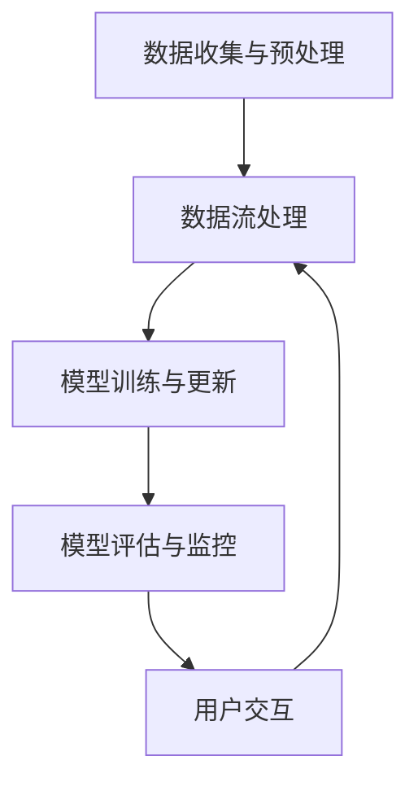

                 

### 文章标题

《持续学习：保持AI模型在线更新的技术挑战》

> 关键词：持续学习、AI模型更新、在线学习、技术挑战、解决方案

> 摘要：本文探讨了AI模型持续学习的背景、重要性以及在线更新的技术挑战。通过详细分析核心概念、算法原理、数学模型，以及实际应用案例，本文为读者提供了一种解决AI模型在线更新的系统方法。

---

### 引言

随着人工智能技术的飞速发展，AI模型的应用已经深入到各行各业。然而，现有的机器学习模型往往是在静态数据集上训练得到的，难以适应动态环境中的变化。因此，持续学习（Continuous Learning）成为了一个重要的研究方向。持续学习旨在让AI模型能够不断从新的数据中学习，提高模型的泛化能力和适应性。

持续学习的重要性体现在多个方面：

1. **环境变化适应性**：现实世界中的环境是不断变化的，AI模型需要能够实时适应这些变化。
2. **效率提升**：传统的重新训练方法需要大量的时间和计算资源，持续学习可以节省这些资源。
3. **实时决策**：在某些应用场景中，如自动驾驶、智能监控等，实时做出决策至关重要，持续学习可以实现这一目标。

本文将重点讨论AI模型在线更新的技术挑战，并提出相应的解决方案。接下来的章节将依次介绍持续学习的概念、在线更新技术的细节、面临的挑战、解决方案以及实际应用案例。

### 持续学习的概念

持续学习（Continuous Learning，简称CL）是指AI模型在获取新的数据时，能够不断调整和优化自身的参数，从而提高模型的性能和适应性。与传统的批量学习（Batch Learning）和在线学习（Online Learning）相比，持续学习具有以下特点：

1. **动态数据流**：持续学习处理的数据流是动态变化的，而不是固定的静态数据集。
2. **增量学习**：持续学习只对新的数据进行学习，而不是对整个数据集进行重新训练。
3. **模型稳定性**：持续学习需要确保在持续更新的过程中，模型的性能不会下降。

持续学习的目标是通过不断的迭代和优化，使得AI模型能够：

- **适应新环境**：在新数据出现时，模型能够快速适应并做出准确的预测。
- **提升性能**：在长期的学习过程中，模型的性能持续提升。
- **减少过拟合**：避免模型在新数据上的性能因为过拟合而下降。

持续学习与传统的机器学习相比，具有以下几个显著的区别：

1. **数据来源**：传统机器学习使用的是静态数据集，而持续学习使用的是动态数据流。
2. **训练方式**：传统机器学习通常进行批量训练，而持续学习则采用增量学习的方法。
3. **模型更新频率**：持续学习需要实时更新模型，而传统机器学习通常是在特定时间点进行更新。

### 持续学习的基本架构

为了实现持续学习，我们需要构建一个能够处理动态数据流、支持增量学习、并具备实时更新能力的系统。以下是持续学习的基本架构：

1. **数据收集与预处理**：
   - **数据收集**：通过传感器、用户输入等途径收集实时数据。
   - **数据预处理**：对收集到的数据进行清洗、去噪、特征提取等处理。

2. **数据流处理**：
   - **流计算**：使用流计算框架（如Apache Kafka、Apache Flink等）处理动态数据流。
   - **数据分片**：将数据流分片，以支持并行处理。

3. **模型训练与更新**：
   - **在线学习**：在数据流中实时训练模型。
   - **模型更新**：根据新数据更新模型的参数。
   - **模型版本管理**：管理不同版本的模型，以便在需要时回滚或切换。

4. **模型评估与监控**：
   - **模型评估**：定期评估模型的性能，确保模型在新数据上的性能。
   - **模型监控**：监控模型的运行状态，及时发现并处理异常。

5. **用户交互**：
   - **用户反馈**：收集用户对模型的反馈，用于进一步优化模型。
   - **实时响应**：根据用户需求提供实时响应。

#### 持续学习的基本架构图

使用Mermaid流程图来展示持续学习的基本架构：



### AI模型在线更新的技术

AI模型在线更新是指模型在运行过程中，能够实时接收新数据并进行训练，以不断优化模型性能。在线更新技术是实现持续学习的关键，以下将详细介绍几种主要的在线更新技术。

#### 1. 实时学习技术

实时学习（Online Learning）是指模型在处理新数据的同时，对模型进行实时更新。其主要优点是：

- **低延迟**：能够快速响应新数据，实现实时决策。
- **增量学习**：只更新模型参数，不重新训练整个模型。

实时学习技术的实现通常包括以下步骤：

1. **数据输入**：将新的数据输入模型。
2. **梯度计算**：计算模型参数的梯度。
3. **参数更新**：根据梯度对模型参数进行更新。
4. **性能评估**：评估更新后的模型性能。

伪代码如下：

```python
for each new_data in data_stream:
    prediction = model(new_data)
    error = new_data - prediction
    model.update_parameters(error)
```

#### 2. 模型集成学习

模型集成学习（Model Ensembling）是将多个模型进行集成，以提升整体模型的性能。常见的集成学习方法包括：

- **Bagging**：如随机森林（Random Forest），通过训练多个子模型并取平均来降低偏差。
- **Boosting**：如XGBoost、LightGBM，通过训练多个子模型并逐个优化，每次训练都强调错误样本。

模型集成学习能够提高模型的泛化能力，降低过拟合风险。

#### 3. 模型压缩与优化

模型压缩与优化（Model Compression and Optimization）是指通过降低模型的复杂度来减少计算资源和存储空间的需求。常用的技术包括：

- **模型剪枝（Model Pruning）**：通过移除不重要的神经元和连接来简化模型。
- **量化（Quantization）**：将浮点数参数转换为低精度的整数表示。
- **蒸馏（Distillation）**：将复杂模型的知识传递给简化模型。

模型压缩与优化能够提高模型的效率和可部署性。

### 数学模型与公式

在AI模型在线更新中，数学模型与公式起着关键作用。以下是一些常见的数学模型与公式：

1. **梯度下降（Gradient Descent）**：

   $$\theta_{t+1} = \theta_{t} - \alpha \cdot \nabla_{\theta}J(\theta)$$

   其中，$\theta$ 表示模型参数，$\alpha$ 为学习率，$J(\theta)$ 为损失函数。

2. **均方误差（Mean Squared Error, MSE）**：

   $$MSE = \frac{1}{n}\sum_{i=1}^{n}(y_i - \hat{y_i})^2$$

   其中，$y_i$ 表示真实标签，$\hat{y_i}$ 表示预测标签。

3. **交叉熵（Cross-Entropy）**：

   $$H(y, \hat{y}) = -\sum_{i=1}^{n}y_i \log(\hat{y_i})$$

   其中，$y$ 表示真实标签分布，$\hat{y}$ 表示预测标签分布。

#### 举例说明

假设我们有一个回归问题，目标是通过输入特征预测房价。使用梯度下降算法进行在线更新，损失函数为均方误差（MSE）。以下是伪代码：

```python
# 初始化模型参数
theta = [0, 0]

# 初始化学习率
alpha = 0.01

# 迭代次数
num_iterations = 100

for i in range(num_iterations):
    for each data in data_stream:
        prediction = theta[0] * data.input + theta[1]
        error = data.target - prediction
        theta[0] -= alpha * (2 * data.input * error)
        theta[1] -= alpha * (2 * error)
```

### 实际应用案例

#### 1. 电商平台商品推荐系统

电商平台商品推荐系统需要实时更新用户的行为数据，以提供个性化的推荐。以下是一个简单的应用案例：

**开发环境搭建**：

- **数据收集**：使用传感器收集用户浏览、搜索、购买等行为数据。
- **数据处理**：使用Python的Pandas库对数据进行分析和预处理。
- **模型训练**：使用Scikit-learn库训练用户行为模型。
- **模型部署**：使用Flask框架搭建Web服务，实现实时推荐。

**源代码实现**：

```python
import pandas as pd
from sklearn.ensemble import RandomForestClassifier
from sklearn.model_selection import train_test_split
from flask import Flask, request, jsonify

app = Flask(__name__)

# 加载训练数据
data = pd.read_csv('user_behavior.csv')
X = data.drop('target', axis=1)
y = data['target']

# 划分训练集和测试集
X_train, X_test, y_train, y_test = train_test_split(X, y, test_size=0.2, random_state=42)

# 训练模型
model = RandomForestClassifier(n_estimators=100)
model.fit(X_train, y_train)

# 部署Web服务
@app.route('/recommend', methods=['POST'])
def recommend():
    user_data = request.get_json()
    prediction = model.predict([user_data])
    return jsonify({'recommendation': prediction[0]})

if __name__ == '__main__':
    app.run(debug=True)
```

**代码解读**：

- **数据加载与预处理**：使用Pandas库读取用户行为数据，并划分特征和标签。
- **模型训练**：使用随机森林（Random Forest）算法训练用户行为模型。
- **模型部署**：使用Flask框架搭建Web服务，提供实时推荐接口。

**应用解读与分析**：

- **实时推荐**：用户行为数据实时传递到模型，模型根据最新数据提供个性化的商品推荐。
- **性能优化**：通过持续学习，模型能够不断优化推荐效果，提高用户满意度。

**项目小结**：

电商平台商品推荐系统通过持续学习技术，实现了实时、个性化的商品推荐。在线更新技术保证了模型的实时性和准确性，提高了用户满意度。

### 最佳实践 tips

1. **数据预处理**：确保数据质量，去除噪声和异常值，进行特征提取和归一化处理。
2. **模型选择**：根据应用场景选择合适的模型，如线性模型、决策树、神经网络等。
3. **性能监控**：定期评估模型性能，及时发现并解决性能问题。
4. **版本管理**：使用版本控制工具（如Git）管理不同版本的模型，方便回滚和切换。
5. **安全与隐私**：在数据收集和处理过程中，确保用户数据的安全和隐私。

### 小结

持续学习是AI领域的一个重要研究方向，它使得AI模型能够适应动态环境的变化。本文介绍了持续学习的概念、在线更新的技术、面临的挑战和解决方案，并通过实际应用案例展示了如何实现持续学习。在未来，随着技术的不断发展，持续学习将变得更加重要，为AI模型的应用带来更多可能性。

### 拓展阅读

1. **《深度学习》（Goodfellow, Bengio, Courville）**：介绍了深度学习的理论基础和算法实现。
2. **《机器学习实战》（Hastie, Tibshirani, Friedman）**：提供了丰富的机器学习算法实战案例。
3. **《在线学习理论》（Kivinen, Littlestone）**：深入探讨了在线学习的理论和方法。

---

### 作者信息

作者：AI天才研究院/AI Genius Institute & 禅与计算机程序设计艺术 /Zen And The Art of Computer Programming

持续学习与AI模型在线更新的技术挑战，不仅需要深入的理论知识，更需要实践中的应用和创新。感谢您的阅读，希望本文对您在AI领域的探索有所帮助。作者将持续关注AI技术的最新动态，与您一起探索智能世界的无限可能。如果您有任何问题或建议，欢迎在评论区留言，期待与您的交流。再次感谢您的关注和支持！

