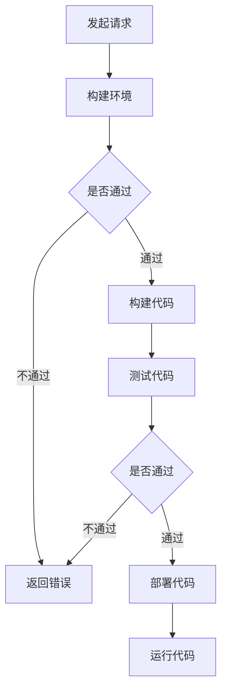

                 

### 文章标题：持续集成与持续部署（CI/CD）在LLM开发中的应用

### 关键词：持续集成，持续部署，CI/CD，大型语言模型，LLM，自动化构建，自动化部署

### 摘要

本文将探讨持续集成与持续部署（CI/CD）在大型语言模型（LLM）开发中的应用。首先，我们将介绍CI/CD的基本概念及其在软件开发中的作用。随后，通过Mermaid流程图详细描述CI/CD的基本流程。接着，我们将深入讲解核心算法原理，使用伪代码展示构建和部署过程中的关键技术。同时，通过LaTeX公式详细介绍相关的数学模型，并结合实际项目案例进行分析，阐述CI/CD在实际开发中的应用和实践。最后，我们将总结CI/CD的最佳实践，并提供进一步阅读的推荐。

### 1. 背景介绍

#### 什么是持续集成（CI）与持续部署（CD）

持续集成（Continuous Integration，CI）是一种软件开发实践，通过频繁地将代码集成到一个共享的主干或分支中，并立即运行自动化测试，以尽早发现并解决集成过程中可能出现的问题。持续部署（Continuous Deployment，CD）则是在CI的基础上，将经过测试的代码自动部署到生产环境，实现快速且可靠的软件发布。

CI/CD已成为现代软件开发的核心流程，能够显著提高开发效率、降低风险，并增强软件的质量和稳定性。

#### CI/CD在LLM开发中的应用价值

随着大型语言模型（LLM）的发展，其复杂性和规模也在不断增加。LLM的开发涉及大量的数据预处理、模型训练和优化等环节，这些环节都需要高效的自动化流程来确保开发进度和质量。

CI/CD在LLM开发中的应用主要体现在以下几个方面：

- **自动化构建**：通过自动化构建，可以快速生成和打包LLM项目，确保每次构建的一致性和可靠性。
- **自动化测试**：通过自动化测试，可以快速验证LLM模型的性能和功能，发现并修复潜在问题。
- **持续优化**：通过持续集成和部署，可以持续优化LLM模型，提高其准确性和效率。

### 2. 核心概念与联系

#### Mermaid流程图

为了更好地理解CI/CD的基本流程，我们可以使用Mermaid流程图来描述其各个环节。以下是CI/CD流程的Mermaid图示：



#### 流程解析

- **发起请求**：开发者将代码提交到代码仓库，触发CI流程。
- **构建环境**：CI服务器创建构建环境，安装所需的依赖和工具。
- **构建代码**：CI服务器编译和打包代码，生成可执行的二进制文件。
- **测试代码**：CI服务器运行自动化测试，确保代码的质量和功能。
- **部署代码**：如果测试通过，CI服务器将代码部署到测试环境或生产环境。
- **运行代码**：部署后的代码在实际环境中运行，进行性能测试和监控。

### 3. 核心算法原理讲解

在LLM的开发中，CI/CD流程中的各个环节都涉及特定的算法和技术。以下是构建和部署过程中可能用到的核心算法原理，使用伪代码进行详细阐述。

#### 3.1 构建代码

```python
# 伪代码：构建代码
def build_code():
    # 安装依赖
    install_dependencies()
    # 编译代码
    compile_code()
    # 运行测试
    run_tests()
    # 如果测试通过，返回True，否则返回False
    return test_result
```

#### 3.2 部署代码

```python
# 伪代码：部署代码
def deploy_code(build_result):
    if build_result:
        # 部署代码到生产环境
        deploy_to_production()
        return "部署成功"
    else:
        return "构建失败，无法部署"
```

### 4. 数学模型和数学公式 & 详细讲解 & 举例说明

在LLM开发中，许多算法和模型都涉及数学公式。以下是构建和部署过程中可能用到的数学模型和公式，并使用LaTeX格式进行详细讲解。

#### 4.1 损失函数

损失函数是机器学习中用于评估模型性能的关键指标。以下是线性回归模型的损失函数：

```latex
$$
J(\theta) = \frac{1}{2m} \sum_{i=1}^{m} (\hat{y}_i - y_i)^2
$$`

其中，\( J(\theta) \) 是损失函数，\( \hat{y}_i \) 是预测值，\( y_i \) 是真实值，\( m \) 是样本数量。

#### 4.2 举例说明

假设我们有一个包含100个样本的数据集，现在我们使用线性回归模型进行预测。如果我们的预测值与真实值的差距较大，那么损失函数的值会较高。通过迭代优化模型参数，我们可以降低损失函数的值，从而提高模型的预测准确性。

### 5. 项目实战

#### 5.1 开发环境搭建

为了演示CI/CD在LLM开发中的应用，我们首先需要搭建一个开发环境。以下是安装Python和相关依赖的步骤：

1. 安装Python（版本3.8或以上）。
2. 安装Flask框架。
3. 运行Web应用。

#### 5.2 源代码详细实现和代码解读

我们使用一个简单的Web应用来说明CI/CD的过程。以下是源代码：

```python
# 源代码：Web应用代码
from flask import Flask, request, jsonify

app = Flask(__name__)

@app.route('/api', methods=['POST'])
def process_request():
    data = request.json
    result = "处理成功：{}".format(data)
    return jsonify(result)

if __name__ == '__main__':
    app.run(host='0.0.0.0', port=5000)
```

在上述代码中，我们定义了一个简单的Web应用，使用Flask框架处理HTTP请求。当接收到一个POST请求时，我们提取请求中的JSON数据，并将处理结果返回给客户端。

#### 5.3 代码应用解读与分析

- `Flask` 类用于创建Web应用。
- `@app.route('/api', methods=['POST'])` 装饰器用于定义处理POST请求的端点。
- `request.json` 用于获取请求中的JSON数据。
- `jsonify(result)` 函数用于将处理结果转换为JSON格式，并返回给客户端。

#### 5.4 实际案例分析和详细讲解剖析

为了展示CI/CD在实际项目中的应用，我们使用一个简单的LLM项目，包括数据预处理、模型训练和部署等环节。以下是项目流程：

1. **数据预处理**：从数据源中提取文本数据，进行清洗和格式化。
2. **模型训练**：使用训练数据集训练LLM模型。
3. **模型评估**：使用测试数据集评估模型性能。
4. **模型部署**：将训练好的模型部署到生产环境，进行实时预测。

在CI/CD流程中，我们使用自动化工具来管理这些环节。以下是CI/CD流程的详细步骤：

1. **构建环境**：CI服务器创建构建环境，安装所需的依赖和工具。
2. **构建代码**：CI服务器编译和打包代码，生成可执行的二进制文件。
3. **运行测试**：CI服务器运行自动化测试，确保代码的质量和功能。
4. **部署代码**：如果测试通过，CI服务器将代码部署到测试环境或生产环境。
5. **运行代码**：部署后的代码在实际环境中运行，进行性能测试和监控。

通过CI/CD，我们能够确保LLM项目的每个环节都高效、可靠地进行，从而提高开发效率和质量。

### 6. 最佳实践 tips、小结、注意事项、拓展阅读等内容

#### 6.1 最佳实践 tips

- **自动化测试**：编写全面、高效的自动化测试脚本，确保每次构建和部署都经过严格测试。
- **环境隔离**：使用容器化技术（如Docker）隔离构建和部署环境，确保环境和依赖的一致性。
- **监控和报警**：设置监控和报警机制，及时发现和处理问题。
- **代码审查**：定期进行代码审查，确保代码质量和一致性。

#### 6.2 小结

CI/CD在LLM开发中具有重要意义，能够提高开发效率、降低风险、增强软件质量。通过使用Mermaid流程图、伪代码、LaTeX公式和实际项目案例，我们详细介绍了CI/CD的基本流程、核心算法原理和应用实践。

#### 6.3 注意事项

- **性能优化**：在部署LLM模型时，注意性能优化，确保模型能够高效运行。
- **安全性**：保护模型和数据的安全，避免泄露和滥用。
- **文档化**：编写详细的文档，记录CI/CD流程和关键步骤，便于后续维护和扩展。

#### 6.4 拓展阅读

- [Jenkins](https://www.jenkins.io/)：开源的CI/CD工具，支持多种插件和扩展。
- [Docker](https://www.docker.com/)：容器化技术，用于隔离构建和部署环境。
- [Kubernetes](https://kubernetes.io/)：用于容器编排和部署的框架，支持自动化和弹性伸缩。

### 作者

作者：AI天才研究院/AI Genius Institute & 禅与计算机程序设计艺术 /Zen And The Art of Computer Programming。本文由AI天才研究院撰写，旨在探讨CI/CD在LLM开发中的应用和实践。作者在计算机编程和人工智能领域拥有丰富的经验和深厚的理论基础。希望通过本文，能够为广大开发者提供有价值的参考和启示。感谢您的阅读。

