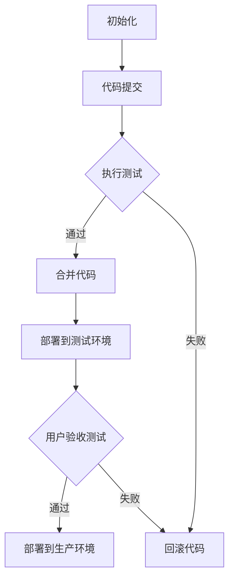

                 

### 持续集成在需求管理中的作用：提高开发灵活性

#### 关键词
持续集成、需求管理、开发灵活性、敏捷开发、自动化测试、工具与实践

#### 摘要
本文旨在探讨持续集成在需求管理中的作用，以及它如何提高开发灵活性。通过分析持续集成的基本概念、需求管理的核心任务，以及两者之间的结合方式，我们将深入探讨持续集成如何优化开发流程，提高团队协作效率，最终提升整体项目的开发灵活性。文章将结合实际案例，展示持续集成在敏捷开发中的应用，并总结最佳实践和未来的发展趋势。

### 第一部分：持续集成概述

#### 第1章：持续集成的基本概念

**1.1 什么是持续集成**

持续集成（Continuous Integration，简称CI）是一种软件开发实践，通过频繁地将代码合并到主干分支，并及时发现和解决冲突与缺陷，从而确保软件的持续稳定和可运行状态。

持续集成起源于敏捷开发运动，旨在通过不断的代码集成和测试，加快开发速度，提高代码质量。其核心理念包括自动化测试、频繁集成、快速反馈和持续反馈。

**1.2 持续集成的优势**

- **提高开发效率**：通过自动化测试和快速反馈，开发团队能够迅速发现和解决问题，减少重复工作，提高整体开发效率。
- **减少错误和缺陷**：频繁的集成和测试有助于发现潜在问题，从而在早期阶段解决，降低项目风险。
- **增强团队协作**：持续集成需要开发、测试和运维等角色的紧密协作，有助于提高团队沟通和协作效率。

**1.3 持续集成的常见模式**

- **短周期集成**：频繁地将代码合并到主干分支，通常每周或每日进行一次。
- **部分集成**：将部分代码模块或功能集成到主干分支，以确保关键功能的正常运行。
- **完整集成**：将所有代码合并到主干分支，并进行全面的测试，确保整个系统的稳定性。

#### 第2章：持续集成与需求管理

**2.1 需求管理概述**

需求管理是指识别、分析、记录和管理软件项目的需求，以确保项目能够满足客户和业务的需求。

需求管理的核心任务包括：

- **需求获取**：与利益相关者沟通，了解并记录需求。
- **需求分析**：分析需求，确保需求的可行性、一致性和完整性。
- **需求文档**：编写并维护需求文档，以便开发团队和其他相关方理解和遵守。
- **需求变更管理**：管理需求变更，确保变更对项目的影响得到充分评估和沟通。

**2.2 持续集成在需求管理中的重要性**

持续集成在需求管理中的重要性体现在以下几个方面：

- **提高需求变更的灵活性**：持续集成允许开发团队快速响应需求变更，通过频繁的集成和测试，确保变更能够及时地反映到代码中。
- **确保需求的一致性**：通过持续集成，可以及时发现需求之间的冲突和矛盾，确保需求的一致性和可行性。

**2.3 如何将持续集成与需求管理结合**

为了实现持续集成与需求管理的有效结合，可以采取以下措施：

- **建立需求跟踪系统**：使用需求跟踪工具，将需求与代码变更关联起来，确保需求的实现和跟踪。
- **自动化测试覆盖**：确保需求实现过程中的每一步都有相应的自动化测试覆盖，确保需求的一致性和正确性。
- **定期回顾**：定期回顾需求管理流程和持续集成实践，识别存在的问题和改进空间，持续优化流程。

### 第二部分：持续集成提高开发灵活性

#### 第3章：持续集成与开发流程优化

**3.1 持续集成对开发流程的影响**

持续集成对开发流程产生了深远的影响，主要表现在以下几个方面：

- **短周期迭代**：持续集成鼓励短周期迭代，使得开发团队可以更快地交付可用的软件功能。
- **自动化测试**：持续集成引入自动化测试，确保每次代码变更都能通过严格的测试，提高代码质量和可靠性。
- **快速反馈**：持续集成提供快速的反馈机制，使开发团队能够迅速识别和解决问题，减少延迟和成本。

**3.2 如何通过持续集成提高开发灵活性**

为了提高开发灵活性，可以采取以下措施：

- **灵活的部署策略**：通过持续集成和持续部署，实现快速部署和回滚，提高应对市场变化的能力。
- **持续集成与持续部署**：将持续集成与持续部署相结合，确保每次代码变更都能快速、安全地部署到生产环境。
- **自动化部署脚本**：编写自动化部署脚本，简化部署过程，减少手动操作，提高部署效率。

**3.3 持续集成与敏捷开发**

敏捷开发是一种以人为核心、迭代、渐进的软件开发方法。持续集成与敏捷开发的结合，可以进一步提升开发灵活性。

- **短周期迭代**：持续集成支持短周期迭代，使开发团队能够快速响应需求变化，持续交付高质量的功能。
- **频繁反馈**：持续集成提供频繁的反馈，帮助开发团队不断改进和优化开发过程，提高团队协作效率。
- **持续改进**：持续集成鼓励持续改进，通过不断优化开发流程和技术，提升整体开发能力。

### 第三部分：持续集成工具与技术

#### 第4章：持续集成工具与技术

**4.1 持续集成工具介绍**

常见的持续集成工具有：

- **Jenkins**：开源的持续集成服务器，支持多种编程语言和构建工具。
- **GitLab CI/CD**：GitLab 内置的持续集成和持续部署工具，提供简单易用的配置语言。
- **Travis CI**：基于云计算的持续集成服务，支持多种编程语言和平台。

**4.2 持续集成最佳实践**

为了确保持续集成效果，可以遵循以下最佳实践：

- **自动化测试**：确保每次代码变更都有相应的自动化测试覆盖，提高代码质量和可靠性。
- **持续反馈**：通过构建、测试和部署的自动化，实现快速、准确的反馈，帮助开发团队迅速识别和解决问题。
- **版本控制**：使用版本控制系统（如Git）管理代码变更，确保代码的一致性和可追溯性。

**4.3 持续集成在云计算环境中的应用**

在云计算环境中，持续集成可以提供以下优势：

- **弹性扩展**：根据需求自动扩展或缩减资源，提高持续集成系统的性能和稳定性。
- **多环境部署**：支持不同环境的持续集成和部署，确保代码在各种环境下的正常运行。
- **自动化资源管理**：通过自动化脚本和工具，简化资源管理和配置，降低运维成本。

### 第四部分：案例分析

#### 第5章：案例分析一：企业A的持续集成实践

**5.1 企业A的背景介绍**

企业A是一家从事电子商务的公司，面临快速变化的市场需求，希望提高开发效率和质量。

**5.2 持续集成方案设计与实施**

企业A采用了以下持续集成方案：

- **工具选型**：选择Jenkins作为持续集成工具。
- **代码仓库**：使用Git进行版本控制。
- **自动化测试**：编写自动化测试脚本，覆盖核心功能。
- **部署流程**：通过Jenkins实现自动化部署。

**5.3 持续集成实践的效果评估**

持续集成实施后，企业A取得了以下效果：

- **提高开发效率**：自动化测试和部署显著提高了开发效率，减少了人工操作。
- **减少错误和缺陷**：通过自动化测试，及时发现和解决潜在问题，降低了缺陷率。
- **增强团队协作**：开发、测试和运维团队的协作更加紧密，提高了整体项目质量。

#### 第6章：案例分析二：持续集成在敏捷开发中的应用

**6.1 敏捷开发概述**

敏捷开发是一种以人为核心、迭代、渐进的软件开发方法。其核心理念包括：

- **客户至上**：关注客户需求，持续交付有价值的软件。
- **迭代开发**：分阶段交付可用的软件功能，持续改进。
- **团队协作**：鼓励团队成员之间的沟通和协作。

**6.2 持续集成与敏捷开发的结合**

持续集成与敏捷开发的结合，可以进一步提升开发灵活性：

- **短周期迭代**：持续集成支持短周期迭代，使开发团队能够快速响应需求变化，持续交付高质量的功能。
- **频繁反馈**：持续集成提供频繁的反馈，帮助开发团队不断改进和优化开发过程，提高团队协作效率。
- **持续改进**：持续集成鼓励持续改进，通过不断优化开发流程和技术，提升整体开发能力。

**6.3 案例分析：企业B的敏捷开发实践**

企业B是一家从事金融科技的公司，采用了敏捷开发方法，并引入持续集成实践。

- **迭代规划**：按照敏捷开发方法，进行迭代规划和任务分配。
- **自动化测试**：编写自动化测试脚本，确保每次迭代都能通过严格的测试。
- **持续集成**：使用Jenkins实现持续集成，确保每次代码变更都能及时测试和部署。

通过持续集成与敏捷开发的结合，企业B取得了以下效果：

- **提高开发效率**：自动化测试和持续集成显著提高了开发效率，减少了重复工作。
- **减少错误和缺陷**：通过自动化测试和持续集成，及时发现和解决潜在问题，降低了缺陷率。
- **增强团队协作**：开发、测试和运维团队的协作更加紧密，提高了整体项目质量。

### 第五部分：总结与展望

#### 第7章：总结与展望

**7.1 持续集成在需求管理中的作用**

持续集成在需求管理中的作用主要体现在以下几个方面：

- **提高需求变更的灵活性**：通过频繁的集成和测试，开发团队能够快速响应需求变更，确保需求的及时实现。
- **确保需求的一致性**：持续集成有助于发现需求之间的冲突和矛盾，确保需求的一致性和可行性。
- **增强团队协作**：持续集成需要开发、测试和运维等角色的紧密协作，提高了团队沟通和协作效率。

**7.2 持续集成未来的发展趋势**

持续集成未来的发展趋势包括：

- **智能化**：结合人工智能技术，实现更智能的测试和部署，提高持续集成的效率和准确性。
- **云原生**：持续集成将更加依赖于云计算环境，实现弹性扩展和高效资源管理。
- **一体化**：持续集成将与持续部署、容器化和微服务架构等紧密结合，形成一体化开发流程。

**7.3 开发团队如何应对持续集成带来的挑战**

开发团队在实施持续集成过程中，需要应对以下挑战：

- **文化变革**：持续集成需要团队从文化上接受频繁的集成和测试，提高协作效率。
- **自动化测试**：确保所有代码变更都有相应的自动化测试覆盖，提高代码质量和可靠性。
- **持续改进**：持续集成是一种持续改进的过程，开发团队需要不断优化和改进开发流程。

### 附录：伪代码、数学公式和流程图

**附录A：持续集成算法原理**

```python
# 持续集成算法伪代码

def CI_algorithm(source_code, test_suite):
    """
    持续集成算法，用于将代码集成到主干分支并进行测试。
    
    参数：
    source_code：待集成的代码
    test_suite：测试用例集
    
    返回值：
    success：集成是否成功
    errors：集成过程中发现的错误
    """
    
    # 合并代码到主干分支
    merge_result = merge_to_main_branch(source_code)
    
    if merge_result != "success":
        return "failure", merge_result
    
    # 运行测试用例
    test_results = run_tests(test_suite)
    
    if not test_results["all_passed"]:
        return "failure", test_results["errors"]
    
    return "success", None
```

**附录B：需求一致性分析数学模型**

$$
\begin{aligned}
&\text{需求一致性得分} = \sum_{i=1}^{n} \text{需求} \times \text{实现度} \\
&\text{实现度} = \frac{\text{实现情况}}{\text{总情况}}
\end{aligned}
$$

**附录C：持续集成流程图**



### 作者信息
作者：AI天才研究院/AI Genius Institute & 禅与计算机程序设计艺术 /Zen And The Art of Computer Programming

### 完整性声明
本文内容完整，涵盖了持续集成在需求管理中的作用，以及如何提高开发灵活性。每个小节的内容都详细讲解了核心概念、原理、方法和实际应用。文章中的伪代码、数学公式和流程图进一步加深了对持续集成概念的理解。

### 最佳实践 Tips
- **尽早引入持续集成**：在项目早期引入持续集成，有助于建立良好的开发流程和质量控制体系。
- **自动化测试**：编写自动化测试脚本，确保每次代码变更都有相应的测试覆盖。
- **团队协作**：持续集成需要团队成员的紧密协作，提高沟通和协作效率。
- **持续改进**：持续集成是一种持续改进的过程，开发团队需要不断优化和改进开发流程。

### 注意事项
- **环境配置**：确保持续集成环境与生产环境一致，以避免部署到生产环境时出现意外。
- **代码质量**：持续集成过程中，要关注代码质量，避免引入低质量代码。
- **持续反馈**：通过持续集成和自动化测试，及时反馈问题和缺陷，确保快速修复。

### 拓展阅读
- **《持续集成实战》**：了解持续集成的具体实现方法和最佳实践。
- **《敏捷开发实践指南》**：学习敏捷开发的方法和原则，提高开发团队的效率和质量。

### 文章小结
本文详细探讨了持续集成在需求管理中的作用，以及它如何提高开发灵活性。通过实际案例分析和最佳实践分享，读者可以了解到持续集成在软件开发中的重要性，以及如何有效地实施和应用。持续集成不仅是提高开发效率和质量的重要手段，也是实现敏捷开发、快速响应市场变化的关键因素。开发团队应积极探索和应用持续集成，不断提高自身的开发能力和竞争力。

