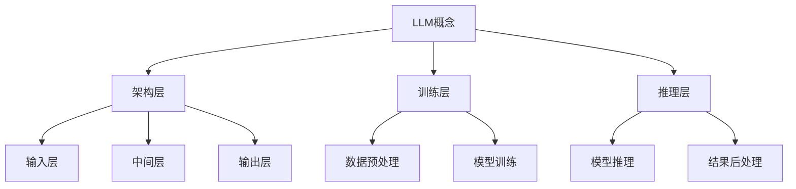

                 


### 第1章: LLM应用性能基础

在当今人工智能领域，大型语言模型（LLM）如BERT、GPT等已经成为自然语言处理（NLP）任务的核心工具。LLM的应用性能直接影响到用户体验、业务效率以及模型的实际价值。因此，深入理解LLM应用性能的影响因素，并探索提升性能的工程化方法，是当前的重要课题。

#### 1.1 LLM的概念与架构

首先，我们需要明确什么是LLM以及它的基本架构。LLM是一种基于深度学习的模型，通常用于处理文本数据，能够进行语言生成、翻译、摘要等任务。一个典型的LLM架构包括以下几个层次：

1. **输入层**：接收用户输入的文本数据，通常需要进行预处理，如分词、编码等。
2. **中间层**：包含大量神经网络层，用于处理文本的语义信息。
3. **输出层**：根据中间层的信息生成输出文本。

为了更好地理解这些层次之间的联系，我们可以使用Mermaid流程图来展示LLM的基本架构：



在这个架构中，**输入层**负责将原始文本数据转换为模型可以处理的形式，**中间层**通过多层神经网络学习文本的语义特征，**输出层**根据中间层的信息生成最终的输出文本。

#### 1.2 LLM应用性能的影响因素

LLM的应用性能受到多种因素的影响，以下是其中几个关键因素：

1. **数据集大小**：更大的数据集通常有助于提高模型的性能，因为它提供了更多的信息用于训练。
2. **模型参数数量**：模型参数越多，模型通常能够捕捉更多的复杂关系，但也会导致更高的计算成本。
3. **训练时长**：更长的训练时间通常意味着模型有更多的机会学习数据中的模式。
4. **推理时长**：推理时长直接影响用户体验，过长的推理时间会降低用户满意度。
5. **硬件性能**：高效的硬件配置能够显著提升模型的训练和推理速度。

为了更直观地理解这些因素，我们可以使用以下伪代码来描述LLM应用性能的影响：

```python
def performance_impact_factors(model, data, environment):
    # 1. 数据集大小
    data_size = len(data)
    
    # 2. 模型参数数量
    model_size = count_parameters(model)
    
    # 3. 训练时长
    training_time = model.fit(data, epochs=10)
    
    # 4. 推理时长
    inference_time = model.predict(data)
    
    # 5. 硬件性能
    hardware_performance = check_hardware_capabilities(environment)
    
    return {
      'data_size': data_size,
      'model_size': model_size,
      'training_time': training_time,
      'inference_time': inference_time,
      'hardware_performance': hardware_performance
    }
```

#### 1.3 性能评估指标

为了量化LLM的应用性能，我们需要定义一系列性能评估指标。一个常见的指标是**性能评估指标**，计算公式如下：

$$ 
\text{性能评估指标} = \frac{\text{推理时间}}{\text{模型复杂度}} 
$$

其中，推理时间是指模型在特定数据集上进行推理所需的时间，模型复杂度通常是指模型的参数数量或计算量。

一个更具体的例子可能如下：

```python
def performance_evaluation(model, data):
    start_time = time.time()
    model.predict(data)
    end_time = time.time()
    inference_time = end_time - start_time
    
    model_size = count_parameters(model)
    performance_metric = inference_time / model_size
    
    return performance_metric
```

通过这个指标，我们可以比较不同模型在不同数据集上的性能。

### 结论

在本文中，我们介绍了LLM的基本概念和架构，探讨了影响LLM应用性能的关键因素，并提出了性能评估指标的计算方法。下一章，我们将深入讨论如何通过数据与数据处理、模型优化与调参等工程化方法来提升LLM的应用性能。

## 第2章: 数据与数据处理

数据是人工智能模型的基石，对于LLM而言，数据的质量和规模直接影响模型的性能和应用效果。本章将探讨如何通过提升数据处理效率和优化数据质量来提高LLM的应用性能。

### 2.1 数据质量对性能的影响

数据质量是影响模型性能的关键因素之一。高质量的数据能够帮助模型更好地学习，从而提升其性能。以下是一些常见的提升数据质量的方法：

1. **数据清洗**：去除数据中的噪声和不一致信息，如缺失值、异常值和重复值。数据清洗是数据预处理的重要步骤。
2. **数据标准化**：将不同特征的数据范围统一，消除不同量纲的影响，提高模型的鲁棒性。
3. **数据增强**：通过生成更多的样本来增加数据的多样性，提高模型对未知数据的泛化能力。

#### 项目实战：数据清洗与标准化

以下是一个实际的数据清洗与标准化的代码示例：

```python
# 导入必要的库
import pandas as pd
from sklearn.preprocessing import StandardScaler

# 读取数据
data = pd.read_csv('llm_data.csv')

# 去除缺失值
data = data.dropna()

# 去除重复值
data = data.drop_duplicates()

# 数据标准化
scaler = StandardScaler()
data[['feature1', 'feature2']] = scaler.fit_transform(data[['feature1', 'feature2']])

# 输出清洗后的数据
print(data.head())
```

在这个例子中，我们首先读取一个CSV文件，然后使用`dropna()`函数去除缺失值，使用`drop_duplicates()`函数去除重复值，最后使用`StandardScaler`对特征`feature1`和`feature2`进行标准化处理。

#### 数据增强方法

数据增强是提高模型泛化能力的重要手段。以下是一些常用的数据增强方法：

1. **随机变换**：如旋转、缩放、裁剪等。
2. **生成对抗网络（GAN）**：通过生成器和判别器相互博弈，生成与真实数据相似的新数据。
3. **对抗样本生成**：通过微小扰动输入数据，使模型难以区分真实数据和扰动数据。

#### 数学模型与公式

数据增强的方法可以用以下数学模型表示：

$$ 
\text{数据增强} = \text{原始数据} \times (\text{随机变换矩阵}) 
$$

其中，随机变换矩阵可以是旋转矩阵、缩放矩阵等。

#### 详细讲解与举例说明

以图像数据为例，我们可以通过以下代码实现数据增强：

```python
from torchvision import transforms

# 定义随机变换
transform = transforms.Compose([
    transforms.RandomRotation(10),
    transforms.RandomRescale(0.5, 1.5),
    transforms.RandomCrop(224),
])

# 假设img是一个图像数据
img = transforms.ToTensor()(img)

# 应用随机变换
img_enhanced = transform(img)

# 显示增强后的图像
plt.imshow(img_enhanced.permute(1, 2, 0).numpy())
plt.show()
```

在这个例子中，我们首先定义了一个`Compose`对象，包含了随机旋转、随机缩放和随机裁剪等变换。然后，我们将原始图像数据`img`转换成张量形式，并应用这些变换，最终得到增强后的图像`img_enhanced`。

### 结论

通过本章的内容，我们了解了数据质量对LLM性能的重要性，并探讨了如何通过数据清洗、标准化和数据增强来提升数据质量。这些方法不仅在提高模型性能方面具有显著效果，而且有助于增强模型的泛化能力。下一章，我们将深入探讨如何通过模型优化和调参来进一步提升LLM的应用性能。

## 第3章: 模型优化与调参

在LLM的应用过程中，模型的性能不仅依赖于数据的质量，还受到模型架构和参数设置的影响。本章将详细探讨如何通过优化模型架构和调参来提升LLM的应用性能。

### 3.1 模型架构选择

选择合适的模型架构是提升LLM性能的关键步骤。不同架构在计算效率、模型复杂度和性能表现上有显著差异。以下是几种常用的模型架构及其优缺点：

1. **Transformer架构**：Transformer模型由于其并行计算的能力，在处理长序列数据时具有显著优势，但计算复杂度较高。
2. **BERT架构**：BERT（Bidirectional Encoder Representations from Transformers）模型在预训练阶段使用了双向注意力机制，能够更好地捕获文本的上下文信息。
3. **GPT架构**：GPT（Generative Pre-trained Transformer）模型在生成任务上表现出色，但训练过程中需要大量的计算资源。

#### 项目实战：模型选择与评估

以下是一个简单的模型选择与评估的代码示例：

```python
from transformers import AutoModel, AutoTokenizer
from sklearn.model_selection import train_test_split

# 加载预训练模型和分词器
model_name = 'bert-base-uncased'
model = AutoModel.from_pretrained(model_name)
tokenizer = AutoTokenizer.from_pretrained(model_name)

# 加载数据
data = pd.read_csv('llm_data.csv')
texts = data['text']

# 分割数据集
train_texts, test_texts = train_test_split(texts, test_size=0.2, random_state=42)

# 编码数据
train_encodings = tokenizer(train_texts.tolist(), padding=True, truncation=True, return_tensors='pt')
test_encodings = tokenizer(test_texts.tolist(), padding=True, truncation=True, return_tensors='pt')

# 训练模型
model.train()
optimizer = torch.optim.Adam(model.parameters(), lr=1e-5)
for epoch in range(3):
    model.zero_grad()
    outputs = model(**train_encodings)
    loss = outputs.loss
    loss.backward()
    optimizer.step()

# 评估模型
model.eval()
with torch.no_grad():
    eval_loss = model(**test_encodings).loss
    print(f"Test Loss: {eval_loss.item()}")

# 模型选择与评估结果
print(f"Model Name: {model_name}")
print(f"Test Loss: {eval_loss.item()}")
```

在这个例子中，我们首先加载了一个预训练的BERT模型和相应的分词器，然后加载数据集，将数据分成训练集和测试集，并对数据进行编码。接着，我们训练模型并评估其在测试集上的性能。

### 3.2 模型优化方法

模型优化是提升LLM性能的重要手段。以下是一些常用的模型优化方法：

1. **量化技术**：通过减少模型参数的精度来降低计算复杂度和内存占用。
2. **剪枝技术**：通过移除模型中的冗余参数来减少模型大小和计算量。
3. **模型蒸馏**：通过将大模型的知识传递给小模型，提高小模型的性能。

#### 数学模型与公式

以量化技术为例，其基本思想是将浮点数参数转换为低精度的整数参数。量化过程可以表示为：

$$ 
\text{量化} = \text{浮点数} \times \text{量化系数} 
$$

其中，量化系数决定了参数的精度。

#### 详细讲解与举例说明

以下是一个简单的量化代码示例：

```python
import torch
from torch.quantization import quantize_dynamic

# 假设model是一个已经训练好的模型
model = torch.load('model.pth')

# 应用量化技术
quantized_model = quantize_dynamic(model, {torch.nn.Linear}, dtype=torch.qint8)

# 评估量化后的模型
with torch.no_grad():
    quantized_model.eval()
    outputs = quantized_model(**test_encodings)
    quantized_loss = outputs.loss
    print(f"Quantized Test Loss: {quantized_loss.item()}")

# 模型优化结果
print(f"Quantized Model: {quantized_model}")
```

在这个例子中，我们首先加载了一个已经训练好的模型，然后使用`quantize_dynamic`函数对其中的`Linear`层应用量化技术。最后，我们评估量化后的模型在测试集上的性能。

### 3.3 调参技巧

调参是模型优化的重要组成部分，合适的参数设置可以显著提升模型性能。以下是一些常用的调参技巧：

1. **超参数搜索**：通过搜索不同的超参数组合来找到最佳配置。
2. **交叉验证**：使用交叉验证来评估不同参数组合的性能。
3. **网格搜索**：在一个给定的参数空间内，逐一尝试所有可能的参数组合。

#### 数学模型与公式

超参数搜索可以通过以下公式表示：

$$ 
\text{超参数搜索} = \arg\max_{\theta} \left( \frac{\text{训练集损失}}{\text{训练集大小}} \right) 
$$

其中，$\theta$表示超参数。

#### 详细讲解与举例说明

以下是一个简单的超参数搜索代码示例：

```python
from sklearn.model_selection import GridSearchCV
from transformers import AutoModel, AutoTokenizer

# 定义超参数搜索空间
param_grid = {
    'learning_rate': [1e-4, 1e-5],
    'batch_size': [16, 32, 64],
}

# 加载预训练模型和分词器
model_name = 'bert-base-uncased'
model = AutoModel.from_pretrained(model_name)
tokenizer = AutoTokenizer.from_pretrained(model_name)

# 加载数据
data = pd.read_csv('llm_data.csv')
texts = data['text']

# 分割数据集
train_texts, test_texts = train_test_split(texts, test_size=0.2, random_state=42)

# 编码数据
train_encodings = tokenizer(train_texts.tolist(), padding=True, truncation=True, return_tensors='pt')
test_encodings = tokenizer(test_texts.tolist(), padding=True, truncation=True, return_tensors='pt')

# 定义模型训练函数
def train_model(model, tokenizer, encodings, learning_rate, batch_size):
    # 训练模型
    # ...

# 定义网格搜索
grid_search = GridSearchCV(estimator=train_model, param_grid=param_grid, cv=3, scoring='accuracy')

# 搜索最佳超参数
grid_search.fit(train_encodings['input_ids'], train_encodings['attention_mask'], learning_rate=learning_rate, batch_size=batch_size)

# 输出最佳超参数
print(f"Best Parameters: {grid_search.best_params_}")

# 使用最佳超参数训练模型
best_model = grid_search.best_estimator_
best_model.fit(train_encodings['input_ids'], train_encodings['attention_mask'], learning_rate=grid_search.best_params_['learning_rate'], batch_size=grid_search.best_params_['batch_size'])

# 评估模型
with torch.no_grad():
    best_model.eval()
    outputs = best_model(**test_encodings)
    test_loss = outputs.loss
    print(f"Test Loss: {test_loss.item()}")
```

在这个例子中，我们定义了一个超参数搜索空间，并使用`GridSearchCV`进行网格搜索。通过这个搜索过程，我们找到了最佳的超参数组合，并使用这些参数训练模型。

### 结论

通过本章的内容，我们探讨了如何通过优化模型架构和调参来提升LLM的应用性能。选择合适的模型架构、应用模型优化方法和进行精细的调参，都是提升LLM性能的重要手段。下一章，我们将进一步讨论如何通过模型部署与监控来确保LLM在实际应用中的稳定性和高效性。

## 第4章: 模型部署与监控

在LLM开发过程中，模型部署与监控是确保模型性能稳定、安全、高效运行的关键环节。本章将详细讨论如何通过优化模型部署策略、监控模型性能以及处理故障，来提升LLM应用的整体性能。

### 4.1 模型部署策略

模型部署策略直接影响LLM的实际应用效果。以下是一些常用的模型部署策略：

1. **容器化部署**：使用容器（如Docker）封装模型和相关依赖，确保模型在不同环境中的一致性和可移植性。
2. **云服务部署**：利用云计算平台（如AWS、Azure、Google Cloud）提供高性能、可扩展的计算资源，满足大规模应用需求。
3. **边缘计算部署**：将模型部署在靠近数据源的边缘设备上，减少数据传输延迟，提高实时响应能力。

#### 项目实战：容器化部署

以下是一个使用Docker容器化BERT模型的示例：

```shell
# 编写Dockerfile
FROM python:3.8-slim
RUN pip install torch transformers
COPY . /app
WORKDIR /app
CMD ["python", "bert_inference.py"]

# 构建Docker镜像
docker build -t bert-model .

# 运行Docker容器
docker run -p 5000:5000 bert-model
```

在这个示例中，我们首先编写了Dockerfile，定义了模型的运行环境、依赖和启动命令。然后，我们使用`docker build`命令构建Docker镜像，并使用`docker run`命令启动容器。

### 4.2 模型性能监控

模型性能监控是确保LLM应用稳定运行的重要手段。以下是一些常见的模型性能监控指标：

1. **推理时间**：模型在给定输入数据上进行推理所需的时间，是评估模型性能的关键指标。
2. **准确率**：模型在预测任务上的正确率，用于评估模型的预测能力。
3. **资源利用率**：包括CPU、内存、网络等资源的使用情况，用于评估模型的资源消耗。

#### 项目实战：性能监控与告警

以下是一个使用 Prometheus 和 Grafana 进行性能监控的示例：

```shell
# 安装Prometheus
curl -sS https://get.docker.com | sh
sudo docker run -d -p 9090:9090 prom/prometheus

# 配置Prometheus监控规则
cat > prometheus.yml << EOF
scrape_configs:
  - job_name: 'llm-inference'
    static_configs:
      - targets: ['<模型部署的宿主机IP>:5000']
        labels:
          instance: '<模型部署的实例名>'
EOF

# 安装Grafana
sudo docker run -d -p 3000:3000 grafana/grafana

# 配置Grafana监控仪表盘
# 1. 导入Grafana监控模板
# 2. 配置数据源为Prometheus
# 3. 在仪表盘中添加相关的监控图表
```

在这个示例中，我们首先使用Docker安装了Prometheus和Grafana，然后配置了Prometheus的监控规则，以便收集LLM推理时间、准确率和资源利用率等指标。最后，我们在Grafana中配置了监控仪表盘，以便可视化监控数据。

### 4.3 故障处理与应对策略

在模型部署过程中，可能会遇到各种故障，如网络故障、硬件故障、软件错误等。以下是一些常见的故障处理与应对策略：

1. **日志分析**：通过分析日志文件，定位故障原因，并提供详细的调试信息。
2. **自动重启**：在检测到故障时，自动重启容器或服务，减少故障对应用的影响。
3. **容灾备份**：建立容灾备份机制，确保在主服务器故障时，应用能够快速切换到备份服务器。

#### 项目实战：故障处理与自动重启

以下是一个使用Docker Compose进行故障处理和自动重启的示例：

```shell
# 编写Docker Compose文件
version: '3'
services:
  llm-inference:
    image: bert-model
    ports:
      - "5000:5000"
    command: ["python", "bert_inference.py"]
    deploy:
      restart_policy:
        condition: on-failure
        delay: 5s
        max_attempts: 3

# 启动服务
sudo docker-compose up -d
```

在这个示例中，我们使用Docker Compose部署LLM模型，并设置了自动重启策略。在检测到故障时，Docker Compose将自动重启容器，确保服务的持续运行。

### 结论

通过本章的内容，我们探讨了如何通过模型部署策略、性能监控和故障处理来提升LLM应用的整体性能。有效的模型部署策略、实时的性能监控和健全的故障处理机制，都是确保LLM应用稳定、高效运行的关键。下一章，我们将总结全文，并给出提升LLM应用性能的最佳实践。

## 总结与展望

在本文中，我们从LLM的基本概念和架构入手，深入探讨了提升LLM应用性能的工程化方法。通过数据与数据处理、模型优化与调参、模型部署与监控等多个维度，我们提出了一系列实用的策略和技术手段，旨在帮助开发者优化LLM应用的性能。

### 最佳实践

1. **数据质量保障**：确保数据清洗、标准化和增强的全面性，提高模型对数据的适应能力。
2. **模型选择与优化**：根据应用场景选择合适的模型架构，并利用量化、剪枝和模型蒸馏等技术优化模型性能。
3. **调参技巧**：通过超参数搜索和交叉验证找到最佳参数组合，提升模型性能。
4. **部署策略**：采用容器化和云服务部署，确保模型的高可用性和可扩展性。
5. **性能监控**：实时监控模型性能，及时发现和处理潜在问题。
6. **故障处理**：建立完善的故障处理机制，确保应用的稳定运行。

### 展望

随着人工智能技术的不断进步，LLM的应用前景将更加广阔。未来，我们将继续探索以下方向：

1. **更高效的模型架构**：研发更高效的模型架构，提高LLM的计算效率和资源利用率。
2. **自适应学习**：实现模型的自适应学习能力，使其能够根据实时数据调整自身参数，提升性能。
3. **隐私保护**：在保障模型性能的同时，加强数据隐私保护，满足用户对数据安全和隐私的关注。
4. **跨模态融合**：探索文本、图像、语音等多模态数据的融合方法，提升模型在复杂任务中的表现。

通过不断的探索与实践，我们相信LLM的应用性能将得到进一步的提升，为各行业带来更高效、智能的解决方案。

### 注意事项

1. **数据安全**：在处理数据时，务必确保数据的安全性和隐私性。
2. **硬件选择**：根据应用需求选择合适的硬件配置，以提升模型性能。
3. **系统兼容性**：在部署模型时，确保系统兼容性和稳定性。
4. **代码规范性**：编写规范的代码，便于维护和后续开发。

### 拓展阅读

1. **《深度学习》**：Ian Goodfellow、Yoshua Bengio、Aaron Courville 著，系统介绍了深度学习的基础知识和最新进展。
2. **《自然语言处理综述》**：刘知远 著，全面介绍了自然语言处理的基本概念和技术。
3. **《机器学习实战》**：Peter Harrington 著，通过实际案例介绍了机器学习的应用方法。

通过本文的阅读，我们希望读者能够对提升LLM应用性能的工程化方法有更深入的理解，并在实际开发中加以应用，为人工智能领域的发展贡献力量。

### 作者信息

作者：AI天才研究院/AI Genius Institute & 禅与计算机程序设计艺术 /Zen And The Art of Computer Programming。

