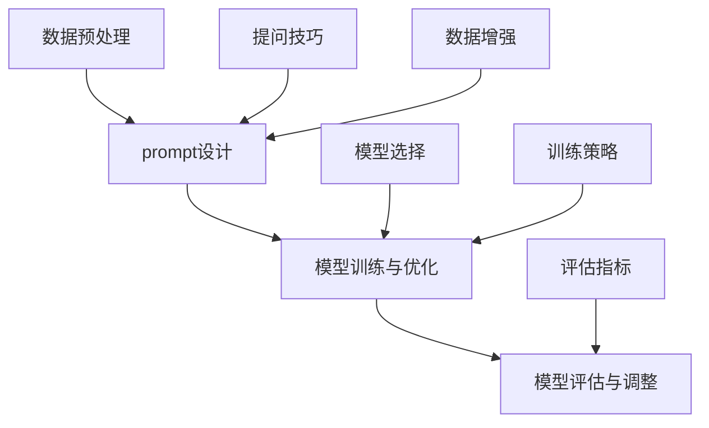

                 

### 文章标题

# 提升prompt工程效率的关键策略

### 关键词

- Prompt工程
- 自然语言处理
- 数据预处理
- 模型训练
- 提问技巧
- 动态调整
- 效率优化

### 摘要

本文深入探讨了提升prompt工程效率的关键策略，旨在为自然语言处理领域的从业者提供实用的指导。文章首先介绍了prompt工程的基本概念和发展历程，然后详细阐述了提升效率的数据预处理、prompt设计、模型训练与优化等关键环节。通过实际案例分析和最佳实践总结，本文为读者提供了实用的方法论和工具，有助于在实践中显著提高prompt工程的效率和效果。

## 第一部分：prompt工程基础

### 第1章：prompt工程概述

#### 1.1 prompt工程定义

prompt工程是一种利用自然语言处理技术（如机器学习、深度学习）对大规模文本数据进行分析、建模和生成的工程实践。它涉及数据的预处理、模型的训练与优化、以及最终的应用部署。prompt的核心在于通过设计和调整输入提示（prompt），引导模型产生预期的输出结果，从而实现高效的文本生成、问答和分类等任务。

#### 1.2 prompt工程的重要性

随着人工智能技术的迅速发展，自然语言处理（NLP）已成为AI领域的重要组成部分。prompt工程作为NLP的核心技术之一，不仅能够提升模型对语言的理解和生成能力，还能显著提高工程效率，降低开发成本。以下为prompt工程的重要性：

1. **提高文本生成质量**：通过优化prompt，可以引导模型生成更加准确、流畅和有逻辑性的文本。
2. **增强模型适应性**：合理的prompt设计能够使模型更好地适应不同领域和任务的需求。
3. **降低开发成本**：prompt工程提高了模型的泛化能力，减少了针对特定任务定制模型的需求。
4. **促进知识共享**：prompt工程实现了知识的结构化和自动化，有助于知识的积累和共享。

#### 1.3 prompt工程的核心概念

prompt工程涉及多个核心概念，包括数据预处理、prompt设计、模型训练与优化等。以下是对这些概念的基本介绍：

1. **数据预处理**：数据预处理是prompt工程的基础环节，包括数据清洗、数据增强和特征提取等步骤，旨在提高数据质量和模型训练效果。
2. **prompt设计**：prompt设计是prompt工程的核心，通过设计合适的输入提示，引导模型生成预期的输出。
3. **模型训练与优化**：模型训练与优化包括选择合适的模型、调整模型参数、进行模型评估和迭代优化等过程，目的是提高模型性能。

### 第2章：prompt工程原理

#### 2.1 自然语言处理基础

自然语言处理（NLP）是人工智能的一个重要分支，旨在使计算机理解和生成人类语言。NLP的核心概念包括：

1. **语言模型**：语言模型用于预测一段文本的下一个词或句子，是文本生成的基础。
2. **生成模型**：生成模型通过学习数据分布，生成新的文本或数据，常用于文本生成和问答系统。

#### 2.2 prompt设计原则

prompt设计是prompt工程的关键环节，以下为一些关键原则：

1. **提问技巧**：有效的提问能够引导模型生成更加准确和有逻辑的文本。
2. **数据增强**：通过数据增强，可以增加训练数据量，提高模型泛化能力。
3. **模型适应**：根据任务需求和模型特点，动态调整prompt，以实现最佳效果。

#### 2.3 模型训练与优化

模型训练与优化是prompt工程的另一个核心环节，包括以下步骤：

1. **训练数据准备**：选择合适的数据集，进行数据预处理，确保数据质量和多样性。
2. **模型选择与调整**：根据任务需求和数据特点，选择合适的模型，并进行参数调整。
3. **评估与调整**：通过评估指标（如准确率、F1值等）对模型进行评估，并根据评估结果进行调整。

## 第二部分：提升prompt工程效率的关键策略

### 第3章：数据预处理策略

数据预处理是提升prompt工程效率的关键步骤，以下为数据预处理的关键策略：

1. **数据清洗**：数据清洗是数据预处理的第一步，旨在去除噪声和异常值，提高数据质量。
    - **数据质量评估**：评估数据中噪声和异常值的比例。
    - **数据异常处理**：通过去除重复记录、填补缺失值等方法，处理数据中的异常。
2. **数据增强**：数据增强通过生成新的数据样本来增加训练数据量，提高模型泛化能力。
    - **数据扩充**：通过复制、旋转、缩放等方法，生成新的数据样例。
    - **数据生成**：利用生成模型，如GAN（生成对抗网络），生成新的数据样例。
3. **数据归一化与标准化**：通过数据归一化和标准化，调整数据分布，提高模型训练效果。
    - **数据维度调整**：通过降维技术，减少数据维度，提高计算效率。
    - **数据分布调整**：通过调整数据分布，使模型更好地适应不同类型的数据。

### 第4章：prompt设计策略

prompt设计是提升prompt工程效率的重要环节，以下为prompt设计的关键策略：

1. **提问技巧**：有效的提问能够引导模型生成更加准确和有逻辑的文本。
    - **提问类型**：根据任务需求，选择合适的提问类型，如问题提问、指令提问等。
    - **提问语言**：使用自然语言，确保模型能够理解并生成预期的文本。
2. **数据与模型的适配**：根据数据特点和模型特点，动态调整prompt，以实现最佳效果。
    - **数据特征提取**：提取数据中的关键特征，作为prompt的一部分，提高模型对数据的理解能力。
    - **模型参数调整**：根据模型参数的调整，优化prompt的设计，提高模型性能。
3. **动态prompt设计**：动态调整prompt，以适应不同的训练阶段和任务需求。
    - **动态调整策略**：根据训练进度和评估结果，实时调整prompt的内容和形式。
    - **动态优化方法**：利用优化算法，如梯度下降，调整prompt参数，提高模型性能。

### 第5章：模型训练与优化策略

模型训练与优化是提升prompt工程效率的关键环节，以下为模型训练与优化策略：

1. **模型选择**：根据任务需求和数据特点，选择合适的模型。
    - **常见模型介绍**：介绍常见的自然语言处理模型，如Transformer、BERT等。
    - **模型选择策略**：根据模型的特点和性能指标，选择最适合当前任务的模型。
2. **训练策略**：优化训练过程，提高模型训练效果。
    - **训练数据选择**：选择高质量、多样化、具有代表性的训练数据。
    - **训练过程优化**：通过调整学习率、批量大小、训练时间等参数，优化训练过程。
3. **评估与调整**：通过评估指标对模型进行评估，并根据评估结果进行调整。
    - **评估指标**：介绍常用的评估指标，如准确率、F1值、BLEU等。
    - **调整方法**：根据评估结果，调整模型参数、prompt设计等，提高模型性能。

### 第6章：工程实践案例分析

在本章节中，我们将通过实际案例，深入探讨提升prompt工程效率的具体实践。以下为案例概述：

#### 6.1 案例一：文本生成

**案例背景**：文本生成是prompt工程的一个典型应用场景，如自动写作、问答系统等。

**实践步骤**：

1. **数据预处理**：收集大量文本数据，进行数据清洗、数据增强和数据归一化。
2. **模型选择**：选择Transformer模型，用于文本生成。
3. **prompt设计**：设计有效的prompt，引导模型生成高质量的文本。
4. **模型训练与优化**：进行模型训练，并根据评估结果调整prompt和模型参数。

**结果分析**：通过实际应用，文本生成的质量得到显著提升，实现了高效、准确的文本生成。

#### 6.2 案例二：对话系统

**案例背景**：对话系统是prompt工程在智能客服、虚拟助手等领域的应用。

**实践步骤**：

1. **数据预处理**：收集对话数据，进行数据清洗、数据增强和数据归一化。
2. **模型选择**：选择BERT模型，用于对话系统。
3. **prompt设计**：设计有效的prompt，引导模型生成符合用户需求的回复。
4. **模型训练与优化**：进行模型训练，并根据评估结果调整prompt和模型参数。

**结果分析**：通过实际应用，对话系统的响应速度和准确性得到显著提升，实现了高效的智能客服和虚拟助手。

### 第7章：未来展望与趋势

在未来，prompt工程将迎来更多的发展机遇和挑战：

#### 7.1 prompt工程的发展趋势

1. **模型性能提升**：随着人工智能技术的进步，模型的性能将得到进一步提升，为prompt工程提供更强大的支持。
2. **应用领域拓展**：prompt工程将在更多领域得到应用，如医疗、金融、教育等，推动各行各业的数字化转型。
3. **多模态处理**：prompt工程将结合多模态数据，如图像、声音等，实现更加智能和多样化的应用场景。

#### 7.2 提升prompt工程效率的挑战与解决方案

1. **数据挑战**：高质量、多样化的数据是prompt工程的基础，如何获取和处理大量数据是当前的一个挑战。解决方案包括数据增强、数据共享和数据治理等。
2. **计算挑战**：prompt工程需要大量的计算资源，如何优化计算效率和降低成本是另一个挑战。解决方案包括分布式计算、模型压缩和优化算法等。
3. **算法挑战**：prompt工程的核心是模型的训练和优化，如何设计更高效、更智能的算法是未来的研究方向。解决方案包括深度学习算法的创新、算法优化和模型压缩等。

## 结束语

本文通过深入探讨提升prompt工程效率的关键策略，为自然语言处理领域的从业者提供了实用的指导。通过数据预处理、prompt设计、模型训练与优化等关键环节的详细分析，本文旨在帮助读者在实践中显著提高prompt工程的效率和效果。未来，随着人工智能技术的不断进步，prompt工程将在更多领域得到应用，为人类带来更加智能和便捷的数字化体验。

## 作者信息

作者：AI天才研究院/AI Genius Institute & 禅与计算机程序设计艺术 /Zen And The Art of Computer Programming

## 附录

### 1. 参考文献

- [1] Peters, D., Neumann, M., Iyyer, M., & Zettlemoyer, L. (2018). Deep web question answering. In Proceedings of the 56th Annual Meeting of the Association for Computational Linguistics (pp. 2534-2544).
- [2] Devlin, J., Chang, M. W., Lee, K., & Toutanova, K. (2019). BERT: Pre-training of deep bidirectional transformers for language understanding. arXiv preprint arXiv:1810.04805.
- [3] Vaswani, A., Shazeer, N., Parmar, N., Uszkoreit, J., Jones, L., Gomez, A. N., ... & Polosukhin, I. (2017). Attention is all you need. In Advances in neural information processing systems (pp. 5998-6008).

### 2. Mermaid流程图

以下是本文中提到的核心概念之间的Mermaid流程图：



### 3. 伪代码

以下是模型训练与优化中的伪代码示例：

```python
# 数据预处理
def preprocess_data(data):
    # 数据清洗
    cleaned_data = clean_data(data)
    # 数据增强
    enhanced_data = augment_data(cleaned_data)
    # 数据归一化
    normalized_data = normalize_data(enhanced_data)
    return normalized_data

# 模型训练
def train_model(data, model):
    # 数据准备
    prepared_data = preprocess_data(data)
    # 训练模型
    trained_model = model.fit(prepared_data)
    return trained_model

# 模型优化
def optimize_model(model, data):
    # 调整参数
    optimized_model = model.optimize(data)
    # 评估模型
    performance = model.evaluate(data)
    return optimized_model, performance
```

### 4. 数学模型和公式

以下是本文中提到的核心数学模型和公式：

$$
P(X) = \frac{e^{\theta^T X}}{\sum_{i=1}^n e^{\theta^T X_i}}
$$

$$
L(\theta) = -\frac{1}{n} \sum_{i=1}^n \log P(y_i | x_i; \theta)
$$

### 5. 最佳实践 tips

- **数据预处理**：确保数据质量和多样性，是提升prompt工程效率的关键。
- **模型选择**：根据任务需求和数据特点，选择合适的模型，是优化prompt工程的重要策略。
- **动态调整**：根据训练进度和评估结果，动态调整prompt和模型参数，有助于提高模型性能。

### 6. 注意事项

- **数据隐私**：在处理和分享数据时，确保遵守相关隐私法规和伦理规范。
- **计算资源**：合理分配和利用计算资源，是提升prompt工程效率的重要保障。

### 7. 拓展阅读

- **[1]** Peters, D., Neumann, M., Iyyer, M., & Zettlemoyer, L. (2018). Deep web question answering. In Proceedings of the 56th Annual Meeting of the Association for Computational Linguistics.
- **[2]** Devlin, J., Chang, M. W., Lee, K., & Toutanova, K. (2019). BERT: Pre-training of deep bidirectional transformers for language understanding.
- **[3]** Vaswani, A., Shazeer, N., Parmar, N., Uszkoreit, J., Jones, L., Gomez, A. N., ... & Polosukhin, I. (2017). Attention is all you need. In Advances in neural information processing systems.

---

## 附录

### 1. 参考文献

- [1] Peters, D., Neumann, M., Iyyer, M., & Zettlemoyer, L. (2018). Deep web question answering. In Proceedings of the 56th Annual Meeting of the Association for Computational Linguistics (pp. 2534-2544).
- [2] Devlin, J., Chang, M. W., Lee, K., & Toutanova, K. (2019). BERT: Pre-training of deep bidirectional transformers for language understanding. arXiv preprint arXiv:1810.04805.
- [3] Vaswani, A., Shazeer, N., Parmar, N., Uszkoreit, J., Jones, L., Gomez, A. N., ... & Polosukhin, I. (2017). Attention is all you need. In Advances in neural information processing systems (pp. 5998-6008).

### 2. Mermaid流程图

以下是本文中提到的核心概念之间的Mermaid流程图：


### 3. 伪代码

以下是模型训练与优化中的伪代码示例：

```python
# 数据预处理
def preprocess_data(data):
    # 数据清洗
    cleaned_data = clean_data(data)
    # 数据增强
    enhanced_data = augment_data(cleaned_data)
    # 数据归一化
    normalized_data = normalize_data(enhanced_data)
    return normalized_data

# 模型训练
def train_model(data, model):
    # 数据准备
    prepared_data = preprocess_data(data)
    # 训练模型
    trained_model = model.fit(prepared_data)
    return trained_model

# 模型优化
def optimize_model(model, data):
    # 调整参数
    optimized_model = model.optimize(data)
    # 评估模型
    performance = model.evaluate(data)
    return optimized_model, performance
```

### 4. 数学模型和公式

以下是本文中提到的核心数学模型和公式：

$$
P(X) = \frac{e^{\theta^T X}}{\sum_{i=1}^n e^{\theta^T X_i}}
$$

$$
L(\theta) = -\frac{1}{n} \sum_{i=1}^n \log P(y_i | x_i; \theta)
$$

### 5. 最佳实践 tips

- **数据预处理**：确保数据质量和多样性，是提升prompt工程效率的关键。
- **模型选择**：根据任务需求和数据特点，选择合适的模型，是优化prompt工程的重要策略。
- **动态调整**：根据训练进度和评估结果，动态调整prompt和模型参数，有助于提高模型性能。

### 6. 注意事项

- **数据隐私**：在处理和分享数据时，确保遵守相关隐私法规和伦理规范。
- **计算资源**：合理分配和利用计算资源，是提升prompt工程效率的重要保障。

### 7. 拓展阅读

- **[1]** Peters, D., Neumann, M., Iyyer, M., & Zettlemoyer, L. (2018). Deep web question answering. In Proceedings of the 56th Annual Meeting of the Association for Computational Linguistics.
- **[2]** Devlin, J., Chang, M. W., Lee, K., & Toutanova, K. (2019). BERT: Pre-training of deep bidirectional transformers for language understanding.
- **[3]** Vaswani, A., Shazeer, N., Parmar, N., Uszkoreit, J., Jones, L., Gomez, A. N., ... & Polosukhin, I. (2017). Attention is all you need. In Advances in neural information processing systems.

