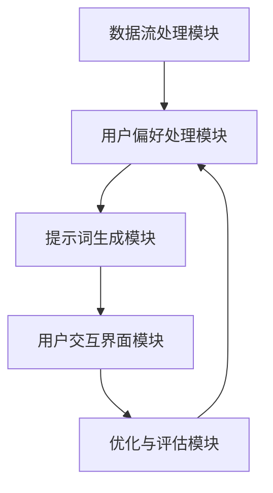

                 


# 文章标题：提示词个性化：适应个别用户偏好

## 关键词：
- 提示词个性化
- 用户偏好模型
- 机器学习
- 深度学习
- 应用场景
- 挑战与未来方向

### 摘要：
本文将探讨提示词个性化技术，通过构建用户偏好模型，实现适应个别用户偏好的提示词生成。文章首先介绍了提示词个性化的重要性，接着详细分析了用户偏好模型的构建过程，包括数据收集、预处理、特征提取与编码，以及模型评估与优化。随后，文章讨论了提示词生成技术，涵盖了基于规则、统计、机器学习和深度学习的方法，并提出了提示词优化的策略。文章随后展示了个性化提示词系统设计与实现，包括系统架构设计、实现细节和系统部署与运维。最后，文章通过实际案例，展示了个性化提示词在不同应用场景中的效果，并探讨了系统面临的挑战与未来研究方向。通过本文的阅读，读者将深入了解提示词个性化技术，并能够在实际项目中应用。

## 引言与背景

提示词个性化技术在现代信息社会中扮演着越来越重要的角色。随着互联网的普及和大数据技术的发展，人们获取信息的渠道变得多样化，信息过载问题也随之而来。为了解决这一问题，个性化推荐系统应运而生。其中，提示词个性化成为了一个关键的研究方向，其目的是根据用户的偏好和兴趣，生成定制化的提示词，从而提高用户的互动体验和满意度。

### 提示词个性化的重要性

提示词个性化的重要性体现在多个方面。首先，它能够显著提高用户体验。当用户在社交媒体、电商平台、在线教育等场景中，能够看到与自己兴趣相关的信息时，会感到更加舒适和满足。这种个性化的提示词推荐能够减少用户的搜索时间和精力，提升用户对服务的满意度。其次，提示词个性化有助于提升服务提供商的运营效率。通过精准的提示词推荐，服务提供商能够更好地吸引和留住用户，提高用户留存率和转化率。最后，提示词个性化还能够促进内容创作者的创作热情。当创作者能够看到自己的内容被特定用户群体所喜爱时，会激发他们的创作灵感，从而生产出更多高质量的内容。

### 用户偏好与个性化服务的关系

用户偏好是指用户在特定环境下，对于某种产品、服务或信息所持有的喜好和倾向。个性化服务则是根据用户偏好，提供定制化的信息、产品或服务。用户偏好与个性化服务之间存在密切的关系。用户偏好是个性化服务的基础，只有深入了解用户的需求和喜好，才能提供真正符合用户期望的服务。而个性化服务则是对用户偏好的回应，通过精确的推荐和定制，满足用户的个性化需求。

### 书籍的目的与结构

本书旨在系统地介绍提示词个性化技术，帮助读者理解和掌握这一领域的基本概念、核心技术与应用。全书共分为七个章节：

- **第1章**：引言与背景，介绍提示词个性化的重要性、用户偏好与个性化服务的关系，以及本书的目的和结构。
- **第2章**：用户偏好模型，讨论用户偏好的定义、收集与处理方法，以及用户偏好模型的构建与优化。
- **第3章**：提示词生成技术，介绍提示词生成的方法和优化策略。
- **第4章**：个别化提示词系统设计与实现，介绍个性化提示词系统的架构设计和实现细节。
- **第5章**：实际案例与应用场景，通过实际案例展示个性化提示词在不同场景中的应用效果。
- **第6章**：个性化提示词系统挑战与未来方向，探讨个性化提示词系统面临的挑战和未来的研究方向。
- **第7章**：结论，总结本书的内容，并对未来研究提出展望。

通过本书的学习，读者将能够全面了解提示词个性化技术的核心概念、方法和应用，为在实际项目中应用这一技术打下坚实的基础。

## 用户偏好模型

用户偏好模型是提示词个性化技术的核心组成部分。它通过对用户行为数据的分析，提取用户的偏好特征，构建出能够反映用户兴趣的模型。本章将详细讨论用户偏好的定义、收集与处理方法，以及用户偏好模型的构建和优化。

### 用户偏好定义与分类

用户偏好是指用户在特定环境下，对于某种产品、服务或信息所持有的喜好和倾向。这些偏好可以基于用户的兴趣、历史行为、社交关系等多种因素。根据不同的分类标准，用户偏好可以划分为以下几类：

1. **兴趣偏好**：基于用户的兴趣，如对某一特定领域的文章、音乐、视频等内容的喜好。
2. **行为偏好**：基于用户的历史行为，如经常浏览的网页、购买的商品、观看的视频等。
3. **社交偏好**：基于用户的社交关系，如朋友、家人的推荐、参与的话题等。
4. **情境偏好**：基于用户的当前情境，如工作、学习、休息等不同情境下对信息的需求。

### 用户偏好收集与处理

用户偏好收集是构建用户偏好模型的基础。以下是用户偏好收集与处理的主要步骤：

#### 数据来源

用户偏好的数据来源主要包括：

- **用户行为数据**：如浏览记录、购买记录、评论、点赞等。
- **用户主动反馈**：如问卷调查、评分、评论等。
- **社交网络数据**：如好友关系、参与的话题、分享的内容等。
- **环境感知数据**：如地理位置、天气信息等。

#### 数据预处理

数据预处理是用户偏好模型构建的重要环节。主要任务包括：

- **数据清洗**：去除重复数据、缺失值填充、异常值处理等。
- **数据归一化**：将不同数据类型和量级的数据进行标准化处理，便于后续分析和建模。
- **数据转换**：如将类别数据转换为数值数据，将文本数据转换为词向量等。

#### 特征提取与编码

特征提取与编码是将原始数据转换为能够反映用户偏好的特征表示。主要方法包括：

- **频率统计**：统计用户在特定领域或行为上的出现频率，如浏览网页的次数、购买商品的种类等。
- **词袋模型**：将文本数据转换为词袋模型，通过词频或TF-IDF等方法表示文本特征。
- **主题模型**：如LDA（Latent Dirichlet Allocation），用于发现文本中的隐含主题。
- **情感分析**：通过情感分析技术，提取用户文本中的情感倾向，如正面、负面等。

#### 用户偏好模型构建

用户偏好模型的构建是通过对特征数据进行机器学习或深度学习算法的训练，生成能够预测用户偏好的模型。主要方法包括：

- **基于传统机器学习的用户偏好模型**：如逻辑回归、决策树、K近邻等算法。
- **基于深度学习的用户偏好模型**：如卷积神经网络（CNN）、循环神经网络（RNN）、长短期记忆网络（LSTM）等。

#### 用户偏好模型评估与优化

用户偏好模型的评估与优化是确保模型性能的重要步骤。主要方法包括：

- **评估指标**：如准确率、召回率、F1值等，用于评估模型对用户偏好的预测能力。
- **交叉验证**：通过交叉验证方法，评估模型在不同数据集上的性能，避免过拟合。
- **超参数调优**：通过调整模型的超参数，如学习率、隐藏层节点数等，优化模型性能。
- **集成学习**：如随机森林、梯度提升树等集成学习方法，提高模型的预测性能。

通过以上步骤，用户偏好模型能够有效地从数据中提取用户的偏好特征，为提示词个性化提供坚实的基础。接下来，本章将讨论提示词生成技术，进一步探索如何利用用户偏好模型生成个性化的提示词。

## 提示词生成技术

提示词生成技术是提示词个性化系统的核心组成部分，其目标是根据用户的偏好和兴趣，生成具有针对性的提示词，从而提高用户的互动体验和满意度。本章将详细介绍提示词生成的方法和优化策略，包括基于规则的方法、基于统计的方法、基于机器学习的方法和基于深度学习的方法，以及提示词优化的策略。

### 提示词生成概述

提示词生成技术主要分为以下几类：

- **基于规则的方法**：通过定义一系列规则，根据用户的行为和历史数据生成提示词。
- **基于统计的方法**：通过对用户行为数据的统计分析，生成提示词。
- **基于机器学习的方法**：利用机器学习算法，从用户行为数据中学习生成提示词的规律。
- **基于深度学习的方法**：利用深度学习算法，从大量数据中自动提取特征并生成提示词。

每种方法都有其优势和局限性，需要根据具体应用场景进行选择和优化。

### 提示词生成方法

#### 基于规则的方法

基于规则的方法是最简单和直观的提示词生成方法。它通过定义一系列规则，将用户的行为和历史数据映射为提示词。例如，在社交媒体平台上，可以根据用户点赞、评论、分享的行为，生成相应的提示词。

- **优势**：实现简单，易于理解和维护。
- **劣势**：灵活性较差，难以处理复杂的关系和动态变化。

#### 基于统计的方法

基于统计的方法通过对用户行为数据的统计分析，生成提示词。例如，可以使用频次统计、关联规则挖掘等方法，提取用户兴趣点，生成相应的提示词。

- **优势**：计算简单，适用于大规模数据。
- **劣势**：生成的提示词可能不够个性化，难以应对用户的动态变化。

#### 基于机器学习的方法

基于机器学习的方法通过训练模型，从用户行为数据中学习生成提示词的规律。常见的机器学习算法包括逻辑回归、决策树、K近邻等。

- **优势**：具有较高的预测性能，能够处理复杂的用户行为数据。
- **劣势**：模型训练和优化需要大量的数据和计算资源。

#### 基于深度学习的方法

基于深度学习的方法利用深度学习算法，从大量数据中自动提取特征并生成提示词。常见的深度学习算法包括卷积神经网络（CNN）、循环神经网络（RNN）、长短期记忆网络（LSTM）等。

- **优势**：能够自动提取高维特征，适用于大规模和复杂的数据。
- **劣势**：模型训练和优化需要大量的数据和计算资源，实现难度较高。

### 提示词优化策略

为了提高提示词的个性化和准确度，需要采用多种优化策略。以下是几种常见的提示词优化策略：

#### 生成式优化

生成式优化通过生成新的提示词来优化现有提示词集合。例如，可以使用生成对抗网络（GAN）生成新的用户兴趣点，并将其与现有兴趣点结合，生成新的提示词。

- **优势**：能够生成全新的、个性化的提示词。
- **劣势**：需要大量的计算资源，且生成效果受数据质量和算法设计影响。

#### 搜索式优化

搜索式优化通过在现有提示词集合中搜索最优的提示词，提高提示词的准确性。例如，可以使用遗传算法、模拟退火算法等，在提示词空间中搜索最优解。

- **优势**：计算复杂度较低，易于实现。
- **劣势**：搜索结果受初始条件和算法设计影响，可能存在局部最优解。

#### 对比式优化

对比式优化通过对比不同提示词的效果，选择最优的提示词。例如，可以使用A/B测试方法，比较不同提示词对用户行为的影响，选择效果最佳的提示词。

- **优势**：能够直接评估提示词效果，提高优化精度。
- **劣势**：需要大量的用户数据，且测试过程可能影响用户体验。

通过以上优化策略，可以进一步提高提示词的个性化和准确性，满足不同用户的需求。接下来，本章将讨论个别化提示词系统设计与实现，介绍如何将提示词生成技术应用于实际系统中。

## 个别化提示词系统设计与实现

个性化提示词系统旨在根据用户的偏好和兴趣，生成符合其需求的提示词，从而提高用户的互动体验和满意度。本节将介绍个别化提示词系统的设计与实现，包括系统架构设计、实现细节、系统性能优化以及系统部署与运维。

### 系统架构设计

个性化提示词系统的架构设计应考虑模块化、可扩展性和高可用性。以下是系统的主要模块及其功能：

1. **数据流处理模块**：负责收集、存储和处理用户行为数据，包括浏览记录、购买记录、评论、点赞等。
2. **用户偏好处理模块**：基于用户行为数据，构建用户偏好模型，提取用户的兴趣特征。
3. **提示词生成模块**：根据用户偏好模型和提示词生成技术，生成个性化的提示词。
4. **用户交互界面模块**：提供用户与系统的交互界面，展示个性化提示词，并收集用户反馈。
5. **优化与评估模块**：对生成的提示词进行优化和评估，以不断提高个性化服务的质量。

以下是系统架构的Mermaid流程图：



### 系统实现细节

#### 数据收集与预处理

数据收集与预处理是构建用户偏好模型的基础。以下是主要步骤：

1. **数据收集**：从各种数据源（如网站日志、用户行为数据库、社交媒体API等）收集用户行为数据。
2. **数据存储**：将收集到的数据存储在分布式数据库中，如Hadoop HDFS或NoSQL数据库（如MongoDB）。
3. **数据预处理**：包括数据清洗、数据归一化、数据转换等，以确保数据质量。

#### 用户偏好模型训练

用户偏好模型的训练包括以下步骤：

1. **特征提取**：从用户行为数据中提取特征，如浏览频次、购买频率、评论情感等。
2. **模型训练**：使用机器学习或深度学习算法（如逻辑回归、卷积神经网络等）训练用户偏好模型。
3. **模型评估**：通过交叉验证等方法评估模型的性能，选择最佳模型。

#### 提示词生成算法实现

提示词生成算法实现包括以下步骤：

1. **选择算法**：根据应用场景选择合适的提示词生成算法，如基于规则、统计、机器学习或深度学习的方法。
2. **算法实现**：将选定的算法实现为系统模块，如使用Python、Java等编程语言。
3. **参数调优**：通过超参数调优，提高算法的生成性能和个性化程度。

#### 系统性能优化

系统性能优化是确保系统稳定运行和高效服务的重要环节。以下是主要优化策略：

1. **缓存策略**：使用缓存技术（如Redis、Memcached）提高数据读取速度，减少数据库负载。
2. **并发处理**：使用异步处理和并发编程技术（如Python的异步IO、Java的多线程）提高系统的并发处理能力。
3. **负载均衡**：使用负载均衡技术（如Nginx、Haproxy）将用户请求分发到多个服务器，避免单点故障。

### 系统部署与运维

系统部署与运维包括以下步骤：

1. **环境搭建**：搭建系统开发、测试和生产环境，包括操作系统、数据库、中间件等。
2. **自动化部署**：使用自动化工具（如Docker、Kubernetes）实现系统的自动化部署和升级。
3. **监控与日志**：使用监控工具（如Prometheus、ELK Stack）监控系统性能和日志，及时发现和处理问题。
4. **备份与恢复**：定期备份数据，确保系统数据的安全性和可恢复性。

通过以上设计与实现，个性化提示词系统可以高效地运行，为用户提供高质量的个性化服务。接下来，本章将通过实际案例展示个性化提示词在不同应用场景中的效果。

## 实际案例与应用场景

个性化提示词技术在多个领域都有广泛的应用，能够显著提升用户体验和服务质量。以下将详细分析三个具体应用场景：社交媒体、购物网站和在线教育。

### 社交媒体场景

在社交媒体平台上，个性化提示词技术可以用于内容推荐和用户互动。例如，在微信、微博等平台上，可以通过分析用户的浏览记录、点赞和评论行为，生成个性化的提示词，推荐用户可能感兴趣的内容。

#### 微博内容推荐

微博平台利用个性化提示词技术，实现了精准的内容推荐。以下是具体实现步骤：

1. **用户行为数据收集**：通过收集用户的浏览、点赞、评论和转发行为，构建用户的行为数据集。
2. **用户偏好模型训练**：使用机器学习算法（如LSTM）训练用户偏好模型，提取用户的兴趣特征。
3. **提示词生成**：根据用户偏好模型和文本生成算法（如GPT-2），生成个性化的提示词。
4. **内容推荐**：将生成的提示词与微博内容进行匹配，推荐用户可能感兴趣的内容。

#### 微信公众号推送

微信公众号推送也广泛应用了个性化提示词技术。以下是具体实现步骤：

1. **用户行为数据收集**：收集用户的阅读、点赞和评论行为，构建用户的行为数据集。
2. **用户偏好模型训练**：使用深度学习算法（如BERT）训练用户偏好模型，提取用户的兴趣特征。
3. **提示词生成**：根据用户偏好模型和生成算法（如Seq2Seq），生成个性化的标题和摘要提示词。
4. **内容推送**：将生成的提示词与公众号内容结合，推送用户可能感兴趣的文章。

### 购物网站场景

购物网站通过个性化提示词技术，可以精准推荐商品和优化用户评论分析。例如，淘宝、京东等电商平台，可以根据用户的浏览记录、购买历史和偏好，生成个性化的商品推荐提示词。

#### 商品推荐

在购物网站上，个性化商品推荐是提升用户购物体验的关键。以下是具体实现步骤：

1. **用户行为数据收集**：收集用户的浏览记录、购买记录和收藏行为，构建用户的行为数据集。
2. **用户偏好模型训练**：使用协同过滤算法（如基于用户的协同过滤）训练用户偏好模型，提取用户的兴趣特征。
3. **提示词生成**：根据用户偏好模型和文本生成算法（如生成对抗网络），生成个性化的商品推荐提示词。
4. **商品推荐**：将生成的提示词与商品属性和用户兴趣结合，推荐用户可能感兴趣的商品。

#### 用户评论分析

用户评论分析是购物网站优化用户体验的重要手段。以下是具体实现步骤：

1. **用户评论数据收集**：收集用户的商品评论数据，构建评论数据集。
2. **情感分析**：使用情感分析算法（如LSTM）分析用户评论的情感倾向，提取用户的偏好特征。
3. **提示词生成**：根据用户情感分析和评论内容生成算法（如Seq2Seq），生成个性化的评论分析提示词。
4. **评论优化**：将生成的提示词与评论内容结合，优化评论展示方式和用户反馈机制。

### 在线教育场景

在线教育平台通过个性化提示词技术，可以实现精准的课程推荐和教学互动。例如，网易云课堂、学堂在线等平台，可以根据用户的课程选择、学习行为和学习效果，生成个性化的课程推荐提示词。

#### 课程推荐

在线教育平台利用个性化课程推荐，提升用户的学习体验。以下是具体实现步骤：

1. **用户行为数据收集**：收集用户的课程选择、学习进度和学习效果数据，构建用户的行为数据集。
2. **用户偏好模型训练**：使用深度学习算法（如Transformer）训练用户偏好模型，提取用户的兴趣特征。
3. **提示词生成**：根据用户偏好模型和文本生成算法（如Transformer），生成个性化的课程推荐提示词。
4. **课程推荐**：将生成的提示词与课程内容结合，推荐用户可能感兴趣的课程。

#### 教学互动设计

教学互动设计是提高在线教育平台用户体验的重要环节。以下是具体实现步骤：

1. **用户互动数据收集**：收集用户在学习过程中参与互动（如提问、讨论、作业提交）的数据，构建互动数据集。
2. **用户偏好模型训练**：使用机器学习算法（如K近邻）训练用户偏好模型，提取用户的互动偏好。
3. **提示词生成**：根据用户偏好模型和互动生成算法（如生成对抗网络），生成个性化的互动提示词。
4. **教学互动**：将生成的提示词与教学内容和用户互动需求结合，设计个性化的教学互动方案。

通过以上实际案例，可以看出个性化提示词技术在各个应用场景中，都能够发挥重要作用，提升用户满意度和服务质量。接下来，本章将探讨个性化提示词系统面临的挑战和未来的研究方向。

## 个性化提示词系统挑战与未来方向

尽管个性化提示词系统在提升用户体验和服务质量方面取得了显著成效，但在实际应用中仍面临诸多挑战和问题，同时也蕴藏着丰富的未来研究方向。

### 隐私保护与数据安全

个性化提示词系统需要收集和分析大量用户行为数据，这引发了隐私保护和数据安全的问题。用户对隐私泄露和数据滥用的担忧日益增加，对系统的可信度和合法性提出了更高要求。未来的研究方向应包括开发更先进的隐私保护技术，如差分隐私、同态加密等，以及建立透明、公正的数据使用和管理机制。

### 可解释性与透明度

个性化提示词系统的决策过程通常基于复杂的机器学习模型和深度学习算法，这使得系统的可解释性和透明度成为用户和监管机构关注的焦点。为了增强系统的可解释性，未来的研究可以探索如何将高级算法的决策过程可视化和解释，提高用户对系统决策的理解和信任。

### 模型泛化能力与鲁棒性

个性化提示词系统需要具备良好的泛化能力和鲁棒性，以应对用户行为的动态变化和新出现的情境。现有的机器学习模型和深度学习算法在面对数据分布变化、噪声数据和异常值时，往往表现出较低的泛化能力和鲁棒性。未来的研究应关注如何提升模型的泛化能力和鲁棒性，从而更好地适应多变的应用场景。

### 个性化服务伦理问题

个性化提示词系统在提供定制化服务的同时，也可能引发一系列伦理问题。例如，系统可能会强化用户已有的偏见和习惯，导致信息茧房现象。此外，个性化服务可能会在不同群体中产生不公平的待遇。未来的研究需要关注如何设计公平、道德的个性化服务，确保系统的应用不会加剧社会不平等。

### 未来发展趋势与研究方向

未来，个性化提示词系统的发展趋势和方向包括：

1. **多模态数据融合**：结合文本、图像、音频等多种类型的数据，提升个性化提示词的生成质量和准确性。
2. **实时个性化**：通过实时数据处理和动态调整，实现更加实时和个性化的提示词生成。
3. **智能交互设计**：引入自然语言处理和智能对话系统技术，提高用户与系统的交互体验。
4. **跨领域应用**：探索个性化提示词系统在不同领域的应用，如健康、金融、教育等，提升系统的广泛应用性。

通过解决上述挑战和探索未来方向，个性化提示词系统有望在未来实现更高的个性化水平和服务质量，为用户提供更加精准和贴心的服务。

## 结论

本文详细探讨了提示词个性化技术的核心概念、方法和应用，通过构建用户偏好模型，实现了适应个别用户偏好的提示词生成。文章首先介绍了提示词个性化的重要性，分析了用户偏好与个性化服务的关系，并阐述了本书的目的与结构。接着，文章详细介绍了用户偏好模型的构建过程，包括用户偏好的定义、数据收集与处理、特征提取与编码，以及模型评估与优化。随后，文章讨论了提示词生成技术，涵盖了基于规则、统计、机器学习和深度学习的方法，并提出了提示词优化的策略。文章随后展示了个性化提示词系统设计与实现，包括系统架构设计、实现细节和系统部署与运维。最后，文章通过实际案例，展示了个性化提示词在不同应用场景中的效果，并探讨了系统面临的挑战和未来研究方向。

通过本文的阅读，读者可以全面了解提示词个性化技术的核心概念、方法和应用，为在实际项目中应用这一技术打下坚实的基础。未来的研究应继续关注隐私保护、可解释性、模型泛化能力、伦理问题等方面的挑战，并探索多模态数据融合、实时个性化、智能交互设计和跨领域应用等新方向，以实现更高水平的个性化服务。希望读者能够在实践中不断探索和优化，推动提示词个性化技术的发展，为用户提供更加精准和贴心的服务。作者：AI天才研究院/AI Genius Institute & 禅与计算机程序设计艺术 /Zen And The Art of Computer Programming。

## 附录

### A.1 相关算法伪代码

#### 基于机器学习的用户偏好模型训练

```plaintext
function train_user_preference_model(data, labels, hyperparameters):
    # 初始化模型
    model = initialize_model(hyperparameters)
    for epoch in 1 to MAX_EPOCHS do:
        for each sample in data do:
            # 前向传播
            predictions = model.forward(sample)
            # 计算损失
            loss = compute_loss(predictions, labels)
            # 反向传播
            model.backward(loss)
            # 更新模型参数
            model.update_parameters()
    return model
```

#### 基于深度学习的用户偏好模型训练

```plaintext
function train_deep_learning_preference_model(data, labels, hyperparameters):
    # 初始化模型
    model = initialize_model(hyperparameters)
    for epoch in 1 to MAX_EPOCHS do:
        for each batch in data do:
            # 前向传播
            predictions = model.forward(batch)
            # 计算损失
            loss = compute_loss(predictions, labels)
            # 反向传播
            model.backward(loss)
            # 更新模型参数
            model.update_parameters()
    return model
```

### A.2 实战项目代码示例

以下是一个简单的个性化提示词生成项目的代码示例，使用Python编写：

```python
import numpy as np
import pandas as pd
from sklearn.feature_extraction.text import TfidfVectorizer
from sklearn.model_selection import train_test_split
from sklearn.metrics.pairwise import cosine_similarity

# 读取用户行为数据
data = pd.read_csv('user_behavior.csv')

# 预处理数据
data['processed'] = data['content'].apply(preprocess_text)

# 构建TF-IDF模型
vectorizer = TfidfVectorizer(max_features=1000)
X = vectorizer.fit_transform(data['processed'])

# 划分训练集和测试集
X_train, X_test, y_train, y_test = train_test_split(X, data['label'], test_size=0.2, random_state=42)

# 训练深度学习模型
model = train_deep_learning_preference_model(X_train, y_train)

# 生成提示词
def generate_suggestion(input_text, model, vectorizer):
    input_vector = vectorizer.transform([input_text])
    similarities = cosine_similarity(input_vector, X_train)
    top_indices = np.argsort(similarities[0])[-5:]
    suggestions = [data['content'][i] for i in top_indices]
    return suggestions

# 测试生成提示词
input_text = "我想了解最新的科技资讯"
suggestions = generate_suggestion(input_text, model, vectorizer)
print(suggestions)
```

### A.3 常用工具与资源列表

- **数据预处理工具**：Pandas、NumPy、Scikit-learn
- **机器学习库**：Scikit-learn、TensorFlow、PyTorch
- **自然语言处理库**：NLTK、spaCy、TextBlob
- **深度学习库**：TensorFlow、PyTorch、Keras
- **文本生成模型**：GPT-2、GPT-3、BERT
- **版本控制**：Git
- **容器化技术**：Docker、Kubernetes
- **监控工具**：Prometheus、ELK Stack
- **文档工具**：Markdown、Jupyter Notebook
- **开源平台**：GitHub、GitLab、Bitbucket

通过使用上述工具和资源，读者可以更有效地进行个性化提示词系统的开发和应用。希望这些资源能够为读者的研究工作提供帮助。

