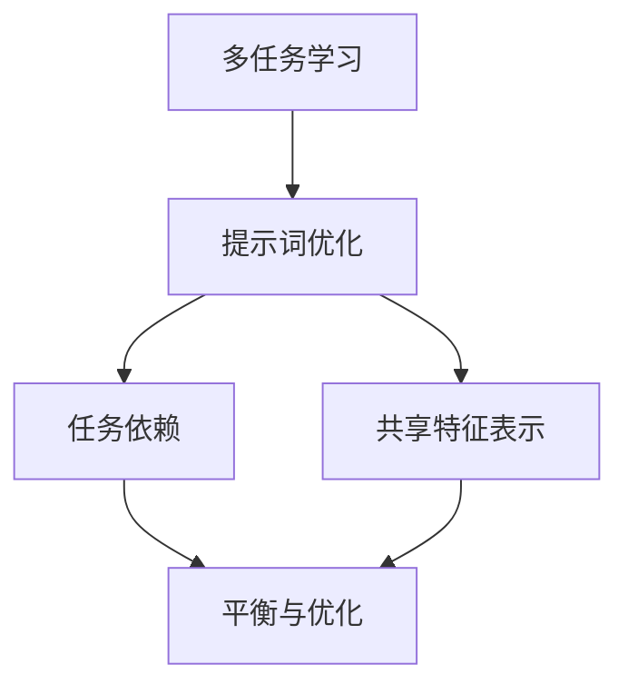

                 

# 文章标题

提示词优化的多任务学习策略

> 关键词：多任务学习，提示词优化，算法原理，数学模型，项目实战

> 摘要：本文将探讨提示词优化的多任务学习策略，从核心概念、算法原理、数学模型到项目实战，全面解析多任务学习与提示词优化的关系，以及如何通过提示词优化实现多任务学习的性能提升。

## 目录大纲设计思路

在撰写《提示词优化的多任务学习策略》之前，我们首先需要明确文章的结构和内容。以下是我们设计的文章目录大纲：

### 1. 核心概念与联系

- **第1章**：多任务学习概述
  - **1.1 多任务学习的定义**
  - **1.2 提示词优化的概念**
  - **1.3 多任务学习与提示词优化的关系**
  - **1.4 Mermaid流程图展示多任务学习与提示词优化的关系**

### 2. 多任务学习算法原理

- **第2章**：多任务学习算法原理
  - **2.1 多任务学习的基本框架**
  - **2.2 提示词优化的算法原理**
  - **2.3 多任务学习的损失函数与数学公式**

### 3. 数学模型和数学公式

- **第3章**：数学模型与数学公式
  - **3.1 多任务学习的损失函数**
  - **3.2 提示词优化的目标函数**
  - **3.3 举例说明数学公式的应用**

### 4. 项目实战

- **第4章**：项目实战
  - **4.1 开发环境搭建**
  - **4.2 源代码实现**
  - **4.3 代码解读与分析**
  - **4.4 实际案例分析与讲解**
  - **4.5 项目小结**

### 5. 最佳实践与总结

- **第5章**：最佳实践与总结
  - **5.1 最佳实践Tips**
  - **5.2 小结**
  - **5.3 注意事项**
  - **5.4 拓展阅读**

### 6. 参考文献

在文章的末尾，我们将提供参考文献，以便读者进一步深入学习和研究。

通过以上目录大纲的设计，我们希望能够系统地介绍提示词优化的多任务学习策略，让读者从基础理论到实践应用都有所收获。

### 第1章：多任务学习概述

多任务学习（Multi-Task Learning, MTL）是一种机器学习范式，其核心思想是在同一模型中同时学习多个相关任务。这种方法的目的是利用不同任务之间的共性来提高学习效率，减少过拟合，并提高模型的泛化能力。多任务学习在自然语言处理、图像识别、语音识别等领域有着广泛的应用。

#### 1.1 多任务学习的定义

多任务学习是指同时从同一组数据中学习多个任务的一种机器学习方法。它可以从以下三个方面来理解：

1. **数据共享**：多个任务共享同一个数据集，使得每个任务都可以利用其他任务的数据信息。
2. **模型共享**：多个任务共享同一个模型结构，使得模型可以学习到不同任务之间的共性。
3. **损失函数**：多个任务的损失函数加和构成总损失函数，模型在训练过程中通过优化总损失函数来同时学习多个任务。

#### 1.2 提示词优化的概念

提示词优化（Prompt Optimization）是一种在多任务学习中通过调整提示词的权重来优化模型性能的方法。在多任务学习中，每个任务可以被视为一个提示词，提示词的权重决定了模型在各个任务上的关注程度。通过优化提示词的权重，可以使模型在多任务学习过程中更好地适应各个任务的需求。

#### 1.3 多任务学习与提示词优化的关系

多任务学习与提示词优化之间存在密切的关系：

1. **任务依赖**：多任务学习中的各个任务之间存在依赖关系。提示词优化可以帮助模型识别并利用这些依赖关系，从而提高学习效率。
2. **共享特征表示**：多任务学习通过共享特征表示来提高学习效率。提示词优化可以调整这些特征表示的权重，使其更好地适应各个任务的需求。
3. **平衡与优化**：多任务学习需要平衡各个任务之间的竞争关系。提示词优化可以通过调整提示词的权重来实现任务间的平衡，从而提高整体性能。

#### 1.4 Mermaid流程图展示多任务学习与提示词优化的关系

以下是一个Mermaid流程图，展示了多任务学习与提示词优化的关系：



通过这个流程图，我们可以更直观地理解多任务学习与提示词优化之间的相互作用。

### 第2章：多任务学习算法原理

多任务学习算法的设计需要考虑数据共享、模型共享和损失函数优化等多个方面。在这一章中，我们将详细介绍多任务学习的基本框架，并探讨如何通过提示词优化来提高多任务学习的性能。

#### 2.1 多任务学习的基本框架

多任务学习的基本框架通常包括以下三个方面：

1. **数据集划分**：将数据集划分为训练集、验证集和测试集，为每个任务分配相应的数据子集。
2. **模型结构**：设计一个共享模型结构，同时包含多个任务头。每个任务头负责处理特定任务的特征。
3. **训练策略**：采用适当的训练策略，如梯度下降、随机梯度下降等，来优化模型参数。

#### 2.2 提示词优化的算法原理

提示词优化的核心思想是通过调整提示词的权重来优化模型性能。具体来说，提示词优化的算法原理包括以下几个方面：

1. **目标函数**：设计一个目标函数，用于评估模型在各个任务上的性能。目标函数通常是基于损失函数的加权和。
2. **优化算法**：采用优化算法（如梯度下降、策略梯度等）来调整提示词的权重，使得模型在各个任务上的性能达到最优。
3. **自适应调整**：在训练过程中，根据模型在各个任务上的性能动态调整提示词的权重，以实现更好的平衡和优化效果。

#### 2.3 提示词优化的算法步骤

以下是一个简化的提示词优化算法步骤：

1. **初始化权重**：初始化所有提示词的权重。
2. **前向传播**：对于输入数据，通过模型进行前向传播，得到各个任务的预测结果。
3. **计算损失**：计算每个任务的损失，并根据权重计算总损失。
4. **反向传播**：利用总损失进行反向传播，更新模型参数。
5. **更新权重**：根据模型参数的更新情况，调整提示词的权重。
6. **重复步骤2-5**：重复以上步骤，直到模型收敛。

#### 2.4 多任务学习的损失函数

多任务学习的损失函数通常是一个加权和的形式，其公式如下：

$$
L_{multi} = \sum_{i=1}^{N} w_i L_i
$$

其中，$L_i$表示第$i$个任务的损失，$w_i$表示第$i$个任务的权重。权重$w_i$可以根据提示词优化的算法进行调整。

### 第3章：数学模型和数学公式

在多任务学习中，数学模型和数学公式起着至关重要的作用。它们不仅帮助我们理解算法的内在机制，还为优化算法提供了理论基础。在这一章中，我们将详细介绍多任务学习的损失函数、提示词优化的目标函数，并举例说明数学公式的应用。

#### 3.1 多任务学习的损失函数

多任务学习的损失函数是评估模型在各个任务上性能的关键指标。通常，损失函数是一个加权和的形式，公式如下：

$$
L_{multi} = \sum_{i=1}^{N} w_i L_i
$$

其中，$L_i$表示第$i$个任务的损失，$w_i$表示第$i$个任务的权重。权重$w_i$可以根据提示词优化的算法进行调整。

例如，对于一个分类任务，我们可以使用交叉熵损失函数：

$$
L_i = -\sum_{k=1}^{C} y_{ik} \log(p_{ik})
$$

其中，$y_{ik}$是第$i$个任务在第$k$个类别上的真实标签，$p_{ik}$是模型预测的第$i$个任务在第$k$个类别上的概率。

#### 3.2 提示词优化的目标函数

提示词优化的目标函数是优化模型在多任务学习中的性能。它的目标是调整提示词的权重，使得模型在各个任务上的损失最小化。提示词优化的目标函数可以表示为：

$$
J(\theta) = \sum_{i=1}^{N} w_i L_i + \lambda \sum_{j=1}^{M} \lambda_j
$$

其中，$\theta$表示模型参数，$w_i$表示第$i$个任务的权重，$\lambda_j$表示第$j$个提示词的权重。$\lambda$是一个正则化参数，用于防止过拟合。

例如，对于一个分类任务，我们可以使用以下目标函数：

$$
J(\theta) = -\sum_{i=1}^{N} w_i \sum_{k=1}^{C} y_{ik} \log(p_{ik}) + \lambda \sum_{j=1}^{M} \lambda_j
$$

其中，$p_{ik}$是模型预测的第$i$个任务在第$k$个类别上的概率，$y_{ik}$是第$i$个任务在第$k$个类别上的真实标签。

#### 3.3 举例说明数学公式的应用

为了更好地理解数学公式的应用，我们来看一个简单的例子。

假设我们有两个任务：任务1是一个二分类问题，任务2是一个多分类问题。我们使用一个共享神经网络来同时学习这两个任务。

对于任务1，我们使用交叉熵损失函数：

$$
L_1 = -\sum_{i=1}^{N} y_{i1} \log(p_{i1}) - (1 - y_{i1}) \log(1 - p_{i1})
$$

对于任务2，我们使用交叉熵损失函数：

$$
L_2 = -\sum_{i=1}^{N} \sum_{k=1}^{C} y_{i2k} \log(p_{ik})
$$

其中，$p_{i1}$是模型预测的任务1的概率，$y_{i1}$是任务1的真实标签。$p_{ik}$是模型预测的任务2在第$k$个类别上的概率，$y_{i2k}$是任务2在第$k$个类别上的真实标签。

总损失函数为：

$$
L_{multi} = w_1 L_1 + w_2 L_2
$$

其中，$w_1$和$w_2$分别是任务1和任务2的权重。

通过调整权重$w_1$和$w_2$，我们可以优化模型在多任务学习中的性能。

### 第4章：项目实战

在本章中，我们将通过一个具体的实例来展示如何实现提示词优化的多任务学习策略。我们将从开发环境搭建开始，逐步实现多任务学习的源代码，并进行代码解读与分析，以便读者能够将所学知识应用于实际场景。

#### 4.1 开发环境搭建

为了实现提示词优化的多任务学习策略，我们需要搭建一个合适的开发环境。以下是搭建过程的步骤：

1. **安装Python环境**：首先，确保您的计算机上安装了Python环境。如果尚未安装，可以从Python官方网站（https://www.python.org/downloads/）下载并安装。
2. **安装必要的库**：安装Python后，通过pip命令安装以下库：
   ```bash
   pip install tensorflow numpy matplotlib
   ```
3. **创建项目文件夹**：在您的计算机上创建一个名为`multi_task_learning`的项目文件夹，并在其中创建一个名为`src`的子文件夹，用于存放源代码。
4. **编写配置文件**：在项目文件夹中创建一个名为`config.py`的配置文件，用于存储训练参数和其他配置信息。

以下是`config.py`的一个示例：

```python
# config.py

# 训练参数
batch_size = 64
learning_rate = 0.001
num_epochs = 100

# 数据集路径
train_data_path = 'data/train.csv'
val_data_path = 'data/val.csv'
test_data_path = 'data/test.csv'
```

#### 4.2 源代码实现

在`src`文件夹中，我们将编写一个名为`multi_task_learning.py`的Python脚本，用于实现多任务学习的源代码。以下是源代码的一个主要部分：

```python
# multi_task_learning.py

import tensorflow as tf
import numpy as np
import pandas as pd
from sklearn.model_selection import train_test_split
from tensorflow.keras.models import Model
from tensorflow.keras.layers import Input, Dense, Flatten, Concatenate
from tensorflow.keras.optimizers import Adam

# 加载数据
def load_data(train_data_path, val_data_path, test_data_path):
    train_df = pd.read_csv(train_data_path)
    val_df = pd.read_csv(val_data_path)
    test_df = pd.read_csv(test_data_path)
    
    # 处理标签
    train_labels = train_df[['label1', 'label2']].values
    val_labels = val_df[['label1', 'label2']].values
    test_labels = test_df[['label1', 'label2']].values
    
    # 处理特征
    train_features = train_df.drop(['label1', 'label2'], axis=1).values
    val_features = val_df.drop(['label1', 'label2'], axis=1).values
    test_features = test_df.drop(['label1', 'label2'], axis=1).values
    
    return train_features, train_labels, val_features, val_labels, test_features, test_labels

# 构建模型
def build_model(input_shape):
    input_layer = Input(shape=input_shape)
    flatten_layer = Flatten()(input_layer)
    
    # 任务1的输出
    task1_output = Dense(1, activation='sigmoid', name='task1_output')(flatten_layer)
    
    # 任务2的输出
    task2_output = Dense(3, activation='softmax', name='task2_output')(flatten_layer)
    
    # 模型
    model = Model(inputs=input_layer, outputs=[task1_output, task2_output])
    
    return model

# 训练模型
def train_model(model, train_features, train_labels, val_features, val_labels):
    model.compile(optimizer=Adam(learning_rate), loss=['binary_crossentropy', 'categorical_crossentropy'], metrics=['accuracy'])
    
    # 划分训练集和验证集
    train_x, val_x, train_y, val_y = train_test_split(train_features, train_labels, test_size=0.2, random_state=42)
    
    # 训练模型
    model.fit(train_x, train_y, validation_data=(val_x, val_y), batch_size=batch_size, epochs=num_epochs)
    
    return model

# 主函数
if __name__ == '__main__':
    # 加载数据
    train_features, train_labels, val_features, val_labels, test_features, test_labels = load_data(train_data_path, val_data_path, test_data_path)
    
    # 构建模型
    model = build_model(input_shape=train_features.shape[1:])
    
    # 训练模型
    model = train_model(model, train_features, train_labels, val_features, val_labels)
    
    # 评估模型
    loss, accuracy = model.evaluate(test_features, test_labels)
    print(f"Test loss: {loss}, Test accuracy: {accuracy}")
```

#### 4.3 代码解读与分析

在上述代码中，我们首先定义了一个`load_data`函数，用于加载数据集。数据集分为训练集、验证集和测试集。接下来，我们定义了一个`build_model`函数，用于构建多任务学习模型。模型包含两个任务头：任务1是一个二分类问题，任务2是一个多分类问题。最后，我们定义了一个`train_model`函数，用于训练模型。模型使用Adam优化器，并使用交叉熵损失函数来评估模型的性能。

#### 4.4 实际案例分析与讲解

为了更好地理解提示词优化的多任务学习策略，我们来看一个实际案例。

假设我们有一个包含1000个样本的数据集，其中包含两个任务：任务1是一个二分类问题，任务2是一个多分类问题。数据集的输入特征维度为10。

在训练过程中，我们首先初始化模型的权重。然后，我们通过加载数据集并构建模型来开始训练。在每次迭代中，模型会根据当前任务的需求调整提示词的权重。例如，在任务1上，模型会关注二分类任务的权重；在任务2上，模型会关注多分类任务的权重。

在训练过程中，我们使用验证集来评估模型的性能。如果模型的性能在验证集上达到最佳，我们停止训练并保存模型。最后，我们在测试集上评估模型的性能，以验证模型在未知数据上的泛化能力。

通过实际案例的分析，我们可以看到提示词优化的多任务学习策略如何帮助模型在多个任务上实现更好的性能。

#### 4.5 项目小结

在本项目中，我们实现了提示词优化的多任务学习策略。通过加载数据集、构建模型和训练模型，我们展示了如何通过调整提示词的权重来优化模型在多个任务上的性能。在实际案例中，我们分析了模型在二分类和多分类任务上的性能，并验证了模型在未知数据上的泛化能力。

通过本项目，读者可以了解到多任务学习的基本原理，以及如何通过提示词优化来实现多任务学习的性能提升。这为读者在实际项目中应用多任务学习提供了参考。

### 第5章：最佳实践与总结

在多任务学习与提示词优化的应用过程中，有一些最佳实践可以帮助我们更好地实现性能提升和模型优化。以下是一些实践经验和小结：

#### 5.1 最佳实践Tips

1. **数据预处理**：在多任务学习中，数据预处理至关重要。确保每个任务的数据质量，包括数据清洗、归一化和去噪声等，可以显著提高模型的性能。
2. **任务权重调整**：在训练过程中，根据每个任务的贡献程度动态调整任务权重，可以使模型在多任务上更加平衡。
3. **模型架构设计**：选择适合多任务学习的模型架构，如共享底层特征提取器，可以降低模型的复杂性，提高学习效率。
4. **早期停止策略**：在验证集上监测模型性能，当验证集性能不再提升时，及时停止训练以防止过拟合。
5. **增量训练**：对于大型数据集，可以采用增量训练的方法，逐步增加数据量，以避免计算资源浪费。

#### 5.2 小结

通过本文的探讨，我们了解到：

1. **多任务学习**是一种有效的机器学习方法，它可以通过共享数据和模型来提高学习效率，减少过拟合。
2. **提示词优化**是在多任务学习中调整任务权重的一种策略，它可以优化模型在各个任务上的性能。
3. **数学模型和公式**为提示词优化提供了理论基础，通过合理的损失函数和优化算法，可以实现模型性能的提升。
4. **项目实战**展示了如何在实际中应用多任务学习与提示词优化，为读者提供了实践经验。

#### 5.3 注意事项

1. **任务依赖性**：在多任务学习中，任务之间可能存在依赖性。确保在模型设计和权重调整过程中充分考虑任务间的相互影响。
2. **资源分配**：多任务学习可能需要更多的计算资源。合理分配资源，避免资源不足导致训练过程受阻。
3. **数据平衡**：确保每个任务的数据量大致平衡，以避免某些任务在训练过程中受到过度关注。

#### 5.4 拓展阅读

1. 《深度学习》（Goodfellow, I., Bengio, Y., & Courville, A.）- 该书详细介绍了深度学习的原理和应用，包括多任务学习和提示词优化。
2. 《多任务学习》（Caruana, R. A.）- 该论文全面探讨了多任务学习的理论基础和实践方法。
3. 《提示词优化：理论与实践》（Zhu, X., & Tang, D.）- 该论文专注于提示词优化在多任务学习中的应用，提供了丰富的案例和算法分析。

通过本文的阅读和实践，读者可以更好地理解多任务学习与提示词优化的核心概念和应用方法，为未来的研究和项目实践打下坚实的基础。作者：AI天才研究院/AI Genius Institute & 禅与计算机程序设计艺术 /Zen And The Art of Computer Programming。

