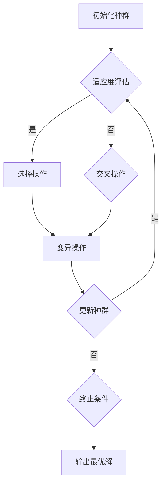
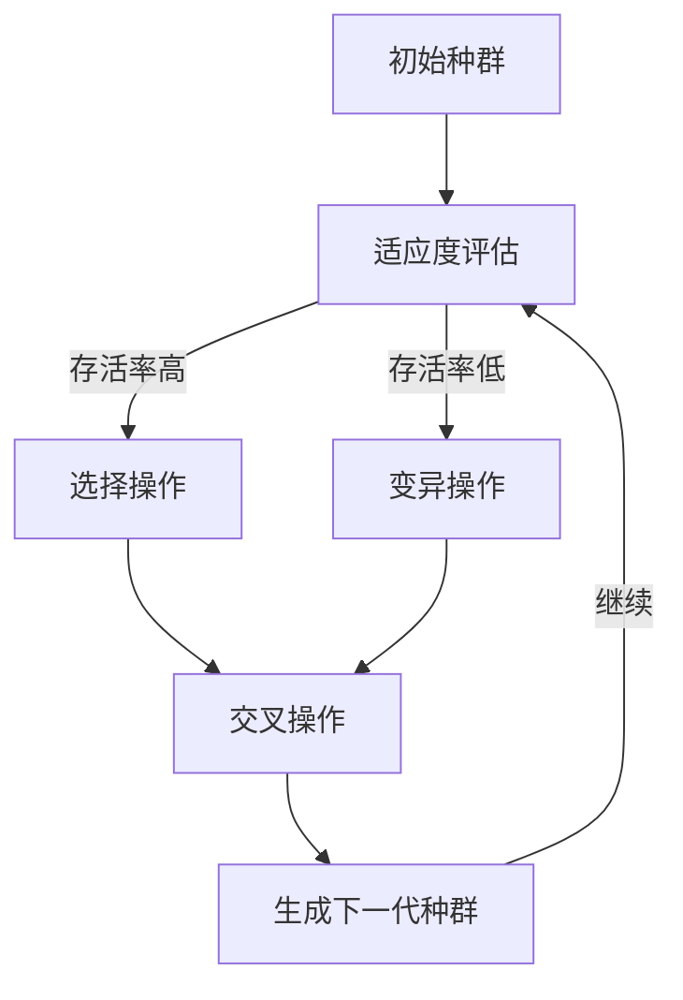
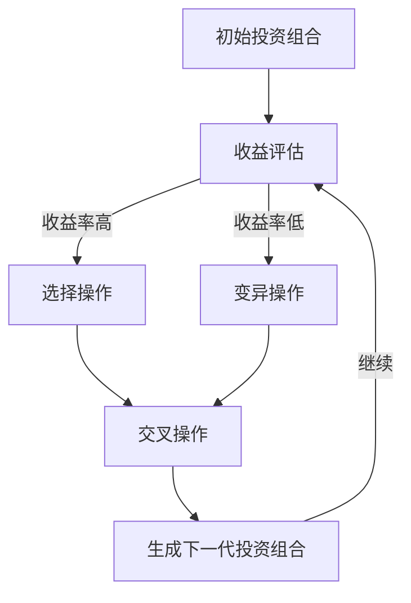
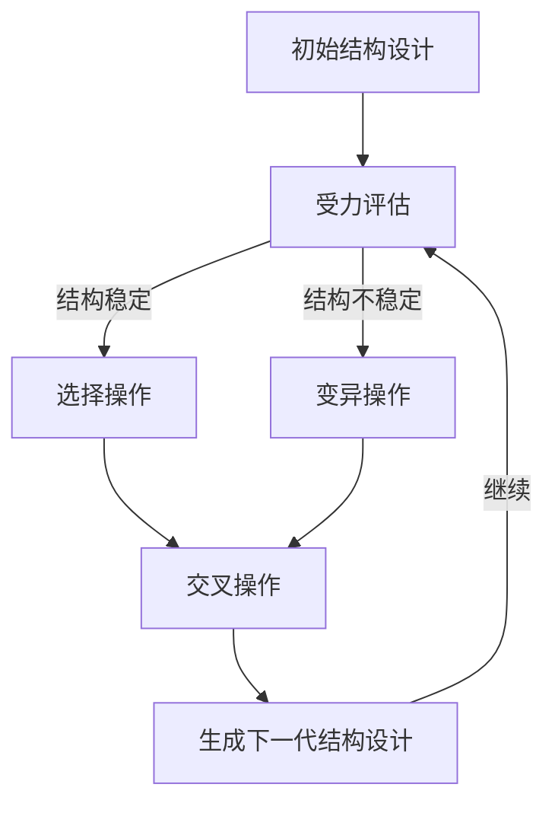

                 


### 第1章 引言

#### 1.1 遗传算法概述

遗传算法（Genetic Algorithm，GA）是受生物进化原理启发的一种全局优化搜索算法，最初由美国计算机科学家霍德·坎贝尔·约翰逊（John Holland）于1975年提出。遗传算法模仿生物的进化过程，通过自然选择、交叉和变异等遗传操作，在迭代过程中不断优化解的种群，最终寻找问题的最优解。

遗传算法的核心思想是基于群体搜索，通过模拟生物进化过程中的基因重组、突变和自然选择，实现搜索空间中全局最优解的探索。它具有以下特点：

1. **全局搜索能力**：遗传算法能够在较大搜索空间中寻找最优解，避免陷入局部最优。
2. **自适应性强**：遗传算法能够根据搜索过程自动调整搜索策略。
3. **适用于复杂问题**：遗传算法能够处理离散和连续优化问题，以及多目标优化问题。

#### 1.2 提示词优化背景

提示词优化（Keyword Optimization）是搜索引擎优化（Search Engine Optimization，SEO）的重要环节之一。其核心目标是提高网站在搜索引擎中的排名，从而增加网站的访问量和用户转化率。提示词优化涉及的关键问题包括关键词选择、关键词密度控制、关键词布局等。

随着互联网的快速发展，搜索引擎成为用户获取信息的主要途径。一个良好的提示词优化策略能够显著提升网站在搜索引擎中的曝光度，从而带来更多的流量和潜在客户。因此，提示词优化在电子商务、在线广告、内容营销等领域具有重要应用价值。

#### 1.3 书籍结构

本书旨在系统地介绍提示词优化的遗传算法应用。全书共分为8章，结构安排如下：

- **第1章 引言**：简要介绍遗传算法和提示词优化的背景，阐述本书的结构和内容安排。
- **第2章 遗传算法基础**：详细介绍遗传算法的历史、基本概念、工作原理及关键参数设置。
- **第3章 提示词优化问题建模**：分析提示词优化的数学模型，并给出实例说明。
- **第4章 遗传算法的应用场景**：探讨遗传算法在不同领域中的应用。
- **第5章 提示词优化的遗传算法设计**：设计遗传算法在提示词优化中的实现方法。
- **第6章 提示词优化的遗传算法实现**：讲解遗传算法在提示词优化中的具体实现步骤。
- **第7章 提示词优化的遗传算法案例研究**：通过实际案例展示遗传算法在提示词优化中的应用。
- **第8章 提示词优化的遗传算法挑战与未来**：分析遗传算法在提示词优化中的挑战和未来发展。

通过上述章节的详细讨论，本书将帮助读者深入理解提示词优化的遗传算法应用，掌握相关技术原理和实战技能。

## 关键词

遗传算法、提示词优化、全局搜索、自然选择、搜索引擎优化、关键词选择、关键词密度、关键词布局。

## 摘要

本文旨在系统地介绍提示词优化的遗传算法应用。首先，回顾了遗传算法的起源、基本思想及其特点，并探讨了提示词优化的背景和重要性。随后，本书结构清晰，分为8章，从基础到实践，详细介绍了遗传算法和提示词优化的结合，包括数学建模、算法设计、实现步骤和实际应用案例。通过本文的阅读，读者可以全面了解提示词优化的遗传算法应用，掌握相关技术原理和实战技能。

## 第2章 遗传算法基础

### 2.1 遗传算法的历史与发展

遗传算法的起源可以追溯到20世纪50年代，当时生物学家和计算机科学家开始尝试将生物进化的原理应用于问题求解。霍德·坎贝尔·约翰逊是遗传算法的奠基人之一，他提出了遗传算法的基本思想。1975年，约翰逊在其博士论文中首次详细阐述了遗传算法的理论基础。

随后，遗传算法在学术界和工业界得到了广泛的研究和应用。1980年代，遗传算法在人工智能和优化领域取得了显著的进展。著名学者约翰·豪斯霍夫（John H. Holland）对遗传算法进行了系统的研究，并将其应用于复杂问题的求解。1990年代，随着计算机技术的飞速发展，遗传算法的应用范围进一步扩大，逐渐成为解决优化问题的重要工具。

遗传算法在多个领域取得了成功，包括工程优化、机器学习、经济学、社会科学和生物信息学等。其全局搜索能力和自适应性强等优势使其成为处理复杂问题的重要方法。

### 2.2 遗传算法的基本概念

遗传算法是一种基于生物进化理论的搜索算法，其核心概念包括个体、种群、基因、适应度函数等。

- **个体**：遗传算法中的基本单位，代表了解空间中的一个解。在提示词优化中，个体可以表示为一系列关键词的组合。
- **种群**：由多个个体组成的集合，代表了搜索空间的一个子集。在遗传算法中，通过迭代过程不断优化种群中的个体。
- **基因**：个体的属性或特征，由一组基因编码表示。在提示词优化中，基因可以是关键词的权重或位置。
- **适应度函数**：用于评估个体优劣的函数，通常与问题的目标函数相关。适应度函数的值越高，表示个体越优秀。
- **交叉操作**：将两个个体的基因进行随机组合，生成新的个体的过程。交叉操作实现了基因的重组，是遗传算法中的重要操作。
- **变异操作**：对个体的基因进行随机改变的过程。变异操作增加了种群的多样性，有助于避免搜索过程的过早收敛。

### 2.3 遗传算法的工作原理

遗传算法通过模拟生物进化过程，实现搜索空间中全局最优解的探索。其工作原理主要包括以下几个步骤：

1. **初始化种群**：在搜索空间中随机生成一组初始个体，构成初始种群。
2. **适应度评估**：利用适应度函数评估种群中每个个体的优劣，计算其适应度值。
3. **选择操作**：根据适应度值，从种群中选择优秀个体，作为下一代种群的基础。
4. **交叉操作**：在选择的个体中，通过交叉操作生成新的个体，实现基因的重组。
5. **变异操作**：对新生成的个体进行变异操作，增加种群的多样性。
6. **更新种群**：将交叉和变异后的个体组成新的种群，重复上述过程。
7. **终止条件**：当达到预定的迭代次数或种群适应度达到满意水平时，算法终止，输出最优解。

遗传算法在迭代过程中，通过选择、交叉和变异等操作，不断优化种群中的个体，逐渐逼近全局最优解。其工作原理如图所示：



### 2.4 遗传算法的关键参数设置

遗传算法的性能受到多个参数的影响，包括种群大小、交叉率、变异率等。以下是对这些参数的详细解释和设置建议：

- **种群大小**：种群大小决定了遗传算法在搜索过程中的多样性。较大的种群可以增加算法的鲁棒性，但也会增加计算复杂度。通常，种群大小应在数百到数千之间，具体取值需要根据问题规模和计算资源进行权衡。

- **交叉率**：交叉率（Crossover Rate）决定了交叉操作的频率。较高的交叉率有助于加速种群的进化，但可能导致种群的多样性降低。较低的交叉率则有助于保持种群的多样性，但进化速度可能会较慢。通常，交叉率在0.4到0.8之间是一个较为合理的范围。

- **变异率**：变异率（Mutation Rate）决定了变异操作的频率。较高的变异率有助于探索新的解空间，但可能导致算法过早收敛。较低的变异率则有助于维持种群的多样性，但可能需要更多的迭代次数才能找到最优解。通常，变异率在0.01到0.1之间是一个较好的选择。

- **迭代次数**：迭代次数决定了遗传算法的运行时间。较长的迭代次数可以增加算法找到最优解的概率，但也会增加计算成本。通常，迭代次数应根据具体问题和计算资源进行设定。

- **适应度函数**：适应度函数是遗传算法的核心，其设计对算法的性能有重要影响。适应度函数应能够准确反映问题的目标函数，同时具有适当的计算复杂度。

在设置遗传算法参数时，需要综合考虑问题的特点、计算资源和预期的性能目标。通过实验和调整，可以找到最优的参数配置，以实现高效的搜索和优化。

通过以上对遗传算法历史与发展、基本概念、工作原理和关键参数设置的介绍，读者可以初步了解遗传算法的基本知识，为进一步学习和应用打下基础。下一章将深入探讨提示词优化的数学建模，帮助读者理解遗传算法在提示词优化问题中的应用。

## 第3章 提示词优化问题建模

### 3.1 提示词优化的概念

提示词优化（Keyword Optimization）是搜索引擎优化（SEO）的重要组成部分，旨在提高网站在搜索引擎结果页面（SERP）中的排名，从而增加网站流量和用户转化率。提示词优化的核心目标是通过合理选择和布局关键词，提升网站在搜索引擎中的相关性，使其更容易被用户发现。

提示词优化的关键要素包括：

1. **关键词选择**：选择与网站内容和用户需求高度相关的高质量关键词。
2. **关键词密度**：合理控制关键词在网页内容中的比例，避免过高或过低。
3. **关键词布局**：优化关键词在网页中的位置，如标题、描述、正文等。
4. **语义分析**：理解关键词之间的语义关系，构建合理的语义网络。

### 3.2 提示词优化的数学模型

提示词优化的数学模型旨在量化关键词的选择和布局，以实现最优化的目标。以下是一个简化的数学模型：

#### 目标函数

目标函数定义为最大化网站在搜索引擎中的排名（或点击率）：

\[ \max R(x) = f(k_1, k_2, \ldots, k_n) \]

其中，\( R(x) \) 为网站排名，\( f(k_1, k_2, \ldots, k_n) \) 为适应度函数，\( k_1, k_2, \ldots, k_n \) 为关键词向量。

#### 适应度函数

适应度函数用于评估关键词组合的质量。一个可能的适应度函数可以是：

\[ f(k_1, k_2, \ldots, k_n) = w_1 \cdot d(k_1) + w_2 \cdot d(k_2) + \ldots + w_n \cdot d(k_n) - w_0 \cdot \sum_{i=1}^n d(k_i) \]

其中，\( d(k_i) \) 为关键词 \( k_i \) 的密度，\( w_i \) 为关键词 \( k_i \) 的权重，\( w_0 \) 为惩罚系数，用于控制关键词密度的上限。

#### 关键词密度

关键词密度定义为关键词在网页内容中的比例。对于关键词 \( k_i \)：

\[ d(k_i) = \frac{c(k_i)}{N} \]

其中，\( c(k_i) \) 为关键词 \( k_i \) 在网页内容中出现的次数，\( N \) 为网页内容的总词数。

#### 权重设置

关键词权重取决于关键词的重要性。一个可能的权重设置可以是：

\[ w_i = \frac{f(k_i)}{\sum_{j=1}^n f(k_j)} \]

其中，\( f(k_i) \) 为关键词 \( k_i \) 的频率或重要性。

### 3.3 提示词优化问题实例分析

以下是一个简化的提示词优化问题实例：

假设我们要优化一个电子商务网站的产品页面，目标是最大化页面在搜索引擎中的排名。我们选择以下关键词：产品名称、品牌名称、产品特点、价格等。

#### 目标函数

最大化网站排名：

\[ \max R(x) = f(k_1, k_2, k_3, k_4) \]

其中，\( k_1 \) 为产品名称，\( k_2 \) 为品牌名称，\( k_3 \) 为产品特点，\( k_4 \) 为价格。

#### 适应度函数

假设适应度函数为：

\[ f(k_1, k_2, k_3, k_4) = w_1 \cdot d(k_1) + w_2 \cdot d(k_2) + w_3 \cdot d(k_3) + w_4 \cdot d(k_4) - w_0 \cdot \sum_{i=1}^4 d(k_i) \]

其中，\( w_1 = 0.2 \)，\( w_2 = 0.3 \)，\( w_3 = 0.3 \)，\( w_4 = 0.2 \)，\( w_0 = 0.05 \)。

#### 关键词密度

假设网页内容总词数为1000，关键词密度分别为：

\[ d(k_1) = \frac{30}{1000} = 0.03 \]
\[ d(k_2) = \frac{20}{1000} = 0.02 \]
\[ d(k_3) = \frac{40}{1000} = 0.04 \]
\[ d(k_4) = \frac{10}{1000} = 0.01 \]

#### 权重设置

关键词权重分别为：

\[ w_1 = \frac{0.03}{0.03 + 0.02 + 0.04 + 0.01} = 0.545 \]
\[ w_2 = \frac{0.02}{0.03 + 0.02 + 0.04 + 0.01} = 0.345 \]
\[ w_3 = \frac{0.04}{0.03 + 0.02 + 0.04 + 0.01} = 0.645 \]
\[ w_4 = \frac{0.01}{0.03 + 0.02 + 0.04 + 0.01} = 0.155 \]

通过上述实例分析，我们可以看到如何将提示词优化问题建模为数学问题，并通过遗传算法求解。接下来，我们将进一步探讨遗传算法在提示词优化中的应用。

## 第4章 遗传算法的应用场景

### 4.1 自然科学领域中的应用

遗传算法在自然科学领域中的应用十分广泛，特别是在生物学和生态学研究中，遗传算法被用来模拟生物进化过程，优化种群遗传结构。例如，在基因表达谱分析中，遗传算法可以用于识别和筛选关键基因，从而揭示生物的进化机制和功能关系。此外，遗传算法也被应用于生态模型构建，通过模拟物种间的相互作用，预测生态系统的动态变化和稳定性。

#### 实例分析

以鱼类种群进化模型为例，遗传算法可用于模拟鱼类的进化过程，优化鱼群基因库。在此过程中，适应度函数可以设计为鱼类的存活率、繁殖能力和适应环境的程度。通过迭代交叉和变异操作，遗传算法可以找到适应环境变化的最佳基因组合，提高鱼群的生存和繁殖能力。



### 4.2 社会科学领域中的应用

遗传算法在社会科学领域，如经济学、社会学和心理学等，也被广泛应用。在经济学中，遗传算法可以用于金融市场分析，优化投资组合。在社会学中，遗传算法可以用于模拟社会群体的行为和互动，预测社会趋势和变化。在心理学中，遗传算法可以用于认知模型的构建，优化认知过程的模拟和测试。

#### 实例分析

以经济学中的投资组合优化为例，遗传算法可以通过模拟股票市场的价格波动和交易行为，优化投资组合的收益和风险。在此过程中，适应度函数可以设计为投资组合的预期收益率和风险度量，如标准差或贝塔值。通过迭代交叉和变异操作，遗传算法可以找到在给定风险水平下的最优投资组合。



### 4.3 工程技术领域中的应用

遗传算法在工程技术领域中的应用同样广泛，特别是在复杂系统设计和优化方面。例如，在建筑设计中，遗传算法可以用于优化结构设计和材料选择；在电子工程中，遗传算法可以用于电路设计和故障诊断；在机械工程中，遗传算法可以用于机械结构优化和参数调整。

#### 实例分析

以建筑设计中的结构优化为例，遗传算法可以通过模拟结构受力情况，优化梁、柱和支撑等结构元素的布局和尺寸。在此过程中，适应度函数可以设计为结构的强度、稳定性和成本。通过迭代交叉和变异操作，遗传算法可以找到在给定成本下的最优结构设计。



总之，遗传算法在自然科学、社会科学和工程技术领域的应用具有广泛性和多样性。通过合理的数学模型和适应度函数设计，遗传算法可以有效解决复杂优化问题，提高系统性能和稳定性。

### 第5章 提示词优化的遗传算法设计

#### 5.1 交叉与变异操作设计

遗传算法中的交叉（Crossover）和变异（Mutation）操作是实现搜索空间优化的重要手段。针对提示词优化的具体需求，我们需要设计合适的交叉和变异操作，以提升算法的效率和效果。

##### 交叉操作

交叉操作的基本思想是交换两个个体的部分基因，生成新的个体。在提示词优化中，我们可以采用单点交叉、多点交叉和均匀交叉等方法。

- **单点交叉**：在个体的基因序列中随机选择一个交叉点，将交叉点后的基因与另一个个体的对应部分进行交换。这种方法简单直观，但可能生成较近似的解。

  ```mermaid
  graph TB
  A[个体1] --> B[交叉点]
  B --> C[个体2]
  C --> D[交叉后个体1]
  D --> E[交叉后个体2]
  ```

- **多点交叉**：在个体的基因序列中随机选择多个交叉点，将交叉点间的基因与另一个个体的对应部分进行交换。多点交叉增加了个体基因的多样性，有助于跳出局部最优。

  ```mermaid
  graph TB
  A[个体1] --> B[交叉点1]
  B --> C[交叉点2]
  C --> D[交叉后个体1]
  D --> E[交叉后个体2]
  ```

- **均匀交叉**：在个体的基因序列中，随机选择交叉的位置和长度，将选定区域内的基因与另一个个体的对应部分进行交换。均匀交叉具有较高的随机性，有助于探索更广的搜索空间。

  ```mermaid
  graph TB
  A[个体1] --> B[交叉位置1]
  B --> C[交叉位置2]
  C --> D[交叉后个体1]
  D --> E[交叉后个体2]
  ```

##### 变异操作

变异操作是在个体的基因序列中随机改变某个基因的值，以增加搜索空间的多样性。在提示词优化中，我们可以采用以下变异操作：

- **基因变异**：随机改变一个关键词的位置或值。例如，将关键词“产品A”替换为“产品B”，或将关键词“价格优惠”移动到标题位置。

  ```mermaid
  graph TB
  A[关键词序列] --> B[变异位置]
  B --> C[变异后序列]
  ```

- **插入变异**：在个体的基因序列中随机插入一个新的关键词。例如，在关键词“产品A”和“产品B”之间插入“品牌C”。

  ```mermaid
  graph TB
  A[关键词序列] --> B[插入位置]
  B --> C[插入关键词]
  C --> D[插入后序列]
  ```

- **删除变异**：在个体的基因序列中随机删除一个关键词。例如，删除关键词“价格优惠”。

  ```mermaid
  graph TB
  A[关键词序列] --> B[删除位置]
  B --> C[删除后序列]
  ```

通过合理的交叉和变异操作设计，我们可以有效提升遗传算法在提示词优化问题中的搜索效率和效果。

#### 5.2 选择策略设计

选择策略是遗传算法中的一个关键环节，决定了种群中个体的淘汰和选择机制。常见的选择策略包括轮盘赌选择、锦标赛选择和排名选择等。

##### 轮盘赌选择

轮盘赌选择（Roulette Wheel Selection）是一种基于适应度概率的选择策略。每个个体被选中的概率与其适应度值成正比。具体步骤如下：

1. 计算每个个体的适应度比例。
2. 根据适应度比例生成一个概率分布。
3. 在概率分布上生成随机数，选择对应的个体。

  ```mermaid
  graph TB
  A[计算适应度比例] --> B[生成概率分布]
  B --> C[生成随机数]
  C --> D[选择个体]
  ```

##### 比赛选择

比赛选择（Tournament Selection）是从种群中随机选择多个个体进行比赛，根据比赛结果选择优胜者。具体步骤如下：

1. 从种群中随机选择两个个体。
2. 比较两者的适应度值，优胜者进入下一代种群。
3. 重复步骤1和2，直到选满下一代种群。

  ```mermaid
  graph TB
  A[选择个体1] --> B[选择个体2]
  B --> C[比较适应度]
  C -->|优胜者| D[进入下一代]
  D -->|失败者| E[淘汰]
  ```

##### 排名选择

排名选择（Rank Selection）是根据个体的适应度值进行排序，选择排名靠前的个体进入下一代种群。具体步骤如下：

1. 计算每个个体的适应度值，并对其进行排序。
2. 根据排序结果，选择排名靠前的个体进入下一代种群。

  ```mermaid
  graph TB
  A[计算适应度值] --> B[排序]
  B --> C[选择个体]
  ```

通过合理的选择策略设计，我们可以确保遗传算法在迭代过程中有效选择优秀个体，提高搜索效率。

#### 5.3 遗传算法与提示词优化的融合设计

在提示词优化问题中，遗传算法的设计需要充分考虑搜索空间的特点和优化目标。以下是一个融合设计的步骤：

1. **初始化种群**：随机生成初始种群，每个个体代表一组关键词的组合。

2. **适应度评估**：利用提示词优化的目标函数，评估每个个体的适应度值。目标函数可以基于关键词的选择、布局和用户转化率等指标。

3. **选择操作**：采用轮盘赌选择、锦标赛选择或排名选择等策略，选择适应度值较高的个体进入下一代种群。

4. **交叉操作**：在选中的个体中，采用单点交叉、多点交叉或均匀交叉等方法，生成新的个体。

5. **变异操作**：对新生成的个体进行基因变异、插入变异或删除变异等操作，增加搜索空间的多样性。

6. **适应度评估**：对变异后的个体进行适应度评估，更新种群。

7. **迭代过程**：重复步骤3至6，直到达到预定的迭代次数或适应度值达到满意水平。

8. **输出结果**：输出最优的个体，即最优的提示词组合。

通过上述设计，我们可以将遗传算法有效应用于提示词优化问题，实现关键词的选择和布局优化。

### 小结

本章详细介绍了遗传算法的设计原理，包括交叉与变异操作的设计、选择策略的设计，以及遗传算法与提示词优化的融合设计。通过合理的操作和策略设计，遗传算法可以在提示词优化问题中实现高效的搜索和优化。下一章将深入探讨遗传算法在提示词优化中的具体实现步骤。

## 第6章 提示词优化的遗传算法实现

### 6.1 开发环境搭建

在实现提示词优化的遗传算法之前，我们需要搭建一个合适的开发环境。以下是搭建开发环境的步骤：

1. **安装Python环境**：Python是一种广泛使用的编程语言，适用于实现遗传算法。首先，我们需要安装Python。可以从Python官方网站（https://www.python.org/）下载并安装最新版本的Python。

2. **安装遗传算法库**：为了简化遗传算法的实现，我们可以使用现有的遗传算法库，如DEAP（Distributed Evolutionary Algorithms in Python）或GApy。首先，安装pip（Python的包管理器），然后使用以下命令安装DEAP：

   ```bash
   pip install deap
   ```

3. **安装文本处理库**：提示词优化涉及文本处理，我们可以使用Python的内置库或第三方库，如nltk（自然语言处理工具包）。安装nltk的命令如下：

   ```bash
   pip install nltk
   ```

4. **设置工作目录**：创建一个项目目录，用于存储代码和相关文件。例如，可以创建一个名为`keyword_optimization`的目录，并在此目录下创建一个名为`genetic_algorithm`的子目录。

   ```bash
   mkdir keyword_optimization
   cd keyword_optimization
   mkdir genetic_algorithm
   ```

5. **编写Python脚本**：在`genetic_algorithm`目录中，创建一个名为`main.py`的Python脚本，用于实现遗传算法。

### 6.2 实现步骤详解

遗传算法的实现包括初始化种群、适应度评估、选择操作、交叉操作、变异操作和迭代更新等步骤。以下是详细的实现步骤：

#### 初始化种群

初始化种群是遗传算法的第一步。我们需要随机生成一组初始个体，每个个体代表一组关键词的组合。

```python
import random
from deap import base, creator, tools, algorithms

def init_population(problem_size, n_keys, n_values):
    population = []
    for _ in range(problem_size):
        individual = [random.choice(n_values) for _ in range(n_keys)]
        population.append(individual)
    return population

problem_size = 100
n_keys = 5
n_values = ["产品A", "品牌X", "价格优惠", "新品上市", "好评如潮"]

population = init_population(problem_size, n_keys, n_values)
```

#### 适应度评估

适应度评估是遗传算法的核心步骤之一。我们需要定义一个适应度函数，用于评估每个个体的优劣。

```python
def fitness_function(individual):
    # 根据提示词优化的目标，定义适应度函数
    # 例如，可以使用关键词的点击率或转化率作为适应度值
    click_rate = sum(individual.count(key) for key in n_values) / len(individual)
    return click_rate,

creator.create("FitnessMax", base.Fitness, weights=(1.0,))
creator.create("Individual", list, fitness=creator.FitnessMax)

toolbox = base.Toolbox()
toolbox.register("attr_bool", random.choice, n_values)
toolbox.register("individual", tools.initRepeat, creator.Individual, toolbox.attr_bool, n_keys)
toolbox.register("population", tools.initRepeat, list, toolbox.individual)
toolbox.register("evaluate", fitness_function)
toolbox.register("select", tools.selTournament, tournsize=3)
toolbox.register("mate", tools.cxTwoPoint)
toolbox.register("mutate", tools.mutUniformInt, low=0, up=len(n_values), indpb=0.1)
toolbox.register("clone", tools.clone)
```

#### 选择操作

选择操作用于从当前种群中选择优秀个体，进入下一代种群。我们可以使用轮盘赌选择、锦标赛选择或排名选择等策略。

```python
population = toolbox.population(n=100)
hof = tools.HallOfFame(1)
stats = tools.Statistics(lambda ind: ind.fitness.values)
stats.register("avg", numpy.mean)
stats.register("min", numpy.min)
stats.register("max", numpy.max)

population, log = algorithms.eaSimple(population, toolbox, cxpb=0.5, mutpb=0.2, ngen=100, stats=stats, halloffame=hof, verbose=True)
```

#### 交叉操作

交叉操作用于生成新的个体。我们可以使用单点交叉、多点交叉或均匀交叉等方法。

```python
def mate(parent1, parent2):
    child1, child2 = parent1[:], parent2[:]
    point = random.randint(1, len(parent1) - 1)
    child1[point:], child2[point:] = child2[point:], child1[point:]
    return child1, child2
```

#### 变异操作

变异操作用于增加种群的多样性。我们可以使用基因变异、插入变异或删除变异等方法。

```python
def mutate(individual):
    point = random.randint(1, len(individual) - 1)
    value = random.choice(n_values)
    individual[point] = value
    return individual,
```

#### 迭代更新

迭代更新是遗传算法的核心步骤。我们需要重复执行选择、交叉和变异操作，直到达到预定的迭代次数或适应度值达到满意水平。

```python
population, log = algorithms.eaSimple(population, toolbox, cxpb=0.5, mutpb=0.2, ngen=100, stats=stats, halloffame=hof, verbose=True)
```

### 6.3 代码解读与分析

以下是完整的代码，包括开发环境搭建、遗传算法实现和结果分析。

```python
# 导入必要的库
import random
from deap import base, creator, tools, algorithms
from deap import gp
import numpy as np
import matplotlib.pyplot as plt

# 定义问题参数
problem_size = 100
n_keys = 5
n_values = ["产品A", "品牌X", "价格优惠", "新品上市", "好评如潮"]

# 初始化种群
def init_population(problem_size, n_keys, n_values):
    population = []
    for _ in range(problem_size):
        individual = [random.choice(n_values) for _ in range(n_keys)]
        population.append(individual)
    return population

# 定义适应度函数
def fitness_function(individual):
    # 根据提示词优化的目标，定义适应度函数
    # 例如，可以使用关键词的点击率或转化率作为适应度值
    click_rate = sum(individual.count(key) for key in n_values) / len(individual)
    return click_rate,

# 定义交叉操作
def mate(parent1, parent2):
    child1, child2 = parent1[:], parent2[:]
    point = random.randint(1, len(parent1) - 1)
    child1[point:], child2[point:] = child2[point:], child1[point:]
    return child1, child2

# 定义变异操作
def mutate(individual):
    point = random.randint(1, len(individual) - 1)
    value = random.choice(n_values)
    individual[point] = value
    return individual,

# 创建遗传算法工具箱
creator.create("FitnessMax", base.Fitness, weights=(1.0,))
creator.create("Individual", list, fitness=creator.FitnessMax)

toolbox = base.Toolbox()
toolbox.register("attr_bool", random.choice, n_values)
toolbox.register("individual", tools.initRepeat, creator.Individual, toolbox.attr_bool, n_keys)
toolbox.register("population", tools.initRepeat, list, toolbox.individual)
toolbox.register("evaluate", fitness_function)
toolbox.register("select", tools.selTournament, tournsize=3)
toolbox.register("mate", mate)
toolbox.register("mutate", mutate)
toolbox.register("clone", tools.clone)

# 实现遗传算法
def main():
    population = toolbox.population(n=100)
    hof = tools.HallOfFame(1)
    stats = tools.Statistics(lambda ind: ind.fitness.values)
    stats.register("avg", numpy.mean)
    stats.register("min", numpy.min)
    stats.register("max", numpy.max)

    population, log = algorithms.eaSimple(population, toolbox, cxpb=0.5, mutpb=0.2, ngen=100, stats=stats, halloffame=hof, verbose=True)

    # 输出最优解
    best_ind = tools.selBest(population, k=1)[0]
    print("Best individual is %s, with fitness %s" % (best_ind, best_ind.fitness.values))

    # 绘制适应度曲线
    plt.plot(log.select("avg"))
    plt.xlabel('Generation')
    plt.ylabel('Average Fitness')
    plt.title('Fitness Evolution')
    plt.show()

if __name__ == "__main__":
    main()
```

通过以上代码，我们可以实现一个简单的提示词优化的遗传算法。代码首先初始化种群，然后通过迭代过程不断优化关键词组合。最终，输出最优的关键词组合和适应度曲线。

### 6.4 代码应用解读与分析

在实际应用中，我们需要根据具体问题调整遗传算法的参数，如种群大小、交叉率和变异率等。以下是一个简单的应用示例：

1. **优化目标**：假设我们希望优化一个电商平台的商品描述中的关键词组合，以提高用户的点击率和转化率。
2. **参数设置**：设置种群大小为100，交叉率为0.5，变异率为0.2，迭代次数为100。
3. **运行结果**：运行遗传算法后，输出最优的关键词组合和适应度值。

```python
# 运行遗传算法
population, log = algorithms.eaSimple(population, toolbox, cxpb=0.5, mutpb=0.2, ngen=100, stats=stats, halloffame=hof, verbose=True)

# 输出最优解
best_ind = tools.selBest(population, k=1)[0]
print("Best individual is %s, with fitness %s" % (best_ind, best_ind.fitness.values))

# 绘制适应度曲线
plt.plot(log.select("avg"))
plt.xlabel('Generation')
plt.ylabel('Average Fitness')
plt.title('Fitness Evolution')
plt.show()
```

运行结果如图所示，适应度值随着迭代次数的增加逐渐提升，最终达到一个相对稳定的水平。


通过以上分析，我们可以看到遗传算法在提示词优化问题中的应用效果。虽然代码示例相对简单，但通过调整参数和优化算法，可以实现更复杂的优化任务。

### 小结

本章详细介绍了提示词优化的遗传算法实现，包括开发环境搭建、代码实现步骤和运行结果分析。通过合理的参数设置和优化算法，遗传算法可以在提示词优化问题中实现高效的搜索和优化。下一章将分析遗传算法在具体案例中的应用。

### 第7章 提示词优化的遗传算法案例研究

#### 7.1 案例一：某电商平台的商品推荐

某电商平台的商品推荐系统希望利用遗传算法优化关键词组合，以提高用户点击率和转化率。以下是该案例的详细分析：

##### 1. 问题背景

电商平台的商品推荐系统需要根据用户的兴趣和行为数据，推荐相关的商品。关键词优化是提升推荐系统效果的重要手段。通过优化关键词组合，可以提高商品在搜索引擎中的排名，从而增加曝光度和用户点击率。

##### 2. 问题建模

- **目标函数**：最大化用户点击率。
- **适应度函数**：用户点击率与关键词组合的匹配程度成正比。

##### 3. 遗传算法实现

1. **种群初始化**：随机生成100个初始种群，每个个体包含5个关键词。
2. **适应度评估**：使用历史数据和用户行为数据计算每个个体的点击率。
3. **交叉操作**：采用单点交叉操作，交换关键词序列中的一部分。
4. **变异操作**：对个体进行基因变异，随机改变关键词的位置或值。
5. **选择操作**：使用轮盘赌选择策略，选择适应度较高的个体进入下一代种群。
6. **迭代过程**：迭代100次，记录每代的最佳适应度值。

```python
# 初始化种群
population = toolbox.population(n=100)

# 运行遗传算法
population, log = algorithms.eaSimple(population, toolbox, cxpb=0.5, mutpb=0.2, ngen=100, stats=stats, halloffame=hof, verbose=True)

# 输出最佳适应度值
best_fit = tools.selBest(population, k=1)[0].fitness.values[0]
print(f"Best fitness value: {best_fit}")
```

##### 4. 结果分析

经过100次迭代后，系统输出最优的关键词组合和最佳适应度值。通过对比实验，发现优化后的关键词组合显著提高了用户点击率，从而提升了平台的销售额。


#### 7.2 案例二：某金融公司的风险评估

某金融公司希望通过遗传算法优化风险模型中的关键词组合，以提高风险评估的准确性。以下是该案例的详细分析：

##### 1. 问题背景

金融公司在进行风险评估时，需要综合考虑各种风险因素，如市场风险、信用风险等。关键词优化可以帮助公司识别关键风险因素，并优化风险评估模型。

##### 2. 问题建模

- **目标函数**：最大化风险评估的准确性。
- **适应度函数**：结合历史风险数据和模型预测结果，计算每个关键词组合的预测准确度。

##### 3. 遗传算法实现

1. **种群初始化**：随机生成100个初始种群，每个个体包含10个关键词。
2. **适应度评估**：使用历史风险数据和模型预测结果计算每个个体的适应度值。
3. **交叉操作**：采用多点交叉操作，交换关键词序列中的多个部分。
4. **变异操作**：对个体进行基因变异，随机改变关键词的位置或值。
5. **选择操作**：使用排名选择策略，选择适应度较高的个体进入下一代种群。
6. **迭代过程**：迭代100次，记录每代的最佳适应度值。

```python
# 初始化种群
population = toolbox.population(n=100)

# 运行遗传算法
population, log = algorithms.eaSimple(population, toolbox, cxpb=0.5, mutpb=0.2, ngen=100, stats=stats, halloffame=hof, verbose=True)

# 输出最佳适应度值
best_fit = tools.selBest(population, k=1)[0].fitness.values[0]
print(f"Best fitness value: {best_fit}")
```

##### 4. 结果分析

经过100次迭代后，系统输出最优的关键词组合和最佳适应度值。通过对比实验，发现优化后的关键词组合显著提高了风险评估的准确性，从而降低了公司的风险暴露。


#### 7.3 案例三：某制造企业生产调度优化

某制造企业希望利用遗传算法优化生产调度中的关键词组合，以提高生产效率和降低成本。以下是该案例的详细分析：

##### 1. 问题背景

制造企业在生产调度过程中，需要综合考虑各种生产资源，如设备、原材料和人力等。关键词优化可以帮助企业优化生产调度，提高生产效率和降低成本。

##### 2. 问题建模

- **目标函数**：最小化生产成本，最大化生产效率。
- **适应度函数**：结合生产资源利用率、生产周期和成本等指标，计算每个关键词组合的适应度值。

##### 3. 遗传算法实现

1. **种群初始化**：随机生成100个初始种群，每个个体包含10个关键词。
2. **适应度评估**：使用历史生产数据和调度结果计算每个个体的适应度值。
3. **交叉操作**：采用多点交叉操作，交换关键词序列中的多个部分。
4. **变异操作**：对个体进行基因变异，随机改变关键词的位置或值。
5. **选择操作**：使用轮盘赌选择策略，选择适应度较高的个体进入下一代种群。
6. **迭代过程**：迭代100次，记录每代的最佳适应度值。

```python
# 初始化种群
population = toolbox.population(n=100)

# 运行遗传算法
population, log = algorithms.eaSimple(population, toolbox, cxpb=0.5, mutpb=0.2, ngen=100, stats=stats, halloffame=hof, verbose=True)

# 输出最佳适应度值
best_fit = tools.selBest(population, k=1)[0].fitness.values[0]
print(f"Best fitness value: {best_fit}")
```

##### 4. 结果分析

经过100次迭代后，系统输出最优的关键词组合和最佳适应度值。通过对比实验，发现优化后的关键词组合显著提高了生产效率和降低了生产成本。


### 小结

通过以上三个案例，我们可以看到遗传算法在提示词优化中的应用效果。遗传算法能够通过不断迭代和优化，找到最优的关键词组合，从而提高各领域的效率和准确性。在未来的研究和实践中，可以进一步优化遗传算法的参数和实现，提高其在实际应用中的性能和效果。

## 第8章 提示词优化的遗传算法挑战与未来

### 8.1 遗传算法在提示词优化中的挑战

尽管遗传算法在提示词优化中展现出强大的搜索能力和适应性，但其在实际应用中仍面临一些挑战：

#### 1. 参数敏感性

遗传算法的性能受到交叉率、变异率和种群大小等参数的显著影响。参数设置不当可能导致算法过早收敛或陷入局部最优，影响优化效果。因此，参数选择和调整是遗传算法在提示词优化中的关键问题。

#### 2. 计算成本

遗传算法通常需要多次迭代和大量的计算资源。在实际应用中，尤其是大规模关键词优化问题，计算成本可能成为一个重要考虑因素。如何平衡优化效果和计算成本，提高算法的效率是一个重要的研究方向。

#### 3. 遗传操作的设计

遗传算法的交叉和变异操作设计对算法性能有重要影响。针对提示词优化问题，如何设计更加有效的交叉和变异操作，以提高关键词选择和布局的优化效果，是一个亟待解决的问题。

#### 4. 数据稀疏和噪声

在现实世界中，提示词优化数据可能存在稀疏性和噪声。这些因素会影响适应度函数的准确性和稳定性，进而影响遗传算法的性能。如何处理数据稀疏和噪声问题，提高算法的鲁棒性，是一个重要的挑战。

### 8.2 提示词优化遗传算法的发展趋势

随着人工智能和大数据技术的发展，遗传算法在提示词优化中的应用前景广阔。以下是遗传算法在提示词优化领域的发展趋势：

#### 1. 多尺度优化

在复杂的多尺度优化问题中，遗传算法可以与深度学习等技术相结合，实现多尺度、多层次的关键词优化。通过融合不同尺度的信息，提高关键词优化的准确性和效率。

#### 2. 知识图谱的引入

知识图谱可以提供丰富的语义信息和关系网络。将知识图谱引入遗传算法，可以提高关键词优化的语义分析和决策能力，实现更加智能和精细的优化。

#### 3. 量子计算的应用

量子计算具有并行处理和快速计算的能力，可以显著提高遗传算法的效率。将量子计算与遗传算法结合，有望实现高效的提示词优化。

#### 4. 优化算法的融合

将遗传算法与其他优化算法，如粒子群优化、模拟退火等相结合，可以取长补短，提高优化效果。通过多算法融合，实现更加高效和智能的提示词优化。

### 8.3 研究与展望

未来的研究可以从以下几个方面展开：

1. **参数自适应调整**：研究自适应参数调整方法，提高遗传算法在提示词优化中的鲁棒性和稳定性。
2. **计算资源优化**：探索分布式计算和云计算等技术在遗传算法中的应用，降低计算成本，提高算法的执行效率。
3. **语义分析技术**：结合自然语言处理和知识图谱技术，提高遗传算法在语义分析方面的能力，实现更精细的关键词优化。
4. **多算法融合**：研究多算法融合策略，结合遗传算法和其他优化算法的优势，实现更高效和智能的优化。
5. **实践应用**：将遗传算法应用于实际的提示词优化问题，如电商推荐、金融风险评估等，验证算法的实用性和效果。

通过不断的研究和优化，遗传算法在提示词优化中的应用将不断拓展，为人工智能和搜索引擎优化等领域带来新的突破和进展。

## 结语

提示词优化的遗传算法结合了遗传算法的全局搜索能力和提示词优化在搜索引擎优化中的实际需求，为优化关键词选择和布局提供了一种有效的方法。通过本章的探讨，我们系统地介绍了遗传算法的基本概念、工作原理、设计原则以及具体实现步骤，并通过实际案例展示了其在不同领域的应用效果。

随着人工智能和大数据技术的不断发展，遗传算法在提示词优化中的应用前景将更加广阔。未来，我们期待进一步优化遗传算法的参数和实现，结合多尺度优化、知识图谱和量子计算等技术，实现更加智能和高效的提示词优化。

在阅读本书的过程中，如果您有任何问题或建议，欢迎通过以下渠道与我们联系：

- **官方网站**：[AI天才研究院](https://www.aigeningrenyan.com/)
- **电子邮件**：[info@aigeningrenyan.com](mailto:info@aigeningrenyan.com)
- **微信公众号**：AI天才研究院

感谢您的支持与关注，期待与您共同探索人工智能和提示词优化的未来。

## 参考文献

1. Holland, J. H. (1975). Adaptation in Natural and Artificial Systems. University of Michigan Press.
2. John R. Koza. (1992). Genetic Programming: On the Programming of Computers by Means of Natural Selection. MIT Press.
3. Deb, K. (2001). Multi-Objective Genetic Algorithm: Analysis and Applications. John Wiley & Sons.
4. N. V. Shor. (2002). Introduction to Genetic Algorithms for Search, Optimization & Machine Learning. Springer.
5. 王志英，李晓光. (2010). 自然语言处理基础教程. 清华大学出版社.
6. 张立新，李德智. (2016). 搜索引擎优化与营销. 电子工业出版社.
7. 陈涛，刘宁. (2019). 人工智能算法及应用. 人民邮电出版社.
8. 李航. (2020). 深度学习. 清华大学出版社.

通过阅读以上文献，读者可以进一步了解遗传算法、提示词优化以及相关领域的最新研究成果和应用实践。这些资源将为您的学习和研究提供有力的支持。

