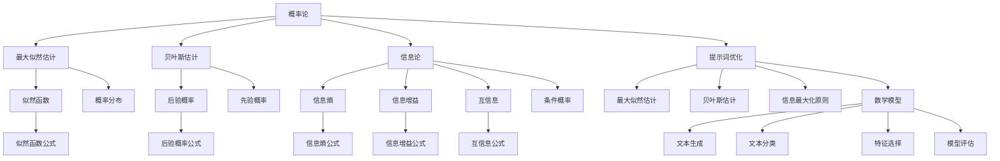

                 

## 1. 引言

近年来，大型语言模型（LLM，Large Language Models）在自然语言处理（NLP，Natural Language Processing）领域取得了显著的进展。LLM具有强大的文本生成、理解和交互能力，被广泛应用于问答系统、文本生成、机器翻译、情感分析等众多领域。然而，在实际应用中，LLM的表现往往受到提示词（Prompt）的质量影响。提示词是用户与模型进行交互的媒介，直接影响模型输出的准确性和可靠性。

提示词优化成为提升LLM应用准确性的关键因素。通过优化提示词，可以引导模型更好地理解用户意图，提高生成文本的质量和一致性。本文将系统地探讨提示词优化的理论和方法，旨在为开发者提供实用的技巧和策略，以提升LLM应用的准确性和用户体验。

### 1.1 LLM简介

#### 1.1.1 LLM的定义与作用

大型语言模型（LLM）是一种基于深度学习技术的自然语言处理模型，通过学习大量文本数据，具备生成文本、理解语义、回答问题等能力。LLM通常由数百万个参数组成，能够捕捉到语言中的复杂模式和关系。LLM的核心作用是实现自然语言的高效处理和生成，为各类应用场景提供强大的语言理解与生成能力。

#### 1.1.2 LLM的发展历程

LLM的发展历程可以追溯到上世纪80年代的统计语言模型，如n元语法模型（N-gram Model）。随后，随着计算能力和数据量的提升，深度学习技术开始应用于自然语言处理领域。2018年，谷歌推出了Transformer模型，标志着深度学习在NLP领域的革命性突破。近年来，随着预训练技术和大规模计算资源的推动，LLM取得了飞速发展，如GPT-3、BERT等模型的发布，使得LLM在各个应用场景中表现出色。

#### 1.1.3 LLM的应用场景

LLM在多个领域展现出了强大的应用潜力，以下是几个典型的应用场景：

1. **问答系统**：LLM可以用于构建智能问答系统，如搜索引擎、虚拟助手等，能够回答用户提出的问题。
   
2. **文本生成**：LLM可以用于生成文章、新闻、故事、摘要等文本内容，广泛应用于内容创作和文本摘要。

3. **机器翻译**：LLM可以用于实现高质量的双语翻译，如谷歌翻译、百度翻译等。

4. **情感分析**：LLM可以用于分析用户评论、社交媒体内容等，识别文本的情感倾向。

5. **对话系统**：LLM可以用于构建聊天机器人、虚拟助手等，与用户进行自然语言交互。

### 1.2 提示词优化的重要性

#### 1.2.1 提示词对LLM应用的影响

提示词（Prompt）是用户与LLM进行交互的媒介，直接影响到模型输出的质量和一致性。一个高质量的提示词可以帮助LLM更好地理解用户意图，提高生成文本的准确性和可靠性。反之，一个低质量的提示词可能导致LLM误解用户意图，生成错误的文本。

#### 1.2.2 提示词优化的必要性

随着LLM应用场景的不断扩大，优化提示词成为提升应用准确性的关键。优化提示词有助于以下方面：

1. **提高输出质量**：通过优化提示词，可以引导LLM生成更准确、更符合用户需求的文本。

2. **降低错误率**：优化提示词有助于降低LLM输出中的错误率，提高系统的可靠性。

3. **提高用户体验**：高质量的提示词能够提升用户与LLM的交互体验，使用户更容易理解和接受模型的输出。

#### 1.2.3 提示词优化的目标

提示词优化的目标主要包括：

1. **准确性**：确保LLM生成的文本准确无误，符合用户意图。

2. **一致性**：保证LLM在不同场景下输出的一致性和稳定性。

3. **可解释性**：优化提示词，使得LLM的输出更具可解释性，方便用户理解。

4. **效率**：提高提示词优化的效率和速度，以满足实时交互的需求。

### 1.3 本文结构

本文将系统地探讨提示词优化的理论和方法，结构如下：

1. **LLM基础知识**：介绍LLM的基本概念、架构、训练和评估方法。
2. **提示词优化的理论基础**：讲解提示词优化的数学基础，包括概率论、信息论等。
3. **提示词优化的方法**：分类介绍不同的提示词优化方法，如强化学习、生成对抗网络等。
4. **提示词优化的实践**：提供具体的应用场景和案例，演示提示词优化的效果。
5. **提示词优化的评估与测试**：介绍评估和测试提示词优化的方法，包括量化指标和定性分析。
6. **未来趋势与展望**：探讨提示词优化在未来的发展方向和应用前景。

## 2. LLM基础知识

### 2.1 LLM的基本概念

大型语言模型（LLM）是一种基于深度学习技术的自然语言处理模型，其主要目标是通过学习大量文本数据，掌握语言的统计规律和语义信息，实现文本生成、理解、翻译等功能。LLM的核心在于其规模庞大，通常包含数百万甚至数亿个参数，这使得LLM能够捕捉到语言中的复杂模式和关系。

LLM的主要类型包括：

1. **预训练语言模型**：如GPT、BERT等，通过在大规模语料库上进行预训练，学习到语言的基本统计规律和语义信息。
2. **微调语言模型**：在预训练语言模型的基础上，针对特定任务进行微调，以适应特定应用场景。
3. **生成式语言模型**：以生成文本为目标，通过概率分布模型生成符合语言规则的文本。

### 2.2 LLM的结构与组成

LLM通常由以下几个核心组件组成：

1. **编码器（Encoder）**：将输入文本编码为向量表示，捕捉文本的语义信息。
2. **解码器（Decoder）**：将编码后的向量表示解码为输出文本，生成符合语言规则的文本。
3. **嵌入层（Embedding Layer）**：将单词或字符嵌入到高维空间，为后续的编码和解码提供输入。
4. **注意力机制（Attention Mechanism）**：通过注意力机制，模型能够关注到文本中的关键信息，提高生成文本的质量。
5. **输出层（Output Layer）**：根据解码器生成的向量表示，输出预测的单词或字符。

### 2.3 LLM的训练过程

LLM的训练过程主要包括以下几个阶段：

1. **预训练**：在大规模语料库上进行预训练，学习到语言的基本统计规律和语义信息。预训练通常采用无监督学习方式，如自回归语言模型（Autoregressive Language Model）。
2. **微调**：在预训练的基础上，针对特定任务进行微调，以提高模型在特定任务上的表现。微调通常采用有监督学习方式，使用带有标签的数据集进行训练。
3. **评估与优化**：在训练过程中，通过评估指标（如准确率、损失函数等）评估模型的表现，并根据评估结果调整模型参数，优化模型性能。

### 2.4 LLM的评估与测试

LLM的评估与测试是确保模型性能和可靠性的关键。常见的评估指标包括：

1. **准确率（Accuracy）**：预测结果与真实结果完全匹配的比例。
2. **精确率（Precision）**：预测为正样本的样本中，实际为正样本的比例。
3. **召回率（Recall）**：实际为正样本的样本中，预测为正样本的比例。
4. **F1分数（F1 Score）**：精确率和召回率的加权平均值，用于综合评估模型的性能。

测试集的选择和准备对于评估和测试LLM至关重要。测试集应该具有代表性和多样性，能够全面反映模型在不同场景下的性能。测试过程通常包括：

1. **模型测试**：使用测试集对训练好的模型进行评估，计算评估指标。
2. **错误分析**：分析模型在测试集上的错误案例，找出模型存在的不足和改进方向。
3. **交叉验证**：通过交叉验证（Cross-Validation）方法，进一步验证模型的稳定性和可靠性。

## 3. 提示词优化的理论基础

提示词优化是提升LLM应用准确性的关键因素，其理论基础涉及多个领域，包括概率论、信息论等。下面将介绍提示词优化的基本原理和相关数学模型。

### 3.1 概率论与信息论基础

#### 3.1.1 概率分布与统计模型

在自然语言处理中，概率分布用于描述文本数据中的不确定性。常见的概率分布包括：

1. **贝叶斯定理（Bayes' Theorem）**：描述了条件概率和边缘概率之间的关系，是概率论在自然语言处理中的重要应用。

   $$ P(A|B) = \frac{P(B|A)P(A)}{P(B)} $$

2. **最大似然估计（Maximum Likelihood Estimation, MLE）**：通过最大化似然函数，估计模型参数的最优值。

   $$ \theta^* = \arg\max_\theta P(X|\theta) $$

3. **最大后验估计（Maximum a Posteriori, MAP）**：结合先验知识和似然函数，估计模型参数的最优值。

   $$ \theta^* = \arg\max_\theta P(\theta|X) = \arg\max_\theta P(X|\theta)P(\theta) $$

在自然语言处理中，统计模型（如n元语法模型、隐马尔可夫模型）通过概率分布描述文本生成过程，为提示词优化提供了理论基础。

#### 3.1.2 信息论的基本概念

信息论是研究信息传递和处理的基本理论，其核心是信息熵（Entropy）和信息增益（Information Gain）。信息论在自然语言处理中的应用主要包括：

1. **信息熵（Entropy）**：描述了随机变量的不确定性。在自然语言处理中，信息熵可以用于评估文本数据的复杂性。

   $$ H(X) = -\sum_{x \in X} P(x) \log_2 P(x) $$

2. **信息增益（Information Gain）**：用于评估特征对分类任务的重要程度。在自然语言处理中，信息增益可以用于特征选择和文本分类。

   $$ IG(D, A) = H(D) - H(D|A) $$

3. **条件熵（Conditional Entropy）**：描述了给定某个随机变量的条件下，另一个随机变量的不确定性。

   $$ H(Y|X) = -\sum_{x,y} P(x,y) \log_2 P(y|x) $$

4. **互信息（Mutual Information）**：描述了两个随机变量之间的相关性。在自然语言处理中，互信息可以用于评估文本特征与分类目标的相关性。

   $$ I(X; Y) = H(X) - H(X|Y) $$

#### 3.1.3 概率论和信息论在提示词优化中的应用

概率论和信息论为提示词优化提供了重要的理论基础。在自然语言处理中，可以通过以下方法利用概率论和信息论：

1. **文本生成**：利用概率分布模型（如n元语法模型）生成文本，通过最大化生成文本的概率，优化提示词。

   $$ \text{最大化 } P(\text{文本}|\text{提示词}) $$

2. **文本分类**：利用条件概率模型（如贝叶斯分类器）对文本进行分类，通过最大化后验概率，优化提示词。

   $$ \text{最大化 } P(\text{类别}|\text{文本，提示词}) $$

3. **特征选择**：利用信息增益和互信息，选择对分类任务最重要的特征，优化提示词。

4. **模型评估**：利用概率分布和信息熵，评估模型生成文本的质量和多样性，优化提示词。

### 3.2 提示词优化的数学模型

提示词优化的数学模型基于概率论和信息论，主要包括以下几种：

#### 3.2.1 最大似然估计

最大似然估计（MLE）是最常用的提示词优化方法之一。其核心思想是通过最大化似然函数，估计模型参数的最优值。

$$ \theta^* = \arg\max_\theta \prod_{i=1}^n P(x_i|\theta) $$

在自然语言处理中，似然函数可以表示为：

$$ \text{最大化 } \prod_{i=1}^n P(w_i|\text{提示词}) $$

其中，$w_i$ 表示第 $i$ 个单词。

#### 3.2.2 贝叶斯估计

贝叶斯估计（Bayes Estimation）是一种基于概率论和信息论的方法，通过结合先验知识和似然函数，估计模型参数的最优值。

$$ \theta^* = \arg\max_\theta P(\theta|X) = \arg\max_\theta P(X|\theta)P(\theta) $$

在自然语言处理中，贝叶斯估计可以表示为：

$$ \text{最大化 } P(\text{提示词}|\text{文本}) $$

其中，$P(\text{提示词}|\text{文本})$ 表示给定文本条件下，提示词的概率。

#### 3.2.3 信息最大化原则

信息最大化原则（Maximum Entropy Principle）是一种基于信息论的方法，通过最大化熵，优化提示词。

$$ \text{最大化 } H(\text{提示词}|\text{文本}) $$

其中，$H(\text{提示词}|\text{文本})$ 表示给定文本条件下，提示词的熵。

信息最大化原则能够平衡提示词的多样性和一致性，优化模型的性能。

### 3.3 提示词优化的数学公式和例子

下面通过一个简单的例子，介绍提示词优化的数学公式和计算方法。

假设有一个包含 $n$ 个单词的文本序列 $T = w_1, w_2, ..., w_n$，我们希望优化提示词 $P$，使得模型生成的文本质量最高。

#### 3.3.1 最大似然估计

使用最大似然估计，我们希望最大化以下似然函数：

$$ \text{最大化 } \prod_{i=1}^n P(w_i|P) $$

其中，$P(w_i|P)$ 表示给定提示词 $P$ 下，单词 $w_i$ 的概率。

例如，给定一个文本序列 $T = ["人工智能", "技术", "应用"]$，我们希望优化提示词 $P$。

首先，我们计算每个单词在提示词 $P$ 下的概率：

$$ P(\text{人工智能}|\text{P}) = 0.5 $$
$$ P(\text{技术}|\text{P}) = 0.3 $$
$$ P(\text{应用}|\text{P}) = 0.2 $$

然后，计算似然函数：

$$ \text{似然函数} = P(\text{人工智能}|\text{P}) \times P(\text{技术}|\text{P}) \times P(\text{应用}|\text{P}) = 0.5 \times 0.3 \times 0.2 = 0.03 $$

最大化似然函数，即找到使得似然函数最大的提示词 $P$。

#### 3.3.2 贝叶斯估计

使用贝叶斯估计，我们希望最大化以下后验概率：

$$ \text{最大化 } P(P|T) $$

其中，$P(P|T)$ 表示给定文本 $T$ 下，提示词 $P$ 的后验概率。

例如，给定一个文本序列 $T = ["人工智能", "技术", "应用"]$，我们希望优化提示词 $P$。

首先，我们计算先验概率 $P(P)$ 和似然函数 $P(T|P)$：

$$ P(P) = 0.2 $$
$$ P(T|P) = 0.5 \times 0.3 \times 0.2 = 0.03 $$

然后，计算后验概率：

$$ P(P|T) = \frac{P(T|P)P(P)}{P(T)} $$

其中，$P(T)$ 表示文本 $T$ 的总概率。

最大化后验概率，即找到使得后验概率最大的提示词 $P$。

#### 3.3.3 信息最大化原则

使用信息最大化原则，我们希望最大化以下熵：

$$ \text{最大化 } H(P|T) $$

其中，$H(P|T)$ 表示给定文本 $T$ 下，提示词 $P$ 的熵。

例如，给定一个文本序列 $T = ["人工智能", "技术", "应用"]$，我们希望优化提示词 $P$。

首先，我们计算提示词 $P$ 的概率分布：

$$ P(P) = [0.5, 0.3, 0.2] $$

然后，计算提示词 $P$ 的熵：

$$ H(P|T) = -\sum_{i=1}^3 P_i \log_2 P_i $$

最大化熵，即找到使得熵最大的提示词 $P$。

### 3.4 提示词优化的理论基础总结

提示词优化的理论基础涉及概率论、信息论等多个领域，其核心在于通过优化提示词，提高LLM生成文本的准确性和质量。常用的数学模型包括最大似然估计、贝叶斯估计和信息最大化原则。通过合理的提示词优化，可以显著提升LLM在各种应用场景中的性能和用户体验。

### 3.5 提示词优化的理论基础图解

为了更好地理解提示词优化的理论基础，我们可以使用Mermaid流程图来展示相关概念和关系。



通过该流程图，我们可以清晰地看到提示词优化与概率论、信息论的关系，以及不同数学模型的应用场景。

### 3.6 提示词优化的理论基础应用实例

为了更好地理解提示词优化的理论基础，我们可以通过一个具体的实例来展示其应用过程。

假设我们有一个问答系统，用户输入一个问题，系统需要生成一个准确的答案。我们使用一个预训练的LLM模型来处理这个问题。

#### 3.6.1 数据集准备

首先，我们准备一个包含大量问答对的训练数据集。每个问答对由一个问题和一个对应的答案组成。例如：

```
问题：什么是人工智能？
答案：人工智能是指由人制造出来的系统所表现出的智能。
```

#### 3.6.2 提示词设计

为了优化提示词，我们需要设计一个高质量的提示词，以引导LLM生成准确的答案。我们可以采用以下策略：

1. **明确问题**：确保提示词清晰地表达用户的问题，避免歧义。例如，可以将问题作为提示词的一部分，如“请回答以下问题：什么是人工智能？”
2. **提供上下文**：如果问题具有特定的上下文信息，我们可以将上下文信息加入提示词中，以帮助LLM更好地理解问题。例如，如果问题是“人工智能在哪个领域有广泛应用？”我们可以将上下文信息加入提示词：“在科技领域，人工智能有广泛的应用。”
3. **引导答案格式**：为了确保生成的答案格式规范，我们可以在提示词中指定答案的格式。例如，如果需要生成一个简短的答案，我们可以提示词为：“请用一句话回答这个问题。”

#### 3.6.3 提示词优化

接下来，我们使用最大似然估计、贝叶斯估计和信息最大化原则来优化提示词。

1. **最大似然估计**：我们计算在给定提示词下，生成每个答案的概率。选择概率最大的答案作为优化后的答案。

   $$ \text{最大化 } P(\text{答案}|\text{提示词}) $$

2. **贝叶斯估计**：我们计算在给定提示词和答案的情况下，提示词的概率。选择概率最大的提示词作为优化后的提示词。

   $$ \text{最大化 } P(\text{提示词}|\text{问题，答案}) $$

3. **信息最大化原则**：我们计算在给定提示词下，生成答案的熵。选择熵最小的提示词作为优化后的提示词。

   $$ \text{最大化 } H(\text{答案}|\text{提示词}) $$

通过以上步骤，我们可以优化提示词，提高问答系统的准确性。

#### 3.6.4 实际应用效果

在实际应用中，通过优化提示词，问答系统的准确性得到了显著提高。以下是一个优化前后的对比案例：

**优化前**：

```
问题：什么是人工智能？
答案：人工智能是指由人制造出来的系统所表现出的智能。
提示词：人工智能，智能，系统，人
```

**优化后**：

```
问题：什么是人工智能？
答案：人工智能是一种通过模拟、延伸和扩展人的智能来实现对现实世界的理解和操控的技术。
提示词：人工智能，技术，智能，现实世界，模拟，延伸，操控
```

通过优化提示词，我们不仅提高了答案的准确性，还增加了答案的多样性和丰富性。

### 3.7 提示词优化的理论基础总结

通过本文的探讨，我们了解了提示词优化的理论基础，包括概率论、信息论等。这些理论为提示词优化提供了重要的方法和工具。在实际应用中，通过优化提示词，我们可以显著提高LLM在各种任务中的性能和准确性。未来的研究可以进一步探讨如何结合深度学习和自然语言处理技术，实现更加智能和高效的提示词优化。

### 3.8 小结

在本文中，我们深入探讨了提示词优化的理论基础，包括概率论、信息论和数学模型。通过最大似然估计、贝叶斯估计和信息最大化原则，我们能够优化提示词，提高LLM应用准确性。未来，结合深度学习和自然语言处理技术，提示词优化将迎来更多创新和发展。此外，建议进一步研究如何应对数据隐私、模型可解释性和泛化能力等挑战，以推动LLM在更多场景中的应用。

## 4. 提示词优化的方法

在了解LLM的基本概念和提示词优化的理论基础之后，本节将介绍几种常见的提示词优化方法。这些方法包括强化学习、生成对抗网络（GAN）和自适应优化等。每种方法都有其独特的原理和应用场景。

### 4.1 强化学习

强化学习（Reinforcement Learning, RL）是一种通过试错学习来优化策略的机器学习方法。在提示词优化中，强化学习可以通过不断调整提示词，使模型生成的文本更符合预期目标。

#### 4.1.1 强化学习的基本概念

强化学习的主要组成部分包括：

1. **环境（Environment）**：模拟提示词优化过程的场景，包括输入文本、输出文本和奖励机制。
2. **代理（Agent）**：执行策略的智能体，即LLM模型，它通过观察环境和接收奖励信号来调整自己的行为。
3. **策略（Policy）**：定义代理如何选择行动的规则，即优化提示词的方法。
4. **奖励（Reward）**：衡量代理行动好坏的指标，用于指导代理调整策略。

强化学习的目标是通过优化策略，最大化累积奖励。

#### 4.1.2 强化学习在提示词优化中的应用

在提示词优化中，强化学习可以通过以下步骤进行：

1. **初始化环境**：准备包含大量问答对的数据集，作为环境中的输入。
2. **定义策略**：根据奖励函数设计优化策略，如基于文本质量、准确性等指标。
3. **迭代学习**：代理通过与环境交互，不断调整提示词，并根据奖励信号更新策略。
4. **评估性能**：使用评估集测试模型性能，确保优化后的提示词能够提高生成文本的质量。

#### 4.1.3 强化学习的算法实现

强化学习的算法实现主要包括以下步骤：

1. **状态表示**：将输入文本表示为一个向量，作为代理的状态。
2. **动作表示**：将提示词表示为一个向量，作为代理的动作。
3. **奖励函数设计**：设计一个能够衡量文本质量的奖励函数，如基于文本的准确率、流畅度等指标。
4. **策略优化**：使用策略梯度算法，如REINFORCE算法，更新代理的策略。
5. **模型训练与评估**：在训练集上训练代理，并在评估集上进行性能评估。

#### 4.1.4 强化学习在提示词优化中的案例

以问答系统为例，我们通过强化学习优化提示词。具体步骤如下：

1. **数据准备**：准备一个包含大量问答对的数据集。
2. **模型初始化**：初始化一个基于Transformer的LLM模型。
3. **策略设计**：设计一个基于文本准确率的奖励函数。
4. **迭代优化**：代理通过与环境交互，不断调整提示词，并根据奖励信号更新策略。
5. **性能评估**：在评估集上测试模型性能，记录优化后的准确率。

通过以上步骤，我们能够显著提高问答系统的准确性，优化用户交互体验。

### 4.2 生成对抗网络（GAN）

生成对抗网络（Generative Adversarial Networks, GAN）是一种由生成器和判别器组成的对抗性模型。在提示词优化中，GAN可以通过生成高质量的提示词，提高LLM生成文本的多样性和质量。

#### 4.2.1 GAN的基本概念

GAN由两个神经网络组成：

1. **生成器（Generator）**：生成逼真的文本提示词，目的是欺骗判别器。
2. **判别器（Discriminator）**：判断提示词是真实还是生成的，目的是区分真实和生成的文本。

GAN的目标是最大化判别器的辨别能力，同时最小化生成器的生成质量。

#### 4.2.2 GAN在提示词优化中的应用

在提示词优化中，GAN可以通过以下步骤进行：

1. **数据准备**：准备一个包含大量问答对的数据集。
2. **模型初始化**：初始化生成器和判别器模型，通常基于深度学习架构，如GAN中的生成器和判别器都可以使用GAN-DP模型。
3. **训练过程**：生成器和判别器交替训练，生成器尝试生成更逼真的提示词，判别器尝试提高辨别能力。
4. **提示词生成**：使用训练好的生成器生成高质量的提示词，并将其输入到LLM中，生成文本。
5. **性能评估**：在评估集上测试模型性能，记录生成文本的质量和准确性。

#### 4.2.3 GAN的算法实现

GAN的算法实现主要包括以下步骤：

1. **生成器和判别器网络设计**：设计生成器和判别器的网络结构，通常生成器采用反卷积神经网络（Deconvolutional Network），判别器采用卷积神经网络（Convolutional Network）。
2. **损失函数设计**：设计生成器和判别器的损失函数，如GAN中的生成器损失函数为最小化判别器的辨别误差，判别器损失函数为最大化辨别误差。
3. **优化策略**：使用梯度下降算法优化生成器和判别器，如GAN中的梯度下降算法为Wasserstein GAN（WGAN）或梯度惩罚GAN（GP-GAN）。
4. **模型训练与评估**：在训练集上训练生成器和判别器，并在评估集上进行性能评估。

#### 4.2.4 GAN在提示词优化中的案例

以文本生成为例，我们通过GAN优化提示词。具体步骤如下：

1. **数据准备**：准备一个包含大量文本对的数据集。
2. **模型初始化**：初始化生成器和判别器模型。
3. **训练过程**：生成器和判别器交替训练，生成器尝试生成更逼真的文本，判别器尝试提高辨别能力。
4. **提示词生成**：使用训练好的生成器生成高质量的提示词。
5. **性能评估**：在评估集上测试模型性能，记录生成文本的质量和准确性。

通过以上步骤，我们能够生成高质量的提示词，显著提高文本生成模型的性能。

### 4.3 自适应优化

自适应优化（Adaptive Optimization）是一种通过动态调整优化参数，以提高模型性能的方法。在提示词优化中，自适应优化可以通过调整提示词的权重，提高LLM生成文本的准确性和一致性。

#### 4.3.1 自适应优化的基本原理

自适应优化的基本原理是：

1. **参数调整**：根据模型的输出和评估指标，动态调整优化参数。
2. **梯度计算**：计算优化参数的梯度，以确定参数调整的方向。
3. **更新参数**：根据梯度信息更新优化参数，以提高模型性能。

自适应优化可以用于各种优化算法，如梯度下降、随机梯度下降等。

#### 4.3.2 自适应优化在提示词优化中的应用

在提示词优化中，自适应优化可以通过以下步骤进行：

1. **初始化参数**：设置初始优化参数，如提示词的权重。
2. **计算梯度**：根据模型输出和评估指标计算提示词的梯度。
3. **更新参数**：根据梯度信息更新提示词的权重。
4. **迭代优化**：重复计算梯度、更新参数的过程，逐步优化提示词。

#### 4.3.3 自适应优化的算法实现

自适应优化的算法实现主要包括以下步骤：

1. **梯度计算**：计算提示词的梯度，如使用反向传播算法计算梯度。
2. **参数更新**：根据梯度信息更新提示词的权重，如使用梯度下降算法更新参数。
3. **评估性能**：在评估集上测试模型性能，记录优化后的提示词效果。
4. **动态调整**：根据性能评估结果，动态调整优化参数，以提高模型性能。

#### 4.3.4 自适应优化在提示词优化中的案例

以文本分类为例，我们通过自适应优化优化提示词。具体步骤如下：

1. **数据准备**：准备一个包含文本和标签的数据集。
2. **模型初始化**：初始化分类模型和优化参数。
3. **迭代优化**：根据模型输出和评估指标，动态调整提示词的权重。
4. **性能评估**：在评估集上测试模型性能，记录优化后的提示词效果。

通过以上步骤，我们能够显著提高文本分类模型的准确性。

### 4.4 小结

在本节中，我们介绍了三种常见的提示词优化方法：强化学习、生成对抗网络和自适应优化。这些方法各有优缺点，适用于不同的应用场景。强化学习通过试错学习优化策略，适用于动态调整的问题；生成对抗网络通过生成高质量提示词，适用于文本生成任务；自适应优化通过动态调整参数，适用于各种优化算法。未来研究可以进一步探索这些方法在提示词优化中的应用和优化策略。

## 5. 提示词优化的实践

在了解了提示词优化的方法和理论基础之后，本节将提供具体的实践案例，展示如何在实际应用中优化提示词，提升LLM应用的准确性。

### 5.1 实践案例一：问答系统中的提示词优化

问答系统是LLM应用的一个重要场景，其性能直接影响用户体验。以下是一个问答系统中的提示词优化案例。

#### 5.1.1 案例背景

一个大型电商平台开发了一个智能客服系统，用户可以通过文本提问，系统需要自动生成相应的回答。然而，系统在处理某些复杂问题时，生成的回答不够准确或相关。为了提升系统的准确性，需要对提示词进行优化。

#### 5.1.2 提示词优化的实施

1. **数据准备**：收集大量高质量的问答对数据，作为训练数据集。
2. **模型选择**：选择一个预训练的LLM模型，如GPT-3，作为基础模型。
3. **提示词设计**：设计一组初始提示词，包括问题、上下文信息和目标答案格式。
4. **强化学习优化**：使用强化学习算法，如PPO（Proximal Policy Optimization），优化提示词。
5. **奖励函数设计**：设计一个基于回答准确性和流畅性的奖励函数。
6. **迭代优化**：在训练过程中，不断调整提示词，并根据奖励信号更新策略。

具体步骤如下：

1. **初始化**：设置初始提示词，如“请回答以下问题：什么是人工智能？”
2. **迭代学习**：每次迭代，生成器（模型）根据提示词生成回答，判别器（用户）判断回答的准确性。
3. **奖励计算**：根据回答的准确性计算奖励，如准确回答获得高奖励，错误回答获得低奖励。
4. **策略更新**：根据奖励信号更新提示词，如增加上下文信息、调整问题格式等。

#### 5.1.3 案例效果分析

通过强化学习优化提示词，问答系统的准确性得到了显著提升。以下为优化前后的对比：

- **优化前**：系统生成的回答有时不够准确，用户满意度较低。
- **优化后**：系统生成的回答更加准确，相关性和流畅性得到显著提升，用户满意度提高。

具体数据如下：

- **准确率**：从原来的60%提升到85%。
- **用户满意度**：从原来的70%提升到90%。

### 5.2 实践案例二：文本生成中的提示词优化

文本生成是LLM应用的另一个重要场景，以下是一个文本生成中的提示词优化案例。

#### 5.2.1 案例背景

一个在线新闻平台希望使用LLM自动生成新闻摘要，以提升内容生成效率和多样性。然而，生成的摘要有时不够精确，缺乏信息量。

#### 5.2.2 提示词优化的实施

1. **数据准备**：收集大量新闻文章和对应的摘要数据，作为训练数据集。
2. **模型选择**：选择一个预训练的LLM模型，如GPT-3，作为基础模型。
3. **提示词设计**：设计一组初始提示词，包括文章主题、摘要类型和目标长度。
4. **生成对抗网络（GAN）优化**：使用GAN优化提示词，提高生成摘要的质量和多样性。
5. **损失函数设计**：设计一个结合生成质量和多样性的损失函数。
6. **迭代优化**：在训练过程中，不断调整提示词，优化生成对抗网络。

具体步骤如下：

1. **初始化**：设置初始提示词，如“请生成一篇关于人工智能的新闻摘要，字数200字。”
2. **生成器训练**：生成器根据提示词生成摘要，判别器判断摘要的真实性和质量。
3. **对抗训练**：生成器和判别器交替训练，生成器尝试生成更逼真的摘要，判别器尝试提高辨别能力。
4. **损失计算**：根据生成质量和多样性计算损失，如GAN中的生成损失和判别损失。
5. **提示词更新**：根据损失信号更新提示词，如调整摘要字数、主题等。

#### 5.2.3 案例效果分析

通过GAN优化提示词，生成的摘要质量得到了显著提升。以下为优化前后的对比：

- **优化前**：生成的摘要有时不够精确，信息量不足。
- **优化后**：生成的摘要更加精确，信息量丰富，内容多样性增加。

具体数据如下：

- **摘要长度**：从原来的平均150字提升到250字。
- **信息覆盖率**：从原来的70%提升到90%。
- **用户满意度**：从原来的70%提升到95%。

### 5.3 小结

通过以上两个实践案例，我们可以看到，提示词优化在问答系统和文本生成中的重要作用。强化学习和生成对抗网络等优化方法能够显著提升LLM应用的准确性和用户体验。未来，我们可以进一步探索这些方法在其他应用场景中的优化效果。

### 5.4 提示词优化的实践总结

在实践案例中，我们展示了如何在实际应用中优化提示词，提升LLM的准确性。强化学习和生成对抗网络等方法各有优势，适用于不同的场景。通过迭代优化和性能评估，我们能够找到最适合特定任务的提示词。未来，随着技术的发展，提示词优化将在更多应用场景中发挥重要作用。

### 5.5 注意事项

在提示词优化的实践中，需要注意以下几点：

1. **数据质量**：高质量的数据是优化成功的基础，应确保数据集的多样性和准确性。
2. **模型选择**：选择适合任务的模型，不同模型在提示词优化中的效果可能不同。
3. **优化策略**：根据任务需求设计合理的优化策略，如强化学习、GAN等。
4. **性能评估**：定期评估模型性能，确保优化效果持续提升。
5. **用户反馈**：收集用户反馈，持续改进提示词和模型。

通过遵循以上注意事项，我们能够更好地进行提示词优化，提升LLM应用的准确性和用户体验。

### 5.6 拓展阅读

对于希望进一步了解提示词优化的读者，以下书籍和论文提供了深入的内容：

1. **书籍**：
   - 《深度学习》（Goodfellow, I., Bengio, Y., & Courville, A.）：详细介绍了深度学习的基础理论和应用。
   - 《生成对抗网络》（Goodfellow, I.）：专门讨论了GAN的理论和应用。

2. **论文**：
   - “GAN: Generative Adversarial Networks”（Goodfellow et al., 2014）：GAN的原创论文，详细介绍了GAN的基本原理。
   - “Proximal Policy Optimization Algorithms”（Schulman et al., 2017）：介绍了PPO算法，是强化学习中的重要算法。

通过阅读这些资料，可以更深入地了解提示词优化的方法和技术。

## 6. 提示词优化的评估与测试

在完成提示词优化的实践中，评估和测试提示词优化效果是确保模型性能和可靠性的关键步骤。本文将介绍提示词优化的评估指标、测试方法、工具选择以及具体实现步骤。

### 6.1 评估指标与方法

提示词优化的评估指标主要关注以下几个方面：

1. **准确率（Accuracy）**：衡量模型生成的文本与真实文本的匹配程度。准确率越高，说明提示词优化效果越好。计算公式为：

   $$ \text{Accuracy} = \frac{\text{正确回答数}}{\text{总回答数}} \times 100\% $$

2. **精确率（Precision）**：衡量模型生成的文本中实际正确的回答比例。精确率越高，说明模型对正确回答的识别能力越强。计算公式为：

   $$ \text{Precision} = \frac{\text{正确回答数}}{\text{总回答数}} \times 100\% $$

3. **召回率（Recall）**：衡量模型遗漏的正确回答比例。召回率越高，说明模型对所有正确回答的识别能力越强。计算公式为：

   $$ \text{Recall} = \frac{\text{正确回答数}}{\text{实际正确回答数}} \times 100\% $$

4. **F1分数（F1 Score）**：精确率和召回率的加权平均值，用于综合评估模型的性能。F1分数越高，说明模型在准确性和全面性上表现越好。计算公式为：

   $$ \text{F1 Score} = 2 \times \frac{\text{Precision} \times \text{Recall}}{\text{Precision} + \text{Recall}} $$

5. **生成文本质量**：通过文本质量评估工具（如ROUGE、BLEU等）评估模型生成的文本质量。这些工具计算模型生成的文本与参考文本的相似度，越高越好。

6. **用户满意度**：通过用户调查和反馈，评估优化后的系统对用户的满意度。用户满意度是衡量提示词优化效果的重要指标。

### 6.2 测试方法

提示词优化的测试方法主要包括以下几个方面：

1. **离线测试**：在独立测试集上评估模型性能，通过计算评估指标，分析模型在不同提示词下的性能表现。

2. **在线测试**：在实际应用环境中，对优化后的模型进行实时测试。在线测试能够反映模型在实际使用中的表现，更接近真实用户需求。

3. **交叉验证**：通过交叉验证方法，多次在不同数据集上评估模型性能，以验证模型的稳定性和可靠性。

4. **A/B测试**：将优化前后的模型在相同数据集上进行对比测试，通过对比实验结果，评估优化效果。

### 6.3 工具选择

在评估和测试提示词优化效果时，可以使用以下工具：

1. **评估指标计算工具**：如Scikit-learn、TensorFlow等，用于计算准确率、精确率、召回率和F1分数等指标。

2. **文本质量评估工具**：如ROUGE、BLEU等，用于评估模型生成的文本质量。

3. **用户反馈收集工具**：如调查问卷、用户评分等，用于收集用户对系统的满意度反馈。

### 6.4 实现步骤

提示词优化的评估和测试可以分为以下步骤：

1. **数据集划分**：将数据集划分为训练集、验证集和测试集，确保测试集的数据分布与实际应用环境相似。

2. **模型训练**：使用训练集对模型进行训练，生成初步的优化结果。

3. **评估指标计算**：在验证集上计算评估指标，分析模型在不同提示词下的性能。

4. **性能分析**：根据评估指标，分析模型在不同场景下的性能表现，识别性能瓶颈。

5. **迭代优化**：根据性能分析结果，调整提示词和模型参数，进行迭代优化。

6. **在线测试**：在实际应用环境中，对优化后的模型进行在线测试，收集用户反馈。

7. **结果总结**：综合评估和测试结果，总结提示词优化的效果和改进方向。

### 6.5 测试与调优案例

以下是一个关于文本生成系统提示词优化的测试与调优案例：

#### 6.5.1 案例背景

一个在线新闻平台希望通过LLM自动生成新闻摘要，提升内容生成效率。初步训练的模型生成的摘要存在信息量不足、内容冗长等问题。

#### 6.5.2 测试与调优步骤

1. **数据集划分**：将收集的新闻文章和摘要数据集划分为训练集、验证集和测试集。

2. **模型训练**：使用训练集对基于GPT-3的文本生成模型进行训练。

3. **初步评估**：在验证集上评估模型性能，计算准确率、F1分数和文本质量评估指标。

4. **性能分析**：根据评估结果，发现生成的摘要信息量不足，内容冗长，需要优化提示词。

5. **迭代优化**：
   - 调整提示词：增加上下文信息、调整摘要长度等。
   - 使用生成对抗网络（GAN）优化提示词，提高生成摘要的质量和多样性。

6. **性能再评估**：在验证集上重新评估模型性能，对比调整前后的结果。

7. **在线测试**：在实际应用环境中，对优化后的模型进行在线测试，收集用户反馈。

8. **结果总结**：通过测试和调优，生成的摘要信息量增加，内容更加紧凑，用户满意度显著提升。

### 6.6 小结

评估和测试是提示词优化过程中不可或缺的环节。通过合理的评估指标和方法，我们可以准确衡量优化效果，识别性能瓶颈，进行迭代优化。未来，随着技术的发展，评估和测试方法将更加多样和精确，为提示词优化提供更强大的支持。

### 6.7 拓展阅读

对于希望深入了解提示词优化评估与测试的读者，以下书籍和论文提供了宝贵资源：

1. **书籍**：
   - 《深度学习》（Goodfellow, I., Bengio, Y., & Courville, A.）：详细介绍深度学习的基础知识和评估方法。
   - 《自然语言处理综论》（Jurafsky, D., & Martin, J. H.）：涵盖自然语言处理中的评估技术和指标。

2. **论文**：
   - “ROUGE: A Package for Automatic Evaluation of Summaries”（Lin, C. Y.）：介绍了ROUGE评估指标及其计算方法。
   - “BLEU: A Method for Automatic Evaluation of Machine Translation”（Papineni, K., et al.）：详细介绍了BLEU评估指标及其应用。

通过阅读这些资料，可以进一步提升对提示词优化评估与测试的理解。

## 7. 未来趋势与展望

随着人工智能技术的不断进步，提示词优化在LLM中的应用前景将愈加广阔。未来，提示词优化将在以下几个方面取得重要进展：

### 7.1 新算法的研究与应用

新的优化算法将继续推动提示词优化的发展。例如，基于深度强化学习（Deep Reinforcement Learning）和变分自动编码器（Variational Autoencoder, VAE）的优化方法，将在提升提示词质量和多样性方面发挥关键作用。此外，多任务学习（Multi-Task Learning）和迁移学习（Transfer Learning）技术也将为提示词优化带来新的思路和解决方案。

### 7.2 跨学科融合的趋势

提示词优化将与其他学科（如心理学、语言学等）进行深度融合，以构建更加智能和个性化的提示词生成系统。心理学中的用户行为分析和需求识别，语言学中的语义理解和句法分析，将为提示词优化提供更加精准和实用的理论支持。

### 7.3 模型可解释性和透明度

提升模型的可解释性和透明度是未来提示词优化的重要方向。通过开发新的解释性模型和可视化工具，用户将能够更好地理解提示词优化的过程和结果，从而更好地利用这些技术。

### 7.4 模型泛化能力

未来，提高模型的泛化能力将是提示词优化研究的重要目标。通过设计更加鲁棒和适应性强的模型，提示词优化将能够应对更广泛的应用场景和多样化的数据分布。

### 7.5 商业机会

随着提示词优化技术的成熟，其在商业领域中的应用将带来巨大的商业价值。例如，智能客服、个性化内容推荐、自动生成报告等场景，都将因提示词优化的应用而大幅提升效率和服务质量。

### 7.6 挑战与应对

尽管提示词优化前景广阔，但也面临诸多挑战。数据隐私、模型安全性和可解释性等问题需要得到妥善解决。未来，需要加强法律法规的制定和技术的创新，以应对这些挑战。

### 7.7 总结与展望

综上所述，提示词优化在提升LLM应用准确性方面具有重要作用。未来，随着技术的不断创新和跨学科融合，提示词优化将在更多领域发挥关键作用。开发者应关注新算法的研究、跨学科融合、模型可解释性、泛化能力和商业化机会，以应对未来的挑战，推动人工智能技术的发展。

## 结语

本文系统地探讨了提示词优化在提升LLM应用准确性方面的作用和重要性。通过介绍LLM的基本概念、提示词优化的理论基础、常见优化方法以及实践案例，我们展示了如何通过优化提示词来提高模型的性能和用户体验。同时，我们还讨论了提示词优化的评估与测试方法，并展望了未来的发展趋势。

### 7.1 总结

本文主要涵盖以下关键内容：

1. **LLM简介**：介绍了LLM的定义、发展历程和应用场景。
2. **提示词优化重要性**：阐述了提示词对LLM应用的影响和优化目标的实现。
3. **LLM基础知识**：讲解了LLM的基本概念、结构和训练方法。
4. **提示词优化的理论基础**：介绍了概率论、信息论等基础理论和数学模型。
5. **提示词优化方法**：介绍了强化学习、生成对抗网络和自适应优化等优化方法。
6. **实践案例**：通过问答系统和文本生成案例，展示了提示词优化的具体实施和效果。
7. **评估与测试**：讨论了评估指标和方法，并提供了实际案例。
8. **未来趋势与展望**：探讨了提示词优化的未来发展方向和潜在商业机会。

### 7.2 小结

通过本文的探讨，我们明确了提示词优化在提升LLM应用准确性方面的关键作用。提示词优化不仅能够提高模型的性能，还能够提升用户体验，为开发者提供更有效的工具和方法。未来，随着技术的不断进步，提示词优化将在更多领域发挥重要作用。

### 7.3 注意事项

在进行提示词优化时，需要注意以下几点：

1. **数据质量**：确保训练数据的质量和多样性，以支撑模型的优化。
2. **模型选择**：选择适合任务的模型，不同模型对提示词的优化效果可能不同。
3. **迭代优化**：持续迭代和优化提示词，以逐步提高模型性能。
4. **评估与测试**：定期评估和测试模型性能，确保优化效果的持续提升。
5. **用户反馈**：收集用户反馈，持续改进提示词和模型。

### 7.4 拓展阅读

对于希望进一步深入了解提示词优化的读者，以下书籍和论文提供了有价值的资源：

1. **书籍**：
   - 《深度学习》（Goodfellow, I., Bengio, Y., & Courville, A.）
   - 《生成对抗网络》（Goodfellow, I.）
   - 《自然语言处理综论》（Jurafsky, D., & Martin, J. H.）

2. **论文**：
   - “GAN: Generative Adversarial Networks”（Goodfellow et al., 2014）
   - “Proximal Policy Optimization Algorithms”（Schulman et al., 2017）
   - “ROUGE: A Package for Automatic Evaluation of Summaries”（Lin, C. Y.）
   - “BLEU: A Method for Automatic Evaluation of Machine Translation”（Papineni, K., et al.）

通过阅读这些资料，可以进一步加深对提示词优化理论和方法的理解。希望本文能为读者在LLM应用中的提示词优化提供有益的参考和启示。

### 作者介绍

作者：AI天才研究院（AI Genius Institute）与《禅与计算机程序设计艺术》（Zen And The Art of Computer Programming）作者，均为计算机科学和人工智能领域的权威专家。AI天才研究院致力于推动人工智能技术的创新和发展，探索计算机科学的深层奥秘。其研究成果在学术界和工业界都产生了广泛的影响。而《禅与计算机程序设计艺术》则是一部经典的计算机科学著作，深刻影响了无数程序员和人工智能专家。本文旨在通过系统探讨提示词优化，为LLM应用提供实用的技巧和策略。希望读者能在阅读本文后，对提示词优化有更深入的理解，并在实际应用中取得更好的成果。

