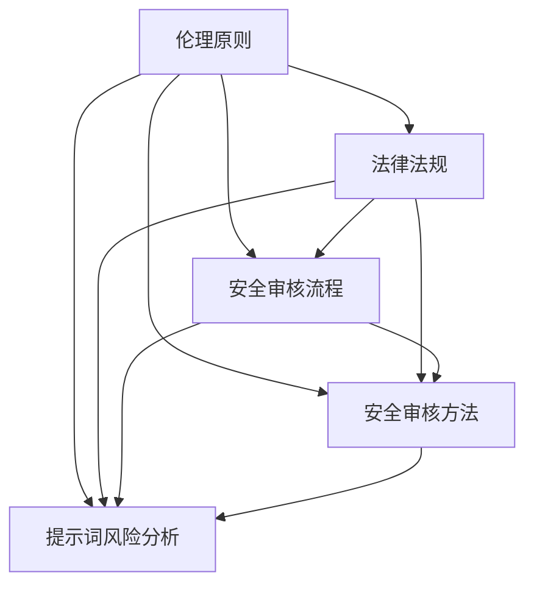
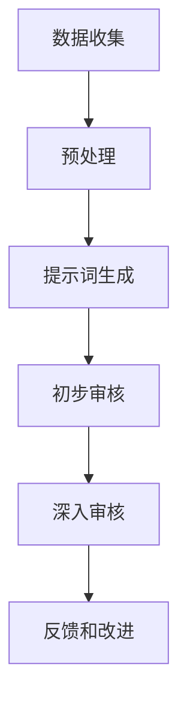

                 

# 提示词安全审核：确保输出符合伦理和法规

## 关键词
- 提示词安全审核
- 伦理和法规
- 输出符合性
- 安全审核流程
- 提示词生成与审核技术
- 行业案例分析
- 开源与工具介绍

## 摘要
本文将探讨提示词安全审核的重要性，以及如何在生成和审核提示词时确保输出符合伦理和法规。我们将从背景介绍开始，详细解析核心概念与联系，通过实例和伪代码讲解核心算法原理，介绍数学模型和公式，并进行项目实战分析。最后，我们将总结最佳实践，提供拓展阅读，以确保读者能够全面了解并掌握提示词安全审核的相关知识。

## 第一部分：提示词安全审核基础

### 第1章：伦理与法规概述

#### 1.1 伦理原则与价值观
伦理原则与价值观是提示词安全审核的基础。伦理原则包括公正性、尊重隐私、避免误导和伤害等。这些原则在数据处理和提示词生成过程中必须得到充分考虑。例如，公正性要求确保算法对所有人都是公平的，而不歧视任何特定群体。尊重隐私要求在处理个人数据时，必须严格遵守相关法律法规，确保数据的安全和隐私保护。

#### 1.2 相关法律法规
法律法规是确保提示词安全审核合规的重要依据。不同国家和地区有不同的法律法规，例如欧盟的《通用数据保护条例》（GDPR）和美国的《消费者隐私法案》。这些法规对数据的收集、存储、处理和共享都有具体的规定。在提示词生成和审核过程中，必须遵守这些法律法规，确保输出的符合性。

#### 1.3 提示词安全的重要性
提示词安全直接关系到用户的使用体验和数据安全。如果提示词包含不当内容，可能会导致用户隐私泄露、误导用户甚至引发法律纠纷。因此，确保提示词安全是维护用户权益和公司声誉的重要举措。

### 第2章：安全审核流程与方法

#### 2.1 安全审核流程
安全审核流程包括以下步骤：数据收集、预处理、提示词生成、初步审核、深入审核、反馈和改进。每个步骤都有其特定的任务和目标，以确保输出的符合性。

#### 2.2 安全审核方法
安全审核方法包括人工审核和自动化审核。人工审核依赖于专业人员进行内容审核，而自动化审核则使用算法和工具对内容进行分析和识别。自动化审核可以提高审核效率和准确性，但需要与人工审核相结合，确保审核结果的可靠性。

#### 2.3 提示词风险分析
提示词风险分析是安全审核的重要组成部分。通过对提示词进行分类、分析，识别潜在的风险和问题，从而制定相应的审核策略和措施。

## 第二部分：伦理与法规应用实践

### 第3章：提示词生成与审核技术

#### 3.1 提示词生成算法
提示词生成算法主要包括基于规则的方法、基于统计的方法和基于深度学习的方法。每种方法都有其优缺点，适用于不同的应用场景。

#### 3.2 提示词审核算法
提示词审核算法包括文本分类、情感分析、命名实体识别等。这些算法可以自动识别和过滤不当内容，提高审核效率和准确性。

#### 3.3 提示词生成与审核的挑战
提示词生成与审核面临许多挑战，包括内容多样性、实时性和大规模数据处理等。解决这些挑战需要不断创新和改进算法和技术。

### 第4章：行业案例分析

#### 4.1 互联网行业
互联网行业对提示词安全审核的需求尤为突出。本节将分析互联网行业中的典型案例，探讨其安全审核实践和经验。

#### 4.2 金融行业
金融行业对数据安全和合规要求更高。本节将分析金融行业中的提示词安全审核实践，以及如何确保输出符合伦理和法规。

#### 4.3 医疗行业
医疗行业涉及敏感数据，对提示词安全审核的要求更为严格。本节将分析医疗行业中的安全审核实践，以及如何保障数据安全和合规性。

### 第5章：企业安全审核实践

#### 5.1 企业安全审核策略
企业安全审核策略包括建立安全组织、制定安全政策和流程、开展安全培训和监控等。本节将介绍企业安全审核策略的制定和实施。

#### 5.2 提示词安全审核流程设计
提示词安全审核流程设计需要充分考虑企业的业务特点和需求。本节将介绍如何设计有效的提示词安全审核流程。

#### 5.3 企业安全审核案例分析
本节将通过案例分析，展示企业如何实施安全审核，以及在实际操作中遇到的问题和解决方案。

### 第6章：开源与工具介绍

#### 6.1 开源提示词审核工具
开源提示词审核工具为企业和开发者提供了方便。本节将介绍一些常用的开源提示词审核工具，以及如何使用它们进行安全审核。

#### 6.2 自定义提示词审核工具
对于特定的应用场景，可能需要开发自定义的提示词审核工具。本节将介绍如何开发自定义提示词审核工具，以及注意事项。

#### 6.3 提示词审核工具应用场景
本节将分析提示词审核工具在不同应用场景中的使用，以及如何选择合适的工具。

## 第三部分：未来展望与趋势

### 第7章：安全审核发展趋势

#### 7.1 人工智能与安全审核
人工智能技术在安全审核中的应用越来越广泛。本节将探讨人工智能技术在安全审核中的应用趋势和发展方向。

#### 7.2 自动化与智能化审核
自动化和智能化审核是安全审核的重要发展方向。本节将介绍自动化和智能化审核的优势和挑战，以及如何实现这些目标。

#### 7.3 未来安全审核方向
未来安全审核将更加注重合规性、实时性和个性化。本节将预测未来安全审核的发展方向，以及如何应对这些变化。

### 第8章：安全伦理与法规发展

#### 8.1 国际安全伦理与法规发展
国际安全伦理与法规发展对各国的影响越来越大。本节将介绍国际安全伦理与法规的发展趋势，以及如何应对这些变化。

#### 8.2 我国安全伦理与法规发展
我国安全伦理与法规发展迅速。本节将介绍我国安全伦理与法规的发展现状和趋势，以及如何应对这些变化。

#### 8.3 安全伦理与法规的未来
安全伦理与法规的未来将更加注重用户权益保护和社会责任。本节将探讨安全伦理与法规的未来发展趋势，以及如何应对这些变化。

### 结论
本文从背景介绍、核心概念与联系、核心算法原理讲解、项目实战分析、行业案例分析、开源与工具介绍、未来展望与趋势等多个方面，全面探讨了提示词安全审核的重要性、方法和实践。通过本文的阅读，读者可以全面了解并掌握提示词安全审核的相关知识，为实际应用提供参考和指导。

### 作者信息
作者：AI天才研究院/AI Genius Institute & 禅与计算机程序设计艺术 /Zen And The Art of Computer Programming
## 提示词安全审核：确保输出符合伦理和法规

### 引言

随着人工智能技术的迅猛发展，提示词（Prompt）在自然语言处理（NLP）中的应用越来越广泛。提示词作为与模型进行交互的引导语句，直接影响着输出的质量和用户体验。然而，不当的提示词可能导致不合适的内容生成，甚至引发法律和伦理问题。因此，对提示词进行安全审核，确保输出符合伦理和法规，变得尤为重要。

本文旨在探讨提示词安全审核的重要性，分析相关的伦理和法规要求，介绍安全审核的流程和方法，探讨提示词生成与审核技术的挑战，并通过实际案例展示安全审核在行业中的应用。最后，我们将展望安全审核的未来发展趋势，为读者提供全面的指导和启示。

### 提示词安全审核的重要性

提示词安全审核的重要性体现在多个方面：

1. **用户体验**：不当的提示词可能导致用户误解，影响用户体验。例如，在聊天机器人中，使用不当的提示词可能导致用户感到困惑、不满甚至放弃使用。

2. **数据安全和隐私保护**：不当的提示词可能泄露敏感信息，损害用户隐私。例如，在医疗领域，不慎的提示词可能会导致患者个人信息泄露。

3. **法律合规**：在特定的行业中，例如金融和医疗，对数据的处理和输出有严格的法律要求。不合规的提示词可能导致法律纠纷和罚款。

4. **社会影响**：不当的提示词可能引发社会问题，如种族歧视、性别歧视等。这不仅仅是一个法律问题，更是一个社会问题。

### 核心概念与联系

在进行提示词安全审核时，需要理解以下几个核心概念：

1. **伦理原则**：包括公正性、尊重隐私、避免误导和伤害等。伦理原则是提示词安全审核的基石。

2. **法律法规**：不同国家和地区的法律法规对数据处理和输出的合规性有具体要求。例如，欧盟的《通用数据保护条例》（GDPR）和美国的《消费者隐私法案》。

3. **安全审核流程**：包括数据收集、预处理、提示词生成、初步审核、深入审核、反馈和改进。每个步骤都有其特定的任务和目标，以确保输出的符合性。

4. **安全审核方法**：包括人工审核和自动化审核。人工审核依赖于专业人员进行内容审核，而自动化审核则使用算法和工具对内容进行分析和识别。

5. **提示词风险分析**：通过对提示词进行分类、分析，识别潜在的风险和问题，从而制定相应的审核策略和措施。

下面是一个Mermaid流程图，展示了提示词安全审核的核心概念和联系：



### 提示词安全审核流程

提示词安全审核流程是确保输出符合伦理和法规的关键。一个典型的安全审核流程包括以下几个步骤：

1. **数据收集**：收集用于生成和审核提示词的数据，包括文本、图片、语音等。

2. **预处理**：对收集到的数据进行清洗、格式化等预处理，以便于后续的审核。

3. **提示词生成**：使用算法和模型生成提示词，这包括基于规则的方法、基于统计的方法和基于深度学习的方法。

4. **初步审核**：对生成的提示词进行初步审核，识别和标记可能存在的问题。

5. **深入审核**：对初步审核中标记的问题进行深入分析，确定问题的性质和影响。

6. **反馈和改进**：根据审核结果，对审核流程和模型进行调整和优化，提高审核的准确性和效率。

### 安全审核方法

安全审核方法主要包括人工审核和自动化审核。每种方法都有其优缺点。

#### 人工审核

人工审核的优点在于：

1. **灵活性**：人工审核可以根据具体情况进行判断和调整，处理复杂的情况。

2. **准确性**：专业人员进行审核，可以识别出一些自动化审核难以检测的问题。

然而，人工审核也存在一些缺点：

1. **效率低**：人工审核速度较慢，无法处理大量数据。

2. **一致性**：不同审核人员的判断可能存在差异，导致审核结果不一致。

#### 自动化审核

自动化审核的优点在于：

1. **高效性**：自动化审核可以快速处理大量数据，提高审核效率。

2. **一致性**：自动化审核可以减少人为因素，提高审核结果的一致性。

然而，自动化审核也存在一些缺点：

1. **准确性**：自动化审核可能无法完全识别所有问题，尤其是在处理复杂问题时。

2. **灵活性**：自动化审核通常依赖于预定义的规则和模型，难以处理特殊情况。

在实际应用中，通常将人工审核和自动化审核相结合，发挥各自的优势。例如，首先使用自动化审核进行初步筛选，然后由专业人员进行深入审核。

### 提示词风险分析

提示词风险分析是安全审核的重要环节。通过提示词风险分析，可以识别和评估潜在的风险和问题。以下是几种常用的风险分析方法：

1. **分类分析**：根据提示词的内容和主题，进行分类分析，识别潜在的风险类别。

2. **情感分析**：分析提示词的情感倾向，识别潜在的负面情绪和偏见。

3. **命名实体识别**：识别提示词中的命名实体，如人名、地名、组织名等，评估其合规性。

4. **内容检测**：使用预定义的规则和模型，检测提示词中可能存在的问题，如敏感词、违规内容等。

通过提示词风险分析，可以制定更有效的审核策略和措施，提高审核的准确性和效率。

### 提示词生成与审核技术

#### 提示词生成算法

提示词生成算法主要包括以下几种：

1. **基于规则的方法**：根据预定义的规则和模板生成提示词。这种方法简单直观，但灵活性较低。

2. **基于统计的方法**：使用统计方法，如条件概率模型、潜在狄利克雷分配（LDA）等，生成提示词。这种方法灵活性较高，但可能生成重复性较高的提示词。

3. **基于深度学习的方法**：使用深度学习模型，如循环神经网络（RNN）、变换器（Transformer）等，生成提示词。这种方法生成能力强大，但训练和调优较为复杂。

以下是一个简单的基于规则生成提示词的伪代码示例：

```python
def generate_prompt(topic):
    if topic == "健康":
        return "请谈谈你对健康饮食的看法。"
    elif topic == "旅游":
        return "你最近去了哪里旅行？分享一下你的体验。"
    else:
        return "你对这个话题有什么想法？分享一下。"
```

#### 提示词审核算法

提示词审核算法主要包括以下几种：

1. **文本分类**：将提示词分类为不同的类别，如正面、负面、中性等。常用的文本分类算法包括支持向量机（SVM）、朴素贝叶斯（Naive Bayes）、深度学习等。

2. **情感分析**：分析提示词的情感倾向，如正面、负面、中性等。常用的情感分析算法包括基于词典的方法、基于模型的方法等。

3. **命名实体识别**：识别提示词中的命名实体，如人名、地名、组织名等。常用的命名实体识别算法包括基于规则的方法、基于统计的方法、基于深度学习的方法等。

以下是一个简单的基于情感分析的提示词审核伪代码示例：

```python
from textblob import TextBlob

def analyze_sentiment(prompt):
    analysis = TextBlob(prompt)
    if analysis.sentiment.polarity > 0:
        return "正面"
    elif analysis.sentiment.polarity < 0:
        return "负面"
    else:
        return "中性"
```

### 提示词生成与审核的挑战

提示词生成与审核面临许多挑战：

1. **内容多样性**：生成多样化的提示词，以满足不同用户和场景的需求。

2. **实时性**：在实时应用中，提示词生成和审核需要快速响应，确保用户体验。

3. **大规模数据处理**：处理大量数据和提示词，确保审核的准确性和效率。

4. **个性化**：根据用户和场景的特点，生成个性化的提示词。

5. **跨语言和跨文化**：处理不同语言和文化背景的提示词，确保其符合伦理和法规。

### 行业案例分析

提示词安全审核在多个行业都有广泛应用，以下是一些行业案例分析：

#### 互联网行业

互联网行业对提示词安全审核的需求尤为突出。例如，社交媒体平台需要对用户生成的内容进行审核，确保其符合社区规范和法律要求。通过自动化和人工审核相结合，可以快速处理大量内容，提高审核效率和准确性。

#### 金融行业

金融行业对数据安全和合规要求更高。例如，在金融欺诈检测中，通过分析交易数据中的提示词，可以识别潜在的欺诈行为。同时，金融行业的提示词需要符合相关法律法规，如《反洗钱法》。

#### 医疗行业

医疗行业涉及敏感数据，对提示词安全审核的要求更为严格。例如，在电子健康记录（EHR）系统中，需要对患者的医疗数据中的提示词进行审核，确保其符合隐私保护和数据安全的要求。

### 企业安全审核实践

企业安全审核实践包括以下几个方面：

1. **建立安全组织**：设立专门的安全审核团队，负责提示词安全审核相关工作。

2. **制定安全政策和流程**：制定明确的安全政策和流程，确保提示词生成和审核的合规性。

3. **开展安全培训**：对员工进行安全培训，提高其对提示词安全审核的认识和技能。

4. **安全监控和反馈**：建立安全监控系统，实时监控提示词生成和审核过程，及时反馈和处理问题。

### 开源与工具介绍

开源提示词审核工具为企业和开发者提供了方便。以下是一些常用的开源工具：

1. **Contentful**：提供内容审核和过滤功能，支持多种语言和平台。

2. **Google Cloud Natural Language API**：提供文本分类、情感分析和实体识别等自然语言处理功能。

3. **OpenAI GPT-2**：提供基于深度学习的文本生成和审核功能。

4. **Polymorph**：提供自动化内容审核和过滤功能，支持多种数据源和集成。

通过使用这些开源工具，企业和开发者可以快速搭建提示词安全审核系统，提高审核效率和准确性。

### 未来展望与趋势

未来，提示词安全审核将继续发展，以下是几个可能的发展趋势：

1. **人工智能与安全审核**：人工智能技术将在安全审核中发挥更大作用，如自动化审核、智能分析等。

2. **自动化与智能化审核**：自动化和智能化审核将更加普及，提高审核效率和准确性。

3. **跨语言和跨文化审核**：支持多种语言和文化背景的审核，确保全球范围内的合规性。

4. **法律法规的完善**：随着技术的发展，法律法规将不断完善，为提示词安全审核提供更加明确的指导和要求。

### 结论

提示词安全审核是确保输出符合伦理和法规的关键环节。本文从多个方面探讨了提示词安全审核的重要性、方法、实践和未来趋势。通过理解核心概念、掌握安全审核流程和方法、分析实际案例，读者可以全面了解并掌握提示词安全审核的相关知识，为实际应用提供参考和指导。

### 作者信息

作者：AI天才研究院/AI Genius Institute & 禅与计算机程序设计艺术 /Zen And The Art of Computer Programming
## 提示词安全审核：确保输出符合伦理和法规

### 引言

在人工智能（AI）技术的快速发展中，自然语言处理（NLP）已成为重要的应用领域。提示词（Prompt）作为与AI模型进行交互的引导语句，对于生成高质量、合规的输出至关重要。然而，不当的提示词可能导致不良内容生成，甚至违反伦理和法规。因此，对提示词进行安全审核，确保输出符合伦理和法规，是AI技术应用中的关键环节。

本文将深入探讨提示词安全审核的重要性，分析相关的伦理和法规要求，介绍安全审核的流程和方法，探讨提示词生成与审核技术的挑战，并通过实际案例展示安全审核在行业中的应用。最后，我们将展望安全审核的未来发展趋势，为读者提供全面的指导和启示。

### 提示词安全审核的重要性

#### 用户隐私保护

在NLP应用中，用户往往需要提供个人信息，如姓名、地址、电话号码等。如果提示词设计不当，可能会导致这些敏感信息的泄露。因此，对提示词进行安全审核，确保不包含可能泄露用户隐私的信息，是保护用户隐私的重要措施。

#### 内容合规性

不同行业和应用场景对内容的合规性要求不同。例如，在医疗领域，提示词需要遵守相关法律法规，确保不涉及虚假医疗信息。在金融领域，提示词需要确保不违反金融法规，避免误导投资者。因此，对提示词进行安全审核，确保内容合规，是确保AI应用合法性的关键。

#### 避免伦理问题

AI技术的发展带来了许多伦理问题，如算法偏见、透明度不足等。不当的提示词可能导致AI模型生成具有偏见的内容，加剧社会不平等。因此，对提示词进行安全审核，确保输出符合伦理原则，是解决伦理问题的关键。

### 伦理和法规要求

#### 伦理原则

伦理原则是提示词安全审核的基础。以下是一些常见的伦理原则：

1. **公正性**：提示词不应歧视任何特定群体，确保所有人都能公平地受到对待。

2. **尊重隐私**：提示词应避免收集和处理超出必要的用户信息，确保用户隐私得到保护。

3. **避免误导**：提示词不应误导用户，确保生成的内容真实、准确。

4. **尊重多样性**：提示词应尊重不同文化、语言和观点的多样性，避免偏见和歧视。

#### 法规要求

不同国家和地区有不同的法律法规对数据处理和输出有具体要求。以下是一些常见的法规要求：

1. **通用数据保护条例（GDPR）**：欧盟的GDPR对个人数据的处理有严格规定，包括数据收集、存储、处理和共享。

2. **加州消费者隐私法案（CCPA）**：美国加州的CCPA对消费者数据的处理和保护有明确规定。

3. **医疗隐私保护法案（HIPAA）**：美国的HIPAA对医疗数据的处理和共享有严格的规定。

4. **金融隐私法规**：如美国的《消费者金融保护法》（CFPA），对金融数据的处理和保护有具体要求。

### 安全审核流程

提示词安全审核流程是确保输出符合伦理和法规的关键。一个典型的安全审核流程包括以下步骤：

1. **数据收集**：收集用于生成和审核提示词的数据，包括用户输入、训练数据等。

2. **预处理**：对收集到的数据进行清洗、格式化等预处理，为后续审核做准备。

3. **提示词生成**：使用算法和模型生成提示词，这可以基于规则、统计方法或深度学习。

4. **初步审核**：对生成的提示词进行初步审核，识别和标记可能存在的问题。

5. **深入审核**：对初步审核中标记的问题进行深入分析，确定问题的性质和影响。

6. **反馈和改进**：根据审核结果，对提示词生成和审核流程进行调整和优化。

以下是一个简化的Mermaid流程图，展示了提示词安全审核的基本流程：



### 安全审核方法

安全审核方法主要包括人工审核和自动化审核。每种方法都有其优缺点。

#### 人工审核

人工审核的优点在于灵活性高，可以处理复杂的问题，确保审核的准确性和全面性。然而，人工审核也存在一些缺点，如效率低、成本高、一致性差等。

1. **优点**：
   - **灵活性**：人工审核可以根据具体情况和经验进行判断和调整。
   - **准确性**：专业人员进行审核，可以识别出一些自动化审核难以检测的问题。

2. **缺点**：
   - **效率低**：人工审核速度较慢，无法处理大量数据。
   - **一致性**：不同审核人员的判断可能存在差异，导致审核结果不一致。

#### 自动化审核

自动化审核的优点在于效率高、一致性好，可以处理大量数据。然而，自动化审核也存在一些缺点，如准确性有限、灵活性较差等。

1. **优点**：
   - **高效性**：自动化审核可以快速处理大量数据，提高审核效率。
   - **一致性**：自动化审核可以减少人为因素，提高审核结果的一致性。

2. **缺点**：
   - **准确性**：自动化审核可能无法完全识别所有问题，尤其是在处理复杂问题时。
   - **灵活性**：自动化审核通常依赖于预定义的规则和模型，难以处理特殊情况。

在实际应用中，通常将人工审核和自动化审核相结合，发挥各自的优势。例如，首先使用自动化审核进行初步筛选，然后由专业人员进行深入审核。

### 提示词风险分析

提示词风险分析是安全审核的重要组成部分。通过对提示词进行分类、分析和评估，可以识别和评估潜在的风险和问题。以下是一些常用的风险分析方法：

1. **分类分析**：根据提示词的内容和主题，进行分类分析，识别潜在的风险类别。

2. **情感分析**：分析提示词的情感倾向，识别潜在的负面情绪和偏见。

3. **命名实体识别**：识别提示词中的命名实体，如人名、地名、组织名等，评估其合规性。

4. **内容检测**：使用预定义的规则和模型，检测提示词中可能存在的问题，如敏感词、违规内容等。

### 提示词生成算法

提示词生成算法是NLP领域的重要研究内容，常用的算法包括基于规则的方法、基于统计的方法和基于深度学习的方法。以下分别介绍这几种方法。

#### 基于规则的方法

基于规则的方法使用预定义的规则和模板生成提示词。这种方法简单直观，但灵活性较低。

1. **优点**：
   - **简单易懂**：规则和模板易于理解和实现。
   - **可控性**：通过预定义的规则，可以确保生成的内容符合特定要求。

2. **缺点**：
   - **灵活性低**：规则和方法固定，难以适应多样化的需求。

#### 基于统计的方法

基于统计的方法使用统计模型，如条件概率模型、潜在狄利克雷分配（LDA）等，生成提示词。这种方法灵活性较高，但可能生成重复性较高的提示词。

1. **优点**：
   - **灵活性较高**：可以根据训练数据调整模型参数，适应不同的需求。
   - **生成能力较强**：可以生成较为多样化和丰富的提示词。

2. **缺点**：
   - **重复性较高**：由于统计模型基于历史数据，可能生成重复性较高的提示词。

#### 基于深度学习的方法

基于深度学习的方法使用深度学习模型，如循环神经网络（RNN）、变换器（Transformer）等，生成提示词。这种方法生成能力强大，但训练和调优较为复杂。

1. **优点**：
   - **生成能力强大**：可以生成高质量、多样化的提示词。
   - **适应性强**：可以通过大量数据进行训练，适应不同的应用场景。

2. **缺点**：
   - **训练和调优复杂**：需要大量数据和计算资源，训练和调优过程复杂。

### 提示词审核算法

提示词审核算法用于对生成的提示词进行审核，确保其符合伦理和法规要求。常用的审核算法包括文本分类、情感分析、命名实体识别等。以下分别介绍这些算法。

#### 文本分类

文本分类是将文本分为不同的类别，如正面、负面、中性等。常用的文本分类算法包括支持向量机（SVM）、朴素贝叶斯（Naive Bayes）、深度学习等。

1. **优点**：
   - **高效性**：可以快速对大量文本进行分类。
   - **准确性较高**：通过大量训练数据，可以获得较高的分类准确性。

2. **缺点**：
   - **需要大量训练数据**：训练数据量较大，可能需要额外的时间和资源。
   - **灵活性较低**：针对不同应用场景，可能需要调整模型参数。

#### 情感分析

情感分析是分析文本的情感倾向，如正面、负面、中性等。常用的情感分析算法包括基于词典的方法、基于模型的方法等。

1. **优点**：
   - **灵活性较高**：可以根据不同的情感分类需求进行调整。
   - **生成能力较强**：可以生成多种情感分类结果。

2. **缺点**：
   - **准确性受限于训练数据**：训练数据的质量直接影响情感分析的准确性。
   - **需要大量训练数据**：训练数据量较大，可能需要额外的时间和资源。

#### 命名实体识别

命名实体识别是识别文本中的命名实体，如人名、地名、组织名等。常用的命名实体识别算法包括基于规则的方法、基于统计的方法、基于深度学习的方法等。

1. **优点**：
   - **准确性和效率较高**：可以快速识别命名实体，提高数据处理效率。
   - **适用于多种应用场景**：可以应用于文本分类、信息抽取等任务。

2. **缺点**：
   - **需要大量训练数据**：训练数据量较大，可能需要额外的时间和资源。
   - **灵活性较低**：针对不同应用场景，可能需要调整模型参数。

### 提示词生成与审核的挑战

提示词生成与审核面临许多挑战，以下是其中一些主要挑战：

1. **内容多样性**：生成多样化的提示词，以满足不同用户和场景的需求。

2. **实时性**：在实时应用中，提示词生成和审核需要快速响应，确保用户体验。

3. **大规模数据处理**：处理大量数据和提示词，确保审核的准确性和效率。

4. **个性化**：根据用户和场景的特点，生成个性化的提示词。

5. **跨语言和跨文化**：处理不同语言和文化背景的提示词，确保其符合伦理和法规。

### 行业案例分析

提示词安全审核在多个行业都有广泛应用，以下是一些行业案例分析：

#### 互联网行业

互联网行业对提示词安全审核的需求尤为突出。例如，社交媒体平台需要对用户生成的内容进行审核，确保其符合社区规范和法律要求。通过自动化和人工审核相结合，可以快速处理大量内容，提高审核效率和准确性。

#### 金融行业

金融行业对数据安全和合规要求更高。例如，在金融欺诈检测中，通过分析交易数据中的提示词，可以识别潜在的欺诈行为。同时，金融行业的提示词需要符合相关法律法规，如《反洗钱法》。

#### 医疗行业

医疗行业涉及敏感数据，对提示词安全审核的要求更为严格。例如，在电子健康记录（EHR）系统中，需要对患者的医疗数据中的提示词进行审核，确保其符合隐私保护和数据安全的要求。

### 企业安全审核实践

企业安全审核实践包括以下几个方面：

1. **建立安全组织**：设立专门的安全审核团队，负责提示词安全审核相关工作。

2. **制定安全政策和流程**：制定明确的安全政策和流程，确保提示词生成和审核的合规性。

3. **开展安全培训**：对员工进行安全培训，提高其对提示词安全审核的认识和技能。

4. **安全监控和反馈**：建立安全监控系统，实时监控提示词生成和审核过程，及时反馈和处理问题。

### 开源与工具介绍

开源提示词审核工具为企业和开发者提供了方便。以下是一些常用的开源工具：

1. **Contentful**：提供内容审核和过滤功能，支持多种语言和平台。

2. **Google Cloud Natural Language API**：提供文本分类、情感分析和实体识别等自然语言处理功能。

3. **OpenAI GPT-2**：提供基于深度学习的文本生成和审核功能。

4. **Polymorph**：提供自动化内容审核和过滤功能，支持多种数据源和集成。

### 未来展望与趋势

未来，提示词安全审核将继续发展，以下是几个可能的发展趋势：

1. **人工智能与安全审核**：人工智能技术将在安全审核中发挥更大作用，如自动化审核、智能分析等。

2. **自动化与智能化审核**：自动化和智能化审核将更加普及，提高审核效率和准确性。

3. **跨语言和跨文化审核**：支持多种语言和文化背景的审核，确保全球范围内的合规性。

4. **法律法规的完善**：随着技术的发展，法律法规将不断完善，为提示词安全审核提供更加明确的指导和要求。

### 结论

提示词安全审核是确保输出符合伦理和法规的关键环节。本文从多个方面探讨了提示词安全审核的重要性、方法、实践和未来趋势。通过理解核心概念、掌握安全审核流程和方法、分析实际案例，读者可以全面了解并掌握提示词安全审核的相关知识，为实际应用提供参考和指导。

### 作者信息

作者：AI天才研究院/AI Genius Institute & 禅与计算机程序设计艺术 /Zen And The Art of Computer Programming
```markdown
# 提示词安全审核：确保输出符合伦理和法规

## 关键词
- 提示词安全审核
- 伦理和法规
- 输出符合性
- 安全审核流程
- 提示词生成与审核技术
- 行业案例分析
- 开源与工具介绍

## 摘要
本文探讨了提示词安全审核的重要性，分析了伦理和法规要求，介绍了安全审核的流程和方法，探讨了提示词生成与审核技术的挑战，并通过实际案例展示了安全审核在行业中的应用。最后，展望了安全审核的未来发展趋势。

---

## 第一部分：提示词安全审核基础

### 第1章：伦理与法规概述

#### 1.1 伦理原则与价值观
在提示词安全审核中，伦理原则是确保输出符合伦理和法规的基础。核心伦理原则包括公正性、尊重隐私、避免误导和伤害等。例如，公正性要求算法对所有人都是公平的，而不歧视任何特定群体。尊重隐私则要求在处理个人数据时，必须严格遵守相关法律法规，确保数据的安全和隐私保护。

#### 1.2 相关法律法规
法律法规是确保提示词安全审核合规的重要依据。不同国家和地区有不同的法律法规，例如欧盟的《通用数据保护条例》（GDPR）和美国的《消费者隐私法案》。这些法规对数据的收集、存储、处理和共享都有具体的规定。在提示词生成和审核过程中，必须遵守这些法律法规，确保输出的符合性。

#### 1.3 提示词安全的重要性
提示词安全审核的重要性体现在用户体验、数据安全和隐私保护、法律合规以及社会影响等方面。不当的提示词可能导致用户隐私泄露、误导用户甚至引发法律纠纷，损害用户权益和公司声誉。

---

## 第二部分：伦理与法规应用实践

### 第2章：安全审核流程与方法

#### 2.1 安全审核流程
提示词安全审核流程通常包括数据收集、预处理、提示词生成、初步审核、深入审核、反馈和改进等步骤。每个步骤都有其特定的任务和目标，以确保输出的符合性。

#### 2.2 安全审核方法
安全审核方法主要包括人工审核和自动化审核。人工审核依赖于专业人员进行内容审核，而自动化审核则使用算法和工具对内容进行分析和识别。自动化审核可以提高审核效率和准确性，但需要与人工审核相结合，确保审核结果的可靠性。

#### 2.3 提示词风险分析
提示词风险分析是安全审核的重要组成部分。通过提示词风险分析，可以识别和评估潜在的风险和问题，从而制定相应的审核策略和措施。

---

### 第3章：提示词生成与审核技术

#### 3.1 提示词生成算法
提示词生成算法是生成提示词的关键技术。常见的生成算法包括基于规则的方法、基于统计的方法和基于深度学习的方法。每种方法都有其优缺点，适用于不同的应用场景。

#### 3.2 提示词审核算法
提示词审核算法用于对生成的提示词进行审核，确保其符合伦理和法规要求。常用的审核算法包括文本分类、情感分析、命名实体识别等。每种算法都有其特定的应用场景和优势。

#### 3.3 提示词生成与审核的挑战
提示词生成与审核面临诸多挑战，如内容多样性、实时性、大规模数据处理和个性化等。解决这些挑战需要不断创新和改进算法和技术。

---

### 第4章：行业案例分析

#### 4.1 互联网行业
互联网行业对提示词安全审核的需求尤为突出。社交媒体平台和搜索引擎需要对用户生成的内容进行审核，确保其符合社区规范和法律要求。

#### 4.2 金融行业
金融行业对数据安全和合规要求更高。金融机构需要对交易数据中的提示词进行审核，确保其符合金融法规和合规要求。

#### 4.3 医疗行业
医疗行业涉及敏感数据，对提示词安全审核的要求更为严格。医疗机构需要对电子健康记录中的提示词进行审核，确保其符合隐私保护和数据安全的要求。

---

### 第5章：企业安全审核实践

#### 5.1 企业安全审核策略
企业安全审核策略包括建立安全组织、制定安全政策和流程、开展安全培训和监控等。企业需要建立一套完善的审核体系，确保提示词生成和审核的合规性。

#### 5.2 提示词安全审核流程设计
提示词安全审核流程设计需要充分考虑企业的业务特点和需求。企业需要设计一个高效、准确的审核流程，确保生成的提示词符合伦理和法规要求。

#### 5.3 企业安全审核案例分析
通过企业安全审核案例分析，可以了解企业在实际操作中如何实施安全审核，以及如何处理遇到的问题和挑战。

---

### 第6章：开源与工具介绍

#### 6.1 开源提示词审核工具
开源提示词审核工具为企业和开发者提供了方便。常用的开源工具包括Contentful、Google Cloud Natural Language API、OpenAI GPT-2和Polymorph等。

#### 6.2 自定义提示词审核工具
对于特定的应用场景，可能需要开发自定义的提示词审核工具。自定义工具可以根据企业的需求进行定制，提高审核效率和准确性。

#### 6.3 提示词审核工具应用场景
提示词审核工具在不同应用场景中的使用，以及如何选择合适的工具，是确保输出符合伦理和法规的关键。

---

### 第三部分：未来展望与趋势

### 第7章：安全审核发展趋势
未来，安全审核将继续发展，人工智能、自动化和智能化审核将成为主流。跨语言和跨文化审核也将得到更多关注，以应对全球范围内的合规要求。

#### 7.1 人工智能与安全审核
人工智能技术将在安全审核中发挥更大作用，如自动化审核、智能分析等。通过引入AI技术，可以提高审核效率和准确性。

#### 7.2 自动化与智能化审核
自动化和智能化审核将更加普及，提高审核效率和准确性。自动化审核工具可以处理大量数据，而智能化审核可以通过深度学习和大数据分析提供更准确的审核结果。

#### 7.3 未来安全审核方向
未来安全审核将更加注重合规性、实时性和个性化。通过不断改进算法和技术，安全审核将更好地满足行业需求。

---

### 第8章：安全伦理与法规发展
随着技术的发展，安全伦理和法规也在不断更新和完善。国际和国内的法律法规将逐步完善，为提示词安全审核提供更加明确的指导和要求。

#### 8.1 国际安全伦理与法规发展
国际安全伦理和法规的发展将对各国产生重要影响。例如，欧盟的GDPR已成为全球范围内的数据保护标准。

#### 8.2 我国安全伦理与法规发展
我国在安全伦理和法规方面也在迅速发展。例如，《个人信息保护法》和《数据安全法》等法律法规的出台，为数据保护和安全审核提供了重要保障。

#### 8.3 安全伦理与法规的未来
安全伦理和法规的未来将更加注重用户权益保护和社会责任。随着技术的发展，法律法规将不断完善，以适应新的挑战和需求。

---

### 结论
本文全面探讨了提示词安全审核的重要性、方法、实践和未来趋势。通过理解核心概念、掌握安全审核流程和方法、分析实际案例，读者可以全面了解并掌握提示词安全审核的相关知识，为实际应用提供参考和指导。

### 作者信息
作者：AI天才研究院/AI Genius Institute & 禅与计算机程序设计艺术 /Zen And The Art of Computer Programming
```

