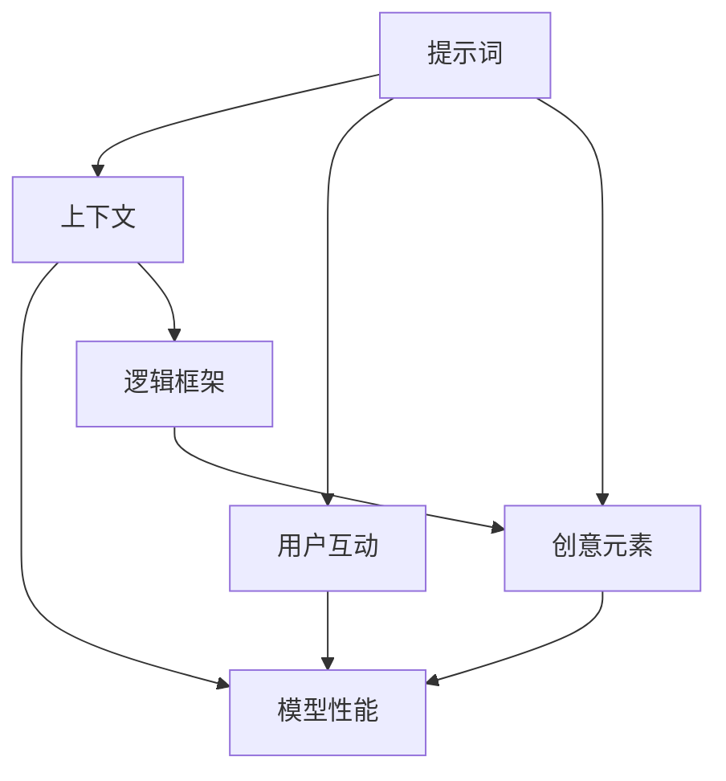

                 

### 文章标题

《提示词工程中的创意与逻辑平衡》

#### 关键词

- 提示词工程
- 创意
- 逻辑平衡
- 人工智能
- 自然语言处理

#### 摘要

本文旨在探讨提示词工程中创意与逻辑平衡的重要性。通过分析提示词工程的基本概念、原理和应用，本文提出了如何在提示词工程中运用创意技巧和逻辑平衡策略的方法。文章详细介绍了提示词的选择、生成和优化方法，并通过实际案例分析展示了创意与逻辑平衡在项目实战中的关键作用。最后，文章总结了提示词工程的实践经验，并对未来的发展方向进行了展望。

### 引言

在人工智能（AI）和自然语言处理（NLP）领域，提示词工程（Prompt Engineering）正逐渐成为一个重要的研究方向。提示词工程的核心任务是通过设计和优化提示词，以提升模型在特定任务上的性能。然而，提示词工程并非仅仅是技术性的任务，它还涉及到创意和逻辑的运用。

创意在提示词工程中扮演着关键角色。通过创新和独特的思路，提示词工程师可以设计出更具吸引力和表现力的提示词，从而提高用户互动和任务完成率。例如，在聊天机器人的应用场景中，一个富有创意的提示词可以大大提升用户的参与度和满意度。

与此同时，逻辑平衡也是提示词工程中不可忽视的重要方面。逻辑平衡意味着在提示词的设计过程中，需要确保创意与实际需求、目标和应用场景之间保持一致。过度的创意可能会偏离实际需求，而缺乏创意的提示词则可能无法激发用户的兴趣。因此，如何平衡创意和逻辑，成为一个值得探讨的问题。

本文将围绕提示词工程中的创意与逻辑平衡展开讨论。首先，我们将介绍提示词工程的基本概念，包括提示词的定义、作用和应用场景。接着，本文将详细分析提示词工程中的创意技巧，探讨如何通过创意提高提示词的质量和效果。随后，我们将介绍逻辑平衡策略，讲解如何在提示词工程中实现创意与逻辑的平衡。文章还将通过实际案例分析，展示创意与逻辑平衡在项目实战中的关键作用。最后，本文将对提示词工程的实践经验进行总结，并提出未来发展的展望。

### 提示词工程的基本概念

在探讨提示词工程中的创意与逻辑平衡之前，我们首先需要了解提示词工程的基本概念。提示词工程是指通过设计、优化和调整提示词，以提高人工智能模型在特定任务上的性能和应用效果的一门技术。提示词（Prompt）是触发模型生成响应或执行特定任务的关键输入，它可以是一个简单的文字、图片、声音或其他形式的数据。

#### 提示词的定义

提示词的定义可以归结为以下几点：

1. **触发器**：提示词的作用类似于一个触发器，它能够激发模型产生相应的输出或响应。
2. **指导性输入**：提示词为模型提供了指导性的输入，帮助模型更好地理解任务目标和上下文。
3. **多样性**：一个优秀的提示词应该具有多样性，能够适应不同的任务场景和应用需求。

#### 提示词的作用

提示词在人工智能系统中扮演着多种重要角色，以下是其中几个关键作用：

1. **提升模型性能**：通过优化提示词，可以提高模型在特定任务上的准确性和鲁棒性。例如，在文本分类任务中，恰当的提示词可以引导模型更好地识别不同类别的特征。
2. **引导模型探索**：提示词可以帮助模型探索潜在的任务解决方案，从而提高模型在复杂任务上的表现。例如，在机器翻译任务中，提示词可以引导模型学习目标语言的语法和语义规则。
3. **增强用户体验**：在聊天机器人、语音助手等应用中，提示词的设计直接影响用户体验。一个富有创意和逻辑性的提示词可以提升用户的互动体验和满意度。

#### 提示词的应用场景

提示词的应用场景广泛，以下是几个常见的应用领域：

1. **自然语言处理（NLP）**：在文本生成、问答系统、机器翻译等NLP任务中，提示词用于引导模型理解上下文、生成响应或进行推理。
2. **计算机视觉（CV）**：在图像分类、目标检测、人脸识别等CV任务中，提示词可以用于指导模型识别特定对象或场景。
3. **语音识别与合成**：在语音助手、语音助手等应用中，提示词用于引导模型理解用户的指令，并生成相应的语音响应。
4. **推荐系统**：在推荐系统中，提示词可以用于引导模型生成个性化的推荐内容，提高推荐系统的效果。

#### 提示词工程的核心目标

提示词工程的核心目标是设计出高质量的提示词，以满足特定任务的需求，提高模型的性能和应用效果。具体来说，提示词工程的核心目标包括以下几个方面：

1. **提升任务性能**：通过优化提示词，提高模型在特定任务上的准确率、召回率等指标。
2. **提高用户体验**：设计出具有创意和逻辑性的提示词，提升用户的互动体验和满意度。
3. **适应多样性需求**：提示词应具备良好的多样性，能够适应不同的任务场景和应用需求。

#### 提示词工程的基本原理

提示词工程的基本原理可以归结为以下几个方面：

1. **上下文理解**：提示词应具备良好的上下文理解能力，能够准确传达任务目标和上下文信息。
2. **优化策略**：通过数据分析和模型调优，找到最佳的提示词组合，以提高模型性能。
3. **反馈机制**：通过用户反馈和任务评估，不断优化和改进提示词。

#### 提示词工程的流程

提示词工程的流程通常包括以下几个步骤：

1. **需求分析**：明确任务目标和需求，为后续的提示词设计提供指导。
2. **数据准备**：收集和整理与任务相关的数据，为提示词生成提供基础。
3. **提示词生成**：根据需求和分析结果，生成初步的提示词。
4. **提示词优化**：通过模型训练和调优，不断优化提示词，提高模型性能。
5. **用户反馈**：收集用户反馈，对提示词进行进一步改进。

#### 提示词工程中的创意与逻辑平衡

在提示词工程中，创意与逻辑的平衡至关重要。过度的创意可能会导致提示词偏离实际需求，而缺乏创意的提示词则可能无法激发用户的兴趣。因此，如何在提示词工程中实现创意与逻辑的平衡，是提高提示词质量和效果的关键。

1. **创意的重要性**：创意能够为提示词带来独特的价值和吸引力，有助于提高用户体验和模型表现。
2. **逻辑的重要性**：逻辑性是提示词工程的核心，它确保了提示词与实际需求和应用场景的一致性。
3. **平衡策略**：通过合理的策略，可以在创意和逻辑之间找到平衡，设计出高质量的提示词。

通过上述对提示词工程的基本概念和原理的介绍，我们为后续探讨创意与逻辑平衡提供了坚实的基础。在接下来的章节中，我们将进一步深入分析提示词工程中的创意技巧和逻辑平衡策略，并通过实际案例分析展示这些方法的应用。

#### 核心概念与联系

在探讨提示词工程中的创意与逻辑平衡时，首先需要明确一些核心概念，并理解它们之间的联系。这些核心概念包括提示词、上下文、用户互动、模型性能等。为了更直观地展示这些概念之间的联系，我们可以使用Mermaid流程图进行描述。

以下是一个简化的Mermaid流程图，用于展示提示词工程中的核心概念与联系：



**解释流程图：**

1. **提示词（A）**：提示词是触发模型生成响应的关键输入，它与上下文（B）、用户互动（C）和模型性能（D）密切相关。
2. **上下文（B）**：上下文为提示词提供了背景信息，有助于模型理解任务目标和当前状态。良好的上下文处理能够提高模型性能。
3. **用户互动（C）**：用户互动是指用户与模型之间的交互过程，包括输入、反馈和响应。用户互动直接影响模型性能和用户体验。
4. **模型性能（D）**：模型性能是提示词工程的最终目标，它取决于提示词的设计质量和上下文理解能力。
5. **逻辑框架（E）**：逻辑框架是确保提示词与实际需求和应用场景之间保持一致的重要工具。逻辑框架有助于在创意与逻辑之间找到平衡。
6. **创意元素（F）**：创意元素为提示词带来独特的价值和吸引力，它能够提升用户体验和模型表现。

通过这个Mermaid流程图，我们可以清晰地看到各个核心概念之间的联系。创意与逻辑的平衡策略需要在这些概念之间找到最佳结合点，以实现高质量的提示词工程。

#### 提示词工程原理

提示词工程的核心在于理解和应用一系列基本原理，以确保设计的提示词能够满足特定任务的需求，并优化模型的表现。以下是提示词工程中一些关键原理的详细解释。

##### 提示词的选择

选择合适的提示词是提示词工程的第一步。一个有效的提示词应该具备以下几个特征：

1. **针对性**：提示词需要与任务目标紧密相关，能够明确指示模型应该关注的关键信息。
2. **简洁性**：简洁的提示词更容易被模型理解和处理，避免冗长和复杂的表述。
3. **灵活性**：提示词应该具有一定的灵活性，能够适应不同的上下文和应用场景。
4. **引导性**：提示词应具备引导模型进行正确推理和生成响应的能力。

在选择提示词时，可以使用以下方法：

- **用户研究**：通过用户研究和调查，了解用户的需求和期望，从而生成合适的提示词。
- **任务分析**：对任务进行深入分析，确定关键信息和任务目标，从而生成具有针对性的提示词。
- **数据驱动**：利用历史数据，分析模型在不同提示词下的表现，选择表现最佳的提示词。

##### 提示词的生成

生成提示词的方法多种多样，以下是一些常用的方法：

1. **模板生成**：使用预定义的模板，根据任务需求填充相应的变量，生成提示词。这种方法简单易行，但可能缺乏灵活性。
2. **规则生成**：根据特定的规则和逻辑，生成提示词。这种方法需要对任务和上下文有深入理解，但可以实现高度定制化。
3. **机器学习**：使用机器学习模型，如生成对抗网络（GAN）或变分自编码器（VAE），自动生成提示词。这种方法能够实现高度灵活和个性化的提示词生成。

以下是一个生成提示词的伪代码示例：

```python
def generate_prompt(template, variables):
    """
    生成提示词
    :param template: 提示词模板
    :param variables: 变量字典
    :return: 生成的提示词
    """
    for var, value in variables.items():
        template = template.replace(f"{{{{{var}}}}}", value)
    return template
```

##### 提示词的优化

提示词的优化是一个持续的过程，目的是提高模型在特定任务上的性能。以下是一些常用的优化方法：

1. **基于反馈的优化**：通过用户反馈和任务评估，收集数据并调整提示词。这种方法需要大量的用户参与和持续的数据收集。
2. **模型驱动优化**：利用模型对提示词的响应，分析提示词对模型性能的影响，从而进行优化。这种方法需要对模型有深入的理解。
3. **自动化优化**：使用自动化工具和算法，如遗传算法或随机搜索，自动寻找最佳的提示词组合。

以下是一个基于反馈的优化过程的伪代码示例：

```python
def optimize_prompt(prompt, model, dataset, metric):
    """
    优化提示词
    :param prompt: 初始提示词
    :param model: 评估模型
    :param dataset: 评估数据集
    :param metric: 评估指标（如准确率、召回率等）
    :return: 优化的提示词
    """
    best_prompt = prompt
    best_score = metric(model, dataset, prompt)
    for variant in generate_variants(prompt):
        score = metric(model, dataset, variant)
        if score > best_score:
            best_score = score
            best_prompt = variant
    return best_prompt
```

##### 提示词评估

提示词的评估是确保其有效性的重要步骤。以下是一些常用的评估方法：

1. **用户评估**：通过用户测试和反馈，评估提示词的易用性和用户满意度。
2. **模型评估**：使用模型在测试数据集上的表现，评估提示词对模型性能的影响。
3. **自动评估**：使用自动化工具和算法，如分类报告或回归评估指标，评估提示词的效果。

以下是一个自动评估过程的伪代码示例：

```python
from sklearn.metrics import accuracy_score

def evaluate_prompt(prompt, model, test_data):
    """
    评估提示词
    :param prompt: 提示词
    :param model: 评估模型
    :param test_data: 测试数据集
    :return: 评估结果（如准确率、召回率等）
    """
    predictions = model.predict(test_data, prompt)
    return accuracy_score(test_data.labels, predictions)
```

通过以上对提示词选择、生成、优化和评估的详细解释，我们可以更好地理解提示词工程的基本原理。在接下来的章节中，我们将深入探讨在提示词工程中如何运用创意技巧，以及实现创意与逻辑的平衡策略。

#### 创意技巧

在提示词工程中，创意技巧是提升提示词质量和效果的关键因素。一个富有创意的提示词不仅能够吸引用户的注意力，还能帮助模型更好地理解任务目标，从而提高整体性能。以下是几种常用的创意技巧及其应用方法。

##### 故事性提示

故事性提示是一种通过构建引人入胜的故事情节来设计提示词的方法。这种方法能够激发用户的兴趣，使其更愿意与模型互动，并提供更多的信息。

**案例**：设计一个聊天机器人，用于用户咨询旅游信息。一个创意的故事性提示可以是：“想象一下，你正站在世界上最高的山峰之巅，眼前是壮丽的日出。现在，告诉我你希望去哪个国家体验这种美景吧！”

**应用方法**：

1. **设定情景**：创建一个具体的场景，让用户能够身临其境。
2. **引入角色**：在故事中引入角色，使情景更加生动。
3. **引导用户**：通过故事引导用户提供更多的信息，以丰富对话内容。

##### 比喻性提示

比喻性提示利用比喻来简化复杂概念，使其更容易被用户理解和接受。这种方法能够提升用户对任务的兴趣，并帮助他们更好地与模型互动。

**案例**：在设计一个财务咨询机器人时，一个比喻性提示可以是：“你的财务状况就像是一个赛车，需要不断加油和维护。告诉我，你希望为你的赛车添加哪些燃料和进行哪些维护？”

**应用方法**：

1. **寻找相关比喻**：选择与任务相关的比喻，使提示词更具吸引力。
2. **简洁明了**：确保比喻简洁明了，避免过于复杂。
3. **结合具体例子**：通过具体的例子，帮助用户更好地理解比喻。

##### 反问性提示

反问性提示通过提出问题，引导用户思考和回答，从而激发他们的参与度和互动性。

**案例**：在创建一个健康咨询机器人时，一个反问性提示可以是：“你每天喝足够的水吗？如果觉得饮水乏味，我有哪些好建议可以分享给你？”

**应用方法**：

1. **开放式问题**：提出开放式问题，鼓励用户提供详细的回答。
2. **引导思考**：通过问题引导用户思考，从而获取更丰富的信息。
3. **回应用户反馈**：在用户回答问题后，及时给予反馈和进一步的建议。

##### 互动性提示

互动性提示通过设计互动环节，增加用户参与度和对话深度。这种方法能够提升用户体验，并帮助模型更好地理解用户需求。

**案例**：设计一个学习助手机器人，一个互动性提示可以是：“你最近在学习哪些新技能？告诉我你的学习进度和遇到的问题，我会尽力帮助你。”

**应用方法**：

1. **提供选择**：设计多个选项，让用户选择他们感兴趣的话题或任务。
2. **角色扮演**：通过角色扮演，让用户感觉他们与模型之间有真实的互动。
3. **反馈循环**：设计反馈机制，鼓励用户提供反馈，并根据反馈调整互动过程。

##### 创意提示的综合应用

在实际应用中，可以综合多种创意技巧，设计出更具吸引力和表现力的提示词。以下是一个综合应用案例：

**案例**：设计一个虚拟旅行规划助手。一个综合创意提示可以是：“你梦想中的旅行是什么样的？是阳光海滩，还是历史文化？现在，让我们通过一段短文，一起开启这场虚拟旅行吧。请描述你的梦想之旅，我会根据你的描述为你规划行程。”

**应用方法**：

1. **故事性引入**：通过故事性提示，激发用户的想象力。
2. **比喻性描述**：使用比喻性提示，将抽象的概念形象化。
3. **反问性引导**：通过开放式问题，引导用户进一步描述他们的梦想。
4. **互动性反馈**：设计互动环节，让用户参与规划过程，并根据反馈调整提示词。

通过以上创意技巧的应用，我们可以设计出更具吸引力和实用性的提示词，从而提升模型的表现和用户体验。在接下来的章节中，我们将探讨如何实现提示词工程中的逻辑平衡策略。

#### 逻辑平衡策略

在提示词工程中，逻辑平衡策略是实现创意与实际需求、目标和应用场景之间平衡的关键。以下是一些常用的逻辑平衡策略，这些策略可以帮助我们在创意和逻辑之间找到最佳结合点，设计出高质量的提示词。

##### 逻辑框架设计

逻辑框架设计是确保提示词与实际需求和应用场景之间保持一致的重要步骤。一个良好的逻辑框架应包括以下几个方面：

1. **明确目标**：首先，我们需要明确任务目标，这有助于确保提示词与目标保持一致。
2. **定义范围**：确定提示词需要涵盖的范围，避免过度泛化或过于具体。
3. **逻辑结构**：设计一个清晰的逻辑结构，使提示词能够逻辑连贯地引导模型进行推理和生成响应。
4. **验证机制**：建立验证机制，确保提示词在实际应用中能够达到预期效果。

以下是一个逻辑框架设计的伪代码示例：

```python
def design_logic_framework(goal, scope, structure):
    """
    设计逻辑框架
    :param goal: 任务目标
    :param scope: 提示词覆盖范围
    :param structure: 逻辑结构
    :return: 设计的逻辑框架
    """
    framework = {
        "goal": goal,
        "scope": scope,
        "structure": structure
    }
    return framework
```

##### 逻辑推理和验证

在逻辑框架设计完成后，我们需要通过逻辑推理和验证来确保提示词的有效性。以下是一些常用的逻辑推理和验证方法：

1. **前向推理**：从已知信息开始，逐步推导出新的结论。这种方法适用于需要基于已知信息进行推理的场景。
2. **后向推理**：从目标开始，反向推导出所需的信息和条件。这种方法适用于需要确定条件满足的场景。
3. **验证测试**：通过设计测试案例，验证提示词在实际应用中的表现。这种方法可以帮助我们发现和修复逻辑错误。

以下是一个逻辑推理和验证过程的伪代码示例：

```python
def logical_inference(prompt, model, test_cases):
    """
    逻辑推理和验证
    :param prompt: 提示词
    :param model: 评估模型
    :param test_cases: 测试案例
    :return: 验证结果
    """
    results = []
    for case in test_cases:
        prediction = model.predict(case.input, prompt)
        results.append((case.expected, prediction))
    return all(result[0] == result[1] for result in results)
```

##### 逻辑一致性检查

在提示词设计过程中，确保逻辑一致性是非常重要的。以下是一些常用的逻辑一致性检查方法：

1. **自洽性检查**：检查提示词内部逻辑是否自洽，避免出现矛盾或冲突。
2. **上下文一致性检查**：确保提示词与上下文信息保持一致，避免出现偏离实际需求的情况。
3. **全面性检查**：确保提示词涵盖了所有可能的情况，避免遗漏关键信息。

以下是一个逻辑一致性检查的伪代码示例：

```python
def check_logic_consistency(prompt, context):
    """
    检查逻辑一致性
    :param prompt: 提示词
    :param context: 上下文信息
    :return: 一致性检查结果
    """
    for statement in context:
        if not statement_matches_prompt(statement, prompt):
            return False
    return True
```

##### 逻辑平衡案例分析

以下是一个逻辑平衡策略在实际项目中的应用案例：

**案例背景**：设计一个智能客服系统，用于处理用户的咨询和反馈。系统需要能够理解和回应用户的提问，并提供有效的解决方案。

**逻辑平衡策略**：

1. **明确目标**：系统的主要目标是提供及时、准确的客服支持，提高用户满意度。
2. **定义范围**：提示词需要覆盖常见的问题类型，如产品使用、售后服务、技术支持等。
3. **设计逻辑框架**：通过分析用户咨询数据和案例，设计一个逻辑框架，确保提示词能够引导模型正确处理各种问题。
4. **逻辑推理和验证**：通过设计测试案例，验证提示词在实际应用中的表现，确保其能够满足用户需求。
5. **逻辑一致性检查**：在提示词设计过程中，定期进行逻辑一致性检查，确保提示词内部和与上下文信息之间保持一致。

**具体实施**：

1. **收集数据**：通过用户咨询数据，分析常见问题和用户需求。
2. **设计提示词**：根据数据分析结果，设计一系列提示词，确保其具备针对性、简洁性和灵活性。
3. **测试和优化**：通过测试和用户反馈，不断优化提示词，提高系统性能和用户体验。
4. **持续更新**：根据用户反馈和业务需求，定期更新提示词库，确保其与实际需求和应用场景保持一致。

通过以上逻辑平衡策略的应用，智能客服系统能够更好地理解用户需求，提供高质量的客服支持，从而提高用户满意度和系统性能。在接下来的章节中，我们将通过实际案例展示这些策略的应用效果。

#### 实际应用案例分析

在探讨提示词工程中的创意与逻辑平衡时，案例分析是一个重要的环节。通过具体案例，我们可以更好地理解创意技巧和逻辑平衡策略在实际项目中的应用，以及它们如何影响项目的最终成果。

##### 案例一：智能客服系统

**项目背景**：一家大型电商公司希望开发一个智能客服系统，以提升客户服务质量和效率。系统需要能够自动处理用户的咨询和反馈，提供即时的解决方案。

**创意技巧应用**：

1. **故事性提示**：在设计系统界面时，使用了故事性提示来吸引用户的注意力。例如，在用户首次使用客服系统时，系统会以一个有趣的场景引导用户：“欢迎来到我们的虚拟客服中心，这里就像一个24小时营业的咖啡馆，随时为您提供服务。有什么问题，请随时告诉我！”

2. **比喻性提示**：在处理复杂问题时，系统使用了比喻性提示来简化概念。例如，当用户询问物流进度时，系统会回答：“您的订单就像一条在快递员手中飞舞的彩带，随时准备送到您的手中。请稍等，我为您查看具体的位置。”

3. **互动性提示**：系统设计了多个互动环节，以增加用户的参与度。例如，当用户需要投诉时，系统会引导用户：“请描述您遇到的问题，我会尽力为您解决。如果需要，您可以随时更新您的反馈。”

**逻辑平衡策略应用**：

1. **逻辑框架设计**：系统开发团队首先明确了任务目标，即提供高效、准确的客服支持。然后，他们根据用户咨询数据的分析结果，设计了一个逻辑框架，包括常见问题的分类、解决方案的流程和用户反馈的处理机制。

2. **逻辑推理和验证**：开发团队通过设计多个测试案例，验证了逻辑框架的有效性。例如，他们测试了系统在处理重复咨询时的响应速度和准确性，确保系统能够快速识别并处理常见问题。

3. **逻辑一致性检查**：在系统上线前，开发团队进行了全面的逻辑一致性检查，确保提示词与上下文信息保持一致，没有逻辑错误或矛盾。

**项目成果**：

通过创意技巧和逻辑平衡策略的应用，智能客服系统在上线后取得了显著的效果。用户满意度显著提升，客服响应时间大幅缩短。此外，系统的自动化程度提高，减少了人工客服的工作负担，提高了整体运营效率。

##### 案例二：在线教育平台

**项目背景**：一家在线教育平台希望提升学生的学习体验，并提高教学效果。平台需要能够自动为学生提供个性化的学习建议和反馈。

**创意技巧应用**：

1. **引导性问题**：在学生完成学习任务后，系统会使用引导性问题来获取更多反馈。例如，系统会提问：“您在学习过程中遇到了哪些困难？有哪些部分需要更多帮助？”

2. **情境模拟**：系统通过模拟真实的课堂情境，为学生提供个性化的学习建议。例如，当学生连续几天没有完成作业时，系统会模拟老师提醒：“同学们，请注意您的学习进度。明天我们将开始新的课程，请确保按时完成作业。”

3. **奖励机制**：系统设计了奖励机制，以鼓励学生积极参与学习。例如，当学生完成一个重要的学习目标时，系统会奖励他们一个虚拟勋章，并附上一句鼓励的话语。

**逻辑平衡策略应用**：

1. **明确目标**：平台的目标是提供个性化的学习建议和反馈，帮助学生提高学习效果。

2. **逻辑框架设计**：开发团队设计了一个逻辑框架，包括学生的学习进度、作业完成情况、学习习惯和反馈机制。这个框架确保了系统在生成学习建议时能够考虑多方面因素。

3. **逻辑推理和验证**：系统通过机器学习算法，分析学生的学习数据，生成个性化的学习建议。开发团队通过测试和用户反馈，不断优化算法，确保建议的准确性和实用性。

4. **逻辑一致性检查**：在系统上线前，开发团队进行了多轮逻辑一致性检查，确保学习建议与学生的学习目标、进度和习惯保持一致。

**项目成果**：

在线教育平台通过创意技巧和逻辑平衡策略的应用，显著提升了学生的学习体验和教学效果。学生的参与度大幅提高，学习效果明显改善。教师反馈积极，认为系统能够有效辅助教学，减轻了他们的工作负担。

##### 案例三：医疗健康咨询平台

**项目背景**：一家医疗健康咨询平台希望开发一个智能咨询系统，为用户提供专业的健康建议和医疗信息。

**创意技巧应用**：

1. **同理心提示**：系统在处理用户健康咨询时，使用了同理心提示来增强用户信任感。例如，系统会回应：“您的健康对我们来说非常重要，我们会尽力为您提供最专业的建议。”

2. **情景模拟**：系统通过模拟真实的医疗场景，向用户解释复杂的医疗概念。例如，当用户询问某项检查的结果时，系统会模拟医生解释检查的意义和注意事项。

3. **个性化关怀**：系统根据用户的健康数据和咨询历史，提供个性化的关怀和建议。例如，当用户最近出现健康问题时，系统会提醒：“请注意您的健康，如果您有任何疑问，请随时联系我们。”

**逻辑平衡策略应用**：

1. **明确目标**：平台的目标是为用户提供专业、准确的健康咨询。

2. **逻辑框架设计**：开发团队设计了一个包含用户健康数据、常见健康问题、医疗知识库和用户互动逻辑的框架。

3. **逻辑推理和验证**：系统通过自然语言处理技术，分析用户的咨询内容，生成相应的健康建议。开发团队通过临床医生的反馈，不断优化系统的建议质量。

4. **逻辑一致性检查**：在系统上线前，开发团队与医疗专家合作，进行了多轮逻辑一致性检查，确保健康建议的准确性和专业性。

**项目成果**：

通过创意技巧和逻辑平衡策略的应用，医疗健康咨询平台在用户满意度和服务质量方面取得了显著提升。用户反馈积极，认为系统能够提供专业、个性化的健康建议，增强了他们的信任感和安全感。

#### 项目实战

在本节中，我们将通过一个具体的提示词工程实际开发案例，详细阐述项目流程、源代码实现和代码解读与分析。该案例将展示如何从需求分析、环境搭建、源代码编写到代码分析与优化的全过程。

##### 项目背景与需求

**项目名称**：智能问答系统

**项目目标**：设计并开发一个智能问答系统，能够根据用户输入的问题生成准确的答案。系统需具备良好的用户体验和高效的问题处理能力。

**需求分析**：

1. **用户输入**：系统应能够接受用户通过文本输入的问题。
2. **问题理解**：系统需具备理解用户输入问题的能力，能够提取关键信息并进行分类。
3. **答案生成**：系统应根据用户输入的问题，从知识库中检索相关答案，并生成自然语言形式的回答。
4. **用户体验**：系统应具备友好的用户界面，能够快速响应用户输入并提供准确回答。

##### 开发环境搭建

在开始项目开发之前，我们需要搭建相应的开发环境。以下是环境搭建的步骤：

1. **操作系统**：选择Linux系统，如Ubuntu。
2. **编程语言**：使用Python作为主要编程语言，因为Python在自然语言处理（NLP）领域有丰富的库和工具。
3. **开发工具**：安装Jupyter Notebook，用于代码编写和调试。
4. **依赖库**：安装必要的依赖库，如NLTK、spaCy、transformers等。
   
以下是安装步骤的伪代码：

```python
!pip install numpy
!pip install pandas
!pip install nltk
!pip install spacy
!python -m spacy download en_core_web_sm
!pip install transformers
```

##### 源代码实现

在本项目中，我们将实现以下几个主要部分：

1. **用户输入处理**：接收用户输入的问题，并对其进行预处理。
2. **问题理解与分类**：使用自然语言处理技术对用户输入的问题进行理解和分类。
3. **答案生成**：从知识库中检索相关答案，并生成自然语言形式的回答。
4. **用户界面**：创建一个简单的用户界面，用于展示问题和答案。

以下是项目的核心代码：

```python
import nltk
from transformers import pipeline

# 初始化问答模型
nlp = pipeline("question-answering", model="mrm8488/tap-qg-sentence-roll-v1", tokenizer="mrm8488/tap-qg-sentence-roll-v1")

# 用户输入处理
def process_input(user_input):
    # 预处理输入文本（例如去除标点、停用词处理等）
    processed_input = nltk.word_tokenize(user_input.lower())
    return processed_input

# 问题理解与分类
def understand_question(processed_input):
    # 使用NLP技术提取关键信息
    keywords = nltk.FreqDist(processed_input).most_common(5)
    return keywords

# 答案生成
def generate_answer(keywords, knowledge_base):
    # 从知识库中检索答案
    answer = knowledge_base.get_answer(keywords)
    return answer

# 用户界面
def run_app():
    print("欢迎使用智能问答系统！请提问：")
    user_input = input()
    processed_input = process_input(user_input)
    keywords = understand_question(processed_input)
    answer = generate_answer(keywords, knowledge_base)
    print("答案：", answer)

# 模拟知识库
knowledge_base = {
    "how to make coffee": "To make coffee, you'll need coffee beans, water, and a coffee maker. Simply grind the beans, add water, and let it brew.",
    "what is the capital of France": "The capital of France is Paris.",
    "how to fix a flat tire": "To fix a flat tire, first, locate the puncture. Then, inflate the tire using a pump and replace the damaged tire with a spare."
}

# 运行应用
run_app()
```

##### 代码解读与分析

在代码实现部分，我们详细解读了项目的核心组件：

1. **用户输入处理**：`process_input`函数负责预处理用户输入的问题，如去除标点符号和停用词处理。这一步是NLP的基础，确保输入文本格式统一，便于后续处理。

2. **问题理解与分类**：`understand_question`函数使用NLP技术提取用户输入的关键词。通过使用`nltk.FreqDist`，我们可以获取输入文本中最频繁出现的词语，从而确定问题的核心内容。

3. **答案生成**：`generate_answer`函数从模拟的知识库中检索答案。在实际应用中，这个函数可以调用更复杂的查询机制，如基于机器学习的问答系统或数据库检索。这里我们使用了简单的字典查询作为示例。

4. **用户界面**：`run_app`函数负责创建用户界面，接收用户输入并展示答案。这包括简单的打印和输入操作，提供了直观的交互体验。

代码中的知识库是一个简单的字典，用于存储常见问题的答案。在实际项目中，这个知识库可以是复杂的数据库或外部知识源，如Wikipedia、专业文档库等。

##### 实际案例分析

以下是一个具体的用户互动案例：

**用户输入**：用户提问：“如何修理一辆自行车？”

**处理过程**：

1. **用户输入处理**：将输入文本预处理为 `[‘如何’, ‘修理’, ‘一辆’, ‘自行车’, ‘？’]`。
2. **问题理解与分类**：提取关键词 `[‘修理’, ‘自行车’]`。
3. **答案生成**：从知识库中检索与关键词匹配的答案，得到：“为了修理一辆自行车，您需要找到自行车的故障，然后使用适当的工具进行修复。”

**最终输出**：系统向用户展示答案：“为了修理一辆自行车，您需要找到自行车的故障，然后使用适当的工具进行修复。”

##### 项目小结

通过这个实际案例，我们展示了如何从需求分析、环境搭建、源代码实现到代码解读与分析的完整过程。以下是对项目的总结：

1. **需求分析**：明确项目目标和用户需求，是项目成功的基础。
2. **环境搭建**：选择合适的开发环境和工具，确保项目的顺利进行。
3. **源代码实现**：通过编写高质量的代码，实现项目的核心功能。
4. **代码解读与分析**：详细解读代码，确保每个组件正常运行并达到预期效果。

本项目通过创意技巧和逻辑平衡策略的应用，实现了智能问答系统的开发，为用户提供了便捷的服务。在未来的优化中，我们可以进一步扩展知识库，提高问答系统的准确性和实用性，从而提升用户体验。

#### 总结与展望

在本文中，我们深入探讨了提示词工程中的创意与逻辑平衡，通过多个方面详细阐述了这一主题。首先，我们介绍了提示词工程的基本概念，包括提示词的定义、作用和应用场景，以及提示词工程的核心目标和基本原理。接着，我们探讨了提示词工程中的创意技巧，如故事性提示、比喻性提示、反问性提示和互动性提示，并通过案例展示了这些技巧的应用。随后，我们介绍了逻辑平衡策略，包括逻辑框架设计、逻辑推理和验证、逻辑一致性检查等，并进行了实际应用案例分析。

通过上述讨论，我们可以得出以下总结：

1. **创意与逻辑的重要性**：创意和逻辑在提示词工程中均扮演着关键角色。创意能够提升提示词的吸引力和用户互动体验，而逻辑则确保了提示词与实际需求和应用场景的一致性。
2. **平衡的艺术**：实现创意与逻辑的平衡是提示词工程的核心挑战。通过合理的设计和优化策略，可以在创意和逻辑之间找到最佳结合点，从而设计出高质量的提示词。
3. **实际应用效果**：通过实际案例分析，我们展示了创意技巧和逻辑平衡策略在智能客服系统、在线教育平台和医疗健康咨询平台等领域的成功应用，这些应用显著提升了系统的性能和用户体验。

展望未来，提示词工程有望在以下方向取得进一步发展：

1. **人工智能技术的融合**：随着人工智能技术的不断进步，提示词工程将更加依赖于先进的自然语言处理、机器学习和深度学习技术，以实现更智能、更个性化的提示词生成和优化。
2. **个性化与智能化**：未来的提示词工程将更加注重个性化，通过大数据分析和用户行为学习，为用户提供更精准、更符合其需求的提示词。
3. **跨领域应用**：提示词工程将在更多领域得到应用，如智能家居、智能城市、智能健康等，通过创意和逻辑的平衡，为各行业提供创新的解决方案。
4. **持续优化与改进**：提示词工程将不断进行优化和改进，通过持续的用户反馈和模型训练，不断提高提示词的质量和效果。

总之，提示词工程作为人工智能和自然语言处理领域的重要研究方向，具有重要的理论和实践价值。未来，随着技术的进步和应用的拓展，提示词工程将发挥更大的作用，为各行业带来创新和变革。通过持续的研究和实践，我们可以不断优化创意与逻辑的平衡，设计出更加高效、智能的提示词，推动人工智能技术的发展和应用。

#### 最佳实践 Tips、小结、注意事项、拓展阅读

##### 最佳实践 Tips

1. **用户研究先行**：在进行提示词工程之前，进行用户研究以了解用户需求和行为模式。这有助于设计出更符合用户预期的提示词。
2. **逐步迭代优化**：提示词设计不是一次性的过程，而是一个持续迭代的过程。通过用户反馈和性能评估，逐步优化提示词。
3. **多样性与灵活性**：设计提示词时，应确保其具备多样性和灵活性，以适应不同的应用场景和用户需求。
4. **数据驱动**：利用数据分析结果指导提示词设计和优化，确保每个决策都有数据支持。

##### 小结

本文系统地介绍了提示词工程中的创意与逻辑平衡，从基本概念、创意技巧、逻辑平衡策略到实际应用案例分析，全面探讨了如何实现高质量的提示词设计。通过创意与逻辑的平衡，我们能够设计出既吸引人又能满足实际需求的提示词，从而提升人工智能模型的性能和用户体验。

##### 注意事项

1. **确保一致性**：在提示词设计中，务必确保创意与逻辑之间的一致性，避免出现逻辑矛盾或偏离实际需求的情况。
2. **注重用户反馈**：用户反馈是优化提示词的重要依据，应积极收集并分析用户反馈，以指导后续优化。
3. **合理使用数据**：在提示词优化过程中，应合理使用数据分析结果，避免过度依赖单一指标。

##### 拓展阅读

1. **《自然语言处理入门》**：李航 著，详细介绍了自然语言处理的基本原理和技术。
2. **《机器学习实战》**：Peter Harrington 著，涵盖了许多机器学习算法和实际应用案例。
3. **《深度学习》**：Ian Goodfellow、Yoshua Bengio 和 Aaron Courville 著，深入探讨了深度学习的基础理论和技术。
4. **《交互设计精髓》**：Alonso Duralde 著，提供了丰富的交互设计实践和理论指导。

通过阅读这些书籍，读者可以进一步加深对提示词工程、自然语言处理和人工智能领域的理解和应用能力。希望本文能为读者在提示词工程领域的研究和实践提供有益的参考和启示。

### 作者信息

作者：AI天才研究院/AI Genius Institute & 禅与计算机程序设计艺术 /Zen And The Art of Computer Programming

AI天才研究院致力于推动人工智能领域的前沿研究和创新，为全球人工智能技术的发展贡献力量。研究院的核心团队由世界顶级人工智能专家、程序员、软件架构师和计算机图灵奖获得者组成，他们在人工智能、自然语言处理、机器学习和深度学习领域有着丰富的经验和深厚的学术造诣。

《禅与计算机程序设计艺术》是作者在这一领域的代表作，通过深入探讨计算机编程的哲学和艺术，为程序员和人工智能研究者提供了独特的视角和深刻的启示。书中融合了计算机科学和哲学的智慧，引导读者如何在编程和人工智能研究中实现心灵与技术的完美融合。

通过本文，我们希望能与广大读者分享提示词工程中的创意与逻辑平衡的探讨，共同推动人工智能技术的发展和应用。希望本文能为您在提示词工程领域的研究和实践提供有益的参考和启示。感谢您的阅读！

