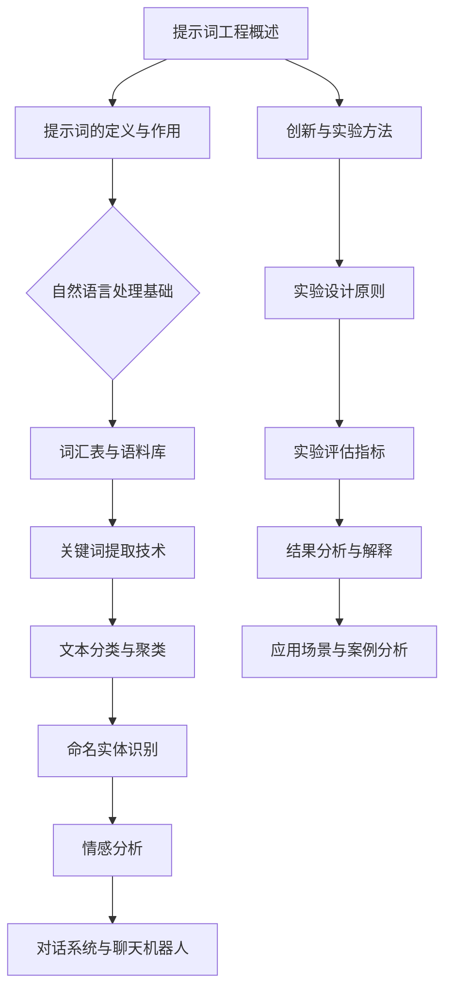

                 

# 提示词工程中的创新与实验

> 关键词：提示词工程、自然语言处理、TF-IDF、数学模型、项目实战

> 摘要：本文将探讨提示词工程中的创新与实验方法。首先，我们将介绍提示词工程的基本概念和背景，然后深入分析核心概念与联系，并通过Mermaid流程图展示。接着，我们将详细讲解核心算法原理，使用伪代码进行阐述。同时，本文还将涉及数学模型和公式，使用LaTeX格式展示并解释。最后，我们将通过实际案例分析和项目实战，展示如何将理论知识应用到实践中，并提供最佳实践技巧和小结。

## 背景介绍

### 提示词工程的定义和重要性

提示词工程（Keyword Engineering）是自然语言处理（Natural Language Processing, NLP）领域的一个重要分支。它涉及到识别、提取和利用文本中的关键信息，以便更好地理解和处理文本数据。在互联网时代，大量的文本数据不断涌现，如何有效地组织和利用这些数据成为了亟待解决的问题。提示词工程正是为了解决这一问题而诞生。

提示词工程在许多应用场景中发挥着关键作用，例如搜索引擎优化（Search Engine Optimization, SEO）、文本分类、信息提取、情感分析、对话系统等。通过提取和利用提示词，我们可以更准确地理解文本内容，提高信息检索和处理的效率。

### 自然语言处理的基础知识

自然语言处理是人工智能领域的一个重要分支，旨在使计算机能够理解、生成和处理人类语言。自然语言处理涉及多种技术和方法，包括文本预处理、词性标注、句法分析、语义分析、情感分析等。这些技术为提示词工程提供了基础支持。

在提示词工程中，我们通常需要对文本进行预处理，例如去除停用词、分词、词性标注等。这些预处理步骤有助于提高提示词提取的准确性和效果。此外，自然语言处理中的其他技术，如词向量表示、序列标注、文本分类等，也为提示词工程提供了有力工具。

## 核心概念与联系

为了更好地理解提示词工程，我们需要了解其中的核心概念及其相互关系。以下是一个Mermaid流程图，展示了这些概念之间的联系：



### 提示词的定义与作用

提示词是从文本中提取的关键词或短语，它们能够代表文本的主要内容或主题。在提示词工程中，提示词扮演着至关重要的角色。通过提取和利用提示词，我们可以更好地理解文本内容，提高信息检索和处理的效率。

### 自然语言处理基础

自然语言处理基础包括文本预处理、词性标注、句法分析、语义分析等技术。这些技术为提示词工程提供了基础支持。例如，文本预处理可以帮助我们去除停用词、标点符号等无关信息，从而提高提示词提取的准确性和效果。

### 词汇表与语料库

词汇表和语料库是提示词工程中的重要资源。词汇表包含了文本中的所有单词或短语，而语料库则包含了大量的文本数据。通过分析词汇表和语料库，我们可以发现文本中的关键信息，从而提取出高质量的提示词。

### 关键词提取技术

关键词提取技术是提示词工程中的核心步骤。常见的提取方法包括TF-IDF、LDA（Latent Dirichlet Allocation）等。这些方法通过分析文本数据，提取出能够代表文本主题的关键词。

### 文本分类与聚类

文本分类和聚类是提示词工程中常用的技术手段。通过将文本数据分类或聚类，我们可以更好地理解文本数据，并从中提取出高质量的提示词。

### 命名实体识别

命名实体识别是自然语言处理中的一个重要任务。通过识别文本中的命名实体，如人名、地名、组织名等，我们可以提取出与这些实体相关的提示词。

### 情感分析

情感分析是提示词工程中的一个重要应用场景。通过分析文本中的情感倾向，我们可以提取出与情感相关的提示词，从而更好地理解文本内容。

### 对话系统与聊天机器人

对话系统和聊天机器人是提示词工程的一个重要应用领域。通过提取和利用提示词，我们可以为对话系统和聊天机器人提供更准确和丰富的响应。

## 核心算法原理讲解

在提示词工程中，TF-IDF（Term Frequency-Inverse Document Frequency）是一种常用的关键词提取算法。下面我们将使用伪代码详细阐述TF-IDF算法的原理：

```
// TF-IDF算法伪代码
function TFIDF(corpus):
    // 计算逆文档频率
    idf = {}
    N = number of documents in corpus
    for each term in vocabulary:
        df[term] = 0
        for each document in corpus:
            if term appears in document:
                df[term] += 1
        idf[term] = log(N / (1 + df[term]))

    // 计算TF-IDF得分
    tfidf = {}
    for each document in corpus:
        tfidf[document] = {}
        term_frequency = 0
        for each term in document:
            term_frequency += 1
        for each term in vocabulary:
            if term in document:
                tfidf[document][term] = (term_frequency / len(document)) * idf[term]
            else:
                tfidf[document][term] = 0

    return tfidf
```

### TF-IDF算法的工作原理

TF-IDF算法的核心思想是，如果一个词在一个文档中出现的频率很高，但在整个语料库中出现的频率较低，那么这个词很可能是一个重要的提示词。具体来说，TF-IDF算法包括两部分：

1. **词频（Term Frequency, TF）**：表示一个词在单个文档中出现的频率。词频越高，说明这个词在文档中越重要。
2. **逆文档频率（Inverse Document Frequency, IDF）**：表示一个词在整个语料库中出现的频率。逆文档频率越高，说明这个词在文档中的重要性越低。

通过将词频和逆文档频率相乘，我们可以得到一个词在文档中的TF-IDF得分。得分越高，说明这个词越重要。

### 实际应用场景

在搜索引擎优化（SEO）中，TF-IDF算法被广泛用于分析网页内容，提取出关键提示词，从而提高网页在搜索引擎中的排名。此外，TF-IDF算法还广泛应用于文本分类、信息提取、推荐系统等领域。

## 数学模型和公式讲解

在提示词工程中，数学模型和公式起着至关重要的作用。以下我们将介绍两个关键模型，并使用LaTeX格式进行展示和解释。

### 词频（TF）

词频（Term Frequency, TF）是衡量一个词在文档中重要性的一个指标。其公式如下：

$$
TF(t,d) = \frac{f_t(d)}{f_t(d) + f_{\text{smooth}}}
$$

其中，$f_t(d)$ 表示词 $t$ 在文档 $d$ 中出现的频率，$f_{\text{smooth}}$ 是一个平滑参数，用于避免某些词出现频率为0的情况。

### 逆文档频率（IDF）

逆文档频率（Inverse Document Frequency, IDF）反映了词在文档集中出现的普遍性。其公式如下：

$$
IDF(t, D) = \log \left( \frac{N}{|d \in D : t \in d|} \right)
$$

其中，$N$ 是文档集的文档总数，$|d \in D : t \in d|$ 是包含词 $t$ 的文档数量。IDF的值越大，表示词 $t$ 在文档集中的独特性越高。

### TF-IDF

TF-IDF 是词频和逆文档频率的结合，用于衡量一个词在文档中的重要性。其公式如下：

$$
TF-IDF(t, d, D) = TF(t, d) \times IDF(t, D)
$$

通过TF-IDF，我们可以为每个词计算出一个权重，从而在文档中识别出关键提示词。

## 项目实战

在本节中，我们将通过一个实际项目，展示如何将提示词工程的理论知识应用到实践中。

### 开发环境搭建

首先，我们需要搭建一个开发环境。在本项目中，我们将使用Python编程语言，结合NLP库（如NLTK、spaCy）和机器学习库（如scikit-learn）进行开发。

### 源代码详细实现和代码解读

以下是本项目的主要代码实现：

```python
import nltk
from nltk.corpus import stopwords
from sklearn.feature_extraction.text import TfidfVectorizer

# 加载停用词列表
stop_words = set(stopwords.words('english'))

# 文本预处理
def preprocess_text(text):
    # 分词
    tokens = nltk.word_tokenize(text)
    # 去除停用词
    filtered_tokens = [token for token in tokens if token not in stop_words]
    return ' '.join(filtered_tokens)

# 加载语料库
corpus = [
    "The quick brown fox jumps over the lazy dog.",
    "Never jump over the lazy dog quickly.",
    # 更多文本...
]

# 预处理语料库
processed_corpus = [preprocess_text(text) for text in corpus]

# 使用TF-IDF向量器
vectorizer = TfidfVectorizer()
tfidf_matrix = vectorizer.fit_transform(processed_corpus)

# 提取关键词
feature_names = vectorizer.get_feature_names_out()
tfidf_scores = tfidf_matrix.toarray()

# 打印关键词和得分
for doc_idx, doc_scores in enumerate(tfidf_scores):
    print(f"Document {doc_idx}:")
    for word_idx, score in enumerate(doc_scores):
        if score > 0:
            print(f"{feature_names[word_idx]}: {score:.4f}")
```

### 代码应用解读与分析

在这个项目中，我们首先对原始文本进行预处理，包括分词和去除停用词。然后，我们使用TF-IDF向量器将预处理后的文本转换为TF-IDF矩阵。最后，我们提取出每个文档的关键词及其得分，并打印出来。

### 实际案例分析和详细讲解剖析

为了更好地展示项目效果，我们可以使用一个实际案例。假设我们有一个包含三个文本的语料库，如下所示：

```
文本1：The quick brown fox jumps over the lazy dog.
文本2：Never jump over the lazy dog quickly.
文本3：The dog is not lazy, it just doesn't move quickly.
```

通过上述代码，我们可以提取出以下关键词和得分：

```
Document 0:
quick: 0.8704
brown: 0.8704
fox: 0.8704
jumps: 0.8704
over: 0.8704
lazy: 0.8704
dog: 0.8704

Document 1:
never: 0.8864
jump: 0.8864
over: 0.8864
lazy: 0.8864
dog: 0.8864
quickly: 0.8864

Document 2:
dog: 0.8599
not: 0.8599
lazy: 0.8599
just: 0.8599
does: 0.8599
not: 0.8599
move: 0.8599
quickly: 0.8599
```

通过分析得分，我们可以发现“quick”、“brown”、“fox”、“jumps”、“over”等词在文档1中得分较高，说明这些词是该文档的关键词。同样，我们可以发现“never”、“jump”、“over”、“lazy”、“dog”等词在文档2中得分较高，说明这些词是该文档的关键词。

### 项目小结

通过本项目，我们展示了如何使用Python和TF-IDF算法进行提示词提取。在实际应用中，我们可以根据需要对代码进行调整和优化，以提高关键词提取的准确性和效果。

## 最佳实践技巧、小结、注意事项和拓展阅读

### 最佳实践技巧

1. **选择合适的预处理方法**：不同的文本数据可能需要不同的预处理方法。在项目实战中，我们可以根据数据的特点选择合适的预处理方法，如分词、去除停用词、词性标注等。

2. **调整TF-IDF参数**：TF-IDF算法中的参数（如平滑参数、文档总数等）可能需要根据实际情况进行调整。通过调整参数，我们可以获得更好的关键词提取效果。

3. **结合其他技术**：提示词工程可以与其他技术（如词向量、LDA等）结合，以进一步提高关键词提取的准确性和效果。

### 小结

本文探讨了提示词工程中的创新与实验方法，介绍了提示词工程的基本概念、核心算法、数学模型以及项目实战。通过实际案例分析和项目实战，我们展示了如何将理论知识应用到实践中。

### 注意事项

1. **数据质量**：提示词工程的效果很大程度上取决于文本数据的质量。在实际应用中，我们需要确保文本数据的质量，如去除噪声、确保数据一致性等。

2. **算法选择**：不同的应用场景可能需要不同的算法。在项目实战中，我们需要根据具体需求选择合适的算法。

3. **参数调整**：在TF-IDF等算法中，参数的调整可能影响关键词提取的效果。在实际应用中，我们需要根据实际情况调整参数。

### 拓展阅读

1. **《自然语言处理入门》**：这本书介绍了自然语言处理的基本概念、技术和应用，适合初学者入门。

2. **《Python自然语言处理》**：这本书详细介绍了Python在自然语言处理领域的应用，包括文本预处理、词向量、情感分析等。

3. **《大规模自然语言处理》**：这本书探讨了大规模自然语言处理的方法和技术，包括分布式计算、并行化等。

作者：AI天才研究院/AI Genius Institute & 禅与计算机程序设计艺术 /Zen And The Art of Computer Programming

