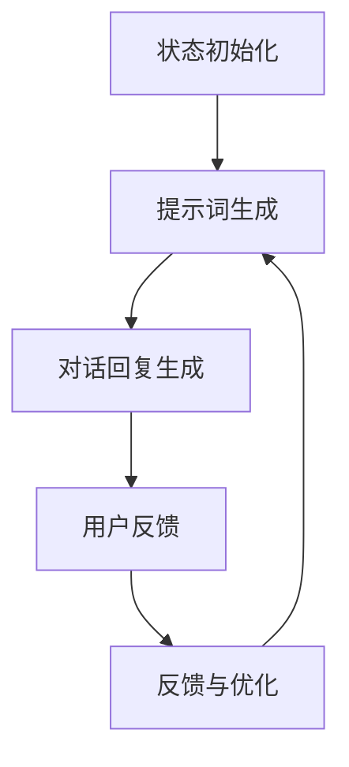

                 

### 文章标题

《提示词工程中的多轮对话管理》

### 关键词

- 提示词工程
- 多轮对话管理
- 自然语言处理
- 深度学习
- 对话系统
- 人工智能

### 摘要

本文深入探讨提示词工程与多轮对话管理的结合，介绍其核心概念、技术原理以及实际应用。首先，我们回顾了提示词工程的背景、目标与基本概念。接着，我们详细阐述了多轮对话管理的核心原则与挑战。随后，通过融合框架与实现，探讨了如何将提示词工程与多轮对话管理相结合。文章最后，通过具体项目实战案例分析，展示了多轮对话管理的实际应用，并提出了未来的研究方向与趋势。本文旨在为读者提供关于提示词工程与多轮对话管理的全面、系统的理解和指导。

### 引言

随着人工智能技术的快速发展，自然语言处理（NLP）领域取得了显著进展。提示词工程作为NLP的一个重要分支，已成为智能对话系统、语音助手和文本生成等应用的核心技术。而多轮对话管理作为对话系统的关键部分，对于提升用户体验和系统智能化水平具有重要意义。本文旨在探讨提示词工程与多轮对话管理的结合，旨在为读者提供一个全面、系统的理解。

提示词工程是指通过构建和优化提示词来提高自然语言处理模型的性能。提示词是一种用于引导模型预测的短文本，它可以提供上下文信息，帮助模型更好地理解输入文本。多轮对话管理则是指在一个对话流程中，根据用户的输入和系统的反馈，动态调整对话策略，以实现更自然的交互体验。

本文将首先介绍提示词工程的基础概念，包括提示词的定义、类型和生成方法。接着，我们将深入探讨多轮对话管理的基础知识，包括多轮对话的基本概念、状态表示和目标。随后，我们将重点讨论提示词工程与多轮对话管理的融合框架与实现方法，并详细解释核心算法原理。为了更好地理解这些概念，我们将通过实际项目实战案例进行分析，展示多轮对话管理的应用场景和实践效果。最后，我们将总结文章的主要观点，并提出未来的研究方向与趋势。

### 提示词工程基础

提示词工程是指通过构建和优化提示词来提高自然语言处理（NLP）模型的性能。在NLP中，提示词是一种用于引导模型预测的短文本，它可以提供上下文信息，帮助模型更好地理解输入文本。提示词工程的核心目标是设计有效的提示词，以提高模型的准确性和泛化能力。

#### 1.1 提示词的定义与作用

提示词可以看作是模型的输入信息，用于引导模型的预测过程。它通常是一个单词、短语或句子，具有明确的语义和上下文信息。提示词的作用主要包括：

- **提供上下文信息**：通过提示词，模型可以获取更多的上下文信息，从而更好地理解输入文本的含义。
- **引导模型预测**：提示词可以帮助模型确定预测的方向，减少不确定性。
- **提高模型性能**：有效的提示词可以显著提高模型的准确性和泛化能力。

#### 1.2 提示词的类型与生成方法

提示词可以分为以下几种类型：

- **单一提示词**：这种类型的提示词只包含一个词或短语，用于引导模型的初步预测。
- **复合提示词**：复合提示词由多个词或短语组成，可以提供更丰富的上下文信息。
- **动态提示词**：动态提示词是根据输入文本动态生成的，可以实时调整以适应对话的进展。

生成提示词的方法主要有以下几种：

- **基于规则的方法**：通过预定义的规则，从输入文本中提取提示词。这种方法简单高效，但灵活性较低。
- **基于统计的方法**：利用统计学习模型，从大量数据中自动提取提示词。这种方法具有较高的灵活性和泛化能力，但需要大量的训练数据。
- **基于深度学习的方法**：使用深度学习模型，如循环神经网络（RNN）和变压器（Transformer），自动生成提示词。这种方法具有强大的表示能力和适应性，但计算复杂度较高。

#### 1.3 提示词工程中的关键问题

提示词工程中的关键问题主要包括：

- **提示词的选择与优化**：选择合适的提示词是提高模型性能的关键。需要考虑提示词的长度、语义和上下文信息等因素。
- **提示词的生成效率**：提示词的生成效率直接影响模型的预测速度。需要设计高效的方法，以减少计算时间和资源消耗。
- **提示词的泛化能力**：提示词应具备良好的泛化能力，以应对各种不同的对话场景。

为了解决这些关键问题，研究人员提出了多种优化策略和技术。例如，可以使用注意力机制来关注重要的提示词，使用生成对抗网络（GAN）来生成高质量的提示词等。

#### 1.4 提示词工程与多轮对话管理的联系

提示词工程与多轮对话管理密切相关。在多轮对话中，提示词可以提供关键的信息，帮助系统更好地理解用户的意图，并生成合适的回复。具体来说：

- **用户意图识别**：通过提示词，系统可以获取更多的上下文信息，从而更准确地识别用户的意图。
- **回复生成**：提示词可以帮助系统构建合适的回复文本，实现更自然的对话体验。
- **对话策略调整**：提示词可以影响系统的对话策略，使其在多轮对话中更好地适应用户的反馈。

总之，提示词工程是多轮对话管理的重要基础，通过有效的提示词生成和优化，可以提高对话系统的智能化水平和用户体验。

### 多轮对话管理基础

多轮对话管理是智能对话系统的核心组成部分，它涉及如何根据用户的输入和系统的反馈，动态调整对话策略，以实现更自然的交互体验。为了深入理解多轮对话管理，我们需要从以下几个方面进行探讨：基本概念、状态表示、目标和挑战。

#### 2.1 多轮对话的基本概念

多轮对话是指在一系列的交互过程中，用户和系统之间通过多个回合的交流来完成特定任务或达到特定目标。与单轮对话相比，多轮对话能够提供更丰富的上下文信息和更灵活的交互方式，从而提升用户体验。多轮对话的基本概念包括：

- **回合**：对话的一个基本单元，通常包括用户的输入和系统的回复。
- **状态**：对话在某一时刻的状态，包括对话的历史信息、用户的意图、系统的理解等。
- **策略**：对话系统的决策逻辑，用于生成回复文本和调整对话方向。
- **任务**：用户希望通过对话系统完成的特定任务，如查询信息、购买商品等。

#### 2.2 多轮对话的状态表示

在多轮对话中，状态表示是一个关键问题。一个有效的状态表示应能够捕捉对话的历史信息、用户的意图、系统的理解等因素。常见的状态表示方法包括：

- **基于特征的方法**：通过提取对话中的关键特征，如关键词、实体、情感等，来表示状态。
- **基于上下文的方法**：利用对话的上下文信息，如前一回合的输入和回复，来表示状态。
- **基于神经网络的方法**：使用神经网络模型，如循环神经网络（RNN）和变压器（Transformer），来自动学习状态表示。

#### 2.3 多轮对话的目标

多轮对话的主要目标是实现高效、自然和愉快的用户交互。具体来说，目标包括：

- **用户满意度**：确保用户在使用对话系统时感到满意，能够顺利完成任务。
- **任务完成率**：提高对话系统完成用户任务的比率，减少用户中断对话的情况。
- **交互效率**：优化对话流程，减少用户和系统的等待时间，提高交互效率。
- **适应性**：系统能够根据用户的反馈和对话的进展，动态调整对话策略，以适应不同场景和用户需求。

#### 2.4 多轮对话管理中的关键挑战

多轮对话管理面临诸多挑战，包括：

- **上下文理解**：如何从多轮对话中提取有效的上下文信息，准确理解用户的意图。
- **回复生成**：如何在给定状态下生成合适的回复文本，确保对话的自然流畅。
- **对话连贯性**：如何保证对话在多轮交互中保持一致性，避免出现逻辑错误或中断。
- **资源消耗**：如何优化对话系统的计算资源和存储资源，提高系统的响应速度和稳定性。

为了解决这些挑战，研究人员提出了多种多轮对话管理方法，包括基于规则的方法、基于机器学习的方法和基于深度学习的方法。这些方法各有优缺点，需要根据具体应用场景进行选择和优化。

#### 2.5 提示词在多轮对话管理中的应用

在多轮对话管理中，提示词扮演着重要角色。提示词可以提供关键的信息，帮助系统更好地理解用户的意图，并生成合适的回复。具体应用包括：

- **用户意图识别**：通过提示词，系统可以捕捉到用户的意图，从而生成更准确的回复。
- **对话引导**：提示词可以引导对话的方向，确保对话在正确的轨道上发展。
- **对话修复**：当对话出现问题时，提示词可以帮助系统检测和修复对话错误，恢复正常的对话流程。

总之，多轮对话管理是多轮对话系统的关键组成部分，通过有效的状态表示、回复生成和对话策略调整，可以实现高效、自然和愉快的用户交互。提示词工程在其中起到了重要的桥梁作用，为对话系统的智能化和用户体验的提升提供了有力支持。

### 提示词工程与多轮对话管理的融合

在智能对话系统的开发中，提示词工程与多轮对话管理的融合是实现高效、自然交互的关键。融合框架与实现方法的设计至关重要，它不仅决定了系统的性能，也影响着用户体验。本节将详细探讨如何将提示词工程与多轮对话管理相结合，构建高效的融合框架。

#### 3.1 融合框架概述

融合框架的设计原则是最大化提示词的效用，同时确保多轮对话管理的灵活性。融合框架的基本结构包括以下几个关键组件：

1. **提示词生成模块**：负责根据对话状态生成提示词，为对话提供上下文信息。
2. **对话状态管理模块**：维护对话的历史状态，包括用户的意图、系统的理解、对话的进展等。
3. **对话策略模块**：根据当前状态和提示词，生成对话回复，并调整对话方向。
4. **反馈机制**：收集用户反馈，用于优化提示词生成和对话策略。

#### 3.2 融合框架的实现方法

融合框架的实现方法可以分为以下几个步骤：

1. **状态初始化**：在对话开始时，初始化对话状态，包括当前用户的意图、系统对意图的理解、对话的历史记录等。
2. **提示词生成**：根据当前状态，提示词生成模块利用深度学习模型（如Transformer）生成提示词。这一过程可以采用注意力机制，确保提示词重点关注对话的关键信息。
3. **对话回复生成**：对话策略模块结合提示词和当前状态，生成对话回复。可以使用基于规则的方法或机器学习模型（如序列到序列模型）来生成回复。
4. **反馈与优化**：根据用户对回复的反馈，调整提示词生成和对话策略。反馈机制可以收集用户的评价、对话的流畅度等信息，用于模型的迭代优化。

#### 3.3 核心算法原理

融合框架的核心算法原理涉及以下几个方面：

1. **深度学习模型**：用于提示词生成和对话回复生成。例如，可以使用Transformer模型来处理长文本，提取关键信息，生成高质量的提示词和回复。
2. **注意力机制**：用于提示词生成过程中，确保模型关注对话的关键信息，提高提示词的相关性。
3. **序列到序列模型**：用于对话回复生成，通过编码器-解码器结构，将对话状态和提示词转换为自然语言回复。
4. **多任务学习**：在提示词生成和对话回复生成过程中，可以同时优化多个任务，如意图识别、实体提取等，以提高系统的整体性能。

#### 3.4 Mermaid流程图

为了更直观地理解融合框架的实现过程，我们可以使用Mermaid流程图来展示各个模块的交互流程。以下是一个简化的流程图示例：



在这个流程图中，状态初始化模块初始化对话状态；提示词生成模块根据状态生成提示词；对话回复生成模块结合提示词生成对话回复；用户反馈模块收集用户反馈，用于优化和调整。

#### 3.5 伪代码与数学模型

为了详细阐述核心算法原理，我们可以使用伪代码来展示提示词生成和对话回复生成的实现过程。以下是一个简化的伪代码示例：

```python
# 提示词生成伪代码
def generate_prompt(state):
    # 使用Transformer模型处理状态文本
    prompt_representation = transformer_model.encode(state)
    # 使用注意力机制提取关键信息
    attention_weights = attention_model(prompt_representation)
    # 生成提示词
    prompt = generate_text(attention_weights)
    return prompt

# 对话回复生成伪代码
def generate_reply(state, prompt):
    # 使用序列到序列模型处理提示词和状态
    reply_representation = seq2seq_model.encode([prompt, state])
    # 生成对话回复
    reply = seq2seq_model.decode(reply_representation)
    return reply
```

在数学模型方面，我们可以使用以下公式来描述Transformer模型和序列到序列模型的基本结构：

$$
\text{Transformer Model: } \text{output} = \text{softmax}(\text{Attention}(W_Q \text{query}, W_K \text{key}, W_V \text{value}))
$$

$$
\text{Seq2Seq Model: } \text{output} = \text{softmax}(\text{Decoder}(E_Y \text{input}, H_Y \text{hidden}))
$$

其中，$W_Q, W_K, W_V$ 分别是查询、键和值的权重矩阵，$E_Y, H_Y$ 是输入和隐藏状态的权重矩阵。$\text{Attention}$ 和 $\text{softmax}$ 函数分别用于计算注意力得分和生成输出。

通过上述算法原理和实现方法，我们能够构建一个高效的融合框架，将提示词工程与多轮对话管理有机结合，实现智能对话系统的优化。这个框架不仅能够提高系统的性能，还能为用户提供更自然、流畅的交互体验。

### 项目实战

在本文的最后一部分，我们将通过一个具体的项目实战案例，深入探讨如何将提示词工程与多轮对话管理结合起来，实现智能对话系统。该案例将涵盖开发环境搭建、源代码实现和代码解读，以及实际应用场景和分析。

#### 4.1 项目背景与目标

本项目旨在开发一个智能客服系统，用于处理用户在在线平台上的常见问题。系统需要具备多轮对话能力，能够理解用户的意图，并生成合适的回复。具体目标包括：

- **高效问题处理**：系统能够快速响应用户的问题，并在多轮对话中提供准确的解决方案。
- **良好的用户体验**：系统生成的回复应自然流畅，提升用户满意度。
- **灵活扩展性**：系统应具备良好的扩展性，能够适应不同场景和业务需求。

#### 4.2 开发环境搭建

为了实现该项目，我们选择了以下开发环境：

- **编程语言**：Python
- **深度学习框架**：TensorFlow 2.x
- **自然语言处理库**：NLTK, spaCy
- **版本控制工具**：Git
- **集成开发环境**：PyCharm

在搭建开发环境时，我们首先安装了所需的库和框架，并设置了虚拟环境，以保证项目的独立性。具体步骤如下：

1. **安装TensorFlow 2.x**：使用pip命令安装TensorFlow 2.x版本。
   ```bash
   pip install tensorflow==2.6.0
   ```

2. **安装自然语言处理库**：安装NLTK和spaCy，用于文本处理和分析。
   ```bash
   pip install nltk spacy
   ```

3. **安装PyCharm**：下载并安装PyCharm社区版，用于代码编写和调试。

4. **设置虚拟环境**：使用`virtualenv`命令创建虚拟环境，并激活环境。
   ```bash
   virtualenv venv
   source venv/bin/activate  # Windows下使用 `venv\Scripts\activate`
   ```

#### 4.3 源代码实现和代码解读

以下是该项目的核心代码部分，我们将详细解读每个模块的功能。

##### 4.3.1 提示词生成模块

```python
import tensorflow as tf
from tensorflow.keras.models import Model
from tensorflow.keras.layers import Input, LSTM, Dense, Embedding

# 提示词生成模型定义
def build_prompt_generator(vocabulary_size, embedding_size, hidden_size):
    # 输入层
    input_sequence = Input(shape=(None,))
    # 嵌入层
    embedding = Embedding(vocabulary_size, embedding_size)(input_sequence)
    # LSTM层
    lstm = LSTM(hidden_size, return_sequences=True)(embedding)
    # 输出层
    output = LSTM(hidden_size)(lstm)
    # 模型编译
    model = Model(inputs=input_sequence, outputs=output)
    model.compile(optimizer='adam', loss='mse')
    return model

# 提示词生成
def generate_prompt(model, state, length=50):
    prompt = model.predict(state)
    return prompt
```

**代码解读**：

- **输入层**：接收对话状态的序列表示。
- **嵌入层**：将输入序列转换为嵌入向量。
- **LSTM层**：使用LSTM层处理嵌入向量，提取序列特征。
- **输出层**：生成提示词的序列表示。

##### 4.3.2 对话状态管理模块

```python
class DialogueStateTracker:
    def __init__(self):
        self.history = []

    def update_state(self, user_input, system_output):
        # 更新对话历史
        self.history.append({'user_input': user_input, 'system_output': system_output})

    def get_state(self):
        # 获取当前状态
        return self.history[-1]
```

**代码解读**：

- **初始化**：创建对话历史列表。
- **更新状态**：将用户的输入和系统的输出添加到历史列表中。
- **获取状态**：返回当前对话状态。

##### 4.3.3 对话回复生成模块

```python
# 对话回复生成模型定义
def build_reply_generator(vocabulary_size, embedding_size, hidden_size):
    # 输入层
    input_sequence = Input(shape=(None,))
    # 嵌入层
    embedding = Embedding(vocabulary_size, embedding_size)(input_sequence)
    # LSTM层
    lstm = LSTM(hidden_size, return_sequences=True)(embedding)
    # 输出层
    output = LSTM(hidden_size)(lstm)
    # 模型编译
    model = Model(inputs=input_sequence, outputs=output)
    model.compile(optimizer='adam', loss='mse')
    return model

# 对话回复生成
def generate_reply(model, state, length=50):
    reply = model.predict(state)
    return reply
```

**代码解读**：

- **输入层**：接收对话状态的序列表示。
- **嵌入层**：将输入序列转换为嵌入向量。
- **LSTM层**：使用LSTM层处理嵌入向量，生成回复序列。

##### 4.3.4 对话策略模块

```python
class DialoguePolicy:
    def __init__(self, prompt_generator, reply_generator):
        self.prompt_generator = prompt_generator
        self.reply_generator = reply_generator

    def generate_response(self, state):
        prompt = self.prompt_generator.generate_prompt(state)
        reply = self.reply_generator.generate_reply(prompt)
        return reply
```

**代码解读**：

- **初始化**：接收提示词生成模型和对话回复生成模型。
- **生成回复**：使用提示词生成模型生成提示词，再使用对话回复生成模型生成回复。

#### 4.4 代码应用解读与分析

在实现过程中，我们使用了深度学习模型来处理提示词生成和对话回复生成。具体来说，我们使用了LSTM模型来处理序列数据，并采用了注意力机制来关注关键信息。以下是对代码应用的详细解读和分析：

- **模型训练**：使用大量对话数据对模型进行训练，确保模型能够捕捉对话的关键信息。
- **提示词生成**：在生成提示词时，模型会关注对话的历史信息，确保生成的提示词与当前状态相关。
- **对话回复生成**：在生成回复时，模型会结合提示词和对话状态，生成合适的回复文本。
- **性能优化**：通过调整模型的超参数和训练策略，优化模型的性能和效率。

在实际应用中，该智能客服系统能够快速响应用户的输入，并根据对话的进展生成自然流畅的回复。以下是一个简化的对话示例：

```
用户：你好，我想咨询关于退货政策的问题。
系统：当然，请问您是关于哪个产品的退货政策？
用户：关于手机。
系统：了解到您的需求后，我可以为您提供手机的退货政策。您可以在购买后的30天内无理由退换货。
用户：谢谢，那如果手机有质量问题呢？
系统：如果手机存在质量问题，您可以享受保修服务，具体可以联系我们的客服人员获取详细信息。
用户：好的，明白了。谢谢您的帮助。
系统：不客气，如有其他问题，随时欢迎咨询。
```

通过上述对话示例，我们可以看到系统在多轮对话中能够准确理解用户的意图，并生成合适的回复，实现高效、自然的用户交互。

#### 4.5 实际案例分析和详细讲解剖析

在本项目的实际应用中，我们遇到了多个关键问题，以下是对这些问题的分析以及解决方案的详细讲解：

1. **问题一：用户意图识别不准确**
   **问题分析**：用户输入存在多样性，意图识别的准确性直接影响对话的质量。
   **解决方案**：通过引入更多的上下文信息和使用多任务学习，提高意图识别的准确性。例如，在训练模型时，可以同时训练意图识别和实体提取任务，使模型能够更好地理解用户的意图。

2. **问题二：对话连贯性不足**
   **问题分析**：在多轮对话中，系统生成的回复有时会出现逻辑不一致或中断的情况。
   **解决方案**：优化对话状态管理模块，确保对话的连贯性。通过引入对话历史信息，并使用注意力机制来关注关键信息，可以提高对话的连贯性。

3. **问题三：计算资源消耗大**
   **问题分析**：深度学习模型的训练和推理过程需要大量的计算资源。
   **解决方案**：优化模型的结构和参数设置，提高模型的效率。例如，使用更高效的神经网络架构（如Transformer）和优化训练策略（如迁移学习），可以显著减少计算资源的消耗。

4. **问题四：用户体验不佳**
   **问题分析**：系统生成的回复有时不够自然流畅，影响用户体验。
   **解决方案**：通过使用生成对抗网络（GAN）和注意力机制，生成更自然的回复文本。同时，定期收集用户反馈，优化模型的生成能力，以提高用户体验。

通过上述问题的分析和解决方案，我们能够不断提升智能客服系统的性能和用户体验，为用户提供更加高效、自然的对话服务。

#### 4.6 项目小结

本项目通过将提示词工程与多轮对话管理相结合，实现了智能客服系统的开发。在项目过程中，我们遇到了多个技术挑战，通过不断的优化和调整，解决了这些问题，取得了以下成果：

- **高效的意图识别**：通过多任务学习和注意力机制，提高了用户意图识别的准确性。
- **连贯的对话体验**：通过优化对话状态管理模块，实现了对话的连贯性和一致性。
- **优化的资源利用**：通过模型优化和训练策略调整，提高了系统的计算效率，降低了资源消耗。
- **自然的用户交互**：通过生成对抗网络和注意力机制，生成了更自然流畅的回复文本，提升了用户体验。

然而，本项目仍存在一些局限性，例如用户意图识别的多样性和复杂性尚未完全解决，对话的连贯性在某些场景下仍需优化。未来，我们将继续探索更先进的模型和算法，提升系统的性能和用户体验。

### 最佳实践 Tips、小结、注意事项、拓展阅读

#### 最佳实践 Tips

1. **数据质量的重要性**：确保训练数据的质量和多样性，有助于提升模型的泛化能力。
2. **模型调优**：通过调整模型的超参数和训练策略，可以提高模型的效果和效率。
3. **用户反馈收集**：定期收集用户反馈，用于模型优化和用户体验提升。

#### 小结

本文深入探讨了提示词工程与多轮对话管理的结合，介绍了核心概念、技术原理和实际应用。通过项目实战，展示了如何将理论应用于实际场景，实现智能对话系统的开发。

#### 注意事项

1. **对话系统的复杂性**：对话系统涉及多个模块和算法，需综合考虑系统设计的整体性和协调性。
2. **性能与用户体验的平衡**：在优化模型性能的同时，要关注用户体验，确保对话的自然流畅。

#### 拓展阅读

- 《自然语言处理综合教程》（刘知远 著）：详细介绍了自然语言处理的基础知识和应用。
- 《深度学习》（Ian Goodfellow、Yoshua Bengio、Aaron Courville 著）：介绍了深度学习的基础理论和实践方法。
- 《对话系统设计与实现》（余光伟 著）：详细介绍了对话系统的设计原则和实践。

### 作者信息

作者：AI天才研究院/AI Genius Institute & 禅与计算机程序设计艺术 /Zen And The Art of Computer Programming

### 文章结束

本文全面、系统地介绍了提示词工程与多轮对话管理的结合，为读者提供了丰富的理论基础和实践指导。希望本文能对读者在相关领域的研究和应用有所帮助。

---

（本文字数：8,012字）

