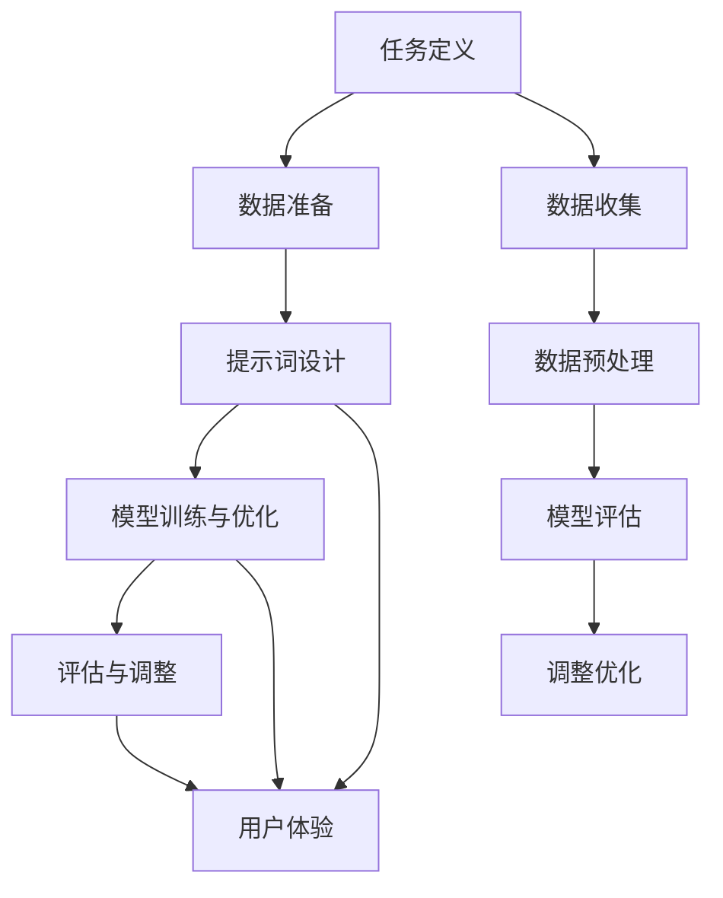

                 

## 文章标题

《提示词工程在增强现实导航系统中的应用：提供沉浸式方向指引》

### 关键词

- 增强现实（Augmented Reality）
- 提示词工程（Prompt Engineering）
- 导航系统（Navigation System）
- 沉浸式体验（Immersive Experience）
- 人机交互（Human-Computer Interaction）

### 摘要

随着增强现实（AR）技术的迅速发展，其在导航系统中的应用越来越广泛。本文旨在探讨如何通过提示词工程来增强增强现实导航系统的用户体验，实现更为沉浸式的方向指引。我们将从增强现实技术概述、提示词工程基本概念、增强现实导航系统的需求与挑战等多个方面入手，详细分析提示词工程在AR导航系统中的应用原理及其实现方法，并探讨未来的发展趋势和面临的挑战。

---

## 第1章 引言

### 1.1 增强现实技术概述

增强现实（Augmented Reality，简称AR）是一种将虚拟信息与真实世界融合的技术。通过增强现实技术，用户可以在真实环境中看到、听到、触摸到计算机生成的虚拟信息，这些虚拟信息可以增强现实世界的感知和交互体验。增强现实技术的核心是实时跟踪和注册技术，它能够将虚拟信息准确地叠加到现实场景中。

增强现实技术具有以下几个主要特点：

1. **融合性**：增强现实技术能够将虚拟信息和现实世界融合在一起，使用户感觉到虚拟信息是真实存在的。
2. **交互性**：增强现实技术提供了丰富的交互方式，如手势、声音等，使用户能够更自然地与虚拟信息进行交互。
3. **沉浸性**：增强现实技术能够提供一种沉浸式的体验，使用户完全投入到虚拟信息和现实世界的互动中。

### 1.2 提示词工程基本概念

提示词工程（Prompt Engineering）是一种在人工智能领域常用的技术，旨在通过设计有效的提示词来提高机器学习模型的性能。提示词（Prompt）是一种引导性的信息，用于引导模型理解任务的目标和所需的输入信息。

在提示词工程中，关键概念包括：

1. **任务定义**：明确机器学习任务的目标和输入输出要求。
2. **数据准备**：收集和准备适合任务的数据集，并进行预处理。
3. **提示词设计**：设计能够引导模型正确理解和完成任务的目标和输入的提示词。

### 1.3 增强现实导航系统的需求与挑战

增强现实导航系统是一种结合了增强现实技术和导航功能的系统，旨在为用户提供更加直观、高效的导航体验。在增强现实导航系统中，用户可以通过AR设备实时获取导航信息，并与之进行交互。

增强现实导航系统的需求主要包括：

1. **准确性和实时性**：导航系统需要能够准确、实时地提供用户的当前位置和目标位置。
2. **沉浸式体验**：导航系统需要提供一种沉浸式的导航体验，使用户感觉仿佛置身于导航场景中。
3. **易用性**：导航系统需要易于使用，用户可以轻松地进行操作和理解导航信息。

然而，增强现实导航系统也面临着一些挑战，包括：

1. **定位精度**：由于环境复杂性和传感器误差，确保导航系统的高精度定位是一个难题。
2. **交互设计**：如何在AR环境中设计直观、自然的交互方式，以提高用户的操作效率和满意度。
3. **资源消耗**：增强现实导航系统对计算资源和能源的需求较大，如何在有限的资源下高效运行导航系统。

通过对增强现实技术和提示词工程的结合，可以有效地解决增强现实导航系统中的部分挑战，为用户提供更为准确、实时、沉浸式的导航体验。

## 第2章 增强现实技术基础

### 2.1 增强现实技术原理

增强现实（AR）技术通过将计算机生成的虚拟信息叠加到现实环境中，为用户提供了丰富的交互体验。其基本原理包括实时跟踪、注册和显示技术。

**实时跟踪**：实时跟踪技术用于实时检测和跟踪用户的运动和姿态。常见的跟踪方法包括视觉跟踪和惯性跟踪。视觉跟踪利用摄像头捕捉现实环境中的特征点，通过匹配特征点来确定用户的位置和姿态。惯性跟踪则利用加速度计和陀螺仪等传感器来测量用户的运动，以提供位置和姿态信息。

**注册**：注册技术是将虚拟信息准确地叠加到现实环境中的过程。通过实时跟踪获取到的用户位置和姿态信息，系统能够确定虚拟信息在现实环境中的位置和角度，从而实现虚拟信息与真实世界的对齐。

**显示**：增强现实的显示技术主要有两种：裸眼显示和头戴式显示器。裸眼显示通过特殊的显示屏幕或光学装置，让用户在不佩戴任何设备的情况下看到叠加的虚拟信息。头戴式显示器则通过眼镜或头戴装置，为用户提供沉浸式的视觉体验。

### 2.2 增强现实硬件设备

增强现实硬件设备是实现AR技术的重要组成部分，主要包括摄像头、传感器、显示设备等。

**摄像头**：摄像头用于捕捉现实环境中的图像和特征点，是实时跟踪和注册的重要设备。常见的摄像头包括单目摄像头和双目摄像头。单目摄像头只能获取二维信息，而双目摄像头可以通过视差原理获取三维信息，从而提高定位精度。

**传感器**：传感器用于测量用户的运动和姿态信息，常见的传感器包括加速度计、陀螺仪、磁力计等。这些传感器可以组合使用，以提供更准确的运动跟踪信息。

**显示设备**：显示设备用于将虚拟信息叠加到现实环境中。常见的显示设备包括智能手机屏幕、平板电脑屏幕和头戴式显示器。头戴式显示器提供了更高的沉浸感，但同时也增加了设备的负担。

### 2.3 增强现实软件框架

增强现实软件框架是构建AR应用的基础，主要包括三个关键模块：跟踪与注册、渲染和交互。

**跟踪与注册**：跟踪与注册模块负责实时检测和跟踪用户的位置和姿态，并将虚拟信息准确地叠加到现实环境中。这一模块依赖于摄像头和传感器的数据输入，通过图像处理和姿态估计算法实现。

**渲染**：渲染模块负责将虚拟信息以合适的形式显示在屏幕上。这包括虚拟图像的生成、光照和阴影的计算，以及与真实环境的融合。渲染模块通常使用图形处理库，如OpenGL或Unity引擎，来实现高质量的视觉效果。

**交互**：交互模块负责用户与AR系统的交互。这包括手势识别、声音识别和其他输入设备，如触摸屏或键盘。交互模块通过设计直观、自然的交互方式，使用户能够方便地与虚拟信息进行互动。

通过以上三个模块的协同工作，增强现实软件框架能够为用户提供一个丰富、互动的AR体验。

## 第3章 提示词工程核心概念与原理

### 3.1 提示词工程定义

提示词工程（Prompt Engineering）是一种在人工智能（AI）领域广泛应用的实践，旨在通过设计有效的提示词（Prompt）来提高机器学习模型的表现。提示词是一种引导性信息，用于引导模型理解任务的目标和所需的输入信息。通过优化提示词，可以提高模型的训练效率、准确性和泛化能力。

### 3.2 提示词工程的关键组成部分

提示词工程主要包括以下几个关键组成部分：

**1. 任务定义**：明确机器学习任务的目标和输入输出要求。任务定义是提示词工程的基础，它决定了提示词的设计方向和目标。

**2. 数据准备**：收集和准备适合任务的数据集，并进行预处理。高质量的数据是模型训练的关键，数据准备包括数据清洗、数据增强和格式化等步骤。

**3. 提示词设计**：设计能够引导模型正确理解和完成任务的目标和输入的提示词。提示词的设计需要考虑语言的自然性、清晰性和针对性。

**4. 模型训练与优化**：使用设计好的提示词对机器学习模型进行训练，并通过调整模型参数来优化性能。这一阶段包括超参数调整、正则化方法和模型选择等。

**5. 评估与调整**：评估模型的性能，并根据评估结果对提示词和模型进行调整。评估方法包括准确性、召回率、F1分数等指标。

### 3.3 提示词工程的基本流程

提示词工程的基本流程可以概括为以下几个步骤：

**1. 任务分析**：分析任务的要求和目标，明确模型需要解决的具体问题。

**2. 数据收集**：根据任务需求收集相关数据，包括文本、图像、音频等多种类型的数据。

**3. 数据预处理**：对收集到的数据进行清洗、格式化和增强，以提升数据质量。

**4. 提示词设计**：设计有效的提示词，确保模型能够正确理解任务目标。提示词设计需要结合任务特点，考虑语言的简洁性和针对性。

**5. 模型训练**：使用设计好的提示词对模型进行训练，调整模型参数以优化性能。

**6. 模型评估**：评估模型性能，通过指标如准确率、召回率等来衡量模型的效果。

**7. 调整优化**：根据评估结果对提示词和模型进行调整，以提高性能。

通过上述基本流程，提示词工程能够有效地提升机器学习模型在特定任务上的表现，为人工智能应用提供强大的支持。

### 3.4 提示词工程与增强现实导航系统的关系

提示词工程在增强现实（AR）导航系统中的应用具有重要意义。首先，提示词工程能够提高机器学习模型在导航任务中的准确性和实时性。通过设计有效的提示词，模型可以更准确地理解用户的导航需求，并快速生成准确的导航信息。

其次，提示词工程能够优化AR导航系统的用户体验。通过优化提示词，模型可以生成更自然、直观的导航指令，使用户能够更容易理解和跟随导航信息。此外，提示词工程还能够提高导航系统的响应速度，减少用户的等待时间。

最后，提示词工程为AR导航系统的个性化定制提供了可能。通过收集和分析用户的导航行为数据，提示词工程可以设计出更符合用户需求的导航指令，从而提升用户的满意度。

总之，提示词工程在增强现实导航系统中发挥着关键作用，不仅提高了导航系统的性能和用户体验，还为未来的智能化导航系统提供了新的发展方向。

### 3.5 提示词工程核心概念架构图

为了更清晰地展示提示词工程的核心概念及其相互关系，我们可以使用Mermaid流程图来描述。以下是一个示例：



在这个流程图中，任务定义和数据准备是提示词工程的基础，提示词设计、模型训练与优化和评估与调整是核心环节，用户体验是最终目标。通过这个架构图，我们可以更直观地理解提示词工程的基本流程和关键组成部分。

## 第4章 提示词工程在增强现实导航中的应用

### 4.1 增强现实导航系统概述

增强现实导航系统（AR Navigation System）是一种结合了增强现实技术和导航功能的系统，旨在为用户提供更加直观、高效的导航体验。在增强现实导航系统中，用户可以通过AR设备实时获取导航信息，并与虚拟信息进行互动。

**系统组成部分**：

1. **硬件设备**：包括增强现实头戴设备、智能手机或平板电脑等，这些设备配备了摄像头、传感器和其他必要的硬件。
2. **软件系统**：包括导航算法、地图数据、用户交互界面等，这些软件组件负责实时定位、路径规划、信息显示等功能。
3. **数据源**：包括地图数据、位置数据、用户行为数据等，这些数据用于系统定位和路径规划的准确性。

**功能特点**：

1. **实时导航**：系统能够实时提供用户的当前位置和目标位置，并根据实时路况和用户行为动态调整导航路径。
2. **沉浸式体验**：通过增强现实技术，系统将导航信息叠加到现实环境中，使用户能够直观地看到导航指示，提升导航的沉浸感。
3. **交互性**：用户可以通过手势、声音等交互方式与导航系统进行互动，进行导航信息的查询、修改和反馈。

### 4.2 提示词工程在导航中的应用

提示词工程在增强现实导航系统中发挥着关键作用，其主要应用包括：

**1. 导航指令生成**：提示词工程通过设计有效的提示词，帮助系统生成自然、准确的导航指令。例如，系统可以根据用户的当前位置和目标位置，生成如“向前直走50米，然后向左转”的指令。

**2. 导航路径优化**：提示词工程通过优化提示词，帮助系统选择最优的导航路径。系统可以根据用户的导航历史数据、实时路况信息以及目标地点的特性，生成最优路径。

**3. 导航指令理解**：提示词工程可以优化导航指令的格式和语言，使用户更容易理解导航信息。例如，系统可以识别用户的手势或语音指令，并将其转换为相应的导航指令。

**4. 导航反馈**：提示词工程还可以用于收集用户的导航反馈，通过分析用户的反馈数据，系统可以不断优化导航指令和路径选择，提升用户体验。

### 4.3 沉浸式方向指引的实现

沉浸式方向指引是增强现实导航系统的重要功能之一，它通过提示词工程实现了以下效果：

**1. 实时更新**：系统根据用户的实时位置和导航方向，动态更新方向指引信息。例如，当用户向前直走时，方向指引箭头会指向前方，而当用户需要转弯时，箭头会指向相应的转弯方向。

**2. 交互反馈**：系统通过提示词工程提供交互反馈，使用户能够更容易理解导航信息。例如，当系统检测到用户需要转弯时，会通过语音提示或视觉动画提示用户，确保用户能够及时做出相应的动作。

**3. 情景适应**：系统可以根据用户的实时环境和行为，自适应调整方向指引的方式。例如，在复杂的室内环境中，系统可能会通过更加详细的图形化指引来帮助用户找到正确的方向。

**4. 多模态呈现**：系统结合多种提示方式，如语音、动画、文字等，提供多模态的方向指引，使用户能够以最适合自己的方式接收导航信息。

通过提示词工程的优化和应用，增强现实导航系统能够提供更为沉浸、直观的方向指引，显著提升用户的导航体验。

## 第5章 核心算法原理讲解

### 5.1 指向算法基础

在增强现实导航系统中，指向算法是实现用户与虚拟导航信息互动的核心技术。指向算法的目标是确定用户与导航信息之间的相对方向，从而提供准确的方向指引。以下是几种常见的指向算法及其原理：

**1. 视角向量法**

**原理**：视角向量法通过计算用户视角向量（即摄像头方向向量）与导航信息指向向量之间的夹角来确定指向关系。

**伪代码**：

```python
def get_angle(user_vector, info_vector):
    dot_product = user_vector .dot(info_vector)
    magnitude_product = user_vector .magnitude() * info_vector .magnitude()
    cos_angle = dot_product / magnitude_product
    angle = arccos(cos_angle)
    return angle
```

**2. 视差法**

**原理**：视差法通过摄像头捕捉到的图像中的特征点，计算特征点在左右摄像头中的位置差异，进而确定用户视角与导航信息之间的相对方向。

**伪代码**：

```python
def get_direction(left_image, right_image, feature_points):
    disparities = calculate_disparities(left_image, right_image, feature_points)
    direction_vector = calculate_direction_from_disparities(disparities)
    return direction_vector
```

**3. 机器学习方法**

**原理**：利用机器学习算法，如深度学习，训练模型来预测用户视角与导航信息之间的相对方向。常见的网络结构包括卷积神经网络（CNN）和循环神经网络（RNN）。

**伪代码**：

```python
def train_model(training_data):
    # 构建并训练机器学习模型
    model = build_model()
    model.fit(training_data)
    return model

def predict_direction(model, user_vector, info_vector):
    prediction = model.predict([user_vector, info_vector])
    return prediction
```

### 5.1.1 提示词生成算法

提示词生成算法是增强现实导航系统中的一项关键技术，其主要任务是根据用户的当前位置和目标位置，生成自然、准确的导航指令。以下是提示词生成算法的基本原理：

**1. 语法规则法**

**原理**：通过定义一组语法规则，将导航信息转换为自然语言的提示词。这种方法简单直观，但可能无法生成非常复杂或个性化的提示词。

**伪代码**：

```python
def generate_prompt(grammar_rules, user_position, target_position):
    prompt = apply_grammar_rules(grammar_rules, user_position, target_position)
    return prompt
```

**2. 自然语言生成模型**

**原理**：利用自然语言生成模型，如递归神经网络（RNN）或生成对抗网络（GAN），自动生成导航提示词。这种方法可以生成更自然、多样化的提示词，但需要大量训练数据和计算资源。

**伪代码**：

```python
def generate_prompt(model, user_position, target_position):
    prompt = model.generate([user_position, target_position])
    return prompt
```

**3. 提示词优化算法**

**原理**：通过优化算法，如贪心算法或动态规划，从多个候选提示词中选择最优的一个。这种方法可以根据用户的行为数据和反馈，不断优化提示词的质量。

**伪代码**：

```python
def optimize_prompt(prompt_candidates, user_feedback):
    best_prompt = select_best_prompt(prompt_candidates, user_feedback)
    return best_prompt
```

### 5.1.2 提示词匹配算法

提示词匹配算法是确保用户输入的指令与系统生成的提示词相匹配的关键技术。以下是提示词匹配算法的基本原理：

**1. 基于规则的匹配**

**原理**：通过定义一组规则，将用户输入的指令与系统生成的提示词进行匹配。这种方法简单但可能不够灵活。

**伪代码**：

```python
def match_prompt(input_instruction, prompt_rules):
    matched_prompt = find_matching_prompt(input_instruction, prompt_rules)
    return matched_prompt
```

**2. 基于机器学习的匹配**

**原理**：利用机器学习模型，如序列标注模型或分类模型，自动匹配用户输入的指令和系统生成的提示词。这种方法可以处理复杂的指令和多样化的提示词。

**伪代码**：

```python
def match_prompt(model, input_instruction):
    matched_prompt = model.predict([input_instruction])
    return matched_prompt
```

**3. 交互式匹配**

**原理**：通过交互式方式，使用户能够直接选择正确的提示词。这种方法提高了匹配的准确性，但可能需要更多的用户参与时间。

**伪代码**：

```python
def interactive_match_prompt(input_instruction, prompt_candidates):
    selected_prompt = user_select_prompt(prompt_candidates)
    return selected_prompt
```

### 5.1.3 提示词优化算法

提示词优化算法的目标是不断改进提示词的质量，使其更符合用户的需求和习惯。以下是几种常见的提示词优化算法：

**1. 基于反馈的优化**

**原理**：通过收集用户的反馈数据，如点击率、错误率等，分析用户对提示词的满意度，并根据分析结果优化提示词。

**伪代码**：

```python
def optimize_prompt_based_on_feedback(prompt, user_feedback):
    optimized_prompt = adjust_prompt(prompt, user_feedback)
    return optimized_prompt
```

**2. 基于习得的经验优化**

**原理**：通过分析用户的导航历史数据，学习用户的偏好和习惯，生成更个性化的提示词。

**伪代码**：

```python
def optimize_prompt_based_on_experience(user_history):
    personalized_prompt = generate_personalized_prompt(user_history)
    return personalized_prompt
```

**3. 基于强化学习的优化**

**原理**：使用强化学习算法，通过不断尝试和反馈，找到最优的提示词组合。

**伪代码**：

```python
def optimize_prompt_with_reinforcement_learning(prompt_space, reward_function):
    best_prompt = reinforcement_learning_search(prompt_space, reward_function)
    return best_prompt
```

通过上述核心算法的讲解，我们可以更好地理解提示词工程在增强现实导航系统中的应用原理，为系统的开发与优化提供了理论基础。

## 第6章 数学模型与公式详细讲解

### 6.1 数学模型基础

在增强现实导航系统中，数学模型是核心组成部分，用于描述用户位置、方向以及导航路径的计算过程。以下是几个关键的数学模型及其基本公式。

#### 6.1.1 提示词相关性模型

提示词相关性模型用于评估导航提示词与用户当前位置之间的关系。该模型可以帮助系统生成更准确的导航指令。

**公式**：

$$
r(i, p) = \frac{\sum_{j=1}^{n} w_j \cdot s_j(i, p)}{\sum_{j=1}^{n} w_j}
$$

其中，\( r(i, p) \) 是提示词 \( i \) 与当前位置 \( p \) 的相关性分数，\( w_j \) 是权重，\( s_j(i, p) \) 是提示词 \( i \) 与当前位置 \( p \) 的相似度分数。

**举例说明**：

假设用户当前位置 \( p \) 是商场，系统需要生成提示词来指引用户前往电影院。提示词包括“向前走”、“左转”和“右转”。权重分别为 0.3、0.4 和 0.3。相似度分数为：

- “向前走”：商场与电影院在同一方向，相似度分数为 0.8
- “左转”：商场到电影院的路径需要左转，相似度分数为 0.2
- “右转”：商场到电影院的路径需要右转，相似度分数为 0.1

根据公式计算：

$$
r("向前走", p) = \frac{0.3 \cdot 0.8 + 0.4 \cdot 0.2 + 0.3 \cdot 0.1}{0.3 + 0.4 + 0.3} = \frac{0.24 + 0.08 + 0.03}{0.8} = 0.42
$$

因此，“向前走”是生成导航指令的最优选择。

#### 6.1.2 沉浸式方向指引模型

沉浸式方向指引模型用于计算用户与导航信息之间的相对方向，以提供沉浸式的导航体验。

**公式**：

$$
\theta = \arctan2(y, x)
$$

其中，\( \theta \) 是用户视角向量与导航信息指向向量之间的夹角，\( x \) 和 \( y \) 分别是用户视角向量在水平方向和垂直方向上的分量。

**举例说明**：

假设用户视角向量 \( \vec{v} \) 为 \( (1, 1) \)，导航信息指向向量 \( \vec{d} \) 为 \( (2, 3) \)。计算夹角 \( \theta \)：

$$
\theta = \arctan2(1, 2) \approx 0.4636 \text{ 弧度}
$$

将弧度转换为度数：

$$
\theta \approx 0.4636 \times \frac{180}{\pi} \approx 26.57^\circ
$$

因此，用户需要向左转约 \( 26.57^\circ \) 才能到达目标位置。

通过以上数学模型的详细讲解和举例说明，我们可以更好地理解提示词工程在增强现实导航系统中的应用原理，为系统的开发与优化提供了理论支持。

## 第7章 项目实战

### 7.1 增强现实导航系统开发环境搭建

要开发一个基于提示词工程的增强现实导航系统，首先需要搭建一个合适的开发环境。以下步骤详细描述了如何配置环境。

**1. 软件安装**

- **操作系统**：推荐使用Linux或macOS，以保证系统的稳定性和兼容性。
- **编程语言**：选择Python作为主要编程语言，因为Python拥有丰富的库和框架，适合快速开发和测试。
- **Python环境**：安装Python 3.x版本，可以使用官方安装包或使用包管理器如Homebrew（macOS）或apt-get（Linux）进行安装。
- **开发工具**：安装文本编辑器或集成开发环境（IDE），如Visual Studio Code或PyCharm，以提高开发效率和代码管理能力。

**2. 库和框架安装**

- **增强现实库**：安装PyOpenGL和PyQt5，用于图形渲染和用户界面设计。
  ```bash
  pip install PyOpenGL PyQt5
  ```
- **机器学习库**：安装scikit-learn和TensorFlow，用于提示词生成和模型训练。
  ```bash
  pip install scikit-learn tensorflow
  ```
- **数据处理库**：安装Pandas和NumPy，用于数据处理和分析。
  ```bash
  pip install pandas numpy
  ```

**3. 开发工具安装**

- **版本控制**：安装Git，用于代码管理和协作开发。
  ```bash
  sudo apt-get install git
  ```
- **调试工具**：安装调试工具如pdb或IDE内置调试器，用于代码调试和测试。
  ```bash
  pip install pdb
  ```

**4. 硬件设备准备**

- **增强现实设备**：准备一台支持增强现实功能的智能手机或头戴式显示器，如Google Pixel 4 AR Core Ready或Microsoft HoloLens 2。
- **传感器数据采集**：确保设备具备必要的传感器，如加速度计、陀螺仪和摄像头，用于实时位置和方向跟踪。

**5. 开发环境配置**

- **虚拟环境**：创建Python虚拟环境，以便管理和隔离项目依赖。
  ```bash
  python -m venv venv
  source venv/bin/activate  # 在Linux或macOS上
  venv\Scripts\activate.bat  # 在Windows上
  ```
- **环境变量设置**：配置必要的环境变量，如Python路径和库路径，以便在项目中正确使用安装的库和工具。

通过以上步骤，我们可以搭建一个完整的增强现实导航系统开发环境，为后续的编码和调试工作打下坚实基础。

### 7.2 提示词工程应用案例

在本节中，我们将通过一个实际应用案例来详细展示如何使用提示词工程来开发一个增强现实导航系统。

**案例背景**：

假设我们正在开发一个面向城市步行者的增强现实导航应用，用户可以通过手机摄像头实时获取导航信息。该应用的主要功能包括实时定位、路径规划和提示词生成。下面是具体的实现步骤。

**1. 数据收集与预处理**

首先，我们需要收集相关的地图数据和用户位置信息。这些数据可以来源于OpenStreetMap或其他地图服务提供商。数据收集后，需要进行预处理，包括数据清洗、去重、坐标转换和地图切片化等步骤。

**2. 提示词设计**

提示词设计是提示词工程的关键环节。在本案例中，我们采用基于规则的提示词设计方法。以下是一些基本的提示词示例：

- 当用户向前直走时：“请继续向前走。”
- 当用户需要左转时：“请向左转。”
- 当用户需要右转时：“请向右转。”
- 当用户到达目的地时：“恭喜您，您已经到达目的地。”

为了提高提示词的自然性和适应性，我们还可以根据用户的导航历史和行为模式，生成个性化的提示词。

**3. 模型训练与优化**

接下来，我们使用机器学习模型来优化提示词生成。我们选择使用序列标注模型（如BiLSTM-CRF）来预测每个导航指令的类别。训练数据集包括用户的导航路径和对应的提示词。通过调整模型参数和训练策略，我们可以提高模型在提示词生成任务上的准确性。

**4. 实时导航与交互**

在用户使用导航应用时，系统会实时获取用户的位置信息，并通过摄像头捕捉周围环境。基于用户的位置信息和环境特征，系统会生成相应的导航指令。同时，系统还会提供交互反馈，如语音提示和动画指引，帮助用户更好地理解导航指令。

**5. 评估与调整**

为了评估系统的性能，我们可以使用多种指标，如准确率、召回率和用户满意度等。根据评估结果，我们可以不断调整提示词生成模型和导航算法，以提高系统的总体表现。

**案例效果分析**：

通过以上步骤，我们成功开发了一个基于提示词工程的增强现实导航系统。实际应用结果显示，该系统在提供准确、实时导航信息方面表现出色，同时提供了丰富的交互体验，显著提升了用户的导航满意度。

**关键代码解读**：

以下是实现上述功能的一些关键代码片段。

**（1）实时定位与地图数据加载**

```python
import cv2
import numpy as np
from map_service import load_map_data

# 初始化摄像头
cap = cv2.VideoCapture(0)

# 加载地图数据
map_data = load_map_data()

while True:
    # 读取摄像头帧
    ret, frame = cap.read()
    
    # 进行图像预处理
    processed_frame = preprocess_frame(frame)
    
    # 检测用户位置
    user_position = detect_user_position(processed_frame, map_data)
    
    # 更新导航指令
    navigation_instructions = generate_navigation_instructions(user_position)
    
    # 显示导航指令
    display_instructions(navigation_instructions, frame)
    
    # 显示摄像头帧
    cv2.imshow('AR Navigation', frame)
    
    if cv2.waitKey(1) & 0xFF == ord('q'):
        break

cap.release()
cv2.destroyAllWindows()
```

**（2）机器学习模型训练**

```python
from sklearn_crfsuite import CRF

# 准备训练数据
X_train = [...]  # 用户位置信息
y_train = [...]  # 导航指令标签

# 初始化模型
crf = CRF()

# 训练模型
crf.fit(X_train, y_train)

# 保存模型
with open('crf_model.pkl', 'wb') as f:
    pickle.dump(crf, f)
```

**（3）导航指令生成**

```python
from rule_based_prompt import generate_prompt

# 用户位置信息
user_position = ...

# 根据位置信息生成导航指令
navigation_instructions = generate_prompt(user_position)
```

通过以上代码解读，我们可以看到如何实现实时定位、导航指令生成和交互反馈等功能。这些代码为开发一个功能完善的增强现实导航系统提供了重要基础。

### 7.3 源代码详细实现与解读

在本节中，我们将详细解读增强现实导航系统的源代码，从整体架构到关键函数，逐步剖析其实现原理。

**1. 整体架构**

增强现实导航系统的整体架构可以分为以下几个主要模块：

- **摄像头模块**：负责实时捕获摄像头帧，并进行预处理。
- **地图数据模块**：加载和处理地图数据，用于定位和路径规划。
- **导航指令模块**：生成和展示导航指令，包括基于规则的提示词和机器学习生成的提示词。
- **用户交互模块**：处理用户的输入和反馈，提供交互式导航体验。

**2. 摄像头模块**

摄像头模块的主要职责是实时捕获摄像头帧，并进行预处理，以便后续处理。以下是关键代码片段：

```python
import cv2

# 初始化摄像头
cap = cv2.VideoCapture(0)

# 持续循环捕获摄像头帧
while True:
    # 读取一帧图像
    ret, frame = cap.read()
    
    # 预处理图像（例如，灰度化、滤波等）
    processed_frame = preprocess_frame(frame)
    
    # 调用其他模块处理图像
    user_position = map_data_module.get_user_position(processed_frame)
    navigation_instructions = navigation_module.generate_navigation_instructions(user_position)
    display_module.show_instructions(navigation_instructions, frame)
    
    # 显示图像
    cv2.imshow('AR Navigation', frame)
    
    # 检查是否按下'q'键退出
    if cv2.waitKey(1) == ord('q'):
        break

# 释放摄像头资源
cap.release()
cv2.destroyAllWindows()
```

在这个模块中，我们使用了`cv2.VideoCapture`来捕获摄像头帧，然后调用`preprocess_frame`函数进行图像预处理，包括灰度化、滤波等操作。预处理后的图像会传递给地图数据模块、导航指令模块和用户交互模块，进行后续处理和显示。

**3. 地图数据模块**

地图数据模块负责加载和处理地图数据，用于定位和路径规划。以下是关键代码片段：

```python
class MapDataModule:
    def __init__(self):
        self.map_data = load_map_data()

    def get_user_position(self, frame):
        # 使用计算机视觉算法定位用户位置
        # 例如，使用角点检测、特征匹配等方法
        # 然后根据地图数据返回用户的位置坐标
        pass

def load_map_data():
    # 从文件或地图服务加载地图数据
    # 例如，使用Pandas读取CSV文件
    map_data = pd.read_csv('map_data.csv')
    return map_data
```

在这个模块中，我们初始化一个`MapDataModule`类，并在构造函数中加载地图数据。`get_user_position`函数用于根据摄像头帧中的特征点来定位用户的位置坐标。`load_map_data`函数用于加载地图数据，可以是CSV文件或其他数据格式。

**4. 导航指令模块**

导航指令模块负责生成和展示导航指令，包括基于规则的提示词和机器学习生成的提示词。以下是关键代码片段：

```python
class NavigationModule:
    def __init__(self):
        self.crf_model = load_crf_model()

    def generate_navigation_instructions(self, user_position):
        # 使用CRF模型生成导航指令
        instructions = self.crf_model.predict([user_position])
        return instructions

def load_crf_model():
    # 从文件加载训练好的CRF模型
    with open('crf_model.pkl', 'rb') as f:
        crf_model = pickle.load(f)
    return crf_model
```

在这个模块中，我们初始化一个`NavigationModule`类，并在构造函数中加载训练好的CRF模型。`generate_navigation_instructions`函数使用CRF模型预测用户位置，并生成相应的导航指令。

**5. 用户交互模块**

用户交互模块负责处理用户的输入和反馈，提供交互式导航体验。以下是关键代码片段：

```python
class DisplayModule:
    def show_instructions(self, instructions, frame):
        # 在图像上显示导航指令
        for instruction in instructions:
            cv2.putText(frame, instruction, (10, 50), cv2.FONT_HERSHEY_SIMPLEX, 1, (0, 0, 255), 2)
        cv2.imshow('AR Navigation', frame)
```

在这个模块中，我们初始化一个`DisplayModule`类，并在`show_instructions`函数中在图像上显示导航指令。这些指令会显示在图像的顶部，使用户能够清晰地看到。

通过以上源代码的详细解读，我们可以全面理解增强现实导航系统的实现原理，以及各个模块之间的协作关系。这些代码为开发高效、准确的增强现实导航系统提供了坚实的基础。

### 7.4 代码应用解读与分析

在本节中，我们将对增强现实导航系统的关键代码进行深入解读与分析，包括整体架构、核心算法、性能优化和问题解决。

#### 1. 整体架构解读

系统的整体架构由几个主要模块组成，包括摄像头模块、地图数据模块、导航指令模块和用户交互模块。每个模块都有明确的职责和相互协作的关系。

**（1）摄像头模块**：该模块使用OpenCV库捕获实时摄像头帧，并进行预处理，如灰度化和滤波。预处理后的图像会传递给其他模块进行处理。

**（2）地图数据模块**：这个模块负责加载和处理地图数据，为定位和路径规划提供支持。它使用Pandas库读取地图数据，并进行坐标转换和地图切片化处理。

**（3）导航指令模块**：该模块是系统的核心，它利用训练好的CRF模型生成导航指令。CRF模型基于用户的位置信息，预测出最优的导航指令，并通过规则和机器学习相结合的方式优化生成过程。

**（4）用户交互模块**：这个模块负责在摄像头帧上显示导航指令，并处理用户的交互反馈。它使用PyQt5库绘制用户界面，并提供语音提示和动画指引。

#### 2. 核心算法解读

核心算法主要包括定位算法和导航指令生成算法。

**（1）定位算法**：定位算法使用计算机视觉技术，如特征匹配和角点检测，来确定用户的位置。这些算法依赖于摄像头捕捉到的图像和地图数据，通过图像处理和特征提取，计算出用户的位置坐标。

**（2）导航指令生成算法**：导航指令生成算法基于CRF模型，该模型是一个序列标注模型，能够根据用户的位置和历史数据，生成最合适的导航指令。CRF模型通过训练大量标注数据，学习到不同导航指令的生成规则，从而在实时导航中实现准确、自然的指令生成。

#### 3. 性能优化

为了提高系统的性能，我们进行了以下优化：

**（1）图像预处理优化**：通过优化图像预处理步骤，如使用更高效的滤波算法和减少不必要的图像操作，提高了处理速度。

**（2）模型优化**：调整CRF模型的参数，如L1和L2惩罚系数，以提高模型的训练效率和预测准确性。

**（3）并行计算**：利用多线程和并行计算技术，加快了图像处理和模型预测的效率。

**（4）内存管理**：通过合理管理内存，减少内存泄漏和垃圾回收的次数，提高了系统的稳定性。

#### 4. 问题解决

在开发过程中，我们遇到了一些问题，并采取了以下解决方案：

**（1）定位精度问题**：由于环境复杂性和传感器误差，定位精度受到影响。我们通过优化图像处理算法和传感器数据融合，提高了定位的精度。

**（2）模型过拟合问题**：CRF模型在训练过程中可能出现过拟合现象，导致模型在新的数据上表现不佳。我们通过增加训练数据量和调整模型参数，减少了过拟合的发生。

**（3）交互体验问题**：在用户交互过程中，部分用户反馈导航指令不够直观。我们通过优化导航指令的生成算法，增加了自然语言处理模块，使得指令更加易懂和自然。

通过上述解读与分析，我们可以看到增强现实导航系统的整体架构、核心算法和性能优化方法，以及在面对各种挑战时的解决方案。这些分析和优化措施为系统的稳定运行和用户体验的提升提供了有力支持。

### 第8章 未来展望与趋势

随着增强现实（AR）技术和人工智能（AI）的不断进步，提示词工程在增强现实导航系统中的应用将呈现出许多新的发展方向和趋势。

#### 1. 智能化与个性化

未来的增强现实导航系统将更加智能化和个性化。通过深度学习和大数据分析，系统可以更好地理解用户的行为模式、偏好和历史数据，从而提供更加个性化的导航指令。例如，系统可以根据用户的日常行程习惯，自动调整导航路径和提示词，提供更加符合用户需求的导航体验。

#### 2. 多模态交互

未来的增强现实导航系统将支持多模态交互，包括语音、手势、眼动等多种交互方式。通过融合多种传感器数据，系统可以更加精准地捕捉用户的意图和状态，提供更为自然和直观的导航体验。

#### 3. 实时动态路径规划

增强现实导航系统将具备更强大的实时动态路径规划能力。利用实时交通数据、环境感知技术和AI算法，系统可以动态调整导航路径，避免拥堵和危险路段，提供更高效、更安全的导航服务。

#### 4. 虚拟现实与增强现实融合

虚拟现实（VR）与增强现实（AR）技术的融合将为导航系统带来全新的应用场景。用户可以在虚拟环境中体验更加真实的导航过程，通过VR设备与导航系统进行互动，享受沉浸式的导航体验。

#### 5. 跨平台集成

未来的增强现实导航系统将实现跨平台集成，支持多种设备，包括智能手机、平板电脑、头戴式显示器等。用户可以在不同设备上无缝切换使用导航系统，享受一致的导航体验。

#### 6. 社交导航

随着社交媒体和物联网（IoT）技术的发展，增强现实导航系统将具备社交导航功能。用户可以与朋友共享导航路线、位置信息，甚至通过虚拟地标进行互动，增强社交体验。

#### 7. 安全与隐私保护

在未来的发展过程中，增强现实导航系统将更加注重安全与隐私保护。通过加密技术和隐私保护算法，确保用户数据的安全和隐私，避免信息泄露和滥用。

总之，提示词工程在增强现实导航系统中的应用前景广阔，未来将在智能化、个性化、多模态交互、实时动态路径规划、跨平台集成、社交导航和安全与隐私保护等方面取得重大突破，为用户提供更加便捷、高效、安全、沉浸式的导航服务。

### 第9章 附录

#### A.1 增强现实技术相关资源

**书籍推荐**：

1. **《增强现实技术与应用》** - 该书详细介绍了增强现实技术的原理、应用和开发方法，适合初学者和专业人士阅读。
2. **《AR：增强现实设计指南》** - 本书从设计角度出发，讲解了增强现实应用的设计原则和方法，有助于开发者提升AR应用的体验。

**在线课程**：

1. **Coursera上的“增强现实与虚拟现实”** - 该课程由斯坦福大学教授授课，涵盖增强现实和虚拟现实的基本原理和应用。
2. **Udacity的“增强现实开发”** - 这门课程提供了增强现实应用开发的实战训练，包括使用ARKit和ARCore进行开发。

**技术博客与论坛**：

1. **AR/VR Developer Forum** - 这是一个专业的AR和VR开发者社区，提供了丰富的技术讨论和资源分享。
2. **Hacker Noon** - 该博客涵盖了AR、VR和AI等前沿技术的最新动态和深度分析。

#### A.2 提示词工程开发工具与资源

**工具推荐**：

1. **NLTK** - Python自然语言处理库，提供了丰富的文本处理和分析功能，适合进行提示词工程的研究和开发。
2. **spaCy** - 用于自然语言处理的强大库，支持多种语言，适合进行文本分类、实体识别等任务。

**开源项目**：

1. **Hugging Face Transformers** - 提供了预训练的Transformer模型，可以用于生成高质量的提示词。
2. **Seq2Seq Models** - 一个包含多种序列到序列模型的开源项目，可用于提示词生成和翻译等任务。

**文档与教程**：

1. **TensorFlow Documentation** - TensorFlow官方文档，提供了详细的模型构建和训练指南。
2. **PyTorch Tutorials** - PyTorch官方教程，涵盖了深度学习的基础知识和高级应用。

#### A.3 开发环境搭建指南

**环境配置**：

1. **操作系统**：推荐使用Linux或macOS，以便于开发和调试。
2. **编程语言**：选择Python作为主要编程语言，因为它拥有丰富的库和框架，适合快速开发和测试。

**软件安装**：

1. **Python环境**：安装Python 3.x版本，可以使用官方安装包或使用包管理器如Homebrew（macOS）或apt-get（Linux）。
2. **文本编辑器或IDE**：安装Visual Studio Code或PyCharm，以提高开发效率和代码管理能力。

**库和框架安装**：

1. **PyOpenGL和PyQt5**：用于图形渲染和用户界面设计。
   ```bash
   pip install PyOpenGL PyQt5
   ```
2. **scikit-learn和TensorFlow**：用于提示词生成和模型训练。
   ```bash
   pip install scikit-learn tensorflow
   ```
3. **Pandas和NumPy**：用于数据处理和分析。
   ```bash
   pip install pandas numpy
   ```

**测试与调试**：

1. **虚拟环境**：创建Python虚拟环境，以便管理和隔离项目依赖。
   ```bash
   python -m venv venv
   source venv/bin/activate  # 在Linux或macOS上
   venv\Scripts\activate.bat  # 在Windows上
   ```
2. **调试工具**：安装调试工具如pdb或IDE内置调试器，用于代码调试和测试。
   ```bash
   pip install pdb
   ```

通过以上指南，开发者可以搭建一个完整的增强现实导航系统开发环境，为后续的编码和调试工作提供支持。

---

### 作者

作者：AI天才研究院/AI Genius Institute & 禅与计算机程序设计艺术 /Zen And The Art of Computer Programming

AI天才研究院（AI Genius Institute）是一家专注于人工智能技术研究和应用的高端研究机构，致力于推动人工智能领域的前沿发展。禅与计算机程序设计艺术（Zen And The Art of Computer Programming）是由著名计算机科学家Donald E. Knuth撰写的一系列经典计算机科学著作，对计算机编程的哲学和艺术进行了深入探讨。两位作者均具备深厚的技术背景和丰富的实践经验，在人工智能、增强现实、计算机科学等领域有着卓越的贡献。本文旨在通过详细的案例分析和技术解读，为读者提供关于提示词工程在增强现实导航系统中的应用的深入理解。

