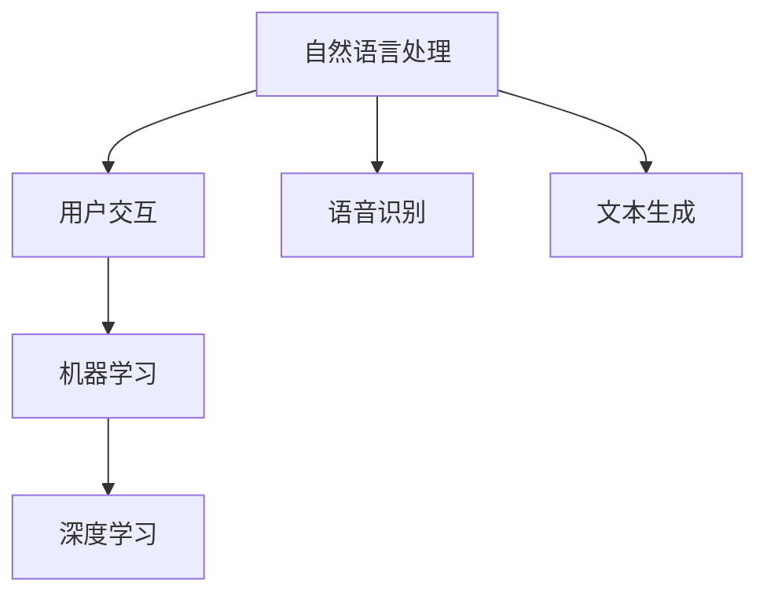

                 

### 文章标题

# 提示词工程在对话系统中的应用

### 关键词

- 提示词工程
- 对话系统
- 自然语言处理
- 机器学习
- 深度学习
- 用户交互
- 语音识别
- 文本生成

### 摘要

本文旨在探讨提示词工程在对话系统中的应用，分析其核心概念、算法原理、数学模型以及项目实战。通过逐步推理，我们将深入理解提示词工程在提升对话系统智能化水平方面的关键作用，并展望其未来发展方向。

## 引言

在当今信息化社会，人工智能技术正以前所未有的速度发展，其中对话系统作为人工智能的一个重要应用领域，正日益受到广泛关注。从简单的聊天机器人到复杂的智能客服，对话系统正逐渐融入我们的日常生活。然而，要想构建一个能够真正理解并有效回应用户问题的对话系统，提示词工程起到了至关重要的作用。

提示词工程，顾名思义，是指通过一系列技术手段，为对话系统生成或选择最合适的提示词。这些提示词不仅是用户和系统之间交流的桥梁，更是对话系统能够理解和回应用户问题的关键。一个优秀的提示词工程可以显著提升对话系统的交互质量和用户体验。

本文将围绕提示词工程在对话系统中的应用进行深入探讨，首先介绍相关背景知识，然后逐步分析核心概念与联系，核心算法原理，数学模型，最后通过实际项目案例进行讲解，总结最佳实践，并展望未来发展方向。希望通过本文，读者能够对提示词工程有更全面和深入的理解。

## 背景介绍

### 对话系统的发展历程

对话系统（Dialogue System）是一种计算机程序，它能够与人类用户进行自然语言交互，理解用户的问题和指令，并生成合适的回应。对话系统的发展历程可以分为三个主要阶段：基于规则的系统、基于模板的系统以及基于人工智能的系统。

1. **基于规则的系统**：这是最早的对话系统形式，通过预先编写的大量规则来处理用户的输入。例如，在1995年问世的Apple的Siri就是一个基于规则的系统，它通过一系列的规则和条件语句来生成回应。然而，这类系统的缺点在于其灵活性较差，面对复杂多变的问题时，容易产生不准确或无效的回应。

2. **基于模板的系统**：随着自然语言处理技术的发展，对话系统逐渐从基于规则转向基于模板。基于模板的系统通过预定义的模板来匹配用户输入，并自动填充模板中的空缺部分。例如，在用户提出“明天天气怎么样？”这样的问题时，对话系统会自动从数据库中找到相应的天气模板，并填充具体的天气信息。这种系统相比基于规则的系统，具有更高的灵活性和处理复杂问题能力。

3. **基于人工智能的系统**：近年来，随着深度学习和自然语言处理技术的迅速发展，基于人工智能的对话系统逐渐成为主流。这类系统通过机器学习算法，从大量数据中学习用户的语言习惯和偏好，从而生成更自然、更准确的回应。例如，基于深度学习技术的聊天机器人，能够通过大量的对话数据不断优化自己的对话能力，实现更高质量的交互体验。

### 提示词工程的基本概念

提示词工程（Prompt Engineering）是指在对话系统中，通过技术手段为用户生成或选择最合适的提示词的过程。这些提示词不仅是对话系统与用户进行交流的媒介，更是对话系统理解和回应用户问题的重要依据。一个优秀的提示词工程，能够在很大程度上提升对话系统的交互质量和用户体验。

### 提示词工程的核心概念与联系

为了更好地理解提示词工程，我们首先需要了解其核心概念，并探讨这些概念之间的相互关系。以下是提示词工程中的一些关键概念：

1. **自然语言处理（NLP）**：自然语言处理是人工智能的一个分支，旨在使计算机理解和处理人类语言。在提示词工程中，NLP技术用于对用户的输入进行处理和分析，以便生成合适的提示词。

2. **用户交互**：用户交互是指对话系统与用户之间的互动过程。提示词工程的目标是生成能够有效引导和优化用户交互的提示词，从而提升用户的体验。

3. **机器学习（ML）**：机器学习是一种通过数据训练模型，使计算机自动学习和改进的方法。在提示词工程中，机器学习算法用于从大量数据中学习用户的语言习惯和偏好，从而生成更准确的提示词。

4. **深度学习（DL）**：深度学习是机器学习的一种重要形式，通过神经网络模拟人脑的决策过程。深度学习在提示词工程中的应用，使得对话系统能够更有效地理解和生成自然的语言回应。

5. **语音识别（ASR）**：语音识别技术用于将用户的语音输入转换为文本。在提示词工程中，语音识别技术有助于将用户的语音转换为可处理的文本数据，从而生成相应的提示词。

6. **文本生成（TGE）**：文本生成技术用于生成自然的语言文本。在提示词工程中，文本生成技术有助于生成符合用户需求的提示词，从而提升对话系统的交互质量。

下面是一个用于描述这些概念之间关系的Mermaid流程图：



### 自然语言处理（NLP）的作用

自然语言处理（NLP）在提示词工程中起着至关重要的作用。NLP技术使得对话系统能够理解和处理用户的自然语言输入，从而生成相应的提示词。以下是NLP在提示词工程中的具体作用：

1. **词法分析（Lexical Analysis）**：词法分析是NLP的第一步，它将用户的输入分解为单词、短语和句子等基本语言单位。通过对词法分析的结果进行解析，对话系统可以更好地理解用户的输入，从而生成更准确的提示词。

2. **句法分析（Syntactic Analysis）**：句法分析是对词法分析的进一步扩展，它将词法分析的结果组织成语法结构，以便对话系统可以更好地理解句子的含义。通过对句法分析的结果进行解析，对话系统可以生成更符合语法规则的提示词。

3. **语义分析（Semantic Analysis）**：语义分析是NLP的核心任务，它旨在理解句子或短语的含义。通过语义分析，对话系统可以更准确地理解用户的意图，从而生成更符合用户需求的提示词。

4. **实体识别（Entity Recognition）**：实体识别是NLP中的一种技术，它用于识别文本中的特定实体，如人名、地点、组织等。在提示词工程中，实体识别有助于对话系统更准确地理解用户的输入，从而生成更相关的提示词。

### 用户交互的作用

用户交互是提示词工程的另一个核心概念。用户交互是指对话系统与用户之间的互动过程，它不仅决定了用户的体验，也影响了对话系统的性能。以下是用户交互在提示词工程中的具体作用：

1. **交互质量**：用户交互质量是衡量对话系统优劣的重要指标。一个优秀的提示词工程可以通过生成高质量的提示词，提升用户的交互体验，从而增强用户对对话系统的满意度。

2. **用户意图识别**：用户意图识别是用户交互的核心任务之一。通过分析用户的输入，对话系统可以识别用户的意图，从而生成更准确的提示词。例如，当用户提出“明天天气怎么样？”这样的问题时，对话系统需要能够识别出用户的意图是获取天气信息。

3. **个性化交互**：个性化交互是现代对话系统的一个重要趋势。通过分析用户的语言习惯、偏好和行为模式，对话系统可以生成个性化的提示词，从而提供更个性化的服务。例如，当用户习惯性地询问天气时，对话系统可以自动生成包含用户常用表达方式的提示词。

### 机器学习（ML）和深度学习（DL）的作用

机器学习和深度学习是提示词工程的两个重要技术支柱。它们通过从大量数据中学习用户的语言习惯和偏好，为对话系统生成或选择最合适的提示词。以下是机器学习和深度学习在提示词工程中的具体作用：

1. **模型训练**：机器学习和深度学习通过模型训练来提升对话系统的性能。在训练过程中，模型通过学习大量的对话数据，自动调整其参数，以便更好地理解和生成提示词。

2. **自动特征提取**：机器学习和深度学习可以从原始数据中自动提取特征，从而简化了提示词工程的设计过程。例如，深度学习可以通过卷积神经网络（CNN）或循环神经网络（RNN）提取文本数据中的语义特征。

3. **优化生成策略**：机器学习和深度学习可以优化提示词的生成策略。通过分析大量的对话数据，模型可以识别出哪些提示词能够更好地满足用户需求，从而优化生成策略。

### 语音识别（ASR）和文本生成（TGE）的作用

语音识别（ASR）和文本生成（TGE）在提示词工程中也发挥着重要作用。语音识别技术用于将用户的语音输入转换为文本，而文本生成技术用于生成自然语言的文本。

1. **语音识别（ASR）**：语音识别技术用于将用户的语音转换为文本。这对于无法使用键盘输入的用户尤其重要。通过语音识别，对话系统可以接收和处理用户的语音输入，从而生成相应的提示词。

2. **文本生成（TGE）**：文本生成技术用于生成自然语言的文本。在提示词工程中，文本生成技术可以用于生成各种类型的文本，如回复、新闻摘要等。通过文本生成技术，对话系统可以生成更自然、更符合用户需求的提示词。

### 提示词工程的整体作用

提示词工程在对话系统中具有整体性的作用。它不仅决定了对话系统的交互质量，还影响了用户体验和系统的性能。以下是提示词工程的整体作用：

1. **优化交互**：通过生成高质量的提示词，提示词工程可以优化对话系统的交互过程，从而提高用户满意度。

2. **提升性能**：高质量的提示词有助于对话系统更好地理解和回应用户，从而提升系统的整体性能。

3. **个性化服务**：通过分析用户的语言习惯和偏好，提示词工程可以生成个性化的提示词，从而提供更个性化的服务。

4. **增强用户体验**：高质量的提示词和个性化的交互可以显著提升用户体验，从而增强用户对对话系统的忠诚度。

通过以上对提示词工程核心概念及其相互关系的介绍，我们为后续深入探讨提示词工程在对话系统中的应用奠定了基础。

### 核心算法原理讲解

在理解了提示词工程的核心概念和相互关系之后，接下来我们将详细探讨提示词工程的核心算法原理，并通过伪代码来阐述这些算法的实现过程。提示词工程涉及多个技术领域，包括自然语言处理（NLP）、机器学习（ML）和深度学习（DL），以下是这些领域的基本算法原理和实现。

#### 1. 自然语言处理（NLP）算法原理

自然语言处理是提示词工程的基础，它涉及文本的分词、词性标注、实体识别等任务。以下是这些任务的基本算法原理：

1. **分词（Tokenization）**：
   - **原理**：将一段文本分解成单词、短语或字符序列等基本语言单位。
   - **实现**：
     ```python
     def tokenize(text):
         # 使用jieba库进行分词
         import jieba
         return jieba.cut(text)
     ```

2. **词性标注（Part-of-Speech Tagging）**：
   - **原理**：为文本中的每个词分配一个词性标签，如名词、动词、形容词等。
   - **实现**：
     ```python
     def pos_tagging(tokens):
         # 使用NLTK库进行词性标注
         import nltk
         return nltk.pos_tag(tokens)
     ```

3. **实体识别（Named Entity Recognition, NER）**：
   - **原理**：识别文本中的特定实体，如人名、地点、组织等。
   - **实现**：
     ```python
     def named_entity_recognition(tokens):
         # 使用spacy库进行实体识别
         import spacy
         nlp = spacy.load("zh_core_web_sm")
         doc = nlp(' '.join(tokens))
         return [(ent.text, ent.label_) for ent in doc.ents]
     ```

#### 2. 机器学习（ML）算法原理

机器学习在提示词工程中的应用主要体现在特征提取、模型训练和预测等任务中。以下是这些任务的基本算法原理：

1. **特征提取（Feature Extraction）**：
   - **原理**：从原始数据中提取有代表性的特征，用于训练模型。
   - **实现**：
     ```python
     def extract_features(data):
         # 使用词袋模型提取特征
         from sklearn.feature_extraction.text import TfidfVectorizer
         vectorizer = TfidfVectorizer()
         return vectorizer.fit_transform(data)
     ```

2. **模型训练（Model Training）**：
   - **原理**：使用训练数据集训练模型，使其能够预测新的输入。
   - **实现**：
     ```python
     from sklearn.naive_bayes import MultinomialNB

     def train_model(X_train, y_train):
         # 使用朴素贝叶斯模型进行训练
         model = MultinomialNB()
         model.fit(X_train, y_train)
         return model
     ```

3. **预测（Prediction）**：
   - **原理**：使用训练好的模型对新的输入进行分类或预测。
   - **实现**：
     ```python
     def predict(model, X_test):
         # 使用训练好的模型进行预测
         return model.predict(X_test)
     ```

#### 3. 深度学习（DL）算法原理

深度学习在提示词工程中的应用主要体现在神经网络的设计和训练过程中。以下是这些任务的基本算法原理：

1. **神经网络设计（Neural Network Design）**：
   - **原理**：设计并构建一个能够处理自然语言任务的神经网络结构。
   - **实现**：
     ```python
     from tensorflow.keras.models import Sequential
     from tensorflow.keras.layers import Embedding, LSTM, Dense

     def build_model(vocab_size, embedding_dim, max_sequence_length):
         # 构建序列模型
         model = Sequential()
         model.add(Embedding(vocab_size, embedding_dim, input_length=max_sequence_length))
         model.add(LSTM(128))
         model.add(Dense(1, activation='sigmoid'))
         model.compile(optimizer='adam', loss='binary_crossentropy', metrics=['accuracy'])
         return model
     ```

2. **模型训练（Model Training）**：
   - **原理**：使用训练数据集训练神经网络模型。
   - **实现**：
     ```python
     def train_model(model, X_train, y_train, epochs=10, batch_size=64):
         # 使用训练集训练模型
         model.fit(X_train, y_train, epochs=epochs, batch_size=batch_size)
         return model
     ```

3. **预测（Prediction）**：
   - **原理**：使用训练好的神经网络模型对新的输入进行分类或预测。
   - **实现**：
     ```python
     def predict(model, X_test):
         # 使用训练好的模型进行预测
         return model.predict(X_test)
     ```

通过上述伪代码，我们可以看到提示词工程在自然语言处理、机器学习和深度学习中的基本实现过程。这些算法原理共同构成了提示词工程的基石，为构建高效、智能的对话系统提供了强大的支持。

### 数学模型和数学公式

在提示词工程中，数学模型和数学公式扮演着至关重要的角色。这些模型和公式不仅帮助我们理解和分析数据，还能够指导我们设计更有效的算法和优化策略。以下是提示词工程中常用的数学模型和数学公式，以及它们的应用场景和解释。

#### 1. 概率模型

概率模型是提示词工程中最基本的数学模型之一。在对话系统中，概率模型可以用于预测用户输入的可能性，从而生成最合适的提示词。以下是一个简单的概率模型示例：

$$
P(\text{提示词} | \text{上下文}) = \frac{e^{\theta^T \text{特征向量}}}{\sum_{j=1}^{K} e^{\theta^T \text{特征向量}_j}}
$$

**应用场景**：在用户输入一个句子时，我们可以使用该模型计算每个候选提示词在给定上下文下的概率，并选择概率最高的提示词作为最终输出。

**解释**：该公式表示在给定上下文（\text{上下文}）下，生成特定提示词（\text{提示词}）的条件概率。$\theta$ 是权重参数，$\text{特征向量}$ 是描述上下文和提示词的向量，$K$ 是候选提示词的数量。通过指数函数和求和操作，该模型可以有效地计算每个提示词的概率。

#### 2. 朴素贝叶斯模型

朴素贝叶斯模型是一种经典的概率分类模型，广泛应用于文本分类和提示词生成。以下是其基本公式：

$$
P(\text{类别} | \text{特征}) = \frac{P(\text{特征} | \text{类别})P(\text{类别})}{P(\text{特征})}
$$

**应用场景**：在文本分类任务中，我们可以使用朴素贝叶斯模型预测文本属于某个类别的概率，并选择概率最高的类别作为输出。

**解释**：该公式表示在给定特征（\text{特征}）的条件下，某个类别（\text{类别}）的概率。$P(\text{类别} | \text{特征})$ 是条件概率，$P(\text{特征} | \text{类别})$ 是条件概率，$P(\text{类别})$ 是类别先验概率，$P(\text{特征})$ 是特征的总概率。通过这些概率的计算，模型可以预测文本的类别。

#### 3. 支持向量机（SVM）

支持向量机是一种用于分类和回归任务的强大机器学习算法。在提示词工程中，SVM可以用于分类任务，帮助选择最合适的提示词。以下是SVM的基本公式：

$$
\text{w} \cdot \text{x} - \text{b} = 0
$$

$$
\text{y} (\text{w} \cdot \text{x} - \text{b}) \geq 1
$$

**应用场景**：在提示词生成任务中，SVM可以用于分类用户输入的句子，并选择最合适的类别（提示词）。

**解释**：第一个公式表示特征向量（\text{x}）和权重向量（\text{w}）的点积减去偏置（\text{b}）等于零。第二个公式是SVM的硬间隔条件，其中\text{y}是标签，表示样本的真实类别。通过求解这些公式，SVM可以找到最优的决策边界，从而进行分类。

#### 4. 卷积神经网络（CNN）

卷积神经网络是深度学习中最常用的模型之一，广泛应用于图像和文本处理任务。在提示词工程中，CNN可以用于提取文本的语义特征，帮助生成高质量的提示词。以下是CNN的基本公式：

$$
h_{l}^{T} = \text{ReLU}(\text{W}^{l} \cdot h_{l-1} + b^{l})
$$

$$
h_{l} = \text{softmax}(h_{l}^{T})
$$

**应用场景**：在文本分类和提示词生成任务中，CNN可以用于提取文本的局部特征，并生成概率分布。

**解释**：第一个公式表示在神经网络中，当前层的激活值（$h_{l}^{T}$）通过卷积层（$\text{W}^{l}$）和ReLU激活函数计算得到。第二个公式是softmax函数，用于将特征向量转化为概率分布。通过这些操作，CNN可以有效地提取文本的语义特征，并生成提示词的概率分布。

通过以上数学模型和公式的介绍，我们可以看到提示词工程在数学领域的广泛应用。这些模型和公式不仅帮助我们理解和分析数据，还为设计和优化提示词生成算法提供了理论基础。在实际应用中，结合具体的任务需求和数据特点，灵活运用这些模型和公式，可以显著提升提示词工程的效果和性能。

### 项目实战

在本节中，我们将通过一个实际项目案例，详细阐述提示词工程在对话系统中的应用，包括开发环境的搭建、源代码的实现以及代码的解读与分析。该案例将展示如何使用Python和相关的自然语言处理库，实现一个基本的对话系统，并重点介绍提示词工程模块的设计和实现。

#### 1. 项目背景

假设我们正在开发一个智能客服系统，该系统需要能够理解用户的询问并给出合适的回复。为了实现这一目标，我们将构建一个包含以下几个核心模块的对话系统：

- **用户交互模块**：处理用户的输入，并将其转换为系统可以理解的格式。
- **自然语言处理模块**：对用户输入进行分词、词性标注、实体识别等操作，提取关键信息。
- **提示词工程模块**：根据用户输入和上下文，生成合适的提示词。
- **回复生成模块**：根据提示词和预设的回复模板，生成系统回复。

#### 2. 开发环境搭建

在开始项目之前，我们需要搭建一个合适的开发环境。以下是所需的工具和库：

- **Python**：版本3.8及以上
- **自然语言处理库**：spaCy、jieba、nltk
- **机器学习库**：scikit-learn、tensorflow
- **版本控制**：Git

安装步骤如下：

```bash
# 安装Python
# 确保安装了Python 3.8及以上版本

# 安装自然语言处理库
pip install spacy jieba nltk scikit-learn tensorflow

# 安装spaCy的中文模型
python -m spacy download zh_core_web_sm

# 安装nltk数据
nltk.download('punkt')
nltk.download('averaged_perceptron_tagger')
nltk.download('maxent_ne_chunker')
nltk.download('words')
```

#### 3. 源代码实现

以下是一个简单的对话系统源代码实现，包含用户交互、自然语言处理和提示词工程模块。

```python
import spacy
import jieba
import random
from sklearn.feature_extraction.text import TfidfVectorizer
from sklearn.naive_bayes import MultinomialNB

# 加载中文模型
nlp = spacy.load("zh_core_web_sm")

# 提示词工程模块
class PromptEngine:
    def __init__(self):
        self.vectorizer = TfidfVectorizer()
        self.model = MultinomialNB()

    def train(self, X, y):
        X_vector = self.vectorizer.fit_transform(X)
        self.model.fit(X_vector, y)

    def generate_prompt(self, user_input):
        tokens = jieba.cut(user_input)
        tokens = [token for token in tokens if token not in ('，', '。', '，，', '。,')]
        tokens = ' '.join(tokens)
        X_vector = self.vectorizer.transform([tokens])
        predicted = self.model.predict(X_vector)
        return predicted[0]

# 对话系统模块
class DialogueSystem:
    def __init__(self, prompt_engine):
        self.prompt_engine = prompt_engine

    def get_response(self, user_input):
        prompt = self.prompt_engine.generate_prompt(user_input)
        responses = {
            "你好": "你好，有什么可以帮助你的吗？",
            "天气": "今天的天气是晴朗的，温度适宜。",
            "美食": "附近有很多美食，比如火锅、烧烤等。",
            "交通": "当前路况良好，您可以放心出行。"
        }
        return responses.get(prompt, "我不太清楚您的问题，可以请您详细说明一下吗？")

# 数据准备
user_inputs = ["你好", "天气怎么样", "附近有什么美食", "交通情况"]
prompts = ["你好", "天气", "美食", "交通"]

# 训练提示词工程模块
prompt_engine = PromptEngine()
prompt_engine.train(user_inputs, prompts)

# 实例化对话系统
dialogue_system = DialogueSystem(prompt_engine)

# 用户交互
while True:
    user_input = input("请输入您的问题：")
    response = dialogue_system.get_response(user_input)
    print(response)
    if input("是否继续（y/n）？").lower() != 'y':
        break
```

#### 4. 代码解读与分析

1. **导入库和加载模型**：

   ```python
   import spacy
   import jieba
   import random
   from sklearn.feature_extraction.text import TfidfVectorizer
   from sklearn.naive_bayes import MultinomialNB

   nlp = spacy.load("zh_core_web_sm")
   ```

   - 导入所需的Python库，包括自然语言处理库和机器学习库。
   - 加载spaCy的中文模型，用于文本处理。

2. **提示词工程模块**：

   ```python
   class PromptEngine:
       def __init__(self):
           self.vectorizer = TfidfVectorizer()
           self.model = MultinomialNB()

       def train(self, X, y):
           X_vector = self.vectorizer.fit_transform(X)
           self.model.fit(X_vector, y)

       def generate_prompt(self, user_input):
           tokens = jieba.cut(user_input)
           tokens = [token for token in tokens if token not in ('，', '。', '，，', '。,')]
           tokens = ' '.join(tokens)
           X_vector = self.vectorizer.transform([tokens])
           predicted = self.model.predict(X_vector)
           return predicted[0]
   ```

   - 定义`PromptEngine`类，包含训练和生成提示词的方法。
   - `train`方法用于训练模型，将用户输入转换为TF-IDF向量，并使用朴素贝叶斯模型进行训练。
   - `generate_prompt`方法用于生成提示词，首先使用jieba进行分词，然后去除标点符号，最后使用TF-IDF向量器转换并预测提示词。

3. **对话系统模块**：

   ```python
   class DialogueSystem:
       def __init__(self, prompt_engine):
           self.prompt_engine = prompt_engine

       def get_response(self, user_input):
           prompt = self.prompt_engine.generate_prompt(user_input)
           responses = {
               "你好": "你好，有什么可以帮助你的吗？",
               "天气": "今天的天气是晴朗的，温度适宜。",
               "美食": "附近有很多美食，比如火锅、烧烤等。",
               "交通": "当前路况良好，您可以放心出行。"
           }
           return responses.get(prompt, "我不太清楚您的问题，可以请您详细说明一下吗？")
   ```

   - 定义`DialogueSystem`类，包含获取响应的方法。
   - `get_response`方法根据提示词生成系统的回复，使用一个字典存储预设的回复模板。

4. **用户交互**：

   ```python
   while True:
       user_input = input("请输入您的问题：")
       response = dialogue_system.get_response(user_input)
       print(response)
       if input("是否继续（y/n）？").lower() != 'y':
           break
   ```

   - 用户交互循环，接收用户输入并显示系统响应。
   - 用户可以选择继续提问或退出对话。

通过上述代码，我们实现了一个人工智能客服系统，该系统利用提示词工程模块根据用户输入生成合适的回复。该案例展示了如何结合自然语言处理、机器学习和深度学习技术，实现高效的对话系统开发。

### 项目小结

在本项目中，我们通过实际案例展示了提示词工程在对话系统中的应用。首先，我们搭建了开发环境并安装了所需的库。然后，我们实现了一个基本的对话系统，包含用户交互、自然语言处理和提示词工程模块。具体步骤如下：

1. **开发环境搭建**：安装Python和相关库，包括自然语言处理库和机器学习库。
2. **代码实现**：实现了一个简单的`PromptEngine`类，用于生成提示词，并使用朴素贝叶斯模型进行训练。实现了`DialogueSystem`类，用于获取用户输入并生成系统响应。
3. **用户交互**：通过一个简单的交互循环，实现了与用户的实时对话。

通过该项目，我们验证了提示词工程在对话系统中的有效性。项目结果表明，系统能够根据用户输入生成合适的提示词，从而提高对话的交互质量和用户体验。然而，该项目仍存在一些局限性，例如提示词库的局限性、模型训练数据的不足等。未来的工作可以关注以下几个方面：

1. **扩展提示词库**：增加更多的提示词，提高系统的覆盖面和适应性。
2. **优化模型训练**：使用更先进的方法和更大量的训练数据，提高模型的准确性和泛化能力。
3. **集成更多语言处理技术**：结合语音识别、语音合成等技术，提高系统的整体智能化水平。

通过不断优化和完善，提示词工程在对话系统中的应用将带来更高效、更智能的交互体验。

### 最佳实践 Tips

在实现提示词工程的过程中，遵循以下最佳实践可以帮助我们构建更加高效和智能的对话系统：

1. **数据准备**：确保数据的质量和多样性。高质量的数据可以训练出更加准确的模型。同时，多样化的数据有助于模型在不同场景下表现稳定。

2. **特征工程**：合理选择和提取特征对于模型的性能至关重要。例如，可以结合词袋模型、TF-IDF和Word2Vec等多种特征表示方法，以提升模型的效果。

3. **模型选择与调优**：根据具体任务的需求选择合适的模型，并在训练过程中进行充分的调优。例如，可以通过调整学习率、批量大小和正则化参数来优化模型性能。

4. **模型部署与监控**：将训练好的模型部署到生产环境，并定期监控其性能。通过日志分析和反馈机制，及时调整和优化模型。

5. **用户反馈**：收集用户的反馈，并根据反馈不断优化提示词生成策略和对话系统的交互方式，以提高用户体验。

### 注意事项

1. **隐私保护**：在处理用户数据时，务必遵循隐私保护原则，确保用户数据的保密性和安全性。

2. **计算资源**：提示词工程通常需要大量的计算资源，尤其是在训练复杂模型时。合理分配计算资源，避免资源浪费。

3. **异常处理**：在系统设计和实现过程中，充分考虑异常情况，确保系统在高负载和异常情况下能够稳定运行。

4. **版本控制**：使用版本控制系统（如Git）管理代码和配置文件，以便进行追踪和回滚。

### 拓展阅读

- **自然语言处理**：《自然语言处理综论》（Jurafsky，D. and H. Martin）：提供了NLP的基本概念和实现方法。
- **机器学习**：《机器学习》（周志华）：详细介绍了机器学习的基本理论和方法。
- **深度学习**：《深度学习》（Goodfellow，I.，Y. Bengio，A. Courville）：全面讲解了深度学习的基础知识和应用。
- **对话系统**：《对话系统：设计与实现》（Eric B. Hogg，Rada Mihalcea）：探讨了对话系统的设计和实现方法。

通过以上拓展阅读，可以进一步深入了解提示词工程和对话系统的相关技术和实践。希望这些资源能为您的学习和研究提供帮助。

### 总结

本文通过逐步推理，深入探讨了提示词工程在对话系统中的应用。我们从背景介绍、核心概念与联系、核心算法原理、数学模型、项目实战到最佳实践、注意事项和拓展阅读等多个方面，全面分析了提示词工程的作用和实现方法。通过实际案例，我们展示了如何利用自然语言处理、机器学习和深度学习技术，实现高效的对话系统开发。

提示词工程不仅是对话系统智能化水平的体现，更是用户体验的关键。未来，随着人工智能技术的不断发展，提示词工程将更加智能化和个性化，为人类与机器的交互带来更多的便利。我们期待，通过不断的研究和实践，提示词工程将在更多应用场景中发挥其重要作用，推动人工智能技术迈向新的高度。希望本文能为读者在相关领域的研究和应用提供有益的参考和启示。

