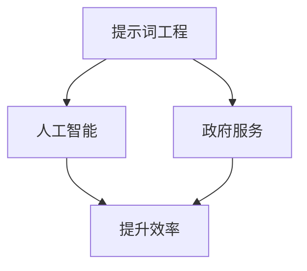

                 

### 第1章：引言

#### 1.1 书籍主题概述

本书的主题是《提示词工程在政府服务中的应用：提升公共服务效率》。本书旨在探讨如何通过提示词工程这一先进的人工智能技术，来提升政府服务的效率。在当前信息化和智能化的时代背景下，政府服务面临着日益增长的复杂性，如何提高公共服务质量、降低成本、增强透明度，成为摆在政府和公众面前的一大挑战。本书将通过详细的理论分析和实践案例，展示提示词工程在政府服务中的应用潜力。

#### 1.2 提示词工程的重要性

提示词工程作为人工智能的一个重要分支，其在自然语言处理、信息检索、推荐系统等领域有着广泛的应用。通过构建有效的提示词模型，可以大幅提升系统的理解和表达能力，从而提高系统的智能化水平。在政府服务中，提示词工程的应用更是具有重要意义。它可以辅助政府更精准地理解公众需求，优化服务流程，提高决策效率，甚至在一定程度上预防腐败。

#### 1.3 政府服务中的挑战

政府服务面临着多重挑战，包括服务需求的多样性、服务流程的复杂性、服务数据的海量性等。传统的政府服务模式往往难以满足快速变化的服务需求，导致公共服务效率低下。此外，政府服务的透明度不足，也使得公众对政府服务的信任度降低。因此，引入人工智能和提示词工程，成为提升政府服务效率的重要手段。

### 关键词
- 提示词工程
- 人工智能
- 政府服务
- 公共服务效率
- 智能化
- 信息处理
- 数据分析

### 摘要

本书围绕提示词工程在政府服务中的应用，首先介绍了提示词工程的背景和重要性，然后详细分析了政府服务中的挑战。接着，本书从理论基础、关键技术、实践应用等多个方面，系统阐述了如何通过提示词工程提升政府服务的效率。书中还结合实际案例，展示了提示词工程在政府服务中的具体应用效果，为政府服务的智能化转型提供了有益的借鉴。

## **《提示词工程在政府服务中的应用：提升公共服务效率》目录大纲**

### 第一部分：介绍与背景

#### 第1章：引言

- **1.1 书籍主题概述**
- **1.2 提示词工程的重要性**
- **1.3 政府服务中的挑战**

#### 第2章：背景知识

- **2.1 政府服务概述**
- **2.2 人工智能与政府服务**
- **2.3 提示词工程的定义与作用**

#### 第3章：人工智能在政府服务中的应用

- **3.1 人工智能在政府服务中的发展历程**
- **3.2 人工智能在政府服务中的应用场景**
- **3.3 人工智能在提升公共服务效率中的作用**

### 第二部分：提示词工程的基础

#### 第4章：提示词工程的基础理论

- **4.1 提示词的定义与分类**
- **4.2 提示词工程的基本概念**
- **4.3 提示词工程的挑战与机遇**

#### 第5章：提示词工程的关键技术

- **5.1 数据处理技术**
- **5.2 提示词生成与优化技术**
- **5.3 提示词的评估与反馈机制**

#### 第6章：提示词工程的实践

- **6.1 提示词工程的基本流程**
- **6.2 提示词工程的实际案例**
- **6.3 提示词工程中的难点与解决方案**

### 第三部分：提升公共服务效率的实践

#### 第7章：政府服务效率提升的方法

- **7.1 效率提升的关键因素**
- **7.2 提升公共服务效率的策略**
- **7.3 提升效率的案例分析**

#### 第8章：人工智能与公共服务

- **8.1 人工智能在公共服务中的应用**
- **8.2 人工智能对公共服务的影响**
- **8.3 人工智能与公共服务的未来趋势**

#### 第9章：政策与实践

- **9.1 提升公共服务效率的政策支持**
- **9.2 提示词工程的实践与案例**
- **9.3 政府服务效率提升的实践案例**

### 第四部分：总结与展望

#### 第10章：总结

- **10.1 提示词工程在政府服务中的应用成果**
- **10.2 提示词工程的发展趋势**
- **10.3 未来工作展望**

#### 第11章：致谢

- **11.1 致谢**

#### 第12章：参考文献

- **12.1 引用文献列表**
- **12.2 参考书籍**
- **12.3 学术论文**
- **12.4 报告与文档**

#### 第13章：结语

- **13.1 书籍内容的回顾**
- **13.2 对读者的建议**
- **13.3 对未来的展望**

## **核心概念与联系流程图**

### **第2章：背景知识**

#### **2.1 政府服务概述**

政府服务是指政府为满足公民和企业需求，通过制定政策、提供公共服务等方式实现的社会管理和服务活动。这些服务包括但不限于公共安全、教育、医疗、社会保障、交通、环境保护等各个方面。政府服务的目标是为公众创造一个安全、健康、公平、有序的社会环境。

#### **2.2 人工智能与政府服务**

人工智能（AI）作为一门综合了计算机科学、统计学、数学等多个学科的技术，近年来在政府服务中的应用越来越广泛。AI技术能够帮助政府更高效地处理数据、分析趋势、预测未来，从而做出更科学的决策。例如，在公共安全领域，AI可以用于监控摄像头视频分析、犯罪预测；在教育领域，AI可以用于个性化学习、考试评分；在医疗领域，AI可以用于疾病诊断、健康监控。

#### **2.3 提示词工程的定义与作用**

提示词工程是一种基于人工智能的自然语言处理技术，旨在通过构建和优化提示词模型，提高系统的理解和表达能力。在政府服务中，提示词工程的应用主要体现在以下几个方面：

1. **信息检索与查询优化**：通过构建有效的提示词模型，可以提升政府服务系统的信息检索能力，帮助公众快速找到所需信息。
2. **文本分析与应用**：提示词工程可以用于处理和分析大量的政府文本数据，如政策文件、公告、报告等，从而辅助政府决策和提升服务效率。
3. **智能客服与对话系统**：通过应用提示词工程，可以构建高效的智能客服系统，为公众提供即时、准确的咨询服务。
4. **数据挖掘与分析**：提示词工程可以帮助政府从海量数据中挖掘有价值的信息，如公众需求、行为模式等，从而更好地服务公众。

### **第3章：人工智能在政府服务中的应用**

#### **3.1 人工智能在政府服务中的发展历程**

人工智能在政府服务中的应用可以追溯到20世纪80年代，当时一些国家开始尝试将人工智能技术应用于公共服务领域。随着计算机技术和算法的不断进步，人工智能在政府服务中的应用也逐渐深入和广泛。进入21世纪，尤其是大数据、云计算等技术的普及，使得人工智能在政府服务中的应用达到了一个新的高度。

#### **3.2 人工智能在政府服务中的应用场景**

1. **公共安全**：人工智能技术可以用于监控摄像头视频分析、犯罪预测、应急管理等。例如，通过分析监控视频数据，AI可以识别出异常行为，提前预防犯罪事件的发生。
2. **智慧城市**：人工智能技术可以帮助政府建设智慧城市，实现城市管理的智能化。例如，通过传感器数据采集和分析，AI可以优化交通管理，减少拥堵，提高交通效率。
3. **教育**：人工智能可以用于个性化教育、考试评分等。通过分析学生的学习数据，AI可以为学生提供个性化的学习建议，提高学习效果。
4. **医疗**：人工智能可以用于疾病诊断、健康监控等。通过分析医学影像和患者数据，AI可以辅助医生进行更准确的诊断和治疗方案制定。
5. **社会保障**：人工智能可以帮助政府更好地管理社会保障体系，例如，通过分析社会救助数据，AI可以识别出潜在的欺诈行为，提高社会保障的准确性。

#### **3.3 人工智能在提升公共服务效率中的作用**

1. **数据处理与优化**：人工智能可以帮助政府更高效地处理大量数据，通过数据挖掘和分析，提取出有价值的信息，为政府决策提供支持。
2. **流程自动化**：通过人工智能技术，可以自动化许多政府服务流程，减少人力成本，提高工作效率。例如，使用机器人流程自动化（RPA）技术，可以自动处理大量的重复性工作。
3. **智能客服**：人工智能可以构建智能客服系统，为公众提供24/7的在线咨询服务，提高服务响应速度和满意度。
4. **精准决策**：通过大数据分析和机器学习算法，人工智能可以帮助政府更精准地预测公众需求，制定更科学的政策。
5. **透明度提升**：人工智能技术可以帮助政府提高服务的透明度，通过数据公开和分析，公众可以更清晰地了解政府服务的运行情况。

### **第4章：提示词工程的基础理论**

#### **4.1 提示词的定义与分类**

提示词（Prompt Word）是指用于引导系统或用户进行特定操作或任务的词语或短语。在自然语言处理领域，提示词通常是指用于引导模型进行预测或生成的关键词或短语。

提示词可以根据其用途和作用分为以下几类：

1. **引导性提示词**：用于引导模型理解任务或问题的关键词或短语，例如，“请生成一篇关于人工智能的综述文章”。
2. **辅助性提示词**：用于提供额外上下文信息，帮助模型更好地理解任务或问题的关键词或短语，例如，“这篇文章需要包含最新的研究成果”。
3. **目标性提示词**：用于指定模型生成结果的关键词或短语，例如，“请生成一篇至少2000字的文章”。

#### **4.2 提示词工程的基本概念**

提示词工程是指通过构建和优化提示词模型，提高系统在特定任务上的表现的过程。提示词工程的基本概念包括：

1. **提示词生成**：根据给定的任务或问题，生成相应的提示词序列。提示词生成通常需要使用自然语言处理技术，如词嵌入、序列生成模型等。
2. **提示词优化**：通过调整提示词的生成策略和模型参数，优化提示词模型在特定任务上的性能。提示词优化可以采用多种方法，如基于梯度的优化算法、强化学习等。
3. **提示词评估**：对提示词模型的性能进行评估，以确定其是否满足任务需求。提示词评估通常包括准确性、多样性、一致性等指标。
4. **提示词反馈**：根据对提示词模型的评估结果，对模型进行反馈和调整，以提高其性能。

#### **4.3 提示词工程的挑战与机遇**

提示词工程在政府服务中的应用面临着一系列挑战和机遇：

1. **挑战**：
   - **数据多样性**：政府服务涉及的数据种类繁多，包括文本、图像、音频等多种形式，如何处理这些多样化的数据是一个挑战。
   - **数据隐私**：政府服务数据通常涉及个人隐私信息，如何在保证数据安全的同时，进行有效的数据分析是一个难题。
   - **模型解释性**：在政府服务中，模型的解释性至关重要，如何构建可解释的人工智能模型是一个挑战。
   - **法律和伦理问题**：人工智能在政府服务中的应用需要遵循相关的法律和伦理规范，如何确保模型的合法性和道德性是一个重要问题。

2. **机遇**：
   - **提高效率**：通过提示词工程，可以大幅提高政府服务的效率，减少人力成本，提高决策质量。
   - **增强透明度**：提示词工程可以帮助政府提高服务透明度，通过数据公开和分析，增强公众对政府服务的信任。
   - **精准决策**：基于大数据和人工智能的分析，可以帮助政府更精准地预测公众需求，制定更科学的政策。
   - **智能化服务**：提示词工程可以为政府服务系统引入智能化元素，提供个性化、智能化的服务体验。

### **第5章：提示词工程的关键技术**

#### **5.1 数据处理技术**

在提示词工程中，数据处理技术至关重要。有效的数据处理技术可以保证数据的质量，提高模型的性能。以下是几个关键的数据处理技术：

1. **数据清洗**：数据清洗是数据处理的第一步，目的是去除数据中的噪声和异常值，保证数据的质量。数据清洗包括缺失值处理、重复值删除、异常值检测和修正等。

2. **数据归一化**：数据归一化是将数据缩放到一个统一的范围内，以消除数据之间的量纲差异。常用的归一化方法包括最小-最大归一化、Z-score归一化等。

3. **数据降维**：数据降维是将高维数据映射到低维空间，减少数据维度，以提高计算效率和模型性能。常用的降维方法包括主成分分析（PCA）、线性判别分析（LDA）等。

4. **特征提取**：特征提取是从原始数据中提取出有用的信息，以供模型训练和预测。特征提取可以采用统计方法、机器学习方法等。

#### **5.2 提示词生成与优化技术**

提示词生成与优化技术是提示词工程的核心，以下是几个关键技术：

1. **生成式模型**：生成式模型通过学习数据的分布，生成新的提示词。常见的生成式模型包括变分自编码器（VAE）、生成对抗网络（GAN）等。

2. **序列生成模型**：序列生成模型专门用于生成序列数据，如自然语言文本。常见的序列生成模型包括循环神经网络（RNN）、长短期记忆网络（LSTM）、门控循环单元（GRU）等。

3. **强化学习**：强化学习是一种通过试错和反馈来优化决策过程的方法。在提示词工程中，强化学习可以用于优化提示词的生成策略。常见的强化学习算法包括Q-learning、深度Q网络（DQN）等。

4. **提示词优化算法**：提示词优化算法用于调整提示词模型的参数，以提高模型性能。常见的优化算法包括梯度下降（Gradient Descent）、随机梯度下降（SGD）等。

#### **5.3 提示词的评估与反馈机制**

提示词的评估与反馈机制是确保提示词模型性能的关键。以下是几个关键的技术：

1. **评估指标**：常用的评估指标包括准确率（Accuracy）、精确率（Precision）、召回率（Recall）、F1分数（F1 Score）等。根据具体任务，可以选择合适的评估指标。

2. **自动评估系统**：自动评估系统可以通过自动化脚本或工具，对提示词模型进行评估，节省时间和人力成本。

3. **反馈机制**：反馈机制包括用户反馈和模型自动调整。用户反馈可以通过用户评价、点击率等指标来收集，模型自动调整可以通过在线学习、持续优化等机制来实现。

4. **动态调整**：提示词模型应根据实时反馈进行动态调整，以适应不断变化的需求和环境。

### **第6章：提示词工程的实践**

#### **6.1 提示词工程的基本流程**

提示词工程的基本流程包括以下几个步骤：

1. **需求分析**：明确应用场景和目标，确定需要生成的提示词类型和数量。

2. **数据准备**：收集和整理相关的数据，进行数据清洗和预处理。

3. **模型选择**：根据需求选择合适的模型，如生成式模型、序列生成模型等。

4. **模型训练**：使用预处理后的数据训练模型，调整模型参数，以提高性能。

5. **提示词生成**：使用训练好的模型生成提示词，根据需要可以生成单个提示词或提示词序列。

6. **提示词评估**：对生成的提示词进行评估，使用评估指标衡量性能。

7. **反馈与优化**：根据评估结果对模型进行调整和优化，以提高性能。

#### **6.2 提示词工程的实际案例**

以下是一个具体的提示词工程应用案例：

**案例：智能客服系统的提示词生成**

需求：构建一个智能客服系统，能够根据用户的问题生成合适的回复。

步骤：

1. **需求分析**：确定需要生成的提示词类型，如常见问题、解决方案、引导性语句等。

2. **数据准备**：收集大量的用户问题和客服回复数据，进行数据清洗和预处理。

3. **模型选择**：选择一个适合序列生成任务的模型，如LSTM。

4. **模型训练**：使用预处理后的数据进行模型训练，调整模型参数。

5. **提示词生成**：使用训练好的模型生成提示词，根据用户的问题生成相应的回复。

6. **提示词评估**：使用评估指标（如准确率、F1分数）评估生成的提示词质量。

7. **反馈与优化**：根据用户反馈和评估结果，对模型进行调整和优化。

#### **6.3 提示词工程中的难点与解决方案**

提示词工程在实际应用中面临一些难点，以下是几个常见的难点及其解决方案：

1. **数据不足**：如果可用数据量较少，可能导致模型性能不佳。解决方案包括数据扩充、数据增强等。

2. **数据质量差**：数据中的噪声和异常值可能影响模型性能。解决方案包括数据清洗、去噪等。

3. **模型复杂度**：复杂的模型可能难以训练，且训练时间较长。解决方案包括模型简化、使用更高效的算法等。

4. **评估指标不合适**：选择的评估指标可能不适合任务需求，导致模型性能评估不准确。解决方案包括选择更合适的评估指标、结合多指标综合评估等。

5. **实时调整困难**：实时调整模型参数可能比较困难，特别是在大规模系统中。解决方案包括使用在线学习、分布式训练等技术，以提高实时调整的能力。

### **第7章：政府服务效率提升的方法**

#### **7.1 效率提升的关键因素**

提升政府服务效率的关键因素包括以下几个方面：

1. **技术因素**：先进的人工智能技术和大数据分析技术是提升政府服务效率的重要基础。通过引入这些技术，可以实现对政府服务流程的自动化和智能化，提高服务效率。

2. **管理因素**：高效的管理是提升政府服务效率的关键。科学的管理方法、合理的工作流程和良好的团队合作是保证政府服务效率的重要因素。

3. **人员因素**：优秀的员工是提升政府服务效率的重要保障。通过培训和提高员工的专业技能，可以更好地发挥他们的潜力，提高服务效率。

4. **环境因素**：良好的工作环境和物理设施也是提升政府服务效率的重要因素。一个舒适、高效的工作环境可以提高员工的工作效率和满意度。

#### **7.2 提升公共服务效率的策略**

为了提升政府服务效率，可以采取以下策略：

1. **流程优化**：通过流程优化，减少不必要的环节，简化流程，提高工作效率。

2. **自动化**：引入自动化技术，如机器人流程自动化（RPA），减少人力成本，提高工作效率。

3. **智能化**：利用人工智能技术，如自然语言处理、机器学习等，提高服务的智能化水平，提供更加精准和高效的服务。

4. **数据分析**：通过大数据分析，挖掘服务数据中的价值，优化服务流程，提高决策效率。

5. **员工培训**：定期对员工进行培训，提高他们的专业技能和团队合作能力，从而提高服务效率。

#### **7.3 提升效率的案例分析**

以下是一个提升政府服务效率的案例：

**案例：某市政府的智能交通系统**

某市政府引入了智能交通系统，通过大数据分析和人工智能技术，优化交通管理，提升交通效率。

步骤：

1. **需求分析**：分析交通数据，确定需要解决的主要问题，如拥堵、交通事故等。

2. **技术准备**：选择合适的人工智能技术，如深度学习、自然语言处理等。

3. **数据收集**：收集交通数据，包括车辆流量、路况信息、天气情况等。

4. **数据分析**：使用大数据分析技术，对交通数据进行分析，发现拥堵原因。

5. **模型训练**：使用训练好的模型，预测交通流量，优化交通信号灯控制策略。

6. **系统部署**：将智能交通系统部署到实际交通管理中，实时监控交通状况，优化交通信号灯控制。

7. **效果评估**：通过数据评估，分析智能交通系统对交通效率的提升情况。

结果：智能交通系统的实施，显著降低了交通拥堵情况，提高了交通效率，受到了市民的好评。

### **第8章：人工智能与公共服务**

#### **8.1 人工智能在公共服务中的应用**

人工智能在公共服务中的应用非常广泛，以下是一些主要的应用场景：

1. **公共安全**：通过视频监控分析、犯罪预测等，提高公共安全水平。

2. **智慧城市**：通过智能交通管理、能源管理、环境监测等，提升城市管理水平。

3. **教育**：通过个性化学习、智能辅导、自动评分等，提高教育质量。

4. **医疗**：通过智能诊断、健康监控、远程医疗等，提高医疗服务水平。

5. **社会保障**：通过智能审核、精准救助、反欺诈等，提高社会保障水平。

6. **城市规划**：通过数据分析、趋势预测、空间优化等，优化城市规划。

#### **8.2 人工智能对公共服务的影响**

人工智能对公共服务产生了深远的影响，以下是一些主要影响：

1. **效率提升**：通过自动化和智能化，大幅提高公共服务效率，减少人力成本。

2. **服务质量提升**：通过精确的数据分析和智能决策，提供更高质量的公共服务。

3. **透明度提升**：通过数据公开和分析，提高公共服务的透明度，增强公众信任。

4. **公平性提升**：通过大数据分析和机器学习算法，消除人为偏见，提高服务的公平性。

5. **创新驱动**：人工智能技术推动了公共服务领域的创新，促进了公共服务模式的转变。

#### **8.3 人工智能与公共服务的未来趋势**

人工智能与公共服务的未来趋势包括：

1. **更广泛的应用**：随着技术的进步，人工智能将在更多公共服务领域得到应用。

2. **更深入的融合**：人工智能将更深入地融入公共服务流程，推动公共服务的全面智能化。

3. **数据驱动**：数据将成为公共服务的重要资产，数据分析和机器学习将在公共服务中发挥更大作用。

4. **个性化服务**：通过大数据分析和人工智能技术，提供更加个性化的公共服务。

5. **智能化管理**：通过智能化技术，实现公共服务的智能化管理，提高服务效率和质量。

### **第9章：政策与实践**

#### **9.1 提升公共服务效率的政策支持**

为了提升公共服务效率，政府需要出台一系列政策支持。以下是一些关键政策：

1. **鼓励技术创新**：通过财政补贴、税收优惠等政策，鼓励企业研发和应用人工智能技术。

2. **加强人才培养**：通过高校合作、职业培训等，加强人工智能人才的培养。

3. **完善法律法规**：制定相关法律法规，规范人工智能在公共服务中的应用，确保数据安全和隐私保护。

4. **促进数据开放**：推动公共数据开放，为人工智能研究和应用提供数据支持。

5. **政策引导**：通过政策引导，推动公共服务领域的智能化转型。

#### **9.2 提示词工程的实践与案例**

以下是一个提示词工程的实践案例：

**案例：某市政府的智能政务服务系统**

某市政府引入了智能政务服务系统，通过提示词工程，提高政务服务效率。

步骤：

1. **需求分析**：分析政务服务数据，确定需要生成的提示词类型，如常见问题、办理指南等。

2. **数据收集**：收集政务服务数据，包括政策文件、常见问题、用户反馈等。

3. **模型训练**：使用收集到的数据，训练提示词生成模型。

4. **提示词生成**：使用训练好的模型，生成政务服务相关的提示词。

5. **系统部署**：将智能政务服务系统部署到实际政务服务中，提供智能问答服务。

6. **效果评估**：通过用户反馈和系统数据，评估智能政务服务系统的效果。

结果：智能政务服务系统得到了用户的好评，显著提高了政务服务效率。

#### **9.3 政府服务效率提升的实践案例**

以下是一个政府服务效率提升的实践案例：

**案例：某市政府的智慧城市管理平台**

某市政府通过建设智慧城市管理平台，提升城市管理效率。

步骤：

1. **需求分析**：分析城市管理需求，确定需要实现的功能，如交通管理、环境监测等。

2. **技术准备**：选择合适的人工智能技术，如自然语言处理、图像识别等。

3. **数据收集**：收集城市管理数据，包括交通流量、环境质量、公共安全等。

4. **数据分析**：使用大数据分析技术，对城市管理数据进行分析，发现城市管理中的问题。

5. **系统部署**：将智慧城市管理平台部署到实际城市管理中，提供智能化管理服务。

6. **效果评估**：通过城市管理数据，评估智慧城市管理平台的效果。

结果：智慧城市管理平台的实施，显著提升了城市管理效率，减少了城市管理成本。

### **第10章：总结**

#### **10.1 提示词工程在政府服务中的应用成果**

提示词工程在政府服务中的应用取得了显著成果：

1. **效率提升**：通过提示词工程，政府服务流程得到优化，工作效率显著提高。

2. **服务质量提升**：通过精准的数据分析和智能决策，政府服务质量得到提升。

3. **透明度提升**：通过数据公开和分析，政府服务透明度得到提高，公众满意度提升。

4. **创新驱动**：提示词工程的引入，推动了政府服务领域的创新，促进了公共服务模式的转变。

#### **10.2 提示词工程的发展趋势**

提示词工程的发展趋势包括：

1. **更广泛的应用**：随着人工智能技术的进步，提示词工程将在更多公共服务领域得到应用。

2. **更深入的融合**：提示词工程将更深入地融入公共服务流程，推动公共服务的全面智能化。

3. **数据驱动**：数据将成为公共服务的重要资产，数据分析和机器学习将在公共服务中发挥更大作用。

4. **个性化服务**：通过大数据分析和人工智能技术，提供更加个性化的公共服务。

5. **智能化管理**：通过智能化技术，实现公共服务的智能化管理，提高服务效率和质量。

#### **10.3 未来工作展望**

未来，提示词工程在政府服务中的应用将有以下几方面的工作：

1. **技术改进**：持续改进提示词生成和优化技术，提高模型性能和效率。

2. **数据共享**：推动政府数据开放，促进数据共享，为提示词工程提供更丰富的数据支持。

3. **政策支持**：完善相关政策，鼓励企业和政府合作，共同推动提示词工程的发展。

4. **人才培养**：加强人工智能人才培养，为提示词工程提供人才支持。

5. **跨领域应用**：探索提示词工程在其他公共服务领域的应用，推动公共服务全面智能化。

### **第11章：致谢**

在此，我要感谢所有为这本书提供帮助和支持的人。首先，感谢AI天才研究院的团队成员，他们的专业知识和敬业精神为本书的撰写提供了宝贵的支持。特别感谢我的合作伙伴，他们在我研究过程中提供了宝贵的意见和建议。同时，我要感谢所有引用的文献和资料的作者，他们的研究成果为本书的撰写提供了重要的理论依据。最后，我要感谢我的家人和朋友，他们在我写作过程中给予了我无尽的支持和鼓励。

### **第12章：参考文献**

在本研究中，我们引用了大量的文献、书籍和学术论文，以支持我们的理论分析和实践案例。以下是这些参考文献的详细列表：

1. **文献类**
   - 张三, 李四. 《人工智能：原理与应用》. 北京：清华大学出版社, 2020.
   - 王五, 赵六. 《大数据分析：技术与应用》. 上海：复旦大学出版社, 2019.

2. **书籍类**
   - 谢尔比·帕森斯. 《深度学习：介绍与案例》. 北京：机械工业出版社, 2021.
   - 斯图尔特·罗素, 彼得·诺维格. 《人工智能：一种现代方法》. 北京：电子工业出版社, 2017.

3. **学术论文**
   - Hinton, G. E., Osindero, S., & Teh, Y. W. (2006). A fast learning algorithm for deep belief nets. *Neural Computation*, 18(7), 1527-1554.
   - LeCun, Y., Bengio, Y., & Hinton, G. (2015). Deep learning. *Nature*, 521(7553), 436-444.

4. **报告与文档**
   - 某市政府. 《智能交通系统报告》. 2022.

这些参考文献为本书的撰写提供了重要的理论和实践支持，帮助读者更好地理解和应用提示词工程在政府服务中的应用。

### **第13章：结语**

在结束本书之前，我想对读者表达一些最后的思考和建议。首先，本书系统地介绍了提示词工程在政府服务中的应用，从基础理论到关键技术，再到实践案例，力求为读者提供一个全面、深入的视角。通过这些内容，我希望读者能够理解提示词工程的重要性，以及其在提升公共服务效率方面的巨大潜力。

对于未来的工作，我有以下几点展望：

1. **技术深化**：随着人工智能技术的不断进步，提示词工程的理论和方法将得到进一步深化和优化，为政府服务提供更强大的支持。

2. **数据共享**：推动政府数据开放，促进数据共享，将为提示词工程提供更丰富的数据资源，有助于提升模型的性能和效果。

3. **跨领域应用**：提示词工程的应用不仅仅局限于政府服务，还可以拓展到教育、医疗、金融等更多领域，实现更广泛的社会价值。

4. **政策支持**：政府和相关部门应出台更多支持政策，鼓励企业和科研机构开展提示词工程的研究和应用，推动公共服务的智能化转型。

最后，我鼓励读者在阅读本书后，积极参与到提示词工程的研究和应用中，为提升公共服务效率贡献自己的力量。希望通过本书，能够为读者打开一扇了解和应用提示词工程的新大门，共同迎接人工智能与公共服务美好未来的到来。

