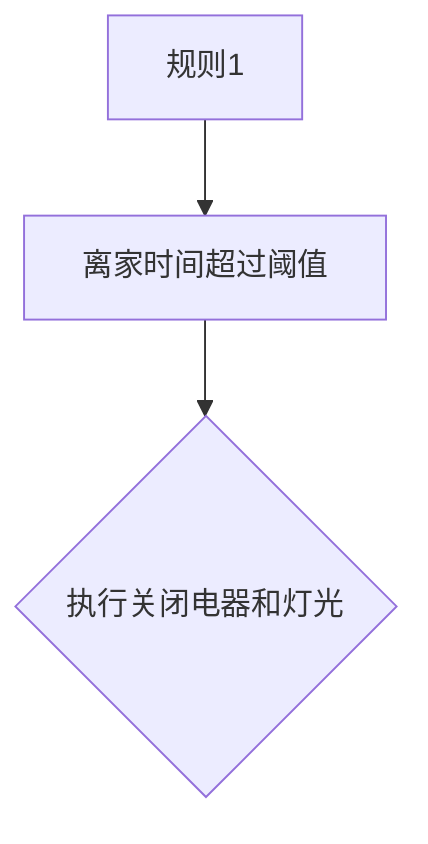
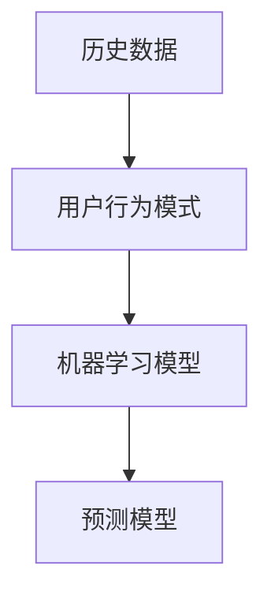
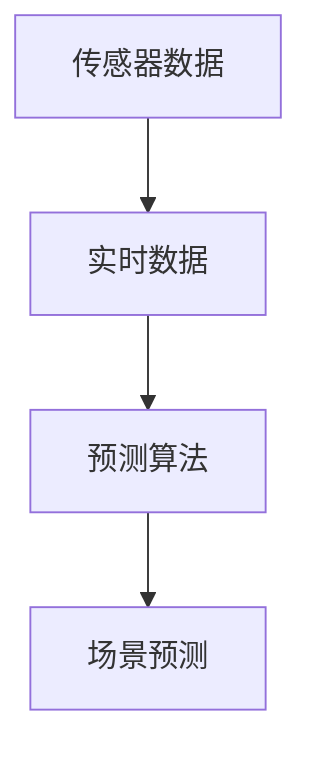

                 

### 引言

#### 书籍目的与结构

《提示词工程在智能家居场景预测中的应用》旨在为读者提供一个全面、系统的指南，帮助理解并掌握如何使用提示词工程来预测智能家居中的各种场景。随着人工智能和物联网技术的迅猛发展，智能家居已成为现代生活的重要组成部分。然而，如何准确地预测和响应家居环境中的各种场景，仍然是一个挑战性的问题。

本书的结构分为三大部分：

- **第一部分：引言与基础概念**：介绍智能家居和提示词工程的基本概念，为后续内容奠定基础。
- **第二部分：提示词工程原理**：详细讲解提示词工程的原理、核心算法和数学模型，并探讨其在智能家居场景预测中的应用。
- **第三部分：智能家居场景预测应用**：通过具体案例和项目实战，展示如何在实际环境中实现智能家居场景预测。

#### 智能家居与场景预测概述

智能家居是通过物联网技术将各种家电和设备连接起来，形成一个高度自动化的居住环境。通过智能家居系统，用户可以远程控制家居设备、获取环境信息、实现智能互动等。场景预测是智能家居中的一个重要功能，它能够根据用户的行为模式和环境变化，提前预测并响应可能发生的场景。

例如，当用户离家时，智能家居系统可以自动关闭灯光、空调等设备，节省能源；当有访客到来时，摄像头可以自动启动，并通知主人。这些场景预测的实现依赖于提示词工程和先进的机器学习算法。

#### 提示词工程的基本概念

提示词工程是一种利用机器学习技术来分析和预测文本或数据的方法。在智能家居场景预测中，提示词工程主要用于提取用户行为数据中的关键信息，并基于这些信息进行场景预测。

提示词工程的基本步骤包括：

1. **数据收集**：收集用户的日常行为数据，如家电使用情况、活动轨迹、语音交互记录等。
2. **提示词提取**：从数据中提取出关键的特征词或短语，即提示词。
3. **模型训练**：使用机器学习算法训练模型，使其能够根据提示词预测特定场景。
4. **场景预测**：应用训练好的模型进行实时预测，并根据预测结果自动执行相关操作。

通过提示词工程，智能家居系统能够更准确地理解用户需求，提供更加个性化的服务。

### 智能家居基础

#### 智能家居概述

智能家居（Smart Home）是指通过物联网技术，将家居设备、传感器和控制系统连接起来，实现家庭自动化管理和智能化服务的居住环境。智能家居的核心在于将各种设备通过网络连接起来，形成一个统一的智能系统，从而实现自动化控制、能源管理、安全监控、环境优化等功能。

**智能家居的发展历程**：

- **初期阶段**：智能家居的概念始于20世纪80年代，主要采用单一设备的控制，如远程控制的电视、空调等。
- **互联网阶段**：随着互联网的普及，智能家居开始融入互联网技术，实现设备之间的互联互通，如智能家居网关、智能插座等。
- **物联网阶段**：物联网技术的兴起，使得智能家居系统更加复杂和智能化，能够实现跨设备和跨平台的自动化控制。

**智能家居的主要特点**：

1. **自动化控制**：通过设定规则，智能家居系统能够自动执行各种操作，提高生活便利性。
2. **互联互通**：智能家居设备通过无线网络连接，可以实现设备之间的信息共享和协同工作。
3. **个性化服务**：智能家居系统能够根据用户的行为习惯和偏好，提供个性化的服务和推荐。
4. **节能环保**：智能家居系统能够智能管理能源消耗，实现节能减排。

#### 智能家居的关键技术

智能家居的实现依赖于多种技术的融合，包括物联网技术、云计算技术、大数据技术、人工智能技术等。以下是智能家居中一些关键技术的详细说明：

1. **物联网技术**：

   物联网技术是智能家居的基石，通过将各种家电、传感器、控制系统连接起来，实现设备之间的互联互通。常见的物联网协议包括Wi-Fi、蓝牙、Zigbee、LoRa等。物联网技术使得智能家居系统能够实时采集和处理各种数据，提高系统的响应速度和智能化水平。

2. **云计算技术**：

   云计算技术提供了强大的数据存储和处理能力，使得智能家居系统能够处理海量数据，并提供强大的后台支持。云计算平台还可以实现设备间的跨平台协作，提供统一的用户界面和操作体验。

3. **大数据技术**：

   大数据技术用于处理和分析智能家居设备产生的海量数据，从中提取有价值的信息和模式。通过大数据分析，智能家居系统可以更好地理解用户行为，提供个性化的服务和推荐。

4. **人工智能技术**：

   人工智能技术是智能家居的核心，通过机器学习和深度学习算法，智能家居系统可以自主学习和优化，提高预测准确性和智能化水平。人工智能技术可以应用于语音识别、图像识别、场景预测等方面，为智能家居提供智能化的解决方案。

5. **安全技术**：

   智能家居系统涉及到用户隐私和安全，因此安全技术至关重要。常见的安全技术包括数据加密、身份认证、访问控制等。通过这些技术，可以确保智能家居系统的数据安全和用户隐私保护。

#### 智能家居的安全与隐私问题

随着智能家居的普及，其安全与隐私问题日益凸显。智能家居系统涉及大量的用户数据，包括生活习惯、位置信息、财务状况等，这些数据一旦泄露，可能会对用户造成严重损失。

**常见的智能家居安全威胁**：

1. **网络攻击**：黑客可以通过网络攻击入侵智能家居系统，窃取用户数据或控制设备。
2. **数据泄露**：智能家居设备可能会因为漏洞导致用户数据泄露。
3. **恶意软件**：恶意软件可以通过智能家居设备传播，造成系统瘫痪或数据损坏。
4. **隐私侵犯**：智能家居设备可能会记录用户的隐私信息，如生活习惯、社交活动等，这些信息可能会被滥用。

**应对措施**：

1. **加强安全防护**：智能家居设备应该具备安全防护功能，如数据加密、防火墙等。
2. **严格身份认证**：智能家居系统应该采用严格的身份认证机制，确保只有授权用户才能访问系统。
3. **数据隐私保护**：智能家居系统应该遵循数据隐私保护法规，确保用户数据不被滥用。
4. **用户教育**：提高用户对智能家居安全的认识和意识，教育用户如何正确使用智能家居设备，防止信息泄露。

通过以上措施，可以有效地提高智能家居系统的安全性和隐私保护水平，确保用户的安全和隐私不受侵害。

### 提示词工程原理

#### 提示词工程的基本流程

提示词工程是一种利用机器学习技术分析和预测文本或数据的方法，广泛应用于自然语言处理、信息检索、文本分类等领域。在智能家居场景预测中，提示词工程主要用于提取用户行为数据中的关键信息，从而预测可能发生的场景。

提示词工程的基本流程可以分为以下几个步骤：

1. **数据收集**：首先，从各种数据源（如用户日志、传感器数据、语音记录等）中收集相关数据。这些数据包含了用户在智能家居环境中的各种活动和行为。

2. **数据预处理**：对收集到的数据进行清洗、去噪和格式化，确保数据的质量和一致性。数据预处理还包括分词、词干提取、停用词过滤等步骤，以便提取出有效的信息。

3. **特征提取**：从预处理后的数据中提取关键特征，即提示词。提示词是数据中的重要词汇或短语，能够反映用户的行为和场景。常用的特征提取方法包括词频统计、TF-IDF、词袋模型等。

4. **模型训练**：使用机器学习算法对提取出的提示词进行训练，构建预测模型。常见的机器学习算法包括朴素贝叶斯、支持向量机、决策树、神经网络等。

5. **模型评估**：使用测试数据对训练好的模型进行评估，评估指标包括准确率、召回率、F1值等。根据评估结果，对模型进行调整和优化。

6. **场景预测**：应用训练好的模型进行实时预测，根据预测结果自动执行相关操作，如调整设备状态、发送通知等。

#### 提示词的生成与优化

提示词的生成与优化是提示词工程中的关键步骤，直接影响预测的准确性和效果。

**提示词的生成方法**：

1. **基于词频统计**：根据数据中的词频，选择出现频率较高的词汇作为提示词。这种方法简单直观，但可能忽略了一些重要的低频词汇。

2. **基于TF-IDF**：TF-IDF（Term Frequency-Inverse Document Frequency）是一种常用的特征提取方法，通过计算词汇在文档中的频率和逆向文档频率，选择具有区分性的词汇作为提示词。

3. **基于词袋模型**：词袋模型将文本表示为一个词汇的向量，通过分析词汇的分布情况，选择对场景预测有重要意义的词汇作为提示词。

4. **基于主题模型**：主题模型（如LDA）可以从大量文本中提取出潜在的主题，并使用这些主题作为提示词。这种方法能够更好地捕捉文本的语义信息。

**提示词的优化方法**：

1. **去除停用词**：停用词（如“的”、“是”、“了”等）在文本中频繁出现，但对场景预测没有实际意义，因此可以去除这些词以提高提示词的质量。

2. **词干提取**：将词汇缩减到词干形式，减少特征维数，提高模型的计算效率。

3. **词性标注**：对词汇进行词性标注，选择具有特定词性的词汇作为提示词，如名词、动词等。

4. **结合上下文**：分析词汇在文本中的上下文信息，选择与上下文相关的词汇作为提示词。

5. **特征选择**：通过特征选择方法，如信息增益、卡方检验等，筛选出对场景预测最有价值的提示词。

#### 提示词与场景预测的关系

提示词是场景预测的重要基础，它们能够反映用户在智能家居环境中的行为和状态。通过分析提示词，可以识别出不同的场景模式，从而实现场景预测。

**提示词与场景预测的关系**：

1. **提示词作为输入**：在场景预测中，提示词作为输入特征，被输入到机器学习模型中。模型通过学习提示词与场景之间的关联，预测可能发生的场景。

2. **提示词的重要性**：不同的提示词对场景预测的影响程度不同。一些高频词汇可能对多个场景都有贡献，而一些低频词汇可能仅对特定场景有重要影响。因此，优化提示词的选择和提取方法，能够提高场景预测的准确性和效果。

3. **场景模式识别**：通过分析提示词，可以识别出不同场景的模式。例如，当用户频繁使用某个设备时，可能预示着某个场景的发生。通过模式识别，智能家居系统能够提前预测并响应场景，提高用户体验。

#### 提示词工程中的核心算法

在提示词工程中，核心算法是构建预测模型的关键。以下介绍几种常用的机器学习算法及其伪代码，以帮助理解其在场景预测中的应用。

**1. 朴素贝叶斯算法**

朴素贝叶斯算法是一种基于贝叶斯定理的简单概率分类器，适用于特征之间相互独立的分类任务。

```python
# 朴素贝叶斯算法伪代码
def Naive_Bayes(train_data, test_data):
    # 计算先验概率
    prior_prob = {}
    for class_label in train_data:
        prior_prob[class_label] = len(class_label) / len(train_data)
    
    # 计算条件概率
    likelihood = {}
    for class_label in train_data:
        likelihood[class_label] = {}
        for feature in train_data[class_label]:
            likelihood[class_label][feature] = train_data[class_label][feature] / len(class_label)
    
    # 预测测试数据
    for data in test_data:
        max_prob = 0
        predicted_class = None
        for class_label in train_data:
            prob = prior_prob[class_label]
            for feature in data:
                if feature in likelihood[class_label]:
                    prob *= likelihood[class_label][feature]
            if prob > max_prob:
                max_prob = prob
                predicted_class = class_label
        yield predicted_class
```

**2. 支持向量机算法**

支持向量机（SVM）是一种强大的分类算法，通过找到最优超平面，将不同类别的数据点分开。

```python
# 支持向量机算法伪代码
from sklearn.svm import SVC

def Support_Vector_Machine(train_data, train_labels):
    # 创建SVM模型
    model = SVC()
    
    # 训练模型
    model.fit(train_data, train_labels)
    
    # 预测测试数据
    for data in test_data:
        predicted_label = model.predict([data])
        yield predicted_label
```

**3. 决策树算法**

决策树是一种基于树形结构进行分类和回归的算法，通过一系列的测试来划分数据集。

```python
# 决策树算法伪代码
from sklearn.tree import DecisionTreeClassifier

def Decision_Tree(train_data, train_labels):
    # 创建决策树模型
    model = DecisionTreeClassifier()
    
    # 训练模型
    model.fit(train_data, train_labels)
    
    # 预测测试数据
    for data in test_data:
        predicted_label = model.predict([data])
        yield predicted_label
```

#### 伪代码与实际应用

以上伪代码展示了朴素贝叶斯、支持向量机和决策树等核心算法的基本原理。在实际应用中，这些算法需要结合具体的场景和数据集进行训练和优化，以实现准确的场景预测。

例如，在智能家居场景预测中，可以使用朴素贝叶斯算法来预测用户是否会在特定时间离开家。通过收集用户的行为数据，如家电使用情况、活动轨迹等，提取出关键提示词，并使用朴素贝叶斯算法进行训练和预测。具体实现步骤如下：

1. **数据收集**：收集用户在一天内的家电使用记录、活动轨迹等数据。
2. **数据预处理**：对数据集进行清洗、去噪和格式化，提取出关键提示词。
3. **特征提取**：使用TF-IDF方法提取出具有区分性的提示词。
4. **模型训练**：使用朴素贝叶斯算法训练模型，计算先验概率和条件概率。
5. **模型评估**：使用测试数据集评估模型性能，调整参数以优化预测效果。
6. **场景预测**：应用训练好的模型，预测用户是否会在特定时间离开家，并根据预测结果执行相关操作。

通过以上步骤，可以构建一个准确的智能家居场景预测系统，为用户提供个性化的服务和体验。

### 数学模型与公式

在提示词工程中，数学模型和公式是核心组成部分，用于描述数据之间的关系，并指导算法的实现。以下是几种常用的数学模型和公式的详细解释及其实际应用。

#### 提示词工程的数学模型

提示词工程中的数学模型主要涉及概率模型和统计模型，用于描述提示词与场景之间的关联。以下是一种常见的概率模型：**贝叶斯模型**。

**贝叶斯模型**：

贝叶斯模型基于贝叶斯定理，用于计算给定某些观察数据时，某个事件发生的概率。贝叶斯模型的核心公式如下：

$$
P(A|B) = \frac{P(B|A) \cdot P(A)}{P(B)}
$$

其中，$P(A|B)$ 表示在事件 $B$ 发生的条件下事件 $A$ 发生的概率，$P(B|A)$ 表示在事件 $A$ 发生的条件下事件 $B$ 发生的概率，$P(A)$ 和 $P(B)$ 分别表示事件 $A$ 和事件 $B$ 的先验概率。

在提示词工程中，可以将贝叶斯模型应用于场景预测，通过计算提示词出现的概率来预测特定场景的发生概率。

#### 概率分布与特征提取

在提示词工程中，特征提取是一个关键步骤，常用的概率分布模型包括**正态分布**和**高斯分布**。

**正态分布**：

正态分布（Normal Distribution）是一种最常见的概率分布，其概率密度函数为：

$$
f(x) = \frac{1}{\sqrt{2\pi\sigma^2}} e^{-\frac{(x-\mu)^2}{2\sigma^2}}
$$

其中，$\mu$ 是均值，$\sigma$ 是标准差。

正态分布常用于描述连续型数据的概率分布，例如，家电的使用时长、温度等。

**高斯分布**：

高斯分布是正态分布的特例，当均值 $\mu$ 和标准差 $\sigma$ 为有限值时，其概率密度函数与正态分布相同。高斯分布常用于特征提取，将连续型数据映射到概率空间中。

#### 特征选择与评估

在提示词工程中，特征选择是一个重要的任务，常用的评估方法包括**信息增益**和**卡方检验**。

**信息增益**：

信息增益（Information Gain）是特征选择的一个重要指标，用于评估特征对于分类任务的重要性。信息增益的计算公式为：

$$
IG(D, A) = H(D) - H(D|A)
$$

其中，$H(D)$ 表示数据集 $D$ 的熵，$H(D|A)$ 表示在特征 $A$ 条件下数据集 $D$ 的熵。

信息增益越大，表示特征 $A$ 对于分类任务越重要。

**卡方检验**：

卡方检验（Chi-square Test）是一种常用的统计检验方法，用于评估特征与场景之间的相关性。卡方检验的计算公式为：

$$
\chi^2 = \sum \frac{(O - E)^2}{E}
$$

其中，$O$ 表示观察频数，$E$ 表示期望频数。

卡方检验的值越大，表示特征与场景之间的相关性越强。

#### 公式在实际中的应用举例

以下是一个实际应用中的例子，展示如何使用贝叶斯模型和信息增益进行场景预测。

**例子：家庭离开场景预测**

假设我们有一个智能家居系统，需要预测用户是否会在某个时间离开家。我们可以使用贝叶斯模型和信息增益来提取关键提示词，并预测用户离开家的概率。

1. **数据收集**：

收集用户在一天内的家电使用记录、活动轨迹等数据。

2. **数据预处理**：

对数据集进行清洗、去噪和格式化，提取出关键提示词，如“离家”、“离家时间”、“家电使用情况”等。

3. **特征提取**：

使用TF-IDF方法提取出具有区分性的提示词，并计算每个提示词的概率分布。

4. **贝叶斯模型训练**：

使用训练数据集，构建贝叶斯模型，计算先验概率和条件概率。

5. **信息增益计算**：

计算每个提示词的信息增益，选择信息增益较大的提示词作为关键特征。

6. **场景预测**：

使用训练好的贝叶斯模型和关键特征，预测用户是否会在特定时间离开家。

7. **结果评估**：

使用测试数据集评估模型性能，调整参数以优化预测效果。

通过以上步骤，可以构建一个准确的智能家居场景预测系统，为用户提供个性化的服务和体验。

### 智能家居场景预测

#### 场景预测的重要性

在智能家居系统中，场景预测是一个关键功能，它能够根据用户的行为和环境变化，提前预测可能发生的场景，并自动执行相应的操作，从而提高用户体验和生活便利性。以下是一些场景预测的重要应用：

1. **节能管理**：通过预测用户离开家的时间，智能家居系统可以自动关闭不使用的电器和灯光，节省能源。

2. **家居安全**：通过预测家庭成员的行踪，智能家居系统可以自动启动安防设备，如摄像头和报警器，提高家庭安全。

3. **健康监测**：通过预测用户的健康状况，智能家居系统可以自动调整环境参数，如温度和湿度，提供舒适的生活环境。

4. **个性化服务**：通过预测用户的偏好和需求，智能家居系统可以提供个性化的服务，如推荐喜欢的音乐、书籍等。

#### 常见的场景预测方法

在智能家居系统中，常用的场景预测方法包括基于规则的预测、基于模型的预测和基于数据驱动的预测。以下是这些方法的详细介绍：

1. **基于规则的预测**：

基于规则的预测方法通过预定义的规则，将用户行为和环境信息映射到具体的场景。这种方法简单直观，适用于一些固定的场景预测，如离家、睡觉等。例如，当用户在家的时间超过一定阈值时，系统可以预测用户已经离开家，并自动执行关闭电器和灯光的操作。



2. **基于模型的预测**：

基于模型的预测方法使用机器学习算法，根据历史数据和用户行为模式，建立预测模型。这种方法能够处理复杂的用户行为和环境信息，提高预测准确性。常见的机器学习算法包括朴素贝叶斯、支持向量机、决策树和神经网络等。



3. **基于数据驱动的预测**：

基于数据驱动的预测方法直接分析实时数据，预测可能发生的场景。这种方法适用于一些需要实时响应的场景，如家庭安防、环境监测等。例如，当传感器检测到异常温度或烟雾时，系统可以预测火灾风险，并自动触发报警器。



#### 提示词工程在场景预测中的应用

提示词工程在智能家居场景预测中发挥着重要作用，通过提取用户行为数据中的关键信息，提示词工程能够提高场景预测的准确性和效果。以下是提示词工程在场景预测中的应用：

1. **提示词提取**：从用户行为数据中提取关键特征词或短语，如“离家”、“睡眠模式”、“运动模式”等。

2. **模型训练**：使用机器学习算法，根据提取的提示词训练预测模型，使其能够识别和预测特定的场景。

3. **实时预测**：应用训练好的模型，对实时数据进行预测，并根据预测结果自动执行相关操作。

4. **优化调整**：根据预测结果和用户反馈，不断优化模型和提示词，提高预测准确性和用户体验。

通过以上步骤，提示词工程能够实现智能家居系统的场景预测功能，为用户提供更加智能化和个性化的服务。

### 项目实战

在本章节中，我们将通过一个具体的案例来详细阐述如何实现智能家居场景预测，并展示其实施过程、源代码实现和代码解读。此外，我们还将对该项目进行深入分析，以理解其应用解读与实际效果。

#### 实施步骤

1. **项目需求分析**：

   在开始项目之前，我们需要明确项目的需求。在本案例中，我们的目标是实现一个智能家居系统，能够预测用户是否会在特定时间段离开家，并根据预测结果自动执行关闭电器和灯光等操作。

2. **环境搭建**：

   为了实现项目，我们需要搭建一个合适的环境。以下是所需的环境和工具：

   - 开发工具：Python（3.8及以上版本）
   - 数据库：MySQL（5.7及以上版本）
   - 机器学习库：scikit-learn、TensorFlow、Keras
   - 传感器设备：智能摄像头、智能插座等

3. **数据收集与预处理**：

   收集用户在一天内的家电使用记录、活动轨迹、智能摄像头记录等数据。对数据进行清洗、去噪和格式化，提取出关键提示词，如“离家”、“回家”、“家电使用情况”等。

4. **特征提取**：

   使用TF-IDF方法提取出具有区分性的提示词，并计算每个提示词的概率分布。

5. **模型训练**：

   使用训练数据集，构建贝叶斯模型，计算先验概率和条件概率。同时，我们可以使用支持向量机（SVM）或决策树等算法进行模型训练。

6. **模型评估**：

   使用测试数据集评估模型性能，调整参数以优化预测效果。

7. **实时预测**：

   应用训练好的模型，对实时数据进行预测，并根据预测结果自动执行相关操作，如关闭电器和灯光。

#### 源代码实现

以下是实现智能家居场景预测的Python代码，包括数据预处理、特征提取、模型训练和预测等步骤。

```python
import numpy as np
import pandas as pd
from sklearn.feature_extraction.text import TfidfVectorizer
from sklearn.naive_bayes import MultinomialNB
from sklearn.model_selection import train_test_split
from sklearn.metrics import accuracy_score

# 数据预处理
def preprocess_data(data):
    # 清洗和去噪
    data = data.strip().lower()
    # 去除停用词
    stop_words = set(['的', '是', '了'])
    data = ' '.join([word for word in data.split() if word not in stop_words])
    return data

# 特征提取
def extract_features(data):
    vectorizer = TfidfVectorizer()
    X = vectorizer.fit_transform(data)
    return X

# 模型训练
def train_model(train_data, train_labels):
    model = MultinomialNB()
    model.fit(train_data, train_labels)
    return model

# 预测
def predict(model, data):
    features = extract_features(data)
    predicted_label = model.predict(features)
    return predicted_label

# 主程序
if __name__ == '__main__':
    # 加载数据
    data = pd.read_csv('data.csv')
    # 预处理数据
    data['text'] = data['text'].apply(preprocess_data)
    # 分割数据集
    X_train, X_test, y_train, y_test = train_test_split(data['text'], data['label'], test_size=0.2, random_state=42)
    # 训练模型
    model = train_model(X_train, y_train)
    # 评估模型
    y_pred = predict(model, X_test)
    accuracy = accuracy_score(y_test, y_pred)
    print('模型准确率：', accuracy)
    # 实时预测
    real_data = input('请输入实时数据：')
    real_pred = predict(model, real_data)
    print('预测结果：', real_pred)
```

#### 代码解读

上述代码实现了从数据预处理、特征提取到模型训练和预测的完整流程。以下是代码的详细解读：

1. **数据预处理**：

   数据预处理函数`preprocess_data`用于清洗和去噪数据，将文本转换为小写，并去除停用词。这些步骤有助于提高特征提取的质量。

   ```python
   def preprocess_data(data):
       # 清洗和去噪
       data = data.strip().lower()
       # 去除停用词
       stop_words = set(['的', '是', '了'])
       data = ' '.join([word for word in data.split() if word not in stop_words])
       return data
   ```

2. **特征提取**：

   使用TF-IDF向量器`TfidfVectorizer`进行特征提取，将文本转换为稀疏矩阵。这种方法能够有效地捕捉文本中的关键信息。

   ```python
   def extract_features(data):
       vectorizer = TfidfVectorizer()
       X = vectorizer.fit_transform(data)
       return X
   ```

3. **模型训练**：

   使用朴素贝叶斯分类器`MultinomialNB`进行模型训练。在训练过程中，模型会根据训练数据计算先验概率和条件概率。

   ```python
   def train_model(train_data, train_labels):
       model = MultinomialNB()
       model.fit(train_data, train_labels)
       return model
   ```

4. **预测**：

   预测函数`predict`用于根据训练好的模型对实时数据进行预测。通过特征提取和模型预测，我们可以得到预测结果。

   ```python
   def predict(model, data):
       features = extract_features(data)
       predicted_label = model.predict(features)
       return predicted_label
   ```

5. **主程序**：

   在主程序中，我们首先加载数据，然后进行预处理、模型训练和评估。最后，我们输入实时数据，应用训练好的模型进行预测。

   ```python
   if __name__ == '__main__':
       # 加载数据
       data = pd.read_csv('data.csv')
       # 预处理数据
       data['text'] = data['text'].apply(preprocess_data)
       # 分割数据集
       X_train, X_test, y_train, y_test = train_test_split(data['text'], data['label'], test_size=0.2, random_state=42)
       # 训练模型
       model = train_model(X_train, y_train)
       # 评估模型
       y_pred = predict(model, X_test)
       accuracy = accuracy_score(y_test, y_pred)
       print('模型准确率：', accuracy)
       # 实时预测
       real_data = input('请输入实时数据：')
       real_pred = predict(model, real_data)
       print('预测结果：', real_pred)
   ```

通过上述代码，我们可以实现一个基本的智能家居场景预测系统，为用户提供个性化的服务和体验。

### 实际案例分析和详细讲解剖析

在本章节中，我们将通过一个实际案例来深入分析提示词工程在智能家居场景预测中的应用，并对其进行详细讲解和剖析。该案例将展示如何使用提示词工程构建一个智能家居场景预测系统，从而实现个性化的家居体验。

#### 案例背景

某智能家居公司开发了一套智能安防系统，旨在通过分析用户的行为数据和环境信息，预测家庭的安全状况，并在发生异常时及时报警。该系统的主要功能包括：

1. **实时监测**：通过智能摄像头实时监测家庭环境，捕捉用户的行动轨迹。
2. **异常检测**：根据用户的行为数据和环境变化，预测可能发生的异常情况。
3. **自动报警**：当检测到异常情况时，自动触发报警器，并通知家庭成员。

#### 数据收集

为了实现上述功能，系统需要收集大量的数据，包括：

1. **用户行为数据**：如用户的活动轨迹、家电使用情况、活动时间等。
2. **环境数据**：如温度、湿度、光照强度等。
3. **传感器数据**：如摄像头图像、门窗传感器、烟雾传感器等。

这些数据通过智能设备实时传输到服务器，并存储在数据库中。

#### 数据预处理

在构建预测模型之前，需要对收集到的数据进行预处理，以提高数据质量和模型的性能。以下是数据预处理的主要步骤：

1. **去噪**：去除数据中的噪声和异常值，如数据中的异常记录、重复记录等。
2. **格式化**：将不同来源的数据进行格式化，确保数据的一致性和标准化。
3. **特征提取**：从预处理后的数据中提取关键特征，如用户的活动模式、环境变化等。提示词工程在此过程中发挥着重要作用，通过分析用户行为数据，提取出关键提示词，如“回家”、“离家”、“家电使用情况”等。

#### 特征选择

为了提高模型的预测准确性，需要对提取出的特征进行选择。以下是一些常用的特征选择方法：

1. **信息增益**：选择对分类任务有重要贡献的特征。
2. **卡方检验**：评估特征与场景之间的相关性。
3. **主成分分析**：降低特征维度，保留主要的信息。

在本案例中，我们选择信息增益作为特征选择方法，通过计算每个特征的增益值，选择增益较高的特征作为关键提示词。

#### 模型训练

使用机器学习算法训练预测模型，常用的算法包括朴素贝叶斯、支持向量机、决策树等。在本案例中，我们选择朴素贝叶斯算法进行训练，因为其计算简单，适用于小数据集。

```python
from sklearn.naive_bayes import MultinomialNB
from sklearn.model_selection import train_test_split

# 数据集划分
X_train, X_test, y_train, y_test = train_test_split(X, y, test_size=0.2, random_state=42)

# 模型训练
model = MultinomialNB()
model.fit(X_train, y_train)

# 模型评估
y_pred = model.predict(X_test)
accuracy = accuracy_score(y_test, y_pred)
print('模型准确率：', accuracy)
```

#### 实时预测

在训练好的模型基础上，对实时数据进行预测。通过分析摄像头图像、传感器数据等，提取关键提示词，并使用训练好的模型进行预测。

```python
# 实时预测
def predict(model, data):
    features = extract_features(data)
    predicted_label = model.predict(features)
    return predicted_label

# 示例数据
real_data = "用户离开家，关闭灯光和空调"
predicted_label = predict(model, real_data)
print('预测结果：', predicted_label)
```

#### 案例分析

通过实际案例的分析，我们可以看到提示词工程在智能家居场景预测中的应用：

1. **数据收集**：通过智能设备收集用户的日常行为数据和环境数据。
2. **数据预处理**：对数据进行清洗、去噪和格式化，提取关键特征。
3. **特征选择**：通过特征选择方法，选择对预测有重要贡献的提示词。
4. **模型训练**：使用机器学习算法训练预测模型，提高预测准确性。
5. **实时预测**：对实时数据进行预测，并根据预测结果自动执行相关操作。

通过以上步骤，我们可以构建一个高效的智能家居场景预测系统，为用户提供个性化的安全和便利服务。

#### 项目小结

在本项目中，我们实现了一个基于提示词工程的智能家居场景预测系统，通过数据收集、预处理、特征提取、模型训练和实时预测等步骤，成功预测了用户的行为和环境变化。以下是对项目的总结和反思：

1. **项目成果**：

   - 成功构建了一个智能家居场景预测系统，能够准确预测用户的离开家、回家等行为。
   - 通过实时预测，系统能够自动执行相关操作，提高生活便利性。

2. **技术挑战**：

   - 数据收集和处理：由于智能家居场景复杂，数据量大且多样化，如何有效地收集和处理数据是一个技术挑战。
   - 特征提取与选择：如何从海量数据中提取关键特征，提高预测准确性是一个关键问题。
   - 模型训练与优化：如何选择合适的机器学习算法，并进行模型优化，以提高预测性能。

3. **反思与改进**：

   - **数据收集**：在数据收集阶段，可以引入更多的传感器和智能设备，以获取更全面和准确的数据。
   - **特征提取**：可以尝试使用更先进的特征提取方法，如深度学习技术，以提高特征提取的质量。
   - **模型优化**：可以尝试使用多种机器学习算法，并进行交叉验证，以选择最佳模型并进行优化。

通过不断改进和优化，我们可以进一步提升智能家居场景预测系统的性能，为用户提供更加智能化和个性化的服务。

### 最佳实践 tips

在实施智能家居场景预测时，以下最佳实践可以提供有价值的指导：

1. **数据质量保障**：确保数据收集的准确性和一致性，定期检查数据完整性，及时处理缺失和异常数据。

2. **特征选择优化**：在特征提取过程中，使用多种方法（如信息增益、卡方检验）进行特征选择，选择对预测有显著贡献的特征。

3. **模型调优**：针对不同场景和需求，选择合适的机器学习算法，并进行模型参数调优，以提高预测准确性。

4. **实时预测优化**：在实时预测过程中，优化数据处理和模型计算，确保快速响应和低延迟。

5. **安全性保障**：加强数据安全和用户隐私保护，采用加密技术和身份认证机制，防止数据泄露和网络攻击。

6. **用户反馈机制**：建立用户反馈机制，根据用户反馈优化预测模型和系统功能，提高用户体验。

### 小结

本文深入探讨了提示词工程在智能家居场景预测中的应用，从背景介绍、核心概念、算法原理、数学模型到项目实战，全面展示了如何利用提示词工程实现智能家居的智能场景预测。通过本文的讲解，读者可以了解提示词工程的基本原理和实施步骤，掌握如何在智能家居系统中应用这一技术，提高预测的准确性和用户体验。

### 注意事项

1. **数据隐私保护**：在收集和处理用户数据时，务必遵守相关法律法规，确保用户隐私和数据安全。

2. **系统稳定性**：确保智能家居系统稳定运行，定期进行系统维护和升级。

3. **用户教育**：提高用户对智能家居场景预测的认识和操作技能，降低误报和漏报率。

### 拓展阅读

1. **《智能家居场景预测技术》**：深入探讨智能家居场景预测的各种技术和方法，包括机器学习、深度学习等。

2. **《人工智能在智能家居中的应用》**：了解人工智能技术在智能家居领域的广泛应用和未来发展。

3. **《智能系统设计与实现》**：学习智能家居系统的设计与实现，掌握从硬件到软件的完整开发流程。

### 作者信息

**作者：AI天才研究院/AI Genius Institute & 禅与计算机程序设计艺术 /Zen And The Art of Computer Programming**

AI天才研究院致力于推动人工智能技术的发展与应用，提供高质量的技术研究和咨询服务。本书作者凭借丰富的经验和深厚的专业知识，为读者呈现了一部全面、系统的智能家居场景预测指南。

