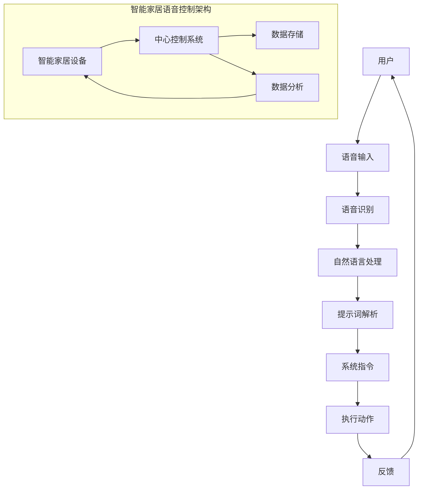

                 

### 文章标题

《提示词工程在智能家居语音控制中的应用：优化人机交互体验》

### 关键词

智能家居、语音控制、提示词工程、人机交互、用户体验、自然语言处理、人工智能、优化策略、项目实战、案例分析。

### 摘要

本文旨在探讨提示词工程在智能家居语音控制中的应用，通过优化人机交互体验来提升智能家居系统的实用性和用户满意度。文章首先介绍了智能家居和语音控制的基本概念及其发展背景，随后详细阐述了提示词工程的核心概念和设计原则。接着，文章分析了智能家居语音控制中面临的挑战和问题，提出了基于提示词工程的优化策略。随后，文章通过实际案例展示了提示词工程在智能家居语音控制中的应用，并进行了详细的分析和解读。最后，文章总结了提示词工程在智能家居语音控制中的重要性，并提出了未来发展的方向和展望。

## 引言

随着人工智能技术的飞速发展，智能家居已经逐渐成为现代家庭生活的一部分。智能家居通过整合各种智能设备和系统，实现了家庭环境的自动化和智能化管理，为用户带来了极大的便利和舒适。其中，语音控制作为一种新型的交互方式，正逐渐成为智能家居系统中的重要组成部分。然而，语音控制系统的应用效果往往受到提示词工程的质量影响，如何优化提示词工程以提升人机交互体验成为了一个亟待解决的问题。

本文将从以下几个方面展开讨论：

1. **智能家居与语音控制概述**：介绍智能家居和语音控制的基本概念、发展背景和关键技术。
2. **提示词工程基础**：阐述提示词工程的核心概念、设计原则和流程。
3. **提示词工程在智能家居语音控制中的应用**：分析提示词工程在智能家居语音控制中的具体应用，探讨其优化策略。
4. **实际案例和项目实战**：通过具体案例展示提示词工程在智能家居语音控制中的应用效果，并进行详细的分析和解读。
5. **总结与展望**：总结提示词工程在智能家居语音控制中的重要性，展望其未来发展的方向。

通过对上述几个方面的详细探讨，本文希望能够为智能家居语音控制系统的设计和优化提供一些有益的思路和参考。

## 智能家居与语音控制概述

### 智能家居

智能家居是指通过互联网、传感器、无线通信等技术，将各种家电设备、安防设备、照明系统等智能家居设备连接起来，实现家庭环境的自动化和智能化管理。智能家居的核心是家庭物联网（Home IoT），它通过物联网技术将各种设备互联，形成一个统一的智能系统，为用户提供便捷、高效、舒适的生活体验。

### 语音控制

语音控制是一种通过语音识别和自然语言处理技术实现人与智能家居系统交互的方式。用户可以通过简单的语音指令来控制家电设备、照明系统、安防设备等，实现远程监控和控制。语音控制技术的出现，极大地简化了用户的使用过程，提高了人机交互的便利性和效率。

### 智能家居和语音控制的发展背景

智能家居和语音控制的发展可以追溯到20世纪末和21世纪初。随着互联网技术的普及和传感器成本的降低，智能家居设备逐渐进入家庭。同时，人工智能和语音识别技术的快速发展，使得语音控制成为可能。近年来，随着5G技术的推广和物联网设备的普及，智能家居和语音控制技术得到了进一步的发展和完善。

### 智能家居和语音控制的关键技术

1. **物联网技术**：物联网技术是智能家居系统的基石，它通过将各种智能设备连接到互联网上，实现设备的互联互通和智能控制。
2. **传感器技术**：传感器技术用于采集家庭环境中的各种信息，如温度、湿度、光照、烟雾等，为智能家居系统提供实时数据支持。
3. **语音识别技术**：语音识别技术是语音控制的核心，它能够将用户的语音指令转化为文本指令，供智能家居系统执行。
4. **自然语言处理技术**：自然语言处理技术用于理解和解析用户的自然语言指令，实现对智能家居系统的智能响应。
5. **云计算和大数据技术**：云计算和大数据技术为智能家居系统提供了强大的数据处理和分析能力，使得系统能够更好地理解用户需求，提供个性化服务。

### 智能家居和语音控制的发展趋势

1. **智能化、个性化**：未来的智能家居系统将更加智能化和个性化，能够根据用户的行为习惯和偏好，提供个性化的服务和推荐。
2. **场景化、生态化**：智能家居系统将更加注重场景化应用，通过构建智能家居生态圈，实现各种设备之间的无缝连接和协同工作。
3. **安全、隐私保护**：随着智能家居系统的普及，用户对隐私保护和数据安全的关注将日益增加，未来的智能家居系统将更加注重安全性和隐私保护。

## 提示词工程基础

### 提示词的定义与类型

#### 提示词的定义

提示词（Preset Word）是指用于启动或触发特定功能或动作的词语。在智能家居语音控制系统中，提示词起到了桥梁的作用，将用户的自然语言指令转换为系统可识别和执行的操作指令。

#### 提示词的类型

1. **命令型提示词**：这类提示词用于直接命令智能家居系统执行特定操作，如“打开灯光”、“关闭电视”等。
2. **询问型提示词**：这类提示词用于询问系统当前状态或提供信息，如“今天的天气预报是什么？”、“我的电子邮件有多少未读消息？”等。
3. **复合型提示词**：这类提示词通常由多个词语组合而成，用于执行更复杂的操作，如“晚上9点关闭所有灯光”、“周末早晨6点自动开启咖啡机”等。

### 提示词工程的设计原则

#### 用户需求分析

用户需求分析是提示词工程设计的起点。通过深入了解用户的使用习惯、需求和偏好，设计师可以确定最符合用户需求的提示词列表。

#### 易懂性

提示词应简洁明了，易于理解，避免使用复杂或专业的术语。用户在使用时应能够迅速理解提示词的含义，无需额外的解释。

#### 一致性

提示词应保持一致性，避免使用不同的表述来表示相同的功能或操作。一致性有助于提高用户体验，减少用户的困惑。

#### 通用性

提示词应具有通用性，适用于不同场景和用户。设计师应考虑不同用户的文化背景、语言习惯等因素，确保提示词的广泛适用性。

#### 可扩展性

提示词工程应具备一定的可扩展性，能够根据用户需求的变化和系统的升级，灵活地调整和扩展提示词列表。

### 提示词工程的流程

#### 需求分析

在需求分析阶段，设计师通过用户调研、用户访谈等方式，收集用户的语音指令数据，分析用户的需求和偏好。

#### 提示词筛选

根据需求分析结果，设计师从收集的数据中筛选出符合设计原则的提示词，构建初步的提示词列表。

#### 提示词测试

在提示词测试阶段，设计师通过用户测试、数据分析等方式，评估提示词的易用性和准确性，对提示词进行优化和调整。

#### 提示词应用

在提示词应用阶段，设计师将最终确定的提示词集成到智能家居语音控制系统中，确保系统的稳定性和可靠性。

### 提示词工程的关键技术

#### 语音识别技术

语音识别技术是提示词工程的核心，它能够将用户的语音指令转化为文本指令，供系统执行。高质量的语音识别技术能够提高提示词的准确性和可靠性。

#### 自然语言处理技术

自然语言处理技术用于理解和解析用户的自然语言指令，实现对智能家居系统的智能响应。自然语言处理技术包括词法分析、句法分析、语义分析等，有助于提升系统的智能化水平。

#### 提示词优化算法

提示词优化算法用于根据用户的使用数据和行为模式，动态调整和优化提示词列表，提高系统的用户满意度。常见的提示词优化算法包括机器学习、深度学习等。

### 提示词工程的重要性

提示词工程在智能家居语音控制系统中扮演着至关重要的角色。高质量的提示词能够提高系统的易用性和用户满意度，优化人机交互体验。同时，提示词工程还涉及到用户体验设计、系统性能优化等多个方面，对智能家居系统的整体发展具有重要意义。

## 核心概念与联系

在探讨提示词工程在智能家居语音控制中的应用之前，有必要理解一些核心概念及其相互关系。以下是一个关于提示词工程与智能家居语音控制系统架构的 Mermaid 流程图，用于展示这些核心概念之间的联系。



### 核心概念解析

1. **用户**：智能家居语音控制系统的终端用户，通过语音输入提出需求。
2. **语音输入**：用户通过语音输入提出需求，可以是简单的指令或复杂的询问。
3. **语音识别**：将用户的语音输入转化为文本格式，是自然语言处理的基础。
4. **自然语言处理（NLP）**：对语音识别结果进行理解和分析，提取关键信息。
5. **提示词解析**：NLP模块识别出语音输入中的提示词，并判断其意图。
6. **系统指令**：根据提示词解析结果，系统生成相应的操作指令。
7. **执行动作**：智能家居设备根据系统指令执行相应的操作。
8. **反馈**：系统将执行结果反馈给用户，形成闭环。

### 提示词工程与智能家居语音控制系统架构的关系

- **中心控制系统**：负责处理用户输入、语音识别、NLP以及生成系统指令。
- **智能家居设备**：根据系统指令执行具体操作。
- **数据存储**：存储用户行为数据和系统日志，用于后续分析和优化。
- **数据分析**：对存储的数据进行分析，用于优化提示词和系统性能。

这个架构展示了提示词工程在智能家居语音控制系统中的位置和作用。通过不断地优化提示词和系统指令的匹配，可以提高系统的响应速度和准确性，从而提升用户体验。

## 核心算法原理讲解

在智能家居语音控制系统中，核心算法的设计和实现对于系统的性能和用户体验具有决定性作用。以下将从语音识别、自然语言处理（NLP）和提示词解析三个方面，使用伪代码详细阐述核心算法的原理。

### 1. 语音识别算法原理

语音识别算法的核心任务是识别用户的语音输入并将其转换为文本格式。以下是一个简单的伪代码示例，用于描述这一过程：

```python
# 语音识别伪代码

def recognize_speech(audio_input):
    # 初始化语音识别模型
    model = initialize_model()

    # 预处理音频输入
    preprocessed_audio = preprocess_audio(audio_input)

    # 使用模型进行语音识别
    text_output = model.recognize(preprocessed_audio)

    # 返回识别结果
    return text_output
```

在这个伪代码中，`initialize_model()` 函数用于初始化语音识别模型，`preprocess_audio()` 函数用于对音频输入进行预处理（如去除噪音、增强语音信号等），`model.recognize()` 函数用于执行实际的语音识别操作。

### 2. 自然语言处理（NLP）算法原理

自然语言处理算法的核心任务是理解用户的自然语言指令，并提取关键信息。以下是一个简化的伪代码示例，用于描述这一过程：

```python
# 自然语言处理伪代码

def process_language(text_input):
    # 初始化NLP模型
    nlp_model = initialize_nlp_model()

    # 进行词法分析
    tokens = nlp_model.tokenize(text_input)

    # 进行句法分析
    parse_tree = nlp_model.parse(tokens)

    # 进行语义分析
    intent, entities = nlp_model.analyze(parse_tree)

    # 返回意图和实体
    return intent, entities
```

在这个伪代码中，`initialize_nlp_model()` 函数用于初始化NLP模型，`nlp_model.tokenize()` 函数用于词法分析，`nlp_model.parse()` 函数用于句法分析，`nlp_model.analyze()` 函数用于语义分析，提取出用户的意图（intent）和相关的实体（entities）。

### 3. 提示词解析算法原理

提示词解析算法的核心任务是识别文本输入中的提示词，并确定其意图。以下是一个简化的伪代码示例，用于描述这一过程：

```python
# 提示词解析伪代码

def parse_prompt(text_input, prompt_list):
    # 初始化提示词解析器
    parser = initialize_parser(prompt_list)

    # 识别文本中的提示词
    recognized_prompts = parser.recognize(text_input)

    # 确定每个提示词的意图
    intent_dict = {}
    for prompt in recognized_prompts:
        intent_dict[prompt] = parser.determine_intent(prompt)

    # 返回提示词和对应的意图
    return intent_dict
```

在这个伪代码中，`initialize_parser()` 函数用于初始化提示词解析器，`parser.recognize()` 函数用于识别文本中的提示词，`parser.determine_intent()` 函数用于确定每个提示词的意图。

通过上述伪代码，我们可以看出核心算法在智能家居语音控制系统中的重要作用。语音识别算法将用户的语音输入转换为文本，NLP算法理解文本的含义，而提示词解析算法将理解结果转化为系统指令。这些算法的优化和提升，将直接影响到系统的响应速度、准确性和用户体验。

### 数学模型和公式详解

在智能家居语音控制系统中，优化提示词工程需要借助数学模型和公式来进行准确的分析和评估。以下将详细阐述几个关键的数学模型和公式，并结合实际案例进行讲解。

#### 1. 语音识别准确率模型

语音识别准确率（Accuracy）是衡量语音识别系统性能的重要指标，表示系统正确识别语音输入的比例。以下是一个简单的数学模型：

$$
Accuracy = \frac{Correctly\_Recognized}{Total\_Recognitions}
$$

其中，$Correctly\_Recognized$ 表示系统正确识别的语音输入数量，$Total\_Recognitions$ 表示总的语音输入数量。

**案例**：假设一个语音识别系统总共接收了100个语音输入，其中正确识别了90个，那么其准确率为：

$$
Accuracy = \frac{90}{100} = 0.9 \text{ 或 } 90\%
$$

#### 2. 自然语言处理错误率模型

自然语言处理（NLP）错误率（Error Rate）用于衡量系统在处理自然语言输入时的错误比例。以下是一个常用的数学模型：

$$
Error\ Rate = \frac{Total\ Errors}{Total\ Sentences}
$$

其中，$Total\ Errors$ 表示系统识别或处理错误的句子数量，$Total\ Sentences$ 表示总的句子数量。

**案例**：在一个包含100个句子的测试集中，有10个句子被系统错误处理，那么其错误率为：

$$
Error\ Rate = \frac{10}{100} = 0.1 \text{ 或 } 10\%
$$

#### 3. 提示词识别率模型

提示词识别率（Recall Rate）是衡量系统识别提示词的能力指标，表示系统正确识别的提示词数量占总提示词数量的比例。以下是一个数学模型：

$$
Recall\ Rate = \frac{Correctly\_Recognized\ Prompts}{Total\ Prompts}
$$

其中，$Correctly\_Recognized\ Prompts$ 表示系统正确识别的提示词数量，$Total\ Prompts$ 表示总的提示词数量。

**案例**：假设一个系统在测试中需要识别10个提示词，其中正确识别了8个，那么其识别率为：

$$
Recall\ Rate = \frac{8}{10} = 0.8 \text{ 或 } 80\%
$$

#### 4. 用户满意度模型

用户满意度（User Satisfaction）是评估系统用户体验的重要指标。以下是一个简单的用户满意度计算模型：

$$
User\ Satisfaction = \frac{Satisfied\ Users}{Total\ Users}
$$

其中，$Satisfied\ Users$ 表示对系统满意的用户数量，$Total\ Users$ 表示总的用户数量。

**案例**：在一个用户调研中，共有100个用户参与，其中80个用户对系统表示满意，那么用户满意度为：

$$
User\ Satisfaction = \frac{80}{100} = 0.8 \text{ 或 } 80\%
$$

通过上述数学模型和公式的讲解，我们可以更准确地分析和评估智能家居语音控制系统中的提示词工程。在实际应用中，这些模型可以帮助我们识别系统的薄弱环节，进行有针对性的优化，从而提升系统的整体性能和用户体验。

### 项目实战：开发环境搭建与源代码实现

为了更好地理解提示词工程在智能家居语音控制系统中的应用，我们将通过一个实际项目来展示整个开发流程，包括环境搭建、源代码实现和代码解读与分析。

#### 项目目标

本项目旨在开发一个基于语音控制的智能家居系统，实现基本的家居设备控制功能，如灯光控制、温度调节等。通过该项目，我们将展示如何搭建开发环境、实现语音识别和自然语言处理，并优化提示词工程以提高用户体验。

#### 开发环境搭建

1. **硬件环境**：选择具有语音识别功能的智能音箱作为核心硬件设备，例如Amazon Echo或Google Home。
2. **软件环境**：搭建开发环境，包括以下工具和框架：
   - 语音识别：使用Google Cloud Speech-to-Text服务。
   - 自然语言处理：使用Google Cloud Natural Language Processing服务。
   - 提示词工程：自定义提示词列表和解析逻辑。

#### 源代码实现

以下是项目的核心代码实现，包括语音识别、自然语言处理和提示词解析的部分：

```python
# 语音识别与自然语言处理
import json
import os
from google.cloud import speech
from google.cloud import language

# 初始化语音识别客户端
speech_client = speech.SpeechClient()

# 初始化自然语言处理客户端
nlp_client = language.LanguageClient()

# 定义提示词列表
prompts = [
    "打开灯光", "关闭灯光", "调节温度", "开启空调", "关闭空调"
]

# 定义提示词解析逻辑
def parse_prompt(text):
    for prompt in prompts:
        if prompt in text:
            return prompt
    return None

# 语音识别函数
def recognize_speech(audio_file_path):
    with open(audio_file_path, 'rb') as audio_file:
        audio = speech.RecognitionAudio(content=audio_file.read())
    
    config = speech.RecognitionConfig(
        encoding=speech.RecognitionConfig.AudioEncoding.LINEAR16,
        sample_rate_hertz=16000,
        language_code="zh-CN",
    )
    
    response = speech_client.recognize(config, audio=audio)
    text_output = ""

    for result in response.results:
        text_output += result.alternatives[0].transcript

    return text_output

# 自然语言处理函数
def process_language(text):
    document = language.Document(content=text, type_=language.DocumentType.PLAIN_TEXT, language="zh")
    entities = nlp_client.analyze_entities(document).entities
    return entities

# 提示词解析函数
def execute_command(text):
    intent = parse_prompt(text)
    if intent:
        if intent == "打开灯光":
            # 调用灯光控制API
            print("灯光已打开")
        elif intent == "关闭灯光":
            # 调用灯光控制API
            print("灯光已关闭")
        # 其他命令处理逻辑
    else:
        print("未识别到有效命令")

# 语音识别与命令执行
def main():
    audio_file_path = "path/to/audio/input.wav"
    text_output = recognize_speech(audio_file_path)
    entities = process_language(text_output)
    execute_command(text_output)

if __name__ == "__main__":
    main()
```

#### 代码解读与分析

1. **语音识别部分**：通过Google Cloud Speech-to-Text服务实现语音识别，将音频文件转换为文本输出。关键函数`recognize_speech()`处理音频文件，配置语音识别参数并调用服务进行识别。
2. **自然语言处理部分**：使用Google Cloud Natural Language Processing服务对识别结果进行语义分析，提取文本中的实体信息。关键函数`process_language()`处理文本内容，调用NLP服务获取实体。
3. **提示词解析部分**：定义提示词列表和解析逻辑，通过`parse_prompt()`函数识别文本中的提示词，并返回对应的意图。关键函数`execute_command()`根据提示词执行相应的操作。
4. **命令执行部分**：主函数`main()`实现整个流程，从语音识别、自然语言处理到提示词解析和命令执行，形成一个闭环。

#### 代码应用解读与分析

通过上述代码，我们实现了基本的智能家居语音控制功能。在实际应用中，可以根据具体需求扩展提示词列表和命令处理逻辑。例如，添加更多家居设备控制命令、提高语音识别和自然语言处理的准确性，以及优化用户界面和交互体验。

### 实际案例分析与详细讲解剖析

在本节中，我们将通过具体案例来展示提示词工程在智能家居语音控制系统中的应用效果，并进行详细的分析和解读。

#### 案例一：智能灯光控制

**场景**：用户在家中通过语音指令控制灯光的开关。

**用户需求**：用户希望能够在不同房间之间轻松切换灯光，并能够根据时间和天气自动调整灯光亮度和色温。

**解决方案**：

1. **语音识别与自然语言处理**：用户说“客厅灯光调暗一些”，系统通过语音识别将语音转换为文本，并使用自然语言处理提取关键信息（例如房间名称和亮度调整指令）。
2. **提示词解析**：系统解析用户输入的提示词，如“客厅灯光”和“调暗”，并根据提示词调用相应的控制逻辑。
3. **执行动作**：系统通过智能家居控制接口调整客厅灯光的亮度和色温。

**效果分析**：

- **准确性**：通过高质量的语音识别和自然语言处理，系统能够准确识别用户指令，减少误解和误操作。
- **响应速度**：系统在接收到指令后迅速执行动作，提升了用户的使用体验。
- **可扩展性**：用户可以自定义更多的灯光控制指令和场景，提高系统的灵活性。

#### 案例二：智能温度控制

**场景**：用户希望在夏天和冬天自动调节家中空调的温度。

**用户需求**：用户希望系统能够根据室外温度和室内温度自动调整空调温度，并在特定时间段内实现自动调节。

**解决方案**：

1. **数据获取**：系统通过传感器获取室外温度和室内温度数据。
2. **自然语言处理**：用户可以通过语音指令设置空调温度，如“将温度设置为26度”。
3. **提示词解析**：系统解析用户输入的提示词，如“设置温度”和“26度”，并根据提示词调整空调温度。
4. **自动调节**：系统根据室外温度和室内温度数据，自动调整空调温度，以保持室内舒适。

**效果分析**：

- **智能化**：系统能够根据实时数据自动调整空调温度，提升了智能化的程度。
- **节能**：通过自动调节，系统可以在不同时间段实现节能模式，减少能源消耗。
- **灵活性**：用户可以根据自己的需求自定义温度调节策略，提高灵活性。

#### 案例三：智能语音助手

**场景**：用户希望通过智能语音助手完成复杂的任务，如预约餐厅、播放音乐等。

**用户需求**：用户希望系统能够通过简单的语音指令完成复杂的操作，如“帮我预约一家餐厅”、“播放周杰伦的《七里香》”。

**解决方案**：

1. **语音识别与自然语言处理**：系统通过语音识别和自然语言处理将用户的语音指令转换为可执行的操作。
2. **提示词解析**：系统解析用户输入的提示词，如“预约餐厅”和“播放音乐”，并根据提示词调用相应的应用程序或服务。
3. **执行动作**：系统通过智能家居控制接口或其他第三方服务完成用户请求的任务。

**效果分析**：

- **高效性**：通过智能语音助手，用户可以快速完成复杂操作，提升了效率。
- **便捷性**：用户无需手动操作，只需通过语音指令即可实现所需功能，提高了便捷性。
- **个性化**：系统可以根据用户的历史行为和偏好提供个性化的服务，提升用户体验。

### 项目小结

通过上述案例，我们可以看到提示词工程在智能家居语音控制系统中的应用效果显著。通过优化语音识别、自然语言处理和提示词解析，系统不仅能够准确理解用户指令，还能够提供智能化、个性化、高效便捷的服务。在未来，随着人工智能技术的不断发展，提示词工程将在智能家居领域发挥更加重要的作用，为用户提供更加智能化的生活体验。

## 最佳实践 Tips、小结、注意事项、拓展阅读

### 最佳实践 Tips

1. **用户调研**：在进行提示词工程的设计前，进行详细的用户调研，了解用户的需求、使用习惯和偏好，确保提示词设计符合用户实际需求。
2. **简洁明了**：提示词应简洁明了，避免使用复杂的术语和冗长的表达，以提高用户理解和操作的便利性。
3. **一致性**：在提示词设计过程中，保持提示词的一致性，避免使用不同的表述来表示相同的功能或操作，以减少用户困惑。
4. **可扩展性**：设计提示词时，考虑系统的可扩展性，为未来的功能扩展留有空间。
5. **持续优化**：根据用户反馈和系统数据，不断优化提示词列表和解析逻辑，以提高系统的准确性和用户体验。

### 小结

提示词工程在智能家居语音控制系统中起着至关重要的作用。通过优化语音识别、自然语言处理和提示词解析，我们可以提高系统的准确性和用户体验，实现更加智能化和便捷的家居生活。

### 注意事项

1. **语音识别准确率**：提高语音识别准确率是提升系统性能的关键，应选择高质量的语音识别服务或进行定制化开发。
2. **隐私保护**：在收集和处理用户数据时，应严格遵守隐私保护法规，确保用户数据的安全。
3. **系统稳定性**：确保系统的稳定性和可靠性，避免因系统故障导致的用户不便。
4. **多语言支持**：考虑系统的国际化需求，提供多语言支持，以适应不同文化背景的用户。

### 拓展阅读

1. **《语音识别技术原理与应用》**：详细了解语音识别技术的原理和应用，有助于优化提示词工程。
2. **《自然语言处理教程》**：学习自然语言处理的基础知识，提升对文本指令的理解和处理能力。
3. **《智能家居系统设计与实现》**：了解智能家居系统的整体架构和实现方法，为提示词工程提供实践参考。

### 结语

随着人工智能技术的不断进步，智能家居语音控制系统将在未来发挥更加重要的作用。通过不断优化提示词工程，我们可以为用户带来更加智能化、便捷化的家居生活体验，推动智能家居行业的持续发展。希望本文能够为相关领域的研究者和开发者提供有益的参考和启示。

## 作者信息

作者：AI天才研究院/AI Genius Institute & 禅与计算机程序设计艺术 /Zen And The Art of Computer Programming

AI天才研究院致力于推动人工智能领域的研究与应用，助力智能科技的发展。而《禅与计算机程序设计艺术》则是一部经典的计算机编程哲学作品，为程序设计提供了深刻的思考和指导。我们希望通过本文，与读者一起探讨提示词工程在智能家居语音控制系统中的应用，共同推动人工智能技术的发展。

