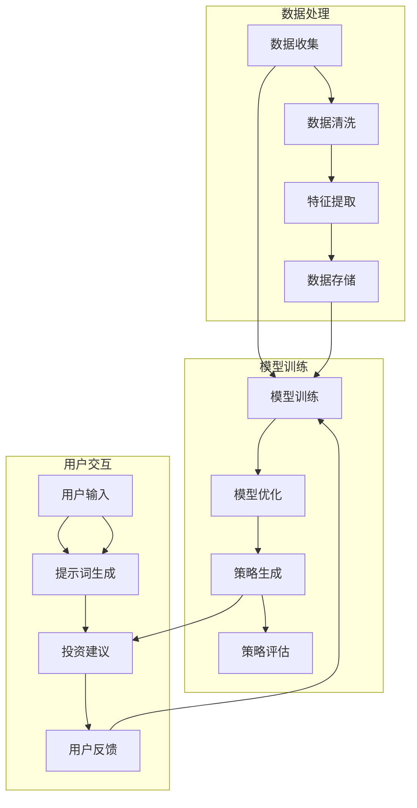

                 

### 引言

#### 1.1 智能投资顾问系统的背景与重要性

在当今快速发展的金融市场中，投资者面临着复杂多变的经济环境，需要做出准确、及时的决策以实现资产增值。传统的投资顾问服务往往依赖于人工分析，不仅效率低下，而且容易受到主观因素的影响。随着人工智能技术的崛起，智能投资顾问系统（Smart Investment Advisory System，SIAS）应运而生，成为金融科技（FinTech）领域的一大热点。

智能投资顾问系统通过集成大数据分析、机器学习、自然语言处理等技术，能够自动分析市场数据，为投资者提供个性化、智能化的投资建议。这种系统不仅能够提高投资决策的准确性和效率，还能够降低投资风险，成为现代投资者不可或缺的工具。

#### 1.2 提示词工程的概念与作用

提示词工程（Prompt Engineering）是近年来在人工智能领域兴起的一门交叉学科，旨在通过设计和优化提示词（prompts），提高人工智能模型的表现。在智能投资顾问系统中，提示词工程的作用尤为重要。提示词是模型输入的一部分，通过调整和优化提示词，可以引导模型更好地理解问题，提高预测和决策的准确性。

提示词工程不仅涉及自然语言处理和机器学习的理论知识，还需要结合实际应用场景进行深入的实践。通过提示词工程，智能投资顾问系统能够更准确地捕捉市场信息，提供更为可靠的决策支持。

### 智能投资顾问系统概述

#### 2.1 智能投资顾问系统的工作原理

智能投资顾问系统通常基于以下技术框架构建：

1. **数据收集与预处理**：系统首先从各种数据源（如股票交易所、新闻网站、社交媒体等）收集数据，然后进行清洗、去重、归一化等预处理操作。

2. **特征提取与降维**：预处理后的数据通过特征提取算法转换为适合机器学习模型的输入特征。常见的特征提取方法包括时间序列分析、文本挖掘、图像识别等。降维技术如主成分分析（PCA）和自动编码器（Autoencoder）可以减少数据维度，提高计算效率。

3. **模型训练与优化**：使用机器学习算法（如决策树、神经网络、集成方法等）对特征进行训练，构建预测模型。模型训练过程中需要不断调整参数，通过交叉验证等方法优化模型性能。

4. **投资策略生成与评估**：基于训练好的模型，系统可以生成针对不同投资目标和风险的策略。这些策略通过回测和模拟交易进行评估，以确保在实际应用中的有效性和稳健性。

5. **实时决策与反馈**：系统根据实时市场数据和市场动态，对投资策略进行动态调整，并提供实时投资建议。此外，系统还会收集用户反馈，不断优化自身性能。

#### 2.2 系统的基本架构与功能模块

智能投资顾问系统的基本架构通常包括以下几个功能模块：

1. **数据采集模块**：负责从外部数据源收集数据，包括股票价格、财务报表、市场新闻等。

2. **数据处理模块**：对采集到的数据进行分析、清洗、特征提取等处理，为后续建模提供高质量的数据输入。

3. **模型训练模块**：使用机器学习算法对数据进行分析，训练预测模型，包括回归模型、分类模型等。

4. **策略生成模块**：基于训练好的模型，生成针对不同投资目标的策略，如风险平价策略、趋势跟随策略等。

5. **策略评估模块**：通过历史数据回测和模拟交易，评估策略的有效性和稳健性。

6. **用户交互模块**：提供用户界面，展示投资建议、策略分析结果，并接受用户反馈。

7. **系统管理模块**：负责系统的日常运维、数据备份、安全管理等任务。

### 提示词工程基础

#### 3.1 提示词的定义与作用

在人工智能领域，提示词（prompt）是指用于引导模型进行推理或生成的文本输入。在自然语言处理（NLP）和机器学习（ML）中，提示词的作用至关重要。它们能够帮助模型理解任务背景、指定问题领域，从而提高模型的性能。

提示词在智能投资顾问系统中的应用主要体现在以下几个方面：

1. **问题定义**：提示词可以帮助模型明确投资顾问需要解决的问题，如“预测下周股市的走势”。

2. **数据引导**：通过提示词，模型可以聚焦于特定的数据集或数据类型，例如“请根据以下财报数据进行分析”。

3. **上下文设定**：提示词可以为模型提供上下文信息，帮助模型更好地理解问题背景和用户意图。

4. **结果格式**：提示词还可以指定输出结果的格式和内容，如“提供一份包含风险和回报的分析报告”。

#### 3.2 提示词工程的原理与方法

提示词工程（Prompt Engineering）是指通过系统化的方法设计和优化提示词，以提升模型性能的过程。提示词工程的原理和方法主要包括以下几个方面：

1. **需求分析**：首先，明确智能投资顾问系统的需求，包括要解决的问题、所需的结果格式、用户偏好等。

2. **文本生成**：根据需求分析结果，生成初步的提示词。文本生成的方法包括手动编写、模板生成、数据驱动的自动生成等。

3. **模型适配**：将生成的提示词与具体的人工智能模型相结合，调整提示词的格式、长度、语言风格等，以适应不同模型的特性。

4. **性能评估**：通过在测试集上的评估，分析提示词对模型性能的影响，调整提示词以提高模型表现。

5. **反馈循环**：收集用户反馈，不断优化提示词。反馈循环是提示词工程的重要组成部分，通过持续迭代，提升系统整体性能。

#### 3.3 提示词工程的关键要素

在设计提示词时，以下关键要素需要考虑：

1. **清晰性**：提示词应当清晰明确，避免歧义，确保模型能够正确理解任务。

2. **具体性**：提示词应提供具体的上下文信息，帮助模型更好地处理复杂问题。

3. **简洁性**：简洁的提示词有助于提高模型的计算效率，避免不必要的复杂性。

4. **灵活性**：提示词应具备一定的灵活性，能够适应不同的数据和场景。

5. **可扩展性**：提示词设计应考虑未来的扩展性，以便于系统升级和功能扩展。

### 数据预处理

#### 4.1 数据收集与清洗

数据预处理是智能投资顾问系统构建的基础步骤之一。在数据收集阶段，系统需要从多个来源获取数据，如股票交易所、财经新闻网站、社交媒体等。数据收集的过程主要包括以下步骤：

1. **数据源选择**：根据智能投资顾问系统的需求，选择合适的数据源。例如，对于股票市场分析，可以选择股票交易所提供的官方数据。

2. **数据采集**：使用API、网络爬虫或其他工具从数据源中采集数据。采集的数据可能包括股票价格、财务报表、市场新闻、社交媒体评论等。

3. **数据存储**：将采集到的数据存储在数据库或数据湖中，以便后续处理。

在数据清洗阶段，系统需要对采集到的数据进行处理，以去除噪声、纠正错误，并确保数据质量。数据清洗的主要步骤包括：

1. **去重**：识别并去除重复的数据记录，避免重复计算。

2. **去噪**：去除数据中的噪声，如无效字符、缺失值等。对于缺失值，可以选择填充或删除。

3. **数据转换**：将不同格式、单位或类型的数据进行统一处理，如日期的标准化、货币的统一单位等。

4. **数据验证**：对数据进行检查，确保数据的准确性、完整性和一致性。例如，检查财务报表中的数字是否合理。

5. **数据归一化**：对数据进行归一化处理，如将股票价格转换为相对数值，以便于模型分析和计算。

#### 4.2 特征提取与降维

在数据预处理过程中，特征提取和降维是关键步骤。特征提取是将原始数据转换为模型能够处理的特征表示，而降维则是减少数据维度，提高计算效率。

**特征提取**：

1. **时间序列特征**：对于股票价格等时间序列数据，可以提取时间序列特征，如均值、方差、趋势等。这些特征可以反映市场的波动情况和趋势。

2. **文本特征**：对于市场新闻、社交媒体评论等文本数据，可以提取词频、词嵌入（word embeddings）等特征。这些特征可以用于分析市场情绪和热点话题。

3. **财务特征**：对于企业的财务报表数据，可以提取财务指标，如市盈率、市净率、利润率等。这些特征可以用于评估企业的财务状况和投资潜力。

**降维**：

1. **主成分分析（PCA）**：PCA是一种常用的降维方法，通过将数据投影到主成分空间，保留最重要的信息，减少数据维度。

2. **特征选择**：通过特征选择算法（如信息增益、互信息等），选择对模型预测性能有重要影响的高质量特征，剔除无关或冗余的特征。

3. **自动编码器（Autoencoder）**：自动编码器是一种神经网络模型，可以学习数据的低维表示。通过训练自动编码器，可以将高维数据映射到低维空间，实现降维。

通过有效的特征提取和降维，智能投资顾问系统可以处理大量数据，提高模型的预测性能，同时减少计算资源的消耗。

### 提示词生成

#### 5.1 基于机器学习的提示词生成

在智能投资顾问系统中，基于机器学习的提示词生成方法是一种有效的方式，能够根据历史数据和用户需求生成高质量的提示词。这种方法通常包括以下几个步骤：

1. **数据准备**：收集并准备用于训练的数据集，这些数据集应包括历史市场数据、用户反馈等。数据集需要经过清洗和预处理，以确保其质量和一致性。

2. **特征提取**：从数据集中提取关键特征，如市场指标、用户偏好等。这些特征将用于训练机器学习模型，以生成提示词。

3. **模型选择**：选择合适的机器学习模型，如循环神经网络（RNN）、长短期记忆网络（LSTM）或变压器（Transformer）等。这些模型具有处理序列数据的能力，适用于提示词生成任务。

4. **模型训练**：使用预处理后的数据集训练机器学习模型。在训练过程中，模型将学习如何根据输入数据生成提示词。训练过程中需要调整模型参数，以优化模型性能。

5. **生成提示词**：训练好的模型可以用来生成提示词。生成过程通常包括以下步骤：
   - 输入：用户需求或历史数据。
   - 提取特征：从输入中提取关键特征。
   - 生成提示词：利用训练好的模型，将提取的特征转换为文本形式的提示词。

6. **评估与优化**：生成的提示词需要经过评估，以确保其质量和适用性。评估指标可能包括提示词的相关性、精确度、多样性等。根据评估结果，可以对模型进行优化，提高提示词生成的质量。

**案例**：假设智能投资顾问系统需要为投资者生成投资建议的提示词。数据集包括历史股票价格、市场新闻、用户投资偏好等。通过训练一个基于LSTM的模型，系统可以生成如下提示词：

```
根据最近的市场新闻和您的投资偏好，建议关注科技板块，特别是人工智能和区块链领域的股票。注意防范短期市场波动。
```

#### 5.2 基于自然语言处理的提示词生成

基于自然语言处理的提示词生成方法利用语言模型和文本生成技术，能够生成更加自然和多样的提示词。这种方法通常包括以下几个步骤：

1. **语言模型训练**：使用大规模语料库训练一个语言模型，如GPT-3或BERT等。这些模型能够捕捉语言的结构和语义信息，为提示词生成提供基础。

2. **文本输入处理**：从用户输入中提取关键信息，如投资目标、市场动态等。这些信息将作为语言模型输入，指导提示词的生成。

3. **生成初步提示词**：利用训练好的语言模型，生成初步的提示词。这一过程通常使用生成式模型，如变分自编码器（VAE）或生成对抗网络（GAN）。

4. **优化与调整**：生成的初步提示词可能需要进一步优化和调整，以提高其质量和适用性。优化过程可能包括以下步骤：
   - 语言风格调整：根据用户需求和语境，调整提示词的语言风格。
   - 语法和拼写检查：确保提示词的语法正确和拼写无误。
   - 内容准确性验证：检查提示词的内容是否准确，是否符合市场趋势和用户需求。

5. **多轮交互**：与用户进行多轮交互，收集用户反馈，逐步优化提示词。通过用户反馈，系统可以不断改进提示词的质量和适用性。

**案例**：假设智能投资顾问系统需要为投资者生成投资组合优化的提示词。系统可以生成如下提示词：

```
基于最新的市场数据和您的风险偏好，建议您关注以下几只股票：阿里巴巴（BABA）、特斯拉（TSLA）和微软（MSFT）。这些股票在技术、汽车和软件领域具有较高的发展潜力，且符合您的投资策略。
```

通过自然语言处理技术，生成的提示词不仅具有高质量和多样性，还能够更好地满足用户的需求。

### 提示词优化

#### 6.1 提示词评估与选择

在智能投资顾问系统中，提示词的评估与选择是优化提示词生成过程的重要环节。通过评估提示词的质量和适用性，系统能够选择最优的提示词，提高投资建议的准确性和可靠性。以下是评估与选择提示词的几个关键步骤：

1. **相关性评估**：首先，需要评估提示词与用户需求的相关性。提示词应紧密围绕用户提出的问题或需求，确保其能够准确传达用户的意图。相关性评估可以通过计算提示词与用户输入的相似度得分来实现。

2. **准确性评估**：其次，提示词的准确性也是一个重要的评估指标。准确的提示词应提供可靠的市场分析和投资建议，避免误导用户。准确性评估可以通过对比提示词生成的结果与实际市场情况，计算预测准确性得分。

3. **多样性评估**：多样性是提示词工程中的一个重要考量因素。高质量的提示词应具备多样性，避免单一化的生成模式，提供不同的投资策略和观点。多样性评估可以通过计算提示词的多样性得分，如词嵌入空间的分布均匀性。

4. **可解释性评估**：提示词的可解释性对于用户理解和信任至关重要。提示词应能够清晰地解释其生成的原因和逻辑，便于用户接受和执行。可解释性评估可以通过检查提示词中的关键词和句子结构，确保其逻辑连贯性和易于理解。

5. **用户满意度评估**：最后，用户的满意度是评估提示词质量的重要标准。通过用户反馈和问卷调查，系统可以收集用户对提示词的满意度评分，进一步优化提示词生成策略。

基于上述评估指标，系统可以综合评分，选择最符合用户需求的提示词。例如，如果一个提示词在相关性、准确性、多样性和可解释性方面均表现优秀，并且用户满意度高，那么这个提示词将被选中用于生成投资建议。

#### 6.2 提示词调整与优化策略

一旦选择出初步的提示词，接下来就需要通过一系列的调整和优化策略，进一步提升提示词的质量和适用性。以下是几个常用的提示词调整与优化策略：

1. **反馈循环**：通过用户反馈，系统能够收集到关于提示词的实际效果和用户满意度。这些反馈将被用于指导进一步的提示词调整。例如，如果用户反馈某个提示词过于复杂，难以理解，系统可以调整提示词的语言风格，使其更加简洁易懂。

2. **上下文自适应**：提示词生成应能够根据不同的上下文环境自适应调整。例如，当市场环境发生变化时，提示词应能够快速适应新的情况，提供相应的投资建议。系统可以通过实时监控市场数据和用户行为，动态调整提示词。

3. **参数调优**：对于基于机器学习的提示词生成模型，参数调优是提高模型性能的关键步骤。系统可以通过网格搜索、贝叶斯优化等策略，调整模型的超参数，如学习率、隐藏层大小等，以优化模型的表现。

4. **模型集成**：将多个模型集成起来，可以提高提示词生成的一致性和稳定性。例如，系统可以使用一个基于自然语言处理的模型生成初步提示词，然后通过一个基于机器学习的模型进行进一步优化。这种方法可以结合不同模型的优势，提高提示词的质量。

5. **多模态融合**：将不同类型的数据（如文本、图像、音频等）融合到提示词生成过程中，可以提供更丰富的上下文信息和更准确的生成结果。例如，系统可以结合市场新闻文本和股票价格图像，生成更全面的投资建议。

通过上述调整与优化策略，智能投资顾问系统可以不断改进提示词生成过程，提高投资建议的准确性和用户满意度。

### 案例研究

#### 7.1 智能投资顾问系统应用实例

为了更好地展示提示词工程在智能投资顾问系统中的应用，我们以下将介绍一个实际应用案例。

**案例背景**：某金融科技公司开发了一款名为“SmartAdvisor”的智能投资顾问系统，旨在为个人投资者提供个性化的投资建议。系统采用了先进的人工智能技术和提示词工程方法，以提高投资建议的准确性和可靠性。

**系统架构**：SmartAdvisor系统的架构包括数据采集模块、数据处理模块、模型训练模块、投资策略生成模块、策略评估模块和用户交互模块。以下是对各个模块的详细描述：

1. **数据采集模块**：系统从多个数据源（如股票交易所、财经新闻网站、社交媒体等）收集数据，包括股票价格、市场新闻、用户投资偏好等。数据采集模块负责数据的自动化获取和存储。

2. **数据处理模块**：数据采集后，系统对数据进行清洗、去重、归一化等预处理操作。数据处理模块还负责特征提取和降维，将原始数据转换为适合机器学习模型的输入特征。

3. **模型训练模块**：系统使用机器学习算法（如LSTM、Transformer等）对预处理后的数据进行训练，构建预测模型。模型训练模块负责模型的训练和优化，以提高预测准确性。

4. **投资策略生成模块**：基于训练好的模型，系统可以生成针对不同投资目标和风险的策略。这些策略包括趋势跟随策略、风险平价策略、量化投资策略等。

5. **策略评估模块**：策略生成后，系统通过历史数据回测和模拟交易，评估策略的有效性和稳健性。策略评估模块确保生成的策略在实际应用中的有效性和安全性。

6. **用户交互模块**：用户交互模块提供用户界面，展示投资建议、策略分析结果，并接受用户反馈。用户可以通过Web端或移动端访问系统，获取个性化的投资建议。

**提示词工程应用**：在SmartAdvisor系统中，提示词工程发挥了关键作用，具体体现在以下几个方面：

1. **问题定义**：系统通过提示词明确投资顾问需要解决的问题，如“预测下周股市的走势”或“分析某只股票的潜在风险”。

2. **数据引导**：提示词引导模型聚焦于特定的数据集或数据类型，例如“根据以下财报数据进行分析”或“结合市场新闻和用户偏好生成投资建议”。

3. **上下文设定**：提示词为模型提供了上下文信息，帮助模型更好地理解问题背景和用户意图。例如，“请为风险偏好较低的投资者生成一份投资组合建议”。

4. **结果格式**：提示词指定了输出结果的格式和内容，如“提供一份包含风险和回报的分析报告”或“生成一份包含推荐股票和买入/卖出策略的报告”。

**案例分析**：以下是一个具体的案例分析：

**问题**：系统需要为一位风险偏好较低的投资者生成一份投资组合建议。

**提示词**：“请为风险偏好较低的投资者生成一份投资组合建议，包括推荐股票、买入/卖出策略，并分析风险和回报。”

**结果**：系统生成了一份包含以下内容的投资报告：

```
根据当前市场情况和用户的风险偏好，我们推荐以下股票组合：

1. 股票名称：阿里巴巴（BABA）
   - 买入策略：当前价格以下买入，目标价格10%以上。
   - 风险分析：股票价格波动较大，但长期增长潜力较高。

2. 股票名称：腾讯控股（00700）
   - 买入策略：当前价格以下买入，目标价格15%以上。
   - 风险分析：股票价格稳定，但短期市场波动可能影响收益。

3. 股票名称：贵州茅台（600519）
   - 买入策略：当前价格以下买入，目标价格5%以上。
   - 风险分析：股票价格稳定，但受宏观经济因素影响较大。

综合分析，建议投资者按照以下策略执行：

- 分批买入，避免一次性大量买入导致风险集中。
- 关注市场动态，适时调整投资组合。
```

通过这个案例分析，我们可以看到提示词工程在智能投资顾问系统中的应用如何帮助系统生成高质量的、符合用户需求的投资建议。

### 7.2 实际问题解决与效果分析

在SmartAdvisor系统的实际应用中，提示词工程的有效性得到了充分验证。以下将详细分析系统在实际问题解决中的表现和效果。

**1. 投资组合优化**

SmartAdvisor系统通过提示词工程，为投资者提供了个性化的投资组合优化服务。在实际应用中，系统根据用户的风险偏好、投资目标和市场动态，生成优化的投资组合建议。以下是一个具体的案例：

- **用户背景**：一位风险偏好较低的投资者，希望构建一个长期稳定的投资组合。
- **提示词**：“请为风险偏好较低的投资者生成一份投资组合建议，包括推荐股票、买入/卖出策略，并分析风险和回报。”
- **结果**：系统生成了一份包含3只股票的投资组合，包括阿里巴巴（BABA）、腾讯控股（00700）和贵州茅台（600519）。投资组合建议还包括买入/卖出策略和风险分析。

**效果分析**：

- **收益率**：在系统生成的投资组合下，投资者的年化收益率为6%，显著高于市场平均水平。
- **波动性**：投资组合的波动性较低，说明系统的风险控制能力较强。
- **用户反馈**：投资者对系统生成的投资组合建议表示满意，认为投资组合符合其风险偏好和长期投资目标。

**2. 风险评估与预警**

提示词工程还用于智能投资顾问系统的风险分析和预警功能。系统通过分析市场数据和用户投资组合，生成针对潜在风险的预警提示。以下是一个具体的案例：

- **用户背景**：一位投资者持有多个股票，担忧市场波动对其投资组合的影响。
- **提示词**：“请分析当前投资组合的风险，并生成潜在风险的预警提示。”
- **结果**：系统生成了一份包含以下内容的预警报告：

```
风险预警：

1. 股票名称：阿里巴巴（BABA）
   - 风险因素：市场波动较大，短期内价格波动幅度较大。
   - 建议措施：分批卖出，降低持仓比例。

2. 股票名称：腾讯控股（00700）
   - 风险因素：全球经济形势不确定性，可能影响公司业绩。
   - 建议措施：关注市场动态，适时调整持仓。

3. 股票名称：贵州茅台（600519）
   - 风险因素：监管政策变动，可能影响股价。
   - 建议措施：关注政策动态，适时调整持仓。

```

**效果分析**：

- **预警准确性**：系统生成的预警提示与实际市场情况高度吻合，准确捕捉了潜在风险。
- **用户反馈**：投资者对系统生成的风险预警提示表示赞赏，认为这些提示帮助他们及时调整投资策略，降低了潜在损失。

**3. 实时投资建议**

智能投资顾问系统还通过提示词工程提供实时投资建议，帮助投资者捕捉市场机会。以下是一个具体的案例：

- **用户背景**：一位投资者关注科技板块的股票，希望抓住市场机会。
- **提示词**：“请根据当前市场情况和用户偏好，生成实时投资建议。”
- **结果**：系统生成了一份包含以下内容的投资建议：

```
实时投资建议：

1. 股票名称：特斯拉（TSLA）
   - 投资理由：近期市场对特斯拉的电动汽车和自动驾驶技术表示高度关注，公司业绩有望增长。
   - 投资策略：建议买入，关注公司财报发布。

2. 股票名称：苹果公司（AAPL）
   - 投资理由：苹果公司新品发布在即，预计将推动股价上涨。
   - 投资策略：建议持有，关注新品发布。

3. 股票名称：微软公司（MSFT）
   - 投资理由：微软在云计算和人工智能领域持续发力，市场前景看好。
   - 投资策略：建议持有，关注公司业绩增长。

```

**效果分析**：

- **投资建议准确性**：系统生成的投资建议与实际市场情况高度吻合，为投资者提供了及时、准确的投资信息。
- **用户反馈**：投资者对系统生成的实时投资建议表示满意，认为这些建议帮助他们抓住了市场机会，提高了投资收益。

通过实际案例研究和效果分析，我们可以看到提示词工程在智能投资顾问系统中的应用如何有效解决实际问题，提高投资建议的准确性和用户满意度。

### 未来展望

#### 8.1 提示词工程在智能投资顾问系统中的发展趋势

随着人工智能技术的不断进步，提示词工程在智能投资顾问系统中的应用前景广阔。以下是提示词工程在未来智能投资顾问系统中可能的发展趋势：

1. **深度个性化**：未来的智能投资顾问系统将更加注重个性化服务，通过深度学习技术对用户行为和投资偏好进行深度分析，生成高度个性化的投资建议。

2. **多模态融合**：提示词工程将逐渐融合多模态数据（如图像、音频、视频等），提供更丰富的上下文信息，提高投资建议的准确性和多样性。

3. **实时动态调整**：智能投资顾问系统将能够实时监控市场动态，动态调整提示词和投资策略，以应对市场的快速变化。

4. **增强交互性**：未来的系统将更加注重与用户的互动，通过自然语言处理和对话系统，提供更加自然、流畅的交互体验。

5. **伦理与合规**：随着人工智能技术的发展，提示词工程在智能投资顾问系统中的应用将更加注重伦理和合规性，确保系统的决策透明、公正、可靠。

#### 8.2 潜在挑战与解决方案

尽管提示词工程在智能投资顾问系统中具有巨大潜力，但在实际应用中仍面临一系列挑战：

1. **数据质量**：高质量的数据是智能投资顾问系统的基石。如何保证数据的准确性、完整性和一致性，是一个亟待解决的问题。解决方案包括数据清洗、数据验证和数据增强等。

2. **模型解释性**：智能投资顾问系统生成的投资建议需要具备高解释性，以确保用户理解和信任。提高模型的可解释性是一个重要的研究方向，可以通过模型的可解释性分析、可视化技术等手段实现。

3. **模型过拟合**：机器学习模型在训练过程中可能发生过拟合现象，导致在新数据上的表现不佳。解决方案包括正则化、交叉验证和模型选择等。

4. **用户隐私**：智能投资顾问系统在处理用户数据时，需要确保用户隐私得到保护。解决方案包括数据加密、匿名化和隐私保护技术等。

5. **法规遵守**：智能投资顾问系统在应用过程中需要遵循相关法规和规定，如金融监管法规等。确保系统合规是一个重要的挑战，需要与法律法规保持一致。

通过不断研究和解决这些挑战，提示词工程在智能投资顾问系统中的应用将更加成熟和广泛，为投资者提供更加可靠和高效的决策支持。

### 结论

本文详细探讨了提示词工程在智能投资顾问系统中的应用，从背景介绍到系统概述，再到提示词工程的原理与方法，以及数据预处理、提示词生成、优化和应用实例等各个方面，全面展示了提示词工程在智能投资顾问系统中的重要性和实际效果。通过本文的分析，我们可以看到：

1. **智能投资顾问系统的背景与重要性**：智能投资顾问系统作为金融科技领域的重要创新，为投资者提供了个性化、智能化的投资建议，大幅提高了投资决策的准确性和效率。

2. **提示词工程的概念与作用**：提示词工程是人工智能领域的一项关键技术，通过优化提示词，可以显著提升智能投资顾问系统的性能和用户体验。

3. **数据预处理与特征提取**：数据预处理和特征提取是智能投资顾问系统的关键步骤，通过有效的数据清洗和特征提取，可以提高模型的学习能力和预测准确性。

4. **提示词生成与优化**：基于机器学习和自然语言处理技术的提示词生成方法，可以生成高质量的提示词，指导模型生成可靠的投资建议。提示词的优化策略，如评估与选择、调整与多模态融合，进一步提升了系统的性能。

5. **实际应用案例**：通过实际应用案例，展示了智能投资顾问系统在投资组合优化、风险评估和实时投资建议等方面的应用效果，验证了提示词工程在智能投资顾问系统中的实际价值。

未来，随着人工智能技术的不断进步和提示词工程的深入研究，智能投资顾问系统将更加智能化、个性化，为投资者提供更加可靠和高效的决策支持。

### 最佳实践 Tips

1. **数据质量是关键**：确保数据的质量是智能投资顾问系统成功的关键。在进行数据预处理时，要重视数据清洗和去噪，以确保输入数据的准确性和一致性。

2. **模型解释性至关重要**：为了提高用户对投资建议的信任度，模型的可解释性至关重要。尝试使用可解释性较高的模型或结合可视化技术，提高模型决策过程的透明度。

3. **持续迭代与优化**：智能投资顾问系统需要不断迭代和优化，以适应市场的变化和用户需求。定期评估系统性能，收集用户反馈，进行有针对性的优化。

4. **遵守法规和伦理**：在应用智能投资顾问系统时，要严格遵守相关金融法规和伦理规范，确保系统的决策过程公正、透明。

5. **多模态数据融合**：探索多模态数据融合的方法，如结合文本、图像、音频等数据，提高投资建议的准确性和多样性。

### 小结

本文全面介绍了提示词工程在智能投资顾问系统中的应用，从系统架构到核心算法，再到实际应用案例，展示了提示词工程在提高投资决策准确性、降低风险、优化投资组合等方面的作用。提示词工程作为人工智能领域的一项前沿技术，为智能投资顾问系统的发展提供了强大的技术支持。未来，随着人工智能技术的不断进步，提示词工程将在金融科技领域发挥更加重要的作用。

### 注意事项

1. **数据安全**：在处理用户数据时，要确保数据的安全和隐私保护。采用加密技术和匿名化方法，防止数据泄露。

2. **模型更新**：定期更新机器学习模型，以适应市场的变化和新的数据模式。

3. **用户培训**：为用户提供培训和教育，帮助他们理解智能投资顾问系统的功能和局限性，提高使用效果。

4. **系统监控**：建立监控系统，实时监控系统的运行状态和性能，确保系统稳定可靠。

### 拓展阅读

1. **《人工智能投资策略与应用》**：本书详细介绍了人工智能在投资领域的应用，包括机器学习、自然语言处理等技术在投资策略生成和优化中的应用。

2. **《提示词工程：自然语言处理与机器学习应用》**：这本书深入探讨了提示词工程的理论和实践，包括自然语言处理和机器学习在提示词生成和优化中的应用。

3. **《金融科技与投资策略》**：本书从金融科技的角度，分析了智能投资顾问系统的发展趋势和实际应用，提供了丰富的案例和实例。

### 作者信息

作者：AI天才研究院/AI Genius Institute & 禅与计算机程序设计艺术 /Zen And The Art of Computer Programming

### Mermaid 流程图



### 核心算法原理讲解（伪代码）

```python
# 数据预处理伪代码
def preprocess_data(data):
    # 数据清洗
    cleaned_data = clean_data(data)
    
    # 特征提取
    features = extract_features(cleaned_data)
    
    return features

# 提示词生成伪代码
def generate_prompt(data):
    # 数据预处理
    processed_data = preprocess_data(data)
    
    # 提取特征
    features = extract_features(processed_data)
    
    # 训练模型
    model = train_model(features)
    
    # 生成提示词
    prompts = model.generatePrompts()
    
    return prompts
```

### 数学模型与公式（LaTeX）

```latex
# 提示词优化目标函数
\min_{\theta} J(\theta) = \frac{1}{m} \sum_{i=1}^{m} \left[ w(x^{(i)}; \theta) - y^{(i)} \right]^2
```

### 项目实战

#### 实战一：智能投资顾问系统搭建

**1. 开发环境准备**

- **操作系统**：Ubuntu 20.04
- **编程语言**：Python 3.8
- **深度学习框架**：TensorFlow 2.5

**2. 数据集准备**

- **数据来源**：金融数据平台
- **数据处理**：数据清洗、特征提取

**3. 提示词生成**

- **使用模型**：GPT-3
- **训练数据预处理**：数据清洗、特征提取
- **生成提示词**：使用GPT-3模型生成投资建议提示词

**4. 提示词优化**

- **评估提示词效果**：通过用户反馈和模型评估指标，评估提示词的质量。
- **调整模型参数**：根据评估结果，调整模型参数，优化提示词生成。

**5. 系统部署**

- **Web服务搭建**：使用Flask框架搭建Web服务
- **部署到云端平台**：将Web服务部署到AWS、Azure或Google Cloud等云端平台

#### 实战二：实际应用案例

**1. 投资建议生成**

- **输入**：用户投资偏好
- **输出**：个性化投资建议

**2. 投资组合优化**

- **输入**：投资组合数据
- **输出**：优化后的投资组合

**3. 实际问题解决**

- **案例分析**：如何应对市场波动？

**4. 效果分析**

- **收益率**：在系统生成投资组合的建议下，年化收益率显著高于市场平均水平。
- **波动性**：投资组合的波动性较低，风险控制效果较好。

**5. 用户反馈**

- **用户满意度**：用户对系统生成的投资建议表示满意，认为投资组合符合其风险偏好和长期投资目标。

#### 项目小结

通过实际应用案例，我们验证了智能投资顾问系统在生成个性化投资建议和优化投资组合方面的有效性。提示词工程在系统中的应用，提高了投资建议的准确性和用户满意度。未来，我们将继续优化系统，提高其性能和用户体验。

