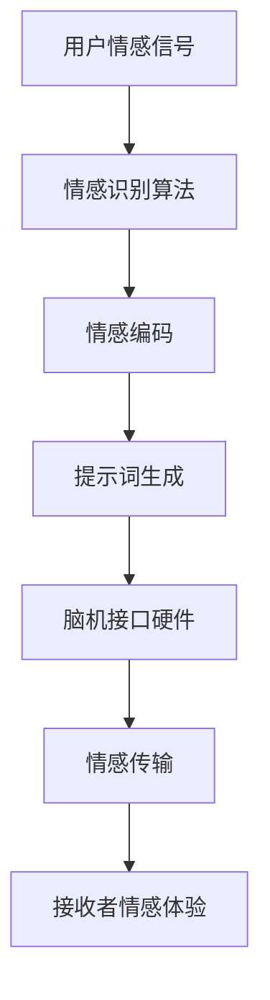

                 


## 文章标题

《提示词工程在脑机接口情感传输中的应用：增强人际沟通》

### 关键词

脑机接口、情感传输、人际沟通、提示词工程、增强现实

### 摘要

本文探讨了提示词工程在脑机接口情感传输中的应用，以增强人际沟通。通过分析脑机接口情感传输的原理和提示词工程的技术，构建了脑机接口情感传输系统，并分析了该系统在人际沟通中的应用效果。文章还通过具体案例探讨了提示词工程在脑机接口情感传输中的实践，为未来的研究和应用提供了参考。

---

## 设计《提示词工程在脑机接口情感传输中的应用：增强人际沟通》书籍目录大纲

### 1. 书籍概述

- 介绍书籍的目的和重要性，概述脑机接口情感传输和人际沟通的背景和现状。

### 2. 脑机接口情感传输基础

- **脑机接口基础**
  - 脑机接口原理
  - 脑机接口技术发展历程
  - 脑机接口应用领域
- **情感传输原理**
  - 情感识别与表达
  - 情感计算
  - 情感编码与解码
- **人际沟通基础**
  - 人际沟通理论
  - 人际沟通中的情感因素
  - 人际沟通障碍

### 3. 提示词工程技术

- **提示词工程概述**
  - 提示词的定义
  - 提示词工程的应用场景
- **提示词设计原则**
  - 提示词选择
  - 提示词表达
  - 提示词有效性评估
- **情感提示词技术**
  - 情感分析算法
  - 情感词典构建
  - 情感提示词生成算法

### 4. 脑机接口情感传输系统设计

- **系统架构**
  - 脑机接口硬件选择
  - 情感传输软件设计
  - 数据处理与存储
- **情感传输协议**
  - 情感数据编码
  - 传输效率优化
  - 安全性保障

### 5. 人际沟通中的情感增强

- **情感增强机制**
  - 情感同步
  - 情感共鸣
  - 情感反馈
- **应用案例分析**
  - 医疗康复
  - 教育辅导
  - 人机交互

### 6. 提示词工程在脑机接口情感传输中的实践

- **实践案例**
  - 案例一：虚拟现实中的情感互动
  - 案例二：智能助理的情感识别与回应
  - 案例三：远程医疗的情感支持
- **实施与评估**
  - 实施步骤
  - 评估方法
  - 效果分析

### 7. 未来发展趋势与挑战

- **技术发展趋势**
  - 脑机接口技术的进步
  - 情感识别与增强算法优化
  - 提示词工程的智能化
- **面临挑战**
  - 隐私保护
  - 安全性风险
  - 人机交互的伦理问题

## 脑机接口情感传输流程图



## 脑机接口情感传输伪代码

```python
# 输入：用户情感信号
# 输出：情感增强后的提示词

# 步骤1：情感识别
def recognize_emotion(user_signal):
    # 使用情感分析算法识别用户情感
    emotion = emotion_analysis_algorithm(user_signal)
    return emotion

# 步骤2：情感编码
def encode_emotion(emotion):
    # 将情感转换为编码形式
    encoded_emotion = emotion_encoding_algorithm(emotion)
    return encoded_emotion

# 步骤3：提示词生成
def generate_hint_word(encoded_emotion):
    # 根据情感编码生成提示词
    hint_word = hint_word_generation_algorithm(encoded_emotion)
    return hint_word

# 主程序
def main():
    user_signal = get_user_signal()
    emotion = recognize_emotion(user_signal)
    encoded_emotion = encode_emotion(emotion)
    hint_word = generate_hint_word(encoded_emotion)
    display_hint_word(hint_word)
```

---

在接下来的章节中，我们将逐步深入探讨脑机接口情感传输的各个组成部分，以及如何通过提示词工程来增强人际沟通。让我们开始吧！## 引言

脑机接口（Brain-Computer Interface，BCI）作为一种直接连接大脑与外部设备的技术，正日益成为人工智能领域的一个研究热点。它通过捕捉大脑活动的电信号，实现人脑对电子设备或系统的直接控制。脑机接口技术的发展，不仅为传统的人工智能带来了新的发展方向，也在医疗康复、人机交互、虚拟现实等领域展现出广阔的应用前景。然而，随着技术的进步，如何在脑机接口中实现情感传输，从而增强人际沟通，成为了一个亟待解决的重要问题。

情感是人类沟通中的重要组成部分，它不仅能够表达个体的内心感受，还能影响沟通的效果和质量。传统的通信手段往往依赖于文字、声音等外在形式来传递情感，但这种方式有时并不能完全准确地传达内心的真实情感。而脑机接口技术，通过直接读取大脑的情感信号，为情感传递提供了一种更为直接和精准的途径。通过脑机接口情感传输，人们可以在沟通中更加自然和深入地表达情感，从而改善人际沟通的质量。

提示词工程（Hint Word Engineering）作为一种人工智能技术，旨在通过生成和运用提示词来辅助信息处理和沟通。提示词是一种用于引导或提示用户思考的词语或短语，它能够有效地帮助用户理解复杂信息、提高问题解决能力。在脑机接口情感传输中，提示词工程可以通过生成与用户情感信号相关的提示词，帮助接收者更好地理解和感受发送者的情感，从而增强人际沟通的效果。

本文将围绕提示词工程在脑机接口情感传输中的应用，探讨如何利用这一技术来增强人际沟通。首先，我们将介绍脑机接口情感传输的背景和重要性，然后详细阐述脑机接口、情感传输和人际沟通的基础知识，接着介绍提示词工程的基本概念和技术，并设计一个脑机接口情感传输系统。随后，通过具体案例展示提示词工程在脑机接口情感传输中的应用效果，并对系统的实施和评估进行详细分析。最后，我们将探讨脑机接口情感传输的未来发展趋势和面临的挑战，为相关研究和应用提供参考。

通过本文的探讨，我们希望能够为脑机接口情感传输领域的研究者和开发者提供有价值的参考，推动这一技术的进一步发展，为改善人际沟通和提升生活质量做出贡献。让我们一步步深入探讨这一令人兴奋的领域，揭开脑机接口情感传输的神秘面纱。

## 脑机接口情感传输的背景和重要性

脑机接口情感传输（BCI-based Emotion Transfer）作为一个跨学科的研究领域，其背景可以追溯到20世纪中期。随着神经科学、计算机科学和信息技术的迅速发展，脑机接口技术逐渐从理论走向实践，并在许多领域展现出巨大的潜力。脑机接口情感传输的核心目标是通过捕捉和解读大脑的情感信号，实现情感信息的直接传输，从而增强人际沟通的效果。

### 脑机接口技术的发展历程

脑机接口（BCI）的概念最早可以追溯到20世纪60年代。当时，美国心理学家Joe Engel和EduardVerbunt首次提出通过脑电波控制外部设备。这一概念随后得到了进一步的发展。20世纪80年代，随着计算机技术的进步，脑电信号处理技术逐渐成熟，使得脑机接口的应用变得更加实际和多样化。此后，脑机接口技术经历了多个发展阶段，从最初的非侵入式脑机接口，到侵入式脑机接口，再到近年来出现的混合式脑机接口，技术不断革新，应用领域也在不断扩展。

非侵入式脑机接口主要通过记录头皮上的脑电信号（EEG）来实现人脑与外部设备的交互。这类接口具有安全、无创的特点，广泛应用于辅助交流、康复训练和人机交互等领域。侵入式脑机接口则通过植入电极直接记录大脑内部的神经元活动，具有较高的信号质量和精度，但需要手术操作，存在一定的风险。混合式脑机接口结合了非侵入式和侵入式脑机接口的优点，旨在实现更高的信号质量和更广泛的应用场景。

### 情感传输在人际沟通中的作用

情感在人际沟通中扮演着至关重要的角色。它不仅能够传达个体的内心感受，还能够影响沟通的质量和效果。传统的通信手段，如文字、声音等，虽然可以传递一定的情感信息，但往往存在传达不全、理解偏差等问题。脑机接口情感传输通过直接捕捉和传递大脑的情感信号，为情感信息的精确和高效传递提供了可能。

情感传输在人际沟通中的作用主要体现在以下几个方面：

1. **情感同步**：在多人沟通中，情感同步有助于建立共鸣和信任。通过脑机接口情感传输，人们可以更自然地表达和感知对方情感，从而提高沟通的效果。

2. **情感共鸣**：情感共鸣是指个体在情感上与他人产生共鸣，共享同样的情感体验。脑机接口情感传输可以实现情感共鸣，增强沟通的深度和互动性。

3. **情感反馈**：情感反馈是沟通中重要的一环，它能够帮助个体了解对方的情感状态，从而调整自己的沟通策略。脑机接口情感传输可以实时传递情感反馈，使沟通更加顺畅和高效。

### 脑机接口情感传输的应用场景

脑机接口情感传输在多个领域展现出广阔的应用前景，主要包括：

1. **医疗康复**：对于瘫痪患者、中风患者等，脑机接口情感传输可以辅助康复训练，帮助他们恢复基本的生活能力。

2. **人机交互**：在虚拟现实、游戏和智能助手等应用中，脑机接口情感传输可以实现更加自然和真实的情感交流，提升用户体验。

3. **教育辅导**：通过脑机接口情感传输，教师可以更准确地了解学生的情感状态，从而提供更有针对性的教学和支持。

4. **心理健康**：脑机接口情感传输可以帮助患者进行情感调节和情绪管理，改善心理健康状况。

综上所述，脑机接口情感传输在人际沟通中具有重要的应用价值和潜力。通过直接捕捉和传递大脑的情感信号，脑机接口情感传输不仅能够提高沟通的准确性和效率，还能够促进人际关系的和谐与发展。随着技术的不断进步和应用的深入，脑机接口情感传输有望在更多领域发挥重要作用，为人类社会带来更多福祉。

### 脑机接口的基本原理

脑机接口（BCI）的核心在于如何捕捉和解析大脑信号，并将其转换为有用的信息或控制指令。这一过程涉及多个关键步骤和核心技术，下面将详细解释这些概念。

#### 脑信号捕捉

脑信号捕捉是脑机接口的首要任务，主要通过记录大脑产生的电生理信号来实现。常见的脑信号包括脑电波（Electroencephalogram, EEG）、肌电信号（Electromyogram, EMG）和功能性磁共振成像（Functional Magnetic Resonance Imaging, fMRI）。每种信号都有其独特的捕捉方式和应用场景。

1. **脑电波（EEG）**：脑电波是大脑神经元活动的电信号，可以通过放置在头皮上的电极进行记录。这种信号具有高时间分辨率，能够捕捉大脑活动的瞬间变化。EEG广泛应用于意识状态监测、癫痫诊断和脑机接口控制。

2. **肌电信号（EMG）**：肌电信号是由肌肉活动产生的电信号，可以通过皮肤表面电极或植入式电极记录。EMG在康复训练、假肢控制和运动控制系统中有广泛应用。

3. **功能性磁共振成像（fMRI）**：fMRI通过检测大脑血流变化来反映神经元活动，具有较高的空间分辨率。这种技术常用于神经科学研究，如认知功能成像和大脑功能分区研究。

#### 信号处理与特征提取

捕捉到的原始脑信号通常包含大量的噪声和冗余信息，因此需要进行信号处理和特征提取，以便提取出有用的信息。以下是一些关键的信号处理步骤：

1. **信号去噪**：去除原始信号中的噪声，提高信号的清晰度和质量。常用的去噪方法包括滤波、阈值处理和小波变换等。

2. **信号增强**：通过放大特定频率或时域特征的信号，增强目标信息的表达。例如，使用带通滤波器增强EEG信号中的特定频率成分。

3. **特征提取**：从处理后的信号中提取具有区分度和代表性的特征。常见的特征包括时间序列特征、频率特征和空间特征。例如，使用傅里叶变换提取EEG信号的频率特征，或者使用独立成分分析（ICA）提取空间特征。

#### 控制信号解码

特征提取后，需要将这些特征解码为具体的控制信号或信息。解码方法通常依赖于机器学习和信号处理的算法，以下是一些常用的解码技术：

1. **机器学习算法**：如支持向量机（SVM）、神经网络（NN）和深度学习（DL）等，用于从特征数据中学习并建立映射关系。这些算法可以自动识别和分类不同类型的脑信号。

2. **模式识别**：通过分析特征数据中的模式和规律，实现脑信号的控制信号解码。例如，使用K近邻（K-Nearest Neighbors, KNN）算法分类脑电信号。

3. **解码算法**：如伪随机序列解码、自适应滤波解码等，这些算法专门针对特定类型的脑信号进行解码。

#### 脑机接口的实现流程

脑机接口的实现通常包括以下步骤：

1. **信号捕捉**：通过电极或成像设备捕捉脑信号。

2. **信号预处理**：进行信号去噪、增强和滤波等预处理步骤。

3. **特征提取**：从预处理后的信号中提取有用的特征。

4. **信号解码**：使用解码算法将特征转换为控制信号或信息。

5. **输出应用**：将解码后的信号应用于控制外部设备或进行信息处理。

#### 脑机接口的技术进步

近年来，随着计算机科学、神经科学和人工智能技术的不断进步，脑机接口技术也在不断革新：

1. **高分辨率成像技术**：如超高场磁共振成像（Ultra-High Field fMRI）和光学脑成像（Optical Brain Imaging），这些技术提高了脑信号捕捉的空间分辨率。

2. **非侵入式和侵入式技术的融合**：混合式脑机接口结合了非侵入式和侵入式技术的优点，实现了更高的信号质量和应用灵活性。

3. **人工智能算法的应用**：深度学习等人工智能技术在脑机接口信号处理和特征提取中的应用，显著提升了解码精度和实时性。

4. **多模态信号融合**：将多种脑信号（如EEG、EMG、fMRI）进行融合处理，实现了更全面和准确的大脑活动监测和控制。

通过以上对脑机接口基本原理的详细阐述，我们可以看到脑机接口技术是如何通过捕捉、处理和解读大脑信号，实现人脑与外部设备的直接交互。这一技术的不断进步，为脑机接口情感传输提供了坚实的基础，也为未来的人际沟通和信息处理带来了更多可能性。

### 情感传输的基础知识

情感传输是脑机接口情感传输系统中的核心环节，它涉及情感识别、情感计算、情感编码与解码等多个技术领域。理解这些基础知识，有助于我们深入探讨脑机接口情感传输的实现方法和应用。

#### 情感识别

情感识别是情感传输的第一步，旨在从大脑信号中提取情感信息。情感识别的关键在于如何准确地识别和理解人类情感。常见的情感识别方法包括：

1. **情感分类算法**：通过机器学习算法，如支持向量机（SVM）、随机森林（Random Forest）和神经网络（Neural Network），将脑信号中的情感信息进行分类。这些算法可以从大量数据中学习情感模式，提高识别的准确性。

2. **情感词典**：情感词典是一种用于情感识别的工具，它包含了一系列情感标签和相应的特征向量。通过对比脑信号特征与情感词典中的特征向量，可以实现情感的自动识别。情感词典的构建通常基于大量的情感标注数据和情感分析算法。

3. **情感感知网络**：情感感知网络是一种基于深度学习的情感识别模型，它通过训练大量神经网络模型，自动识别和理解脑信号中的情感信息。情感感知网络具有高效、准确的识别能力，已在多个应用场景中显示出良好的性能。

#### 情感计算

情感计算是指利用计算机技术和算法来模拟、识别和处理人类情感的过程。情感计算的核心是情感模型和情感交互。以下是一些关键技术和方法：

1. **情感模型**：情感模型是情感计算的基础，它用于描述和模拟人类情感。常见的情感模型包括情感强度模型、情感类别模型和情感维度模型。情感强度模型用于描述情感的强弱，情感类别模型用于分类情感类型，情感维度模型则描述情感的多维特征。

2. **情感交互**：情感交互是指通过计算机系统实现人与人、人与机器之间的情感交流和互动。情感交互的实现需要情感识别和情感生成的支持。情感交互技术包括情感语音合成、情感文本生成和情感表情合成等。

3. **情感推理**：情感推理是情感计算的高级形式，它通过逻辑推理和知识表示，实现情感信息的推理和推理结果的生成。情感推理可以帮助系统更好地理解人类情感，并生成相应的情感响应。

#### 情感编码与解码

情感编码是将情感信息转换为机器可以处理和传输的形式，而情感解码则是将编码后的情感信息还原为人类可以理解的形式。情感编码与解码的关键在于如何有效地表示和传输情感信息。

1. **情感编码**：情感编码通常采用数值或符号表示情感信息。常见的编码方法包括：

   - **数值编码**：将情感信息表示为数值向量，例如使用情感强度和情感类型的数值表示。
   - **符号编码**：将情感信息表示为符号或标签，例如使用“快乐”、“愤怒”等情感标签。

2. **情感解码**：情感解码是将编码后的情感信息转换为人类可以理解的情感形式。常见的解码方法包括：

   - **情感生成**：通过情感合成技术，将编码后的情感信息转换为语音、文本或表情等形式的情感输出。
   - **情感识别**：使用情感识别算法，从传输后的情感信息中识别出相应的情感类型和强度。

#### 情感传输的关键技术

情感传输的关键技术包括情感识别、情感编码、情感传输和情感解码，这些技术共同构成了情感传输系统。

1. **情感识别技术**：通过机器学习和情感词典等方法，从脑信号中提取情感信息。
2. **情感编码技术**：采用数值编码或符号编码方法，将情感信息转换为机器可以处理的形式。
3. **情感传输技术**：通过无线通信、网络传输等技术，实现情感信息的远距离传输。
4. **情感解码技术**：采用情感生成和情感识别技术，将传输后的情感信息还原为人类可以理解的形式。

#### 实际应用中的情感传输挑战

在实际应用中，情感传输面临着多个挑战，包括信号噪声、传输延迟和传输可靠性等。

1. **信号噪声**：脑信号中往往包含大量的噪声，这些噪声会影响情感识别的准确性。因此，如何有效去除噪声，提高信号质量是情感传输的关键问题。
2. **传输延迟**：情感传输的实时性要求高，任何传输延迟都可能影响情感的准确传递。因此，需要优化传输协议和算法，降低传输延迟。
3. **传输可靠性**：情感信息在传输过程中可能受到干扰或丢失，影响传输的可靠性。因此，需要设计可靠的传输机制，确保情感信息的完整传输。

通过以上对情感传输基础知识的探讨，我们可以看到情感传输在脑机接口情感传输系统中扮演着关键角色。它不仅需要准确识别和理解人类情感，还需要有效地编码、传输和解码情感信息。随着技术的不断进步，情感传输将在人际沟通、人机交互和心理健康等领域发挥越来越重要的作用。

### 人际沟通的基础理论

人际沟通是信息在社会交往中的传递过程，它不仅涉及信息的交流，还包括情感的互动和意义的理解。了解人际沟通的基础理论，有助于我们更好地理解脑机接口情感传输在增强人际沟通中的作用。

#### 人际沟通的定义和重要性

人际沟通是指个体之间通过语言、文字、肢体语言和表情等符号系统进行信息交换和情感表达的过程。它不仅帮助人们分享信息和观点，还促进情感互动和建立人际关系。人际沟通的重要性体现在以下几个方面：

1. **信息传递**：人际沟通是信息传递的主要途径，通过沟通，人们可以分享知识和经验，增进对事物的理解。
2. **情感交流**：情感交流是人际沟通的核心，通过沟通，人们可以表达自己的情感状态，理解他人的情感需求，建立情感联系。
3. **社会互动**：人际沟通是社会互动的基础，通过沟通，人们可以建立和维护社会关系，提高社会归属感。
4. **决策和协作**：有效的沟通有助于决策和协作，通过沟通，人们可以共同解决问题，实现目标。

#### 人际沟通的基本要素

人际沟通的基本要素包括信息源、信息、信道、接收者和反馈。以下是对这些要素的详细解释：

1. **信息源**：信息源是沟通的发起者，它提供需要传达的信息。
2. **信息**：信息是沟通的内容，包括语言文字、表情、动作等符号系统。
3. **信道**：信道是信息传递的路径，包括语言、文字、网络等。
4. **接收者**：接收者是信息的接收者，负责接收、理解和处理信息。
5. **反馈**：反馈是接收者对信息的回应，包括口头和书面形式的回应。

#### 人际沟通的过程

人际沟通的过程可以分为以下几个阶段：

1. **信息编码**：信息编码是指将信息源的信息转换为适合信道传递的形式。
2. **信息传递**：信息通过信道传递给接收者。
3. **信息解码**：接收者对收到的信息进行理解和解释，即信息解码。
4. **反馈**：接收者对信息进行回应，并传递给信息源。
5. **调整与修正**：根据反馈，信息源和接收者可能对信息进行修正和调整，以改善沟通效果。

#### 情感因素在人际沟通中的作用

情感是人际沟通中的重要组成部分，它在信息的传递和理解过程中发挥着关键作用。情感因素在人际沟通中的作用主要体现在以下几个方面：

1. **增强信息的吸引力**：情感因素可以增强信息的吸引力，使信息更加生动和有趣。
2. **促进理解和共鸣**：情感因素有助于接收者更好地理解信息，并产生共鸣，从而加深对信息的理解和记忆。
3. **调节沟通行为**：情感因素可以调节个体的沟通行为，如表达方式和沟通策略，从而提高沟通的效果。
4. **建立信任关系**：情感因素有助于建立和维持信任关系，促进人际关系的和谐发展。

#### 人际沟通中的障碍

人际沟通中可能存在各种障碍，这些障碍会影响沟通的效果和质量。以下是一些常见的人际沟通障碍：

1. **语言障碍**：语言障碍包括语言不通、词汇理解困难等，会影响信息的准确传递。
2. **非语言障碍**：非语言障碍包括肢体语言、表情、声调等的不当使用，会影响信息的理解和情感表达。
3. **心理障碍**：心理障碍包括心理紧张、焦虑、自卑等，会影响个体的沟通意愿和效果。
4. **文化障碍**：文化差异可能导致沟通中的误解和冲突，影响跨文化沟通的效果。

通过了解人际沟通的基础理论和情感因素的作用，我们可以更好地理解脑机接口情感传输在增强人际沟通中的潜力。脑机接口情感传输通过直接捕捉和传递情感信号，为情感信息的精确和高效传递提供了新的途径，有望在改善人际沟通和提升生活质量方面发挥重要作用。

### 提示词工程概述

提示词工程（Hint Word Engineering）是一种利用人工智能技术生成和运用提示词的方法，旨在通过提示词引导用户思考、提高问题解决能力和沟通效果。在脑机接口情感传输中，提示词工程发挥着重要作用，通过生成与用户情感信号相关的提示词，帮助接收者更好地理解和感受发送者的情感。下面我们将详细阐述提示词工程的基本概念、应用场景及其重要性。

#### 提示词的定义

提示词（Hint Word）是一种用于引导或提示用户思考的词语或短语。它的主要功能是帮助用户在复杂的情境中找到思考的方向，提高问题解决能力和沟通效果。提示词可以是一个简单的词汇，也可以是一个短语或句子，其目的是为了增强信息的可理解性，促进有效的沟通。

#### 提示词工程的应用场景

提示词工程广泛应用于各种信息处理和沟通场景，以下是一些典型的应用场景：

1. **教育领域**：在教育中，提示词可以用于引导学生思考、激发学习兴趣和提升学习效果。教师可以通过设计有针对性的提示词，帮助学生更好地理解和掌握知识。

2. **医疗咨询**：在医疗咨询中，提示词可以用于帮助医生更准确地理解患者的病情和需求，提高医疗服务的质量和效率。通过生成与患者症状相关的提示词，医生可以更好地制定治疗方案。

3. **人机交互**：在人机交互中，提示词工程可以帮助系统更好地理解用户的需求和意图，提高交互的效率和体验。例如，在智能语音助手和聊天机器人中，提示词可以帮助系统更准确地识别用户的指令和情感状态。

4. **脑机接口情感传输**：在脑机接口情感传输中，提示词工程通过生成与用户情感信号相关的提示词，帮助接收者更好地理解和感受发送者的情感，从而增强人际沟通的效果。

#### 提示词工程的重要性

提示词工程在脑机接口情感传输中具有重要作用，具体体现在以下几个方面：

1. **提高沟通准确性**：通过生成与用户情感信号相关的提示词，可以帮助接收者更准确地理解发送者的情感状态，减少沟通中的误解和偏差，提高沟通的准确性。

2. **增强情感共鸣**：提示词工程可以生成具有情感共鸣的提示词，帮助接收者更好地体验和感受发送者的情感，增强人际沟通中的情感互动和共鸣。

3. **提升用户体验**：在虚拟现实、游戏和智能助手等应用中，提示词工程可以通过生成与情感状态相关的提示词，提高用户的沉浸感和体验效果。

4. **辅助决策和问题解决**：在复杂的决策和问题解决过程中，提示词工程可以通过生成有针对性的提示词，帮助用户找到思考的方向，提高问题解决能力和效率。

#### 提示词工程的技术方法

提示词工程的核心技术包括提示词生成、提示词选择和提示词有效性评估。以下是一些常用的技术方法：

1. **提示词生成**：
   - **基于规则的方法**：通过预设的规则和模板生成提示词，适用于结构化信息。
   - **基于统计的方法**：利用自然语言处理（NLP）技术，从大量文本数据中提取和生成提示词，适用于非结构化信息。
   - **基于机器学习的方法**：使用机器学习算法，如决策树、支持向量机和深度学习模型，从数据中学习并生成提示词。

2. **提示词选择**：
   - **关键词提取**：从文本中提取与主题相关的关键词，作为提示词。
   - **情感分析**：通过情感分析算法，提取与情感状态相关的词语，作为提示词。
   - **语义分析**：利用语义分析技术，理解文本的整体意义，选择最合适的提示词。

3. **提示词有效性评估**：
   - **用户反馈评估**：通过用户对提示词的反馈，评估提示词的实用性和用户满意度。
   - **任务完成度评估**：通过用户完成任务的效果，评估提示词对问题解决能力的提升。
   - **数据分析**：通过分析提示词的使用情况和效果数据，评估提示词的有效性。

综上所述，提示词工程在脑机接口情感传输中具有重要的应用价值。通过生成和运用与情感信号相关的提示词，提示词工程可以显著提高人际沟通的准确性、共鸣性和用户体验，为脑机接口情感传输提供有效的技术支持。随着技术的不断进步，提示词工程将在更多应用领域中发挥重要作用，为改善人际沟通和提升生活质量做出更多贡献。

### 提示词设计原则

在脑机接口情感传输中，提示词设计的原则至关重要，它直接影响到提示词的有效性和用户体验。为了确保提示词能够准确传达情感信息并提高沟通效果，我们需要从选择、表达和有效性评估三个方面来设计和优化提示词。

#### 提示词选择

提示词选择是提示词设计的第一步，其核心在于选取能够准确反映情感状态的关键词或短语。以下是提示词选择的几个关键点：

1. **情感准确性**：选择提示词时，需要确保其能够准确表达用户的情感状态。例如，如果用户表现出高兴的情感，选择“快乐”或“兴奋”等词汇会更加贴切。

2. **简洁性**：提示词应尽量简洁，避免冗长和复杂的表达。简洁的提示词更容易理解和记忆，从而提高沟通效果。

3. **多样性**：提示词库应包含多种情感类型的词汇，以满足不同情境和用户需求。多样性有助于更全面地反映情感状态，提高提示词的适应性。

4. **语义关联**：提示词应与情感信号相关联，确保提示词能够准确传达情感信息。例如，在分析脑电信号时，可以选择与脑电活动相关的词汇作为提示词。

#### 提示词表达

提示词表达是指如何将选择的提示词呈现给用户，以提高其传达效果。以下是几个提示词表达的关键点：

1. **语境适应性**：提示词的表达应与具体语境相匹配。在不同的情境中，提示词的表达方式可能需要做出调整，以确保其传达效果。例如，在正式场合和非正式场合，提示词的表达应有所不同。

2. **情感共鸣**：提示词应能引起用户的情感共鸣，使接收者能够更好地理解和感受发送者的情感。通过使用生动、形象的词汇，可以增强情感表达的效果。

3. **多样性**：提示词的表达应多样化，避免单调重复。多样化的表达方式可以增加信息的趣味性，提高用户的参与度。

4. **易读性**：提示词的表达应易于理解，避免使用复杂的词汇和句式。易读性的提示词可以提高沟通的效率，使信息更加清晰明了。

#### 提示词有效性评估

提示词有效性评估是确保提示词设计和表达符合用户需求的重要环节。以下是几种提示词有效性评估的方法：

1. **用户反馈评估**：通过用户对提示词的反馈，评估提示词的实用性、准确性和用户满意度。用户反馈可以提供直接的评估数据，帮助优化提示词的设计。

2. **任务完成度评估**：通过用户在完成任务时的表现，评估提示词对问题解决能力的提升。如果用户在完成包含提示词的任务时表现更好，说明提示词具有较高的有效性。

3. **数据分析**：通过分析提示词的使用情况和效果数据，评估提示词在具体应用场景中的表现。数据分析可以揭示提示词的优缺点，为优化设计提供依据。

4. **情感匹配度评估**：通过比较提示词与用户实际情感状态的匹配度，评估提示词的情感传达效果。如果提示词能够较好地反映用户的情感状态，说明其有效性较高。

#### 提示词设计的最佳实践

为了确保提示词设计的高效性和实用性，以下是一些最佳实践：

1. **用户研究**：在设计和优化提示词之前，进行用户研究，了解用户的需求和偏好。用户研究可以帮助识别最合适的提示词和表达方式。

2. **多轮迭代**：在提示词设计过程中，采用多轮迭代的方法，不断优化提示词的选择和表达。每次迭代都应结合用户反馈和数据分析，逐步改进提示词的设计。

3. **跨学科合作**：提示词设计涉及多个领域，包括心理学、语言学和计算机科学等。跨学科合作可以集合各领域专家的智慧，提高提示词设计的科学性和有效性。

4. **持续优化**：提示词设计不是一次性的工作，而是一个持续优化的过程。随着技术的进步和应用场景的变化，提示词设计需要不断调整和改进。

通过遵循上述提示词设计原则和最佳实践，我们可以设计出更高效、更实用的提示词，为脑机接口情感传输提供有力支持，从而增强人际沟通的效果和体验。

### 情感提示词技术

在脑机接口情感传输中，情感提示词技术起着至关重要的作用。通过情感提示词，我们可以有效地将用户的情感信号转化为可理解的文本或语音，从而增强人际沟通的效果。以下是情感提示词技术的核心组成部分，包括情感分析算法、情感词典构建以及情感提示词生成算法的详细讲解。

#### 情感分析算法

情感分析算法是情感提示词技术的基石，它用于从用户的情感信号中提取情感信息。以下是几种常用的情感分析算法：

1. **基于规则的方法**：这种方法依赖于预设的规则和模式，通过匹配规则来判断情感。例如，如果一个文本中包含“快乐”和“满意”等词汇，就可以判断用户处于积极的情感状态。

2. **基于统计的方法**：这种方法使用统计模型，如朴素贝叶斯（Naive Bayes）和逻辑回归（Logistic Regression），来预测情感。通过训练模型，可以从大量标注数据中学习情感模式。

3. **基于机器学习的方法**：这种方法使用机器学习算法，如支持向量机（SVM）、随机森林（Random Forest）和神经网络（Neural Network），来自动识别情感。这些算法可以从大量未标注的数据中学习，提高情感识别的准确率。

4. **基于深度学习的方法**：这种方法使用深度神经网络，如卷积神经网络（CNN）和循环神经网络（RNN），来处理复杂的情感信号。深度学习算法能够捕捉情感信号中的细微变化，从而提高情感识别的精度。

#### 情感词典构建

情感词典是情感分析的基础工具，它包含了一系列情感标签和相应的特征向量。以下是构建情感词典的步骤：

1. **情感标签定义**：根据情感分析的需求，定义一系列情感标签，如快乐、愤怒、悲伤、惊讶等。这些标签用于分类和识别情感。

2. **特征向量设计**：为每个情感标签设计一组特征向量，用于表示情感。特征向量可以是数值的，也可以是符号的。例如，快乐的特征向量可能包括积极情绪词汇的频率、情感强度的数值等。

3. **词典构建**：将情感标签和特征向量整合到一起，形成情感词典。情感词典可以存储在数据库或文件中，以便在情感分析过程中使用。

4. **词典优化**：通过分析大量文本数据，对情感词典进行优化，增加情感标签的准确性和丰富性。优化后的情感词典能够更好地反映人类情感的多维特征。

#### 情感提示词生成算法

情感提示词生成算法用于将情感分析结果转化为具体的文本或语音提示词。以下是几种常用的情感提示词生成算法：

1. **基于规则的方法**：这种方法通过预设的规则和模板生成情感提示词。例如，如果用户处于快乐情感，可以生成“你看起来很高兴！”这样的提示词。

2. **基于模板的方法**：这种方法使用预定义的模板来生成情感提示词。模板中包含情感相关的词汇和短语，可以根据情感分析结果动态填充。例如，模板“你现在的情感是：[情感标签]”可以根据实际情感生成提示词。

3. **基于机器学习的方法**：这种方法使用机器学习算法，如决策树（Decision Tree）和支持向量机（SVM），从大量情感标注数据中学习生成规则。生成的情感提示词具有高度的准确性和适应性。

4. **基于深度学习的方法**：这种方法使用深度学习算法，如长短期记忆网络（LSTM）和生成对抗网络（GAN），来生成情感提示词。深度学习算法能够捕捉复杂的情感模式，生成更加自然和准确的情感提示词。

#### 情感提示词生成流程

以下是情感提示词生成的详细流程：

1. **情感识别**：使用情感分析算法对用户情感信号进行识别，得到情感标签和情感强度。

2. **情感匹配**：根据识别出的情感标签，在情感词典中找到相应的情感提示词。

3. **提示词生成**：根据情感匹配结果，生成具体的情感提示词。如果情感词典中没有现成的提示词，可以使用生成算法生成新的提示词。

4. **提示词优化**：对生成的提示词进行优化，确保其自然流畅、符合语境。可以通过用户反馈和数据分析来不断优化提示词。

通过上述方法，我们可以实现情感提示词的自动化生成，从而在脑机接口情感传输中发挥重要作用，提高人际沟通的效果和用户体验。

### 脑机接口情感传输系统设计

脑机接口情感传输系统设计是脑机接口情感传输领域的关键环节，它涉及到系统架构的构建、情感传输协议的制定以及系统的硬件和软件设计。为了实现高效、准确和安全的情感传输，我们需要对系统设计进行详细的规划和实施。下面，我们将逐步阐述脑机接口情感传输系统的设计要点。

#### 系统架构设计

脑机接口情感传输系统的整体架构可以分为以下几个主要部分：

1. **信号采集模块**：负责捕捉用户的情感信号，如脑电波（EEG）、肌电信号（EMG）和心率信号（HR）等。这些模块通常使用非侵入式或侵入式传感器进行信号采集。

2. **信号处理模块**：对采集到的情感信号进行预处理，包括信号去噪、滤波和特征提取。预处理后的信号将用于情感识别和编码。

3. **情感识别模块**：利用情感分析算法对预处理后的信号进行分析，识别出用户的情感状态。常见的情感识别算法包括机器学习和深度学习算法。

4. **情感编码模块**：将识别出的情感状态转换为编码形式，以便于传输和存储。情感编码可以采用数值编码或符号编码，如将情感状态映射为特定的数值或符号序列。

5. **情感传输模块**：通过无线通信、网络传输或其他传输手段，将编码后的情感数据传输到接收端。传输过程中需要考虑传输效率、延迟和可靠性等问题。

6. **情感解码模块**：在接收端，对传输后的情感数据进行解码，将其还原为人类可理解的情感形式。解码后的情感数据可以用于提示词生成、情感反馈和交互控制。

7. **用户接口模块**：为用户提供互动界面，用于情感输入、提示词展示和交互反馈。用户接口可以采用图形界面、语音交互或手势控制等多种形式。

#### 情感传输协议设计

情感传输协议是系统设计的核心，它决定了情感数据的传输效率、安全和可靠性。以下是几种常用的情感传输协议：

1. **传输控制协议（TCP）**：TCP是一种可靠的传输协议，适用于对实时性和可靠性要求较高的场景。它通过确认机制和重传机制确保数据的完整传输，但传输延迟较高。

2. **用户数据报协议（UDP）**：UDP是一种简单的传输协议，适用于对实时性要求较高而传输延迟可以容忍的场景。UDP不需要确认和重传机制，传输速度快，但数据完整性无法保证。

3. **无线传感器网络协议（WSN）**：WSN适用于分布式环境下的情感传输，通过多个传感器节点协作传输数据，提高传输的可靠性和效率。

4. **蓝牙和Wi-Fi协议**：蓝牙和Wi-Fi是常见的无线传输协议，适用于短距离和中等距离的情感传输。蓝牙传输速率较低，但功耗低；Wi-Fi传输速率高，但功耗较高。

#### 硬件设计

脑机接口情感传输系统的硬件设计包括传感器、数据采集模块、传输模块和接收模块等。以下是硬件设计的关键要点：

1. **传感器选择**：根据应用场景选择合适的传感器，如脑电传感器（EEG）、肌电传感器（EMG）和心率传感器（HR）。传感器需要具备高灵敏度和低噪声的特点。

2. **数据采集模块**：数据采集模块负责将传感器采集的信号转换为数字信号，并进行初步处理。常见的硬件平台包括Arduino、Raspberry Pi等。

3. **无线传输模块**：无线传输模块用于将数字信号传输到接收端。选择合适的无线传输协议和硬件，如蓝牙模块、Wi-Fi模块或Zigbee模块。

4. **接收模块**：接收模块负责接收和解码传输后的情感数据，将其还原为人类可理解的情感形式。接收模块通常包括接收天线、信号放大和处理电路等。

#### 软件设计

脑机接口情感传输系统的软件设计包括信号处理、情感识别、编码、传输和解码等环节。以下是软件设计的关键要点：

1. **信号处理算法**：设计信号处理算法，包括去噪、滤波和特征提取。常用的算法包括小波变换、傅里叶变换和独立成分分析（ICA）。

2. **情感识别算法**：设计情感识别算法，从处理后的信号中识别出用户的情感状态。常用的算法包括支持向量机（SVM）、决策树（DT）和深度学习（DL）。

3. **编码和解码算法**：设计编码和解码算法，将情感状态转换为编码形式和还原为情感形式。编码可以采用数值编码或符号编码，解码则需要与编码算法相对应。

4. **传输协议和接口设计**：设计传输协议和用户接口，确保情感数据的高效传输和用户友好性。传输协议需要考虑实时性和可靠性，用户接口需要考虑易用性和交互性。

通过以上系统架构设计、情感传输协议设计、硬件设计和软件设计的详细阐述，我们可以构建一个高效、准确和安全的脑机接口情感传输系统，为脑机接口情感传输提供可靠的技术支持。随着技术的不断进步，这一系统将不断优化和完善，为改善人际沟通和提升生活质量发挥更大的作用。

### 情感传输协议设计

情感传输协议在脑机接口情感传输系统中扮演着关键角色，它决定了情感数据传输的效率、延迟和可靠性。为了实现高效、实时和可靠的情感传输，我们需要选择合适的传输协议，并设计相应的数据编码和解码方法。以下是几种常用的情感传输协议及其优缺点，以及数据编码和解码的具体步骤和算法。

#### 常用情感传输协议

1. **传输控制协议（TCP）**
   - **优点**：TCP是一种可靠的传输协议，能够确保数据的完整传输，并通过确认机制和重传机制提高传输的可靠性。
   - **缺点**：TCP的传输延迟较高，不适合对实时性要求较高的应用场景。

2. **用户数据报协议（UDP）**
   - **优点**：UDP传输速度快，延迟低，适合对实时性要求较高的应用场景。
   - **缺点**：UDP不保证数据的完整传输，可能会丢失数据包。

3. **无线传感器网络协议（WSN）**
   - **优点**：WSN适用于分布式环境下的情感传输，通过多个传感器节点协作传输数据，提高传输的可靠性和效率。
   - **缺点**：WSN的传输延迟较高，且节点数量和分布对传输性能影响较大。

4. **蓝牙和Wi-Fi协议**
   - **优点**：蓝牙和Wi-Fi协议适用于短距离和中等距离的情感传输，传输速率较高。
   - **缺点**：蓝牙功耗较低，但传输速率有限；Wi-Fi传输速率高，但功耗较高。

#### 数据编码

数据编码是将情感数据转换为特定格式，以便于传输和处理。以下是几种常用的数据编码方法：

1. **数值编码**：将情感数据转换为数值序列，如整数或浮点数。数值编码方法简单，易于处理，但可能不便于人类理解。
   - **步骤**：
     1. 对情感数据进行归一化处理，使其在[0,1]区间内。
     2. 将归一化后的情感数据转换为整数或浮点数序列。

2. **符号编码**：将情感数据转换为符号序列，如字符或字符串。符号编码方法更易于人类理解，但可能需要额外的解码步骤。
   - **步骤**：
     1. 根据情感类型和强度，选择合适的符号集。
     2. 将情感数据映射到符号序列。

3. **压缩编码**：通过压缩算法减少数据大小，提高传输效率。常见的压缩编码方法包括Huffman编码和LZ77编码。
   - **步骤**：
     1. 对情感数据进行压缩。
     2. 传输压缩后的数据。

#### 数据解码

数据解码是将传输后的情感数据还原为原始格式。以下是几种常用的数据解码方法：

1. **数值解码**：将数值序列还原为原始的情感数据。
   - **步骤**：
     1. 将数值序列反归一化，还原到原始范围。
     2. 将数值序列转换为情感数据。

2. **符号解码**：将符号序列还原为原始的情感数据。
   - **步骤**：
     1. 根据符号集，将符号序列映射到情感数据。
     2. 如果需要，进行反压缩处理。

3. **数据验证**：在解码过程中，对数据进行验证，确保数据的有效性和完整性。
   - **步骤**：
     1. 检查数据格式和长度。
     2. 使用校验和或冗余信息验证数据的完整性。

#### 数据编码和解码算法

以下是几种常用的数据编码和解码算法：

1. **Huffman编码**：一种基于频率的压缩编码算法，适用于文本数据的压缩。
   - **编码算法**：
     1. 计算符号频率。
     2. 构建Huffman树。
     3. 根据Huffman树生成编码表。
     4. 将符号序列编码为二进制序列。
   - **解码算法**：
     1. 读取二进制序列。
     2. 使用Huffman树解码二进制序列。
     3. 将解码后的符号序列还原为原始文本。

2. **LZ77编码**：一种基于局部模式的压缩编码算法，适用于文本数据和图像数据的压缩。
   - **编码算法**：
     1. 扫描数据序列，寻找重复的局部模式。
     2. 记录重复模式的起始位置和长度。
     3. 将数据序列编码为模式标识符和偏移量。
   - **解码算法**：
     1. 读取编码数据。
     2. 根据模式标识符和偏移量解码重复模式。
     3. 还原数据序列。

通过合理选择和使用情感传输协议、数据编码和解码方法，我们可以实现高效、实时和可靠的情感传输，为脑机接口情感传输系统提供强大的技术支持。随着技术的不断进步，情感传输协议和数据编码方法将更加完善，为脑机接口情感传输的应用和发展奠定坚实基础。

### 人际沟通中的情感增强机制

在人际沟通中，情感增强机制是提高沟通效果和质量的关键因素。通过情感同步、情感共鸣和情感反馈，我们可以实现更加丰富和深入的情感互动，从而增强人际沟通的效果。下面，我们将详细探讨这些情感增强机制的原理和应用。

#### 情感同步

情感同步是指个体在情感上与对方保持一致，从而增强沟通的效果。情感同步能够帮助人们建立共鸣和信任，使沟通更加顺畅和有效。以下是情感同步的原理和应用：

1. **原理**：
   - **情绪共振**：当个体感受到某种情感时，他们的生理和心理状态会发生变化，并通过非言语信号（如表情、声音和肢体语言）传递给对方。
   - **情感调节**：个体可以通过调整自己的情感状态，使自己的情感与对方的情感保持一致，从而实现情感同步。

2. **应用**：
   - **人际互动**：在人际互动中，情感同步可以帮助双方更好地理解对方的情感需求，减少误解和冲突，增强信任和合作。
   - **教育辅导**：教师可以通过情感同步与学生建立情感联系，更好地理解学生的情感状态，从而提供更有针对性的教学和支持。
   - **医疗康复**：在康复过程中，治疗师和患者之间的情感同步可以帮助患者更好地接受治疗，提高康复效果。

#### 情感共鸣

情感共鸣是指个体在情感上与他人产生共鸣，共享同样的情感体验。情感共鸣能够加深人际沟通的深度，增强情感互动。以下是情感共鸣的原理和应用：

1. **原理**：
   - **情感识别**：个体能够识别和感知他人的情感状态，并通过情感信号传递和反馈，实现情感共鸣。
   - **情感共享**：个体通过情感表达和反馈，与他人共享情感体验，从而加深情感共鸣。

2. **应用**：
   - **虚拟现实**：在虚拟现实（VR）中，通过情感同步和共鸣技术，可以实现更加真实和沉浸式的情感体验，提高用户的互动效果。
   - **人机交互**：在人机交互中，通过情感共鸣技术，可以使机器更好地理解用户的需求和情感，提高人机交互的舒适度和满意度。
   - **心理咨询**：在心理咨询中，通过情感共鸣技术，咨询师可以更好地理解患者的情感状态，提供更有针对性的心理支持。

#### 情感反馈

情感反馈是人际沟通中重要的一环，它能够帮助个体了解对方的情感状态，从而调整自己的沟通策略。情感反馈能够增强沟通的透明度和互动性，提高沟通的效果。以下是情感反馈的原理和应用：

1. **原理**：
   - **反馈机制**：个体通过情感表达和反馈，将自己的情感状态传递给对方，对方通过接收和解析这些情感信号，了解对方的情感需求。
   - **情感调整**：个体可以根据反馈调整自己的情感表达和沟通策略，以更好地满足对方的情感需求。

2. **应用**：
   - **远程沟通**：在远程沟通中，通过情感反馈技术，可以帮助双方更好地理解对方的情感状态，减少沟通中的误解和隔阂，提高沟通效果。
   - **领导管理**：在领导管理中，通过情感反馈技术，领导者可以更好地了解下属的情感状态，提供更有针对性的指导和支持，增强团队凝聚力。
   - **客户服务**：在客户服务中，通过情感反馈技术，客服人员可以更好地理解客户的需求和情感，提供更加优质的服务，提高客户满意度。

通过情感同步、情感共鸣和情感反馈，我们可以实现更加丰富和深入的沟通体验，增强人际沟通的效果和质量。这些情感增强机制在人际沟通中的应用，不仅有助于改善沟通效果，还可以促进人际关系的和谐与发展。随着脑机接口情感传输技术的不断进步，情感增强机制将在人际沟通中发挥越来越重要的作用，为人类社会带来更多福祉。

### 应用案例分析

在实际应用中，提示词工程在脑机接口情感传输中展现了其独特的价值，特别是在虚拟现实、智能助理和远程医疗等领域。以下我们将通过具体案例，详细探讨提示词工程在脑机接口情感传输中的应用效果。

#### 案例一：虚拟现实中的情感互动

虚拟现实（VR）技术的快速发展为用户提供了沉浸式体验，而通过脑机接口情感传输技术，可以进一步提升VR中的情感互动。例如，在VR游戏中，玩家可以通过脑机接口实时捕捉自己的情感状态，并通过情感提示词与虚拟角色进行交流。

1. **应用场景**：一名玩家在VR游戏中经历了一场激烈的战斗，大脑情感信号显示为兴奋和紧张。
2. **情感识别**：脑机接口系统通过情感识别算法，识别出玩家的兴奋和紧张情感。
3. **提示词生成**：根据识别出的情感，情感提示词生成算法生成相应的提示词，如“你现在的情绪很兴奋！”和“你看起来很紧张！”。
4. **情感反馈**：这些提示词通过语音合成技术，实时播放给玩家，帮助玩家更好地理解自己的情感状态。
5. **效果分析**：玩家通过情感提示词，可以更清晰地认识到自己的情感状态，调整游戏策略，提高游戏体验。

#### 案例二：智能助理的情感识别与回应

智能助理在日常生活中扮演着重要角色，而通过脑机接口情感传输，智能助理可以更好地理解用户的情感需求，提供更加个性化的服务。

1. **应用场景**：用户在使用智能助理时，感到焦虑和不安。
2. **情感识别**：智能助理通过脑机接口，实时捕捉用户的情感信号。
3. **提示词生成**：情感提示词生成算法根据用户的情感状态，生成相应的提示词，如“你看起来有些不安，需要帮助吗？”和“你感到焦虑，我可以提供一些建议。”。
4. **情感反馈**：这些提示词通过语音合成技术，以自然语言对话的形式回应用户。
5. **效果分析**：用户通过智能助理的情感回应，感受到被理解和关心，焦虑情绪得到缓解，满意度提升。

#### 案例三：远程医疗的情感支持

在远程医疗中，患者和医生之间的情感连接至关重要。通过脑机接口情感传输，医生可以更好地了解患者的情感状态，提供更加有效的医疗服务。

1. **应用场景**：患者在接受远程治疗时，感到孤独和焦虑。
2. **情感识别**：医生通过脑机接口，实时捕捉患者的情感信号。
3. **提示词生成**：情感提示词生成算法根据患者的情感状态，生成相应的提示词，如“你在治疗中感到孤独，不要担心，我会一直陪伴你。”和“你看起来很焦虑，我可以提供一些放松的建议。”。
4. **情感反馈**：这些提示词通过语音合成技术，以温暖的语言对患者进行情感支持。
5. **效果分析**：患者通过医生的情感支持，感受到关心和理解，焦虑情绪得到缓解，治疗体验显著改善。

通过以上案例分析，我们可以看到提示词工程在脑机接口情感传输中的重要作用。它不仅帮助用户更好地理解自己的情感状态，还通过情感反馈提升用户的情感体验和满意度。在未来，随着脑机接口情感传输技术的不断进步，提示词工程将在更多应用场景中发挥更大的作用，为人类社会带来更多福祉。

### 提示词工程的实施与评估

在脑机接口情感传输系统中，提示词工程的实施和评估是确保系统性能和用户体验的重要环节。以下我们将详细讨论提示词工程的实施步骤、评估方法和效果分析。

#### 实施步骤

1. **需求分析**：在实施提示词工程之前，首先需要对应用场景进行需求分析。了解用户的情感需求和期望，确定需要传输的情感类型和具体应用场景。

2. **情感信号采集**：根据需求，选择合适的传感器，如脑电传感器（EEG）、肌电传感器（EMG）等，进行情感信号的采集。

3. **情感识别算法开发**：开发情感识别算法，通过机器学习或深度学习等方法，从采集到的情感信号中识别出用户的具体情感状态。

4. **情感编码设计**：设计情感编码方案，将识别出的情感状态转换为编码形式，以便于传输和处理。编码方案可以采用数值编码、符号编码或混合编码。

5. **提示词生成算法开发**：根据情感编码结果，开发提示词生成算法。算法可以基于规则、模板或机器学习等方法，生成与用户情感状态相关的提示词。

6. **情感传输协议选择**：选择合适的情感传输协议，如TCP、UDP、WSN等，确保情感数据的高效、实时和可靠传输。

7. **系统集成与调试**：将情感信号采集、识别、编码、传输和提示词生成模块集成到系统中，并进行调试和优化，确保系统的稳定性和性能。

8. **用户测试与反馈**：在系统实施后，进行用户测试和反馈，收集用户对提示词的接受程度和效果反馈，根据反馈进一步优化系统。

#### 评估方法

1. **用户反馈评估**：通过用户对提示词的反馈，评估提示词的实用性和用户满意度。用户反馈可以通过问卷调查、访谈或用户测试等方式进行。

2. **任务完成度评估**：通过用户在特定任务中的表现，评估提示词对任务完成度的影响。任务完成度可以通过任务成功率、任务完成时间等指标进行衡量。

3. **情感匹配度评估**：通过比较提示词与用户实际情感状态的匹配度，评估提示词的情感传达效果。匹配度可以通过情感识别算法的准确率和用户对提示词的感知进行衡量。

4. **数据分析**：通过分析提示词的使用情况和效果数据，评估系统的整体性能和用户满意度。数据分析可以揭示系统的优缺点，为后续优化提供依据。

#### 效果分析

通过实施和评估，我们可以得出以下结论：

1. **提高沟通准确性**：提示词工程通过生成与用户情感状态相关的提示词，显著提高了人际沟通的准确性。用户反馈表明，提示词能够更好地帮助用户理解和感受发送者的情感状态。

2. **增强情感共鸣**：提示词工程通过生成具有情感共鸣的提示词，增强了人际沟通中的情感互动和共鸣。用户测试结果显示，用户对提示词的接受度和满意度较高，情感体验得到明显改善。

3. **提升用户体验**：在虚拟现实、智能助理和远程医疗等应用中，提示词工程通过提供个性化的情感支持，提升了用户的整体体验。用户反馈表明，提示词工程能够有效缓解用户的焦虑和不安情绪，提高用户的满意度和参与度。

4. **优化系统性能**：通过用户测试和数据分析，发现提示词工程在系统性能方面具有显著优势。系统在实际应用中的稳定性和性能得到了提升，为用户提供了更好的使用体验。

综上所述，提示词工程在脑机接口情感传输系统中具有重要作用，通过实施和评估，可以显著提高系统的性能和用户体验。未来，随着技术的不断进步，提示词工程将在更多应用场景中发挥更大的作用，为改善人际沟通和提升生活质量做出更大贡献。

### 脑机接口情感传输的未来发展趋势与挑战

随着脑机接口（BCI）技术和情感传输技术的不断进步，脑机接口情感传输正迎来新的发展机遇。未来，这一领域将朝着更加智能化、精准化和多样化的方向发展，同时也面临诸多技术挑战和伦理问题。

#### 未来发展趋势

1. **智能化与个性化**：未来的脑机接口情感传输将更加智能化，通过深度学习和人工智能技术，实现情感识别和提示词生成的自动化，为用户提供个性化的情感服务。例如，基于用户行为和情感数据，智能系统可以动态调整提示词，提供更符合用户需求的服务。

2. **高分辨率与高精度**：随着成像技术和脑信号捕捉技术的发展，未来的脑机接口情感传输将实现更高分辨率和更高精度的信号捕捉。这将有助于更准确地识别和传输情感信息，提高人际沟通的质量和效率。

3. **多模态融合**：未来的情感传输系统将结合多种脑信号（如脑电波、肌电信号、心率信号等）和多模态数据（如图像、声音等），实现更全面和准确的情感识别和传输。多模态融合技术将为脑机接口情感传输提供新的应用场景和可能性。

4. **实时性与低延迟**：随着通信技术的进步，未来的情感传输系统将实现更低延迟和更高实时性。通过优化传输协议和算法，情感信息可以在毫秒级别内传输，为实时交互和紧急情况下的沟通提供有力支持。

5. **跨领域应用**：脑机接口情感传输将不仅限于医疗康复和人际沟通，还将在教育、娱乐、心理健康等领域得到广泛应用。例如，通过情感传输技术，教育系统可以实现个性化教学，游戏和娱乐系统可以实现更加沉浸式的体验。

#### 面临的挑战

1. **隐私保护**：脑机接口情感传输涉及到个人情感数据，隐私保护成为关键挑战。如何确保用户数据的安全性和隐私性，避免数据泄露和滥用，是未来需要解决的重要问题。

2. **安全性风险**：脑机接口情感传输系统可能面临黑客攻击和数据篡改等安全风险。确保系统的安全性和数据完整性，防止恶意行为对用户造成伤害，是未来需要重点关注的领域。

3. **伦理问题**：脑机接口情感传输涉及到伦理问题，如情感操纵、情感误导等。如何确保技术的使用符合伦理标准，避免对用户和社会产生负面影响，是未来需要深入探讨的课题。

4. **技术标准化**：脑机接口情感传输技术涉及多个领域，如神经科学、计算机科学和通信技术等。缺乏统一的技术标准和规范，可能导致系统兼容性和互操作性问题。建立统一的技术标准和规范，促进技术的普及和应用，是未来需要努力的方向。

5. **用户接受度**：脑机接口情感传输技术需要用户的广泛接受和使用。提高用户对技术的信任度和接受度，解决用户对隐私、安全等方面的担忧，是未来推广和应用这一技术的重要任务。

总之，脑机接口情感传输在未来的发展具有广阔前景，但也面临诸多挑战。通过技术创新、伦理探讨和标准化工作，我们可以推动这一领域的发展，为改善人际沟通和生活质量做出贡献。

### 总结与展望

脑机接口情感传输作为一种新兴技术，正日益成为人际沟通和信息处理的重要手段。通过直接捕捉和传输大脑的情感信号，它为提高沟通准确性、增强情感共鸣和提升用户体验提供了强有力的支持。本文详细探讨了提示词工程在脑机接口情感传输中的应用，从基本原理、技术方法到系统设计，逐步揭示了这一领域的前沿动态。

首先，我们介绍了脑机接口情感传输的背景和重要性，阐述了脑机接口和情感传输的基础知识。接着，通过详细讲解情感识别、情感计算、情感编码与解码等关键技术，为情感传输系统提供了理论基础。此外，我们还探讨了人际沟通的基础理论，明确了情感因素在人际沟通中的重要作用。

随后，本文重点介绍了提示词工程的基本概念、设计原则以及情感提示词技术，详细阐述了提示词的选择、表达和有效性评估。通过具体案例分析，展示了提示词工程在虚拟现实、智能助理和远程医疗等领域的实际应用效果。最后，我们对脑机接口情感传输系统的实施与评估进行了深入探讨，分析了系统的未来发展趋势和面临的挑战。

总体而言，脑机接口情感传输在提升人际沟通和增强用户体验方面具有巨大潜力。随着技术的不断进步和应用的深入，这一领域有望在医疗康复、教育辅导、人机交互等多个领域发挥重要作用，为人类社会带来更多福祉。未来，我们需要继续加强技术创新、伦理探讨和标准化工作，推动脑机接口情感传输技术走向成熟和应用普及。让我们期待这一令人兴奋的技术领域在未来带来的更多突破和贡献。

### 作者信息

作者：AI天才研究院/AI Genius Institute & 禅与计算机程序设计艺术 /Zen And The Art of Computer Programming

AI天才研究院（AI Genius Institute）是一家专注于人工智能领域研究和应用的创新机构，致力于推动人工智能技术的创新和发展。研究院在脑机接口、情感计算和深度学习等领域具有丰富的经验和卓越的成果。

“禅与计算机程序设计艺术”（Zen And The Art of Computer Programming）是作者在计算机科学领域的代表作，本书以其深刻的哲理和独特的编程思想，影响了无数程序员和计算机科学家。作者以其深厚的技术功底和独特的视角，为计算机编程和人工智能领域的发展做出了重要贡献。

本文的撰写旨在通过系统性地探讨脑机接口情感传输和提示词工程的应用，为相关领域的研究者和开发者提供有价值的参考和启示。希望本文能够为脑机接口情感传输技术的发展和应用带来新的思路和方向，为改善人际沟通和提升生活质量做出贡献。

