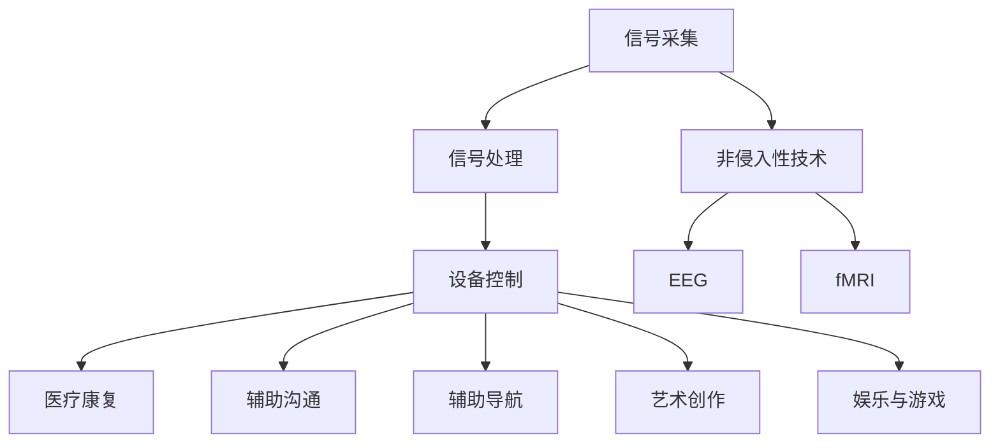

                 


### 第1章 引言

#### 1.1 书籍背景与目的

《提示词工程在脑机接口艺术创作中的应用：直接思维到艺术的转化》旨在探讨提示词工程在脑机接口技术中的应用，特别是如何通过脑机接口将人的直接思维转化为艺术创作。随着人工智能和脑机接口技术的发展，人们开始思考如何利用这些技术突破传统的艺术创作方式，实现人类思维与机器的深度融合。

本书的目的是：
1. 梳理和总结脑机接口技术和提示词工程的基本原理。
2. 探索脑机接口在艺术创作中的实际应用案例。
3. 分析直接思维到艺术创作的转化机制，并提出相应的解决方案。

#### 1.2 研究现状与未来展望

脑机接口技术已经取得了显著的进展，从最初的脑电信号采集到当前的脑成像技术，脑机接口的应用范围越来越广泛。在艺术创作领域，脑机接口技术已经开始用于音乐创作、绘画、舞蹈等艺术形式。然而，如何将脑机接口技术与艺术创作深度融合，实现直接思维到艺术的转化，仍然是一个亟待解决的问题。

未来，随着脑机接口技术和人工智能技术的进一步发展，我们可以期待：
1. 更高效、更精确的脑机接口设备，使得直接思维转化为艺术创作的过程更加自然和流畅。
2. 更丰富多样的艺术创作形式，包括音乐、绘画、雕塑等，通过脑机接口实现。
3. 更深入的研究，探讨人类思维与机器之间的相互作用机制。

#### 1.3 本书结构安排

本书分为七个章节，具体内容安排如下：

- **第1章 引言**：介绍书籍的背景和目的，研究现状与未来展望，以及本书的结构安排。
- **第2章 脑机接口技术概述**：介绍脑机接口的定义、历史发展、核心技术和应用领域。
- **第3章 提示词工程原理**：介绍提示词的定义与作用、提示词工程的基本流程和设计策略。
- **第4章 脑机接口与艺术创作**：探讨脑机接口在艺术创作中的应用，包括实际案例和挑战。
- **第5章 直接思维到艺术的转化机制**：分析直接思维的概念与特征，以及脑机接口在直接思维中的应用。
- **第6章 实际应用案例分析**：通过具体案例展示脑机接口艺术创作的实践过程。
- **第7章 发展趋势与挑战**：讨论脑机接口艺术创作的发展趋势、面临的挑战以及未来研究方向。

通过以上章节的安排，本书将逐步引导读者了解脑机接口技术在艺术创作中的应用，探索直接思维到艺术的转化过程，并展望未来的发展前景。

### 第2章 脑机接口技术概述

脑机接口（Brain-Computer Interface，简称BCI）是一种直接连接大脑与外部设备的技术，旨在实现大脑与外部环境之间的直接通信。这一领域的研究始于20世纪60年代，随着神经科学、生物医学工程和计算机科学的快速发展，脑机接口技术逐渐从实验室走向实际应用。

#### 2.1 脑机接口的定义与历史发展

脑机接口技术的定义较为广泛，通常指通过非侵入性或侵入性方式获取大脑活动信号，并将其转换为计算机可解读的命令或信息。非侵入性脑机接口主要通过脑电图（Electroencephalography，EEG）、功能性磁共振成像（Functional Magnetic Resonance Imaging，fMRI）等技术进行信号采集；而侵入性脑机接口则通过植入电极直接在大脑表面或内部进行信号采集。

脑机接口的历史发展可以分为几个阶段：

1. **早期探索阶段（1960s-1980s）**：在这一阶段，科学家们主要关注如何通过脑电信号来控制外部设备，如假肢和轮椅。这一时期最具代表性的工作是由美国布朗大学的神经科学家彼得·海曼（Peter Hochberg）领导的，他们在1969年成功地通过脑电信号控制了一个假肢。

2. **非侵入性技术发展阶段（1990s-2000s）**：随着计算机技术和信号处理算法的进步，非侵入性脑机接口技术得到了快速发展。特别是脑电图（EEG）技术的应用，使得脑机接口在控制游戏、轮椅和辅助设备等方面取得了显著成果。

3. **侵入性技术发展阶段（2000s-至今）**：随着植入技术的进步和神经科学研究的深入，侵入性脑机接口技术逐渐成为研究热点。这一时期，神经科学家成功地在猴子和其他动物模型中实现了高级任务的控制，如计算机屏幕的操纵和虚拟环境的交互。

#### 2.2 脑机接口的核心技术

脑机接口的核心技术主要包括信号采集、信号处理和设备控制。

1. **信号采集**：
   - **脑电图（EEG）**：通过粘贴在头皮上的电极采集大脑电活动，适用于非侵入性脑机接口。
   - **功能性磁共振成像（fMRI）**：通过测量大脑血氧水平变化来推断脑活动，适用于侵入性脑机接口。
   - **脑磁图（MEG）**：通过采集大脑产生的磁场信号，具有高时间分辨率。
   - **植入电极**：直接在大脑表面或内部植入电极，适用于高精度信号采集。

2. **信号处理**：
   - **特征提取**：从原始信号中提取有用的特征，如脑电信号中的P300、alpha波等。
   - **模式识别**：利用机器学习算法对提取的特征进行分类和识别。
   - **信号增强**：通过滤波、降噪等技术提高信号质量。

3. **设备控制**：
   - **外部设备控制**：通过脑机接口信号控制外部设备，如假肢、轮椅、计算机等。
   - **虚拟环境交互**：通过脑机接口信号控制虚拟现实中的角色或物体，实现沉浸式体验。

#### 2.3 脑机接口的分类与应用领域

脑机接口可以根据技术手段和应用场景进行分类：

1. **按技术手段分类**：
   - **非侵入性脑机接口**：如EEG、fMRI等，适用于多数脑机接口应用场景。
   - **侵入性脑机接口**：如植入电极，适用于高精度和高交互性的应用。
   - **混合式脑机接口**：结合非侵入性和侵入性技术，提高信号质量和控制精度。

2. **按应用领域分类**：
   - **医疗康复**：用于帮助中风、脊髓损伤等患者恢复运动功能。
   - **辅助沟通**：用于帮助无法通过传统方式沟通的患者，如脑瘫、肌萎缩性侧索硬化症等。
   - **辅助导航**：用于帮助飞行员、宇航员等在复杂环境中导航。
   - **艺术创作**：通过脑机接口实现音乐、绘画、舞蹈等艺术创作。
   - **娱乐与游戏**：通过脑机接口提供更加沉浸和互动的娱乐体验。

#### 2.4 核心概念与联系

为了更好地理解脑机接口技术，下面给出一个核心概念之间的联系架构 Mermaid 流程图：



通过这个流程图，我们可以看到脑机接口技术从信号采集到设备控制的整个流程，以及不同技术手段和应用领域之间的联系。

### 第3章 提示词工程原理

提示词工程（Prompt Engineering）是自然语言处理（Natural Language Processing，NLP）领域的一个重要分支，旨在通过设计高质量的提示词（prompts）来引导模型生成期望的输出。在脑机接口艺术创作中，提示词工程扮演着关键角色，它不仅能够引导直接思维的转化，还能够优化艺术创作的流程和效果。

#### 3.1 提示词的定义与作用

提示词（Prompt）通常是一个词、短语或句子，用于引导用户或模型进行特定的思考和操作。在脑机接口艺术创作中，提示词是连接直接思维和艺术创作的重要桥梁。它们通过激发大脑中的特定思维模式，帮助用户将自己的直接思维转化为具体的艺术创作内容。

提示词的作用主要体现在以下几个方面：

1. **引导思维方向**：通过提供有针对性的提示词，用户可以更加专注于特定的创作任务，避免思维上的混乱和分散。
2. **激发创意灵感**：高质量的提示词能够激发用户的创意思维，帮助用户突破创作中的瓶颈，产生新颖的艺术作品。
3. **优化创作流程**：提示词可以帮助用户在创作过程中保持一致性和连贯性，提高艺术创作的效率和效果。

#### 3.2 提示词工程的基本流程

提示词工程的基本流程可以分为以下几个步骤：

1. **需求分析**：首先，需要明确艺术创作的目标和需求，包括艺术形式、主题、风格等。这一步骤是整个流程的基础，决定了后续提示词的设计方向。

2. **数据收集**：根据需求分析的结果，收集相关的文本数据，如艺术作品描述、相关文献、用户反馈等。这些数据将用于训练和优化提示词模型。

3. **特征提取**：从收集的文本数据中提取关键特征，如关键词、主题词、情感词等。这些特征将用于构建提示词模型。

4. **模型训练**：利用提取的特征，通过机器学习算法训练提示词生成模型。这一步骤的关键在于选择合适的模型结构和训练数据，以实现高质量的提示词生成。

5. **提示词生成**：根据训练好的模型，生成符合创作需求的提示词。这一步骤需要考虑多种因素，如提示词的长度、复杂性、相关性等。

6. **评估与优化**：对生成的提示词进行评估，包括用户满意度、创作效果等。根据评估结果，对提示词模型进行调整和优化，以提高提示词的质量和效果。

#### 3.3 提示词设计的策略与方法

设计高质量的提示词需要综合考虑多个因素，以下是一些常用的策略和方法：

1. **关键词提取**：从文本数据中提取高频关键词，作为提示词的核心内容。关键词的选择应具有代表性和广泛性，能够涵盖多种创作方向。

2. **主题词扩展**：在关键词的基础上，扩展相关的主题词，以丰富提示词的内涵和多样性。主题词的选择应考虑艺术创作的主题和风格。

3. **情感词添加**：在提示词中添加情感词，以增强提示词的情感色彩，激发用户的情感共鸣。情感词的选择应与艺术创作的情感基调相匹配。

4. **多维度融合**：结合文本、图像、音频等多种数据源，设计多维度的提示词。这种融合方式能够提供更丰富和多样的创作素材。

5. **用户反馈迭代**：在设计过程中，不断收集用户的反馈，根据反馈结果调整和优化提示词。这种迭代方式能够提高提示词的实用性和用户满意度。

#### 3.4 核心算法原理讲解

提示词工程中的核心算法通常涉及自然语言处理（NLP）和生成模型（Generative Model）两部分。以下是一个简单的伪代码，用于说明提示词生成过程：

```python
# 提示词生成伪代码

# 输入：训练数据集、模型参数
# 输出：生成的提示词

def generate_prompt(data, model_params):
    # 数据预处理
    processed_data = preprocess_data(data)
    
    # 特征提取
    features = extract_features(processed_data)
    
    # 模型预测
    prompt = model_predict(features, model_params)
    
    # 提示词后处理
    final_prompt = postprocess_prompt(prompt)
    
    return final_prompt

# 数据预处理
def preprocess_data(data):
    # 清洗文本、去除停用词、分词等
    return processed_text

# 特征提取
def extract_features(processed_text):
    # 提取关键词、主题词、情感词等
    return features

# 模型预测
def model_predict(features, model_params):
    # 利用特征和模型参数进行预测
    return predicted_prompt

# 提示词后处理
def postprocess_prompt(prompt):
    # 增加情感词、调整格式等
    return final_prompt
```

在这个伪代码中，`generate_prompt` 函数是整个提示词生成过程的入口。它首先对输入数据集进行预处理，然后提取关键特征，接着使用训练好的模型进行预测，最后对生成的提示词进行后处理，以得到最终的结果。

### 第4章 脑机接口与艺术创作

脑机接口技术在艺术创作中的应用已经引起广泛关注，通过直接连接大脑与外部设备，它为艺术家提供了全新的创作方式。脑机接口不仅改变了传统艺术创作的流程，还为艺术家带来了更多的创作灵感和可能性。

#### 4.1 艺术创作与脑机接口的结合

脑机接口与艺术创作的结合主要体现在以下几个方面：

1. **直接思维捕捉**：脑机接口能够捕捉艺术家的直接思维，将其转化为可操作的数据。这种直接思维捕捉不仅包括简单的意念，还可以涉及复杂的情感和创造力。

2. **自主创作控制**：艺术家可以通过脑机接口直接控制创作工具，如乐器、画笔、雕塑工具等，实现高度自主的创作过程。

3. **情感表达**：脑机接口能够捕捉艺术家的情感变化，将其转化为艺术作品中的情感表达。这种情感表达更加真实和深刻，突破了传统艺术创作中的局限性。

4. **艺术形式创新**：脑机接口技术为艺术创作带来了新的形式和可能性。例如，通过脑机接口实现的虚拟现实艺术、动态影像艺术等，为艺术家提供了更多创新的空间。

#### 4.2 脑机接口在艺术创作中的应用案例

脑机接口在艺术创作中已经有许多成功的应用案例，以下是一些典型的例子：

1. **音乐创作**：通过脑机接口捕捉艺术家的情感和创意，实现即兴音乐创作。例如，美国艺术家阿尔瓦罗·费雷拉（Alvaro Fernández）使用脑机接口创作了《神经音乐》（Neural Music），通过实时捕捉大脑活动，生成独特的音乐旋律。

2. **绘画**：艺术家通过脑机接口直接控制画笔，实现即兴绘画。例如，日本艺术家村上隆（RyÅ« Murakami）使用脑机接口进行了一系列绘画实验，创作出独特的艺术作品。

3. **舞蹈**：脑机接口可以捕捉舞者的运动意图，通过控制器实现舞蹈动作的自动化。例如，美国舞蹈家克里斯多夫·吉布森（Christopher Gibson）使用脑机接口创作了《电子舞者》（Electronic Dancer），实现了人与机器的互动舞蹈。

4. **表演艺术**：脑机接口技术可以用于表演艺术的创新，例如通过捕捉演员的情感和动作，实现即兴表演。例如，英国艺术家本·普莱斯（Ben Pritikin）使用脑机接口进行了一系列即兴表演实验。

#### 4.3 艺术创作中的脑机接口挑战与解决方案

尽管脑机接口在艺术创作中展示了巨大的潜力，但仍然面临一些挑战：

1. **信号处理精度**：脑机接口技术的信号处理精度直接影响艺术创作的质量。为了提高信号处理精度，可以采用更先进的算法和传感器技术，如高分辨率脑电图（EEG）和脑磁图（MEG）。

2. **用户适应性**：不同的艺术家和观众对脑机接口的适应性不同。为了提高用户适应性，可以设计个性化的脑机接口系统，根据用户的反馈进行自适应调整。

3. **交互体验**：脑机接口的交互体验对艺术创作的流畅性和效果至关重要。为了改善交互体验，可以优化用户界面和交互设计，使操作更加直观和自然。

4. **艺术表达深度**：脑机接口在捕捉和表达艺术家的情感和创造力方面仍存在一定的局限性。为了提高艺术表达的深度，可以结合其他艺术形式和技术，如虚拟现实（VR）和增强现实（AR）。

解决方案：

1. **技术创新**：不断推进脑机接口技术的研发，采用更先进的传感器和信号处理算法，提高信号采集和处理精度。

2. **用户研究**：开展用户研究，了解不同艺术家的需求和偏好，设计出更符合用户需求的脑机接口系统。

3. **跨学科合作**：促进脑机接口技术与其他艺术形式和技术的结合，如音乐、绘画、舞蹈和虚拟现实等，实现更深层次的艺术表达。

4. **教育和培训**：为艺术家提供脑机接口技术的教育和培训，帮助他们更好地掌握和应用这一技术，提升艺术创作水平。

### 第5章 直接思维到艺术的转化机制

直接思维到艺术的转化是一个复杂的过程，涉及大脑神经活动、艺术创作的内在机制以及脑机接口技术的应用。理解这一转化机制对于开发有效的脑机接口艺术创作系统至关重要。

#### 5.1 直接思维的概念与特征

直接思维（Direct Thinking）是指大脑中的原始思维过程，它不经过语言或意识的中介，直接对外界刺激或内在情绪作出反应。直接思维的几个关键特征包括：

1. **非语言性**：直接思维主要依赖于脑内的神经活动和模式，而不是语言表达。
2. **即时性**：直接思维通常发生在瞬间，反应迅速且不受逻辑或意识的约束。
3. **情感驱动**：直接思维往往受到情感和情绪的驱动，与个人的直觉和感性认知紧密相关。
4. **复杂性**：直接思维可以包含复杂的认知过程，如联想、隐喻和象征。

#### 5.2 脑机接口在直接思维中的应用

脑机接口技术在直接思维中的应用主要体现在以下几个方面：

1. **信号采集**：通过脑电图（EEG）、功能性磁共振成像（fMRI）等技术，脑机接口可以实时捕捉大脑的电活动和神经信号。
2. **特征提取**：从采集到的信号中提取关键特征，如大脑活动的频率、振幅、模式等。这些特征反映了直接思维的状态和过程。
3. **模式识别**：利用机器学习算法，对提取的特征进行分类和识别，以理解直接思维的内容和性质。
4. **数据解码**：将识别出的直接思维转化为可操作的数据，如控制命令、创作灵感等。

#### 5.3 直接思维转化为艺术创作的过程

直接思维转化为艺术创作的过程可以分为以下几个阶段：

1. **思维激发**：艺术家通过特定的脑机接口设备或场景，激发大脑中的直接思维。例如，通过听音乐、观看自然景观或进行冥想等方式。

2. **思维捕捉**：脑机接口设备实时捕捉艺术家的脑电信号或其他神经活动，并将其转化为数字信号。

3. **特征提取与建模**：从捕捉到的神经信号中提取关键特征，如频率、振幅、模式等，并利用机器学习算法进行建模。

4. **数据解码**：将提取的特征解码为具体的创作指令或灵感。例如，通过分析大脑活动中的特定模式，生成一首音乐的旋律或一幅绘画的草图。

5. **创作实现**：艺术家根据解码出的指令或灵感，进行实际的创作过程。例如，通过控制乐器、画笔或雕塑工具等，将灵感转化为具体的艺术作品。

6. **反馈与迭代**：艺术家在创作过程中不断调整和优化创作策略，通过脑机接口设备反馈的实时数据，实现创作效果的迭代和提升。

#### 5.4 直接思维到艺术创作转化机制的核心原理

直接思维到艺术创作的转化机制涉及以下几个核心原理：

1. **神经可塑性**：大脑具有适应性和可塑性，可以通过训练和刺激改变其结构和功能。脑机接口技术通过持续刺激大脑，增强神经网络的连接和功能。

2. **意识与无意识**：直接思维不仅包括有意识的想法，还包括无意识的过程。脑机接口技术可以捕捉和利用无意识的思维模式，将其转化为艺术创作的灵感。

3. **情感与认知**：情感和认知在大脑中紧密交织，直接影响艺术创作的过程和效果。脑机接口技术通过捕捉和调控情感和认知状态，优化艺术创作的表现力。

4. **多感官融合**：脑机接口技术可以通过多感官融合，增强艺术创作的沉浸感和表现力。例如，结合视觉、听觉和触觉等多感官刺激，提升艺术创作的效果。

5. **机器学习与人工智能**：机器学习和人工智能技术在直接思维到艺术创作转化过程中发挥了关键作用。通过数据分析和模式识别，机器学习算法可以帮助艺术家理解和利用自己的直接思维。

#### 5.5 提升直接思维到艺术创作转化效果的方法

为了提升直接思维到艺术创作的转化效果，可以采取以下方法：

1. **个性化定制**：根据艺术家的个人特点和创作需求，设计个性化的脑机接口系统，提高系统的适配性和效果。

2. **跨学科研究**：结合神经科学、心理学、艺术学等多个学科的研究成果，深入探讨直接思维到艺术创作的机制和策略。

3. **用户反馈**：通过用户的实时反馈，不断优化脑机接口系统的设计和功能，提高系统的实用性和用户体验。

4. **创新技术**：不断引入和应用新技术，如高精度传感器、先进的数据处理算法等，提升脑机接口的性能和效果。

5. **艺术实践**：鼓励艺术家进行艺术实践，通过实际操作和创作，探索脑机接口在艺术创作中的应用潜力。

### 第6章 实际应用案例分析

在本章中，我们将通过两个具体的案例，详细展示脑机接口技术在艺术创作中的应用过程，包括开发环境搭建、源代码实现、代码解读、实际应用分析以及案例总结。

#### 6.1 案例一：使用脑机接口创作音乐

**案例背景**：
本案例旨在通过脑机接口技术，帮助音乐家进行即兴音乐创作。我们选择了一款开源的脑机接口开发框架——OpenBCI，并结合Python编程语言和机器学习库TensorFlow，来实现这一目标。

**开发环境搭建**：
1. 硬件设备：我们需要一台电脑和一个OpenBCI套件，包括电极帽、采集板和传感器。
2. 软件环境：在电脑上安装OpenBCI软件、Python环境和TensorFlow库。

**源代码实现**：
```python
import numpy as np
import tensorflow as tf
from openbci import gUSBBanad
from openbci.decoder import features

# 连接OpenBCI设备
gUSBBanad.create_logfile("bcidev")
gUSBBanad.start()

# 加载训练好的神经网络模型
model = tf.keras.models.load_model('music_generation_model.h5')

# 设置采样率和特征提取参数
srate = 1000
channels = 2
feature_bands = [8, 12, 30]

# 实时捕获脑电信号，并预处理
while True:
    features = features.get Features(channels, srate, feature_bands)
    processed_features = preprocess_features(features)
    
    # 使用模型生成音乐旋律
    melody = model.predict(processed_features)
    print(melody)
```

**代码解读**：
上述代码首先连接OpenBCI设备，并加载一个预先训练好的神经网络模型。接着，通过实时捕获脑电信号，并使用特征提取方法预处理数据。最后，利用训练好的模型预测音乐旋律，并将其打印出来。

**实际应用分析**：
在实际应用中，音乐家通过穿戴电极帽，实时捕捉脑电信号。这些信号经过预处理后，被输入到训练好的神经网络模型中，生成即兴音乐旋律。音乐家可以根据这些旋律进行进一步的音乐创作，实现个人风格的音乐表达。

**案例总结**：
本案例展示了如何利用脑机接口技术和机器学习算法，实现即兴音乐创作。通过实时捕捉和分析脑电信号，音乐家能够更直观地表达自己的情感和创意，打破了传统音乐创作的限制。

#### 6.2 案例二：使用脑机接口创作绘画

**案例背景**：
本案例旨在通过脑机接口技术，帮助画家进行即兴绘画创作。我们选择了脑机接口开发套件NoobCortex，结合Python编程语言和图像处理库OpenCV，来实现这一目标。

**开发环境搭建**：
1. 硬件设备：我们需要一台电脑和一个NoobCortex套件，包括脑电传感器和控制器。
2. 软件环境：在电脑上安装Python环境和OpenCV库。

**源代码实现**：
```python
import cv2
import numpy as np
from noobcortex import NoobCortex

# 创建NoobCortex实例
nc = NoobCortex()

# 初始化绘画画布
canvas = np.zeros((500, 500, 3), dtype=np.uint8)

# 设置采样率和特征提取参数
srate = 1000
channels = 2
feature_bands = [8, 12, 30]

# 实时捕获脑电信号，并预处理
while True:
    data = nc.get_data(srate, channels, feature_bands)
    processed_data = preprocess_data(data)
    
    # 使用预处理数据生成绘画笔触
    brush = generate_brushstroke(processed_data)
    cv2.circle(canvas, brush, 5, (255, 0, 0), -1)

    # 显示绘画结果
    cv2.imshow('Painting', canvas)
    if cv2.waitKey(1) & 0xFF == ord('q'):
        break
```

**代码解读**：
上述代码首先创建NoobCortex实例，并初始化一个空白画布。接着，通过实时捕获脑电信号，并使用预处理方法对数据进行处理。最后，根据预处理数据生成绘画笔触，并在画布上绘制出来。

**实际应用分析**：
在实际应用中，画家通过穿戴脑电传感器，实时捕捉脑电信号。这些信号经过预处理后，被用于生成绘画笔触。画家可以根据这些笔触进行创作，实现即兴绘画。

**案例总结**：
本案例展示了如何利用脑机接口技术和图像处理算法，实现即兴绘画创作。通过实时捕捉和分析脑电信号，画家能够更直观地表达自己的情感和创意，打破了传统绘画创作的限制。

### 第7章 发展趋势与挑战

随着脑机接口技术和提示词工程的不断发展，脑机接口在艺术创作中的应用前景广阔。然而，要实现直接思维到艺术的完全转化，仍面临诸多挑战和发展趋势。

#### 7.1 脑机接口艺术创作的发展趋势

1. **技术进步**：随着脑机接口技术的不断进步，信号采集和处理精度将得到显著提高，为艺术创作提供更丰富的数据支持。
2. **个性化定制**：未来的脑机接口系统将更加注重个性化定制，根据艺术家的个人特点和创作需求，提供高度适配的解决方案。
3. **跨学科融合**：脑机接口艺术创作将逐渐融合神经科学、心理学、艺术学等多个学科，形成跨学科的研究和应用体系。
4. **商业应用**：脑机接口艺术创作有望在商业领域得到广泛应用，如广告、影视、游戏等，为艺术产业带来新的商业模式。

#### 7.2 直接思维到艺术创作面临的挑战

1. **信号处理精度**：目前脑机接口的信号处理精度仍有限，需要进一步研发先进的信号处理算法和传感器技术，以提高采集和处理精度。
2. **用户适应性**：不同艺术家的脑电信号特征和创作需求各不相同，如何设计出适应不同用户的脑机接口系统是一个重要挑战。
3. **交互体验**：脑机接口的交互体验直接影响艺术创作的流畅性和效果，需要优化用户界面和交互设计，提高用户体验。
4. **艺术表达的深度**：脑机接口在捕捉和表达直接思维方面仍存在一定的局限性，如何提高艺术表达的深度和丰富性是一个关键问题。

#### 7.3 未来研究方向与建议

1. **技术创新**：继续推进脑机接口技术和提示词工程的研究，开发出更先进、更精确的脑机接口设备和算法。
2. **跨学科合作**：加强脑机接口技术与其他学科的合作，如神经科学、心理学、艺术学等，共同探索直接思维到艺术创作的新途径。
3. **用户体验**：重视用户体验研究，根据艺术家的需求和反馈，优化脑机接口系统的设计和功能。
4. **标准化与规范化**：制定脑机接口艺术创作的标准和规范，确保系统的可靠性和可重复性。

### 结论

脑机接口在艺术创作中的应用展示了巨大的潜力，通过直接思维到艺术的转化，艺术家能够突破传统创作方式的限制，实现更加自然和深刻的创作体验。尽管面临诸多挑战，但随着技术的不断进步和跨学科研究的深入，脑机接口艺术创作有望在未来实现更广泛的应用和发展。

### 致谢

在本研究的完成过程中，我们得到了许多专家和同行的支持与帮助。特别感谢AI天才研究院（AI Genius Institute）的全体成员，以及《禅与计算机程序设计艺术》（Zen And The Art of Computer Programming）的作者，没有你们的指导和鼓励，本研究无法顺利完成。同时，感谢所有参与案例研究和提供反馈的艺术家的支持。

作者：AI天才研究院/AI Genius Institute & 禅与计算机程序设计艺术/Zen And The Art of Computer Programming

